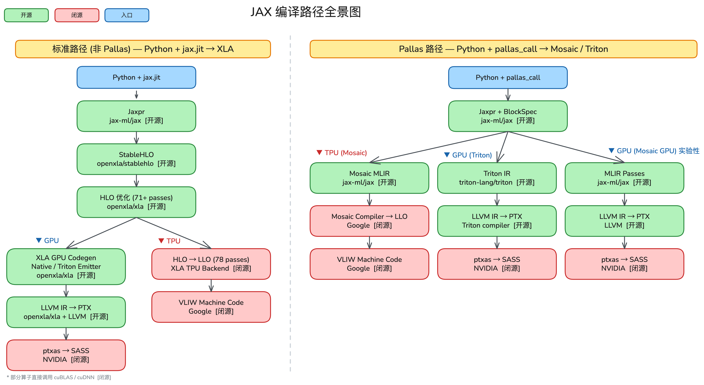

## TL;DR

一个 8 行的 `matmul → rms_norm → softmax → matmul` 函数，经过 TPU 编译器的 71 轮 HLO pass 和 78 轮 LLO pass，最终变成 ~250 条 VLIW bundles。本文追踪了这个过程中的每一层：

- **HLO 优化**：代数化简、Layout 从行优先转为 Tiling、多个 elementwise op 融合成单个 fusion kernel
- **LLO 生成**：一条 HLO dot 指令展开为 MXU 的 `vmatpush`/`vmatres` 指令序列，reduction 变成 `vperm` + `vadd` 的 tree reduction
- **VLIW 打包**：MXU、VPU、XLU、DMA 等通道的指令被调度进同一个 bundle 并行执行

TPU 编译器从 HLO 开始就是闭源的（libtpu），Google 公开的资料极少。本文参考了 [From JAX to VLIW: Tracing a Computation](https://patricktoulme.substack.com/p/from-jax-to-vliw-tracing-a-computation) 并补充了一些细节。



## 名词解释

- **VLIW** (Very Long Instruction Word) — 超长指令字
- **IR** (Intermediate Representation) — 编译器中间表示
- **XLA** (Accelerated Linear Algebra) — Google 开源的 ML 编译器
- **LLVM** — 编译器组件及工具链, 包含了编译器前端和后端
- **HLO** (High Level Operations) — 类似 Python 中的 FX IR
- **LLO** (Low Level Operations) — 类似 GPU 上的 PTX
- **SSA** (Static Single Assignment) — 静态单赋值

<details>
<summary>展开：SSA 的核心概念</summary>

核心规则：**每个变量只被赋值一次。**

**对比理解**

```python
# 非 SSA（普通代码，变量可以反复赋值）
x = 1
x = x + 2
x = x * 3

# SSA（每次赋值产生新变量）
x1 = 1
x2 = x1 + 2
x3 = x2 * 3
```

**在 HLO 中的体现**

`mini_attention` dump 出来的 HLO 就是 SSA 形式：

```
%dot.0 = f32[16,64] dot(%arg0, %arg1)       ← 每个 %名字 只出现在等号左边一次
%mul.1 = f32[16,64] multiply(%dot.0, %dot.0)
%reduce.2 = f32[16,1] reduce(%mul.1, ...)
%sqrt.3 = f32[16,1] sqrt(%reduce.2)
%div.4 = f32[16,64] divide(%dot.0, %sqrt.3)
```

没有任何变量被重新赋值。`%dot.0` 定义一次，后续只被读取。

**为什么编译器都用 SSA**

因为它让优化 pass 的分析变得极其简单：

- **数据流追踪**：看到 `%div.4`，顺着定义链往上走，一定能找到唯一的来源
- **死代码消除**：如果一个 `%名字` 没有被任何其他指令引用 → 直接删掉
- **公共子表达式消除**：两个指令产生相同结果 → 合并成一个

几乎所有现代编译器 IR 都是 SSA：LLVM IR、HLO、Triton IR、MLIR 的各种 dialect。

> **Insight**：HLO 的 SSA 图结构意味着每个值只定义一次，计算之间的依赖关系构成一个有向无环图（DAG）。这种结构让编译器可以自由调整执行顺序——只要尊重数据依赖，把独立的计算并行化、把相邻的计算融合，都很自然。

</details>

## 示例代码

```python
import os

# Create dump directories
DUMP_ROOT = "compiler_dump/"
HLO_DUMP_PATH = os.path.join(DUMP_ROOT, "hlo")
LLO_DUMP_PATH = os.path.join(DUMP_ROOT, "llo")

os.makedirs(HLO_DUMP_PATH, exist_ok=True)
os.makedirs(LLO_DUMP_PATH, exist_ok=True)

os.environ["XLA_FLAGS"] = (
    f"--xla_dump_hlo_as_text "
    f"--xla_dump_to={HLO_DUMP_PATH} "
    f"--xla_dump_hlo_pass_re=.* "
)

os.environ["LIBTPU_INIT_ARGS"] = (
    f"--xla_jf_dump_to={LLO_DUMP_PATH} "
    f"--xla_jf_dump_hlo_text=true "
    f"--xla_jf_dump_llo_text=true "
    f"--xla_jf_dump_llo_html=false "
    f"--xla_jf_dump_llo_static_gaps=true "
    f"--xla_jf_emit_annotations=true "
    f"--xla_jf_debug_level=2"
)

# Import JAX after setting env vars
import jax
import jax.numpy as jnp


@jax.named_call
def matmul_1(x, w1):
    """Stage 1: Linear projection (like Q @ K^T)"""
    return x @ w1


@jax.named_call
def rms_norm(h):
    """Stage 2: RMS Normalization"""
    rms = jnp.sqrt(jnp.mean(h ** 2, axis=-1, keepdims=True) + 1e-6)
    return h / rms


@jax.named_call
def softmax(h):
    """Stage 3: Softmax (row-wise, numerically stable)"""
    h_max = jnp.max(h, axis=-1, keepdims=True)
    exp_h = jnp.exp(h - h_max)
    return exp_h / jnp.sum(exp_h, axis=-1, keepdims=True)


@jax.named_call
def matmul_2(h, w2):
    """Stage 4: Output projection (like attention @ V)"""
    return h @ w2


def mini_attention(x, w1, w2):
    """
    A minimal attention-like block:
    matmul → rms_norm → softmax → matmul
    """
    h = matmul_1(x, w1)
    h = rms_norm(h)
    h = softmax(h)
    out = matmul_2(h, w2)
    return out


def main():
    # Small shapes to keep IR readable
    batch, d_in, d_mid, d_out = 16, 64, 64, 32

    # Create inputs
    key = jax.random.PRNGKey(42)
    k1, k2, k3 = jax.random.split(key, 3)

    x = jax.random.normal(k1, (batch, d_in))
    w1 = jax.random.normal(k2, (d_in, d_mid)) * 0.02
    w2 = jax.random.normal(k3, (d_mid, d_out)) * 0.02

    # JIT compile and run
    jitted_fn = jax.jit(mini_attention)

    # First call triggers compilation (and IR dump)
    result = jitted_fn(x, w1, w2)

    # Block until computation is done
    result.block_until_ready()

    print(f"Input shape:  {x.shape}")
    print(f"Output shape: {result.shape}")
    print(f"Output sample: {result[0, :5]}")
    print(f"\nDumps written to:")
    print(f"  HLO: {HLO_DUMP_PATH}")
    print(f"  LLO: {LLO_DUMP_PATH}")


if __name__ == "__main__":
    main()
```

代码非常简洁，一共四个操作：`matmul_1` → `rms_norm` → `softmax` → `matmul_2`。这段代码抽取了 Attention 计算的骨架，可以用最短的代码来研究 Attention 计算时触发了什么样的编译器优化（fusion、tiling、pipeline overlap）。

| 真实 Self-Attention | mini_attention |
|---|---|
| `Q, K, V = x @ Wq, x @ Wk, x @ Wv` | `h = x @ w1` — matmul |
| `scores = Q @ K^T / sqrt(d_k)` | `h = rms_norm(h)` — normalize |
| `weights = softmax(scores)` | `h = softmax(h)` — softmax |
| `output = weights @ V` | `out = h @ w2` — matmul |

## 编译流程概览

TPU 编译器会把这段代码先 trace 一次，变成 Jaxpr（通过 [jax-ml/jax](https://github.com/jax-ml/jax) 实现，开源）。随后 Jaxpr 被编译成 StableHLO（通过 [openxla/stablehlo](https://github.com/openxla/stablehlo) 实现，开源），StableHLO 被优化成 HLO（通过 [openxla/xla](https://github.com/openxla/xla) 实现，开源），HLO 被优化成 LLO（闭源），LLO 被打包成 VLIW（闭源）。

```
Python + jax.jit
    │  ← tracing
  Jaxpr
    │  ← lowering
  StableHLO
    │  ← lowering
  HLO
    │  ← lowering (闭源 libtpu)
  LLO
    │  ← lowering (闭源 libtpu)
  VLIW Machine Code
```

<details>
<summary>展开：71+ HLO passes 和 78 LLO passes 是什么意思</summary>

这里的 "pass" 是编译器术语，指的是**优化遍**——编译器对 IR 做的一次转换/优化操作。

**类比理解**

就像写文章时的多轮修改：

```
第 1 遍：改错别字        → 编译器：常量折叠 (constant folding)
第 2 遍：删冗余段落      → 编译器：死代码消除 (dead code elimination)
第 3 遍：合并相似章节    → 编译器：算子融合 (operator fusion)
第 4 遍：调整段落顺序    → 编译器：指令调度 (instruction scheduling)
...
第 71 遍：最终润色       → 编译器：内存布局优化 (layout assignment)
```

每个 pass 读入当前 IR，做一种特定优化，输出优化后的 IR。多个 pass 串联起来就是完整的编译流水线。

| | 71+ HLO passes | 78 LLO passes |
|---|---|---|
| 作用阶段 | HLO → 优化后的 HLO | LLO → 优化后的 LLO → VLIW |
| 抽象层级 | 高层，硬件无关 | 低层，TPU 硬件特定 |
| 典型优化 | 算子融合、代数化简、SPMD 分片 | 指令调度、寄存器分配、DMA 流水线 |
| 可见性 | `--xla_dump_hlo_pass_re=.*` 可 dump | `--xla_jf_dump_llo_text=true` 可 dump |

用 `mini_attention` 代码跑一下 dump，你会在 `hlo/` 目录下看到类似这样的文件：

```
module_0001.jit_mini_attention.before_optimizations.txt    ← 原始 HLO
module_0001.jit_mini_attention.006.algebraic_simplifier.txt ← 第 6 个 pass 后
module_0001.jit_mini_attention.015.fusion.txt               ← 第 15 个 pass 后
...
module_0001.jit_mini_attention.071.after_optimizations.txt  ← 最终 HLO
```

每个文件就是一个 pass 执行后的 HLO 快照，可以对比前后差异，看编译器**具体做了什么优化**。

> **Insight**：71 和 78 不是固定数字——pass 的数量会随 XLA/libtpu 版本和输入计算图的不同而变化。重点不是具体数字，而是理解编译器会做**几十遍**优化，每遍做一种特定变换。

</details>

## HLO 优化

### Algebraic Simplifier（代数简化）

```
// Before (pass #5)
%constant.6 = f32[] constant(64)
%broadcast.7 = f32[16,1]{1,0} broadcast(%constant.6), dimensions={}
%divide.18 = f32[16,1]{1,0} divide(%reshape.17, %broadcast.7)

// After (pass #6)
%constant = f32[] constant(0.015625)
%broadcast = f32[16,1]{1,0} broadcast(%constant), dimensions={}
%multiply = f32[16,1]{1,0} multiply(%reshape.17, %broadcast)
```

除法在硬件上的开销很高，编译器提前计算 `1/64 = 0.015625`，把除法转换为乘法。

### Layout Assignment（布局分配）

Layout `{1,0}` 表示行优先存储顺序（row-major）。`{1,0}` 中数字越小的维度在内存中越连续：先遍历 dim 1（列方向），再遍历 dim 0（行方向），即 dim 1 在内存中连续 → 行优先。

<details>
<summary>展开：Layout {1,0} 与 Tiling :T(8,128) 详解</summary>

**Layout `{1,0}` — 行优先存储顺序**

`{1,0}` 表示维度的存储优先级：**数字越小的维度在内存中越连续。**

```
f32[16,64]{1,0}
  │ │
  │ └─ dim 0 (16行) 优先级 0 → 内存中最连续（外层）
  └─── dim 1 (64列) 优先级 1 → 内存中次连续（内层）
```

`{1,0}` 意思是：先遍历 dim 1，再遍历 dim 0 → dim 1（列）在内存中连续 → 行优先（row-major）

具体内存布局（4×4 简化示例）：

```
逻辑视图：          内存中的实际排列（行优先 {1,0}）：
 0  1  2  3        [0, 1, 2, 3, 4, 5, 6, 7, 8, 9, 10, 11, 12, 13, 14, 15]
 4  5  6  7         ├─ 第0行 ─┤├─ 第1行 ─┤├─ 第2行 ──┤├──  第3行 ──┤
 8  9 10 11        同一行的元素在内存中紧挨着
12 13 14 15
```

**Tiling `:T(8,128)` — TPU 硬件对齐的分块**

TPU 的 VPU（向量处理单元）硬件结构是 **8 sublanes × 128 lanes**：

```
VPU 硬件结构（一次能处理的数据块）：
             ─────── 128 lanes ────────
  lane0  lane1  lane2  ...       lane127   sublane 0
  lane0  lane1  lane2  ...       lane127   sublane 1
  ...                                      ...
  lane0  lane1  lane2  ...       lane127   sublane 7

  = 8 × 128 = 1024 个元素，一拍处理完
```

`:T(8,128)` 就是告诉编译器：**把张量切成 8×128 的小块，每块刚好喂满 VPU 一次。**

```
f32[16,64]{1,0:T(8,128)}
```

原始张量 [16, 64] 加上 `T(8,128)` 后，编译器会这样处理：

```
tile(0,0): 8×128 (64列 实际数据 + 64列 padding 补零)  行 0-7
tile(1,0): 8×128 (64列 实际数据 + 64列 padding 补零)  行 8-15

列方向只有 64，不够 128 → 自动 padding 到 128
```

**为什么这么做**

- 没有 tiling：VPU 要处理 [16,64] → 数据形状和硬件不匹配 → 需要额外的 reshape / padding → 慢
- 有 tiling `T(8,128)`：数据预先按 8×128 排列 → 每个 tile 直接塞进 VPU → 零开销，硬件满载运行

> **Insight**：这就是为什么 TPU 上 tensor shape 最好是 128 的倍数——如果不是，编译器会自动 padding，浪费内存和计算。比如 `f32[16]{0:T(128)}` 里 16 个元素要 pad 到 128，利用率只有 12.5%，而 `f32[128]{0:T(128)}` 利用率 100%。做 Pallas kernel 时选择 BlockSpec 的 `block_shape`，也应该对齐到 `(8, 128)` 或其倍数。

</details>

### Fusion 与 Multi-Output Fusion（融合与多输出融合）

将局部的多个 HLO 操作融合到一个 op 里面。`kind=kLoop` 表示元素级融合；`kind=kOutput` 表示生产者与消费者的融合（生产者的产出立即被消耗）。

`dot` 变成了 `convolution`——TPU 编译器以这种方式规范化矩阵乘法，因为这两个操作映射到同一个 MXU 硬件。

当多个 fusion 共享一个共同操作数时，可以进一步合并。多输出融合（pass #43）识别具有共享输入的兄弟 fusion 并组合，返回 tuple。在此之前，输入归一化路径和均方根归约路径的 matmul 会在不同的 fusion 中各算一次。多输出融合会合并它们——matmul 只发生一次，归一化结果（`convolution.3`）和平方和（`reduce.0`）一起返回。否则要么重新计算 matmul，要么在 fusion 间将其溢出到 HBM。

### Memory Space Assignment & Async Scheduling（内存空间分配与异步调度）

最后一组 pass 将张量分配到特定内存空间，并插入异步存储操作。在 HLO 中，内存空间以 `S(n)` 标注：

- **`S(0)`**（通常省略）— HBM（高带宽内存，片外）
- **`S(1)`** — VMEM（片上 SRAM）
- **`S(2)`、`S(3)` 等** — 额外的设备专用内存空间

注意参数一开始没有 `S(1)` 标注——它们存在于 HBM 中。`copy-start` / `copy-done` 配对是异步 DMA 操作，将数据从 HBM 搬到 VMEM。`copy-start` 返回的 tuple 包含目标缓冲区（在 `S(1)` 中）、源引用和同步令牌（在 `S(2)` 中）。

编译器将内存传输与计算重叠：

1. `copy-start(w1)` — 发起 w1 从 HBM → VMEM 的 DMA 传输
2. `copy-done(w1)` — 等待传输完成，用于 matmul₁
3. `copy-start(w2)` — 在 RMS norm 和 softmax 执行的**同时**，发起 w2 的 DMA 传输
4. `copy-done(w2)` — 等待传输完成，用于 matmul₂

以上涵盖了 HLO 优化流程。到这一步，我们已经有了融合后的调度操作和内存标注——但仍然相对硬件无关。接下来，TPU 后端将每个 fusion 转换为 LLO（Low Level Operations），这一层直接映射到物理硬件单元。

## LLO：从 HLO 到机器码

### TPU 硬件单元

- **MXU（Matrix Unit）**：两个 256×256 的脉动阵列（systolic array），用于矩阵乘法。FLOPS 的主要来源。
- **VPU（Vector Processing Unit）**：处理 8 sublanes × 128 lanes 的元素级操作（add、mul、exp 等）。
- **XLU（Transpose Unit）**：跨 lane 的 shuffle、转置和排列。
- **Scalar Unit**：标量操作、地址计算和控制流。
- **DMA Engine**：HBM 与 VMEM 之间的异步内存传输。

编译器要让 MXU、VPU、DMA 在同一个时钟周期内同时工作。

VLIW 架构是 TPU 和 GPU 的一个根本差异。GPU 靠大量线程来隐藏延迟（一个线程等数据时切换到另一个线程），硬件负责调度。TPU 靠编译器静态排好每一拍每个单元干什么，没有线程切换。这意味着 TPU 编译器的调度质量直接决定硬件利用率——排得好就满载，排得差就空转。这也是 libtpu 闭源部分的核心价值所在。

### 追踪 `multiply_reduce_fusion`

让我们追踪 `multiply_reduce_fusion`——计算第一个矩阵乘法以及 RMS 归一化所需的平方和——如何从初始 LLO 转换为最终机器码。

编译器首先将 fused HLO region 转换为冗长且未经调度的 LLO 表示。矩阵乘法的开头如下：

```
$region0: #{multiply_reduce_fusion}
  #allocation0 [shape = 'f32[1024]{0}', space=vmem, size = 0x1000, tag = 'scoped memory']
  #allocation1 [shape = 'f32[16]{0:T(1024)S(1)}', space=vmem, size = 0x1000, tag = 'reduce buffer']

  %s0 = inlined_call_operand.hbm [shape: f32[16,64], index: 0, kind: input]
  %s1 = inlined_call_operand.vmem [shape: f32[64,64], index: 1, kind: input]
  %s2 = inlined_call_operand.vmem [shape: f32[16], index: 2, kind: output]
  %s3 = inlined_call_operand.vmem [shape: f32[16,64], index: 3, kind: output]
```

编译器分配 VMEM 缓冲区，并确定操作数 0 来自 HBM，而操作数 1 已在 VMEM 中。这是一种**多输出融合**——同时产生 matmul 结果（`%s3`）和 RMS norm 的平方和（`%s2`）。

初始的 MXU 操作使用 `vmatpush` 将权重列加载到脉动阵列中：

```
%v63 = vld [vmem:[%s55] sm:$0xff]
%64 = vmatpush.bf16.msra.mxu0 %v63
...
%v93 = vld [vmem:[#allocation0] sm:$0xff]
%94 = vmatmul.bf16.gmra.mxu0 %v93
%v95 = vpop.f32.mrf.mxu0
```

该序列以 bf16 精度通过 MXU 传输权重 tile，然后弹出累积的 f32 结果。

<details>
<summary>展开：Weight Tile 与 vmatpush 的工作原理</summary>

**"Weight tile" 就是权重矩阵的一个分块。**

MXU 是 256×256 的脉动阵列，但权重矩阵通常远大于此。所以编译器会把权重矩阵切成适合 MXU 尺寸的小块（tile），逐块送入计算：

```
权重矩阵 W [1024 × 1024]

  | tile 0   | tile 1   | tile 2   | tile 3   |
  | 128×128  | 128×128  | 128×128  | 128×128  |
  | tile 4   | tile 5   | ...      | ...      |
  | ...      | ...      | ...      | ...      |

每个 tile 大小匹配 MXU 能一次处理的维度
```

**`vmatpush` 做的事**

`vmatpush` 是把一个 weight tile 的列**逐列推入**脉动阵列：

```
MXU 脉动阵列（简化为 4×4 示意）
vmatpush 第1列 →  [w0][ ][ ][ ]
vmatpush 第2列 →  [w0][w1][ ][ ]
vmatpush 第3列 →  [w0][w1][w2][ ]
vmatpush 第4列 →  [w0][w1][w2][w3]  ← 权重 tile 加载完毕

然后 vmatmul：激活值从左侧流入 → 结果从底部流出
最后 vpop：取出累积的 f32 结果
```

所以你看到的那行代码：

```
vmatpush3.bf16.msra.mxu0 %v61_v7   ← 把一个 bf16 权重 tile 推入 MXU
vpack.c.bf16 %v253_v14, %v85_v13   ← VPU 同时在打包下一个 tile 的数据
dma.done.wait [#allocation4], 256   ← DMA 同时确认下下个 tile 已从 HBM 搬到 VMEM
```

三个硬件单元**同时工作**，形成流水线：MXU 在算当前 tile，VPU 在准备下一个 tile，DMA 在搬运再下一个 tile。

> **Insight**：`vmatpush3` 中的 `3` 表示一次推入 3 列（而非 1 列），是 `vmatpush` 的优化版本，减少指令数量。这种"计算-准备-搬运"三级流水线就是 VLIW 的核心价值——编译器**静态调度**让所有硬件单元在每个时钟周期都有活干，不会闲等。

</details>

### 归约模式

在 matmul 之后，我们需要对列的平方值求和。编译器使用 **XLU（转置单元）** 生成 cross-lane reduction：

```
%141 = vxpose.xlu0.b32.start [1/2] (short) /*vx=*/%v138, /*width=*/128
%142 = vxpose.xlu0.b32.end [2/2] (short) /*vx=*/%v140, /*width=*/128
%v143 = vpop.trf.xlu0
%v144 = vpop.trf.xlu0
...
%v158 = vpop.trf.xlu0  // 16 pops total
```

转置后，树状归约将 16 条 lane 的数据相加：

```
%v161 = vadd.f32 0.0, %v143
%v165 = vadd.f32 %v161, %v144
%v169 = vadd.f32 %v165, %v145
...
%v221 = vadd.f32 %v217, %v158
```

然后通过 sublane 旋转模式完成最终归约：

```
%v223 = vrot.slane %v221, 4   // rotate by 4
%v226 = vadd.f32 %v221, %v223
%v228 = vrot.slane %v226, 2   // rotate by 2
%v231 = vadd.f32 %v226, %v228
%v233 = vrot.slane %v231, 1   // rotate by 1
%v236 = vadd.f32 %v231, %v233
```

这种经典的并行归约模式使用 log₂(n) 步——旋转 4、2、1——将 8 个 sublane 的值归约为单一标量。

<details>
<summary>展开：TPU 上归约求和的硬件实现</summary>

这段描述的是 TPU 上做**归约求和**（把很多数加成一个数）的硬件实现。分两个阶段，对应 VPU 的 8 sublanes × 128 lanes 结构。

**第一阶段：跨 lane 归约（XLU 转置）**

VPU 有 128 条 lane，数据分散在各 lane 里。问题是：**每条 lane 只能访问自己的数据，不能直接读别的 lane。**

XLU 转置单元就是用来解决这个问题的——它把数据在 lane 之间重新排列：

```
转置前（每条 lane 各持一个值）：      转置后：
  lane 0:  [a]                        向量1 = [lane 0-7 的数据]
  lane 1:  [b]                        向量2 = [lane 8-15 的数据]
  lane 2:  [c]                        ...
  ...                                 向量16 = [lane 120-127 的数据]
  lane 127: [x]
```

`vxpose → vpop.trf × 16` 次，把 128 条 lane 的数据收集到 16 个向量里。

然后 16 个 `vadd.f32` 把这 16 个向量逐一累加 → 128 条 lane 的数据被加到了一起。

此时跨 lane 的求和完成了，但结果还分布在 **8 条 sublane** 上，每条 sublane 各持一个部分和。

**第二阶段：跨 sublane 归约（旋转 + 加法）**

这是经典的**并行归约**，和 CUDA shared memory reduction 的思路完全一样：

```
初始状态（8 条 sublane 各持一个部分和）：
  sublane:  [0]  [1]  [2]  [3]  [4]  [5]  [6]  [7]
  值：       a    b    c    d    e    f    g    h

第 1 步: vrot.slane 4 → 旋转 4 位
  原始：     a    b    c    d    e    f    g    h
  旋转4:     e    f    g    h    a    b    c    d
  vadd:    a+e  b+f  c+g  d+h  ...  ...  ...  ...
  → 8 个值变成 4 组部分和

第 2 步: vrot.slane 2 → 旋转 2 位
  vadd:    aceg bdfh  ...  ...
  → 4 组变成 2 组

第 3 步: vrot.slane 1 → 旋转 1 位
  vadd:    abcdefgh  ...
  → 最终求和完成！sublane 0 持有全部 8 个值的和
```

> **Insight**：`log₂(8)` = 3 步就能归约 8 个值——每步参与运算的数量减半（8→4→2→1），这就是并行归约的威力。这个模式和 GPU 上的 warp shuffle reduction（`__shfl_xor_sync`）几乎一模一样——都是"移位 + 加法"的树形结构，只是 GPU 移位发生在 warp 的 32 个线程之间，TPU 移位发生在 VPU 的 8 条 sublane 之间。两阶段分工清晰：**XLU 负责跨 lane（硬件转置），VPU 负责跨 sublane（旋转+加法）**——各硬件单元做自己最擅长的事。

</details>

### VLIW Bundle 打包

所有优化 pass 完成后，编译器生成 **71 个紧密打包的 VLIW bundle**。每个 bundle 将独立操作分组，在硬件单元间并行执行——编译器静态地将独立操作打包到固定宽度的 bundle 中，硬件在同一个时钟周期同时执行 bundle 内所有操作，无需运行时依赖检查。

```
0x9 : { %22 = dma.hbm_to_vmem [thread:$0] /*hbm=*/%s359_s0, ...
       %v28_v1 = vlaneseq
       %v301_v2 = vmov 0.0
       %vm302_vm0 = vmmov 0
       %v247_v4 = vld [vmem:[%s360_s1 + $0x30] sm:$0xff]
       %v248_v5 = vld [vmem:[%s360_s1 + $0x38] sm:$0xff]
       %v249_v6 = vld [vmem:[%s360_s1 + $0x20] sm:$0xff] }
```

这单个 bundle 同时执行 **7 项操作**：1 项 HBM→VMEM 的 DMA 传输、1 条 lane 序列生成、2 项常量初始化和 3 项 VMEM 加载。

MXU 操作使用优化后的 `vmatpush3` 指令：

```
0xc : { %261 = vmatpush3.bf16.msra.mxu0 %v61_v7
        %v89_v15 = vpack.c.bf16 %v253_v14, %v85_v13
        %297 = dma.done.wait [#allocation4], 256 }
```

三个并行操作：weight tile 推入 MXU，为下一次推送打包 bf16 值，以及 DMA 同步。`bf16` 后缀表示该 matmul 在 MXU 上使用 bfloat16 精度，吞吐量是 f32 的 2 倍。

matmul 结果提取使用掩蔽变体：

```
0x14 : { %269 = vmatmul.mubr.msk.bf16.vlgmr.msra.gmra.mxu0 %vm257_vm2, %v258_v18 }
0x15 : { %v95_v19 = vpop.f32.mrf.mxu0 }
0x16 : { %v98_v20 = vmul.f32 %v95_v19, %v95_v19
         %105 = vst [vmem:[%s362_s3] sm:$0xff] /*vst_source=*/%v95_v19 }
```

平方运算在 bundle `0x16` 中立即发生，与存储 matmul 结果重叠——多输出融合允许我们对两个输出复用 `%v95_v19`。

<details>
<summary>展开：Bundle = VLIW 指令 = 一个时钟周期</summary>

**一个 bundle = 一条 VLIW 指令 = 一个时钟周期。**

一个 bundle（一个时钟周期内同时执行）：

```
| MXU 指令    | VPU 指令     | XLU 指令 | DMA 指令       |
| vmatpush3   | vpack.bf16   | (空)     | dma.done.wait  |
```

所以 **71 bundles = 这个 fusion 从头到尾执行需要 71 个时钟周期**（不算 DMA 等待等延迟）。

不同 fusion 的 bundle 数直接反映了计算复杂度——bundle 越多，执行时间越长。

> **Insight**：Bundle 数量也是编译器优化效果的直接指标：同样的计算逻辑，如果编译器能更好地把 MXU/VPU/DMA 操作塞进同一个 bundle（而不是各占一个 bundle），总 bundle 数就会更少，执行更快。这就是编译器做 **instruction scheduling**（指令调度）的核心目标。你在 LLO dump 里看到的 `0xc : { ... }` 这种格式，`0xc` 就是 bundle 编号（十六进制），花括号里的所有指令在同一个周期并行执行。

</details>

<details>
<summary>展开：编译器如何优化 Bundle 数量</summary>

编译器优化的目标是两个维度：

1. **Bundle 数量越少** → 总时钟周期少 → 执行快
2. **每个 Bundle 越满** → 硬件利用率高 → 没有浪费

```
差的调度（12 bundles，很多槽位空闲）：
  周期1: { vmatpush   | (空)    | (空)  | (空)      }
  周期2: { (空)       | vpack   | (空)  | (空)      }
  周期3: { (空)       | (空)    | (空)  | dma.start }
  ...

好的调度（4 bundles，槽位尽量填满）：
  周期1: { vmatpush   | vpack   | (空)  | dma.start }
  周期2: { vmatpush   | vadd    | (空)  | dma.wait  }
  ...
```

两者其实是一回事——把能并行的指令塞进同一个 bundle，总 bundle 数自然就减少了。

但有个重要限制：**不是所有指令都能随意并行**。比如：

- 指令 B 依赖指令 A 的结果 → 必须在 A 之后的 bundle
- MXU 每个 bundle 只能发一条指令 → 两个 `vmatpush` 不能同周期
- DMA 传输有延迟 → `dma.start` 和 `dma.done.wait` 之间必须隔足够多的 bundle

所以编译器做的是在这些**硬件约束和数据依赖**下，找到最紧凑的排列。这就是 LLO 78 个 pass 中相当大一部分在做的事情。

> **Insight**：这和 CPU 的乱序执行（out-of-order execution）解决的是同一个问题——指令级并行。区别是：CPU 由**硬件**在运行时动态调度，TPU 由**编译器**在编译时静态调度。TPU 把调度复杂度从芯片搬到了编译器，硬件更简单、功耗更低、面积更多留给计算单元。这也是为什么 TPU 编译器质量如此关键——CPU 上编译器调度差一点，硬件还能补救；TPU 上编译器排得不好，硬件就老老实实按低效顺序执行。

</details>

### 五个 Fusion 总览

`mini_attention` 最终被编译器编译进 5 个 fusion，每个 fusion 都有自己的 LLO IR，产生不同数量的 VLIW bundle：

**multiply_reduce_fusion（71 bundles）** — 实现 `matmul_1` 和平方和归约，为 RMS 归一化做准备。MXU0 执行 bf16 matmul，VPU 立即计算平方值，XLU0 执行跨 lane 转置归约，DMA 从 HBM 流式传输输入激活数据。

**add_sqrt_fusion（10 bundles）** — 最简单的 fusion，计算 `sqrt(mean + epsilon)` 以实现 RMS 归一化。常数 `0.015625`（即 `1/64`）对应均值计算，`vrsqrt.f32` 指令计算倒数平方根。

**fusion.5（56 bundles）** — 计算跨行的 `reduce_max`，为 softmax 数值稳定计算做准备。模式类似求和归约，但使用 `max` 运算代替 `add`。

**fusion.2（65 bundles）** — 实现 `exp(x - max) + reduce_sum`，即 softmax 的分子和分母。`vpow2` 指令计算指数。

**fusion（48 bundles）** — 最终的 `matmul_2`，将 softmax 输出乘以值矩阵。比 `multiply_reduce_fusion` 小，因为是纯 matmul，没有额外归约。

## TLP：顶层调度

**TLP（Top Level Program）** 负责协调整个 `mini_attention` 的执行——编排所有五个 fusion 的调用顺序并管理数据流。

TLP 共 174 个 bundle（`0x00`-`0xad`），执行流程如下：

```
0x5f-0x65 : 程序入口和模式检查
0x66-0x7d : DMA: 从 HBM 加载权重矩阵 (copy-start)
0x7e-0x82 : 调用 multiply_reduce_fusion (matmul_1 + 平方和)
0x83-0x8d : DMA: 开始加载值矩阵 (copy-start.1)
0x8e-0x91 : 调用 add_sqrt_fusion (RMS norm 的 sqrt)
0x92-0x96 : 调用 fusion.5 (softmax 的 reduce_max)
0x97-0x9b : 调用 fusion.2 (softmax 的 exp + reduce_sum)
0x9c-0xa0 : DMA: 等待值矩阵传输完成
0xa1-0xa6 : 调用 fusion (matmul_2)
0xa7-0xad : 程序收尾
```

### DMA 编排

TLP 仔细地将内存传输与计算重叠。首先加载第一个 matmul 的权重矩阵：

```
0x77 : { %26 = dma.hbm_to_vmem [thread:$1] /*hbm=*/%s10_s14,
             /*size_in_granules=*/%s22_s17, /*vmem=*/%s24_s19,
             /*dst_syncflagno=*/[#allocation8] }
```

DMA 使用 `thread:$1`——TPU 拥有多个 DMA 引擎，允许并发传输。发起传输后，TLP 立即等待完成，然后调用第一个 fusion：

> 注意：这里的 "thread" 指的是 DMA 引擎的多个独立通道。TPU 的控制流是单线程的——只有一个 PC（程序计数器）顺序遍历 bundle 序列。但各硬件单元（MXU、VPU、DMA 各通道）是并行执行的，每个 bundle 只是在每个周期给它们各自下达命令。

```
0x7a : { %293 = dma.done.wait [#allocation8], 1024 }
0x7b : { %294 = vsyncadd [#allocation8], 4294966272 }
0x7c : { %39 = vsyncpa [#allocation8], 1 }
0x81 : { %45 = inlined_call %s9_s0, %s299_s1, %s300_s2, %s301_s3
              /* %multiply_reduce_fusion = fusion(%Arg_0.1, %copy-done) */ }
```

### 计算与通信 Overlap

在 RMS norm fusion 运行时，TLP 开始加载第二个 matmul 的值矩阵：

```
0x8c : { %56 = dma.hbm_to_vmem [thread:$1] /*hbm=*/%s354_s25,
             /*size_in_granules=*/512, /*vmem=*/%s54_s23,
             /*dst_syncflagno=*/[#allocation13] }
```

该 DMA 在 `add_sqrt_fusion`、`fusion.5` 和 `fusion.2` 执行时在后台运行：

```
0x90 : { %66 = inlined_call ... /* %add_sqrt_fusion */ }
0x95 : { %71 = inlined_call ... /* %fusion.5 */ }
0x9a : { %76 = inlined_call ... /* %fusion.2 */ }
```

只有在最终 matmul 之前，TLP 才等待值矩阵传输完成：

```
0x9d : { %295 = dma.done.wait [#allocation13], 512 }
0xa5 : { %87 = inlined_call ... /* %fusion = final matmul */ }
```

softmax 计算利用 **double buffer** 隐藏了数据加载的 latency。

### Fusion 调用约定

每个 fusion 调用都通过 `inlined_call` 传递 VMEM 缓冲区地址。例如最终的 matmul：

```
0xa2 : { %s312_s0 = smov [#allocation12] /* materialized constant */
        %s355_s5 = sld [smem:[#allocation25_spill]]
        %s356_s5 = int_to_ptr.hbm [resolvable:$false] %s355_s5 }
0xa3 : { %s313_s1 = smov [#allocation16] /* materialized constant */
        %s314_s2 = smov [#allocation15] /* materialized constant */ }
0xa4 : { %s315_s3 = smov [#allocation11] /* materialized constant */
        %s316_s4 = smov [#allocation14] /* materialized constant */ }
0xa5 : { %87 = inlined_call %s312_s0, %s313_s1, %s314_s2, %s315_s3, %s316_s4, %s356_s5
              /* %fusion = fusion(%copy-done.1, %fusion.2, %fusion.5,
                                   %get-tuple-element.1, %add_sqrt_fusion) */ }
```

fusion 接收六个操作数：来自 HBM 的值矩阵（`copy-done.1`），以及所有之前 fusion 的中间结果。注意 `#allocation25_spill`——这是 scalar register 溢出到 SMEM（标量存储器），表明编译器的 scalar register 用完了，不得不暂时将一个值存到 SMEM。

> 寄存器溢出（register spill）会带来性能下降，应尽量避免。不过这里只是一个标量地址，数据量很小。每一级存储只会溢出到自己的下一级：register → SRAM → HBM。溢出的层级越深，性能开销越大。

### Trace & Profiling

在整个执行过程中，TLP 会插入 trace marker：

```
0x78 : { %30 = vtrace 2415919104 }  // After copy-start
0x82 : { %49 = vtrace 2415919106 }  // After multiply_reduce_fusion
0x91 : { %69 = vtrace 2415919108 }  // After add_sqrt_fusion
0x96 : { %74 = vtrace 2415919109 }  // After fusion.5
0x9b : { %79 = vtrace 2415919110 }  // After fusion.2
0xa6 : { %90 = vtrace 2415919112 }  // After final fusion
```

这些 trace ID 使 TPU profiling 工具能够测量每个 fusion 所花费的时间，帮助识别性能瓶颈。

TLP 以同步结束：

```
0xa9 : { %95 = vsettm %s317_s26 }        // Set timer mode
0xaa : { %96 = vdelay 1 }                 // Delay for pipeline drain
0xab : { %97 = sfence }                   // Memory fence
0xac : { %s318_s27 = smov 0 }
0xad : { %98 = sst [smem:[#allocation17]] %s318_s27 }  // Signal completion
```

`sfence` 确保所有内存操作在向 host 发出完成信号之前全部完成。

## 总结

本文通过追踪 HLO/LLO，展示了编译器如何将 8 行 JAX 代码编译为 250 条 VLIW bundle 指令。

具体来说，编译器通过 trace 整张计算图实现了 op 间的 fusion，并将 MXU/VPU/DMA/VMEM/SMEM 等硬件的指令捆绑打包，自动 overlap DMA 和计算操作。用户不需要手动做 shared memory 管理，不需要调用 `@triton.autotune`，不需要手动写 tiling 逻辑——这一切发生的起点，只有一行 `@jax.jit`。

通过编译器优化，TPU 给用户提供了更高的下限，但在某种程度上损失了灵活性——它的上限低于手动精调的 GPU kernel。在编译器做得不够好的时候，我们需要通过 Pallas 实现 kernel，从而手动控制硬件，做好 pipeline 的 overlap，来更好地压榨硬件。

核心要点：

- **Fusion** 是优化的核心，减少 HBM 数据搬运，将计算尽量保持在 SRAM 上
- **DMA** 通过 double buffer，将数据搬运隐藏到计算中
- **VLIW** 将多个独立 op 打包成一条指令，TLP 调度这些 fusion 的执行并管理数据 pipeline
- **HLO** 很好读懂，**LLO** 需要熟悉一些关键字：`vmatpush`、`vmatmul`、`vxpose`、`vpop.trf`、`vrot.slane` 等
- 编译器源码是闭源的（libtpu），但通过 dump 出来的 IR，你依然能看懂编译器做了什么

---

本文大量参考了 [From JAX to VLIW: Tracing a Computation](https://patricktoulme.substack.com/p/from-jax-to-vliw-tracing-a-computation)，并增加了一些自己作为新手的理解，感谢大佬分享。
