

本文翻译自 Jacob Peake 的 <a href="https://www.jacobpeake.com/ai-chip-architectures"><em>AI Chip Architectures</em></a>。原文作者：Jacob Peake；译者：Pengcheng。

在 2018 <a data-popup="isca">计算机体系结构国际研讨会上</a>， <em><strong><a href="https://en.wikipedia.org/wiki/John_L._Hennessy">John Hennessy</a></strong></em> 和 <em><strong><a href="https://en.wikipedia.org/wiki/David_Patterson_(computer_scientist)">David Patterson</a></strong></em> 发表了他们的 <a data-popup="turing-award">图灵</a> 讲座： <em><strong><a href="https://dl.acm.org/doi/10.1145/3282307">“计算机架构的新黄金时代”</a></strong></em>。 

在 20 世纪 80 年代， <em><strong>Hennessy</strong></em> 和 <em><strong>Patterson</strong></em> 进行了他们的图灵奖获奖研究，  单线程CPU性能每年增长52%。到 2018 年，随着 <em><strong><a href="https://en.wikipedia.org/wiki/Moore%27s_law">摩尔定律</a></strong></em> 和 <em><strong><a href="https://en.wikipedia.org/wiki/Dennard_scaling">登纳德缩放</a></strong></em>的结束，该比率为3%。

于是，Domain-Specific Architecture（DSA）成为重要方向。Hennessy 和 Patterson 以 Google 已投入生产的 <strong><a href="https://en.wikipedia.org/wiki/Tensor_Processing_Unit">TPU v1</a></strong> 为例：它的神经网络推理吞吐量是 CPU 的 29 倍，能效则高出 80 倍。最后，他们预测：<strong>“未来十年将迎来计算机架构的寒武纪大爆发。”</strong>

这一预测成真了。如今，已有数十种架构进入严肃开发阶段： <em><strong>GPU</strong></em>、 <em><strong>TPU</strong></em>、 <em><strong>LPU</strong></em>、 <em><strong>NPU</strong></em>、 <em><strong>DPU</strong></em>、 <em><strong>ASIC</strong></em>、 <em><strong>晶圆级引擎</strong></em>、 <em><strong>可重构数据流</strong></em>、 <em><strong>神经形态</strong></em>、 <em><strong>光子计算</strong></em>与 <em><strong>模拟计算</strong></em>。其中相当一部分聚焦于 AI 计算。

迄今为止已获得实际部署的架构： <em><strong>GPU</strong></em> （NVIDIA、AMD）、 <em><strong>脉动阵列加速器</strong></em> （TPU、Trainium）、 <em><strong>Cerebras 晶圆级引擎</strong></em>和 <em><strong>Groq LPU</strong></em>。

<em><strong>NVIDIA</strong></em> 是明确的领先者； <em><strong>AMD</strong></em> 紧随其后，并分别获得 <a href="https://openai.com/index/openai-amd-strategic-partnership/">OpenAI</a> 和 <a href="https://www.amd.com/en/newsroom/press-releases/2026-2-24-amd-and-meta-announce-expanded-strategic-partnersh.html">Meta</a> 各 6 GW 的部署承诺。 <em><strong>TPU</strong></em> 用于训练 Gemini，并将 <a href="https://www.anthropic.com/news/expanding-our-use-of-google-cloud-tpus-and-services">以多达 100 万颗芯片为 Anthropic 提供服务</a>；Anthropic 还在 <a href="https://techcrunch.com/2026/03/22/an-exclusive-tour-of-amazons-trainium-lab-the-chip-thats-won-over-anthropic-openai-even-apple/">超过一百万颗 <em><strong>Trainium</strong></em> 芯片</a>上运行 Claude。 <em><strong>Cerebras</strong></em> <a href="https://openai.com/index/cerebras-partnership/">现已承载 OpenAI 推理服务</a>； <em><strong>Groq LPU</strong></em> 则通过一笔 <a href="https://www.datacenterdynamics.com/en/news/nvidia-builds-out-lpu-chip-team-following-20bn-groq-acquihire-announcement-rumored-for-gtc/">价值 200 亿美元的 acquihire 交易</a>并入 NVIDIA。

本文将系统梳理这些不同路线的 <em>设计理念</em>、 <em>芯片架构</em>、 <em>扩展方式（纵向扩展与横向扩展）</em>以及 <em>软件栈（如何对芯片编程）</em>。

<h3 id="the-problem">问题</h3>

AI 计算以 <em><strong>矩阵乘法</strong></em>为主。 Transformer 是一系列 matmuls： <em><strong>Q/K/V 投影</strong></em>, <em><strong>attention</strong></em>, <em><strong>输出投影</strong></em>, <em><strong>FFN</strong></em> - 与逐元素操作交错：归一化、激活、残差添加。 <a data-popup="training">训练</a> 前沿模型执行 <math class="notranslate" translate="no" xmlns="http://www.w3.org/1998/Math/MathML"><semantics><mrow><msup><mn>10</mn><mn>25</mn></msup></mrow><annotation encoding="application/x-tex">10^{25}</annotation></semantics></math>1025 乘法累加运算（matmuls 是一系列乘法累加）。

其中的 <em>形状</em> matmuls 取决于工作负载。 <em><strong><a data-popup="training">训练</a></strong></em> 将一批序列向前推过每一层，反向传播损失并更新权重，同时有数千个令牌流经同一权重矩阵。 <em><strong><a data-popup="prefill">Prefill</a></strong></em> 是推理的提示摄取阶段：在生成第一个输出标记之前，通过模型单次投影的完整输入序列。训练和预填充都针对相同的权重矩阵堆叠许多令牌，因此每一层的数学都是一个大型 <em><strong>矩阵-矩阵</strong></em> 乘法 (GEMM)，具有高 <a data-popup="arithmetic-intensity">算术强度</a> （计算绑定）。 <em><strong><a data-popup="decode">解码</a></strong></em> 是自回归的：模型一次发出一个令牌，每个令牌都以其之前的每个令牌为条件，并且令牌 <em>N+1</em> 在生成令牌 <em>N</em> 之前无法开始。每一步仅投影一个令牌，因此每个 matmul 都成为一个 <em><strong>矩阵向量</strong></em> 产品（GEMV）。生成一个令牌需要完全通过模型中的每个权重，并完整读取 <a data-popup="kv-cache">KV 缓存</a> 以引起注意。与 <a data-popup="prefill">预填充</a>相比，算术强度下降了几个数量级。

推理系统通过批处理令牌将这些 GEMV 提升回 GEMM 来恢复部分强度： <em><strong><a data-popup="continuous-batching">连续批处理</a></strong></em> 堆叠许多用户的 <a data-popup="decode">解码</a> 步骤， <em><strong><a data-popup="speculative-decoding">推测解码</a></strong></em> 根据请求堆叠 K 个起草的令牌并一次性验证它们，并且 <em><strong><a data-popup="multi-token-prediction">多令牌预测</a></strong></em> 在模型本身内部折叠相同的技巧。这实现了 matmul 单元的更高利用率，并提高了 Ops/B。对于连续批处理，每个用户的请求仍然读取自己的 <a data-popup="kv-cache">KV Cache</a>，因此长上下文解码从weight-bandwidth-bound转变为KV-bandwidth-bound。

这里的架构问题是 <em><strong>将数字</strong></em> 移动到 matmul 发生得足够快的位置。这被称为 <em><strong><a data-popup="memory-wall">内存墙</a></strong></em>：计算量呈指数级增长，但内存带宽却没有。

每种架构都提出了不同的策略来赢得数据移动游戏。了解芯片可以简化为四个问题： <em>数据 <strong>在哪里</strong>，它如何 <strong>移动</strong> 到计算单元， <strong>计算单元</strong> 的外观，以及芯片如何在 <strong>规模</strong></em>上相互通信。

<h3 id="nvidia-gpu">NVIDIA GPU</h3>

NVIDIA GPU 是一个 <em><strong>大规模并行处理器</strong></em>。其理念是，由主机 CPU 编排并通过 <em><strong><a href="https://docs.nvidia.com/cuda/cuda-c-programming-guide/">CUDA</a></strong></em>公开的具有数千个线程的可编程芯片是运行 <em><strong>并行化的正确机器</strong></em> 工作负载。每一代都将加速原语添加到可编程 <em><strong>流式多处理器（SM）</strong></em> 上，而无需更改编程模型。同一芯片可训练Transformer、提供推理、渲染图形并运行科学模拟（<em><strong>加速计算</strong></em>）。

<h4 id="genealogy">演进路线</h4>

2006

<strong><em><a data-no-preview="" href="https://en.wikipedia.org/wiki/Tesla_(microarchitecture)">特斯拉</a></em></strong><a data-popup="g80">G80</a>

首款支持 CUDA 的 GPU； <a data-popup="unified-shaders">统一着色器</a> 和 <a data-popup="simt-execution-model">SIMT执行模型</a>。

2010

<strong><em><a href="https://www.nvidia.com/content/PDF/fermi_white_papers/NVIDIA_Fermi_Compute_Architecture_Whitepaper.pdf">Fermi</a></em></strong><a data-popup="gf100">GF100</a>

第一个真正的计算架构：统一的 L1/L2 缓存、双 <a data-popup="warp-schedulers">warp 调度程序</a>，IEEE-754 <a data-popup="fp64">FP64</a>。

2012

<strong><em><a href="https://www.nvidia.com/content/dam/en-zz/Solutions/Data-Center/tesla-product-literature/NVIDIA-Kepler-GK110-GK210-Architecture-Whitepaper.pdf">Kepler</a></em></strong><a data-popup="k20">K20</a>， <a data-popup="k40">K40</a>

<a data-popup="smx">SMX</a>、 <a data-popup="dynamic-parallelism">动态并行</a>、 <a data-popup="hyper-q">Hyper-Q</a>; GPU 可以启动自己的工作。

2014

<strong><em><a href="https://developer.nvidia.com/maxwell-compute-architecture">Maxwell</a></em></strong><a data-popup="m40">M40</a>

重新设计了 SM，约 2×Kepler的每瓦性能。

2016

<strong><em><a href="https://images.nvidia.com/content/pdf/tesla/whitepaper/pascal-architecture-whitepaper.pdf">Pascal</a></em></strong><a data-popup="p100">P100</a>

<a data-popup="nvlink">NVLink</a> 1.0， <a data-popup="hbm2">HBM2</a>，原生 <a data-popup="fp16">FP16</a> 吞吐量；第一款专为深度学习而设计的 GPU。

2017

<strong><em><a href="https://images.nvidia.com/content/volta-architecture/pdf/volta-architecture-whitepaper.pdf">Volta</a></em></strong><a data-popup="v100">V100</a>

<strong>首款 <a data-popup="tensor-cores">Tensor Core</a></strong>； <a data-popup="independent-thread-scheduling">独立线程调度</a>。

2018

<strong><em><a href="https://images.nvidia.com/aem-dam/en-zz/Solutions/design-visualization/technologies/turing-architecture/NVIDIA-Turing-Architecture-Whitepaper.pdf">图灵</a></em></strong><a data-popup="t4">T4</a>

第二代 <a data-popup="tensor-cores">Tensor Core</a> ，带有 <a data-popup="int8">INT8</a>/<a data-popup="int4">INT4</a>;第一个 <a data-popup="rt-cores">RT 内核</a>。

2020

<strong><em><a href="https://images.nvidia.com/aem-dam/en-zz/Solutions/data-center/nvidia-ampere-architecture-whitepaper.pdf">Ampere</a></em></strong><a data-popup="a100">A100</a>

第三代 <a data-popup="tensor-cores">Tensor Core</a> 与 <a data-popup="tf32">TF32</a> 和 <a data-popup="structured-sparsity">结构化稀疏</a>； <a data-popup="multi-instance-gpu">多实例 GPU</a> 分区。

2022

<strong><em><a href="https://resources.nvidia.com/en-us-hopper-architecture/nvidia-h100-tensor-c">Hopper</a></em></strong><a data-popup="h100">H100</a>、 <a data-popup="h200">H200</a>、 <a data-popup="gh200">GH200</a>

第四代 <a data-popup="tensor-cores">Tensor Core</a>， <a data-popup="fp8">FP8</a>, <a data-popup="transformer-engine">Transformer引擎</a>; <a data-popup="hbm3">HBM3</a>、 <a data-popup="tma">TMA</a>、线程块集群、异步 <a data-popup="wgmma"><code class="notranslate" translate="no">wgmma</code></a>。

2024

<strong><em><a href="https://resources.nvidia.com/en-us-blackwell-architecture/blackwell-architecture-technical-brief">Blackwell</a></em></strong><a data-popup="b100">B100</a>、 <a data-popup="b200">B200</a>、 <a data-popup="gb200">GB200</a>

第 5 代 <a data-popup="tensor-cores">Tensor Core</a> 与 <a data-popup="fp4">FP4</a>、 <a data-popup="tensor-memory">Tensor Memory (TMEM)</a>、 <a data-popup="two-die-chiplet-gpu">两芯片小芯片 GPU</a>、 <a data-popup="nvlink-5">NVLink 5</a>。

2025

<strong><em><a href="https://www.nvidia.com/en-us/data-center/gb300-nvl72/">Blackwell Ultra</a></em></strong><a data-popup="b300">B300</a>, <a data-popup="gb300">GB300</a>

周期中刷新：~1.5× <a data-popup="fp4">FP4</a> 吞吐量，288 GB <a data-popup="hbm3e">HBM3e</a>。针对长上下文推理进行了调整。

2026

<strong><em><a href="https://nvidianews.nvidia.com/news/nvidia-unveils-rubin-cpx-a-new-class-of-gpu-designed-for-massive-context-inference">Rubin</a></em></strong><a data-popup="rubin">Rubin</a>， <a data-popup="vr200">VR200</a>、 <a data-popup="rubin-cpx">Rubin CPX</a>

<a data-popup="hbm4">HBM4</a>、第三代 <a data-popup="transformer-engine">Transformer引擎</a>、 <a data-popup="vera-cpu">Vera CPU</a> 配对，分解 <a data-popup="prefill">预填充</a> 通过 <a data-popup="rubin-cpx">Rubin CPX</a>。

2027

<strong><em><a href="https://www.nvidia.com/en-us/data-center/vera-rubin-nvl72/">Rubin Ultra</a></em></strong><a data-popup="rubin-ultra">Rubin Ultra</a>

4 芯片 GPU 封装，每个封装 1 TB <a data-popup="hbm4">HBM4</a>e。部署在 600 kW NVL576 Kyber 机架中，每 GPU 速度为 100 PetaFLOPS <a data-popup="fp4">FP4</a> 。

<h4 id="architecture">架构</h4>

NVIDIA GPU 是一组 <em><strong>面向吞吐量的核心，一个深度内存层次结构来保证它们的运行，+ 足够的调度芯片来保持数千个线程的运行</strong></em>。核心是 <em><strong>流式多处理器（SM）</strong></em>，每个包复制 100 多次： <a data-popup="v100">V100</a>上复制 80 次， <a data-popup="a100">A100 上复制 108 次</a>， <a data-popup="h100">H100</a>为 132， <a data-popup="b200">B200</a>为 160 <a data-popup="b300">B300</a>，224 位于 <a data-popup="rubin">Rubin</a>。每个 SM 内部都有相同的配方：四个 <em><strong>SM 子分区</strong></em>，每个子分区都有自己的 <em><strong><a data-popup="warp-schedulers">warp 调度程序</a></strong></em>， <em><strong><a data-popup="dispatch-unit">派发单元</a></strong></em>，16k×32位 <em><strong><a data-popup="register-file">寄存器文件</a></strong></em>，标量 <em><strong><a data-popup="cuda-cores">CUDA核心</a></strong></em> 通道， <em><strong><a data-popup="sfu">用于超验的特殊功能单元</a></strong></em> ，以及进入SM <em><strong><a data-popup="tensor-cores">Tensor Core</a></strong></em>的专用端口。四个分区共享一个 <a data-popup="l1-shared-memory">L1/shared-memory</a> 块和 <a data-popup="tma">TMA</a>。线程分为 32 个 <em><strong><a data-popup="warp">warps</a></strong></em> ，以 <a data-popup="simt-execution-model">SIMT</a> 锁步执行；每个分区有数十个常驻warp，让调度程序通过在内存/算术停顿之间切换来隐藏它们。

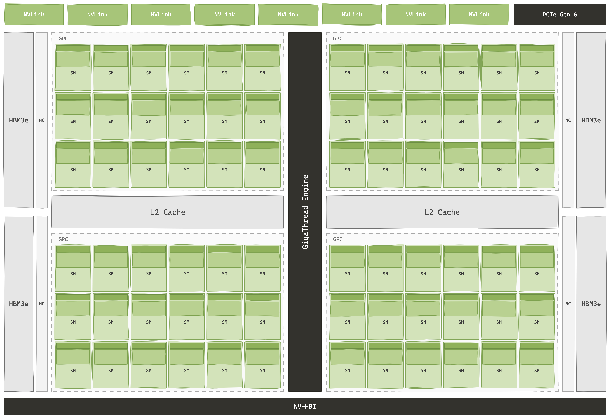

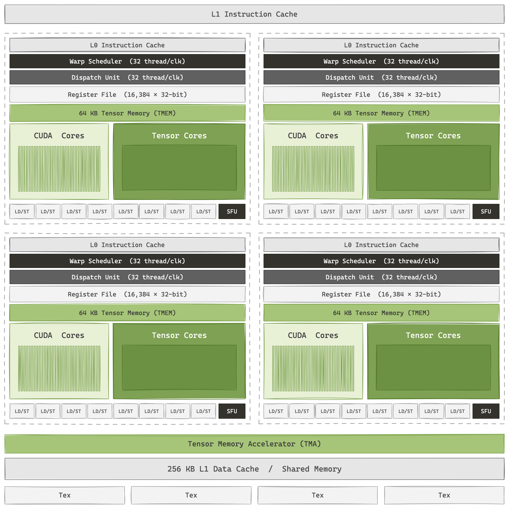

<h5 id="compute">计算</h5>

<em><strong><a data-popup="cuda-cores">CUDA 核心</a></strong></em> 是原始的计算吞吐量，对于人工智能来说，它们仍然拥有除 matmul 以外的所有内容：激活、残差加法、归一化、地址算术。但是，Transformer块的 matmul FLOP 数约为 99%，因此压倒性的计算吞吐量来自 <em><strong><a data-popup="tensor-cores">Tensor Core</a></strong></em>。

这些核心执行 <em><strong>融合矩阵乘法累加</strong></em> 在小矩阵图块上， <math class="notranslate" translate="no" xmlns="http://www.w3.org/1998/Math/MathML"><semantics><mrow><mi>D</mi><mo>=</mo><mi>A</mi><mo>⋅</mo><mi>B</mi><mo>+</mo><mi>C</mi></mrow><annotation encoding="application/x-tex">D = A \cdot B + C</annotation></semantics></math>D=A⋅B+C 完整的 matmul 被分解为输出图块：为了生成一个输出图块，内核遍历共享的内部维度 <math class="notranslate" translate="no" xmlns="http://www.w3.org/1998/Math/MathML"><semantics><mrow><mi>K</mi></mrow><annotation encoding="application/x-tex">K</annotation></semantics></math>K，从左侧输入矩阵的行带中绘制 <math class="notranslate" translate="no" xmlns="http://www.w3.org/1998/Math/MathML"><semantics><mrow><mi>A</mi></mrow><annotation encoding="application/x-tex">A</annotation></semantics></math>A ，并从右侧的列带中绘制 <math class="notranslate" translate="no" xmlns="http://www.w3.org/1998/Math/MathML"><semantics><mrow><mi>B</mi></mrow><annotation encoding="application/x-tex">B</annotation></semantics></math>B ，并将每个部分乘积折叠到正在运行的累加器中。 <math class="notranslate" translate="no" xmlns="http://www.w3.org/1998/Math/MathML"><semantics><mrow><mi>C</mi></mrow><annotation encoding="application/x-tex">C</annotation></semantics></math>C 保存到目前为止的部分和， <math class="notranslate" translate="no" xmlns="http://www.w3.org/1998/Math/MathML"><semantics><mrow><mi>D</mi></mrow><annotation encoding="application/x-tex">D</annotation></semantics></math>D 是带入下一步的更新值。内循环完成后， <math class="notranslate" translate="no" xmlns="http://www.w3.org/1998/Math/MathML"><semantics><mrow><mi>D</mi></mrow><annotation encoding="application/x-tex">D</annotation></semantics></math>D 是完整输出矩阵的一个完成图块；整个 matmul 由许多这样的图块 <a data-popup="mma">MMA</a>构建而成。

图块形状被写入 <strong>M × N × K</strong>， <math class="notranslate" translate="no" xmlns="http://www.w3.org/1998/Math/MathML"><semantics><mrow><mi>M</mi><mo>×</mo><mi>N</mi></mrow><annotation encoding="application/x-tex">M \times N</annotation></semantics></math>M×N 是输出图块大小， <math class="notranslate" translate="no" xmlns="http://www.w3.org/1998/Math/MathML"><semantics><mrow><mi>K</mi></mrow><annotation encoding="application/x-tex">K</annotation></semantics></math>K 是指令在一次执行中收缩了多少内部尺寸； matmul 的 <math class="notranslate" translate="no" xmlns="http://www.w3.org/1998/Math/MathML"><semantics><mrow><mi>K</mi></mrow><annotation encoding="application/x-tex">K</annotation></semantics></math>K 轴的其余部分由内核的内部循环遍历。累加器在该循环中具有粘性：每个 MMA 的输出 <math class="notranslate" translate="no" xmlns="http://www.w3.org/1998/Math/MathML"><semantics><mrow><mi>D</mi></mrow><annotation encoding="application/x-tex">D</annotation></semantics></math>D 成为下一个 MMA 的输入 <math class="notranslate" translate="no" xmlns="http://www.w3.org/1998/Math/MathML"><semantics><mrow><mi>C</mi></mrow><annotation encoding="application/x-tex">C</annotation></semantics></math>C，因此等式确实 <math class="notranslate" translate="no" xmlns="http://www.w3.org/1998/Math/MathML"><semantics><mrow><mi>C</mi><mo>←</mo><mi>A</mi><mo>⋅</mo><mi>B</mi><mo>+</mo><mi>C</mi></mrow><annotation encoding="application/x-tex">C \leftarrow A \cdot B + C</annotation></semantics></math>C←A⋅B+C 就位：连续的指令将其部分乘积折叠到同一存储中，直到 K 轴遍历完成。

<a data-popup="v100">V100</a>的第一代装置（每个 SM 8 个）运行warp级 16×16×16 FP16 <a data-popup="mma">MMA</a>。 <a data-popup="a100">A100</a>添加第三代装置 <a data-popup="tf32">TF32</a>、 <a data-popup="bf16">BF16</a>、FP64 matmul 和 2:4 <a data-popup="structured-sparsity">结构化稀疏性</a>。 <a data-popup="h100">H100</a>的第四代设备添加了原生 <a data-popup="fp8">FP8</a> 并将抽象从warp拉到 <em><strong><a data-popup="warp-group">warp组</a></strong></em>：128个协作线程触发异步 <a data-popup="wgmma"><code class="notranslate" translate="no">wgmma</code></a> at 64×256×16 形状在后台运行，同时发出warp加载下一个图块。 <a data-popup="b200">B200</a>的第五代装置更进一步： <em><strong><a data-popup="two-sm-mma">双 SM MMA</a></strong></em> 为 256×256×16，操作数分布在一对 SM、本机 <a data-popup="fp4">FP4</a>和专用的 256 KB <em><strong><a data-popup="tensor-memory">Tensor Memory (TMEM)</a></strong></em> 每个 SM 的暂存器，用于保存累加器图块，而不是渗入寄存器文件中。 <a data-popup="rubin">Rubin</a>的第 6 代单元扩展了 FP4 吞吐量，添加了原生 FP6，并与具有自适应功能的第 3 代 <a data-popup="transformer-engine">Transformer引擎</a> 配对 <a data-popup="fp4">NVFP4</a> 硬件中的微块缩放，将每个图块的量化元数据保留在 <a data-popup="tensor-cores">Tensor Core</a> 路径上，而不是通过 <a data-popup="cuda-cores">CUDA 核心</a>。

在所有六代中保持不变的是，matmul 位于 <em><strong>线程/warp 层次结构中</strong></em>，但是 <em>问题</em> 的线程数量已经减少，并且问题本身已经与执行脱钩。 <a data-popup="v100">Volta</a>的 <code class="notranslate" translate="no">mma.sync</code> 是warp的-<a data-popup="collective-instruction">集体</a> 和同步： <a data-popup="warp">warp 中的所有 32 个线程</a> 一起执行，每个通道保存 A、B、 <strong>和累加器 D</strong>的寄存器片段，并且warp块直到完成。 <a data-popup="h100">Hopper</a>的 <a data-popup="wgmma"><code class="notranslate" translate="no">wgmma.mma_async</code></a> 将发行者扩展到 <a data-popup="warp-group">warp-group</a> 128个线程，将B移动到 <a data-popup="shared-memory-descriptor">共享内存描述符</a> （A 变为可选：注册 <em>或</em> 描述符，内核选择），以及 <strong>立即返回</strong>：matmul在后台运行，同时warp-group对下一个图块进行排队，并通过 <code class="notranslate" translate="no">wgmma.commit_group</code> / <code class="notranslate" translate="no">wgmma.wait_group</code>跟踪完成情况。

<a data-popup="b200">Blackwell</a>的 <code class="notranslate" translate="no">tcgen05.mma</code> 完成迁移： <strong>A 加入 B</strong> 位于 <a data-popup="shared-memory-descriptor">共享内存描述符</a> （或 A 来自 <a data-popup="tensor-memory">TMEM</a> 直接），累加器 <strong>D落在TMEM</strong> 而不是寄存器文件中。当每个操作数离开通道时，就没有需要协调的问题的每线程状态，因此 <strong>单线程</strong> 触发指令并 <strong>立即返回</strong>，由消费者warp等待的 <a data-popup="mbarrier"><code class="notranslate" translate="no">mbarrier</code></a> 发出完成信号。与此同时，warp 的其余部分以及发出线程本身可用于其他工作。 <strong><a data-popup="cta">CTA</a>对变体</strong> 跨两个 SM 扩展相同的模型：配对集群中每个 SM 上的一个线程协调问题 <a data-popup="mma">MMA</a> 在对之间共享操作数，在同一组下组成 <a data-popup="two-sm-mma">256×256×16两个SM瓦片</a> async/<code class="notranslate" translate="no">mbarrier</code> 完成，刚刚提升为集群级屏障，因此该对保持步调一致。

同时发出线程上的 matmul 变得更大、更轻：开始为 32 通道锁步运行的指令现在更接近于单个 <a data-popup="descriptor-driven-command">描述符驱动命令</a>，从 warp 模型内部调度，但不再由其执行。

这种解耦使得 Transformer 注意力内核在 GPU 上高效运行。在 matmul 运行时，warp 可以运行 softmax、应用掩模或预加载下一个图块； matmul 和周围的逐元素工作的重叠是每个现代注意力内核的结构（<a data-popup="flashattention-versions">FlashAttention-3</a>，FA4），并且它取决于不阻塞warp的矩阵指令。

<h5 id="memory">内存</h5>

片上层次结构是 <em><strong>各个级别的硬件管理缓存，软件提示位于顶层</strong></em>。片外为 <em><strong><a data-popup="hbm">HBM</a></strong></em>：32 GB <a data-popup="hbm2">HBM2</a> V100，80 GB <a data-popup="hbm3">HBM3</a> 在 H100 上，192 GB <a data-popup="hbm3e">HBM3e</a> 在 B200 上，288 GB B300，288 GB <a data-popup="hbm4">HBM4</a> ，Rubin。芯片级 <em><strong>L2 缓存</strong></em> 位于 HBM 和 SM 之间：V100 上为 6 MB，A100 上为 40 MB，H100 上为 50 MB，B200 上为 60 MB（分为两个 30 MB 存储体） <a data-popup="two-die-chiplet-gpu">双芯片封装</a>，具有位置感知 <a data-popup="l2-residency-controls">驻留控制</a> ，以便热块可以固定到附近的芯片上）。在每个 SM 内部，256 KB 的统一 <em><strong><a data-popup="l1-shared-memory">L1/SMEM</a></strong></em> 在内核启动时在硬件管理的 L1 和程序员控制的暂存器之间进行分区。每个 SM 的寄存器文件大约为 256 KB，在分区上分为四个方向。

Blackwell 添加了第五层： <em><strong><a data-popup="tensor-memory">TMEM</a></strong></em>，每个 SM 256 KB 专用于 <a data-popup="mma">MMA</a> 累加器，仅由Tensor Core寻址，将操作数驻留压力从通用寄存器文件中拉出。

层之间的移动已逐渐与warp解耦。在 Ampere 之前，加载图块是同步的：每个线程发出自己的全局加载，warp被阻塞，直到每个片段落在寄存器中，第二遍将它们复制到共享内存；每个图块都会在地址算术和等待时烧毁warp通道。 <a data-popup="a100">Ampere</a> 引入 <a data-popup="async-copy"><em><strong><code class="notranslate" translate="no">cp.async</code></strong></em></a>：每线程异步复制 HBM → SMEM，完全绕过寄存器，warp提交组为仅在消费者需要数据时才进行飞行中复制和等待。 <a data-popup="h100">Hopper</a> 将其替换为 <em><strong><a data-popup="tma">TMA</a></strong></em>，这是一个专用的DMA 引擎：一个线程提交多维图块描述符（基地址、主维、混合），引擎处理所有地址算术并写入共享内存，完成由 <a data-popup="mbarrier"><code class="notranslate" translate="no">mbarrier</code></a>表示。整个warp摆脱了负载问题和地址数学；内核只是对描述符进行排队。 TMA 还支持 <strong>集群级多播</strong>：一个 HBM 读取扇出到 <a data-popup="thread-block-cluster">线程块集群</a>中的每个 SM，从而将使用的内容将 N 个单独的负载合并到一个中。 <a data-popup="b200">Blackwell</a> 再次扩展 TMA：直接加载到 <a data-popup="tensor-memory">TMEM</a>，因此累加器图块会流入而无需通过 SMEM 暂存。轨迹是warp在每一代每一代中必须做的事情。

<h5 id="warp-specialisation">Warp 专用化</h5>

Hopper 时代的编程习惯是 <em><strong><a data-popup="warp-specialisation">Warp 专用化</a></strong></em>：在一个区块内，一些warp充当 <em><strong>生产者</strong></em> ，连续发布 <a data-popup="tma">TMA</a> 加载；其他人充当 <em><strong>消费者</strong></em> ，在新到达的瓷砖上触发 <a data-popup="wgmma"><code class="notranslate" translate="no">wgmma</code></a> 。它们之间的同步不再是旧的 SM 范围 <code class="notranslate" translate="no">__syncthreads()</code> 障碍；它是 <em><strong><a data-popup="mbarrier"><code class="notranslate" translate="no">mbarrier</code></a></strong></em> （共享内存中的内存屏障）和附加到TMA完成的异步事务屏障，允许以warp粒度而不是块粒度进行细粒度的生产者/消费者握手。该模式已成为每个现代注意力内核的参考（<a data-popup="flashattention-versions">FlashAttention-3</a>、 <em><strong><a href="https://github.com/NVIDIA/cutlass">CUTLASS</a></strong></em> 乒乓球GEMM（Blackwell <a data-popup="flashattention-versions">FA4</a> 内核）是相同的配方：TMA 驱动的生产者管道通过共享内存和 TMEM 为 wgmma 消费者管道提供数据，并使用 mbarrier 握手和 <em><strong><a data-popup="thread-block-cluster">线程块集群</a></strong></em> (Hopper+) 将多个 SM 绑定到一个协作计算单元中，以便 Blackwell 的两个 SM MMA 自然地组合在顶部。

<h5 id="numerics">数值格式</h5>

<a data-popup="fp32">FP32</a> 是历史默认值； Volta带来了 <em><strong><a data-popup="fp16">FP16</a></strong></em> FP32 累积和 <a data-popup="loss-scaling">损失缩放</a> 使其可训练的技巧；添加了Ampere <em><strong><a data-popup="tf32">TF32</a></strong></em> （FP32 范围、FP16 尾数、FP32 matmul 的插入）、 <em><strong><a data-popup="bf16">BF16</a></strong></em>和 2:4 <em><strong><a data-popup="structured-sparsity">结构化稀疏</a></strong></em> ，使修剪权重的有效吞吐量加倍。 Hopper引入原生 <em><strong><a data-popup="fp8">FP8</a></strong></em> 在 <a data-popup="e4m3">E4M3</a> 和 <a data-popup="e5m2">E5M2中</a>，与 <em><strong><a data-popup="transformer-engine">Transformer Engine</a></strong></em> 配对，可逐层自动缩放激活以将其保持在 FP8 动态范围内。 Blackwell 通过 <em><strong><a data-popup="fp4">FP4</a></strong></em> 再次将精度减半，并推出了 <em><strong><a data-popup="microscaling-formats">微缩放 MX 格式</a></strong></em> （恢复最多的块级共享指数） FP4 的准确性损失），以及将自动缩放管道重新定位到 FP4 的第二代 Transformer 引擎。 Rubin 的第三代 Transformer 引擎添加了 <em><strong><a data-popup="nvfp4">NVFP4</a></strong></em> （NVIDIA 的强化 FP4 变体）和原生 <em><strong>FP6</strong></em> 具有更激进的稀疏性。芯片布局本身现在已成为数字故事的一部分：B100/B200/B300 是 <em><strong><a data-popup="two-die-chiplet-gpu">两个十字线限制芯片</a></strong></em> 以约 10 TB/s 的速度缝合 <em><strong><a data-popup="nv-hbi">NV-HBI</a></strong></em> 链接并作为一个逻辑 GPU 呈现给软件，封装上有 8 个 HBM 堆栈； Rubin 将小芯片配方扩展到具有 8 个 HBM4 堆栈的约 336 B 晶体管的双芯片。每一代通过将位数减少一半并通过更细粒度的缩放方案恢复精度，以及越来越多地通过将更多的硅粘合到封装中来购买大约 2 倍的每瓦吞吐量。

<h5 id="bets">核心押注</h5>
<ul>
<li><em><strong>押注 1：可编程性。</strong></em> 工作负载是一个移动目标（注意力变体、新颖的模型架构），因此请保持每个模块的可编程性并让开发人员编写 <a href="https://docs.nvidia.com/cuda/cuda-c-programming-guide/">CUDA</a>。连专业单位都暴露了 <em>通过</em> 该模型而不是固定功能块。</li>
<li><em><strong>押注 2：通过大规模多线程隐藏延迟。</strong></em> 延迟是不可预测的且依赖于数据，因此不要使用静态计划而是使用大量线程来隐藏它过度使用，每个 SM 最多 64 个常驻warp，硬件 <a data-popup="warp-schedulers">warp调度程序</a> 每个周期都会选择一个就绪的warp。</li>
<li><em><strong>押注 3：warp包裹的 Matmul。</strong></em> 矩阵单元具有压倒性的计算吞吐量，但它必须存在于其他所有东西使用的相同warp/线程抽象后面，因此将其包裹在 <code class="notranslate" translate="no">mma.sync</code> → <code class="notranslate" translate="no">wgmma</code> → <code class="notranslate" translate="no">tcgen05.mma</code> - 而不是将其公开为固定功能管道。这使得单个内核能够一次性融合 matmul、softmax 和 element-wise 运算。</li>
<li><em><strong>押注 4：异步内存层次结构。</strong></em> 使内存层次结构 <a data-popup="explicit-hierarchy">显式</a> 和 <a data-popup="programmer-managed">程序员管理</a> 而不是 <a data-popup="implicit-hierarchy">隐式</a> 和 <a data-popup="compiler-scheduled">编译器调度</a>。保留 <a data-popup="l2-cache">二级缓存</a>，但公开 <a data-popup="l1-shared-memory">SMEM</a> 和 <a data-popup="tensor-memory">TMEM</a> 作为命名暂存器，并在顶部分层异步机制： <a data-popup="tma">TMA</a> 用于批量复制， <a data-popup="tensor-memory">TMEM</a> 用于 matmul 累加器， <a data-popup="mbarrier"><code class="notranslate" translate="no">mbarrier</code></a> 用于生产者/消费者握手。层次结构位于可编程内核内 <a data-popup="software-pipelined">软件流水线</a> ，而不是由编译器针对已知延迟暂存器进行静态调度。</li>
<li><em><strong>押注 5：摊销 SIMT 税。</strong></em> 用于warp调度程序、寄存器文件或一致性缓存的每个晶体管都是未用于 <a data-popup="mac">MAC</a>的晶体管；接受税收，并以两种方式支付：Tensor Core现在足够大，SIMT 机器可以在更大的 MAC 数量上摊销，像 TMEM 这样的单元会牺牲一些通用灵活性来换取 MAC 密度。</li>
</ul>
<h4 id="scaling">扩展</h4>

有两种缩放机制： <em><strong><a data-popup="scale-up">纵向扩展</a></strong></em> 和 <em><strong><a data-popup="scale-out">向外扩展</a></strong></em>。

纵向扩展

将多个 GPU 绑定到一个一致的内存域中。任何 GPU 都可以直接通过 <a data-popup="hbm">NVLink</a> 以纳秒延迟加载或存储任何其他 GPU 的 <a data-popup="nvlink">HBM</a> ：一个地址空间，无需显式传输。

横向扩展

在 <a data-popup="rack">机架上将这些域联网</a> 和 <a data-popup="cluster">集群</a> 级别。数据通过显式 <a data-popup="rdma">RDMA</a> 以微秒延迟进行传输：独立的地址空间，但每个 <a data-popup="cluster">集群有数万个芯片</a>。

人工智能基础设施同时使用：带宽需求 <a data-popup="collective">集合</a> （<a data-popup="tensor-parallelism">张量并行</a>、 <a data-popup="moe-expert-routing">MoE 专家路由</a>）留在扩展域内； <a data-popup="data-parallelism">数据并行</a> 和 <a data-popup="pipeline-parallelism">管道并行</a> 跨横向扩展结构。

<h5 id="scale-up">纵向扩展</h5>

扩展堆栈为 <em><strong><a data-popup="nvlink">NVLink</a></strong></em> 加上 <em><strong><a data-popup="nvswitch">NVSwitch</a></strong></em>。 <a data-popup="nvlink">NVLink</a> 实现 <em><strong>缓存一致性结构</strong></em> GPU 之间，因此一个 GPU 上的加载或存储可以通过硬件处理地址转换和一致性来针对另一个 GPU 的 <a data-popup="hbm">HBM</a> 。但 <a data-popup="nvlink">NVLink</a> 本身是点对点的：一条链路恰好连接两个芯片。 <a data-popup="nvswitch">NVSwitch</a> 是专用的 <em><strong><a data-popup="crossbar">crossbar</a></strong></em> 每个 GPU 连接的芯片，路由流量，以便每个 GPU 可以同时以完整 <a data-popup="nvlink">NVLink</a> 带宽进行通信， <a data-popup="non-blocking">非阻塞</a> 和 <a data-popup="all-to-all">全部到全部</a>。 

他们共同定义了 <em><strong><a data-popup="hgx">HGX</a></strong></em> 8-GPU 基板，配对八个 <a data-popup="h100">H100</a> <a data-popup="sxm">SXM</a> 模块，带有 <a data-popup="x86">x86</a> 主机（<a data-popup="epyc">AMD EPYC</a> 或 <a data-popup="xeon">Intel Xeon</a>）超过 <a data-popup="pcie-gen5">PCIe Gen5</a>。 Hopper 还提供了 <a data-popup="grace">Grace</a>配对形式： <em><strong><a data-popup="gh200">GH200 Grace Hopper Superchip</a></strong></em> 粘合型 <a data-popup="grace">Grace</a> ARM CPU 到一个 <a data-popup="h100">H100</a> 超过 <em><strong><a data-popup="nvlink-c2c">NVLink-C2C</a></strong></em> ，速度为 900 GB/s，消除了 <a data-popup="pcie">PCIe</a> 主机设备跃点。模块可扩展为 <em><strong><a data-popup="gh200">GH200</a> NVL2</strong></em> 对和机架级 <em><strong><a data-popup="gh200">GH200</a> NVL32</strong></em>。 Blackwell 将配对设置为默认值。 <em><strong><a data-popup="gb200">GB200</a></strong></em> 模块将一台 <a data-popup="grace">Grace</a> 与两台B200融合在一起 <a data-popup="nvlink-c2c">NVLink-C2C</a>和 <em><strong>NVL72</strong></em> 将其中的36个缝合到单个液冷扩展域中： 72 个 GPU、36 个 <a data-popup="grace">Grace</a> CPU、13.5 TB <a data-popup="hbm">HBM</a> 和 17 TB <a data-popup="lpddr5x">LPDDR5X</a> 作为一个平坦、一致的地址空间。 Rubin 将其分为两部分。 <em><strong>NVL144</strong></em> 将于 2026 年作为 Rubin 一代的更新产品在同一个 <a data-popup="oberon">Oberon 中发货</a>级机架：72 个 Rubin 封装，根据 NVIDIA 新的芯片计数约定标记为 144 个 GPU，具有 <a data-popup="hbm4">HBM4</a> 和 NVLink 6 将每个封装带宽加倍。实际的机架规模跳跃是 2027 年的 Rubin Ultra： <em><strong>NVL576</strong></em> 将 144 个四芯片 Rubin Ultra 封装装入新的 <em><strong>Kyber</strong></em> 用于 576 GPU 芯片的机箱位于一个相干域中。

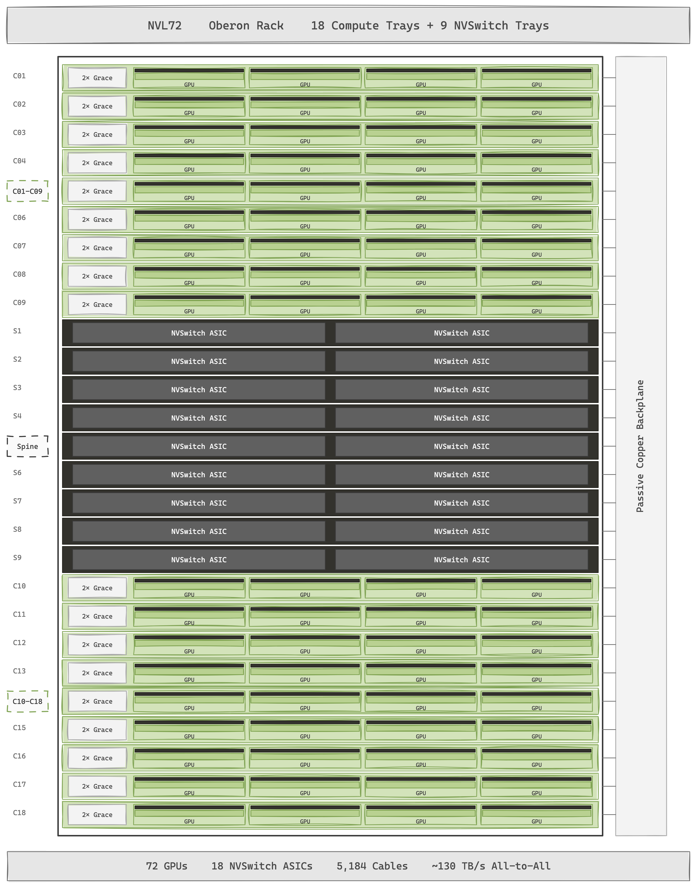

该密度由 <em><strong><a data-popup="passive-copper-backplane">无源铜</a></strong></em>保持在一起。 NVL72 的 NVLink 结构通过背板盲插运行超过 5,184 条电缆（每个机架约 2 英里的布线，没有 <a data-popup="in-cable-retimer">电缆内重定时器</a>， <a data-popup="serdes">SerDes</a> 运行在 GPU 和 <a data-popup="switch-asic">交换机 ASIC</a> 上），承载约 130 TB/s 的 <a data-popup="all-to-all">所有</a> 跨 72 个 GPU 的带宽。 NVIDIA 估计，与每个链路上都需要 <a data-popup="pluggable-transceiver">可插拔收发器</a> 的光学等效方案相比，选择铜缆可以为每个机架节省大约 20 kW 的电量。铜使得 <em>机架作为一个 GPU</em> 经济实用：在低于 2 米的运行中，它仍然在功耗、成本和信号完整性方面胜出。除此之外，这些位必须安装在玻璃上。

NVL144 留在 Oberon 内部，铜继续工作，因为封装数量 (72) 与 NVL72 相同；布线不必加长，只需在第 6 代 SerDes 上传输速度更快即可。 <a data-popup="rubin">Rubin Ultra</a>的 NVL576 通过重塑机架来保持相同的铜线：新的 <em><strong>Kyber</strong></em> 外形尺寸大约是 Oberon 高度的两倍，并将所有 576 个 GPU 芯片封装到一个外壳中，其尺寸经过专门设计，因此即使在 144 个四芯片封装和数万根电缆的情况下，每个 NVLink 路径也能保持在无源铜缆范围内。

<h5 id="scale-out">横向扩展</h5>

横向扩展堆栈来自他们对 <a data-popup="mellanox">Mellanox</a>的收购。与 <a data-popup="nvlink">NVLink</a>不同，横向扩展结构 <em><strong>不连贯</strong></em>：节点保留单独的地址空间，数据仅通过显式交叉 <em><strong><a data-popup="rdma">RDMA</a></strong></em> 由软件发起，通常封装在 <em><strong><a data-popup="nccl">NCCL</a></strong></em> 集合中，例如 <a data-popup="all-reduce">全部缩减</a> 或 <a data-popup="all-to-all">全部到全部</a>。参考 <a data-popup="cluster">集群</a> 是 <em><strong>DGX SuperPOD</strong></em>：八个NVL72机架缝合在一起 <a data-popup="quantum-x800">Quantum-X800</a> <a data-popup="infiniband">InfiniBand</a> 在单个调度程序下产生 576 个 Blackwell GPU，训练集群通过平铺 SuperPOD 进一步扩展。 2026 年的 Rubin SuperPOD 与 NVL144 保持相同的 8 机架模式（每个 SuperPOD 产生 1,152 个 GPU，而不是 576 个）。 Rubin Ultra 将于 2027 年将这一方案扩大一个数量级：Kyber 机架每个包含 576 个 GPU 芯片，通过 <a data-popup="quantum-x-photonics">Quantum-X Photonics</a> <a data-popup="cpo">CPO</a>缝合在一起，将数千个一个调度程序下的 GPU。

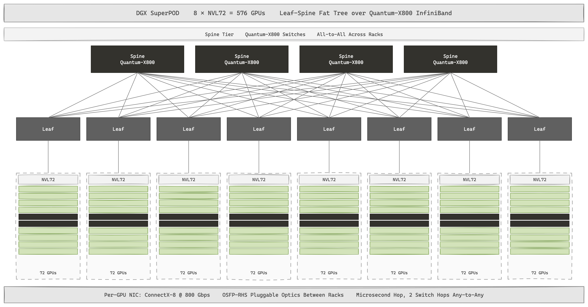

每个 GPU 在该结构中都有自己的 <a data-popup="connectx-nics">ConnectX</a> <a data-popup="nic">NIC</a> 。 Blackwell 节点以每个 GPU 800 Gbps 的速度运行 ConnectX-8，比每个 GPU <a data-popup="nvlink">NVLink</a>的带宽低一个数量级，并且延迟从纳秒攀升至微秒。 Rubin 迁移到 ConnectX-9，每 GPU 速度为 1.6 Tbps，随着每机架纵向扩展域从 72 个 GPU 增长到 576 个 GPU，每 GPU 横向扩展带宽加倍。每个 NIC 旁边都有一个 <a data-popup="bluefield-dpus">BlueField DPU</a>，添加 ARM 内核和加速器以减轻主机 CPU 的存储、网络和安全负担。对于更喜欢以太网而不是 <a data-popup="infiniband">InfiniBand</a>的客户， <em><strong><a data-popup="spectrum-x">Spectrum-X</a></strong></em> 是专为人工智能而优化的无损以太网替代方案流量。

从铜缆到玻璃的交叉发生在机架边界。 NVL72 内部的脊柱是铜的；一旦链路必须以 800 Gbps 的速度跨机架，它就是 <em><strong>光纤</strong></em>。无源铜质 DAC 在 200 G/通道时的最高长度约为 1.5–2 米，远低于跨机架范围，因此今天的 SuperPOD 主干采用 <em><strong><a data-popup="osfp">OSFP-RHS</a></strong></em> <a data-popup="pluggable-transceiver">可插拔收发器</a>，每个模块都带有自己的激光器、调制器、光电探测器和 DSP。从光学角度来看，分散到数千个 GPU 的 SuperPOD 主干相当于数万个 <a data-popup="pluggable-transceiver">可插拔</a> 仅在收发器激光器上就消耗了数十千瓦的功率。

到了 Rubin，光学器件被直接集成进 <a data-popup="switch-asic">交换机 ASIC</a>。<em><strong><a data-popup="quantum-x-photonics">Quantum-X Photonics</a></strong></em>（<a data-popup="infiniband">InfiniBand</a>）和 <em><strong><a data-popup="spectrum-x-photonics">Spectrum-X Photonics</a></strong></em>（<a data-popup="spectrum-x">以太网</a>）不再使用可插拔光模块，而是采用 <em><strong><a data-popup="cpo">共封装光学（CPO）</a></strong></em>：通过 TSMC COUPE 工艺，把激光器、调制器和光电探测器与交换芯片封装在一起。NVIDIA 表示，与功能相当的 OSFP 可插拔方案相比，这种设计可将激光器数量减少约 4 倍，并将链路功耗降低约 3.5 倍。此前，NVIDIA 已通过 Chiplet 封装把多个 GPU 裸片和 HBM 集成在同一封装内；如今，相同的集成思路进一步延伸到网络层，把计算、内存和光子器件集成到同一系统中。

<em><strong><a data-popup="nvlink">NVLink</a> Fusion</strong></em> 最近开放了扩展结构本身：第三方 CPU 和 <a data-popup="xpus">XPU</a> 现在可以加入 <a data-popup="nvlink">NVLink</a> 域，让超大规模厂商可以围绕 NVIDIA 互连构建半定制机架，而无需从头开始设计自己的相干结构。

<h4 id="software">软件栈</h4>

<em><strong><a href="https://docs.nvidia.com/cuda/cuda-c-programming-guide/">CUDA</a></strong></em> 是 <em><strong>大规模并行的自然编程模型</strong></em> 处理器。您编写一个内核（每个线程执行一次代码）并在组织成块和warp的数千个线程中启动它；程序员决定他们共享什么、何时同步以及每个人处理哪一部分问题。这就是为什么十八年来抽象几乎没有改变，也是为什么自 2007 年以来编写的每个 CUDA 内核仍然可以在 Blackwell 上编译和运行。

这种连续性既是护城河也是约束。每一代都会引入新硬件（<a data-popup="tensor-cores">Tensor Core</a>, <a data-popup="tma">TMA</a>, <a data-popup="tensor-memory">TMEM</a>）到相同的 kernel-and-warps 模型上，在 <em><strong><a href="https://docs.nvidia.com/cuda/parallel-thread-execution/">PTX</a></strong></em> 和 <em><strong><a href="https://docs.nvidia.com/cuda/cuda-binary-utilities/">SASS</a></strong></em>中作为内在函数公开： <code class="notranslate" translate="no">mma.sync</code>、 <code class="notranslate" translate="no">wgmma.mma_async</code>等。 NVIDIA 无法从根本上重新考虑 SM，因为太多代码依赖于它；作为回报，对 CUDA 软件的每一项投资都会在几代人之间复合。

PTX 之上是一个经过二十年构建的堆栈。 <em><strong><a href="https://docs.nvidia.com/cuda/cublas/">cuBLAS</a></strong></em> 和 <em><strong><a href="https://developer.nvidia.com/cudnn">cuDNN</a></strong></em> 用于数学和 DNN 基元； <em><strong><a href="https://github.com/NVIDIA/cutlass">CUTLASS</a></strong></em>，编码了数十年 GEMM 在模板化 C++ 方面的专业知识； <em><strong><a href="https://github.com/NVIDIA/TensorRT-LLM">TensorRT-LLM</a></strong></em> 用于分页注意力、运行中批处理和推测解码；通过 <em><strong><a href="https://pytorch.org/">PyTorch</a></strong></em>进行框架绑定， <em><strong><a href="https://triton-lang.org/">Triton</a></strong></em>和 <em><strong><a href="https://github.com/jax-ml/jax">JAX</a></strong></em>。

<em><strong><a href="https://arxiv.org/abs/2205.14135">FlashAttention</a></strong></em>是现代人工智能中最重要的算法重写之一，它会集中注意力以避免实现 <math class="notranslate" translate="no" xmlns="http://www.w3.org/1998/Math/MathML"><semantics><mrow><mi>O</mi><mo stretchy="false">(</mo><msup><mi>N</mi><mn>2</mn></msup><mo stretchy="false">)</mo></mrow><annotation encoding="application/x-tex">O(N^2)</annotation></semantics></math>O(N2) 矩阵。它的四代产品（FA1 到 FA4）均针对最新的 NVIDIA 芯片进行了手工优化（FA3 适用于 Hopper 的异步管道，FA4 适用于 Blackwell），与其他硬件的端口相隔数月或数年。

这个堆栈的大部分内容都是由 NVIDIA 不付费的人编写的。护城河不是 CUDA 本身；而是 CUDA。它是二十年来第三方内核、库和工具的积累，以及数以百万计的开发人员一路学习 API 的成果。

NVIDIA 还随芯片提供了人类专业知识。他们在前沿实验室和超大规模团队中嵌入了数十名自己的工程师，为每个新模型架构编写内核，并将其调整到每一代新的芯片。无论实验室下个月想要训练什么，在 NVIDIA 上的运行速度都会比其他平台快得多。因此，关闭 NVIDIA 不仅仅是重写内核和库。它正在重新培训整个工程人员的心智模型，并失去如今坐在大楼内的 NVIDIA 工程师。

<h3 id="google-tpu">Google TPU</h3>

 <em><strong><a href="https://en.wikipedia.org/wiki/Tensor_Processing_Unit">TPU</a></strong></em> 是一个 <em><strong>矩阵乘法机</strong></em>。其理念是，不是可以运行任何大规模并行工作负载的可编程芯片，而是专注于单个原语（大型 <a href="https://en.wikipedia.org/wiki/Systolic_array">脉动阵列</a>上的密集矩阵乘法）并让 <em><strong><a href="https://openxla.org/xla">XLA</a></strong></em> 编译器提前计划每个周期和每个内存字节。没有硬件调度程序，没有缓存，没有线程/warp。每一代都会增加 <a data-popup="pod">pod</a>，数千个芯片通过 <em><strong><a data-popup="ici">ICI</a></strong></em> 互连连接到一台连贯的机器中。 TPU 无意渲染图形或运行科学模拟；它的存在是为了比任何通用替代品更高效地训练和服务 Google 的工作负载（搜索、翻译、推荐、Gemini）。

<h4 id="genealogy">演进路线</h4>

2015

<strong><em><a href="https://arxiv.org/abs/1704.04760">TPU v1</a></em></strong><a data-popup="tpu-v1">v1</a>

首款量产深度学习 ASIC； <a data-popup="int8">INT8</a> 仅进行推理 <a data-popup="pcie">PCIe</a>。

2017

<strong><em><a href="https://cacm.acm.org/research/a-domain-specific-supercomputer-for-training-deep-neural-networks/">TPU v2</a></em></strong><a data-popup="tpu-v2">v2</a>

第一个具有训练功能的 TPU；将 <a data-popup="mxu">MXU</a> 从 <a data-popup="int8">INT8</a> 切换为 <strong><a data-popup="bf16">BF16</a></strong>，建立双<a data-popup="tensorcore">TensorCore</a> + <a data-popup="hbm">HBM</a>

2018

<strong><em><a href="https://cacm.acm.org/research/a-domain-specific-supercomputer-for-training-deep-neural-networks/">TPU v3</a></em></strong><a data-popup="tpu-v3">v3</a>

首款液冷TPU；与 v2 相比， <a data-popup="mxu">MXU</a> 和 <a data-popup="hbm">HBM</a> 翻倍； 1,024 芯片 Pod。

2020

<strong><em><a href="https://arxiv.org/abs/2304.01433">TPU v4</a></em></strong><a data-popup="tpu-v4">v4</a>， <a data-popup="tpu-v4i">v4i</a>

首款可重新配置 <a data-popup="ocs">光路开关</a> (<a data-popup="palomar">Palomar</a>); <a data-popup="sparsecore">SparseCores</a>;两者 <a data-popup="bf16">BF16</a> &amp; <strong><a data-popup="int8">INT8</a></strong>; 4,096 芯片 Pod。

2023

<strong><em><a href="https://cloud.google.com/blog/products/ai-machine-learning/introducing-cloud-tpu-v5p-and-ai-hypercomputer">TPU v5</a></em></strong><a data-popup="tpu-v5e">v5e</a>， <a data-popup="tpu-v5p">v5p</a>

v5e 提高效率，v5p 提高性能； v5p 具有 3.3× INT8 FLOP 和 2.2× v4、8,960 芯片 Pod 的 HBM 带宽。

2024

<strong><em><a href="https://cloud.google.com/blog/products/compute/introducing-trillium-6th-gen-tpus">Trillium</a></em></strong><a data-popup="tpu-v6e">v6e</a>

第一个256×256 <a data-popup="mxu">MXU</a>；相似功率下 4.7× v5e 峰值 FLOPS；训练有素 <strong>Gemini 2.0</strong>。

2025

<strong><em><a href="https://blog.google/innovation-and-ai/infrastructure-and-cloud/google-cloud/ironwood-tpu-age-of-inference/">Ironwood</a></em></strong><a data-popup="tpu-v7">v7</a>

为推理模型的推理而构建；添加原生 <strong>FP8</strong>； 9,216 芯片超级 Pod， <strong>42.5 ExaFLOPS FP8</strong>。

2026

<strong><em><a href="https://blog.google/innovation-and-ai/infrastructure-and-cloud/google-cloud/eighth-generation-tpu-agentic-era/">TPU v8</a></em></strong><a data-popup="tpu-8t">8t</a>、 <a data-popup="tpu-8i">8i</a>

 8t用于训练，8i 用于推理；添加原生 <strong>FP4</strong>； 9,600 个芯片超级 Pod， <strong>121 ExaFLOPS FP4</strong> (8t)。

<h4 id="architecture">架构</h4>

TPU 芯片是一个 <em><strong>matmul 引擎，包裹在足够的硅中以保持其供电</strong></em>。计算单位是 <em><strong><a data-popup="tensorcore">TensorCore</a></strong></em>： <a data-popup="tpu-v2">v2</a> 及以后的旗舰芯片每个封装有两个；效率调整芯片（<a data-popup="tpu-v4i">v4i</a>、 <a data-popup="tpu-v5e">v5e</a>、 <a data-popup="tpu-v6e">v6e</a>) 携带一个。每个 TensorCore 内部都包含相同的五组件配方：一个或多个用于矩阵数学的 <em><strong><a data-popup="mxu">MXU</a></strong></em> ，一个 <em><strong><a data-popup="vpu">VPU</a></strong></em> 用于 <a data-popup="element-wise">逐元素数学</a>，一个 <em><strong><a data-popup="scalar-unit">标量单元</a></strong></em> 负责运行节目，一个 <em><strong><a data-popup="xlu">XLU</a></strong></em> 用于执行 cross-lane reduction，以及一个附加的 <em><strong><a data-popup="transpose-permute-unit">转置/置换单元</a></strong></em>，加上累加器队列为 MXU 提供和排出。从 <a data-popup="tpu-v4">v4</a> 开始，每个芯片还在 TensorCore 外部携带专用的 <em><strong><a data-popup="sparsecore">SparseCore</a></strong></em> 数据流引擎（每个芯片 4 个） <a data-popup="tpu-v4">v4</a>、 <a data-popup="tpu-v5p">v5p</a>和 <a data-popup="tpu-v7">Ironwood</a>； <a data-popup="tpu-v6e">Trillium</a>上的每个芯片 2 个），明确雕刻以吸收 <a data-popup="embedding-lookup">嵌入查找</a> 脉动阵列的形状不适合工作负载。每个区块都位于一个 <a data-popup="vliw">VLIW</a> 发行平面上，由 <em><strong><a data-popup="core-sequencer">核心序列器</a></strong></em> 填充一个区块的所有八个功能槽位。每个周期 322 位捆绑。没有指令缓存未命中，没有 <a data-popup="warp-schedulers">warp调度器</a>，没有乱序引擎，没有 <a data-popup="branch-predictor">分支预测器</a>：编译器是调度器，节省的硅面积用于更多 <a data-popup="mac">MAC</a>。

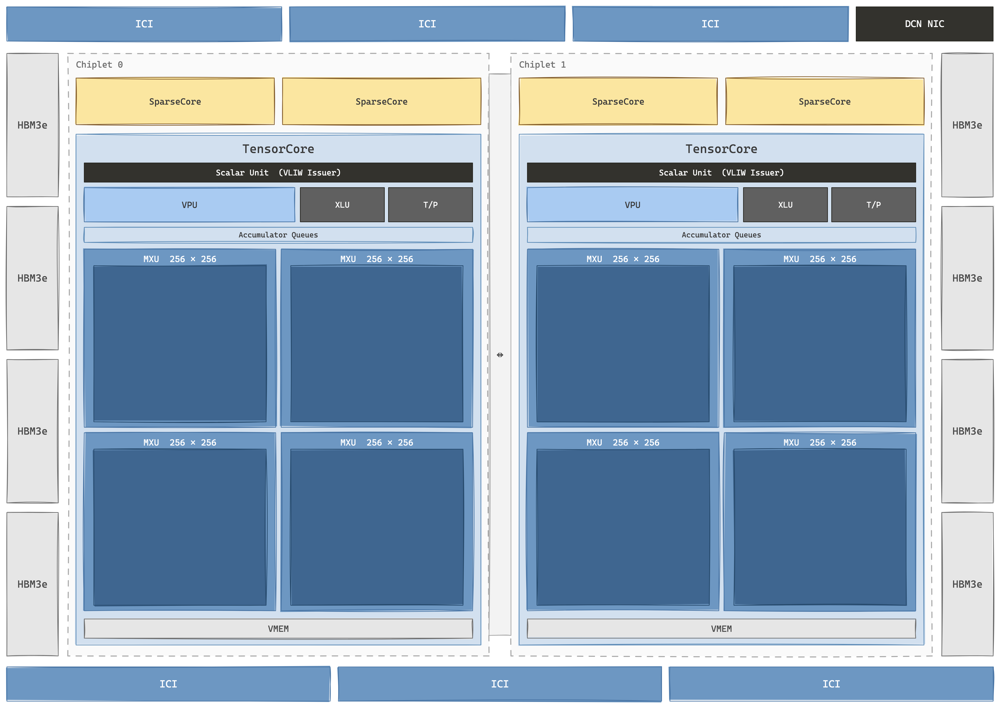

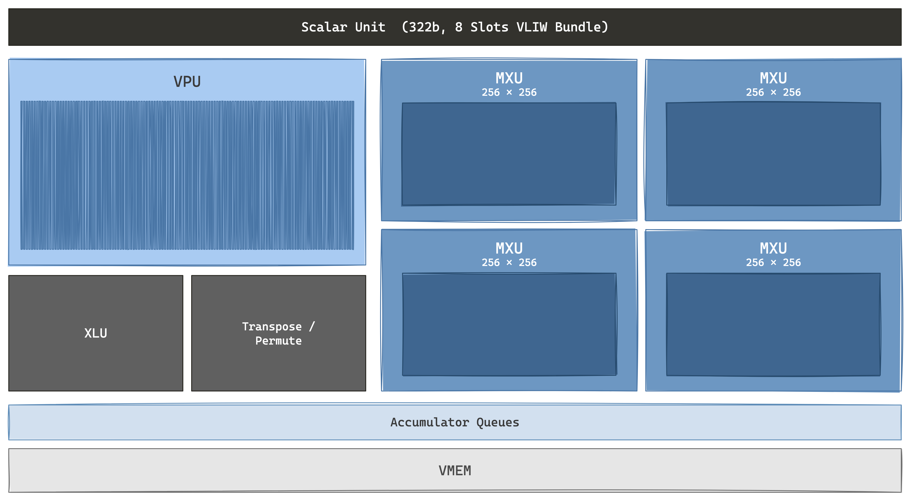

<h5 id="tensorcore">TensorCore</h5>

 <em><strong><a data-popup="mxu">MXU</a></strong></em> 是脉动阵列。 <a data-popup="tpu-v1">v1</a> 发货1个256×256 INT8推理阵列； <a data-popup="tpu-v2">v2</a> 是第一个具有训练功能的 TPU，并引入了 128×128 个单元， <a data-popup="bf16">BF16</a> 与 <a data-popup="fp32">FP32</a> 累积（INT8 在 <a data-popup="tpu-v4">v4</a> 以同等吞吐量返回到 MXU）。每个 TensorCore 的单元数量从此开始增长： <a data-popup="tpu-v2">v2</a> 上有 1 个 MXU→ <a data-popup="tpu-v3">v3</a> 上有 2 个→ 4上 <a data-popup="tpu-v4">v4</a>/<a data-popup="tpu-v5e">v5e</a>/<a data-popup="tpu-v5p">v5p</a>。 <a data-popup="tpu-v6e">Trillium</a> 回到 256×256（每个周期每个阵列 65,536 个乘法累加单元），并且 <a data-popup="tpu-v7">Ironwood</a>、 <a data-popup="tpu-8t">8t</a>和 <a data-popup="tpu-8i">8i</a> 都保留了 256×256 形状。

为了计算 <math class="notranslate" translate="no" xmlns="http://www.w3.org/1998/Math/MathML"><semantics><mrow><mi>C</mi><mo>=</mo><mi>A</mi><mo>×</mo><mi>B</mi></mrow><annotation encoding="application/x-tex">C = A \times B</annotation></semantics></math>C=A×B，矩阵 B 的值会预先加载一个权重cell: <em><strong><a data-popup="weight-stationary">weight-stationary</a></strong></em> 数据流，这是将 TPU 与其他地方的 <a data-popup="output-stationary">output-stationary</a> 阵列区分开来的选择。激活从左边缘进入，每个周期传播一列，与每个单元格的驻留权重相乘，部分总和向下流入底部的 <a data-popup="accumulator-queues">累加器队列</a> 。一旦数据进入数组，就不会发生内存访问：每个权重都会在每次通过的激活中重复使用，每个激活在行中重复使用 128（或 256）次。数据重用被连接到芯片中，而不是由缓存仲裁。计算中的主要成本不是乘法本身（几皮焦），而是每次访问要多消耗 100-1000 倍的能量来读写内存；脉动阵列通过构造消除了该成本。权衡是 <em><strong><a data-popup="underfill">阵列填充不足</a></strong></em>：256×256阵列上的128×128 matmul浪费了75%的硅，因此 <a href="https://openxla.org/xla">XLA</a> <a data-popup="tile">图块</a>、 <a data-popup="padding">垫</a>和 <a data-popup="schedule">时间表</a> 维度为 128 的倍数（在 v6e+ 上为 256），模型代码在编写时考虑了这些量子。

 <em><strong><a data-popup="vpu">VPU</a></strong></em> 是次要的计算引擎，但在很多方面都处于次要地位更有趣的微架构对象：每个 TPU 都是 2D 矢量机，而不是 1D SIMD 机。 VPU 的寄存器文件保存 2D <em><strong><a data-popup="vreg">VREG</a></strong></em>。在 <a data-popup="tpu-v4">v4</a>/<a data-popup="tpu-v5p">v5p</a> 上，形状为 <code class="notranslate" translate="no">(8, 128)</code>：128 个 <em><strong><a data-popup="lane-axis">车道</a></strong></em> 宽，8 <em><strong><a data-popup="sublane-axis">子车道</a></strong></em> 深，32 (v4) 或 64每个核心有 (v5p) 个寄存器，每个（通道、子通道）有 4 个独立的浮点 ALU。通道轴与脉动阵列的输入宽度相匹配，因此通道数可能与 MXU 一起加宽至 256 个 <a data-popup="tpu-v6e">Trillium</a> 和 <a data-popup="tpu-v7">Ironwood</a>； Google 尚未发布 v5p 之后的 VPU 尺寸。子通道轴让 VPU 以每 X 个时钟 1 个 matmul 的速度通过 MXU 流式传输图块（其中 X 是子通道维度）。现代 TPU 程序中的大部分加速来自于 <em><strong><a data-popup="vpu-mxu-overlap">VPU/MXU 重叠</a></strong></em>：量化、layernorm、softmax、激活和偏差添加都在 VPU 上运行，MXU 在其后面运行 matmul 的周期相同。cross-lane reduction 对任何 2D 向量 ISA 都很难高效实现，因此由 <em><strong><a data-popup="xlu">XLU</a></strong></em> 专门负责；它速度慢、代价高，也是编译器中已知的热点。与 2D 形状不对齐的布局变换会被专用的 <em><strong><a data-popup="transpose-permute-unit">转置/置换单元</a></strong></em>吸收，从而避免内存往返。

 <em><strong><a data-popup="scalar-unit">标量单元</a></strong></em> 是最小的块，并且可以说是最重要的：一个单线程、双发出整数 ALU，具有 32 个 32 位寄存器和 4 KiB 的 <em><strong><a data-popup="smem">SMEM</a></strong></em> 用于控制状态，与保存程序的 Imem 配对。它是唯一执行指令提取的块；每个周期它都会提取一个 322 位 VLIW 包，在本地执行自己的两个标量槽（地址算术、循环计数器、分支、同步寄存器检查），并将剩余的 6 个槽分派到芯片的其余部分：2 个向量 ALU (VPU)、2 个向量加载/存储 (HBM↔VMEM <a data-popup="dma">DMA</a>)，2 个矩阵（推送/弹出 MXU 队列）。块之间的同步是显式的： <em><strong><a data-popup="sync-flags">同步标志</a></strong></em> 在 MXU 和 VPU 管道繁忙时进行跟踪，并且编译器插入屏障检查而不是硬件跟踪依赖项。标量单元使 TensorCore 的其余部分看起来像固定功能数据流：每个周期，一个地方决定发生八件事，并且没有动态 <a data-popup="reorder-buffer">重新排序缓冲区</a> 来撤消错误的决定。

<h5 id="memory">内存</h5>

片上内存层次结构与计算端的思路相同： <em><strong>没有缓存，每个级别均由软件管理</strong></em>。片外为 <em><strong><a data-popup="hbm">HBM</a></strong></em> （v2/v5e 上为 16 GB，v3/v4/v6e 上为 32 GB，v5p 上为 95 GB，Ironwood 上为 192 GB，v8 代上为 216–288 GB），片上是手工堆叠的可明确寻址的暂存器层。最接近计算的是 <em><strong><a data-popup="vmem">VMEM</a></strong></em>，为 VPU 和 MXU 输入队列提供数据的矢量暂存器，在 v4 上大小为 32 MiB，在 v5e 上大小为 128 MiB，在经过推理调整的 <a data-popup="tpu-8i">v8i 上扩展到 384 MiB</a> 精确地在芯片上保存整个 <a data-popup="kv-cache">KV缓存</a> 。其上方是 <em><strong><a data-popup="cmem">CMEM</a></strong></em>，随 <a data-popup="tpu-v4">v4</a> 引入，大小为 128 MiB：HBM 和 VMEM 之间较慢、较大的 SRAM 暂存区域，可吸收 <a data-popup="op-fusion">融合操作</a> 中间体。 <a data-popup="scalar-unit">标量单元</a> 有自己的 <em><strong><a data-popup="smem">SMEM</a></strong></em> （v4 上的控制状态约为 10 MiB）和一个微小的标量寄存器文件。程序中的每个张量在编译时都固定到一层； XLA 的 <a data-popup="buffer-assignment">缓冲区分配</a> 跨层调度 <a data-popup="dma">DMA</a> ，以便数据恰好在循环之前到达消耗它。硬件不进行预取，不逐出，不存在 <a data-popup="cache-coherence">一致性</a>；当编译器正确时，数组永远不会停止；当出错时，没有后备路径。

<h5 id="sparsecore">SparseCore</h5>

TensorCore 外部打破收缩模型的块是 <em><strong><a data-popup="sparsecore">SparseCore</a></strong></em>，随 <a data-popup="tpu-v4">v4</a>引入。 <a data-popup="recsys">推荐器</a> 和排名模型实时 <a data-popup="embedding-lookup">嵌入查找</a> （数十亿个索引放入庞大的表中），访问模式是密集矩阵乘法的逆： <a data-popup="irregular">不规则</a>， <a data-popup="indirect">间接</a>、 <a data-popup="all-to-all">全部到全部</a>。 256×256 脉动阵列的形状完全错误。 SparseCore 是一个 <em><strong><a data-popup="dataflow-processor">数据流处理器</a></strong></em> ，具有 16 个计算块和专用 <em><strong><a data-popup="spmem">SPMEM</a></strong></em> 便笺本，位于TensorCore 和吸收 <a data-popup="scatter">分散</a>、 <a data-popup="gather">聚集</a>和 <a data-popup="segmented-reduce">分段减少</a> 基元以及数据相关 <a data-popup="all-to-all">全部到全部</a> 分片流量 <a data-popup="embeddings">嵌入</a> 表生成。这使得 <a data-popup="embeddings">嵌入</a>重型模型的速度提高了 5–7 倍，芯片面积和功耗约为 5%。 <a data-popup="tpu-v4">v4</a> 每个芯片配备 4 个 SparseCore， <a data-popup="tpu-v5p">v5p</a> 保持该数量， <a data-popup="tpu-v6e">Trillium</a> 下降到 2， <a data-popup="tpu-v7">Ironwood</a> 回到 4（双芯片布局上每个小芯片 2 个）。 <a data-popup="tpu-8i">v8i（Zebrafish）</a> 推理芯片完全删除了 SparseCore，并将其替换为 I/O 小芯片上的 <em><strong><a data-popup="cae">CAE（集体加速引擎）</a></strong></em> ：不同的问题（集体 <a data-popup="reduction">减少</a> 在 <a data-popup="autoregressive-decode">自回归解码</a>期间），同样的想法（从主核心上切出一个小型加速器来吸收脉动阵列形状错误的工作负载）。

<h5 id="numerics">数值格式</h5>

TPU <a data-popup="tpu-v1">v1</a> 为 <a data-popup="int8">INT8</a>-仅限推理； <a data-popup="tpu-v2">v2</a> 将此切换为 <em><strong><a data-popup="bf16">BF16</a></strong></em> 作为规范训练格式：与 <a data-popup="fp32">FP32</a>相同的动态范围，一半的内存，无 <a data-popup="loss-scaling">损失缩放</a> 技巧。 <a data-popup="tpu-v4">v4</a> 重新引入了原生 INT8 支持。 <a data-popup="tpu-v7">Ironwood</a> 然后添加原生 <em><strong><a data-popup="fp8">FP8</a></strong></em> 支持（E4M3 和 E5M2），吞吐量约为 2 倍BF16在同一地区。 v8 添加原生 <em><strong><a data-popup="fp4">FP4</a></strong></em> 加上 MXU 本身内部的 <em><strong><a data-popup="block-scale-multiplication">块级乘法</a></strong></em> ，这会删除 Ironwood 仍需支付的 VPU 反量化开销。 <em><strong><a data-popup="stochastic-rounding">随机舍入</a></strong></em> 在每个现代 TensorCore 上都受到硬件支持：由作为概率的较低尾数位做出的舍入决策，这保留了长时间训练运行中低精度累积的预期值，并且是让 BF16/FP8 缩小与 FP32 精度差距的小细节之一。

位于芯片边界 <em><strong><a data-popup="ici">ICI</a></strong></em> 自行移植（ <a data-popup="2d-torus">2D-torus</a> 芯片上有 4 个端口v2/v3/v5e/v6e、 <a data-popup="3d-torus">3D-torus</a> 旗舰版 v4/v5p/v7/8t 上的 6 个）以及 <a data-popup="dcn">DCN</a> NIC 用于横向扩展。从芯片级的角度来看，ICI 端口看起来只是另一组 <a data-popup="dma">DMA</a> 引擎 <a data-popup="core-sequencer">核心定序器</a> 可以在VLIW包中定位：远程张量发送与VMEM到HBM传输是相同的指令类，并且编译器处理 <a data-popup="collective">集合</a> 作为同一总体 <a data-popup="schedule">计划的一部分</a> 它为计算和本地内存构建。

<h5 id="bets">核心押注</h5>
<ul>
<li><em><strong>押注 1：脉动阵列。</strong></em> Matmul 主导工作负载，因此将芯片用于脉动阵列。</li>
<li><em><strong>押注 2：软件暂存器。</strong></em> 计算成本低廉，内存昂贵，因此重用阵列线路中的数据，并用软件管理的暂存器替换缓存。</li>
<li><em><strong>押注 3：编译器调度。</strong></em> 工作负载是静态可预测的，因此将调度移至编译器中：VLIW 问题，否 <a data-popup="speculation">推测</a>，无乱序，无 <a data-popup="dynamic-scheduler">动态调度器</a>。</li>
<li><em><strong>押注4：仅MAC芯片。</strong></em> 功率比峰值更重要，因此删除每个不 <a data-popup="mac">乘法添加</a>的晶体管：每个缓存标记、每个分支预测器、每个重新排序缓冲区。</li>
<li><em><strong>押注 5：专用的数组外引擎。</strong></em> 密集的 matmul 数组对于某些实际工作负载来说是错误的形状（<a data-popup="embeddings">嵌入</a>、 <a data-popup="collective">集合</a>），因此请开发小型专用引擎（SparseCore、CAE），而不是warp主核心以适应它们。</li>
</ul>
<h4 id="scaling">扩展</h4>

TPU 的扩展故事与 NVIDIA 的相反。其中 <a data-popup="nvlink">NVLink</a> + <a data-popup="nvswitch">NVSwitch</a> 使所有其他GPU的 <a data-popup="hbm">HBM</a> 看起来像本地内存（硬件管理的一致地址空间），Google 的 <a data-popup="ici">ICI</a> 是 <em><strong>消息传递</strong></em>。没有 <a data-popup="remote-load-semantics">远程加载语义</a>，没有 <a data-popup="cache-coherence">缓存一致性</a>，没有 <a data-popup="crossbar">横梁</a>。每个多芯片操作都是一个显式 <a data-popup="collective">集合</a> 编译 <em><strong><a href="https://openxla.org/xla">XLA</a></strong></em>。纵向扩展域不是通过交换结构而是通过 <em><strong>圆环</strong></em> （芯片直接连接到其邻居）连接在一起 <a data-popup="edge-wrap">边缘包裹</a>）并通过 <em><strong><a data-popup="ocs">光路开关</a></strong></em>缝合在机架边界处。

纵向扩展

通过 <a data-popup="ici">ICI</a> 将芯片直接连接成 <a data-popup="2d-torus">2D</a> 或 <a data-popup="3d-torus">3D 环面</a>。XLA 发出 <a data-popup="spmd">SPMD</a> 集合通信，将数千颗 TPU 紧密编排成一台机器。它不提供缓存一致性，但能以低延迟提供巨大的 <a data-popup="bisection-bandwidth">二分带宽</a>。

横向扩展

网络 <a data-popup="pod">pod</a> 通过数据中心结构一起：在一个 <a data-popup="ici">ICI</a> 域中容纳的芯片数量要多得多，且每芯片带宽较低。今天： <a data-popup="virgo">处女座</a> 处理东西向 TPU 流量 (v8t+)， <a data-popup="jupiter">木星</a> 处理南北。 <a data-popup="multislice">多切片</a> + <a data-popup="pathways">路径</a> 编排 <a data-popup="spmd">SPMD</a> 跨 pod。

<h5 id="scale-up">纵向扩展</h5>

<a data-popup="ici">ICI</a> 链接直接来自 TPU 芯片：高速 <a data-popup="serial-lanes">串行通道</a>， <a data-popup="dac">直连铜</a> 位于64芯片立方体（ 4×4×4 排列，位于一个液冷机架中），光学立方体之间。每芯片聚合 <a data-popup="ici">ICI</a> 带宽已从 <a data-popup="tpu-v2">v2</a> 上的约250 GB/s扩展到 <em><strong>1.2 TB/s 双向 <a data-popup="tpu-v7">Ironwood</a></strong></em>和 <em><strong>2×</strong></em> 在 <em><strong><a data-popup="tpu-8t">v8t</a></strong></em>上。拓扑按代交替： <a data-popup="2d-torus">2D 环面</a> ，位于效率调整芯片上（<a data-popup="tpu-v2">v2</a>， <a data-popup="tpu-v3">v3</a>、 <a data-popup="tpu-v5e">v5e</a>、 <a data-popup="tpu-v6e">v6e</a>)、 <a data-popup="3d-torus">3D 环面</a> 在旗舰产品上（<a data-popup="tpu-v4">v4</a>, <a data-popup="tpu-v5p">v5p</a>, <a data-popup="tpu-v7">v7</a>、 <a data-popup="tpu-8t">v8t</a>)。

 <em><strong><a data-popup="palomar">Palomar OCS</a></strong></em>没有 NVIDIA 类似产品： <em><strong><a data-popup="3d-mems">3D-MEMS</a> <a data-popup="ocs">光路开关</a></strong></em> 位于立方体之间。微小的镜子通过物理旋转将任何输入光纤映射到任何输出。 <a data-popup="tpu-v4">v4</a> <a data-popup="superpod">superpod</a> 使用 48 个 Palomar 开关将 64 个立方体（4,096 个芯片）连接到一个 3D 环面； <a data-popup="tpu-v5p">v5p</a> 和 <a data-popup="tpu-v7">Ironwood</a> 扩展了相同的方案。重新配置是毫秒级的，而不是纳秒级的，但这没关系，因为 <a data-popup="ocs">OCS</a> 是 <em><strong>电路交换</strong></em>：在作业开始时选择一个拓扑，运行一周，然后为下一个工作负载重新配置。三个问题归结为一个组件：每个工作负载的拓扑重新配置（<a data-popup="twisted-torus">warp圆环</a> 优化高达 70% <a data-popup="bisection-bandwidth">二分</a>）、子 pod <a data-popup="slice">按需切片</a> 以及 <em><strong>容错</strong></em> （当芯片失效时， <a data-popup="ocs">OCS</a> 光学交换到备用立方体中，并且运行继续，而不会丢失 <a data-popup="ici">ICI</a> 域）。

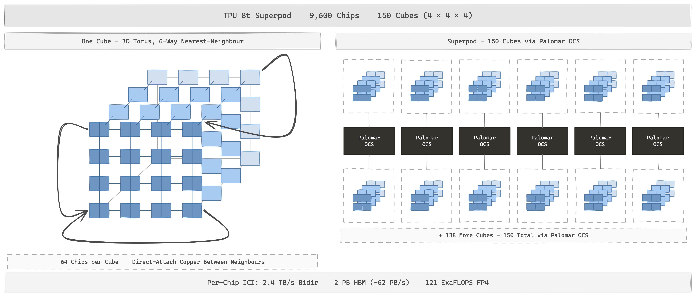

这使得 <em><strong><a data-popup="superpod">超级 Pod</a></strong></em> 扩展单位：相当于NVIDIA的NVL72，大两个数量级。 <a data-popup="tpu-v4">v4</a> 为4,096个芯片； <a data-popup="tpu-v5p">v5p</a>, 8,960; <em><strong><a data-popup="tpu-v7">Ironwood (TPU v7)</a></strong></em> 是 9,216 个芯片，排列为 144 个 64 的立方体，呈现 <em><strong>1.77 PB 的 <a data-popup="hbm">HBM</a> （~68 PB/s）和 42.5 ExaFLOPS <a data-popup="fp8">FP8</a></strong></em> 作为一个连贯的 <a data-popup="ici">ICI</a> 域。

<em><strong><a data-popup="tpu-8t">TPU 8t (Sunfish)</a></strong></em> 将其拉伸至 <em><strong>9,600 个芯片、2 PB 的 <a data-popup="hbm">HBM</a> （约 62 PB/s）和 121 ExaFLOPS FP4</strong></em>。 <em><strong><a data-popup="tpu-8i">TPU 8i (Zebrafish)</a></strong></em> 拥有 <em><strong>1,024 个芯片，约 295 TB 的 <a data-popup="hbm">HBM</a> (8.8 PB/s) 和 ~10 ExaFLOPS FP4</strong></em>。 8i 用新的分层 <a data-popup="high-radix">高基</a> 拓扑取代了圆环，称为 <em><strong><a data-popup="boardfly">Boardfly</a></strong></em> （4 片环 → 8 片组 → 通过 <a data-popup="ocs">OCS</a>连接最多 36 个组）、切割 <a data-popup="all-to-all">全部到全部</a> 延迟减半。这是专为 <a data-popup="moe">MoE</a> 推理而设计的。当 <a data-popup="collective">集合</a> 是最近邻时，3D 环面表现出色（<a data-popup="ring-all-reduce">环全归约</a> 使用每个链接每个周期），但 <a data-popup="moe-expert-routing">MoE专家路由</a> 是相反的模式， <a data-popup="all-to-all">全部到全部</a>：每个芯片都向每个芯片发送独特的片段，往返延迟受最长跳对的限制。 1,024 芯片 3D 环面的直径为 16 跳； <a data-popup="boardfly">Boardfly</a>的环 → 组 → OCS 层次结构将其压缩为 7。

<h5 id="scale-out">横向扩展</h5>

通过 <a data-popup="tpu-v7">TPU v7</a>，横向扩展在单个结构上运行： <em><strong><a data-popup="jupiter">Jupiter</a></strong></em>、 <em><strong>自 2022 年起在脊柱上采用全光学</strong></em> 通过 <em><strong><a data-popup="apollo">Apollo OCS</a></strong></em>，与 <a data-popup="palomar">Palomar</a>相同的3D-MEMS系列，在整个建筑中扩展。Google在从机架到数据中心骨干的每一层都使用相同的原语（光电路交换）；这是其他人没有的建筑特征。 <a data-popup="jupiter">木星</a> 今天每颗 <a data-popup="bisection-bandwidth">二分</a> 承载着 13 Pb/s

使用 <em><strong><a data-popup="tpu-8t">TPU 8t</a></strong></em>，横向拆分为两个结构。东西向 TPU 到 TPU 流量移至 <em><strong><a data-popup="virgo">Virgo</a></strong></em>，专用加速器结构； <a data-popup="jupiter">Jupiter</a> 保留了 <em><strong>南北</strong></em> 角色：存储访问、通用计算、和站点间缩放。 <a data-popup="virgo">处女座</a> 是 <em><strong><a data-popup="flat-topology">扁平</a>， <a data-popup="two-layer">两层</a>、 <a data-popup="non-blocking">非阻塞</a></strong></em> 拓扑构建于 <em><strong><a data-popup="high-radix">high-radix</a></strong></em> 开关：每个 TPU 最多有两个开关。一个 <a data-popup="virgo">处女座</a> 集群链接 134,000+ <a data-popup="tpu-8t">TPU 8t</a>s，47 Pb/s 的 <a data-popup="bisection-bandwidth">二分</a> （每芯片带宽的 4 倍，降低 40% <a data-popup="unloaded-latency">卸载延迟</a> 比上一代 <a data-popup="dcn">DCN</a> 一代）， <a data-popup="multi-planar-fault-isolation">多平面故障隔离</a> 和 <a data-popup="sub-millisecond-telemetry">亚毫秒遥测</a> 让调度程序在破坏步骤之前杀死落后者。架构的回报是，每一层现在都可以独立发展：纵向扩展、东西横向扩展，前端可以以不同的节奏进行迭代，而无需重新连接其他层。

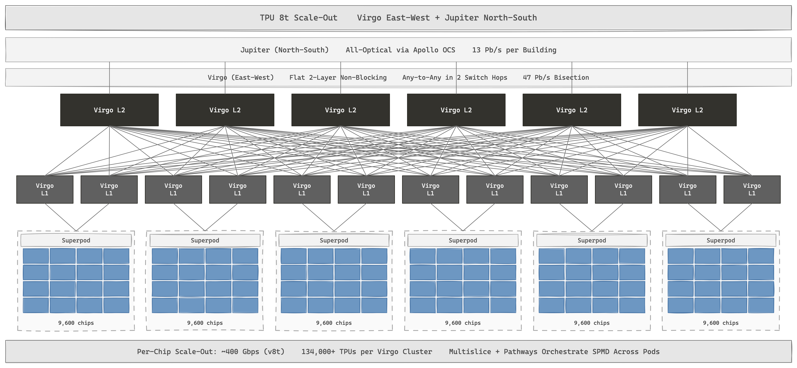

每芯片横向扩展带宽在 <em><strong>Ironwood <a data-popup="tpu-v7">上约为</a></strong></em>100 Gbps， <em><strong>4×</strong></em> 在 <em><strong><a data-popup="tpu-8t">v8t</a></strong></em>上，但仍然比每芯片 <a data-popup="ici">ICI</a>小两个数量级。这种带宽差距决定了分区： <a data-popup="tensor-parallelism">张量并行性</a> 和 <a data-popup="moe-expert-routing">MoE专家路由</a> 留在内部 <a data-popup="ici">ICI</a>; <a data-popup="data-parallelism">数据并行</a> 和 <a data-popup="pipeline-parallelism">管道并行性</a> 跨横向扩展结构。

Google 的 <em><strong><a data-popup="multislice">Multislice</a></strong></em> 框架，深入 <em><strong><a href="https://openxla.org/xla">XLA</a></strong></em>，让单个 <a data-popup="spmd">SPMD</a> 程序跨越多个 <a data-popup="slice">在不同的</a> pod <a data-popup="pod">中切片</a>；编译器在每个切片内发出分层 <a data-popup="collective">集合</a> （<a data-popup="ring-all-reduce">ring all-reduce</a> ， <a data-popup="higher-level-reduce">更高级别减少</a> ）。该结构正是隐藏 <a data-popup="ici">ICI</a>/<a data-popup="dcn">DCN的技巧</a> 带宽差距：在快速 ICI 上，尽可能多的工作保留在片内，仅留下跨片剩余部分来支付慢速结构成本。

在此之上是 <em><strong><a data-popup="pathways">路径</a></strong></em>。其中 <a data-popup="nccl">NCCL</a> + <a data-popup="slurm">泥浆</a> + <a data-popup="megatron">Megatron</a>-风格 <a data-popup="schedulers">调度程序</a> 驱动器 <a data-popup="spmd">SPMD</a> 来自许多控制器， <a data-popup="pathways">路径</a> 驱动整个作业 <em><strong>一个</strong></em> 客户端和 <a data-popup="virtualisation">虚拟化</a> 多个“岛屿”（<a data-popup="pod">pod</a> 及其自己的 <a data-popup="ici">ICI</a> 域）通过 <a data-popup="dcn">DCN</a>连接。它可以 <a data-popup="gang-scheduling">分组调度</a>、 <a data-popup="elastic-training">弹性训练</a> （当切片失败时， <a data-popup="ocs">OCS</a> 重塑拓扑并 <a data-popup="pathways">路径</a> 从新形状上的最后一个检查点恢复），并且 <a data-popup="cross-region-orchestration">跨区域编排</a>。 <em><strong>Gemini Ultra</strong></em> 是第一个跨多个数据中心训练的前沿模型； <a data-popup="pathways">Pathways</a> 将它们拼接成一个同步 <a data-popup="spmd">SPMD</a> 工作。

理念： <em><strong>编译器是调度器，环面是拓扑，光开关是通用可重构器底层</strong></em>，位于从机架到数据中心的每一层。

<h4 id="software">软件栈</h4>

TPU 堆栈由 <em><strong>编译器驱动</strong></em> 其中 CUDA 是 <em><strong>内核驱动的</strong></em>。在 GPU 上，开发人员将内核和 <a data-popup="framework">框架</a> 字符串内核一起编写； <a data-popup="compiler">编译器</a>的工作主要是 <a data-popup="local-optimisation">本地</a>。在 TPU 上，开发人员在 <em><strong><a href="https://github.com/jax-ml/jax">JAX</a></strong></em> 中编写一个数值程序，并且 <em><strong><a href="https://openxla.org/xla">XLA</a></strong></em> 负责其下面的所有内容：操作 <a data-popup="op-fusion">fuse</a>，其中每个张量 <a data-popup="residency">生命</a>，它是如何 <a data-popup="layout">在2D向量寄存器中</a> 布局的，当 <a data-popup="dma">DMA</a> 从 <a data-popup="hbm">HBM</a> 到 <a data-popup="vmem">VMEM</a> 问题，322 位 <a data-popup="vliw">VLIW</a> 捆绑包 <a data-popup="schedule">如何安排</a>，程序如何 <a data-popup="shards">分片</a> 跨越数千个芯片。没有硬件回退：没有 <a data-popup="warp-schedulers">warp 调度程序</a>，没有缓存，没有乱序引擎来掩盖错误 <a data-popup="schedule">时间表</a>。 <a data-popup="compiler">编译器</a> 是系统。权衡是该架构的核心之一： <em><strong>XLA 更接近理论 <a data-popup="ceiling">天花板</a> ，无需手动调整，但 <a data-popup="closing-the-gap">接近剩下的间隙</a> 更难</strong></em>。

编译路径为 <em><strong><a data-popup="jax">JAX</a> → <a data-popup="jaxpr">JAXpr</a> → <a data-popup="stablehlo">稳定HLO</a> → <a data-popup="hlo">HLO</a> → <a data-popup="llo">LLO</a> → <a data-popup="vliw-bundles">VLIW 捆绑包</a></strong></em>。 <em><strong><a data-popup="jax">JAX</a></strong></em> 将 Python 函数跟踪为 <a data-popup="typed">类型化</a> <a data-popup="functional-programming">函数</a> <a data-popup="ir">IR</a> (<a data-popup="jaxpr">JAXpr</a>）在 <a data-popup="jit"><code class="notranslate" translate="no">jit</code></a>下，将其降低到 <em><strong><a data-popup="stablehlo">StableHLO</a></strong></em> （ <a data-popup="openxla">OpenXLA</a>-标准化， <a data-popup="versioned">版本</a> <a data-popup="op-set">操作集</a> 约100 <a data-popup="statically-shaped">静态形状基元</a> 所有 <a data-popup="front-ends">前端</a> 现在 <a data-popup="emit">发出</a>），XLA <a data-popup="ingest">摄取</a> 作为 <em><strong><a data-popup="hlo">HLO</a></strong></em> 并通过其传递管道运行： <em><strong><a data-popup="op-fusion">操作融合</a></strong></em> （折叠 <a data-popup="pointwise">逐点</a> + <a data-popup="reduction">减少</a> + <a data-popup="matmul">matmul</a> 到一个内核中，这样中间体就不会达到 HBM）， <em><strong><a data-popup="layout-assignment">布局分配</a></strong></em> （决定每个张量的 <a data-popup="2d-tiling">2D 平铺</a> ，以便它 <a data-popup="streams">流</a> 转换为 <a data-popup="mxu">MXU</a> ，无需 <a data-popup="transpose">转置</a>：实质上比 <a data-popup="1d-simd">1D SIMD 机器</a> 难，因为寄存器和脉动输入都是 2D）， <em><strong><a data-popup="buffer-assignment">缓冲区分配</a></strong></em> （每个张量固定到VMEM、CMEM或HBM，并 <a data-popup="overlap-windows">重叠窗口</a> 预先计算）， <em><strong><a data-popup="spmd-partitioner">SPMD 分区</a></strong></em>，最后是一个 VLIW <a data-popup="schedule">调度程序</a> ，填充每个包的所有八个插槽。 <a data-popup="hlo">HLO</a> 降低为 <em><strong><a data-popup="llo">LLO</a></strong></em> （低级优化器），TPU 特定 <a data-popup="ir">IR</a>，LLO <a data-popup="emit">发出</a> 最终的VLIW流。编译良好的程序会重叠 <a data-popup="mxu">MXU</a> 脉动执行、VPU <a data-popup="element-wise">元素级数学</a>以及HBM↔VMEM DMA 每个周期都在同一个捆绑包中。

多芯片执行是 <em><strong><a data-popup="spmd">SPMD</a></strong></em>：一个程序、分片数据、分层 <a data-popup="collective">集体</a>、 <a data-popup="emit">发布</a> 由 <em><strong><a data-popup="gspmd">GSPMD</a></strong></em> （现已被 <em><strong><a data-popup="shardy">Shardy</a></strong></em>取代， <a data-popup="mlir">MLIR</a>- 原生后继者将于 2026 年初作为默认版本）。用户以声明方式表达分片  与 <em><strong><a data-popup="mesh">网格</a></strong></em> + <em><strong><a data-popup="partitionspec">PartitionSpec</a></strong></em> 几个关键张量的注释； <a data-popup="compiler">编译器</a> 通过 <a data-popup="graph">图的其余部分传播分片</a> 并插入 <a data-popup="all-reduce">全部归约</a>、 <a data-popup="all-gather">全部聚集</a>和 <a data-popup="reduce-scatter">reduce-scatters</a> 布局发生变化的地方。当 <a data-popup="compiler">编译器</a> 选择了错误的集合时， <em><strong><a data-popup="shard-map">shard_map</a></strong></em> 会将用户放入 <em><strong>手动 SPMD</strong></em> （具有显式本地形状和显式 <a data-popup="collective">集合</a>的每设备代码），可在内部组合 <code class="notranslate" translate="no">jit</code> 因此可以对单个内核进行手动分区，而无需在其他地方放弃自动分区。这是 PyTorch 习惯用法的反面： <em><strong><a data-popup="fsdp">FSDP</a></strong></em> 和 <em><strong><a data-popup="deepspeed">DeepSpeed</a></strong></em> 将模型包装在运行时中模块边界处的问题 <a data-popup="collective">集合</a> ； GSPMD/Shardy 将整个 <a data-popup="graph">图</a> 划分为 <a data-popup="compiler">编译器</a> 问题。

<em><strong><a data-popup="pallas">帕拉斯</a></strong></em> 是逃生舱口：JAX 的内核编写语言，大致相当于 GPU 上的 <em><strong><a data-popup="triton">Triton</a></strong></em> 。 Pallas 内核采用 JAX 风格的 Python 编写，通过 <em><strong><a data-popup="mosaic-tpu">Mosaic</a></strong></em> （基于 <a data-popup="mlir">MLIR</a>的 TPU 降低） backend）到 LLO，并作为自定义操作嵌入回 HLO。它的存在是因为 XLA 无法始终为新颖的注意力变体、融合的 MoE 调度或任何需要手动 VMEM 平铺和 DMA 调度的事物综合最佳结果： <em><strong>FlashAttention-class</strong></em> 优化，其中胜利在于 <a data-popup="schedule">调度</a> 而不是代数。 <em><strong>Pallas:Mosaic-GPU</strong></em> 以相同的目标H100/Blackwell前端，因此内核作者可以写入一次并降低到任一基板。上面的库层统一是 JAX 原生的： <em><strong><a data-popup="flax">Flax NNX</a></strong></em> 用于模块， <em><strong><a data-popup="optax">Optax</a></strong></em> 用于优化器， <em><strong><a data-popup="orbax">Orbax</a></strong></em> 用于异步分布式检查点， <em><strong><a data-popup="grain">Grain</a></strong></em> 用于输入管道， <em><strong><a data-popup="tunix">Tunix</a></strong></em> 用于训练后/强化学习， <em><strong><a data-popup="qwix">Qwix</a></strong></em> 用于量化。 Google 的参考培训堆栈（适用于 LLM 的<em><strong><a data-popup="maxtext">MaxText</a></strong></em> ，包括 DeepSeek-V3 级 MoE，以及 <em><strong><a data-popup="maxdiffusion">MaxDiffusion</a></strong></em> 对于 Flux，Wan 2.1）位于顶部，在纯 JAX 中； <em><strong><a data-popup="pathways">Pathways</a></strong></em> 位于下方，以如下形式向用户公开 <em><strong><a data-popup="pathwaysutils">Pathsutils</a></strong></em>，因此单个 Python 客户端可以跨数千个芯片和多个 pod 岛驱动作业，而无需放弃 JAX 编程模型。

PyTorch 路径是真实的，但是二流的。 <em><strong><a data-popup="torch-xla">torch_xla</a></strong></em> 使用 <em><strong><a data-popup="lazy-tensor">LazyTensor</a></strong></em> 机制：每个PyTorch操作记录到一个HLO <a data-popup="graph">图</a> 中，并在下一个PyTorch操作中进行编译屏障，编译后的工件由图形形状哈希缓存。 PyTorch/XLA 2.x 添加了 <em><strong>GSPMD 风格的分片注释</strong></em>， <em><strong><code class="notranslate" translate="no">torch.compile</code> 通过 XLA 后端集成</strong></em> 、 <em><strong>JAX 桥</strong></em>和 (PyTorch/XLA 2.7) C++11-ABI 构建，跟踪速度明显加快。与 JAX 的差距是真实存在的（JAX 的原语更清晰地映射到 <a data-popup="stablehlo">StableHLO</a>，并且更好地涵盖了复杂的并行策略），这就是为什么 <em><strong><a data-popup="vllm-tpu">vLLM TPU</a></strong></em> （由 Cloud Next 2025 上宣布的 <em><strong><a data-popup="tpu-inference">tpu-inference</a></strong></em> 插件提供支持）降低 <em><strong>每</strong></em> 模型，JAX 定义或 PyTorch 定义，通过 <em><strong>统一 JAX→XLA 路径</strong></em>。 <em><strong><a data-popup="torchtpu">TorchTPU</a></strong></em>于 2026 年 4 月宣布，Google 的回应是：采用 Eager 模式的原生 PyTorch 体验、 <code class="notranslate" translate="no">torch.distributed</code>和 XLA 上的 <code class="notranslate" translate="no">torch.compile</code> ，有望取代 torch_xla。

与 CUDA 相比， TPU 生态系统是 <em><strong>集中式的，而不是无序扩张的</strong></em>。框架下的几乎所有内容（XLA、JAX、Flax、Optax、Pallas、MaxText、Pathways、Shardy、Mosaic）都是 Google 本身开源的，与芯片同步发展。第三方内核远少于CUDA几十年的积累；当工作负载看起来很奇怪时，护城河就更薄；当工作负载看起来像双子座时，护城河就更深。最近的 <em><strong>Ironwood (v7)“共同设计的人工智能堆栈”</strong></em> 语言是明确的框架：chip、ICI Fabric、OCS、XLA、Pathways、Pallas、MaxText、vLLM 和 Pathways 作为一个产品共同发布，v8t/v8i 在单 tpu 推理降低路径。 <em><strong>Triton</strong></em> 和 <em><strong><code class="notranslate" translate="no">torch.compile</code></strong></em> 缩小了 NVIDIA 方面的差距（内核驱动和编译器驱动正在趋同），但哲学极点仍然存在真实： <em><strong>在 TPU 上， <a data-popup="compiler">编译器</a> 是唯一重要的接口； GPU 上的 <a data-popup="compiler">编译器</a> 是其中之一。</strong></em>

<h3 id="amd-gpu">AMD GPU</h3>

 <em><strong><a href="https://www.amd.com/en/products/accelerators/instinct.html">AMD Instinct</a> GPU</strong></em> 建立在与 NVIDIA 不同的押注之上：NVIDIA 每一代都扩展了每个 SM 的能力 <em></em>，而 AMD 则拥有 <em><strong><a data-popup="cu">计算自</a></strong></em> GCN <a data-popup="gcn">（2012）以来，单位</a> 一直保守，并重新投资到该套件中：与当代 NVIDIA 旗舰产品相媲美或击败 <a data-popup="hbm">HBM</a> 自 2021 年以来每一代的容量；第一个 <em><strong>3D堆叠</strong></em> 数据中心GPU (CDNA 3)；第一个连贯的 <em><strong>CPU+GPU <a data-popup="apu">APU</a></strong></em> (<a data-popup="mi300a">MI300A</a>)；以及 <em><strong>开放生态系统</strong></em> (<a data-popup="rocm">ROCm</a>, <a data-popup="hip">HIP</a>、OCP MX、 <a data-popup="ualink">UALink</a>）。

<h4 id="genealogy">演进路线</h4>

2018

<strong><em><a href="https://www.amd.com/content/dam/amd/en/documents/instinct-business-docs/specs/radeon-instinct-mi50-data-sheet.pdf">Vega 20</a></em></strong><a data-popup="mi50">MI50</a>、 <a data-popup="mi60">MI60</a>

首款 7 nm GPU； 1:2 <a data-popup="fp64">FP64</a> 矢量吞吐量。 <a data-popup="cdna">CDNA</a> / RDNA 之前的最后一个 GCN 系列本能。

2020

<strong><em><a href="https://www.amd.com/content/dam/amd/en/documents/instinct-business-docs/white-papers/amd-cdna-white-paper.pdf">CDNA</a></em></strong><a data-popup="mi100">MI100</a>

第一个 <a data-popup="mfma">MFMA</a> 矩阵核心；图形固定功能硅完全下降。原生 <a data-popup="bf16">BF16</a>.

2021

<strong><em><a href="https://www.amd.com/content/dam/amd/en/documents/instinct-business-docs/white-papers/amd-cdna2-white-paper.pdf">CDNA 2</a></em></strong><a data-popup="mi210">MI210</a>， <a data-popup="mi250">MI250</a>、 <a data-popup="mi250x">MI250X</a>

第一个通过双 GCD 包的 MCM Instinct；全速率 <a data-popup="fp64">FP64</a> 矩阵

2023

<strong><em><a href="https://www.amd.com/content/dam/amd/en/documents/instinct-tech-docs/white-papers/amd-cdna-3-white-paper.pdf">CDNA 3</a></em></strong><a data-popup="mi300a">MI300A</a>、 <a data-popup="mi300x">MI300X</a>

首款 3D 堆叠小芯片 GPU： <a data-popup="xcd">XCD</a> 混合键合到 <a data-popup="iod">IOD</a> 通过 <a data-popup="tsv">TSV</a>; <a data-popup="fp8">FP8</a>; <a data-popup="infinity-cache">无限缓存</a>; MI300A 上一致的 CPU+GPU <a data-popup="apu">APU</a> ；动力 <a data-popup="el-capitan">El Capitan</a>。

2024

<strong><em>CDNA 3 刷新</em></strong><a data-popup="mi325x">MI325X</a>

相同计算， <a data-popup="hbm3e">HBM3E</a> 刷新：256 GB（6.0） TB/s。

2025

<strong><em><a href="https://www.amd.com/en/products/accelerators/instinct/mi350.html">CDNA 4</a></em></strong><a data-popup="mi350x">MI350X</a>, <a data-popup="mi355x">MI355X</a>

本机 <strong><a data-popup="fp4">FP4</a></strong> / FP6，具有 OCP MX 微缩放功能；每个 CU <a data-popup="fp64">FP64</a> 大约减少一半；第一代倾向于 AI 密度而非 HPC。

2026

<strong><em><a href="https://www.amd.com/en/blogs/2025/amd-advancing-ai-2025-mi400-helios-rack-scale-ai-platform.html">CDNA Next</a></em></strong><a data-popup="mi430x">MI430X</a>, <a data-popup="mi440x">MI440X</a>, <a data-popup="mi455x">MI455X</a>

<a data-popup="hbm4">HBM4</a>; <a data-popup="helios">Helios</a> 机架（72-GPU <a data-popup="mi455x">MI455X</a> 旗舰版 <a data-popup="ualoe">UALoE</a> 发布时，本机 <a data-popup="ualink">UALink</a> 从 2027 年开始）：AMD 对 NVL72 的第一个答案。

<h4 id="architecture">架构</h4>

术语

<table class="analogy">
<thead>
<tr><th>AMD</th><th>NVIDIA</th></tr>
</thead>
<tbody>
<tr><td>计算单元(CU)</td><td>流式多处理器（SM） (SM)</td></tr>
<tr><td>SIMD</td><td>SM 子分区</td></tr>
<tr><td>SIMD 通道</td><td>CUDA 核心 (FP32 ALU)</td></tr>
<tr><td>波前 (wave64)</td><td>warp (warp32)</td></tr>
<tr><td>矩阵核心</td><td>Tensor Core</td></tr>
<tr><td>MFMA</td><td>mma.sync / wgmma / tcgen05.mma</td></tr>
<tr><td>VGPR / SGPR</td><td>寄存器文件</td></tr>
<tr><td>LDS（本地数据共享）</td><td>SMEM（共享内存）</td></tr>
<tr><td>Infinity Fabric</td><td>NVLink</td></tr>
</tbody>
</table>

NVIDIA 的架构雄心所在 <em>内部</em> 每个 SM（新张量基元、新异步机制、每一代新操作数存储），AMD 的生命 <em>在</em>  <a data-popup="cu">CU</a>之间，有多少个CU可以绑定到一个一致的包中。 CU 本身比较保守：四个 16 通道 <a data-popup="simd-amd">SIMD</a>、一个共享标量单元、一个 64 KB <a data-popup="lds">本地数据共享</a>，L1向量缓存，per-SIMD <a data-popup="vgpr">具有 CU 共享</a> SGPR <a data-popup="sgpr">池的 VGPR</a> 文件，以及（自 CDNA 1 起） <a data-popup="matrix-core">矩阵核心</a> 运行 <a data-popup="mfma">MFMA</a>。从那以后形状没有发生任何有意义的变化 <a data-popup="gcn">2012 年 GCN</a> ；计数是多少（120 个 CU） <a data-popup="mi100">MI100</a>，220 上 <a data-popup="mi250x">MI250X</a>，304 上 <a data-popup="mi300x">MI300X</a>，256 上 <a data-popup="mi355x">MI355X</a>）以及将它们粘合在一起的包装。 <a data-popup="wavefront">wavefront</a> 64 个线程在 4 个周期内跨 16 个 SIMD 通道进行流传输，每个 SIMD 驻留许多波前，调度程序在这些波前之间进行切换以隐藏停顿。这里没有什么异国情调； CDNA 的有趣之处在于 <em></em> CU 之外的一切。

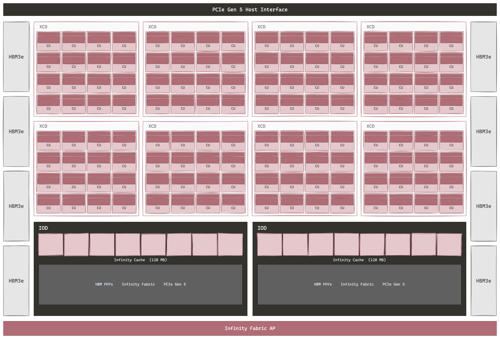

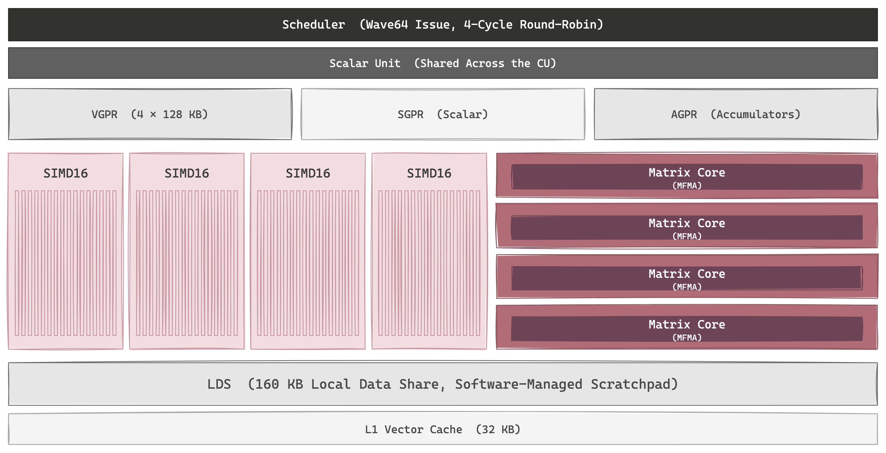

<h5 id="compute">计算</h5>

CU 内部、SIMD 和矩阵核心并排运行。四个 <a data-popup="simd-amd">SIMD</a> 按元素处理所有内容：激活、标准化、残差、地址算术。 <a data-popup="matrix-core">Matrix Core</a> 处理 matmul。拆分与 NVIDIA 的 <a data-popup="cuda-cores">CUDA 核心</a> / <a data-popup="tensor-cores">Tensor Core</a> 拆分相同，但矩阵抽象具有沿着一条截然不同的曲线发展。

NVIDIA 的 Tensor Core 攀登了线程层次结构： <a data-popup="warp">warp</a> 上的 32 线程 <a data-popup="v100">Volta</a>，一个 128 线程 <a data-popup="warp-group">warp-group</a> on <a data-popup="h100">Hopper</a>，单个线程加上 <a data-popup="two-sm-mma">两个SM集群</a> 上 <a data-popup="b200">Blackwell</a>。 AMD 的 Matrix Core 保持不变。每一代 <a data-popup="mfma">MFMA</a> （从2020年的MI100到2025年的MI355X）都是波前范围的：一个 <a data-popup="wave64">wave64</a> 发出单个矩阵运算 (<code class="notranslate" translate="no">V_MFMA_*</code>)，四个 SIMD 协作驱动它，操作数来自波前的寄存器文件：A 和 B 来自 <a data-popup="vgpr">VGPR</a>，C 和 D 通常来自专用 <a data-popup="agpr">AGPR</a> 文件。指令变得更快，格式集更宽，但发行者和范围却没有。 CDNA 4 提供了一个馈线端让步：来自 LDS <em>的专用</em> MFMA 转置加载，将操作数交给已经处于所需布局的 Matrix Core，与 NVIDIA 的 TMA 相比，其精神较小，但矩阵运算本身仍然是波发布的。

吞吐量数字直接说明了格式的情况。 CDNA 1 于 2020 年推出，采用 FP32 / FP16 / <a data-popup="bf16">BF16</a> / INT8，每个 CU 每个周期 256 / 1024 / 512 / 1024 FLOP，具有本机 <a data-popup="bf16">BF16</a> 与 <a data-popup="a100">A100</a>一起支持。 CDNA 2 是 <a data-popup="fp64">FP64 的两倍</a> 通往 256 FLOPs/CU/cycle 的全速率矩阵的路径：AMD 独有的，将 MI250X 放入 <a data-popup="frontier">Frontier</a>的押注。 CDNA 3 在 <a data-popup="h100">FP8 上与</a> H100 <a data-popup="fp8">达到同等水平</a> 在 4,096 次浮点运算 (E4M3 + E5M2) 时，添加了 2:4 <a data-popup="structured-sparsity">结构化稀疏性</a>，并添加了 <a data-popup="xf32">TF32</a>- 通过截断尾数以 FP64 矩阵速率运行 FP32 matmul 的等效路径。 cDNA 4 再次翻倍 <a data-popup="fp4">FP4</a> 16,384 FLOPs 和 FP6，具有 <a data-popup="block-scale-multiplication">OCP MX 块缩放</a>，并在一个 MFMA 中添加了可混合的 A/B 精度：FP8 × FP4，例如。同一代将每个 CU FP64 吞吐量减半，这是第一款用 HPC 密度换取 AI 密度而不是两者兼而有之的 AMD 芯片。

波前范围决策体现在两种成本上。

<em><strong>分歧。</strong></em> 半空 <a data-popup="wave64">wave64</a> 浪费32个通道，而半空warp32浪费16个通道。对于控制流基本一致的工作负载来说，这是一个很小的代价；

<em><strong>重叠。</strong></em> NVIDIA 的异步、描述符驱动的 matmul 将问题与执行分离：发出线程触发指令并继续； Tensor Core 在后台运行； warp 可以运行 softmax、应用掩模或在前一个 matmul 仍在运行时预加载下一个图块。 AMD 的波前集体 MFMA 没有给 Wave 提供等价物：发出 matmul 的同一波在待处理时无法同时进行有意义的矢量工作。重叠可以跨越 <em>单独的</em> 波前，但必须在具有明确波前屏障的软件中进行，这更脆弱并且消耗更多的波槽和寄存器。

这有多重要取决于 <em><strong>纯密集GEMM</strong></em> （DGEMM，大批量训练的内循环）在matmul过程中没有任何用处；两台发动机均饱和；异步买的东西很少。这些正是 AMD 在百亿亿次 HPC 领域历来领先的工作负载（<a data-popup="frontier">Frontier</a> 在 MI250X 上， <a data-popup="el-capitan">El Capitan</a> 在 MI300A 上）。 <em><strong>Transformer注意</strong></em> (<a data-popup="flashattention-versions">FlashAttention-3</a>，FA4) 将 matmul 与 softmax、掩码和 KV 缓存读取交错，异步重叠是这些内核的整个结构。 AMD 必须手动重新创建管道，这落后于 NVIDIA 的硬件级支持。 <em><strong>MoE 调度、分页注意力、推测解码</strong></em> 处于同一阵营：地址不规则工作想要与 matmul 一起运行。

NVIDIA 的矩阵指令抽象在各代中得到了进一步发展（warp → warp-group → 单线程异步 + 集群），而 AMD 却没有跟进。

<h5 id="memory">内存</h5>

AMD 的内存层次结构 <em>更少</em> 比 NVIDIA 的通用层，具有 NVIDIA 根本没有的巨型缓存。从 CU 向外：一个 64 KB <a data-popup="lds">LDS</a> scratchpad（软件管理、32 个库、AMD 的 NVIDIA 的 <a data-popup="l1-shared-memory">SMEM</a>)，一个向量 L1（早期 CDNA 上为 16 KB，从 <a data-popup="mi300x">MI300X</a> 开始为 32 KB），每<a data-popup="xcd">XCD</a> 几 MB 的 L2。不过，L2 在 XCD 之间并不一致；一致性发生在 L2 之上的一层。

该层是 <a data-popup="infinity-cache">无限缓存</a>：MI300X 上为 256 MB，分布在四个 <a data-popup="iod">IOD</a>，16 路组关联，测得约 12 TB/s，是 MI300X 5.3 TB/s 的两倍多 <a data-popup="hbm3">HBM3</a>。它起源于 RDNA 游戏 GPU，以补偿狭窄的 GDDR 总线； AMD 在 CDNA 3 上重用了 AI 的 IP，其中注意力 KV 重用和权重重用非常适合大型 LLC。 NVIDIA 押注于更大的 HBM 带宽（ <a data-popup="b200">B200 上为 8 TB/s</a>，在 <a data-popup="hbm4">Rubin 上使用</a> HBM4 <a data-popup="rubin">进行缩放</a>），AMD 则押注于缓存。

片外 HBM 容量大幅增长： <a data-popup="mi100">MI100 上的 32 → 64 → 128 → 192 → 256 → 288 GB</a> / <a data-popup="mi210">MI210</a> / <a data-popup="mi250x">MI250X</a> / <a data-popup="mi300x">MI300X</a> / <a data-popup="mi325x">MI325X</a> / <a data-popup="mi350x">MI350X</a>，从 2021 年起的每一代产品均达到或超过当代 NVIDIA 旗舰产品。押注是推理工作负载越来越受到容量限制，并且具有更多内存的芯片会获胜。

<h5 id="numerics">数值格式</h5>

格式轨迹跟踪 AI 芯片中每个人共享的精度减半模式：FP32 → FP16 → FP8 → FP4，每一步恢复精度更细粒度的缩放。 AMD 特定的轴是 <em><strong>开放性</strong></em>。 CDNA 4 的 <a data-popup="fp4">FP4</a> 和 FP6 使用 <em><strong><a data-popup="block-scale-multiplication">OCP MX</a> 块级乘法</strong></em>：与 <a data-popup="b200">Blackwell</a>的MXFP4和TPU v8的MXU相同的数字格式，但由开放联盟（AMD、NVIDIA、Intel、Meta、Microsoft、高通、ARM）是 AMD 帮助创建的，而不是由任何单一供应商创建的。 MI355X 中提供的格式与 B200 和 TPU v8 中提供的格式相同。

CDNA 4 变形值得拥有自己的行：每 CU FP64 吞吐量减半。 <a data-popup="mi300x">MI300X</a> 集训练、HPC、推理为一体； <a data-popup="mi355x">MI355X</a> 首先是一颗AI芯片。为 <a data-popup="frontier">Frontier</a> 提供动力的全速率 FP64 矩阵押注尚未被淘汰，但它不再承载重量。

<h5 id="chiplets">Chiplet</h5>

在包装上，CDNA 不再像 NVIDIA，而是开始变得不同。

CDNA 1 的 <a data-popup="mi100">MI100</a> 是整体式的7纳米。 CDNA 2 的 <a data-popup="mi250x">MI250X</a> 是 AMD 首款多芯片 GPU：两个 <a data-popup="aldebaran">Aldebaran</a> GCD 并排位于 2.5D EFB 有机基板上，由 4 个封装内 <a data-popup="infinity-fabric">Infinity Fabric</a> 链路连接，聚合速度为 400 GB/s，但作为两个单独的 GPU 提供给软件。

CDNA 3 是改变一切的举措。八个 <em><strong><a data-popup="xcd">XCD</a></strong></em> （TSMC N5，每个约为 115 mm²）通过 <em><strong><a data-popup="soic">TSMC SoIC 以 3D 方式堆叠</a></strong></em> 混合键合（亚微米间距 <em><strong><a data-popup="tsv">TSV</a></strong></em>，无微凸块）到四个 <em><strong><a data-popup="iod">I/O芯片</a></strong></em> （台积电 N6）如下。 IOD 承载 <a data-popup="infinity-cache">Infinity Cache</a>、 <a data-popup="hbm3">HBM3</a> PHY、Infinity Fabric 链路和 <a data-popup="pcie-gen5">PCIe Gen 5</a>；每个 IOD 上面托管两个 XCD，旁边托管两个 HBM 堆栈。四个 IOD 由 <em><strong><a data-popup="infinity-fabric-ap">Infinity Fabric AP</a></strong></em> 以 4.8 TB/s 的平分速度拼接而成，因此 1530 亿个晶体管封装对于内核来说就像一个 GPU：缓存和地址空间在 IOD 层统一。 NVIDIA 在 <a data-popup="h100">H100</a> 中保持整体性，并且在 <a data-popup="b200">B200</a> 上仅采用两个十字线限制芯片2.5D <a data-popup="cowos">CoWoS-L</a>。 AMD 更早地在一代上实现了 3D 堆叠，每芯片面积更小：在同一封装前沿上有不同的选择。

 <em><strong><a data-popup="mi300a">MI300A</a> <a data-popup="apu">APU</a></strong></em> 进一步推动了押注。将 8 个 XCD 中的 2 个替换为 3 个 Zen 4 <em><strong><a data-popup="ccd">CCD</a></strong></em>，保持 HBM 和无限缓存以及 IOD 完好无损，并让 CPU 和 GPU 共享一个由 HBM3 支持的物理地址空间，并具有硬件一致性。没有主机设备副本。没有固定的内存。路径中没有 PCIe。 Zen 4 核心和 CDNA 3 XCD 从同一页面读取。 NVIDIA 的 <a data-popup="gh200">Grace-Hopper</a> 桥 <em></em> NVLink-C2C <a data-popup="nvlink-c2c">上有两个</a>包； MI300A 是 <em>一个</em>。 <em><strong><a data-popup="el-capitan">El Capitan</a></strong></em> （11,039 个节点，4× MI300A) 的部署证明了它的合理性。

在 CDNA 4 的 <a data-popup="mi355x">MI355X</a>上，八个 <a data-popup="xcd">XCD</a> 仍然通过 <a data-popup="soic">SoIC</a> 3D堆叠到下面的基片上，但XCD转移到TSMC N3P每个有 32 个活动 CU（总共 256 个，而上层有 304 个） <a data-popup="mi300x">MI300X</a>;对于更大的 <a data-popup="matrix-core">矩阵核心</a> 和 160 KB <a data-popup="lds">LDS</a>），每个 XCD 数量下降到可用区域。四个 MI300X <a data-popup="iod">IOD</a> 在 TSMC N6 上折叠为两个，每个宽度是 TSMC N6 的两倍，上面托管四个 XCD，旁边托管四个 <a data-popup="hbm3e">HBM3E</a> 堆栈。现在，每个 IOD 都拥有自己的 256 MB <a data-popup="infinity-cache">无限缓存中的 128 MB 切片</a>、一半的 HBM PHY、 <a data-popup="infinity-fabric">Infinity Fabric</a> 链接的份额以及 <a data-popup="pcie-gen5">PCIe Gen 5</a>. <a data-popup="infinity-fabric-ap">两个 IOD 之间的 Infinity Fabric AP</a> 以 5.5 TB/s 等分运行（比 CDNA 3 高约 15%），八个堆栈转移到 12-Hi HBM3E，以 8 TB/s 的速度提供 288 GB，比容量高 50% MI300X 具有相同的引脚数。该软件包总共有 1,850 亿个晶体管，并且仍然以一个 GPU 的形式呈现给内核。

<h5 id="bets">核心押注</h5>
<ul>
<li><em><strong>押注 1：HPC 然后 AI。</strong></em> HPC 和 AI 是同一个押注 <em>直到它们不是</em>：从 CDNA 2 到 CDNA 3 传送全速率 FP64 矩阵，然后一旦推理经济学决定性地支持低精度，就在 CDNA 4 处分叉。</li>
<li><em><strong>押注 2：内存</strong></em> 自 2021 年以来的每一代 HBM 容量都匹配或击败当代 NVIDIA 旗舰产品，并添加 256 MB 末级 <a data-popup="infinity-cache">无限缓存</a> 吸收 H100 必须命中 HBM 的重用for.</li>
<li><em><strong>押注 3：早期 3D 堆栈。</strong></em> 先于 NVIDIA 进行缓存和 I/O 3D 堆栈计算：台积电 <a data-popup="soic">SoIC</a> 2023 年在 IOD 上采用混合键合 XCD，而 NVIDIA 一直保持单一架构直至 2025 年。</li>
<li><em><strong>押注 4：一致的 CPU+GPU。</strong></em>  <a data-popup="mi300a">MI300A</a> APU 是有史以来对小芯片攻击性最强的产品， <a data-popup="el-capitan">El Capitan</a> 部署是证明。</li>
<li><em><strong>押注 5：开放扩展结构。</strong></em> <a data-popup="ualink">UALink</a> 和 OCP MX over <a data-popup="nvlink">NVLink</a> 和专有 FP4。</li>
</ul>
<h4 id="scaling">扩展</h4>

内存押注会产生缩放结果：当 8 <a data-popup="mi300x">MI300X 时</a> 一个芯片可容纳 1.5 TB 的 HBM，8 个 <a data-popup="mi350x">MI350X</a> 芯片可容纳 2.3 TB，您可以在其中安装 405B 参数型号 <a data-popup="fp8">FP8</a> 位于单个 8-GPU 盒子内（权重、KV 缓存以及用于更长上下文和更大批量的余量），其中相同模型在 8× <a data-popup="h100">H100</a> (640 GB) 上需要仔细分片。对于 2024 年至 2025 年的推理工作负载，AMD 的扩展不需要在机架上与 NVL72 相匹配即可在盒子上具有竞争力。为了 <em>在前沿进行训练</em> 确实如此，AMD 直到 2026 年才找到答案。

纵向扩展

将 GPU 绑定到一个一致的内存域中 <a data-popup="infinity-fabric">Infinity Fabric</a>。通过 <a data-popup="mi355x">MI355X</a> 这会停止在 8-GPU <a data-popup="oam-ubb">OAM</a> 框（每个 GPU 896 GB/s 网格）。 <a data-popup="helios">Helios</a> 扩展通过 <a data-popup="ualink">UALink</a>连接到 72-GPU 机架，在启动时通过以太网隧道传输 (<a data-popup="ualoe">UALoE</a>)，并且来自2027 年。

横向扩展

通过以太网将这些域联网。无 <a data-popup="infiniband">InfiniBand</a>。 <a data-popup="pensando">Pensando</a> NIC（<a data-popup="pollara">Pollara 400</a>、 <a data-popup="vulcano">Vulcano 800</a>）实施 <a data-popup="uec">超以太网联盟</a>的 <a data-popup="uet">UET</a> <a data-popup="rdma">RDMA</a> 传输； <a data-popup="tomahawk-6">Broadcom Tomahawk 6</a> 提供 <a data-popup="switch-asic">交换机 ASIC</a> 和 <a data-popup="cpo">CPO</a>。

<h5 id="scale-up">纵向扩展</h5>

通过 MI355X，AMD 的规模化意味着 <strong>8-GPU <a data-popup="oam-ubb">OAM</a> 平台</strong> 超过 <a data-popup="infinity-fabric">Infinity面料</a>。每个 <a data-popup="mi300x">MI300X</a> 都有 7 个 IF 链路（一个到盒子中的每个对等点），双向 128 GB/s，在完全连接的全对所有拓扑中提供 896 GB/s 的每 GPU 网格带宽。 <a data-popup="mi350x">MI350X</a> 将每个链接提升至 153.6 GB/s（每个 GPU 约 1,075 GB/s），但保持 8-GPU 形状。该平台符合 OCP 的 UBB 2.0：与 NVIDIA HGX 基板相同的机械插槽，因此服务器供应商可以在同一机箱上搭载 AMD 或 NVIDIA，而无需重新设计系统。

AMD 没有通过 MI355X 推出的是相当于 NVL72 的机架级产品。在 MI300X 集群上运行较大模型的客户可以通过以太网在多个 8-GPU 盒子之间进行扩展，为 NVIDIA 用户可以保留在内部扩展中的内容支付扩展延迟的费用。这是对训练至关重要的差距， <em><strong><a data-popup="helios">Helios</a></strong></em> 就是为了弥补这一差距而设计的。

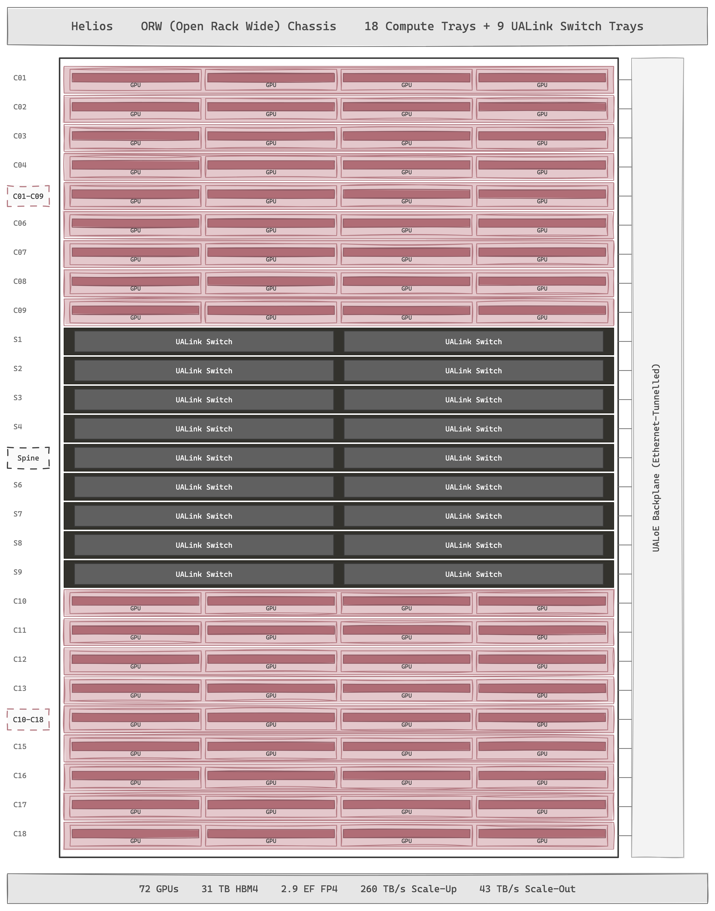

Helios 是 AMD 首款机架级扩展域，将于 2026 年 2 月与 <a data-popup="mi455x">MI455X</a>一起发货。每机架 72 个 GPU，约 31 TB <a data-popup="hbm4">HBM4</a>，1.4 PB/s 聚合 HBM 带宽，2.9 ExaFLOPS FP4 / 1.4 ExaFLOPS FP8，260 TB/s 纵向扩展带宽，43 TB/s 横向扩展。外形尺寸为 <strong><a data-popup="orw">开放式机架宽 (ORW)</a></strong> （Meta 的 2025 年 OCP 提交，双宽和液冷），而不是 AMD 专有机箱。基于 Meta 的参考设计而不是从头开始设计机架是 AMD 的一个深思熟虑的押注：任何在 ORW 上标准化的超大规模企业都可以部署 Helios，而无需定制数据中心设施。

结构是 <em><strong><a data-popup="ualink">UALink</a></strong></em>：Ultra Accelerator Link 是 AMD 与 Apple、AWS、Cisco、Google、HPE、Intel、Meta、Microsoft 和 Synopsys 共同创建的开放联盟标准。 UALink 200G 1.0（2025 年 4 月）定义了 200 GT/s 通道和每个方向 800 Gbps，交换拓扑可扩展到每个 Pod 1,024 个加速器。其承诺是可与 NVLink 相媲美的缓存一致性互连，但无人拥有：任何供应商都可以构建 UALink 交换机，任何加速器都可以与 UALink 对话，该标准属于联盟而不是最强大的卖家。

问题： <strong>原生 UALink 交换芯片在批量发货之前不会批量发货2027 年</strong>。 Astera Labs 的 Scorpio 以及 Auradine、Enfabrica 和 Xconn 的竞争部件都计划在 2026 年末/2027 年部署。 Helios 在发布时使用 <em><strong><a data-popup="ualoe">UALoE</a></strong></em> （通过标准以太网隧道传输的 Infinity Fabric）作为权宜之计，在等待本机 UALink 结构时保留编程模型。原生 UALink 交换将于 2027 年随 MI500 一起推出。在发布时，Helios 更接近于快速以太网隧道一致集群，而不是 NVL72 真正的缓存一致 NVLink 域：时间线上的真正让步，以换取 2026 年 2 月推出具有竞争力的产品。

<h5 id="scale-out">横向扩展</h5>

AMD 不提供 <a data-popup="infiniband">InfiniBand</a>。整个横向扩展堆栈是以太网，基于不同的开放标准： <em><strong><a data-popup="uec">超以太网联盟 (UEC)</a></strong></em>。

UEC 1.0（2025 年 6 月发布）定义 <em><strong><a data-popup="uet">超以太网传输 (UET)</a></strong></em>：标准以太网上的新 RDMA 传输，具有数据包喷射、基于 SACK 的选择性重传和现代拥塞控制。 UET 不是 RoCEv2（它将 InfiniBand 传输封装在以太网帧中）；它是针对横向扩展 AI 结构的 RDMA 语义的彻底重新设计。 AMD 与博通、思科、Meta 和微软一样是创始成员。与 UALink 相同：拥有标准，而不是实现。

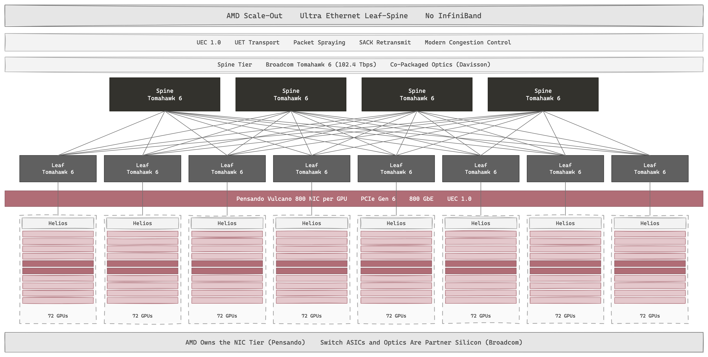

网卡是 <em><strong><a data-popup="pensando">Pensando</a></strong></em>，AMD 于 2022 年收购的网络初创公司。 <em><strong><a data-popup="pollara">Pollara 400</a></strong></em> 是当前的 AI NIC：400 GbE、P4 可编程、UEC 就绪、PCIe Gen 5，与 MI300X / MI355X 配对。 <em><strong><a data-popup="vulcano">Vulcano 800</a></strong></em> 将于 2026 年与 MI455X 一起发货：符合 UEC 1.0 标准、PCIe Gen 6、原生 UALink 接口、每 GPU 横向扩展带宽是 Pollara 的 8 倍。 <em><strong><a data-popup="salina">Salina 400</a></strong></em> 是用于存储/SDN/防火墙的前端DPU（16× Arm Neoverse-N1，双400 GbE），相当于NVIDIA的 <a data-popup="bluefield-dpus">BlueField</a>，与AI后端网卡不同。

不过，开关芯片不是 AMD 的。 Helios 的 43 TB/s 横向扩展结构通过 <em><strong><a data-popup="tomahawk-6">Broadcom Tomahawk 6</a></strong></em>运行：具有共同封装光学器件的 102.4 Tbps 以太网交换机 ASIC（“Davisson”）。 AMD 没有内部 <a data-popup="cpo">CPO</a> ，也没有内部交换机 ASIC；光学层是伙伴硅。 NVIDIA 拥有整个堆栈：InfiniBand、Spectrum-X 以太网、ConnectX、BlueField、Quantum-X Photonics CPO，全部为内部产品。 AMD 拥有一层（NIC + DPU，通过 Pensando），并押注开放标准加上同类最佳的合作伙伴芯片将超过垂直整合。

行业已经改变了 AMD 的方式。 Dell'Oro 报告称，到 2025 年，以太网处理的 AI 横向扩展结构容量将是 InfiniBand 的两倍以上； AWS、微软、Meta、Oracle 和 xAI 都已针对其基于 AMD 的 AI 集群进行了以太网标准化。剩下的问题不是以太网是否可以在 RDMA 语义上与 InfiniBand 相匹配（UEC 缩小了这一差距），而是 Helios 是否可以足够快地缩小 <em>机架规模</em> 与 NVL72 的差距，从而赢得目前默认由 NVIDIA 承担的前沿训练工作负载。

<h4 id="software">软件栈</h4>

<em><strong><a href="https://rocm.docs.amd.com/">ROCm</a></strong></em> 是与 <em><strong><a href="https://docs.nvidia.com/cuda/cuda-c-programming-guide/">CUDA</a></strong></em>相对应的开源版本。 NVIDIA 的堆栈是专有且垂直集成的（cuBLAS、cuDNN、TensorRT-LLM 作为二进制 blob 提供，由 NVIDIA 单独维护），而 ROCm 是 GitHub 原生的，并押注于开放标准（PyTorch、Triton、vLLM、OCP MX），而不是围墙花园库集。与 NVIDIA 之间的软件差距确实存在，但 AMD 的策略是通过开放社区来缩小差距，而不是从头开始构建并行 CUDA 堆栈。

堆栈的底部是 <em><strong><a data-popup="hip">HIP</a></strong></em>，AMD 的 CUDA 兼容C++ 运行时。 <em><strong><a data-popup="hipify">hipify</a></strong></em> 自动将 CUDA 源转换为 HIP。批量 HPC 代码（HACC、Laghos、QMCPack）端口开箱即用率为 80–95%：CORAL-2 编号。现代 AI 内核的移植更糟糕：任何涉及 Hopper 或 Blackwell 特定原语的内容（<a data-popup="tma">TMA</a> 描述符、 <a data-popup="wgmma"><code class="notranslate" translate="no">wgmma</code></a>、 <code class="notranslate" translate="no">tcgen05.mma</code>) 没有干净的 ROCm 模拟，必须手动重写。

HIP 之上有一个库层，其结构与 NVIDIA 的镜像相同，按名称一对一： <em><strong><a href="https://github.com/ROCm/rocBLAS">rocBLAS</a></strong></em> for cuBLAS; <em><strong><a href="https://github.com/ROCm/hipBLASLt">hipBLASLt</a></strong></em> 用于 cuBLASLt； <em><strong><a href="https://github.com/ROCm/MIOpen">MIOpen</a></strong></em> 用于 cuDNN； <em><strong><a href="https://github.com/ROCm/rccl">RCCL</a></strong></em> 用于 NCCL； <em><strong><a data-popup="composable-kernel">可组合内核</a></strong></em> （及其现代 <a data-popup="ck-tile">ck-tile</a> DSL) 用于 CUTLASS；适用于 Nsight 系列的 rocprofv3 / rocprof-sys / rocprof-compute。不过，目前还没有 TensorRT-LLM 的第一方类似产品。 AMD 的答案是支持 <em><strong><a href="https://github.com/vllm-project/vllm">vLLM</a></strong></em> 作为开源服务引擎，并提供 AMD 特定的运算符 (<em><strong><a data-popup="aiter">AITER</a></strong></em>)进入其中； vLLM 专用的 ROCm CI 在 2026 年初将测试通过率从 37% 提高到 93%。

PyTorch 路径是一流的。 Eager 模式 PyTorch 自 2018 年以来一直在 ROCm 上运行； <code class="notranslate" translate="no">torch.compile</code> 通过 Triton 降低，以及 Triton 的 ROCm 后端（使用 <a data-popup="aotriton">AOTriton</a> 对于提前数学内核）是上游。没有XLA式的中间IR； ROCm 直接编译为 HIP / Triton / CK。随着 Triton 成为 PyTorch 中的默认内核路径，大部分移植成本就消失了：运行通过的内核 <code class="notranslate" translate="no">torch.compile</code> 适用于 CUDA 和 ROCm，无需更改源。这是 AMD 开放战略下的架构押注：Triton 的 Python DSL 成为跨供应商的通用语言，回避了对 CUDA 等效内核生态系统的需求。

<em><strong><a data-popup="flashattention-versions">FlashAttention</a></strong></em> 为承重案例。 <em><strong>FA2</strong></em> 正在通过可组合内核在 MI300X 上进行生产； PyTorch 在 ROCm 上默认为 CK 或 AOTriton。 <em><strong>FA3</strong></em> （Hopper 调整）通过 AITER + CK 部分支持，但 Dao-AILab 的规范实现仍然仅支持 CUDA。 <em><strong>FA4</strong></em> （Blackwell，2026 年 3 月）根本没有 ROCm 端口。 <em><strong><a href="https://hazyresearch.stanford.edu/blog/2025-11-09-hk">HipKittens</a></strong></em>是 Hazy Research 的 ThunderKittens MI355X 端口（2025 年 11 月），声称在约 500 行中与手动调整的 AITER 具有前向传递同等性。其模式是：开源学术内核在 NVIDIA 的几个月而不是几年后关闭 AMD 的尾巴。

生产部署已经验证了该策略。 Microsoft Azure 的 <em><strong>ND MI300X v5</strong></em> 实例于 2024 年 5 月正式发布； OpenAI 对它们运行 GPT 推理。 Meta 通过 Grand Teton 平台在 MI300X 上提供 Llama 3 / Llama 4 推理。 Oracle OCI 的 <em><strong>BM.GPU.MI300X.8</strong></em> 于 2024 年 9 月进入通用版本，MI355X 将于 2026 年上市。这些是超大规模的真实服务队列，而不是试点。

诚实的差距仍然是真实的。独立基准测试（Phoronix，2026 年 3 月）显示，ROCm 7.2 在标准 PyTorch / vLLM / SGLang 工作负载上的 <strong>比同等 CUDA</strong> 慢 10-25%，且在同等芯片上具有同等精度。 ROCm 达到 7 <em>功能奇偶校验</em> ，但不是 <em>性能奇偶校验</em>。 FlashAttention-4 尾部（利用 Blackwell 最新原语的研究代码）是 NVIDIA 护城河最持久的地方；它没有干净的 ROCm 模拟，等待手写的 AITER 内核或 HipKittens 级社区端口。 NVIDIA 将工程师派往前沿实验室； AMD 通过 GitHub 发布内核。这些策略集中于常见工作负载（Llama 推理、注意力、密集Transformer训练），但新颖的研究代码的长尾仍然需要花费 MI300X / MI355X 部署工程时间，而 NVIDIA 用户无需支付费用。

<h3 id="cerebras-wse">Cerebras WSE</h3>

<em><strong><a href="https://www.cerebras.ai/">Cerebras</a></strong></em> 构建了 <em><strong>有史以来出货的最大芯片</strong></em>。理念： <a data-popup="memory-wall">内存墙</a> 是切割晶圆的结果。一家晶圆厂将数十个芯片打印到 300 毫米厚的硅片上，然后将它们锯开；然后，该行业采用了最奇特的工程（<a data-popup="hbm">HBM</a>、 <a data-popup="nvlink">NVLink</a>、 <a data-popup="cowos">CoWoS</a>，每个机架 5,184 根铜缆）以一小部分片上带宽将各个部分重新连接在一起。塞雷布拉斯跳过了锯子。 <em><strong>晶圆级引擎</strong></em> 是一块硅：84 <a data-popup="reticle">掩模版区域</a>、46,225 mm²、900,000 个数据流核心以及 <a data-popup="sram">SRAM</a> 计算单元一个周期中的片上内存的每个字节。

<h4 id="genealogy">演进路线</h4>

2019

<strong><em><a href="https://old.hotchips.org/hc31/HC31_1.13_Cerebras.SeanLie.v02.pdf">WSE-1</a></em></strong><a data-popup="cs-1">CS-1</a>

首款晶圆级处理器：1.2T晶体管， 400,000 个内核，18 GB 晶圆上 SRAM。

2021

<strong><em><a href="https://8968533.fs1.hubspotusercontent-na2.net/hubfs/8968533/IEEE%20Micro%202023-03%20Hot%20Chips%2034%20Cerebras%20Architecture%20Deep%20Dive.pdf">WSE-2</a></em></strong><a data-popup="cs-2">CS-2</a>

7 nm：850,000 个内核，40 GB SRAM。 <strong>重量流</strong> 将重量从晶圆移至 <a data-popup="memoryx">MemoryX</a>。

2023

<strong><em><a href="https://www.hpcwire.com/aiwire//2023/08/30/cerebras-and-g42s-inception-unveil-jais-a-13b-parameter-arabic-llm-trained-on-condor-galaxy/">秃鹰银河</a></em></strong><a data-popup="condor-galaxy">CG-1</a>

使用 <a data-popup="g42">G42</a>构建的64系统集群；培训了 <a data-popup="jais">Jais</a> 阿拉伯法学硕士家族。

2024

<strong><em><a href="https://www.cerebras.ai/press-release/cerebras-announces-third-generation-wafer-scale-engine">WSE-3</a></em></strong><a data-popup="cs-3">CS-3</a>

5 nm：4T晶体管，900,000个内核，44 GB SRAM；每核 FP16 SIMD 加倍至 8 宽；指定到 2,048 个系统的集群。

2024

<strong><em><a href="https://www.cerebras.ai/blog/introducing-cerebras-inference-ai-at-instant-speed">推理</a></em></strong>

权重存放在 SRAM 中而不是流式传输：业界最快的独立测量解码，也是现在定义公司的关键。

<h4 id="architecture">架构</h4>

GPU 是一个层次结构：内部有线程 <a data-popup="warp">warps</a> 在 SM 内，在机架内的封装内死亡，每个边界都有自己的带宽、自己的延迟、自己的编程结构；每个由模具构建的加速器都会继承它的某个版本。 WSE 是一个 <em><strong>平面</strong></em>：900,000 个相同的核心在 2D 网格中边对边平铺，没有共享缓存，没有全局内存，并且一个核心与另一个 899,999 个核心之间没有任何类型的边界。每个内核都很小，在 <a data-popup="wse-2">WSE-2</a>上约为 38,000 µm²，大约一半 SRAM 和一半逻辑，峰值功率为 30 mW：48 kB 本地 SRAM、16 个通用寄存器、一个 6 级流水线、一个 4 宽FP16 <a data-popup="mac">FMAC</a> SIMD（ <a data-popup="wse-3">WSE-3</a>上的 8 宽），以及接入结构的五端口路由器。执行是 <em><strong><a data-popup="dataflow-processor">数据流</a></strong></em>：核心处于空闲状态，直到 <em><strong><a data-popup="wavelet">wavelet</a></strong></em> 到达，wavelet中的控制位选择哪个处理程序任务触发，八个硬件 <em><strong><a data-popup="microthreads">微线程</a></strong></em> 随着张量操作数到达和耗尽而逐周期切换。没有warp，没有 <a data-popup="warp-schedulers">warp调度程序</a>，没有可错过的缓存，没有重新排序缓冲区： <em>数据的到达就是调度</em>。

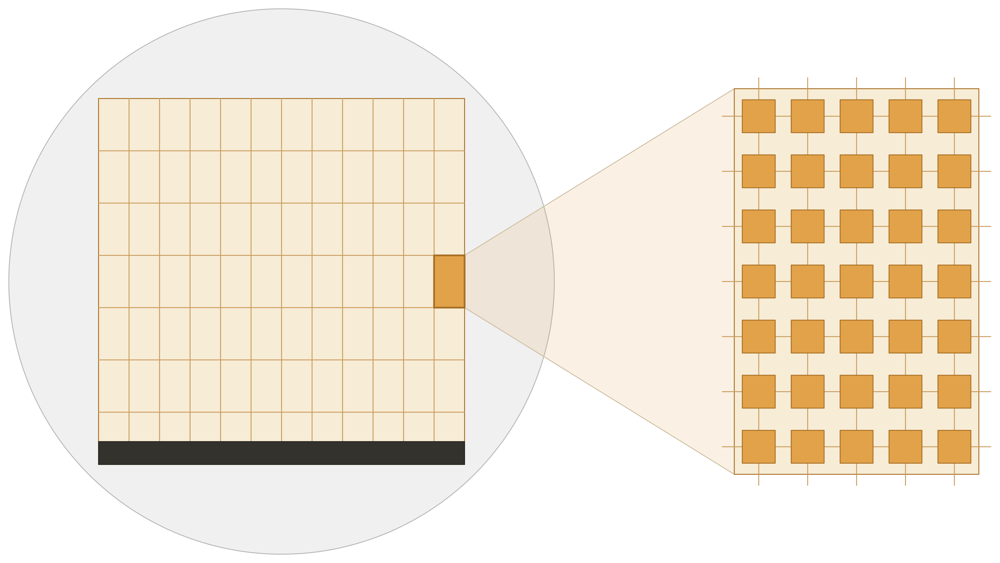

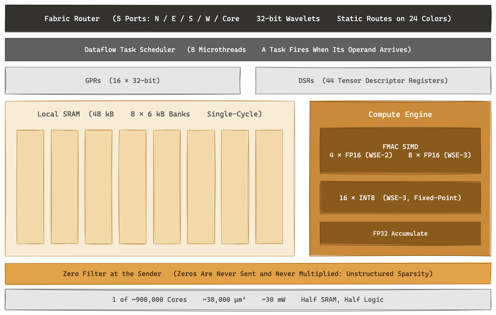

<h5 id="the-wafer">晶圆</h5>

步进机曝光晶圆一个 <a data-popup="reticle">标线</a> 一次，每次拍摄约 850 mm²，这就是为什么每个传统芯片都生活在这个上限之下（以及为什么 B200 变成 <a data-popup="two-die-chiplet-gpu">两个芯片</a> NVIDIA 向其施压的那一刻）。与台积电的任何其他客户一样，Cerebras 在 12×7 网格中打印相同的约 550 mm² 芯片 84 次，然后在与台积电共同开发的工艺中，在锯正常运行的 &lt;1 毫米 <a data-popup="scribe-line">划线</a> 上铺设额外的高级金属。网格穿过源同步并行接口上的每个接缝（WSE-3 上每个芯片为 2,880 GB/s），整个芯片间层的成本约为 97 W。对于软件来说，接缝不存在：一个统一的网格，一个芯片。

晶圆级之前已经尝试过，但在良率上失败了：单片晶圆计算机中的单个缺陷会杀死整个晶圆，这是是什么在 20 世纪 80 年代埋葬了 <a data-popup="wafer-scale-integration">这个想法</a> 。 Cerebras 的答案是粒度。 H100 上的缺陷会导致整个 ~6 mm² SM 失效； WSE 上的相同缺陷会导致一个 0.05 mm² 核心失效。 WSE-3 制造了约 970,000 个核心，并交付了 900,000 个：约 7% 的备用池，加上冗余结构链路，使硬件能够围绕每个缺陷重新映射并恢复完整的逻辑网格。

<h5 id="the-core">核心</h5>

核心的不寻常部分不是数据路径；而是数据路径。这就是指令 <em>的内容</em>。除了 16 个通用寄存器之外，还有 <em><strong>44 <a data-popup="dsr">数据结构寄存器</a> （DSR）</strong></em>，每个寄存器都保存一个张量描述符： <a data-popup="base-address">基址</a>、 <a data-popup="extent">范围</a>和 <a data-popup="stride">stride</a>，最多四个维度。指令通过 DSR 命名其操作数，因此单个 FMAC 指令表示 <em>将到达的流与此驻留张量相乘，并累加到该</em>，并且只要张量持续，硬件就会流元素。乘法周围没有软件循环，也没有每个元素的指令提取；循环位于描述符中。 NVIDIA 花了五代 Tensor Core 将 matmul 推向单一 <a data-popup="descriptor-driven-command">描述符驱动命令</a>；在 WSE 内核上，张量指令没有其他形式。

排序是结构的工作。 <a data-popup="fabric-color">color</a> 是一个静态路由的虚拟通道，在编译时绑定了一个处理程序任务，因此在颜色 <em>上发送小波是</em> 在目标核心上调用代码：16 个控制位是调用，16 个数据位是参数。 <em><strong>任务调度程序</strong></em> 在核心的八个微线程上保存正在进行的张量操作，并在每个周期根据操作数可用性在它们之间进行切换。这与 <a data-popup="warp-schedulers">warp 调度程序</a> 使用 64 个驻留 warp 执行的相同停顿隐藏工作，通过八个上下文完成，因为隐藏的延迟是繁忙的 SRAM 存储体或相邻跃点，而不是 HBM 往返。

48 kB 本地 SRAM 是为数据路径而不是局部性而组织的：8 个单端口 6 kB 存储体每个周期提供两次 64 位读取和一次 64 位写入，恰好有两个 4 元素 FP16 操作数输入和一个结果输出，即 WSE-2 FMAC 的宽度。 256 字节软件管理的缓存（WSE-3 上为 512 B）将最热的值保留在管道旁边。这是机器原理的缩影：每个核心、内存带宽和计算能力完全匹配，而晶圆继承了这一平衡 900,000 倍。

<h5 id="compute">计算</h5>

晶圆上没有矩阵单元。 NVIDIA、Google 和 AMD 都将其 FLOP 集中在专用的 matmul 引擎中（<a data-popup="tensor-cores">Tensor Core</a>、 <a data-popup="mxu">MXU</a>、 <a data-popup="matrix-core">Matrix Core</a>），主要区别在于引擎的供电方式； Cerebras 用织物组装 matmul。 GEMM 作为晶圆级编排运行：每个到达的权重沿着一排持有激活的核心进行广播，每个核心对其驻留切片（每个权重的 <a data-popup="axpy">AXPY</a> ）触发乘法累加，并且部分总和在整个网格中减少。 Tensor Core 从寄存器块获得的数据重用，MXU 从其接线获得的数据，WSE 从几何形状获得的数据：激活永远不会移动，因此运行中的唯一操作数是被相乘的操作数。

FLOPs 分类帐需要小心，因为 Cerebras 打印的数字不是要比较的数字。 WSE-3 的标题 <em><strong>125 PFLOPS 是稀疏 FP16</strong></em>：它假设硬件在理想的稀疏张量上具有大约 8× 零跳跃收益。密集程度约为 <em><strong>15.8 PFLOPS FP16</strong></em> （推导：900,000 个核心 × 8 宽 FMAC × 1.1 GHz；Cerebras 未发布官方密集数据）。这是真正的计算，但这不是重点：晶圆上每瓦特的密集 FLOP 输给了所有当代的 GPU。晶圆从来就不是一个失败的机器。它是一个 <em><strong>带宽机器</strong></em>，并且 FLOP 的存在是为了跟上 SRAM 的步伐。

零跳跃是数据流赢得其保留的地方。因为计算是由到达的数据触发的，所以零永远不会触发任何东西： <em><strong>零在发送者处被过滤</strong></em>，并且接收核心永远不会看到它们并且永远不会花费周期。这是非结构化的元素粒度稀疏性，是 NVIDIA 2:4 <a data-popup="structured-sparsity">结构化稀疏性</a> 仅采样的一般情况。到目前为止，这也是一个尚未行使的选择权。 Cerebras 自己的稀疏预训练结果（<a href="https://arxiv.org/abs/2303.10464">SPDF</a>：1.3B 参数稀疏度为 75%；后续为 6.7B）是供应商编写的且低于 7B，并且没有透露旗舰客户模型经过稀疏训练： <a data-popup="jais">Jais 2</a>，硬件上最大的运行，是密集的。唯一能够获得非结构化稀疏性的芯片尚未推出使用它的头条模型。

<h5 id="memory">内存</h5>

层次结构为一层： <em><strong>48 kB 切片中的 44 GB SRAM核心，晶圆上没有任何其他东西</strong></em>。无 HBM、无 L2、无驱逐政策；每个字节都是 FMAC 的一个周期。所引用的带宽为 21 PB/s，这个数字名副其实：它是 900,000 个本地 SRAM 端口的 <em>总和</em> ，是晶圆上聚合，不是点对点链路，也无法与 HBM 数字相比较。诚实的比较是每 FLOP 的字节数：晶圆每密集 FP16 FLOP 可以提供约 1.3 个字节，其中 <a data-popup="b200">B200</a> 从 HBM 获得约 0.002 个字节。在该轴上，每个 GPU 和 TPU 都处于饥饿状态； WSE 是唯一处于平衡状态的机器。 <a data-popup="decode">解码</a>，这是一个纯粹的带宽问题（对每个代币的权重进行一次完整读取）的阶段，也是晶圆成形的阶段。

层是它的边缘。晶圆与其他所有设备的连接是 12×100 GbE： <em><strong>1.2 Tb/s</strong></em>，仅比连接到一个 Blackwell GPU 的单个 <a data-popup="connectx-nics">ConnectX-8</a> NIC 多一点。在晶圆上 SRAM 和晶圆外以太网之间存在 <em><strong>五个数量级</strong></em>。 NVIDIA的等级是逐渐下降的，每一层都比上一层慢几倍； WSE 有两层，中间有悬崖。晶圆是一座岛屿，岛屿的超能力和它的笼子是同一个事实。

而且岛屿并没有成长。 SRAM 密度已有效地停止了领先节点上的扩展：尽管全节点缩小且晶体管数量增加了 54%，但 WSE-3 的 SRAM 只比 WSE-2 多了 10%。逻辑不断缩小；六晶体管 SRAM 单元则不然。该架构最稀缺的资源是下一个工艺节点不再购买的东西。

<h5 id="weight-streaming">权重流式传输</h5>

晶圆上的训练颠倒了其他人认为理所当然的流程：在 GPU 或 TPU 上，权重是驻留的，激活流通过；在 WSE 上， <em><strong>激活是常驻的，权重通过</strong></em>流动。主权重位于 <em><strong><a data-popup="memoryx">MemoryX</a></strong></em>中，它是集群旁边的 DRAM 和闪存设备。权重逐层流过晶圆，针对固定在 SRAM 中的激活触发乘法累加，然后离开；梯度流在后向传递中返回，优化器步骤在 CPU 上的 MemoryX 内部运行（权重更新是 O（参数）的逐元素工作，没有重用，因此 CPU 级计算保持同步）。晶圆从不存储重量，“即使是暂时的”（<a href="https://www.kisacoresearch.com/sites/default/files/documents/cs_weight_streaming_white_paper_-_cerebras.pdf">Cerebras 的短语</a>）。模型大小受 MemoryX 限制，而不是 44 GB； 44 GB 限制激活和批处理。

这购买的是编程模型。一个晶圆容纳一整层的激活，因此不存在 <a data-popup="tensor-parallelism">张量并行</a>，也不存在 <a data-popup="pipeline-parallelism">流水线并行</a>、无 <a data-popup="fsdp">FSDP</a> 分片：70B模型编写为单设备程序，多系统扩展 <em><strong>纯粹 <a data-popup="data-parallelism">数据并行性</a></strong></em> 通过 <em><strong><a data-popup="swarmx">SwarmX</a></strong></em>，一种广播/归约树，将一个权重流扇出到N个晶圆，并在途中对它们的梯度求和家。主导 GPU 训练的并行策略电子表格根本没有 Cerebras 页面。

它的成本是规模，这取决于市场自己显示的偏好。规格表显示有 2,048 架 CS-3；迄今为止披露的最大星团为 64 个（<a data-popup="condor-galaxy">Condor Galaxy 3</a>）。平台上迄今为止披露的最大的从头开始模型是 <em><strong>Jais 2，参数为 70B，代币为 2.6T</strong></em>，由锚定客户 <a data-popup="g42">G42</a> 进行培训，并嵌入 Cerebras 工程师。自 CS-1 以来的七年里，任何人都没有超过 70B。和利用率（<a data-popup="mfu">MFU</a>），GPU 实验室理所当然地发布的数字为 35-45%，从未在任何 Cerebras 运行中披露过。

<h5 id="numerics">数值格式</h5>

这些数字可以用一句话来概括： <em><strong>FP16 和 BF16 与 FP32 累加</strong></em>，加上（来自 WSE-3）Hot Chips 披露标记为定点的 16 宽 8 位整数路径。没有 FP8，没有 FP4，没有微缩放。虽然其他所有供应商每一代都会将精度减半，并通过块缩放来重新获得精度，但 Cerebras 仍然以 16 位进行计算，并将其作为质量差异化因素（“原始 16 位权重”）进行营销。这种紧张是显而易见的：SRAM 容量是该架构最稀缺的资源，而 8 位权重将使模型所需的晶圆数量减半。仅 16 位是否是数字信念或数据路径路线图差距是一个悬而未决的问题；没有主要的 Cerebras 源在晶圆上的任何位置显示浮点 8。

<h5 id="bets">核心押注</h5>
<ul>
<li><em><strong>押注 1：不要切割晶圆。</strong></em> 芯片边界是行业其他部分支付的税：SerDes、中介层、HBM 堆栈、电缆、交换机。金属中的 Stitch 84 掩模版区域和竞争对手系统中的最高带宽边界根本不存在。</li>
<li><em><strong>押注 2：SRAM 是唯一的存储器。</strong></em> 以业界最陡的比率交换带宽容量：44 GB，晶圆上聚合 21 PB/s。平衡机器，而不是将不平衡隐藏在层次结构后面。</li>
<li><em><strong>押注 3：数据流核心，无矩阵单元。</strong></em> 由到达的小波触发的 900,000 个微小核心，通过广播、FMAC 和网格缩减组装 matmul：跳过零是免费的，而不是特殊模式。</li>
<li><em><strong>押注 4：权重移动，激活保持不变。</strong></em> 权重流将模型大小 (MemoryX) 与晶圆内存 (44 GB) 解耦，并将集群扩展压缩为纯数据并行性。</li>
<li><em><strong>押注 5：销售延迟，不是吞吐量。</strong></em> 晶圆重新读取每个令牌的整个模型的速度比基于 HBM 构建的任何东西都要快；价格作为优质产品加速，而不是在每个代币的成本上竞争。</li>
</ul>
<h4 id="scaling">扩展</h4>

扩展和扩展在这里意味着不同的东西。 NVIDIA 的扩展问题（使 72 个封装表现得像一台设备）在 WSE 上通过光刻技术得到了解决：相干域从晶圆厂整块发货。剩下的就是超出晶圆边缘的一切，没有任何其他机器能够如此猛烈或如此早地触及其边缘。

纵向扩展

纵向扩展单元就是整片晶圆：900,000 个核心组成一张 2D 网格，采用 32 位链路、单周期跳转、跨 24 种 <a data-popup="fabric-color">颜色</a>的静态路由和原生广播，聚合互连带宽达 214 Pbit/s。其尺寸固定为 46,225 mm²，也就是一整片 300 毫米晶圆。

横向扩展

以太网，立即：每个系统 12×100 GbE (1.2 Tb/s)。通过 <a data-popup="swarmx">SwarmX</a> （数据并行广播/减少 <a data-popup="rdma">RoCE</a>）进行扩展；推理分片模型在层边界跨系统、管道并行。

<h5 id="scale-up">纵向扩展</h5>

晶圆的内部结构没有 <a data-popup="serdes">SerDes</a>，没有电缆，没有收发器，每条链路没有边际成本：路由被编译，每一跳都是一个周期，广播是一种本机结构原语而不是交换机功能。 NVL72 花费了 5,184 根铜缆和一个 <a data-popup="nvswitch">NVSwitch 托盘</a> ASIC 为 72 个 GPU 提供 130 TB/s 的全对全，WSE 的等效域是单个光刻对象。问题是域的大小是一个常数。 NVIDIA 的扩展领域每一代都在增长（三年内从 NVL72 到 NVL576）；自 2019 年以来，晶圆尺寸一直为 46,225 mm²，并将保持这一水平。 300 毫米是业界最大的晶圆（450 毫米过渡已于十年前消亡），因此 Cerebras 的扩展路线图取决于下一个节点的密度产量：没有更多的区域可供使用。

<h5 id="scale-out">横向扩展</h5>

训练横向扩展 <a data-popup="swarmx">SwarmX</a>，它只做一件事：复制。将重量流广播到N个晶圆，减少它们在返回路径上的梯度；批次随着系统数量的增加而增加，但模型大小却不会。声称的 2,048 个系统的上限（“256 exaFLOPS”，稀疏）从未建成； 64 有。

推理完全放弃权重流；算术是致命的。对于每个解码的令牌，通过 ~150 GB/s 的管道从 MemoryX 流式传输 70B 模型的 140 GB 大约每个令牌花费一秒。因此，推理 <em><strong>将权重存储在 SRAM</strong></em> 中，并在层边界跨晶圆对模型进行分片：Llama 70B 位于“少至四个”CS-3 上，通过以太网进行管道并行，每个附加晶圆贡献 44 GB 的权重加 -<a data-popup="kv-cache">KV</a> 容量和 23 kW 负载。

速度是真实的，并经过独立验证。 <em><strong><a data-popup="artificial-analysis">人工分析</a></strong></em> 在 2024 年 8 月发布时在 Llama 3.1 8B 上测量了 1,850 个代币/秒，在 70B 上测量了 446 个代币/秒，在 Llama 405B 上测量了 969 个代币/秒（第一个代币需要 240 毫秒），在 2025 年在 Llama 4 Maverick 上测量了 2,522 个代币/秒，约为 Blackwell 最佳发布量的 2.4 倍的时间数。供应商引用的峰值更高（使用 <a data-popup="speculative-decoding">推测解码</a>的 70B 上为 2,100；GPT-OSS-120B 上为 3,000，其中实时独立测量值接近 2,000）。没有任何 GPU 提供商能够在每用户解码速度方面与您相媲美。

经济性是最显着的优势。每晶圆 44 GB 意味着前沿规模模型会消耗大量设备： <a href="https://newsletter.semianalysis.com/p/cerebras-faster-tokens-please">SemiAnalysis</a> 估计 1.6T 参数级模型需要约 24 个 CS-3，可安装在少数 GPU 机架中，每个系统分析师估计约 45 万美元的物料清单售价约为 2-300 万美元（从未正式披露）。在解码期间，晶圆的大量 FLOP 大部分处于闲置状态； Cerebras 拒绝透露批量大小，也从未公布过每个系统的吞吐量。对于相同的开放模型，每个代币 API 的定价大约为基于 GPU 的提供商的 3-5 倍，而 Llama 405B 已悄然从 API 中删除，SemiAnaanalysis 将其视为服务于尚不明确的经济学。固定 SRAM 还对上下文进行定价：KV 缓存与权重位于相同的 44 GB 中，因此长上下文会窃取容量并迫使每个副本有更多系统； API 上限为 131K 个代币，而前沿提供商提供 256K–1M 个代币。 <a data-popup="moe">MoE</a> 提供服务（Qwen3-235B 约为 1,500 个代币/秒，供应商引用），但这是该格式最糟糕的情况：巨大的参数占用量触及了一些专家一次，保存在最昂贵的内存中。

市场已经诚实地定价了。 Mistral 的 Le Chat（约 1,100 个令牌/秒）、Perplexity Sonar 和 Meta 的 Llama API 都为延迟付出了代价； 2026 年 1 月，OpenAI 签署了 <em><strong>到 2028 年将拥有 750 MW 的 CS-3 产能</strong></em>， <a href="https://www.cnbc.com/2026/01/14/cerebras-scores-openai-deal-worth-over-10-billion.html">据报道超过 $10B</a> 在签约时 <a href="https://finance.yahoo.com/technology/ai/articles/cerebras-systems-openai-tout-20b-040208708.html">自增长超过 $20B</a>以来，成为有史以来获得的最大晶圆代言规模。第一个搭载该容量的旗舰产品是 <em><strong><a href="https://openai.com/index/gpt-5-6/">GPT-5.6 Sol</a></strong></em>，于 2026 年 7 月推出，报价为 750 个代币/秒。

<h4 id="software">软件栈</h4>

该堆栈与 TPU 一样由编译器驱动，但范围更窄：Cerebras 编译器是 <em><strong>内核匹配器</strong></em>，不是通用代码生成器。 <code class="notranslate" translate="no">cerebras.pytorch</code> 通过惰性张量将训练步骤跟踪到Torch-MLIR和图IR中，然后将子图与手写内核库进行匹配，回退到较慢的自动生成的内核对于没有匹配的操作。 <a href="https://training-api.cerebras.ai/en/rel-2.4.0/wsc/tutorials/cstorch-limitations.html">记录的约束</a> 受到 GPU 标准的严格约束：只有静态图，没有动态形状，没有依赖于数据的控制流，中间没有急切的张量访问，以及固定在上游的 PyTorch 版本。最好的独立从业者帐户（<a href="https://servicedesk.surf.nl/wiki/spaces/WIKI/pages/112592526/Evaluation+Cerebras+CS-2">SURF</a>，荷兰国家计算中心）报告了不支持的层类型，并且没有标准 PyTorch 代码的 1:1 移植路径。

并且没有内核逃生舱口。 CUDA 对新颖的注意力变体的回答是 <em>编写内核</em>； TPU 是 <a data-popup="pallas">Pallas</a>； ROCm 是 <a data-popup="triton">Triton</a>。 Cerebras ML 堆栈根本没有用户内核路径：当匹配器严重丢失时，修复程序是 Cerebras 工程师。单独的 SDK 语言 <em><strong><a data-popup="csl">CSL</a></strong></em>，公开了原始机器（任务、小波、颜色）并产生了惊人的 HPC 结果（ <a href="https://arxiv.org/abs/2204.03775">TotalEnergies 模板代码</a> 大约 228× A100，48 个 CS-2 上的 Gordon Bell 决赛入围者），但它是一个独立的世界，与 PyTorch 流程无关。平台上的每个旗舰模型（Jais、BTLM、Med42）都是与嵌入式 Cerebras 员工共同开发的。

这其中有一种奇怪的免疫力。 <a data-popup="flashattention-versions">FlashAttention</a>，GPU 的定义内核谱系时代，是一种通过内存层次结构平铺注意力的方案，而 WSE 没有可以平铺的层次结构：导致 AMD 多年移植延迟的优化类根本不适用。但免疫力和贫困是同一个事实。在 CUDA 上复合的第三方内核生态系统没有可以附着的表面；该平台历史上的每一项内核改进都有一位作者。

这会将晶圆留在哪里？拥有真正的利基市场，诚实地赢得胜利：批量解码速度，独立验证，由将延迟定价高于成本的客户支付。在利基市场周围，有硬墙：每个代币的定价为 3-5 倍，七年的培训上限为 70B，到 2025 年，收入仍约 86% 集中在两个与阿布扎比相关的客户（根据 2026 年 5 月 IPO 前后的 S-1 文件），以及最稀缺的资源，SRAM 密度，随着模型的不断增长而停止扩展。轩尼诗和帕特森承诺寒武纪大爆发； WSE 是其最极端的机身设计，它决定将内存墙作为一种封装选择，并花费 46,225 mm² 的硅片拒绝制造它。

<h3 id="aws-trainium">AWS Trainium</h3>

<em><strong><a data-popup="annapurna-labs">Annapurna Labs</a></strong></em>， AWS <em><strong><a data-popup="nitro">Nitro</a></strong></em> 卡和 <em><strong><a data-popup="graviton">Graviton</a></strong></em> CPU 背后的团队构建 <em><strong>Trainium</strong></em> 作为 <em><strong>快速追随者</strong></em>。计算核心采用 TPU 经过验证的剧本（128×128 <a data-popup="weight-stationary">权重固定</a> <a data-popup="systolic-array">脉动阵列</a>、软件管理的暂存器、整个程序编译）直至完全共享 Google 的 <em><strong><a href="https://openxla.org/xla">XLA</a></strong></em> 编译器。横向扩展结构是 <em><strong><a data-popup="nitro">Nitro</a></strong></em>卸载网络，该网络已承载 AWS 的其余部分。亚马逊真正的东西是狭隘而深思熟虑的：专用的集体通信芯片固定在借来的核心上，垂直整合的价格只需在 AWS <em>内击败 NVIDIA</em>。

<h4 id="genealogy">演进路线</h4>

2015

<strong><em><a href="https://en.wikipedia.org/wiki/Annapurna_Labs">Annapurna Labs</a></em></strong>

亚马逊以约 3.5 亿美元收购了这家以色列芯片初创公司；它成为 AWS 的内部芯片团队。

2018

<strong><em><a href="https://en.wikipedia.org/wiki/AWS_Graviton">Graviton</a> + <a data-popup="nitro">Nitro</a></em></strong>

Arm 服务器 CPU 和 <a data-popup="dpu">DPU</a> 卸载结构。

2019

<strong><em><a href="https://awsdocs-neuron.readthedocs-hosted.com/en/latest/general/arch/neuron-hardware/inferentia.html">Inferentia</a></em></strong><a data-popup="neuroncore-v1">NeuronCore-v1</a>

首款 AWS ML 芯片，仅限推理：4 个 NeuronCore、8 GB DRAM、三个固定引擎。

2022

<strong><em><a href="https://aws.amazon.com/blogs/aws/amazon-ec2-trn1-instances-for-high-performance-model-training-are-now-available/">Trainium1</a></em></strong><a data-popup="trn1">Trn1</a>， <a data-popup="neuroncore-v2">v2</a>

第一个训练芯片：2 个 NeuronCore-v2、可编程 <a data-popup="gpsimd-engine">GPSIMD</a> 引擎、32 GB HBM、NeuronLink 2D 环面。

2023

<strong><em><a href="https://aws.amazon.com/blogs/machine-learning/aws-inferentia2-builds-on-aws-inferentia1-by-delivering-4x-higher-throughput-and-10x-lower-latency/">Inferentia2</a></em></strong><a data-popup="neuroncore-v2">v2</a>

与 NeuronCore-v2 共享Trn1：推理和训练谱系汇聚在一个微架构上。

2024

<strong><em><a href="https://aws.amazon.com/blogs/aws/amazon-ec2-trn2-instances-and-trn2-ultraservers-for-aiml-training-and-inference-is-now-available/">Trainium2</a></em></strong><a data-popup="trn2">Trn2</a>， <a data-popup="neuroncore-v3">v3</a>

8 NeuronCore-v3，第一个真正的 <a data-popup="fp8">FP8</a> 加速，96 GB <a data-popup="hbm3">HBM3</a>； 64 芯片 <a data-popup="ultraserver">UltraServer</a>。助力 <a data-popup="project-rainier">雷尼尔计划</a>。

2025

<strong><em><a href="https://aws.amazon.com/about-aws/whats-new/2025/12/amazon-ec2-trn3-ultraservers/">Trainium3</a></em></strong><a data-popup="trn3">Trn3</a>、 <a data-popup="neuroncore-v4">v4</a>

首款 3 nm AWS 芯片 (TSMC N3P)； OCP <a data-popup="microscaling-formats">MXFP8/MXFP4</a>； <a data-popup="neuronswitch">NeuronSwitch</a> 全对全结构取代了环面。 144 芯片 UltraServer。

<h4 id="architecture">架构</h4>

另一个自备芯片故事属于 Google，Trainium 最好阅读为 TPU 在不同云中重建的论文。下面的押注是相同的（ <a data-popup="systolic-array">脉动阵列</a> 由软件管理的 <a data-popup="sram">SRAM</a>提供，由提前安排编译器，没有缓存和线程调度程序），但单元的组装方式不同。 Trainium 芯片带有 <em>小</em>  <em><strong>NeuronCore 数量</strong></em> （2 个 <a data-popup="trn1">Trn1</a>、 <a data-popup="trn2">Trn2</a> 上的 8 和 <a data-popup="trn3">Trn3</a>），并且每个 NeuronCore 不是一个单一的 matmul 引擎，而是一个 <em><strong>解耦的专用引擎集群</strong></em>：a <em><strong><a data-popup="tensor-engine">张量引擎</a></strong></em> （128×128脉动阵列）， <em><strong><a data-popup="vector-engine">矢量引擎</a></strong></em> 用于减少计算量的 <em><strong><a data-popup="scalar-engine">标量引擎</a></strong></em> 用于逐点数学计算，以及八个512位的可编程 <em><strong><a data-popup="gpsimd-engine">GPSIMD引擎</a></strong></em> 用于任何不适合其他三个的向量处理器。它们周围坐着数据移动器：128 个 <em><strong><a data-popup="dma-engine">DMA 引擎</a></strong></em>、一个 <em><strong>同步引擎</strong></em> ，用于排序传输，以及（从Trn2) 专用于集体的 <em><strong><a data-popup="cc-core">CC-Core</a></strong></em> 。没有warp，也没有波前；引擎作为静态调度的数据流管道运行，承载设计决策取决于脉动阵列周围的内容，而不是阵列本身。

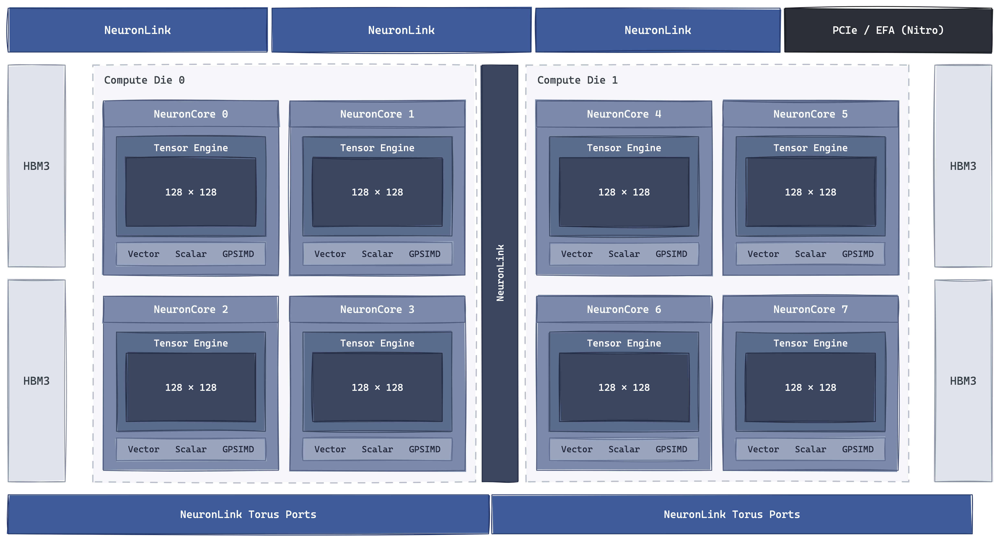

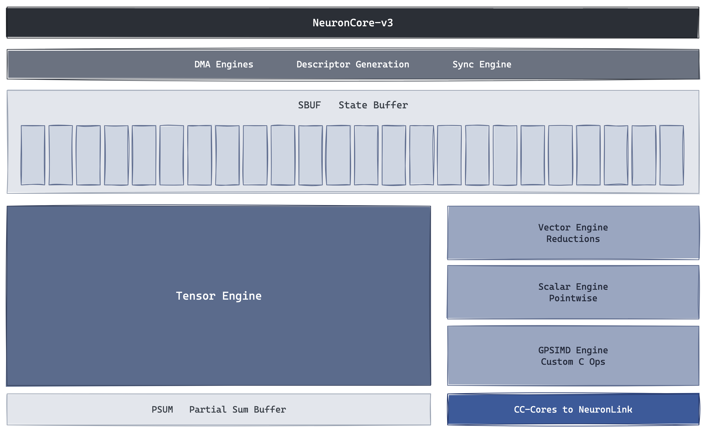

<h5 id="compute">计算</h5>

 <em><strong><a data-popup="tensor-engine">张量引擎</a></strong></em> 拥有 matmul FLOP；其他三个引擎拥有其他一切。它是一个 128×128 处理单元网格（16,384 <a data-popup="mac">MAC</a>) run <a data-popup="weight-stationary">weight-stationary</a>：一个操作数块被加载到数组中并保持在适当的位置 (<code class="notranslate" translate="no">LoadStationary</code>)，其他流通过它 (<code class="notranslate" translate="no">MultiplyMoving</code>)，部分金额存入 <em><strong><a data-popup="psum">PSUM</a></strong></em>，一个小型累加器 SRAM，引擎可以读取-添加-写入，因此长度超过 128 的收缩会沿着 <math class="notranslate" translate="no" xmlns="http://www.w3.org/1998/Math/MathML"><semantics><mrow><mi>K</mi></mrow><annotation encoding="application/x-tex">K</annotation></semantics></math>K 轴折叠到位。这与每个 matmul 加速器核心的 <math class="notranslate" translate="no" xmlns="http://www.w3.org/1998/Math/MathML"><semantics><mrow><mi>D</mi><mo>=</mo><mi>A</mi><mo>⋅</mo><mi>B</mi><mo>+</mo><mi>C</mi></mrow><annotation encoding="application/x-tex">D = A \cdot B + C</annotation></semantics></math>D=A⋅B+C tile <a data-popup="mma">MMA</a> 相同；但是 NVIDIA 将其包装在 warp 层次结构中，Google 从 <a data-popup="vliw">VLIW</a> 捆绑包中发布它，Trainium 将其公开为针对命名暂存器的一对显式指令。

所有三代的阵列物理尺寸均固定为 128×128；变化的是每个单元装载的产品数量。 <a data-popup="trn1">Trn1</a>的 NeuronCore-v2 运行 <a data-popup="bf16">BF16</a>/FP16 和 <a data-popup="fp32">FP32</a> 累计提供 <a data-popup="fp8">FP8</a> 仅在 BF16 速率（无加速）。 <a data-popup="trn2">Trn2</a>的 v3 双泵 FP8 呈现有效的 256×128 阵列，第一个具有真正 2× 的 Trainium 8 位。 <a data-popup="trn3">Trn3</a>的 v4 包 <a data-popup="microscaling-formats">微缩放</a> 操作数以呈现有效的512×128，4 倍 BF16 速率。物理乘加单元的计数永远不会移动；数据路径只是为它们提供更窄的数字。

其他三个引擎使阵列保持忙碌。 <em><strong><a data-popup="vector-engine">矢量引擎</a></strong></em> 处理跨元素缩减（layernorm、softmax、池化）； <em><strong><a data-popup="scalar-engine">标量引擎</a></strong></em> 处理一对一的逐点操作（激活、GELU）； <em><strong><a data-popup="gpsimd-engine">GPSIMD 引擎</a></strong></em>是运行 C 语言的八个完全可编程矢量处理器，吸收任何不映射到它们的内容。一个精心编译的步骤重叠了所有四个步骤：张量引擎研磨 matmul，而矢量引擎运行前一个图块的 softmax，DMA 引擎运行下一个图块，相同的生产者/消费者重叠使 TPU 和 GPU 注意力内核高效，这里表示为单独的物理引擎，而不是单独的warp或 VLIW 插槽。当一个层完全分解为四种引擎类型时，该设计就得到了回报，Transformer很大程度上就是这样做的。它在边缘付出了代价：不适合任何专用引擎的操作员会落入可编程 <a data-popup="gpsimd-engine">GPSIMD</a> 路径，速度较慢，并且机器的一部分最有可能成为新颖架构的瓶颈。这是每个非 GPU 加速器所承受的长尾成本的 Trainium 版本。

<h5 id="memory">内存</h5>

内存层次结构是应用于存储的计算原理： <em><strong>三层，全部由软件管理，任何地方都没有硬件缓存</strong></em>。 AWS 自己的文档进行了对比，指出与 CPU 或 GPU 不同，NeuronCore 没有缓存，并且“所有内存移动在程序本身中都是明确的”。片外为 <em><strong><a data-popup="hbm">HBM</a></strong></em> （Trn1 上为 32 GB，Trn2 上为 96 GB <a data-popup="hbm3">HBM3</a> ， Trn3 上 144 GB <a data-popup="hbm3e">HBM3e</a> ）。片上最靠近引擎的是 <em><strong><a data-popup="sbuf">状态缓冲区 (SBUF)</a></strong></em>：主要暂存器，大约 20 倍 HBM 带宽，组织为 128 个分区，每个 NeuronCore 大小为 24 MiB (v2)、28 MiB (v3)、32 MiB (v4)。在数组和 SBUF 之间有 <em><strong><a data-popup="psum">PSUM</a></strong></em>，这是一个专用于 matmul 输出的 2 MiB 累加器。数据移动 HBM → SBUF → Tensor Engine → PSUM → SBUF，每一跳均由编译器发出；硬件不会预取或逐出任何内容。

这正是 Google 的 <a data-popup="vmem">VMEM</a> 押注，编译器必须完美调度的显式暂存器，没有缓存来掩盖错误，这与 NVIDIA 的相反硬件管理 <a data-popup="l2-cache">L2</a> 和 <a data-popup="l1-shared-memory">L1</a>。 Trainium 继承了上限和随之而来的脆弱性：当时间表正确时，引擎永远不会熄火，而当时间表错误时，则没有后备路径。该设计针对适度的峰值 FLOP 运行了慷慨的 <a data-popup="hbm">HBM</a> 预算，因此每单位计算 Trainium 比同类 NVIDIA 部件承载更多的内存。但在 <em>绝对</em> 容量方面，它落后了：Trn2 的 96 GB 低于 <a data-popup="h200">H200</a> 和 <a data-popup="b200">B200</a>，而 Trn3 的 144 GB (2025) 低于 192 GB <a data-popup="b200">B200</a> 和 288 GB <a data-popup="b300">B300</a> 它反对。因此，当 AWS 认为服务大型模型的经济性不是内存领先，而是 <em><strong>价格</strong></em>时，它实际上使用的杠杆是：每单位计算和 HBM 的成本，在它自己构建和租赁的芯片上。

<h5 id="numerics">数值格式</h5>

Trainium 与其他人一样遵循相同的精度减半曲线（FP32 → BF16 → FP8 → FP4），有两个 Trainium 特有的皱纹。第一个是 <em><strong><a data-popup="cfp8">可配置FP8</a></strong></em>：而不是修复 <a data-popup="e4m3">E4M3</a> 和 <a data-popup="e5m2">E5M2</a> 与 Hopper 一样，张量引擎采用可调整的指数偏差并支持 E5M2、E4M3 和 E3M4，让编译器可以权衡每个张量的精度范围。第二个是 <a data-popup="trn3">Trn3</a>的 <a data-popup="fp4">FP4</a> 购买 <em>无额外吞吐量</em>：OCP <a data-popup="microscaling-formats">MXFP4</a> 操作数在到达阵列之前会上转换为 MXFP8，因此 FP4以 FP8 速率运行，仅节省内存和带宽，不节省计算量。两代产品都依赖于业界的精度恢复技巧： <a data-popup="microscaling-formats">微缩放</a> 来自 Trn3 的块指数，以及硬件 <em><strong><a data-popup="stochastic-rounding">随机舍入</a></strong></em> 在每一代上。令人不信任的一个数字是稀疏峰值：AWS 标题为 4× FP8 数字，其自己的架构页面将其置于密集 FP8 的 2 倍（4 倍相对于密集 BF16），因此市场上的加速和数据路径并不完全一致。

<h5 id="collectives-in-silicon">芯片内集合通信</h5>

GPU 上没有干净模拟的块是 <em><strong><a data-popup="cc-core">集体通信核心</a></strong></em>。分布式训练和推理将大部分时间花在 <a data-popup="collective">集体</a>上：每个梯度步骤都是 <a data-popup="all-reduce">全归约</a>，每个 <a data-popup="moe">MoE</a> 分层 <a data-popup="all-to-all">全部到全部</a>。在 GPU 上，这些集合作为 <a data-popup="nccl">NCCL 运行</a> 内核在相同的 SM 上进行数学计算，因此通信和计算争夺相同的芯片，并且必须在软件中赢得重叠。 Trainium 将功能融入专用硬件中：每个 Trn2 芯片有 20 个 <em><strong>CC-Cores</strong></em> ，直接连接到 <em><strong><a data-popup="neuronlink">NeuronLink</a></strong></em> 端口，在 Tensor 和 Vector 引擎保持运行的同时执行 all-reduce、all-gather、reduce-scatter 和 all-to-all。这与 Google 使用 <a data-popup="sparsecore">SparseCore</a> 和 Cerebras 使用其离核零过滤器采取的举措相同：找到主引擎不适合的工作负载，并在其旁边的专用块上花费一点区域，而不是从核心窃取周期。通信成为芯片 <em>同时</em>的事情，而不是它暂停做的事情。

<h5 id="bets">核心押注</h5>
<ul>
<li><em><strong>押注1：云是</strong></em> Annapurna 设计芯片、服务器、机架、 <a data-popup="nitro">Nitro</a> 网络和云 API 作为一个堆栈，因此 Trainium 只需要在 AWS 内部的性价比上取胜，而不必在商业芯片规格表上取胜。</li>
<li><em><strong>押注 2：借用计算论文，不要重新发明它。</strong></em> A 128×128 <a data-popup="weight-stationary">重量固定</a> 阵列，软件管理 <a data-popup="sbuf">SBUF</a>/<a data-popup="psum">PSUM</a> 暂存器和整个程序编译是 TPU 的押注，可重复使用以共享 Google 的 <a data-popup="openxla">OpenXLA</a>。节省的精力将投入到网络和机架中。</li>
<li><em><strong>押注 3：集体属于芯片。</strong></em> 专用 <a data-popup="cc-core">CC 内核</a> 重叠 <a data-popup="all-reduce">all-reduce</a> 和 <a data-popup="all-to-all">all-to-all</a> 在硬件中进行计算，而不是将它们作为从 matmul 单元窃取 FLOP 的内核运行。</li>
<li><em><strong>押注 4：重用云自己的网络。</strong></em> 横向扩展是 <a data-popup="efa">EFA</a> 与 <a data-popup="srd">SRD</a> 传输：相同 <a data-popup="nitro">Nitro</a>-卸载、数据包喷射 <a data-popup="rdma">RDMA</a> 已运行 AWS 的其余部分。否 <a data-popup="infiniband">InfiniBand</a>。</li>
<li><em><strong>押注 5：将拓扑移至工作负载。</strong></em> Trn1 和 Trn2 复制了 TPU 的 <a data-popup="torus">torus</a>； Trn3 的 <a data-popup="neuronswitch">NeuronSwitch</a> 将其替换为交换 <a data-popup="all-to-all">all-to-all</a> 结构 <a data-popup="moe">MoE</a> 流量超过了最近邻流量。老实说，这是遵循剧本的：首先是 Google，现在是 NVIDIA。</li>
</ul>
<h4 id="scaling">扩展</h4>

Trainium 的扩展继承了 AWS 其余部分的划分：紧密耦合 <em><strong><a data-popup="neuronlink">NeuronLink</a></strong></em> 域用于必须作为一个整体的芯片，以及云的通用 <em><strong><a data-popup="efa">EFA</a></strong></em> 结构用于其之外的一切。扩展域不是像 <a data-popup="nvlink">NVLink</a> 那样的缓存一致性共享内存； AWS 将 <a data-popup="ultraserver">UltraServer</a> 作为池化的多 TB 内存进行营销，但其底层是通过点对点链接进行消息传递，在精神上更接近 TPU 的 <a data-popup="ici">ICI</a> 比 <a data-popup="nvswitch">NVSwitch</a> 交叉开关。

扩展

<a data-popup="neuronlink">NeuronLink</a> 将芯片绑定到一个 <a data-popup="ultraserver">UltraServer</a>。通过 Trn2，拓扑是一个 <a data-popup="torus">环面</a> （4×4 2D 环面中每个实例 16 个芯片，4×4×4 3D 环面中每个 UltraServer 64 个芯片）； Trn3 将其替换为 <a data-popup="neuronswitch">NeuronSwitch</a> 全方位面料。消息传递，非连贯加载/存储。

通过以太网横向扩展

<a data-popup="efa">弹性结构适配器</a> ，卸载到 <a data-popup="nitro">硝基</a>。 <a data-popup="srd">SRD</a> 传输将每个流喷射到多个路径上，并可靠但无序地传送； <a data-popup="ultracluster">UltraClusters</a> 覆盖范围 <a data-popup="10p10u">10p10u</a> 结构上有数十万个芯片。

<h5 id="scale-up">纵向扩展</h5>

NeuronLink 是 Trainium 的在芯片到芯片结构中， <a data-popup="nvlink">NVLink</a> 为 NVIDIA 扮演角色， <a data-popup="ici">ICI</a> 为 TPU 扮演角色。通过 Trn2，它将芯片连接到 <em><strong><a data-popup="torus">torus</a></strong></em>，这正是 TPU 的选择：单个 <em><strong><a data-popup="trn2">trn2</a></strong></em> 实例是4×4 2D 环面中有 16 个芯片，每个芯片约为 1.28 TB/s， <em><strong><a data-popup="ultraserver">Trn2 UltraServer</a></strong></em> 将四个实例连接到 4×4×4 3D 环面上的 64 个芯片中，呈现 83 个密集 <a data-popup="fp8">FP8</a> PetaFLOPS 和约 6 TB 的 <a data-popup="hbm">HBM</a> 作为一个扩展域。第三个圆环轴故意设计得很薄（实例间环的运行速度为每个芯片约 256 GB/s，而实例内部的运行速度为 1.28 TB/s），这是圆环的特点：廉价的布线和巨大的最近邻带宽，但代价是直径上的许多跳。 AWS 将 64 芯片 UltraServer 定位为 NVIDIA 的 72-GPU <a data-popup="gb200">NVL72</a>；聚合计算处于同一水平，但环面不是 <a data-popup="crossbar">交叉开关</a>，并且两者在非最近邻流量上的表现非常不同。

这种交易是 Trn3 放弃 <em><strong><a data-popup="neuronswitch">NeuronSwitch-v1</a></strong></em> 是一种交换 <em><strong><a data-popup="all-to-all">全对</a></strong></em> 结构，可将芯片间带宽大致增加一倍，更重要的是，使直径变平，以便任何芯片都能在一次切换的跳跃中到达任何其他芯片。 Trn3 UltraServer 可扩展到 144 个芯片，实现 362 个密集 FP8 PetaFLOPS 和 20.7 TB 的 <a data-popup="hbm3e">HBM3e</a>。这一动机也推动 Google 走向高基数拓扑，以实现 <a data-popup="moe">MoE</a> 推理： <a data-popup="moe-expert-routing">专家路由</a> 是全部到全部，这是环面的最坏情况，而交换机将最长的跳跃对变成单个交叉。 Trainium 的互连路线图是行业路线图的压缩版：在工作负载为最近邻时采用环面，在不是最近邻时切换到交叉开关。

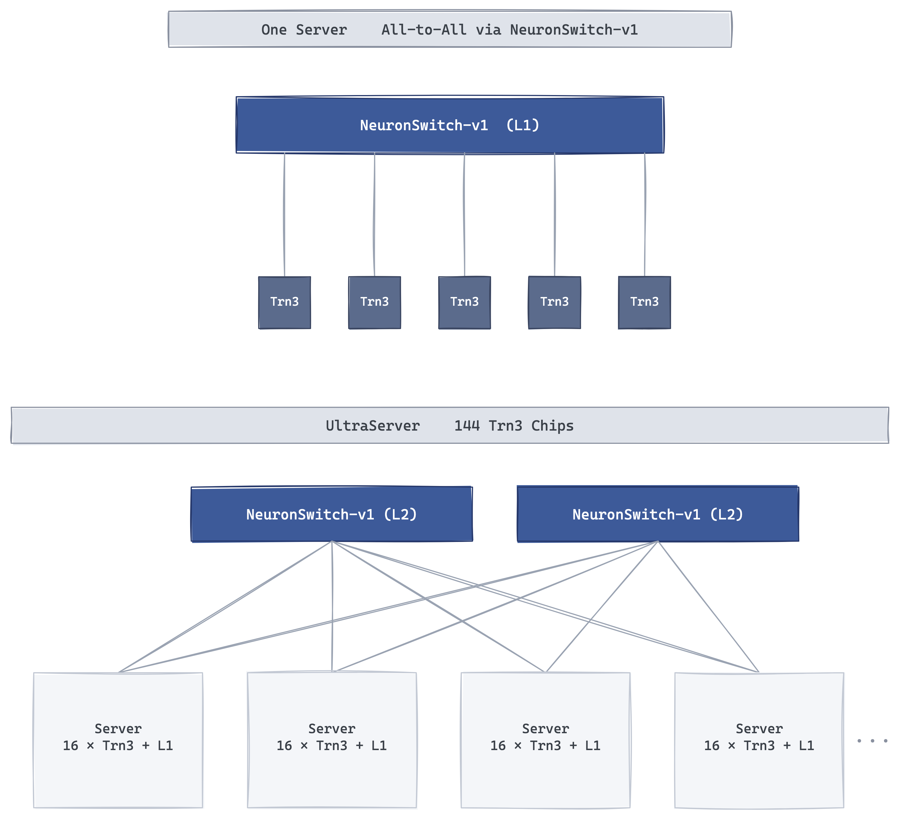

<h5 id="scale-out">横向扩展</h5>

横向扩展不是定制的；它与 AWS 已经运行的结构相同。每个 Trainium 实例都携带一个 <em><strong><a data-popup="efa">Elastic Fabric Adapter</a></strong></em> <a data-popup="nic">NIC</a> 连接到数据中心网络（每个 Trn2 实例 3.2 Tbps），并且传输 <em><strong><a data-popup="srd">SRD（可扩展可靠数据报）</a></strong></em>，卸载到 <em><strong><a data-popup="nitro">Nitro</a></strong></em> 卡而不是在加速器上运行。 SRD 是 AWS 对 <a data-popup="rdma">RDMA</a>的明确答案：而不是单个有序流 <a data-popup="roce">RoCE</a> 或 <a data-popup="infiniband">InfiniBand</a>，它将每条消息喷射到多达 64 条并行路径上，并可靠但无序地传送，将重新组装推向集体库，并避开阻塞单个拥塞路径所导致的队列头。它是 AWS 为其云构建的传输，重新用于加速器结构。

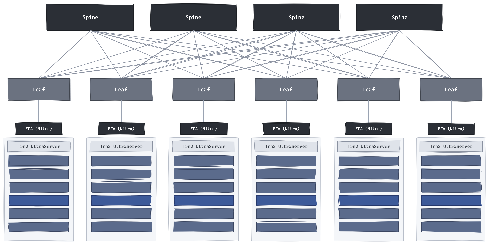

层次结构的顶部是 <em><strong><a data-popup="ultracluster">UltraCluster</a></strong></em>，由 <em><strong><a data-popup="10p10u">10p10u</a></strong></em> 网络缝合在一起（AWS 的简写，表示整个数据中心的约 10 petabits/s 带宽，延迟低于 10 微秒），并可扩展到数十万个芯片。证明点是 <em><strong><a data-popup="project-rainier">Rainier 项目</a></strong></em>：分布在多个美国数据中心的大约 50 万个 Trainium2 芯片，于 2025 年底为 <strong>Anthropic</strong> 上线；到 2026 年初，Claude 已在超过 100 万台芯片上运行，这是任何外部实验室对非 NVIDIA 培训平台做出的最大承诺。它的存在是因为经济学是端到端的。 AWS 声称，Trainium2 的性价比比其 <a data-popup="h200">Hopper</a>级 GPU 实例高出 30–40%（AWS 数据，针对上一代 NVIDIA 而不是 <a data-popup="b200">Blackwell</a>），并且由于 Amazon 拥有从 <a data-popup="nitro">Nitro</a> 卡到 API 的每一层，因此该利润由 Amazon 来设置。

<h4 id="software">软件栈</h4>

Trainium 的软件使借用变得明确： <em><strong><a href="https://awsdocs-neuron.readthedocs-hosted.com/">Neuron SDK</a></strong></em> 是一个 <em><strong>编译器优先堆栈，构建在与 TPU <a data-popup="openxla">相同的</a> OpenXLA</strong></em>基础上。 Neuron 编译器 (<code class="notranslate" translate="no">neuronx-cc</code>) 摄取 <a data-popup="hlo">XLA HLO</a> 图形并将其降低为 <em><strong><a data-popup="neff">NEFF</a></strong></em> Neuron 运行时加载到 NeuronCore 上的二进制文件；前端 IR 是 Google 的，Google 自己的 OpenXLA 公告将 Trainium 列为与 TPU 一起的一流 <a data-popup="pjrt">PJRT</a> 设备。 <em><strong><a data-popup="torch-neuronx">torch-neuronx</a></strong></em> 通过 <a data-popup="torch-xla">PyTorch/XLA</a>的 <a data-popup="lazy-tensor">LazyTensor</a> 跟踪运行PyTorch（记录操作，编译步边界处的图形），并且 <em><strong>jax-neuronx</strong></em> 通过 <a data-popup="stablehlo">StableHLO</a>降低JAX。从一极的内核驱动 <a data-popup="compiler">CUDA</a> 到另一极的整个程序 <a data-popup="compiler">XLA</a> ，Trainium几乎位居榜首。 TPU 的特点：编译器就是系统，而且基本上是同一个编译器。

它的分歧之处是逃生舱口。仅靠 XLA 并不总能合成新颖的注意力变体或融合的 MoE 调度的最佳方案，因此 Neuron 提供 <em><strong><a data-popup="nki">NKI（神经元内核接口）</a></strong></em>，这是一种 Python 平铺级内核语言，公开了四个引擎和 <a data-popup="sbuf">SBUF</a>/<a data-popup="psum">PSUM</a> 直接便签本。它是 Trainium 的 <em><strong><a data-popup="pallas">Pallas</a></strong></em> （或其 <em><strong><a data-popup="triton">Triton</a></strong></em>）：与位于当内核的胜利位于 <a data-popup="schedule">计划</a>而不是代数时，整个程序编译器。在其下方，有一个 <em><strong>集体通信库</strong></em> 映射 <a data-popup="all-reduce">全归约</a> 和 <a data-popup="all-to-all">全部到全部</a> 到 <a data-popup="cc-core">CC-Core</a> 和NeuronLink拓扑（相当于 <a data-popup="nccl">NCCL</a>），以及 <em><strong><a data-popup="nxd">NeuronX Distributed</a></strong></em> 提供分片训练层。

与 CUDA（甚至与 TPU 堆栈）的差距在于成熟度，而不是设计。到 2024 年底，NKI、JAX 路径和分布式库仍处于测试阶段；移植模型仅在 AWS 上运行，没有跨供应商回退； <a data-popup="vllm">vLLM</a> 后端跟踪上游项目。最清楚的说明是主租户的工作原理： <strong>Anthropic</strong> 并不只是通过 PyTorch 以 Trainium 为目标，它嵌入 Annapurna，编写自己的低级 <a data-popup="nki">NKI</a> 内核和上游修复到 Neuron 堆栈中。 Trainium 在前沿是可行的，但在前沿它是共同设计的，而不是交钥匙的：编译器是继承性的并且非常优秀，但周围的生态系统还很年轻。

<h3 id="groq-lpu">Groq LPU</h3>

 <em><strong><a href="https://groq.com/">Groq</a> LPU</strong></em> 是一台 <em><strong>确定性</strong></em> 机器。其他所有芯片都使用硅来容忍不确定性：缓存来隐藏内存延迟，调度程序来填充停顿，仲裁器来解决它无法预测的争用。接口板将其全部删除。去掉每个 <em><strong>反应</strong></em> 组件（没有缓存，没有分支预测器，没有仲裁器，没有重排序缓冲区，甚至没有片上交叉开关），并将整个调度问题交给编译器，编译器将每条指令和每个字节置于精确的周期上。剩下的是一个在运行之前就知道延迟的芯片。 <em><strong><a data-popup="tpu-v1">TPU</a></strong></em> 将调度移至编译器中，但保留 <a data-popup="hbm">HBM</a> 和动态网络，Groq 删除了最后的来源不确定性：内存全部是 <a data-popup="sram">SRAM</a>，网络也是经过调度的，因此数百个芯片作为一个时钟精确的程序运行。

<h4 id="genealogy">演进路线</h4>

2016

<strong><em><a href="https://en.wikipedia.org/wiki/Groq">创立</a></em></strong>

<a data-popup="jonathan-ross">乔纳森·罗斯</a>，他创立了 Google <a data-popup="tpu-v1">TPU</a> 作为 20% 的项目，剩下来构建确定性推理芯片。

2020

<strong><em><a href="https://groq.humain.ai/wp-content/uploads/2024/02/2020-Isca.pdf">TSP</a></em></strong><a data-popup="groqchip">GroqChip 1</a>

第一颗芯片（<a data-popup="isca">ISCA</a> 2020， <em>快速思考</em>)：单个 <a data-popup="functional-slice">功能切片</a> 核心，14 nm，无 <a data-popup="hbm">HBM</a>，无缓存。

2022

<strong><em><a href="https://dl.acm.org/doi/10.1145/3470496.3527405">多处理器</a></em></strong>

<a data-popup="isca">ISCA</a> 2022： <a data-popup="software-scheduled-networking">软件调度网络</a> 通过编译的软件将确定性调度扩展到数千个芯片 <a data-popup="dragonfly">Dragonfly</a>。

2023

<strong><em><a href="https://www.prnewswire.com/news-releases/groq-selects-samsung-foundry-to-bring-next-gen-lpu-to-the-ai-acceleration-market-301900464.html">三星 4 纳米</a></em></strong>

第二代LPU在三星 <a data-popup="sf4x">SF4X</a>上发布；它从未发货（报告的流片失败）。

2024

<strong><em><a href="https://techcrunch.com/2024/03/01/ai-chip-startup-groq-forms-new-business-unit-acquires-definitive-intelligence/">LPU / GroqCloud</a></em></strong>

TSP 已更名为 <a data-popup="lpu">语言处理单元</a>;该公司以创纪录的解码速度从销售卡转向销售代币。

2025 年

<strong><em><a href="https://groq.com/newsroom/groq-and-nvidia-enter-non-exclusive-inference-technology-licensing-agreement-to-accelerate-ai-inference-at-global-scale">NVIDIA 许可</a></em></strong>

NVIDIA 获得 LPU 技术 <a data-popup="nvidia-groq-deal">非独家许可</a> ，并聘请 Ross 和大部分技术人员

2026

<strong><em><a href="https://developer.nvidia.com/blog/inside-nvidia-groq-3-lpx-the-low-latency-inference-accelerator-for-the-nvidia-vera-rubin-platform/">NVIDIA Groq 3 LPU</a></em></strong><a data-popup="lp30">LP30 / LPX</a>

该技术再次出现在 <a data-popup="gtc">GTC</a> 2026 作为 <a data-popup="rubin">Rubin</a> NVL72 旁边的延迟协处理器，通过 <a data-popup="attention-ffn-disaggregation">注意力 FFN 分解</a>。

<h4 id="architecture">架构</h4>

该领域的其余部分是基于 <em><strong>复制核心</strong></em>：平铺一个 <a data-popup="streaming-multiprocessor">SM</a>， <a data-popup="tensorcore">TensorCore</a>、 <a data-popup="cu">CU</a>，或跨模具和农场工作到副本的数据流核心。 LPU 是以另一种方式构建的。它采用单个传统内核，然后 <em><strong>将其拆开</strong></em>：指令控制、向量 ALU、矩阵单元、内存和网络均成为一个 <em><strong><a data-popup="functional-slice">功能切片</a></strong></em>，相同硬件的全高列，并且这些列在芯片上并排站立。每个切片上均质，整个芯片上异质。数据并不位于寄存器堆中等待发送到单元；它 <em><strong><a data-popup="stream-register">流</a></strong></em> 像装配线上的零件一样水平穿过切片，东边和西边，每个周期一个寄存器跳，而 <a data-popup="vliw">VLIW</a> 指令从控制层向北发出以满足它。数据路径中没有任何反应：编译器知道每个周期中每个操作数的位置，而硬件只是转动时钟。流媒体是其身份：该设计作为 <em><strong>张量流处理器</strong> (TSP)</em>推出，并一直沿用该名称，直到 2024 年更名为 <em>语言处理单元</em>。

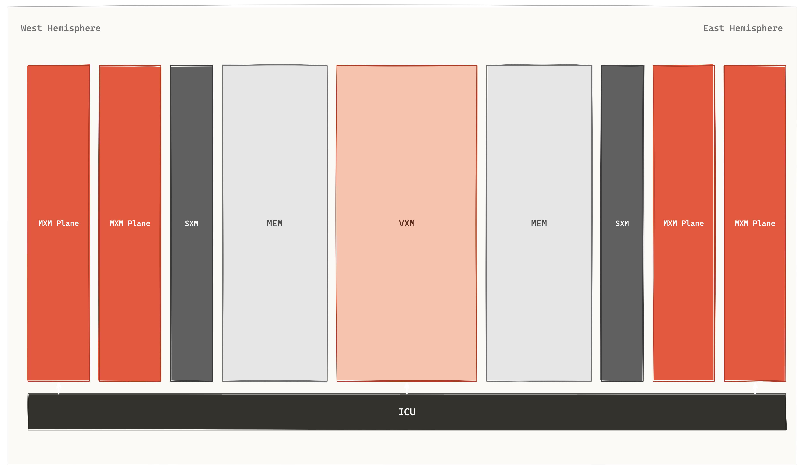

纵轴是SIMD宽度。该芯片有 320 个通道高，组织为 20 个 <em><strong><a data-popup="superlane">超级通道</a></strong></em> ，每个通道有 16 个通道（第 21 个是备用通道，为了产量而熔断，对软件不可见），每个切片同时作用于所有 320 个通道。横轴是时间。每条通道有 64 个逻辑 <em><strong><a data-popup="stream-register">流寄存器</a></strong></em> ，其中 32 个向东流动，32 个向西流动，并且在每个刻度上，每个流都沿其方向前进一个切片，直到它被消耗或从芯片边缘掉落。切片从传递的流中读取操作数，计算并将结果写回到绑定到下一个切片的流上。芯片被镜像到围绕中央矢量单元的两个半球，因此一次产生的值可以被两侧的切片消耗。

<h5 id="compute">计算</h5>

LPU 与其他部分保持相同的分工，矩阵工作在专用单元上，其余部分在矢量引擎上，但将两者作为流中的切片进行排列。矩阵路径为 <em><strong><a data-popup="mxm">MXM</a></strong></em>：四个独立的320×320乘法累加平面（每个半球两个），总共409,600个乘法器，将INT8或FP16操作数放入INT32或FP32累加器中。重量安装在整个平面上（所有这些都在 40 个周期内完成），然后激活流通过并且产品积累。在 900 MHz 时，大约为 <em><strong>750 INT8 TOPS 和 188 FP16 TFLOPS</strong></em>，并且不同寻常的是，该数字不带有稀疏星号：TSP 根本拒绝跳过零，因为依赖于数据的跳过会使执行时间依赖于数据，确定性是它不会交易的一项属性。

矢量路径是芯片中心的 <em><strong><a data-popup="vxm">VXM</a></strong></em> ：每通道 16 个 ALU，排列为 4×4 网格，5,120 32 位 ALU，运行激活、归一化、量化和残差加法。由于计算是 <em><strong>空间</strong></em> 而不是发布到共享单元，因此操作数可以在连续周期中穿过 VXM ALU 链并直接进入 MXM 平面，而无需接触内存：GPU 内核手动构建的算子融合在这里只是切片的物理顺序。第三种切片类型， <em><strong><a data-popup="sxm-groq">SXM</a></strong></em>，处理直线流无法表达的运动：通道移位、320 通道排列、转置和芯片到芯片链接都在这里，因此 cross-lane data rearrangement 是一等操作，而不是往返通过 SRAM。

<h5 id="memory">内存</h5>

没有 HBM，没有 DRAM，也没有缓存。片上是 <em><strong><a data-popup="mem-slice">MEM</a></strong></em> 片：88 个片（每个半球 44 个）中包含 230 MB SRAM，每个字节是计算片的单个周期，合计约为 80 TB/s。这就是整个层次结构：一层、扁平、软件寻址，没有任何会引入可变延迟访问的逐出、预取或一致性机制。

结果是架构的定义约束。 230 MB 不包含模型。 FP16 中的 Llama-2 70B 为 140 GB，因此必须 <em><strong>分片到数百个芯片上</strong></em>，其权重分布在整个机架或更多机架的总 SRAM 上：部署的配置约为 576 个 LPU。 GPU 将 HBM​​ 中的模型停放在少数包上，并通过它流式传输令牌，而 LPU 将模型分散在整个集群的 SRAM 中，并通过集群流式传输令牌。芯片数量由容量决定，而不是计算：重量必须合适。这与 Cerebras 所做的交易（仅 SRAM，无 HBM）是从相反的方向进行的：Cerebras 保留一个巨大的芯片并放弃每个晶圆的容量； Groq 保留了正常尺寸的模具，并放弃在模具上安装模型。

<h5 id="numerics">数值格式</h5>

数字是未走的路。这里的其他供应商每一代都将精度减半， <a data-popup="fp16">FP16</a> 到 <a data-popup="fp8">FP8</a> 到 <a data-popup="fp4">FP4</a> 具有块缩放功能以重新获得准确性。 TSP 停留在 <em><strong>FP16 和 INT8</strong></em> FP32 累积，从未在芯片中交付 FP8 或 FP4。它的一个数字思想是 <em><strong><a data-popup="truepoint">TruePoint</a></strong></em>：将 320 个元素的点积融合到具有 FP32 累加的单个舍入步骤中，因此 FP16 乘法器阵列在缩减方面接近 FP32 精度（Groq 报告相对于FP32 基线）。

无论 16 位是信念还是从未获得低精度刷新的数据路径，都很难与第二代芯片从未发货的事实分开。 SRAM 容量是该架构最稀缺的资源，8 位权重将使模型所需的芯片数量减半；这种容量限制的机器有充分的理由想要 FP8，但没有将其移植到芯片上。同样的悬而未决的问题也笼罩在 Cerebras 的 16 位数据路径上，也面临同样的压力：供应商最渴望以最宽的精度进行容量计算。

<h5 id="determinism">确定性</h5>

所有其他加速器都隐藏延迟； LPU <em><strong>公开</strong></em> 它。 ISA 承载每条指令的执行延迟，数据路径在构造上是固定延迟的，因此编译器会提前计算每个结果出现的确切周期。硬件中的任何东西都不会干扰该调度：没有缓存会丢失，没有仲裁器会停止，没有分支会错误预测，没有推测会展开。 Groq 自己的测量就是证明：BERT-Large 的运行在约 75 µs 的范围内返回了 24,240 次，编译器的预测延迟在测量值的 2% 以内。

这是 TPU 的本能（将调度移至编译器中，删除事后猜测的硬件）更进一步。 TPU编译器调度芯片； LPU 编译器调度 <em><strong>系统</strong></em>，因为确定性也适用于整个网络。它与 Cerebras 完全相反，其核心是 <em><strong><a data-popup="dataflow-processor">数据流</a></strong></em>，每当操作数恰好到达时就会触发：WSE 对数据做出反应，LPU 对其进行定时。两台机器都删除调度程序；一个将其替换为到达，另一个将其替换为时钟。

<h5 id="bets">核心押注</h5>
<ul>
<li><em><strong>押注 1：确定性优于容忍。</strong></em> 删除每个反应性组件（缓存、仲裁器、预测器、重新排序缓冲区）并让编译器拥有每个周期。</li>
<li><em><strong>押注 2：空间功能切片。</strong></em> 将核心分解为切片并通过它们流式传输操作数，因此融合是布局规划和数据重用，而不是寄存器文件舞蹈。</li>
<li><em><strong>押注 3：SRAM 是唯一的内存。</strong></em> 不惜任何容量成本，无需 HBM。将保留片上模型的能力换成单周期、固定延迟访问，接受模型必须跨越数百个芯片。</li>
<li><em><strong>押注 4：也安排网络。</strong></em> 让芯片成为自己的路由器并逐周期编译通信，因此一千个芯片集群是一个确定性程序，没有交换机，也没有拥塞。</li>
<li><em><strong>押注 5：销售延迟，而不是吞吐量。</strong></em> 针对第 1 批中每个用户每秒的代币数进行优化，该机制 GPU 最差，并且定价与产品速度相同，而不是在每个代币的成本上进行竞争。</li>
</ul>
<h4 id="scaling">扩展</h4>

扩展 LPU 与这里的其他任何东西不同，因为没有单独的扩展结构需要构建：芯片已经是一个交换机。每个 LPU 最多承载 16 个芯片到芯片 <em><strong><a data-popup="realscale">RealScale</a></strong></em> 链路（11 个暴露在卡上），并同时充当计算端点和路由器。将芯片直接相互连接，集群就是一个 <em><strong><a data-popup="glueless-multiprocessor">无缝多处理器</a></strong></em>：无 <a data-popup="nic">NIC</a>，无 <a data-popup="nvswitch">交换机ASIC</a>，无架顶交换机。由于确定性贯穿这些链接，因此整个集群按照一个编译时计划运行。

纵向扩展

节点：8块接口板通过 <a data-popup="realscale">RealScale</a> C2C全连接，形成一个 <a data-popup="dragonfly">Dragonfly</a> 呈现为单个高基虚拟路由器的组。软件调度、无开关、无一致性。

横向扩展

相同的结构，经过扩展。 <a data-popup="dragonfly">Dragonfly</a> 节点：每机架 9 个（72 个芯片，一个节点为热备用），可扩展至规格 10,440 个芯片，每一跳仍遵循已编译的确定性计划。

<h5 id="scale-up">纵向扩展</h5>

该节点有 8 个 LPU，完全连接：每个芯片的 7 个链路将其连接到其他七个芯片，因此节点中的每个芯片彼此之间都是一跳。每个芯片上剩余的 4 个链路（跨节点的 32 个链路）捆绑到 ISCA 论文中所谓的 32 端口虚拟路由器中，将节点的上行链路连接到更大的结构中。没有底板交换机，也没有一致的地址空间；远程操作数未加载，它按 <em>计划</em> 到达，由源芯片在编译器选择的周期上注入，并由目标在其到达的周期上消耗。

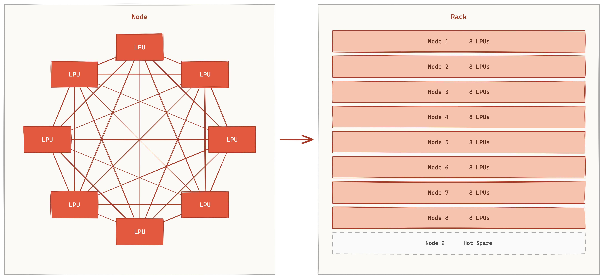

<h5 id="scale-out">横向扩展</h5>

在节点之外，节点连接到 <em><strong><a data-popup="dragonfly">Dragonfly</a></strong></em>：9个节点构成一个72芯片机架（第9个是热备用，因此64个活动），并且拓扑可扩展到指定的10,440个芯片，其中任何两个节点相距六跳以下。结构是 <em><strong><a data-popup="software-scheduled-networking">软件调度</a></strong></em>：路由和流量控制移至编译时，论文的框架很生硬， <em>已安排，未路由</em>。没有背压，也没有动态仲裁，因为编译器已经证明接收器已经准备好；链接携带 <a data-popup="fec">前向纠错</a> 而不是重传，因为重试会扰乱时间表。保持独立时钟芯片机架同步本身就有问题：链接是 <em><strong><a data-popup="plesiochronous">准同步的</a></strong></em>，并且该结构通过 <em><strong><a data-popup="hardware-aligned-counter">硬件对齐计数器</a></strong></em> 在生成树上每 256 个周期进行交换来保持全局共识时间，并通过定期去歪斜指令使每个芯片恢复对齐。 Groq 报告的回报是 8 路 <a data-popup="all-reduce">all-reduce</a> 匹配 <a data-popup="a100">A100</a>/<a data-popup="nvswitch">NVSwitch</a> 节点在大张量上，并在小张量上击败它，其中预定的结构不会支付动态张量所需要的握手延迟。

成本被写入内存押注的物理中。模型副本不是一个盒子，而是一个机架（或八个）：根据一项分析，Llama-2 70B 搭载约 576 个芯片，在 LPU 旁边配备 144 个主机 CPU 和 144 TB 主机 RAM，而 8-GPU 服务器则配备两个 CPU。每个芯片下的晶圆都很便宜（14 nm GlobalFoundries，据报道低于 6,000 美元，而 H100 级部件约为 16,000 美元），但您需要数百个晶圆，并且在解码过程中，当 SRAM 工作时，其巨大的计算大部分处于空闲状态。 <em><strong><a href="https://newsletter.semianalysis.com/p/groq-inference-tokenomics-speed-but">SemiAnalysis</a></strong></em> 简单地说：当您针对延迟进行优化时，LPU 会赢得每代币的材料清单，而一旦进行批处理，每美元的吞吐量就会输给 GPU，大约一个数量级。该架构不参与成本竞争。它比的是速度。

<h4 id="software">软件栈</h4>

编程模型是 <em>最纯粹的表达，编译器是机器</em>。没有 <em><strong>没有内核</strong></em>。您向 Groq 编译器提供来自 <a data-popup="pytorch">PyTorch</a>、TensorFlow 或 <a data-popup="onnx">ONNX</a>的模型；它降低到一个小的张量操作集，并静态调度每个指令、每个流以及每个芯片到芯片的传输。没有人编写 <a data-popup="wgmma"><code class="notranslate" translate="no">wgmma</code></a> 或手动调整图块，因为没有动态硬件可供手动调整。 Groq 的演示是，一个不到 10 人的团队在四天之内就调出了 LLaMA，而同一模型在 GPU 上进行调优则需要数月的手动内核工作。编译器周围的堆栈（分析器、运行时、 <code class="notranslate" translate="no">GroqFlow</code> 启动路径）很小且封闭， <code class="notranslate" translate="no">GroqFlow</code> 于 2025 年存档，当时该公司停止销售卡片并开始销售代币。

该枢纽是讲述架构的用途。 LPU 的构造是 <em><strong>仅推理</strong></em> （Ross 的框架是训练是本地游戏，推理是全局游戏），而且它在单用户解码延迟这一点上是不败的。独立测量支持了这一说法， <em><strong><a href="https://artificialanalysis.ai/providers/groq">人工分析</a></strong></em> 将 Groq 列为开放模型上每秒令牌速度最快的提供商之一。它与其他部分的匹配度很差：不适合 SRAM 机架的模型、需要大批量实现每美元吞吐量的工作负载，或者静态调度无法表达的动态控制流。 <a data-popup="moe">MoE</a> 提供了服务，但其依赖于数据的专家路由对于想要了解所有内容的编译器来说很尴尬。进展，Groq 几乎没有发表关于如何协调两者的文章。

结语是，这一切的买家是 NVIDIA。 2025 年 12 月，NVIDIA 获得了 <em><strong><a data-popup="nvidia-groq-deal">非独占许可</a></strong></em> 到了 LPU 技术并聘请了 Ross 和团队的大部分成员。这不是一次收购：根据 NVIDIA 自己的 10-K 数据，没有任何产品、客户合同或股权易手，尽管交割时支付的大约 13B 美元让媒体称其为收购。在 <a data-popup="gtc">GTC</a> 2026 年，该技术以 <em><strong>NVIDIA Groq 3 LPU</strong></em>的形式重新出现，这是一个机架256 个纯 SRAM 推理芯片位于 <a data-popup="rubin">Rubin</a> NVL72 旁边，并在它们之间分配Transformer：GPU 运行 <a data-popup="attention-ffn-disaggregation">attention</a>，LPU 运行前馈层和 MoE 层，并通过 <a data-popup="dynamo">Dynamo</a> 协调切换。人工智能中最具确定性的架构最终成为最可编程架构内的延迟协处理器。与此同时，GroqCloud 仍然在原始 14 nm 芯片上提供代币服务。

<h3 id="comparison">对比</h3>

所有算术数字均为规定精度下的峰值；除非供应商不发布基础，否则条目很密集。内存带宽是所示的本机层：GPU、TPU 和 Trainium 的 HBM；为 Cerebras 和 Groq 聚合片上 SRAM。这些数字无法直接比较。纵向扩展带宽遵循每个供应商的惯例，可以指每芯片聚合、机架聚合或真正的二分。

<h5 id="per-chip">单芯片</h5>

<table class="comparison-table">
<thead>
<tr><th>公司</th><th>年份</th><th>芯片</th><th>加速器内存</th><th>内存带宽</th><th>旗舰密集 FLOPs</th><th>TDP</th><th>纵向扩展带宽</th></tr>
</thead>
<tbody>
<tr><td class="company" rowspan="6">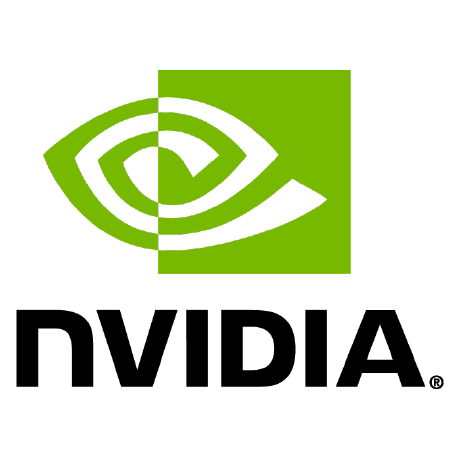</td><td>2023</td><td>H100 SXM5</td><td>80 GB HBM3</td><td>3.4 TB/s</td><td>1.98 PetaFLOPS FP8</td><td>700 W</td><td>900 GB/s</td></tr>
<tr><td>2024</td><td>H200 SXM</td><td>141 GB HBM3e</td><td>4.8 TB/s</td><td>1.98 PetaFLOPS FP8</td><td>700 W</td><td>900 GB/s</td></tr>
<tr><td>2024</td><td>B200</td><td>192 GB HBM3e</td><td>8 TB/s</td><td>4.5 PetaFLOPS FP8 / 9 PetaFLOPS FP4</td><td>1,000 W</td><td>1.8 TB/s</td></tr>
<tr><td>2025</td><td>B300</td><td>288 GB HBM3e</td><td>8 TB/s</td><td>7.5 PetaFLOPS FP8 / 15 PetaFLOPS FP4</td><td>1,400 W</td><td>1.8 TB/s</td></tr>
<tr><td>2026</td><td>Rubin</td><td>288 GB HBM4*</td><td>~13 TB/s*</td><td>~17 PetaFLOPS FP8* / ~50 PetaFLOPS FP4*</td><td>~1,500 W*</td><td>3.6 TB/s</td></tr>
<tr><td>2027</td><td>Rubin Ultra</td><td>1 TB HBM4e*</td><td>~32 TB/s*</td><td>~33 PetaFLOPS FP8* / ~100 PetaFLOPS FP4*</td><td>~1,800 W*</td><td>3.6 TB/s</td></tr>
</tbody>
<tbody>
<tr><td class="company" rowspan="3"></td><td>2023</td><td>TPU v5p</td><td>95 GB HBM2e</td><td>2.8 TB/s</td><td>0.46 PetaFLOPS BF16</td><td>n/d</td><td>1.2 TB/s</td></tr>
<tr><td>2025</td><td>TPU Ironwood (v7)</td><td>192 GB HBM3e</td><td>7.4 TB/s</td><td>4.6 PetaFLOPS FP8</td><td>n/d</td><td>1.2 TB/s</td></tr>
<tr><td>2026</td><td>TPU v8t Sunfish</td><td>216 GB HBM3e</td><td>6.5 TB/s</td><td>12.6 PetaFLOPS FP4</td><td>n/d</td><td>n/d</td></tr>
</tbody>
<tbody>
<tr><td class="company" rowspan="4"></td><td>2023</td><td>MI300X</td><td>192 GB HBM3</td><td>5.3 TB/s</td><td>2.6 PetaFLOPS FP8</td><td>750 W</td><td>896 GB/s</td></tr>
<tr><td>2024</td><td>MI325X</td><td>256 GB HBM3e</td><td>6.0 TB/s</td><td>2.6 PetaFLOPS FP8</td><td>1,000 W</td><td>896 GB/s</td></tr>
<tr><td>2025</td><td>MI355X</td><td>288 GB HBM3e</td><td>8 TB/s</td><td>10 PetaFLOPS FP8 / 20 PetaFLOPS FP4</td><td>1,400 W</td><td>1,075 GB/s</td></tr>
<tr><td>2026</td><td>MI455X</td><td>待定</td><td>待定</td><td>~40 PetaFLOPS FP4*</td><td>待定</td><td>n/d</td></tr>
</tbody>
<tbody>
<tr><td class="company" rowspan="2"></td><td>2021</td><td>WSE-2</td><td>40 GB SRAM（晶圆上）</td><td>20 PB/s（聚合）</td><td>7.5 PetaFLOPS FP16</td><td>23 kW（系统）</td><td>（域 = 晶圆）</td></tr>
<tr><td>2024</td><td>WSE-3</td><td>44 GB SRAM（晶圆上）</td><td>21 PB/s（聚合）</td><td>~15.8 PetaFLOPS FP16*</td><td>23 kW（系统）</td><td>（域 = 晶圆）</td></tr>
</tbody>
<tbody>
<tr><td class="company" rowspan="3"></td><td>2022</td><td>Trainium1</td><td>32 GB HBM2e*</td><td>820 GB/s</td><td>0.19 PetaFLOPS BF16/FP8</td><td>不适用</td><td>不适用</td></tr>
<tr><td>2024</td><td>Trainium2</td><td>96 GB HBM3</td><td>2.9 TB/s</td><td>1.3 PetaFLOPS FP8</td><td>~500 W*</td><td>1.28 TB/s</td></tr>
<tr><td>2025</td><td>Trainium3</td><td>144 GB HBM3e</td><td>4.9 TB/s</td><td>2.5 PetaFLOPS FP8</td><td>n/d</td><td>n/d</td></tr>
</tbody>
<tbody>
<tr><td class="company" rowspan="2"></td><td>2020</td><td>GroqChip （第一代 TSP/LPU）</td><td>230 MB SRAM</td><td>80 TB/s（片上聚合）</td><td>0.188 PetaFLOPS FP16</td><td>215 W</td><td>330 GB/s（11 链路卡）</td></tr>
<tr><td>2026</td><td>NVIDIA Groq 3 LP30</td><td>500 MB SRAM</td><td>150 TB/s（片上聚合）</td><td>~1.2 PetaFLOPS FP8*</td><td>n/d</td><td>2.5 TB/s</td></tr>
</tbody>
</table>

<h5 id="per-rack-pod">单机架 / Pod</h5>

<table class="comparison-table">
<thead>
<tr><th>公司</th><th>年</th><th>系统</th><th>芯片</th><th>聚合密集FLOP</th><th>加速器内存总计</th><th>扩展结构 BW</th><th><a data-popup="per-chip-nic">每芯片 NIC</a></th><th>电源</th><th>冷却</th></tr>
</thead>
<tbody>
<tr><td class="company" rowspan="6"></td><td>2023</td><td>HGX H100</td><td>8</td><td>16 PetaFLOPS FP8</td><td>640 GB</td><td>7.2 TB/s</td><td>400 Gbps (CX-7)</td><td>~10 kW</td><td>风冷</td></tr>
<tr><td>2024</td><td>HGX H200</td><td>8</td><td>16 PetaFLOPS FP8</td><td>1.1 TB</td><td>7.2 TB/s</td><td>400 Gbps</td><td>~10 kW</td><td>风冷</td></tr>
<tr><td>2024</td><td>GB200 NVL72</td><td>72</td><td>360 PetaFLOPS FP8 / 720 PetaFLOPS FP4</td><td>13.4 TB</td><td>130 TB/s</td><td>800 Gbps (CX-8)</td><td>~120 kW</td><td>液体</td></tr>
<tr><td>2025</td><td>GB300 NVL72</td><td>72</td><td>540 PetaFLOPS FP8 / 1,100 PetaFLOPS FP4</td><td>20.7 TB</td><td>130 TB/s</td><td>800 Gbps</td><td>~120 kW</td><td>液体</td></tr>
<tr><td>2026</td><td>NVL144</td><td>144</td><td>~1.2 ExaFLOPS FP8 / ~3.6 ExaFLOPS FP4</td><td>~21 TB</td><td>~260 TB/s*</td><td>1.6 Tbps (CX-9)</td><td>~200 kW*</td><td>液体</td></tr>
<tr><td>2027</td><td>NVL576 (Kyber)</td><td>576</td><td>~5 ExaFLOPS FP8 / ~15 ExaFLOPS FP4</td><td>~144 TB</td><td>n/d</td><td>1.6 Tbps</td><td>~600 kW*</td><td>液冷</td></tr>
</tbody>
<tbody>
<tr><td class="company" rowspan="3"></td><td>2023</td><td>TPU v5p Pod</td><td>8,960</td><td>4.1 ExaFLOPS BF16</td><td>852 TB</td><td>（3D 环面）</td><td>（ICI = 纵向扩展 + 横向扩展）</td><td>n/d</td><td>液体</td></tr>
<tr><td>2025</td><td>TPU Ironwood Pod</td><td>9,216</td><td>42.5 ExaFLOPS FP8</td><td>1.77 PB</td><td>（3D 环面）</td><td>光学 OCS</td><td>~10 MW*</td><td>液体</td></tr>
<tr><td>2026</td><td>TPU v8t Sunfish Pod</td><td>9,600</td><td>121 ExaFLOPS FP4</td><td>~2 PB</td><td>(Boardfly)</td><td>光学 OCS</td><td>n/d</td><td>液体</td></tr>
</tbody>
<tbody>
<tr><td class="company" rowspan="4"></td><td>2023</td><td>MI300X 8-GPU OAM</td><td>8</td><td>21 PetaFLOPS FP8</td><td>1.5 TB</td><td>7.2 TB/s</td><td>400 Gbps</td><td>~10 kW</td><td>风冷</td></tr>
<tr><td>2024</td><td>MI325X 8-GPU OAM</td><td>8</td><td>21 PetaFLOPS FP8</td><td>2.0 TB</td><td>7.2 TB/s</td><td>400 Gbps</td><td>~12 kW*</td><td>风冷</td></tr>
<tr><td>2025</td><td>MI355X 8-GPU OAM</td><td>8</td><td>80 PetaFLOPS FP8 / 160 PetaFLOPS FP4</td><td>2.3 TB</td><td>8.6 TB/s</td><td>400 Gbps</td><td>~16 kW*</td><td>液体</td></tr>
<tr><td>2026</td><td>Helios (MI455X)</td><td>72</td><td>1.4 ExaFLOPS FP8 / 2.9 ExaFLOPS FP4</td><td>31 TB</td><td>260 TB/s</td><td>n/d</td><td>n/d</td><td>液体</td></tr>
</tbody>
<tbody>
<tr><td class="company" rowspan="1"></td><td>2024</td><td>Condor Galaxy 3</td><td>64 晶圆</td><td>~1 ExaFLOPS FP16*</td><td>2.8 TB SRAM + MemoryX</td><td>（以太网树）</td><td>1.2 Tb/s 以太网</td><td>~1.5 MW*</td><td>液体</td></tr>
</tbody>
<tbody>
<tr><td class="company" rowspan="3"></td><td>2022</td><td>Trn1 实例</td><td>16</td><td>3 PetaFLOPS BF16</td><td>512 GB</td><td>（2D 环面）</td><td>~50 Gbps (EFA)</td><td>n/d</td><td>风冷</td></tr>
<tr><td>2024</td><td>Trn2 UltraServer</td><td>64</td><td>83 PetaFLOPS FP8</td><td>6.1 TB</td><td>（3D环形）</td><td>200 Gbps (EFAv3)</td><td>n/d</td><td>风冷</td></tr>
<tr><td>2025</td><td>Trn3 UltraServer</td><td>144</td><td>362 PetaFLOPS FP8</td><td>20.7 TB</td><td>(NeuronSwitch)</td><td>n/d</td><td>n/d</td><td>液体</td></tr>
</tbody>
<tbody>
<tr><td class="company" rowspan="2"></td><td>2022</td><td>GroqRack</td><td>64 个活跃（已安装 72 个）</td><td>12 PetaFLOPS FP16</td><td>14 GB SRAM</td><td>3.2 TB/s 二分</td><td>（RealScale；无每芯片 NIC）</td><td>n/d</td><td>风冷</td></tr>
<tr><td>2026</td><td>NVIDIA Groq 3 LPX</td><td>256</td><td>315 PetaFLOPS FP8</td><td>128 GB SRAM + 12 TB DDR5</td><td>n/d（640 TB/s 聚合 C2C）</td><td>n/d</td><td>n/d</td><td>液冷</td></tr>
</tbody>
</table>

<code class="notranslate" translate="no">*</code> 标记由分析师得出、由时代推断或由供应商聚合得出数字； <code class="notranslate" translate="no">n/d</code> 标记供应商尚未披露的规格。

<h5 id="what-this-shows">这些数据说明了什么</h5>
<ul>
<li><strong>每芯片 FP8 已收敛。</strong> B200 (4.5 PF)、Ironwood (4.6 PF) 和 MI355X (10 PF) 彼此相差约 2 倍以内。单芯片军备竞赛已经接近尾声；机架和 Pod 是架构的分歧点。</li>
<li><strong>HBM 容量是 AMD 的持久胜利。</strong> 从 2023 年到 2025 年，每代产品的 192 → 256 → 288 GB 都可以与 NVIDIA 相媲美或击败。 NVIDIA 仅通过 B300（2025 年末）就达到了 288 GB； Rubin Ultra 将于 2026 年以 1 TB/封装重新占据领先地位。</li>
<li><strong>机架规模扩展是 NVIDIA 在 2026 年之前的胜利。</strong> GB200 / GB300 NVL72 是唯一一款在 2026 年出货的连贯机架规模域。 2024–2025； AMD 在盒子上进行了扩展，直到 Helios 才达到机架规模。 TPU 回避了这个问题：它的圆环既是机架又是集群。</li>
<li><strong>TPU pod 的芯片数量让任何 NVIDIA 机架相形见绌。</strong> Ironwood pod = 9,216 个芯片，实现 42.5 ExaFLOPS FP8； NVL576 = 576 个 GPU，可实现约 5 ExaFLOPS FP8。 TPU 的单芯片统一速率 × 大规模 Pod 方案可以为每个系统带来更多的聚合计算，但代价是每芯片带宽。</li>
<li><strong>每个芯片的功耗正在快速上升。</strong> 700 W（Hopper）→ 1,000 W（Blackwell、MI325X）→ 1,400 W（B300、MI355X）→ ~1,800 W（Rubin Ultra，分析师）。超过 ~1,000 W 时必须采用液体冷却；空气冷却有效地以 Hopper 结束。</li>
<li><strong>横向扩展 NIC 带宽使每一代 NVIDIA 翻倍。</strong> 400 Gbps（CX-7、Hopper）→ 800 Gbps（CX-8、Blackwell）→ 1.6 Tbps（CX-9、Rubin）。 AMD 落后一代（Pollara 400 → Vulcano 800），反映出 Pensando 较小的安装基础和较晚的集成。</li>
<li><strong>Cerebras 打破了桌子的轴。</strong> 完全没有 HBM：44 GB 晶圆上 SRAM，总计 21 PB/s，每个密集 FLOP 约 1.3 字节，其中 GPU 行数接近 0.002。成本在同一行中显而易见：比单个 H200 更少的总内存、每个现代 GPU 后面的每瓦密集 FLOP 以及一个空的扩展列，因为相干域是晶圆本身。</li>
<li><strong>Trainium 在经济上竞争，而不是规格表。</strong> 它落后的每个芯片（Trn2 的 1.3 PF FP8 大约是 MI355X 的四分之一），但 Trn2 UltraServer 在 2024 年与 NVL72 一起达到了 64 芯片机架规模扩展，作为消息传递环面而不是相干交叉开关，并且 Trn3 转向交换 NeuronSwitch 结构。 AWS 拥有从 Nitro 卡到 API 的每一层，并且由一个主力租户（Anthropic，超过一百万个 Trainium2 芯片）对其进行前沿规模验证。</li>
<li><strong>Groq 用容量换取 SRAM 带宽，然后根据芯片数量扩展内存池。</strong> 第一个 GroqRack 仅公开 14 个GB 跨 64 个活动芯片； Groq 3 LPX 在 256 个芯片上以 40 PB/s 的总 SRAM 带宽将其容量增加到 128 GB。其 12 TB DDR5 层以及与 Rubin 的搭配表明，LPU 是对大内存 GPU 机架的补充，而不是取代。</li>
</ul>

<!--
### Tenstorrent

***[Tenstorrent](https://tenstorrent.com/)***, led by Jim Keller, is building the open-source alternative. Everything is ***[RISC-V](https://en.wikipedia.org/wiki/RISC-V)***. Everything is inspectable. The philosophy prioritises programmability and accessibility over raw peak performance.

#### Architecture

Each ***Tensix core*** contains 5 small RISC-V "baby cores": 2 ***Data Mover*** cores coordinate transfers between local SRAM, off-chip DRAM, and the Network-on-Chip, and 3 ***Compute*** cores drive the matrix FPU, vector SFPU, and pack/unpack units. ~1.5 MB local SRAM per Tensix core, two independent NoC routers for concurrent bidirectional communication. The separation of data movement from computation mirrors Google's TPU — overlap transfer with math — but implemented with programmable RISC-V cores rather than fixed hardware.

***Blackhole*** has 140 Tensix cores plus 16 ***Big RISC-V*** CPU cores — dual-issue, in-order, 64-bit cores with 64 MB L2 and coherent access to 32 GB GDDR6. Powerful enough to ***run Linux***, making Blackhole a standalone AI computer that needs no host CPU. Architecturally novel — every other accelerator requires a host.

Tenstorrent uses ***GDDR6*** (32 GB, ~512 GB/s) instead of <a data-popup="hbm">HBM</a> (~8 TB/s). A massive bandwidth disadvantage, a significant cost advantage. <a data-popup="hbm">HBM</a> needs expensive 2.5D packaging with through-silicon vias; GDDR6 uses standard packaging. A Blackhole card costs &#36;1K–&#36;5K; an <a data-popup="h100">H100</a> costs &#36;25K–&#36;40K. The bet: for edge inference, development, and smaller models, the price difference matters more than peak bandwidth.

#### Scaling

Scale-out uses standard 400 Gbps ***Ethernet*** links, not proprietary interconnects. A ***Blackhole Galaxy*** meshes 32 chips in a 4×8 configuration for ~24 PetaFLOPS <a data-popup="fp8">FP8</a>. Because the interconnect is standard Ethernet, clusters can be built from off-the-shelf networking equipment. A Blackhole chip can function as compute, memory, or a high-bandwidth network switch — LEGO-like <a data-popup="cluster">cluster</a> construction.

#### Software

The stack is entirely open source. ***TT-Metalium*** is a CUDA-equivalent low-level programming model, designed from scratch for dataflow on the Tensix mesh — kernels are plain C++, with explicit data tiling, core placement, and inter-core synchronisation via circular buffers. ***TT-NN*** provides higher-level operators. ***TT-Forge / TT-MLIR*** compile PyTorch, ONNX, and JAX down to TT-Metalium. The trade-off versus CUDA: more hardware exposed (explicit NoC routing, circular buffers, per-core SRAM), giving experts more control at a higher barrier to entry.

The Register's November 2025 Blackhole QuietBox review found models running on ***Wormhole-era kernels*** — forward-compatible but unoptimised — generating tokens at speeds consistent with being artificially capped at Wormhole's 288 GB/s rather than exploiting Blackhole's full capability. The classic chicken-and-egg: you cannot optimise kernels without hardware, but unoptimised hardware does not demonstrate its value.

---
-->
<!--
### Tesla Dojo → AI5/AI6

Tesla's AI silicon is the purest vertical integration in the industry. One company collects the training data (cameras on millions of cars), designs the training hardware, trains the models, and deploys them on its own inference hardware (in vehicles and robots).

The ***[D1](https://en.wikipedia.org/wiki/Tesla_Dojo)*** chip — designed by ex-AMD veterans — was unlike anything else. Each core was a ***general-purpose 64-bit superscalar CPU*** with simultaneous multithreading, optimised for tensor math and custom floating-point formats (CFloat8/CFloat16). Tesla's insight: video-training workloads (millions of dashcam clips) need more flexible compute than pure matmul engines. 25 D1 chips formed a ***<a data-popup="training">Training</a> Tile*** in a 5×5 grid, 36 TB/s aggregate bandwidth via 40 I/O chips, 11 GB SRAM per tile, 9 PetaFLOPS at <a data-popup="bf16">BF16</a>. A custom 2D mesh with physical memory addressing (no virtual translation). Six tiles made a System Tray; 10 cabinets an ExaPOD.

In August 2025, Musk disbanded the Dojo team, concluding it "doesn't make sense to divide resources" between training and inference architectures. The new strategy: a unified ***AI5/AI6*** platform — inference-first, training-capable — manufactured by Samsung.

The pivot reflects a broader industry insight: ***inference now dominates AI compute budgets***. Every Tesla needs inference chips; there are millions of them. <a data-popup="training">Training</a> happens at a few datacentres. The volume economics overwhelmingly favour designing for inference and making it "pretty good" at training, not the reverse. AI6 is projected at 22,500 TOPS, 800W, serving as both the in-vehicle computer and the building block for datacentre training clusters. In January 2026, Musk announced a partial Dojo revival as AI7 — the training architecture is not fully dead, just being subsumed into the unified platform.

---
-->
<!--
### Meta MTIA

Meta's strategy is startlingly different: instead of designing one amazing chip, ship a ***good-enough*** chip and iterate every six months. They have shipped six generations in roughly two years (MTIA 100, 200, 300, 400, 450, 500), using modular chiplets so compute or memory can be upgraded independently.

#### Architecture

The architecture is a grid of 64 ***Processing Elements*** in an 8×8 array. Each PE contains 2 RISC-V cores (one with vector extensions), a ***Dot Product Engine*** (fixed-function matmul), a ***SIMD Engine*** (quantisation, nonlinear functions via lookup tables), a ***Reduction Engine*** (accumulation and inter-PE communication), and a ***DMA Engine***. PEs execute an ***asynchronous dataflow*** model — operations fire when inputs are ready, without centralised scheduling. Closer to a TPU's compiler-driven execution than a GPU's dynamic scheduling, but with programmable RISC-V cores doing the coordination.

MTIA v1 and v2 used ***LPDDR5*** (64–128 GB, 176–204 GB/s) instead of <a data-popup="hbm">HBM</a> — 20× less bandwidth than an <a data-popup="h100">H100</a>. This seems bizarre, but Meta's recommendation models are ***latency-sensitive at small batch sizes***, not bandwidth-hungry. The bottleneck for batch-of-one requests is compute startup latency, not sustained throughput. LPDDR5's lower cost and smaller form factor let Meta pack 24 MTIA chips into one server, giving more aggregate compute per dollar than a few <a data-popup="hbm">HBM</a> GPUs. Later generations (MTIA 400+) added <a data-popup="hbm">HBM</a> for generative workloads that really are bandwidth-bound.

Meta co-designs the hardware with the models. The ISCA 2025 paper on MTIA 2i revealed joint optimisation of model architecture, precision format, operator fusion, and chip design. When a new model architecture emerges — HSTU, a transformer-based recommendation model with 10–100× more compute per request — Meta adjusts the next chip generation to handle it. A chip designed in 2023 for anticipated 2025 workloads encounters models that look nothing like what was planned. The six-month cadence is Meta's response to this fundamental mismatch between chip design timelines and AI research velocity. MTIA 2i-based servers (24 chips) reach total performance comparable to 8-GPU servers at ***44% lower TCO*** — not because MTIA is faster, but because the chip is exactly sized and optimised for Meta's specific workload.

#### Software

MTIA supports ***PyTorch eager mode*** natively (`device='mtia'`), with hardware-accelerated job launches in <1 μs. Most non-GPU accelerators require static graph compilation, limiting iteration speed. ***Triton-MTIA*** generates kernels for the RISC-V ISA extensions. OCP (Open Compute Project) compatibility means MTIA chips mount on standard server designs alongside GPU and CPU servers.

---
-->
<!--
### Intel Gaudi

Intel's ***Gaudi*** (acquired from Habana Labs) makes its stand on ***open software*** and ***standard networking***. Where everyone else uses proprietary interconnects (<a data-popup="nvlink">NVLink</a>, <a data-popup="ici">ICI</a>, NeuronLink), Gaudi uses ***Ethernet***.

Gaudi 3 is a multi-chiplet design on TSMC 5nm: 64 ***Tensor Processor Cores*** (programmable — contrast NVIDIA's fixed-function <a data-popup="tensor-cores">Tensor Cores</a>), 8 ***Matrix Multiplication Engines*** (256×256 systolic arrays), and 24 integrated 200 Gb/s RoCEv2 Ethernet ports (4.8 Tb/s total networking built into the chip). The key architectural point is that MMEs, TPCs, and NICs all operate in parallel — matrix math, activations, and data transfer happen simultaneously without contending.

Integrated Ethernet means scaling uses ***standard Ethernet switches*** from any vendor. For enterprises with existing Ethernet infrastructure, this eliminates a massive capital expense. Intel positions this as "no infrastructure retrofitting needed." Raw specs lag Blackwell — 128 GB HBM2e at 3.7 TB/s vs. 192 GB <a data-popup="hbm3e">HBM3e</a> at 8 TB/s — but Intel claims 70% better price-performance than <a data-popup="h100">H100</a> on Llama 3 inference. Intel's AI roadmap has been turbulent: multiple cancellations, organisational restructuring, and the CEO's public admission that Intel may be "too late" to catch up. Dell, VMware, and other enterprise partners continue shipping Gaudi 3 systems, but the product line's long-term future is uncertain.

---
-->
<!--
### MatX

***[MatX](https://matx.com/)*** was founded by ***Reiner Pope*** (led TPU software at Google) and ***Mike Gunter*** (lead TPU hardware architect). 100-person team, &#36;630M total raised (including a &#36;500M Series B in February 2026), designing a chip that trades away everything except LLM performance.

The headline innovation is a ***splittable systolic array***. A traditional systolic array is a fixed grid — small matrices waste silicon. MatX's array dynamically partitions into multiple smaller arrays. This is critical for LLMs: attention heads are small (64–128 dimensions), MoE routing produces variable-shaped matrices, <a data-popup="kv-cache">KV cache</a> operations have dimensions that depend on sequence length. A fixed 256×256 array would waste most of its capacity on these. A splittable array can reconfigure into, say, four 64×256 arrays, maintaining high utilisation across the diverse matrix shapes of a transformer.

Memory is hybrid ***SRAM + <a data-popup="hbm">HBM</a>***. Most weights live in SRAM (latency advantage, like Groq); <a data-popup="hbm">HBM</a> stores the <a data-popup="kv-cache">KV cache</a> (capacity for context length). Architecturally clever — weights have predictable streaming access patterns (perfect for SRAM), while KV caches have dynamic random-access patterns (better suited to <a data-popup="hbm">HBM</a>). Numerics are custom, tuned to the statistical distributions of transformer weights and activations — claiming <a data-popup="fp4">FP4</a>'s speed with <a data-popup="fp8">FP8</a>'s accuracy by exploiting structure that generic formats waste bits representing.

No silicon has shipped. Tapeout planned within a year of February 2026, initial TSMC shipments targeted for 2027. The &#36;500M raise — led by Jane Street and Leopold Aschenbrenner's Situational Awareness fund — signals serious conviction, but this is still a bet on execution.

---
-->
<!--
### Taalas

Every other architecture in this post stores model weights in some form of memory (<a data-popup="hbm">HBM</a>, SRAM, GDDR, LPDDR) and moves them to compute units at runtime. ***[Taalas](https://taalas.com/)*** eliminates this entirely. Model weights are ***physically encoded into the transistor-level layout of the chip*** using mask ROM. The model does not run on the chip — ***the model is the chip***.

Taalas uses a proprietary flow that translates a model's computational graph — weights, architecture, activations, all of it — directly into the physical layout of a custom ASIC. Their ***mask ROM recall fabric*** stores 4 bits per module and performs the associated multiply with a ***single transistor***. In a conventional digital MAC, multiply-accumulate requires dozens of transistors for the multiplier, adder, and register file. Taalas collapses this to ~1 transistor per weight-multiply by hardwiring the weight value into the circuit topology itself.

The ***HC1*** runs Llama 3.1 8B at ~17,000 tokens/sec per user, sub-200ms end-to-end latency, ~200W power draw (vs. 120–600 kW for a GPU <a data-popup="rack">rack</a> doing the same work). No <a data-popup="hbm">HBM</a>, no external DRAM for weights — weights are in the silicon. An SRAM recall fabric handles the dynamic state (<a data-popup="kv-cache">KV cache</a>, activations) that changes per query. LoRA adapters and configurable context windows provide limited runtime flexibility. Base weights are immutable, fixed at fabrication.

The manufacturing trick: Taalas only modifies ***two metal layers*** on a pre-fabricated base die. TSMC can turn this around on its N6 process in ~2 months, versus 4–6 months for a full chip fabrication. A new chip for a new model takes ~2 months from the moment weights are frozen — fast enough to track the open-source release cadence (Llama, DeepSeek, Mistral). The base die — SRAM fabric, I/O, control logic, routing — is fabricated once and reused across models. Only the weight-encoding layers change per model, amortising NRE across many model-specific variants.

The radical trade-off: ***zero flexibility***. Each chip runs exactly one model. An 8B chip cannot run a 70B, cannot run DeepSeek-R1, cannot run a fine-tuned variant. Any significant update requires a new fabrication run. The chip has zero residual value once the model is superseded. The radical upside: by eliminating the <a data-popup="memory-wall">memory wall</a> entirely — weights never move because they are part of the circuit — Taalas claims 73× throughput improvement over an <a data-popup="h200">H200</a> and ~1000× improvement in performance-per-watt. If inference cost drops by 2–3 orders of magnitude, workloads that are currently uneconomical (always-on personal AI assistants, real-time AI in every IoT device) become viable.

Taalas represents the logical endpoint of the specialisation axis. NVIDIA GPUs run any model, any workload. TPUs are specialised for tensor operations. Groq is specialised for autoregressive inference. Etched's Sohu is specialised for transformer architectures. Taalas is specialised for a single specific model — the maximum possible specialisation. HC1 (Llama 3.1 8B) is live. HC2 (20B) expected summer 2026. A frontier-class chip targeted for end of 2026. Founded by ***Ljubisa Bajic*** (Tenstorrent co-founder, ex-AMD/NVIDIA architect), &#36;219M total from Quiet Capital, Fidelity, and Pierre Lamond.

---
-->
<!--
### The Axes

Every chip makes trade-offs across a few fundamental dimensions.

***Generality vs. specialisation.*** GPU (most general) → AMD GPU → Intel Gaudi → TPU → Trainium → MTIA → Groq / MatX → Etched Sohu (transformer-only) → Taalas (single-model, most specialised). More generality means a larger addressable market and ecosystem leverage, but wasted silicon on capabilities most workloads do not need. More specialisation means higher efficiency on the target workload, but brittleness when models or workloads evolve.

***Dynamic vs. static scheduling.*** GPU (fully dynamic, hardware schedulers) → TPU / Trainium (mostly static, compiler-driven) → Groq (fully static, deterministic). Dynamic adapts to unpredictable workloads at the cost of scheduling hardware and latency variance. Static achieves near-perfect utilisation on predictable workloads at the cost of adaptability.

***Memory hierarchy.*** GPU (<a data-popup="hbm">HBM</a> → L2 → L1/SMEM → registers — deep and complex). TPU (<a data-popup="hbm">HBM</a> → VMEM → MXU — shallow and explicit). Groq (SRAM only — flat and deterministic). Tenstorrent (GDDR6 + SRAM — cheap). MTIA (LPDDR5 + SRAM — cost-optimised).

***Interconnect.*** NVIDIA (proprietary <a data-popup="nvlink">NVLink</a>, highest bandwidth, vendor lock-in). Google (custom <a data-popup="ici">ICI</a> torus + optical switches, flexible, Google-controlled). AWS (custom NeuronLink, system-optimised). Intel Gaudi and Tenstorrent (standard Ethernet, open, lower bandwidth).

***Scale unit.*** NVIDIA: 8 GPUs per node, nodes over <a data-popup="infiniband">InfiniBand</a>. Google: 9,216-chip superpods with torus <a data-popup="ici">ICI</a>. AWS: 144-chip UltraServers, scaling to 1M chips. Groq: rack-level (hundreds of LPUs per model instance). Meta: 24 small chips per server.

---

### What Wins What

Large-scale training (pre-training frontier models): NVIDIA (ecosystem), TPU (Google's scale), Trainium (AWS economics). All three can do it; the choice is economics and ecosystem preference.

High-throughput batch inference (millions of users): TPU, MTIA. Systolic and purpose-built approaches shine when you can batch requests.

Low-latency real-time inference (chatbots, voice assistants): Groq (unmatched latency), NVIDIA (flexibility).

Memory-capacity-bound workloads (very large models, long contexts): AMD MI350 (288 GB <a data-popup="hbm3e">HBM3e</a>), NVIDIA <a data-popup="b200">B200</a> (192 GB + NVL72 pooling).

Cost-sensitive and edge deployment: Tenstorrent (cheap, open), Intel Gaudi (Ethernet, no retrofit), AWS Trainium (cloud economics).

Recommendation inference at hyperscale: Meta MTIA (co-designed for the exact workload).

Near-zero-cost fixed-model inference (edge devices, always-on assistants, IoT): Taalas, if model stability is acceptable.

---

### The Deeper Point

The AI chip landscape is not converging — it is ***diverging***. As workloads fragment (training vs. inference vs. reasoning, dense vs. MoE vs. diffusion, cloud vs. edge vs. on-device), optimal hardware diverges with them. The era of "one chip to rule them all" may be ending. The future likely involves heterogeneous infrastructure where different workloads run on different specialised hardware, orchestrated by software that abstracts the complexity.

The winners will be those that combine good-enough hardware with great software, tight system integration, and economic scale. NVIDIA's CUDA moat is real but not impregnable. Google's and AWS's vertical integration is powerful but captive. AMD's openness is appealing but unproven at the frontier. The specialists — Groq (now inside NVIDIA), MatX, Tenstorrent — each have a thesis that could reshape the market if the world breaks their way. Taalas is the genuinely novel endpoint of the design space: the question of whether inference should run on programmable hardware at all, or whether mature models should be "printed" into fixed silicon like an H.264 decoder or a Bitcoin ASIC.

The only certainty is that AI compute demand will continue growing faster than any single architecture can supply. This is one of the most dynamic and consequential engineering races in progress.
-->

