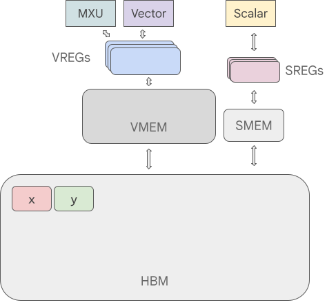
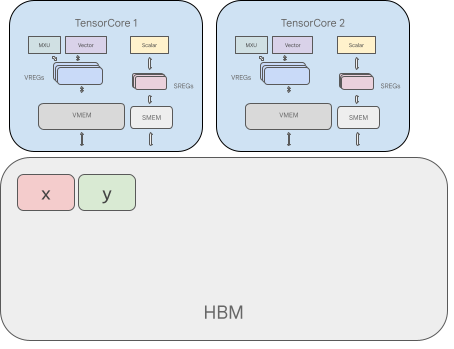
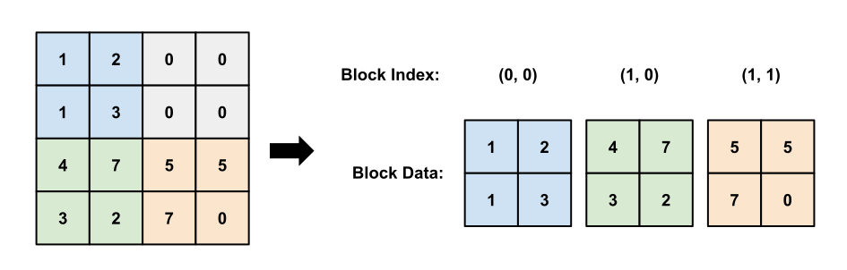
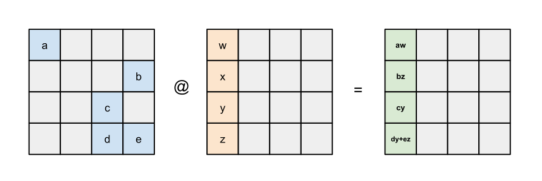
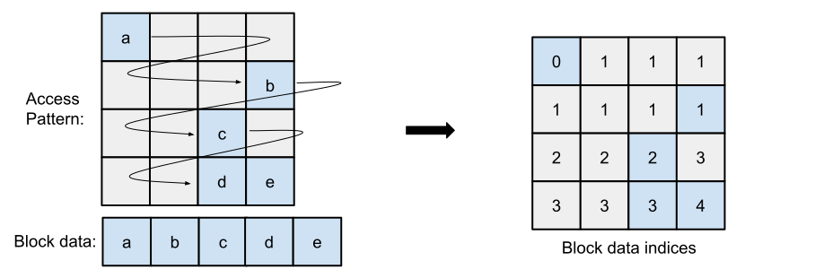
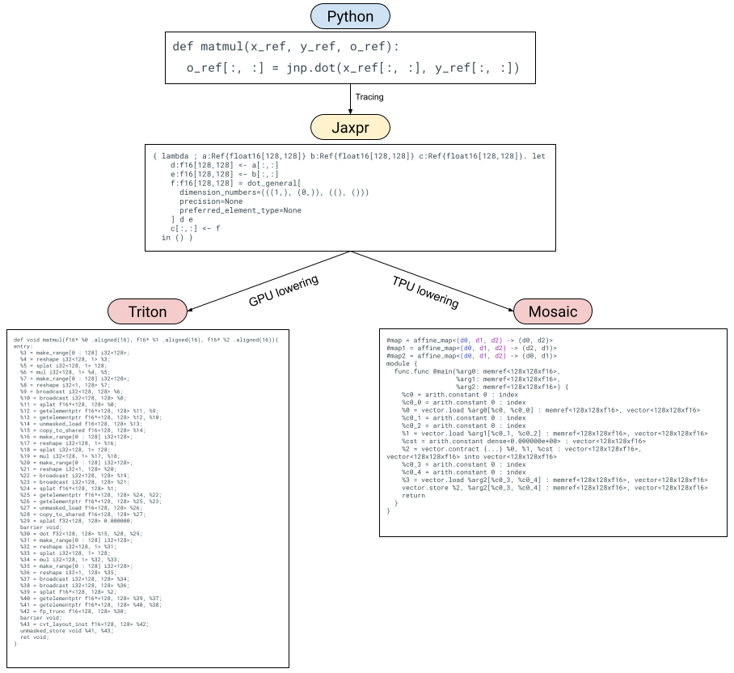

> 原文档：https://docs.jax.dev/en/latest/pallas/
>
> 本中文翻译覆盖 Pallas 文档的所有页面，保留完整代码和图片。

---


---

# Pallas 快速入门

## 目录

- [Pallas 中的 Hello World](#pallas-中的-hello-world)
- [Pallas 编程模型](#pallas-编程模型)
  - [Grid 示例](#grid-示例)
  - [Grid 语义](#grid-语义)
  - [BlockSpec 示例](#blockspec-示例)

---

Pallas 是 JAX 的一个扩展，能够为 GPU 和 TPU 编写自定义内核。Pallas 允许你使用相同的 JAX 函数和 API，但在 _更低_ 的抽象层级上操作。

具体来说，Pallas 要求用户考虑内存访问以及如何将计算划分到硬件加速器的多个计算单元上。在 GPU 上，Pallas 下降到 Mosaic GPU；在 TPU 上，Pallas 下降到 Mosaic。

让我们深入一些示例。

> **注意**：Pallas 仍然是一个实验性 API，你可能会因为变更而受到影响！

> **注意**：使用 Mosaic GPU 后端时，仅支持 Hopper 及更新的 GPU。

> **注意**：GPU 上还存在一个 Triton 后端，但它仅以尽力而为的方式维护，不推荐使用。Triton 后端支持 Ampere 及以上的 GPU。

## Pallas 中的 Hello World

```python
from functools import partial

import jax
from jax.experimental import pallas as pl
import jax.numpy as jnp
import numpy as np
```

我们将首先在 Pallas 中编写 "hello world"——一个将两个向量相加的内核。

```python
def add_vectors_kernel(x_ref, y_ref, o_ref):
  x, y = x_ref[...], y_ref[...]
  o_ref[...] = x + y
```

**`Ref` 类型**

让我们来剖析一下这个函数。与你可能编写过的大多数 JAX 函数不同，它不接受 `jax.Array` 作为输入，也不返回任何值。相反，它接受 _`Ref`_ 对象作为输入，这些对象代表内存中的可变缓冲区。注意我们也没有任何输出，但我们被给了一个 `o_ref`，它对应于期望的输出。

**从 `Ref` 读取**

在函数体中，我们首先从 `x_ref` 和 `y_ref` 中读取，通过 `[...]` 表示（省略号意味着我们正在读取整个 `Ref`；另外我们也可以使用 `x_ref[:]`）。以这种方式从 `Ref` 读取会返回一个 `jax.Array`。

**向 `Ref` 写入**

然后我们将 `x + y` 写入 `o_ref`。变异在 JAX 中历来不被支持——`jax.Array` 是不可变的！`Ref` 是新的（实验性）类型，允许在某些情况下进行变异。我们可以将写入 `Ref` 解释为修改其底层缓冲区。

**使用 `.at` 对 `Ref` 进行索引和切片**

除了通过引用访问整个底层缓冲区外，还可以使用 `.at` 属性仅访问一个切片。使用 `x_ref.at[slice]` 不会立即读取或写入数据；它创建一个指向原始缓冲区切片的新 `Ref` 对象。例如 `ref.at[0:128]` 创建前 128 个元素的视图；`ref.at[::2]` 创建一个步长视图。

一旦你有了一个表示切片的新 `Ref`，你可以用通常的语法读取或写入它。这是一个简单的示例：

```python
def add_sliced_kernel(x_ref, y_ref, o_ref):
  small_mid = x_ref.shape[0] // 2

  x_left = x_ref.at[:small_mid]
  x_right = x_ref.at[small_mid:]
  y_left = y_ref.at[:small_mid]
  y_right = y_ref.at[small_mid:]

  # 输出形状为 (4*small_mid)。
  large_mid = 2*small_mid
  o_ref.at[:large_mid][:small_mid] = x_left[...] + y_left[...]
  o_ref.at[:large_mid][small_mid:] = x_left[...] + y_right[...]
  o_ref.at[large_mid:][:small_mid] = x_right[...] + y_left[...]
  o_ref.at[large_mid:][small_mid:] = x_right[...] + y_right[...]
```

注意使用 `x_ref.at[slice][...]` 等同于 `x_ref[slice]`。`.at` 在你想组合多个切片（例如 `x_ref.at[block_slice][thread_slice]`）或者需要将切片传递给接受 `Ref` 的子内核函数时很有用。

所以我们写了一个我们称之为"内核"的东西，我们将其定义为在加速器上作为原子执行单元运行的程序，不与主机有任何交互。我们如何从 JAX 计算中调用它？我们使用 `pallas_call` 高阶函数。

```python
@jax.jit
def add_vectors(x: jax.Array, y: jax.Array) -> jax.Array:
  return pl.pallas_call(
      add_vectors_kernel,
      out_shape=jax.ShapeDtypeStruct(x.shape, x.dtype)
  )(x, y)
add_vectors(jnp.arange(8), jnp.arange(8))
```

```
Array([ 0,  2,  4,  6,  8, 10, 12, 14], dtype=int32)
```

`pallas_call` 将 Pallas 内核函数提升为一个可以作为更大 JAX 程序一部分调用的操作。但是，为此它需要一些额外的细节。这里我们指定了 `out_shape`，一个具有 `.shape` 和 `.dtype`（或其列表）的对象。`out_shape` 决定了我们的 `add_vector_kernel` 中 `o_ref` 的形状/数据类型。

`pallas_call` 返回一个接受并返回 `jax.Array` 的函数。

**这里到底发生了什么？**

到目前为止，我们已经描述了如何思考 Pallas 内核，但我们实际上完成的是我们正在编写一个非常接近计算单元执行的函数，因为值被加载到内存层次结构的最内层（最快的）部分。

在 GPU 上，`x_ref` 对应于高带宽内存（HBM）中的值，当我们执行 `x_ref[...]` 时，我们正在将值从 HBM 复制到静态 RAM（SRAM）中（一般来说这是一个代价高昂的操作！）。然后我们使用 GPU 向量计算执行加法，然后将 SRAM 中的结果值复制回 HBM。

在 TPU 上，我们做的事情略有不同。在内核执行之前，我们将值从 HBM 取到 SRAM。因此 `x_ref` 对应于 SRAM 中的值，当我们执行 `x_ref[...]` 时，我们正在将值从 SRAM 复制到寄存器中。然后我们使用 TPU 向量计算执行加法，然后将结果值复制回 SRAM。内核执行完成后，SRAM 值被复制回 HBM。

我们正在编写针对特定后端的 Pallas 指南。敬请期待！

## Pallas 编程模型

在我们的 "hello world" 示例中，我们编写了一个非常简单的内核。它利用了我们的 8 大小的数组可以轻松放入硬件加速器 SRAM 中的事实。在大多数现实世界的应用中，情况不会如此！

编写 Pallas 内核的一部分工作是思考如何获取驻留在高带宽内存（HBM，也称为 DRAM）中的大数组，并表达对这些数组中能放入 SRAM 的"块"进行操作的计算。

### Grid 示例

要自动"切分"输入和输出，你需要向 `pallas_call` 提供 `grid` 和 `BlockSpec`。

`grid` 是一个整数元组（例如 `()`、`(2, 3, 4)` 或 `(8,)`），指定一个迭代空间。例如，grid `(4, 5)` 将有 20 个元素：`(0, 0), (0, 1), ..., (0, 4), (1, 0), ..., (3, 4)`。我们为每个元素运行一次内核函数，这是一种单程序多数据（SPMD）编程风格。


一个 2D grid

当我们向 `pallas_call` 提供 `grid` 时，内核被执行 `prod(grid)` 次。每次调用被称为一个"程序"。要访问内核当前正在执行的是哪个程序（即 grid 的哪个元素），我们使用 `program_id(axis=...)`。例如，对于调用 `(1, 2)`，`program_id(axis=0)` 返回 `1`，`program_id(axis=1)` 返回 `2`。

这是一个使用 `grid` 和 `program_id` 的示例内核。

```python
def iota_kernel(o_ref):
  i = pl.program_id(0)
  o_ref[i] = i
```

我们现在使用带有额外 `grid` 参数的 `pallas_call` 来执行它。在 GPU 上，我们可以直接这样调用内核：

```python
# GPU 版本
def iota(size: int):
  return pl.pallas_call(iota_kernel,
                        out_shape=jax.ShapeDtypeStruct((size,), jnp.int32),
                        grid=(size,))()
iota(8)
```

```
Array([0, 1, 2, 3, 4, 5, 6, 7], dtype=int32)
```

TPU 区分向量和标量内存空间，在这种情况下，输出必须放置在标量内存（`MemorySpace.SMEM`）中，因为 `i` 是一个标量。更多详情请阅读 [TPU 及其内存空间](pallas_tpu_pipelining_cn.md#tpu-及其内存空间)。要在 TPU 上调用上述内核，运行：

```python
# TPU 版本
from jax.experimental.pallas import tpu as pltpu

def iota(size: int):
  return pl.pallas_call(iota_kernel,
                        out_specs=pl.BlockSpec(memory_space=pltpu.SMEM),
                        out_shape=jax.ShapeDtypeStruct((size,), jnp.int32),
                        grid=(size,))()
iota(8)
```

### Grid 语义

在 GPU 上，每个程序在独立的线程上并行执行。因此，我们需要考虑对 HBM 写入的竞争条件。一个合理的方法是编写内核，使不同程序写入 HBM 中的不相交位置，以避免这些并行写入。另一方面，并行化计算是我们能够快速执行矩阵乘法等操作的方式。

相比之下，TPU 的运行方式类似于非常宽的 SIMD 机器。某些 TPU 型号包含多个核心，但在许多情况下，TPU 可以被视为单线程处理器。TPU 上的 grid 可以指定为并行和顺序维度的组合，其中顺序维度保证串行运行。

你可以在 [grid，又称循环中的内核](pallas_grid_blockspec_cn.md#grid又称循环中的内核) 和 [值得注意的属性和限制](pallas_tpu_details_cn.md#值得注意的属性和限制) 中阅读更多详情。

### BlockSpec 示例

有了 `grid` 和 `program_id` 的概念，Pallas 提供了一个抽象，处理许多内核中常见的索引模式。为了建立直觉，让我们尝试实现一个矩阵乘法。

在 Pallas 中实现矩阵乘法的一个简单策略是递归实现。我们知道底层硬件支持小型矩阵乘法（使用 GPU 和 TPU 张量核心），所以我们只需用较小的矩阵乘法来表达大的矩阵乘法。

假设我们有输入矩阵 $X$ 和 $Y$，正在计算 $Z = XY$。我们首先将 $X$ 和 $Y$ 表示为分块矩阵。$X$ 将有"行"块，$Y$ 将有"列"块。

$$
X = \begin{bmatrix} X_0 \\ X_1 \end{bmatrix}
$$

$$
Y = \begin{bmatrix} Y_0 & Y_1 \end{bmatrix}
$$

$$
Z = \begin{bmatrix} X_0 \\ X_1 \end{bmatrix} \begin{bmatrix} Y_0 & Y_1 \end{bmatrix} = \begin{bmatrix} X_0 Y_0 & X_0 Y_1 \\ X_1 Y_0 & X_1 Y_1 \end{bmatrix}
$$

我们的策略是，因为 $Z$ 也是一个分块矩阵，我们可以将 Pallas 内核中的每个程序分配给一个输出块。计算每个输出块对应于在 $X$ 的一个"行"块和 $Y$ 的一个"列"块之间进行较小的矩阵乘法。

为了表达这个模式，我们使用 `BlockSpec`。`BlockSpec` 为每个输入和输出指定块形状，以及一个"索引映射"函数，将一组程序索引映射到块索引。


`BlockSpec` 的可视化

作为一个具体的例子，假设我们想将两个 `(1024, 1024)` 矩阵 `x` 和 `y` 相乘得到 `z`，并希望将计算并行化为 4 路。我们将 `z` 分成 4 个 `(512, 512)` 块，每个块通过 `(512, 1024) x (1024, 512)` 矩阵乘法计算。为了表达这一点，我们首先使用 `(2, 2)` grid（每个程序一个块）。

对于 `x`，我们使用 `BlockSpec((512, 1024), lambda i, j: (i, 0))`——这将 `x` 切分成"行"块。要理解这一点，看看程序实例 `(1, 0)` 和 `(1, 1)` 如何都选择 `x` 中的 `(1, 0)` 块。对于 `y`，我们使用转置版本 `BlockSpec((1024, 512), lambda i, j: (0, j))`。最后，对于 `z`，我们使用 `BlockSpec((512, 512), lambda i, j: (i, j))`。

这些 `BlockSpec` 通过 `in_specs` 和 `out_specs` 传递给 `pallas_call`。

有关 `BlockSpec` 的更多详情，请参见 [BlockSpec，又称如何切分输入](pallas_grid_blockspec_cn.md#blockspec又称如何切分输入)。

在底层，`pallas_call` 会自动将你的输入和输出切分成每个块的 `Ref`，然后传递给内核。

```python
def matmul_kernel(x_ref, y_ref, z_ref):
  z_ref[...] = x_ref[...] @ y_ref[...]

def matmul(x: jax.Array, y: jax.Array):
  return pl.pallas_call(
    matmul_kernel,
    out_shape=jax.ShapeDtypeStruct((x.shape[0], y.shape[1]), x.dtype),
    grid=(2, 2),
    in_specs=[
        pl.BlockSpec((x.shape[0] // 2, x.shape[1]), lambda i, j: (i, 0)),
        pl.BlockSpec((y.shape[0], y.shape[1] // 2), lambda i, j: (0, j))
    ],
    out_specs=pl.BlockSpec(
        (x.shape[0] // 2, y.shape[1] // 2), lambda i, j: (i, j),
    )
  )(x, y)
k1, k2 = jax.random.split(jax.random.key(0))
x = jax.random.normal(k1, (1024, 1024))
y = jax.random.normal(k2, (1024, 1024))
z = matmul(x, y)
np.testing.assert_allclose(z, x @ y)
```

注意这是一个非常朴素的矩阵乘法实现，但可以将其视为各种优化的起点。让我们为矩阵乘法添加一个额外功能：融合激活。这实际上非常简单！只需将一个高阶激活函数传入内核。

```python
def matmul_kernel(x_ref, y_ref, z_ref, *, activation):
  z_ref[...] = activation(x_ref[...] @ y_ref[...])

def matmul(x: jax.Array, y: jax.Array, *, activation):
  return pl.pallas_call(
    partial(matmul_kernel, activation=activation),
    out_shape=jax.ShapeDtypeStruct((x.shape[0], y.shape[1]), x.dtype),
    grid=(2, 2),
    in_specs=[
        pl.BlockSpec((x.shape[0] // 2, x.shape[1]), lambda i, j: (i, 0)),
        pl.BlockSpec((y.shape[0], y.shape[1] // 2), lambda i, j: (0, j))
    ],
    out_specs=pl.BlockSpec(
        (x.shape[0] // 2, y.shape[1] // 2), lambda i, j: (i, j)
    ),
  )(x, y)
k1, k2 = jax.random.split(jax.random.key(0))
x = jax.random.normal(k1, (1024, 1024))
y = jax.random.normal(k2, (1024, 1024))
z = matmul(x, y, activation=jax.nn.relu)
np.testing.assert_allclose(z, jax.nn.relu(x @ y))
```

最后，让我们强调 Pallas 的一个很酷的特性：它可以与 `jax.vmap` 组合！要将这个矩阵乘法变成批量版本，我们只需要 `vmap` 它。

```python
k1, k2 = jax.random.split(jax.random.key(0))
x = jax.random.normal(k1, (4, 1024, 1024))
y = jax.random.normal(k2, (4, 1024, 1024))
z = jax.vmap(partial(matmul, activation=jax.nn.relu))(x, y)
np.testing.assert_allclose(z, jax.nn.relu(jax.vmap(jnp.matmul)(x, y)))
```


---

# Grid 和 BlockSpec

## `grid`，又称循环中的内核

使用 [`jax.experimental.pallas.pallas_call()`](https://docs.jax.dev/en/latest/_autosummary/jax.experimental.pallas.pallas_call.html) 时，内核函数会在不同的输入上被执行多次，具体由 `pallas_call` 的 `grid` 参数指定。概念上：

```python
pl.pallas_call(some_kernel, grid=(n,))(...)
```

映射为

```python
for i in range(n):
  some_kernel(...)
```

Grid 可以推广为多维的，对应于嵌套循环。例如，

```python
pl.pallas_call(some_kernel, grid=(n, m))(...)
```

等价于

```python
for i in range(n):
  for j in range(m):
    some_kernel(...)
```

这可以推广到任意整数元组（长度为 `d` 的 grid 将对应 `d` 层嵌套循环）。内核被执行的次数为 `prod(grid)` 次。默认的 grid 值 `()` 导致内核被调用一次。每次调用被称为一个"程序"。要访问内核当前正在执行的是哪个程序（即 grid 中的哪个元素），我们使用 [`jax.experimental.pallas.program_id()`](https://docs.jax.dev/en/latest/_autosummary/jax.experimental.pallas.program_id.html)。例如，对于调用 `(1, 2)`，`program_id(axis=0)` 返回 `1`，`program_id(axis=1)` 返回 `2`。你也可以使用 [`jax.experimental.pallas.num_programs()`](https://docs.jax.dev/en/latest/_autosummary/jax.experimental.pallas.num_programs.html) 来获取给定轴的 grid 大小。

参见 [Grid 示例](https://docs.jax.dev/en/latest/pallas/quickstart.html#grids-by-example) 了解使用此 API 的简单内核。

## `BlockSpec`，又称如何切分输入

配合 `grid` 参数，我们需要向 Pallas 提供如何为每次调用切分输入的信息。具体来说，我们需要提供从 _循环迭代_ 到 _要操作的输入和输出的哪个块_ 的映射。这通过 [`jax.experimental.pallas.BlockSpec`](https://docs.jax.dev/en/latest/_autosummary/jax.experimental.pallas.BlockSpec.html) 对象来提供。

在深入 `BlockSpec` 的细节之前，你可能想重新访问 Pallas 快速入门中的 [BlockSpec 示例](https://docs.jax.dev/en/latest/pallas/quickstart.html#pallas-block-specs-by-example)。

`BlockSpec` 通过 `in_specs` 和 `out_specs` 提供给 `pallas_call`，分别对应每个输入和每个输出各一个。

首先，我们讨论当 `indexing_mode == pl.Blocked()` 时 `BlockSpec` 的语义。

非正式地说，`BlockSpec` 的 `index_map` 接受调用索引作为参数（数量与 `grid` 元组的长度相同），并返回**块索引**（每个整体数组的轴对应一个块索引）。然后每个块索引乘以 `block_shape` 中对应的轴大小，得到对应数组轴上的实际元素索引。

> **注意**
>
> 并非所有块形状都受支持。
>
> - 在 TPU 上，仅支持秩至少为 1 的块。此外，块形状的最后两个维度必须等于整体数组的对应维度，或者分别能被 8 和 128 整除。对于秩为 1 的块，块维度必须等于数组维度，或者是 1024 的倍数，或者是 2 的幂且至少为 `128 * (32 / bitwidth(dtype))`。
>
> - 在 GPU 上，使用 Mosaic GPU 后端时，块的大小不受限制。然而，由于硬件限制，最次要数组维度的大小必须是 16 字节的倍数。例如，如果输入是 `jnp.float16`，则必须是 8 的倍数。
>
> - 在 GPU 上，使用 Triton 后端时，块本身的大小不受限制，但每个操作（包括加载或存储）必须操作大小为 2 的幂的数组。

如果块形状不能整除整体形状，则每个轴上最后一次迭代仍然会接收到 `block_shape` 大小的块引用，但越界的元素在输入时被填充，在输出时被丢弃。填充值是未指定的，你应该假设它们是垃圾值。在 `interpret=True` 模式下，我们对浮点值用 NaN 填充，以便用户有机会发现越界元素的访问，但不应依赖此行为。注意每个块中至少一个元素必须在界内。

更精确地说，对于形状为 `x_shape` 的输入 `x`，每个轴的切片按以下 `slice_for_invocation` 函数计算：

```python
>>> import jax
>>> from jax.experimental import pallas as pl
>>> def slices_for_invocation(x_shape: tuple[int, ...],
...                           x_spec: pl.BlockSpec,
...                           grid: tuple[int, ...],
...                           invocation_indices: tuple[int, ...]) -> tuple[slice, ...]:
...   assert len(invocation_indices) == len(grid)
...   assert all(0 <= i < grid_size for i, grid_size in zip(invocation_indices, grid))
...   block_indices = x_spec.index_map(*invocation_indices)
...   assert len(x_shape) == len(x_spec.block_shape) == len(block_indices)
...   elem_indices = []
...   for x_size, block_size, block_idx in zip(x_shape, x_spec.block_shape, block_indices):
...     start_idx = block_idx * block_size
...     # 块中至少一个元素必须在界内
...     assert start_idx < x_size
...     elem_indices.append(slice(start_idx, start_idx + block_size))
...   return elem_indices
```

例如：

```python
>>> slices_for_invocation(x_shape=(100, 100),
...                       x_spec = pl.BlockSpec((10, 20), lambda i, j: (i, j)),
...                       grid = (10, 5),
...                       invocation_indices = (2, 4))
[slice(20, 30, None), slice(80, 100, None)]

>>> # 相同形状的数组和块，但我们对每个块迭代 4 次
>>> slices_for_invocation(x_shape=(100, 100),
...                       x_spec = pl.BlockSpec((10, 20), lambda i, j, k: (i, j)),
...                       grid = (10, 5, 4),
...                       invocation_indices = (2, 4, 0))
[slice(20, 30, None), slice(80, 100, None)]

>>> # 块在第 2 轴上部分越界的示例。
>>> slices_for_invocation(x_shape=(100, 90),
...                       x_spec = pl.BlockSpec((10, 20), lambda i, j: (i, j)),
...                       grid = (10, 5),
...                       invocation_indices = (2, 4))
[slice(20, 30, None), slice(80, 100, None)]
```

下面定义的函数 `show_program_ids` 使用 Pallas 来显示调用索引。`iota_2D_kernel` 会用一个十进制数填充每个输出块，其中第一位数字代表第一个轴上的调用索引，第二位代表第二个轴上的调用索引：

```python
>>> def show_program_ids(x_shape, block_shape, grid,
...                      index_map=lambda i, j: (i, j)):
...   def program_ids_kernel(o_ref):  # 用 10*program_id(1) + program_id(0) 填充输出块
...     axes = 0
...     for axis in range(len(grid)):
...       axes += pl.program_id(axis) * 10**(len(grid) - 1 - axis)
...     o_ref[...] = jnp.full(o_ref.shape, axes)
...   res = pl.pallas_call(program_ids_kernel,
...                        out_shape=jax.ShapeDtypeStruct(x_shape, dtype=np.int32),
...                        grid=grid,
...                        in_specs=[],
...                        out_specs=pl.BlockSpec(block_shape, index_map),
...                        interpret=True)()
...   print(res)
```

例如：

```python
>>> show_program_ids(x_shape=(8, 6), block_shape=(2, 3), grid=(4, 2),
...                  index_map=lambda i, j: (i, j))
[[ 0  0  0  1  1  1]
 [ 0  0  0  1  1  1]
 [10 10 10 11 11 11]
 [10 10 10 11 11 11]
 [20 20 20 21 21 21]
 [20 20 20 21 21 21]
 [30 30 30 31 31 31]
 [30 30 30 31 31 31]]

>>> # 越界访问的示例
>>> show_program_ids(x_shape=(7, 5), block_shape=(2, 3), grid=(4, 2),
...                  index_map=lambda i, j: (i, j))
[[ 0  0  0  1  1]
 [ 0  0  0  1  1]
 [10 10 10 11 11]
 [10 10 10 11 11]
 [20 20 20 21 21]
 [20 20 20 21 21]
 [30 30 30 31 31]]

>>> # 形状允许小于 block_shape
>>> show_program_ids(x_shape=(1, 2), block_shape=(2, 3), grid=(1, 1),
...                  index_map=lambda i, j: (i, j))
[[0 0]]
```

当多次调用写入输出数组的相同元素时，结果取决于平台。

在下面的示例中，我们有一个 3D grid，其中最后一个 grid 维度不参与块选择（`index_map=lambda i, j, k: (i, j)`）。因此，我们对同一个输出块迭代 10 次。下面显示的输出是在 CPU 上使用 `interpret=True` 模式生成的，该模式目前按顺序执行调用。在 TPU 上，程序以并行和顺序的组合方式执行，此函数会生成所示的输出。参见 [值得注意的属性和限制](https://docs.jax.dev/en/latest/pallas/tpu/details.html#pallas-tpu-noteworthy-properties)。

```python
>>> show_program_ids(x_shape=(8, 6), block_shape=(2, 3), grid=(4, 2, 10),
...                  index_map=lambda i, j, k: (i, j))
[[  9   9   9  19  19  19]
 [  9   9   9  19  19  19]
 [109 109 109 119 119 119]
 [109 109 109 119 119 119]
 [209 209 209 219 219 219]
 [209 209 209 219 219 219]
 [309 309 309 319 319 319]
 [309 309 309 319 319 319]]
```

`block_shape` 中出现的 `None` 值作为维度值时行为类似于值 `1`，但对应的块轴会被压缩（你也可以传入 `pl.Squeezed()` 代替 `None`）。在下面的示例中，观察到当块形状被指定为 `(None, 2)` 时，`o_ref` 的形状是 `(2,)`（前导维度被压缩了）。

```python
>>> def kernel(o_ref):
...   assert o_ref.shape == (2,)
...   o_ref[...] = jnp.full((2,), 10 * pl.program_id(1) + pl.program_id(0))
>>> pl.pallas_call(kernel,
...                jax.ShapeDtypeStruct((3, 4), dtype=np.int32),
...                out_specs=pl.BlockSpec((None, 2), lambda i, j: (i, j)),
...                grid=(3, 2), interpret=True)()
Array([[ 0,  0, 10, 10],
       [ 1,  1, 11, 11],
       [ 2,  2, 12, 12]], dtype=int32)
```

当我们构造 `BlockSpec` 时，可以对 `block_shape` 参数使用值 `None`，此时整体数组的形状被用作 `block_shape`。如果对 `index_map` 参数使用值 `None`，则使用一个返回零元组的默认索引映射函数：`index_map=lambda *invocation_indices: (0,) * len(block_shape)`。

```python
>>> show_program_ids(x_shape=(4, 4), block_shape=None, grid=(2, 3),
...                  index_map=None)
[[12 12 12 12]
 [12 12 12 12]
 [12 12 12 12]
 [12 12 12 12]]

>>> show_program_ids(x_shape=(4, 4), block_shape=(4, 4), grid=(2, 3),
...                  index_map=None)
[[12 12 12 12]
 [12 12 12 12]
 [12 12 12 12]
 [12 12 12 12]]
```

### "元素"索引模式

上面记录的行为适用于默认的"分块"索引模式。当 `block_shape` 元组中使用整数时，例如 `(4, 8)`，它等价于传入 `pl.Blocked(block_size)` 对象，例如 `(pl.Blocked(4), pl.Blocked(8))`。分块索引模式意味着 `index_map` 返回的索引是 _块索引_。我们可以传入 `pl.Blocked` 以外的对象来改变 `index_map` 的语义，最值得注意的是 `pl.Element(block_size)`。当使用 `pl.Element` 索引模式时，索引映射函数返回的值直接用作数组索引，而不会先按块大小进行缩放。使用 `pl.Element` 模式时，你可以指定数组的虚拟填充为该维度的低-高填充元组：行为就像整体数组在输入时被填充了一样。在元素模式下不保证填充值，类似于当块形状不能整除整体数组形状时分块索引模式的填充值。

`Element` 模式目前仅在 TPU 上受支持。

```python
>>> # 不带填充的元素模式
>>> show_program_ids(x_shape=(8, 6), block_shape=(pl.Element(2), pl.Element(3)),
...                  grid=(4, 2),
...                  index_map=lambda i, j: (2*i, 3*j))
[[ 0  0  0  1  1  1]
 [ 0  0  0  1  1  1]
 [10 10 10 11 11 11]
 [10 10 10 11 11 11]
 [20 20 20 21 21 21]
 [20 20 20 21 21 21]
 [30 30 30 31 31 31]
 [30 30 30 31 31 31]]

>>> # 元素模式，首先用 1 行和 2 列填充数组。
>>> show_program_ids(x_shape=(7, 7),
...                  block_shape=(pl.Element(2, (1, 0)),
...                               pl.Element(3, (2, 0))),
...                  grid=(4, 3),
...                  index_map=lambda i, j: (2*i, 3*j))
[[ 0  1  1  1  2  2  2]
 [10 11 11 11 12 12 12]
 [10 11 11 11 12 12 12]
 [20 21 21 21 22 22 22]
 [20 21 21 21 22 22 22]
 [30 31 31 31 32 32 32]
 [30 31 31 31 32 32 32]]
```


---

# 软件流水线

软件流水线是性能优化中的一项重要技术，它通过重叠多个异步操作来提升性能，即使这些操作之间存在数据依赖关系也是如此。在编写内核的上下文中，最常见的流水线形式涉及将通信和内存传输与计算重叠，使得硬件加速器在等待数据到达时永远不会停顿。因此，在本教程中我们将专注于通信-计算流水线问题。我们将首先从概念层面介绍该问题，然后概述用于编写流水线的 Pallas API，最后使用该 API 给出一些实际示例。

本教程仅涵盖流水线的概念基础。有关特定平台的参考，请参见 [TPU 流水线](https://docs.jax.dev/en/latest/pallas/tpu/pipelining.html) 或 [Mosaic GPU 流水线](https://docs.jax.dev/en/latest/pallas/gpu/pipelining.html)。

```python
import jax
from jax import numpy as jnp
from jax.experimental import pallas as pl
import numpy as np
```

## 内存层次结构

理解流水线概念的第一步是理解可用的不同形式的内存及其之间的权衡。大多数硬件架构（包括 CPU、GPU 和 TPU）利用多种不同的内存空间，在容量与延迟/带宽之间进行权衡。就 Pallas 而言，我们通常关注寄存器、SRAM、DRAM 以及可能的网络通信：

- **寄存器**是物理上最靠近处理器的内存，通常值必须在进行任何计算之前直接加载到寄存器中。

- **SRAM**（在 GPU 上也称为共享内存/L1 和 L2 缓存，在 TPU 上称为 VMEM）也位于处理器附近，但容量比寄存器更大。现代 ML 加速器上的 SRAM 通常在 10-100MB 范围内（TPU v5p 包含 96MB 的 VMEM，H100 GPU 包含约 30MB 的 L1 缓存和 50MB 的 L2）。可以合理预期访问 SRAM 的延迟大约是访问寄存器的 10 倍。

- **DRAM**（也称为 HBM）的容量远大于 SRAM，现代 ML 加速器通常在 10-100GB 范围内。然而，与 SRAM 相比，访问延迟大约长 10 倍。

- **网络通信**在更大的工作负载中变得至关重要，当单个设备上的 DRAM 大小不足时，或者当我们希望利用并行计算时。本教程不涉及分布式流水线，但请参见 [分布式 TPU 内核指南](https://docs.jax.dev/en/latest/pallas/tpu/distributed.html) 以了解跨多个设备编写流水线的内容。


为了对存储在 HBM 中的值 X 和 Y 执行计算，我们需要：

- 将值 x 和 y 复制到 SRAM 中。
- 从 SRAM 将值加载到寄存器中。
- 执行计算并将结果存储到寄存器中。
- 将输出寄存器中的值存储到 SRAM 中。
- 将 SRAM 中的输出值复制回 HBM。

让我们实现一个能做到这一点的 Pallas 函数！

```python
# 注意：这是一个 TPU 示例。

def add_matrices_kernel(x_sram_ref, y_sram_ref, z_sram_ref):
  # 从 SRAM 将 x 和 y 加载到寄存器中
  x_regs = x_sram_ref[:, :]
  y_regs = y_sram_ref[:, :]
  # 执行向量化加法
  z_regs = x_regs + y_regs
  # 将寄存器中的输出值存储回 SRAM
  z_sram_ref[:, :] = z_regs

def add_matrices(x: jax.Array, y: jax.Array) -> jax.Array:
  # pallas_call 将首先为 `x` 和 `y` 在 SRAM 中分配临时缓冲区。
  # 然后它将 `x` 和 `y` 从 HBM 复制到 SRAM。
  z = pl.pallas_call(
      add_matrices_kernel, out_shape=jax.ShapeDtypeStruct(x.shape, x.dtype)
  )(x, y)
  # pallas_call 也会将输出从 SRAM 复制回 HBM。
  return z

x, y = jnp.ones((512, 512)), jnp.ones((512, 512))
add_matrices(x, y)
```

```
Array([[2., 2., 2., ..., 2., 2., 2.],
       [2., 2., 2., ..., 2., 2., 2.],
       [2., 2., 2., ..., 2., 2., 2.],
       ...,
       [2., 2., 2., ..., 2., 2., 2.],
       [2., 2., 2., ..., 2., 2., 2.],
       [2., 2., 2., ..., 2., 2., 2.]], dtype=float32)
```

我们编写了两个函数：`add_matrices_kernel` 和 `add_matrices`。

`add_matrices_kernel` 使用存储在 SRAM 中的 `Ref` 进行操作。从 SRAM Ref 加载会产生一个存储在寄存器中的值。寄存器中的值的行为类似于 jax.Array，我们可以对它们使用 `jnp` 和 `jax.lax` 操作来产生新的存储在寄存器中的值。当我们产生了想要返回的值时，我们将它们存储在输出 SRAM `Ref` 中。

`add_matrices` 函数作用于 `jax.Array` 并返回一个 `jax.Array`。在其内部，我们将 `x` 和 `y` 传递给 pallas_call。`pallas_call` 负责将 `x` 和 `y` 复制到 SRAM 中，并分配内核操作所需的 SRAM 缓冲区（包括分配 `z_vmem_ref`，即输出 SRAM 缓冲区）。内核函数运行完成后，`pallas_call` 也会将 `z_vmem_ref` 中的值复制到 HBM，产生一个输出 `jax.Array`。

Pallas 暴露了对像 SRAM 这样的低级内存空间的访问，但编写高性能内核需要更加谨慎地利用各种内存空间。例如，我们需要考虑：

- **内存容量**。SRAM 很小！如果我们的数组太大，上面的内核将无法工作，因为我们无法将输入放入 SRAM。作为参考，一个 `f32[2048, 2048]` 数组是 16MiB，所以我们上面的内核无法扩展到中等大小以上的数组。

- **内存带宽**。在 HBM 和 SRAM 之间复制需要很长时间，至少与大多数计算指令相比是这样。上面的 `add_matrices` 函数可能花在 HBM 和 SRAM 之间复制的时间比实际执行加法本身的时间更多。

考虑到这两个约束，我们必须重新思考从加速器中获取性能的策略。

## 流水线基础

我们如何利用层次结构中每种类型内存的优势，既能对存储在 HBM 中的大型数组进行操作，又能利用快速 SRAM 进行计算？流水线是一种非常通用的编程模式，它恰好能让我们做到这一点，但它需要将问题转换为可以并行重叠的更小的子问题。

流水线的第一步是将问题划分为可以放入 SRAM 的更小的子问题。例如，一个逐元素操作可以通过每次对源数组的一个切片进行操作来简单地进行转换，这导致以下 3 个步骤（也称为阶段）：

- **copy_in**：将切片 `A[i]` 从 HBM 复制到 SRAM `X`。
- **compute**：将 `X` 加载到寄存器中，计算结果，并存储在 SRAM `Y` 中。
- **copy_out**：将结果 `Y` 复制回 HBM `A[i]`。

请注意步骤 1-3 之间存在数据依赖，我们无法简单地将它们重叠，因为我们需要步骤 (1) 完成后才能开始步骤 (2)，依此类推。然而，子问题的多次调用之间不存在数据依赖——也就是说，我们可以在执行块 `A[i]` 的步骤 (2) 的同时执行块 `A[i+1]` 的步骤 (1)，以及块 `A[i-1]` 的步骤 (3)。


上图描绘了一个理想化的流水线程序如何在时间上被调度。关键洞察是，在内核的大部分时间里，复制操作与计算操作是并行执行的，这意味着我们理想情况下可以用计算来"隐藏" HBM/SRAM 之间传输的开销，并使处理器尽可能多地保持忙碌。

初始启动时间和最终收尾时间被称为"气泡"，在此期间只有部分阶段在执行，因为流水线正在被"填充"或"排空"。大部分时间花在流水线的"稳态"阶段，在该阶段中每个流水线阶段在子问题的不同迭代中并行执行。虽然在更通用的流水线方法中目标是实现 N 路并行（其中 N 是阶段数量），但在内核流水线中我们通常受到内存带宽或处理速度的瓶颈限制。因此，我们内核流水线的目标通常是实现处理器 FLOPs/s 的完全利用，这意味着在任何时间点总是有一个 `compute` 块处于活跃状态。在上图中，compute 块在 8 个时间槽中有 6 个是活跃的，假设我们在每个计算时间槽中完全利用了处理器，我们将实现 75% 的处理器利用率。

### 推导双缓冲流水线

现在让我们看看如何用伪代码实现流水线。考虑以下逐元素程序，其中我们使用 `copy_in` 指令从 HBM 加载值（`A[i]`），将结果加 1，然后使用 `copy_out` 将结果存储回 HBM：

```
for i in range(N):
  copy_in(A[i], X)
  Y = X + 1
  copy_out(Y, A[i])
```

这种方法的问题在于 `copy_in` 和 `copy_out` 通常是阻塞操作。因此我们被迫在 GPU/TPU 空闲时等待复制完成，然后在内存空闲时执行计算。我们想要做的是在执行当前循环的计算时，异步地"预取"下一次迭代所需的输入值，使得计算和内存通信同时发生。

为了对我们将要进行的代码变换进行推理，让我们展开 N=4 的循环，并将复制指令分解为单独的 `copy_start` 和 `copy_wait` 操作以表达异步性：

```
  # 迭代 1
  copy_in_start(A[0], X)
  copy_in_wait(X)
  Y = X + 1
  copy_out_start(Y, A[0])
  copy_out_wait(Y)

  # 迭代 2
  copy_in_start(A[1], X)
  copy_in_wait(X)
  Y = X + 1
  copy_out_start(Y, A[1])
  copy_out_wait(Y)

  # 迭代 3
  copy_in_start(A[2], X)
  copy_in_wait(X)
  Y = X + 1
  copy_out_start(Y, A[2])
  copy_out_wait(Y)

  # 迭代 4
  copy_in_start(A[3], X)
  copy_in_wait(X)
  Y = X + 1
  copy_out_start(Y, A[3])
  copy_out_wait(Y)
```

一旦循环被展开，流水线变换就是尽可能早地发出 `copy_start` 指令，并尽可能晚地发出 `copy_wait`（就在我们需要该值之前）。然而，在循环的当前状态中，通过 X 存在一个伪数据依赖——我们不能在对 X 进行异步复制的同时使用它进行计算，否则可能会出现竞争条件。因此，我们可以使用多重缓冲技术，为每个输入 X 和每个输出 Y 保留 2 个缓冲区。有了 2 个缓冲区，我们可以将 `copy_in_start` 提前一个迭代（有 3 个缓冲区则可以提前 2 个迭代，依此类推），并将循环重写如下：

```
  # 前序
  copy_in_start(A[0], X[0])
  
  # 迭代 1
  copy_in_start(A[1], X[1])
  copy_in_wait(X[0])
  Y[0] = X[0] + 1
  copy_out_start(Y[0], A[0])
  copy_out_wait(Y[0])

  # 迭代 2 - 稳态
  copy_in_start(A[2], X[0])
  copy_in_wait(X[1])
  Y[1] = X[1] + 1
  copy_out_start(Y[1], A[1])
  copy_out_wait(Y[1])

  # 迭代 3 - 稳态
  copy_in_start(A[3], X[1])
  copy_in_wait(X[0])
  Y[0] = X[0] + 1
  copy_out_start(Y[0], A[2])
  copy_out_wait(Y[0])

  # 迭代 4 - 无 copy-in
  copy_in_wait(X[1])
  Y[1] = X[1] + 1
  copy_out_start(Y[1], A[3])
  copy_out_wait(Y[1])
```

接下来，我们可以将 `copy_out_wait` 尽可能地推迟，就在我们需要在后续循环迭代中写入 Y 之前。

```
  # 前序
  copy_in_start(A[0], X[0])
  
  # 迭代 1
  copy_in_start(A[1], X[1])
  copy_in_wait(X[0])
  Y[0] = X[0] + 1
  copy_out_start(Y[0], A[0])

  # 迭代 2 - 稳态
  copy_in_start(A[2], X[0])
  copy_in_wait(X[1])
  Y[1] = X[1] + 1
  copy_out_start(Y[1], A[1])
  copy_out_wait(Y[0])

  # 迭代 3 - 稳态
  copy_in_start(A[3], X[1])
  copy_in_wait(X[0])
  Y[0] = X[0] + 1
  copy_out_start(Y[0], A[2])
  copy_out_wait(Y[1])

  # 迭代 4 - 无 copy-in
  copy_in_wait(X[1])
  Y[1] = X[1] + 1
  copy_out_start(Y[1], A[3])
  copy_out_wait(Y[0])

  # 后序
  copy_out_wait(Y[1])
```

最后，将我们的循环重新卷回 for 循环，我们得到以下流水线化的循环：

```python
# 前序
copy_in_start(A[0], X[0])

# 主循环
for i in range(N):
  cur_slot = i % 2
  next_slot = (i + 1) % 2

  if i+1 < N:
    copy_in_start(A[i+1], X[next_slot])
  
  copy_in_wait(X[cur_slot])
  Y[cur_slot] = X[cur_slot] + 1
  copy_out_start(Y[cur_slot], A[i])

  if i > 0:
    copy_out_wait(Y[next_slot])

# 后序
copy_out_wait(Y[1])
```

如果我们想将此循环推广以处理更广泛的计算集合，注意我们本质上需要向流水线指定 3 条信息：

- **网格（grid）**，即指定子问题数量的 for 循环的边界。在我们的示例中，我们有一个大小为 `(N,)` 的一维网格。

- **内核（kernel）**，即输入被加载到 SRAM 后执行的实际计算。在我们的示例中，我们执行了逐元素加法 `Y = X + 1`。

- **数据切片（data_slices）**，将子问题映射到 HBM 缓冲区中相应的切片。在我们的示例中，数据切片是恒等函数 `lambda i: i`。

通过允许用户指定这些信息，我们可以编写遵循此模式的各种程序：

```python
def double_buffered_pipeline(
    grid: tuple[int, ...],
    kernel: Callable,
    in_slices: Callable,
    out_slices: Callable):
  # 前序
  copy_in_start(in_hbm[in_slices(0)], in_sram[0])

  # 主循环
  grid_size = prod(grid)
  for i in range(grid_size):
    cur_slot = i % 2
    next_slot = (i + 1) % 2
    if (i + 1) < grid_size:
      copy_in_start(in_hbm[in_slices(i+1)], in_sram[next_slot])
    copy_in_wait(in_sram[cur_slot])

    kernel(in_sram[cur_slot], out_sram[cur_slot])

    copy_out_start(out_sram[cur_slot], out_hbm[out_slices(i)])
    if i > 0:
      copy_out_wait(out_sram[next_slot])

  # 后序
  last_slot = (grid_size - 1) % 2
  copy_out_wait(out_sram[last_slot])
```

现在我们已经了解了如何手动实现流水线化的循环，让我们看看如何使用 Pallas API。

## Pallas 流水线 API

Pallas 提供了一个流水线 API，它抽象掉了维护多个缓冲区和将异步通信与计算重叠的样板代码。此 API 的基础在 [Pallas 快速入门](https://docs.jax.dev/en/latest/pallas/quickstart.html) 中有介绍，因此我们在这里简要回顾该 API 以确保完整性，并讨论一些由于使用流水线而产生的尖锐边界情况。

### 网格（Grid）

程序网格是一个整数元组，将子问题的数量指定为一个数组。流水线的结构可以被解释为嵌套的 for 循环，其中每个循环的边界如下。

```python
# 对于 grid (N, M, K)
for n in range(N):
  for m in range(M):
    for k in range(K):
      kernel()
```

内核将总共被调用 `prod(grid)` 次。更多详情，请参见 [grid 和 blockspecs](https://docs.jax.dev/en/latest/pallas/grid_blockspec.html)。

### BlockSpecs

`BlockSpec` 指定了在每个子问题上复制到内核的数据的大小和切片。`pl.BlockSpec` 的基本构造函数涉及指定 `block_shape`（数据切片的大小）和 `index_map`（一个接受当前子问题的程序 id 并输出到源缓冲区的分块索引的函数）。分块索引指定在每次迭代中复制哪个块，假设源缓冲区已被切割成形状为 `block_shape` 的块。`memory_space` 参数指定将输入复制到哪个内存空间——默认情况下这将是 SRAM。

```python
pl.BlockSpec(
  block_shape: tuple[int, ...],
  index_map: Callable,
  memory_space: pl.MemorySpace
)
```

每个输入和每个输出到内核都应该有一个 BlockSpec。更多详情，请参见 [grid 和 blockspecs](https://docs.jax.dev/en/latest/pallas/grid_blockspec.html)。

### 内核（Kernel）

内核函数指定在每个子问题上执行什么计算。内核函数不应返回任何输出，相反所有输出应该写入传递给内核的输出缓冲区。默认情况下，所有输入和输出缓冲区都是 SRAM 缓冲区（除非用户通过在相应的 `BlockSpec` 上指定 `memory_space` 来覆盖此行为）。

```python
def kernel(*input_buffers, *output_buffers):
  # ... 执行计算
  # ... 将结果存储到输出缓冲区
```

当前子问题的索引可以在内核内部使用 `pl.program_id(grid_axis: int)` 查询。

### Pallas Call

`pl.pallas_call` 函数是 Pallas 的主要入口点，当提供 grid 和 BlockSpecs 时执行流水线化的执行。它具有以下签名：

```python
def pallas_call(
  kernel,
  grid: tuple[int, ...],
  in_specs: Sequence[PyTree[BlockSpec]],
  out_specs: PyTree[BlockSpec],
  out_shape: PyTree[jax.ShapeDtypeStruct],
) -> Callable:
```

`pallas_call` 将返回一个可调用函数，当使用输入值调用时，将返回与 `out_shape` 形状相同的输出。

`in_specs`、`out_specs` 和 `out_shape` 是其各自元素类型的 PyTree。`in_specs` 和提供给内核的输入缓冲区的 PyTree 应该匹配，`out_specs` 和 `out_shape` 的 PyTree 也应该匹配。

### 示例 - 重新审视逐元素内核

让我们重新审视教程开头的 `add_matrices_kernel`，这次使用流水线。我们将添加两个形状为 `f32[4096, 4096]` 的输入数组，它们存储在 HBM 中。作为子问题，我们将输入切割成 `block_shape=(512, 512)` 的块，并且每次只在内核中将两个块相加。因为加法是逐元素的，每个 `index_map` 都是相同的，在第 `i, j` 次迭代中选择第 `i, j` 个块。

```python
# 注意：这是一个 TPU 示例。

total_shape = (4096, 4096)
block_shape = (512, 512)

def add_matrices_pipelined_kernel(x_ref, y_ref, o_ref):
  o_ref[...] = x_ref[...] + y_ref[...]

def add_matrices_pipelined(x: jax.Array, y: jax.Array):
  return pl.pallas_call(
    add_matrices_pipelined_kernel,
    grid=tuple(total // block for (total, block) in zip(total_shape, block_shape)),
    in_specs=[
      pl.BlockSpec(block_shape, index_map=lambda i, j: (i, j)),
      pl.BlockSpec(block_shape, index_map=lambda i, j: (i, j))
    ],
    out_specs=pl.BlockSpec(block_shape, index_map=lambda i, j: (i, j)),
    out_shape=jax.ShapeDtypeStruct(total_shape, dtype=jnp.float32),
  )(x, y)

x = jax.random.uniform(jax.random.key(0), total_shape, dtype=jnp.float32)
y = jax.random.uniform(jax.random.key(1), total_shape, dtype=jnp.float32)
result = add_matrices_pipelined(x, y)
np.testing.assert_array_equal(
    result, x + y
)
```

事实证明，使用这个 API，编写一个流水线化的内核并不比编写我们原始的朴素加法内核多多少行代码！

### 参数化内核

在我们的内核中参数化块形状是很常见的。块大小可能是优化 Pallas 内核性能时最重要的调优参数！它们让我们控制流水线（例如，选择更小的块会增加流水线循环的迭代次数，其中每次迭代的工作量更少）。让我们编写一个实现此功能的函数：

```python
def add_matrices_pipelined_param(
    x: jax.Array, y: jax.Array, *, bm: int = 256, bn: int = 256
) -> jax.Array:
  m, n = x.shape
  block_spec = pl.BlockSpec((bm, bn), lambda i, j: (i, j))
  return pl.pallas_call(
      add_matrices_kernel,
      out_shape=x,
      in_specs=[block_spec, block_spec],
      out_specs=block_spec,
      grid=(m // bm, n // bn),
  )(x, y)

np.testing.assert_array_equal(
    add_matrices_pipelined_param(x, y, bm=256, bn=256), x + y
)
np.testing.assert_array_equal(
    add_matrices_pipelined_param(x, y, bm=128, bn=128), x + y
)
np.testing.assert_array_equal(
    add_matrices_pipelined_param(x, y, bm=512, bn=512), x + y
)
```

## 尖锐边界情况

虽然流水线提供了一种接近于简单地在循环中调用内核函数的心智模型，但由于使用中间缓冲区而产生了一些尖锐的边界情况，这些缓冲区并没有完全对用户隐藏，可能导致微妙的 bug。

### 缓冲区重访

一般来说，一个好的经验法则是传递给内核函数的输入缓冲区应该被视为只读的，输出缓冲区是只写的。

写入输入和读取输出在大多数情况下会导致不正确的结果。这是因为传递给内核的 SRAM 缓冲区仅包含底层 HBM 缓冲区中数据的副本。如果输入 SRAM 缓冲区被更新，更新的结果永远不会被写回 HBM，如果输出缓冲区被更新，其更新的值永远不会被读入 SRAM。这个问题类似于一般使用缓存时遇到的过期问题。

有两种情况缓冲区支持读写——累加（接下来讨论），以及通过向 `pallas_call` 传递 `input_output_aliases` 参数将一对输入和输出缓冲区标记为输入-输出别名。

### 归约和累加

归约/累加只应在网格的最后（最内层）维度上执行，并且缓冲区应该首先手动初始化。

归约是流水线支持对输出缓冲区同时进行读和写的少数情况之一，但其工作原理很微妙。Pallas 流水线发射器执行一个优化：如果两个连续迭代之间的数据切片相同，流水线将不会在该缓冲区上发出 `copy_in`/`copy_out`。这意味着在上一个迭代中使用的同一个 SRAM 缓冲区将在下一个迭代中再次传递给内核，因此在上一次迭代中对输出缓冲区发出的任何写入在下一次迭代中都将变得可见。一旦数据切片改变，最终累加的 SRAM 缓冲区将被写出到 HBM。这也是为什么归约必须在网格的最后维度上执行的原因——我们希望在输出缓冲区位于 SRAM 中时在最内层循环中完成所有累加，然后将其写入 HBM 并且不再触碰该输出块。

作为一个具体的例子，让我们考虑执行以下计算，将一个 `(8, 1024, 1024)` 数组沿第一个轴归约为一个 `(1024, 1024)` 数组。

```python
x = jnp.ones((8, 1024, 1024))
jnp.sum(x, axis=0)
```

```
Array([[8., 8., 8., ..., 8., 8., 8.],
       [8., 8., 8., ..., 8., 8., 8.],
       [8., 8., 8., ..., 8., 8., 8.],
       ...,
       [8., 8., 8., ..., 8., 8., 8.],
       [8., 8., 8., ..., 8., 8., 8.],
       [8., 8., 8., ..., 8., 8., 8.]], dtype=float32)
```

要使用 `pallas_call` 实现这个，我们可以使用大小为 `(8,)` 的网格，并在每次迭代 i 中将 `x[i]` 加载到 SRAM 中。然后我们可以将 `x[i]` 加到输出 SRAM 缓冲区中。让我们先朴素地实现它。

```python
# 注意：这是一个 TPU 示例。

# 警告：此实现是不正确的！
def incorrect_sum_kernel(x_ref, o_ref):
  o_ref[...] += x_ref[...]

def incorrect_sum(x: jax.Array,
              block_size: tuple[int, ...] = (256, 256)) -> jax.Array:
  reduction_size, *out_shape = x.shape
  grid = (reduction_size, *(out // blk for out, blk in zip(out_shape, block_size)))
  return pl.pallas_call(
      incorrect_sum_kernel,
      grid=grid,
      # block_shape 中的 None 表示我们选择大小为 1 并将其压缩掉
      in_specs=[pl.BlockSpec((None, *block_size), lambda i, j, k: (i, j, k))],
      out_specs=pl.BlockSpec(block_size, lambda i, j, k: (j, k)),
      out_shape=jax.ShapeDtypeStruct(out_shape, x.dtype),
  )(x)

result = incorrect_sum(x)
print(result)
```

```
[[65. 65. 65. ... 66. 66. 66.]
 [65. 65. 65. ... 66. 66. 66.]
 [65. 65. 65. ... 66. 66. 66.]
 ...
 [71. 71. 71. ... 72. 72. 72.]
 [71. 71. 71. ... 72. 72. 72.]
 [71. 71. 71. ... 72. 72. 72.]]
```

这个结果完全是错误的！

这个内核中有两个错误。首先，我们在第一个网格维度而不是最后一个网格维度上进行累加。其次，`o_ref` 初始包含垃圾值，因此我们需要在开始累加之前将其初始化为零。

修复这两个问题后，我们得到以下修正后的内核。在这个新内核中，我们使用 `@pl.when` 创建一个条件，检查归约轴上的程序 ID 何时为 `0`，表示我们正在开始累加到一个新的输出块。我们还将归约维度移到了 `grid` 的最后一个轴。

```python
# 注意：这是一个 TPU 示例。

def correct_sum_kernel(x_ref, o_ref):
  @pl.when(pl.program_id(2) == 0)
  def _():
    o_ref[...] = jnp.zeros_like(o_ref)
  o_ref[...] += x_ref[...]

def correct_sum(x: jax.Array,
              block_size: tuple[int, ...] = (256, 256)) -> jax.Array:
  reduction_size, *out_shape = x.shape
  # 我们将归约移到了网格的最后一个轴。
  grid = (*(out // blk for out, blk in zip(out_shape, block_size)), reduction_size)
  return pl.pallas_call(
      correct_sum_kernel,
      grid=grid,
      # block_shape 中的 None 表示我们选择大小为 1 并将其压缩掉
      in_specs=[pl.BlockSpec((None, *block_size), lambda i, j, k: (k, i, j))],
      out_specs=pl.BlockSpec(block_size, lambda i, j, k: (i, j)),
      out_shape=jax.ShapeDtypeStruct(out_shape, x.dtype),
  )(x)

result = correct_sum(x)
print(result)
```

```
[[8. 8. 8. ... 8. 8. 8.]
 [8. 8. 8. ... 8. 8. 8.]
 [8. 8. 8. ... 8. 8. 8.]
 ...
 [8. 8. 8. ... 8. 8. 8.]
 [8. 8. 8. ... 8. 8. 8.]
 [8. 8. 8. ... 8. 8. 8.]]
```

## 性能分析

流水线化内核的性能如何？这个问题根据硬件瓶颈所在而有所不同。我们通常关注 3 个量：

- **内存延迟 α**，内存传输的最小延迟。

- **内存带宽 β**，我们从 HBM 传输到 SRAM 的速率，以字节/秒为单位。

- **FLOPs/s F**，即每秒浮点运算次数，处理器每秒能执行的计算数量。

如果处理速度 FLOPs/s 是瓶颈，我们称程序为**计算受限**；如果带宽或延迟是瓶颈，则称为**内存受限**。通常，我们的目标是优化内核使其成为计算受限的，这意味着我们在利用硬件的所有可用处理能力。

假设我们正在运行一个程序，每次内核迭代需要 X 字节的内存传输，并运行 Y 次浮点运算。X 与 Y 的比率取决于计算类型——对于像加法或乘法这样的逐元素操作，它们将等比例缩放。然而，对于像矩阵乘法这样的操作，计算随问题大小呈三次方缩放，而内存呈二次方缩放。

在计算受限的情况下，运行 N 次迭代的流水线将花费 (α + X/β) + N(Y/F) 秒，其中第一项代表初始气泡的开销（如果末尾也有气泡则乘以 2），第二项代表流水线稳态的总时间。假设 N 足够大且有足够的工作来产生长流水线，运行时间的主导项是 F，即加速器的处理速度。


在内存受限的情况下，识别问题是延迟还是带宽很有用。如果带宽是瓶颈，那么总运行时间将花费 α + N(X/β) 秒。与延迟受限的情况不同，内存复制串行发生，因为带宽已经饱和。内存受限通常不是理想的，因为会有处理器空闲的时间间隔，而且在大多数硬件配置中，内存带宽 β 比处理速度 F 慢几个数量级。


如果瓶颈具体是延迟而不是带宽，可以通过插入额外的流水线阶段来解决问题，代价是需要额外的 SRAM 来存储更多缓冲区。有了足够的阶段，问题将再次变为计算受限或带宽受限，取决于在流水线稳态阶段我们首先遇到哪个瓶颈。然而，多阶段流水线的缺点是气泡的大小与阶段数成正比，因此确保流水线足够长以使气泡不会占用总运行时间的大部分很重要。


##### TPU 上的 Pallas 仅支持双缓冲，因为 TPU 程序可以在更大的块大小上操作，双缓冲通常足以覆盖延迟。在 GPU 上，流水线阶段数可以在 Triton（通过 `CompilerParams`）和 Mosaic GPU 后端（通过流水线发射器的参数）中指定。更多详情请参见特定平台的流水线文档。


---

# 使用 Pallas 编写 TPU 内核

本页面重点介绍在 Google TPU 上运行 Pallas 内核时需要注意的重要细节。首先，TPU 后端仍处于实验阶段，只有 JAX NumPy 的一个子集会被接受。此外，为 TPU 编写高性能代码可能需要仔细考虑硬件的原生能力。虽然许多对硬件来说不自然的模式会被接受，但它们可能最终需要软件模拟，并且会减慢计算速度。

> **警告**
>
> 此功能仍应被视为实验性的，因为工作仍在进行中（特别是在改进错误消息方面）。

> **注意**
>
> 虽然这里描述的所有功能都是实验性的，但我们对维护其正确性保持非常严肃的态度。因此，在尝试编写 TPU 内核时遇到"未实现"错误可能并不罕见。但是，如果一个内核被编译器接受了，它 _必须_ 返回预期的结果。
>
> 如果你看到意外的输出，请与传入 `interpret=True` 给 `pallas_call` 运行的内核进行比较。如果结果不一致，请提交 [bug 报告](https://github.com/jax-ml/jax/issues/new/choose)。

## 什么是 TPU？


TPU 是 Google 开发的硬件加速器。你可以把 TPU 想象成 GPU，但专门为机器学习工作负载而设计。因此，它们的架构有很大不同。然而，我们相信 Pallas 可以让编写 TPU 内核变得容易，即使你对底层硬件没有完全的了解。话虽如此，深入理解硬件肯定会让编写高性能内核变得更容易。

简而言之，TPU 和 GPU 之间的主要区别是 **TPU 是具有非常宽向量寄存器的顺序执行机器**（有点像 CPU！）。同时，它们允许软件在后台调度某些操作，使其相对于主指令流异步执行。这包括 HBM 内存访问（不能直接发出，而是必须由 DMA 子单元预取到内存层次结构的较低层级）、矩阵乘法（由 MXU 单元支持）或矩阵转置和置换（由 XLU 单元支持）。

如果你有兴趣详细了解 TPU 架构，我们推荐阅读多年来发表的一系列论文。虽然其中许多讨论的是特定的 TPU 代，但描述的许多思想也适用于后续代。

- [A Domain-Specific Supercomputer for Training Deep Neural Networks](https://dl.acm.org/doi/10.1145/3360307)
- [The Design Process for Google's Training Chips: TPUv2 and TPUv3](https://ieeexplore.ieee.org/document/9351692)
- [Ten Lessons From Three Generations Shaped Google's TPUv4i: Industrial Product](https://ieeexplore.ieee.org/document/9499913)
- [TPU v4: An Optically Reconfigurable Supercomputer for Machine Learning with Hardware Support for Embeddings](https://dl.acm.org/doi/abs/10.1145/3579371.3589350)

## 值得注意的属性和限制

### BlockSpec 和 grid 迭代

`BlockSpec`（参见 [BlockSpec，又称如何切分输入](../grid_blockspec.html)）在 Pallas 中通常按预期行为——内核体的每次调用都获得输入的切片访问权，并负责初始化输出的一个切片。

> **注意**
>
> 并非所有块形状都受支持。在 TPU 上，仅支持秩至少为 1 的块。此外，块形状的最后两个维度必须分别能被 8 和 128 整除，或者等于整体数组的对应维度。

Pallas TPU 内核的一个有趣方面是它们处理内存空间的方式：虽然 `pallas_call` 的输入通常驻留在 HBM（TPU 主存储器）中，但传递给内核体的引用指向内存层次结构较低级别的缓冲区（VMEM 或 SMEM）。这使得内核体能够以非常高的速度对它们进行读写，而所有与 HBM 的通信（具有非常高的延迟）由编译器处理并与计算重叠。

更重要的是，与 GPU 相比，**TPU 实际上是高度顺序执行的机器**。因此，grid 通常不是并行处理的，而是按字典序顺序处理的（但多核 TPU 配置部分有例外）。这解锁了一些有趣的能力：

- 当两个（字典序上）连续的 grid 索引使用输入的同一切片时，第二次迭代的 HBM 传输会被跳过，因为数据已经可用。

- 内核体的多次调用可以写入输出的同一切片，而没有任何竞争条件的风险。但是，我们要求写入特定切片的所有调用必须是连续的。

输出的"连续"限制通常意味着 grid 维度的某个前缀总是改变调用需要访问的输出切片，而输出窗口在剩余的后缀中保持不变。

例如，在实现矩阵乘法的 Pallas TPU 内核时，通常会使用一个 3 维 grid：前两个维度对应于沿左操作数的第一个轴和右操作数的第二个轴进行切片。第三个也是 _最后一个_ grid 轴会分块归约维度。**对应于归约维度的 grid 轴必须是最后一个**，因为输出窗口不沿该轴变化。输出引用然后可以用作部分结果的累加器。

> **注意**
>
> VMEM 对于如此低级的内存层次结构来说相当大（16MB+），使得可以使用较大的窗口大小。而且，通常窗口大小越大，最终的硬件利用率就越好。然而，有可能指定一个窗口大小（加上保存溢出的向量寄存器所需的空间）超过 VMEM 的大小。在这种情况下，你可能会看到一个低级编译器错误消息抱怨内存不足错误。

### 数组布局

数组的维度顺序在 Pallas 中是有意义的。在 JAX 程序中，`jax.jit` 内部中间数组的顺序通常对性能没有影响，因为编译器可以自由地重新排列它们。然而，由于 Pallas 旨在暴露更底层的能力，维度顺序可能对生成代码的质量有很大影响。

TPU 在 2D 向量寄存器上执行大部分计算，对于 32 位值，这些寄存器通常大小为 8x128（截至 TPU v6）。当一个向量值从 VMEM 加载到寄存器中时（例如 `x = x_ref[...]`），数组的最后两个维度将被分块到寄存器中。Pallas 只会考虑将中间数组的最后两个维度映射到 8x128 向量寄存器维度（分别为 sublane 和 lane）。

以下是一个图形示例，展示如何使用 6 个 8x128 的 tile 对 12x320 数组进行分块：


分块布局对内核编写者有几个重要影响：

- **数组的最后两个轴与其他轴被区别对待。** 例如，涉及最后两个轴的归约、reshape 和转置通常更昂贵。某些涉及最后两个维度的 reshape 不受支持并会导致编译器错误，但对于其他维度则是"免费的"并在编译时执行。

- 虽然有时不可避免，但在最后两个轴中有单例维度通常是浪费的，因为它们将在整个 tile 维度中只占用 1 个元素。消耗太多寄存器也可能导致寄存器溢出到 VMEM，从而降低内核性能。

- 与上述观点相关，**所有向量计算都被填充到 tile 大小。** 两个 1x1 数组相加的开销与两个 8x128 数组相加相同，而两个 8x128x1x1 数组相加将比两个 8x128 数组相加昂贵 1024 倍，因为 8x128x1x1 数组将被填充到 8x128x8x128。

### 多核 TPU 配置

在较新的 TPU 代中，芯片上的两个核心通常被抽象为一个单一设备。为了利用多个核心，Pallas 必须打破顺序 grid 执行的保证，并需要在核心之间并行化某个 grid 轴。这是一个选择加入的过程。为此，`pallas_call` 需要一个名为 `dimension_semantics` 的额外参数：

```python
pallas_call(
    ...,
    compiler_params=pltpu.CompilerParams(
        dimension_semantics=["parallel", "parallel", "arbitrary"]
    ),
)
```

该参数是一个列表，条目数与 grid 中的轴数相同。只有 `parallel` 维度可以在核心之间分区。作为经验法则，维度是 parallel 的，除非输出窗口不变化。因此，`dimension_semantics` 总是若干个 `parallel` 轴后面跟着若干个 `arbitrary` 轴。

虽然在 2 核 TPU 设备上对内核进行分区通常会带来 2 倍加速，但实际上可能显著更小。如果内核体的不同实例开销差异很大，这一点尤其明显。如果所有昂贵的步骤都被映射到一个核心，而所有廉价的步骤被分配到另一个核心，第二个核心将一直空闲直到第一个核心完成任务。

Pallas TPU 通常倾向于分区大小为 TPU 核心数倍数的轴，并优先分区前导 grid 轴。

### 将操作数放置在 SMEM 中

TPU 上的大部分计算将在向量单元上进行。尽管如此，在许多情况下执行一些标量操作是有用的，例如进行控制流。因此，TPU 配备了一个独立的标量单元和一个连接到它的独立标量内存（SMEM）。作为经验法则，任何用于做控制流决策的数据都应该放在 SMEM 中。

SMEM 是一个低延迟的内存，支持随机访问，但只允许你用单条指令读写 32 位值（与 VMEM 事务的 4KiB 粒度相比非常小，但由于没有对齐要求而灵活得多！）。

标量内存在实现不按规则模式访问输入 tile 的内核时也非常有用，例如编写块稀疏内核时。在 Pallas 中，这可以通过将 `pallas_call` 的 `grid` 参数替换为带有非零 `num_scalar_prefetch` 参数的 `PrefetchScalarGridSpec` 的 `grid_spec` 来实现。如果 `num_scalar_prefetch` 为 `n`，则 `pallas_call` 的前 `n` 个参数将被放置在 SMEM 中。不应为这些参数指定 `BlockSpec`。但是，所有后续参数的 `BlockSpec` 将不仅接收 grid 索引，还会接收前导操作数的 SMEM 引用。

参见 [标量预取和块稀疏计算](https://docs.jax.dev/en/latest/pallas/tpu/sparse.html) 了解使用此功能的示例。

### 支持的数据类型

目前 Pallas TPU 支持以下数据类型：

- `jnp.float32`
- `jnp.bfloat16`
- `jnp.int*`（所有精度，`jnp.int4` 除外）
- `jnp.uint*`（所有精度）
- `jnp.bool_`

### 计算位置

所有标量（即 0D）数组将存储在标量寄存器中，对它们的操作将在标量核心上执行。所有其他操作（即使是单元素但 1D+ 的数组）将在向量核心上执行。

## 支持的操作

### 矩阵乘法

矩阵乘法总是产生 float32 格式的结果。如果你的输入不是 float32，我们建议使用 `lax.dot` 并将 `preferred_element_type` 设置为 `jnp.float32`。

使用 `lax.dot_general` 时，可以将矩阵乘法操作数最后两个维度的转置融合到操作中，这可以提高整体内核性能。

#### 精度控制

Pallas TPU lowering 知道 `jax.default_matmul_precision`。为获得最佳性能（和最低精度），使用 `bfloat16`。如果你关心数值精度，你可能想将精度设置为 `float32`。

> **警告**
>
> 即使你向矩阵乘法传入 32 位操作数，除非请求 `float32` 精度，否则它们将被舍入为 `bfloat16`。

### 转置

如果值至少有 4 个维度，除最后两个轴外的所有轴的任意转置都是免费的。否则，仅实现了最后两个轴的转置。注意，最后两个维度的某些转置可以融合到矩阵乘法中。

### 访问内存

引用的任意切片可以被读取或更新，受实现约束限制。目前，对 32 位宽的输入没有限制，但对于更窄的类型仅支持某些切片模式。在最后两个维度中对齐到 8 和 128 的倍数、且长度分别为 8 和 128 的倍数的读写总是受支持的。

对向量内存的读写通常以 `(8, 128)` 形状的 tile 进行。因此，当读写至少有两个维度的引用时，当内存访问的基础偏移量的索引可被 tile 大小整除，且读取区域的大小是 tile 大小的倍数时，可以获得最佳性能。

### 逐元素操作

许多逐元素操作都受支持。值得注意的是，硬件通常只支持使用 32 位类型的逐元素计算。当加载使用较低精度类型的操作数时，通常应在应用逐元素操作之前将其向上转换为 32 位类型。

值得注意的是，它们的开销可能 _显著_ 不同。因此，我们将支持的操作分为三类：便宜（🟢）、中等（🌕）和昂贵（🔴）。

| 操作 | 开销 |
|---|---|
| `jnp.add`, `+` | 🟢 |
| `jnp.sub`, `-` | 🟢 |
| `jnp.mul`, `*` | 🟢 |
| `/`, `//`, `%` | 🌕 |
| `jnp.max`, `jnp.min` | 🟢 |
| `jnp.where`（select） | 🟢 |
| `jnp.abs` | 🟢 |
| `\|`, `^`, `&`, `~` | 🟢 |
| `<<`, `>>` | 🟢 |
| 比较运算（`==`, …） | 🟢 |
| 类型转换（`.astype`） | 🟢 |
| `jnp.exp` | 🌕 |
| `jnp.tanh` | 🌕 |
| `jnp.pow` | 🌕 |
| `jnp.sin` | 🔴 |
| `jnp.cos` | 🔴 |

许多 JAX 函数是用其他 JAX 原语实现的，所以这个列表可能不全面。例如，`jax.nn.relu` 是用比较运算和 `jnp.where` 实现的，在 Pallas 内核中也能工作。

### 数组构造函数

所有常量数组构造函数都受支持（`jnp.ones`、`jnp.zeros`、`jnp.full`）。

### 归约

支持 `sum`、`max`、`min`（用于浮点值）归约，以及用于布尔值的 `any` 和 `all`。不支持整数归约。

**沿最后一个数组维度的归约通常是最慢的。** 沿倒数第二个维度的归约更快，但仍然比沿前导维度的归约慢。

### 广播

广播的性能特征与归约非常相似。沿除最后两个维度以外的所有维度的广播总是受支持的且是免费的。沿倒数第二个维度的广播较慢，而沿最后一个维度的广播是最慢的。

### Reshape

一如既往，除最后两个维度以外的所有维度的 reshape 都受支持且是免费的。

当 reshape 可以修改数组最后两个维度时，仅支持两种情况：(1) 某些前导维度被展平到倒数第二个维度上，或 (2) 添加了一个刚刚被归约移除的维度。

### 随机数生成

Pallas 支持 `jax.random` 模块中最常用的函数，如 `uniform`、`normal` 和 `bernoulli`。密钥应该是 `threefry2x32` 密钥，这是 JAX 中的默认设置。密钥可以直接传入内核，也可以在内核内部生成。

### 控制流

TPU 后端目前对控制流的支持有限。当前支持的函数有 `cond`、`fori_loop` 和 `for_loop`。然而，循环原语目前在编译期间会被完全展开，所以请尽量保持循环次数在合理的小范围内。

过度使用控制流可能导致低级代码生成的严重退化，建议尽量将尽可能多的计算密集型操作挤入单个基本块中。


---

# TPU 流水线

本指南作为 TPU 特定流水线问题的参考。我们将回顾 TPU 上的内存层次结构和计算单元，以及流水线 API 的 TPU 特定功能。有关流水线的更通用概述，请参见 [软件流水线](../pipelining.html)。

```python
#@title 导入
import jax
from jax.experimental import pallas as pl
from jax.experimental.pallas import tpu as pltpu
import jax.numpy as jnp
import numpy as np
```

## TPU 及其内存空间

TPU 及其 TensorCore 由内存空间（数组可以驻留的地方）、寄存器（临时存储标量和数组值）和计算单元（使用寄存器中的值进行计算）组成。下图是一个 TPU 的示意图，其中 `x` 和 `y` 是驻留在高带宽内存（HBM）中的数组：



让我们更详细地讨论此图的组成部分：

- **内存空间**：TPU 拥有高带宽内存（HBM），这就是我们通常所说的"设备内存"。还有向量内存（VMEM），一种用于存储向量和数组值的缓存，以及标量内存（SMEM），一种设计用于存储标量值的缓存。

- **寄存器**：TensorCore 有两种主要类型的寄存器：向量寄存器（VREGs）存储数组值，标量寄存器（SREGs）存储标量值。值可以从各自的缓存加载到内存中（VMEM 用于 VREGs，SMEM 用于 SREGs）。

- **计算单元**：TensorCore 有一个标量单元、向量单元（VPU）和矩阵单元（MXU），可以进行数值计算。每个计算单元都可以异步操作，但这由 TPU 编译器管理，因此从程序员的角度来看，TPU 程序是单线程的。计算单元对驻留在 SREGs 和 VREGs 中的值进行操作，并将输出值也存储到这些寄存器中。

## TPU 特定的流水线功能

Pallas TPU 支持以下平台特定功能。

### TPU 内存空间

Pallas 向用户暴露了 TPU 内存层次结构的所有级别。下表将 Pallas TPU 内存空间映射到其标准内存类型（DRAM/SRAM）：

| Pallas 枚举 | TPU 内存空间 | 类型（DRAM/SRAM） |
|---|---|---|
| `pl.ANY` | HBM（通常）或 VMEM | DRAM |
| `pltpu.VMEM` | VMEM | SRAM |
| `pltpu.SMEM` | SMEM | SRAM |
| `pltpu.SEMAPHORE` | 信号量 | SRAM |

- `MemorySpace.VMEM` 表示向量 SRAM。如果没有指定任何内容，它是默认的内存空间。

- `MemorySpace.SMEM` 表示标量 SRAM。只能对 SMEM 执行标量加载和存储。

- `MemorySpace.ANY` 是对编译器的提示，表示内存空间不受约束。在大多数情况下，XLA 会将此缓冲区放置在 HBM 中。分配给 `ANY` 内存空间的缓冲区不能使用数组索引语法（例如 `x[...]`）正常解引用。相反，我们必须首先使用 `pltpu.sync_copy` 或 `pltpu.async_copy` 将值复制到 VMEM 或 SMEM 缓冲区中。

- `MemorySpace.SEMAPHORE` 用于分配信号量，以构建屏障或跟踪异步操作。也可以从内核返回信号量以构建异步内核——这是一个实验性功能；更多详情请参见 [Pallas 异步操作](../design/async_note.html)。

TPU 上的流水线通常在 HBM（DRAM）和 VMEM（向量 SRAM）之间进行。`pallas_call` 在 TPU 上的默认行为是假定 `pallas_call` 的参数驻留在 HBM 中，而用户内核体的输入存储在 VMEM 中。

虽然不是流水线特有的，但可以通过在 `BlockSpec` 上指定 `memory_space` 参数来手动控制输入和输出缓冲区的内存空间。注意，除非 `memory_space` 被标记为 `VMEM`，否则不允许流水线。内存空间也可以通过 `pallas_call` 上的 `scratch_shapes` 参数来指定内核的临时缓冲区参数。临时缓冲区在内核迭代之间是持久的，对于存储中间结果（如部分累加和归约）很有用。临时缓冲区必须驻留在 `VMEM`、`SMEM` 或 `SEMAPHORE` 中。

作为在内核中使用多个手动内存空间分配的示例，以下程序将 HBM 缓冲区 `x_hbm_ref` 的一个切片复制到临时 VMEM 缓冲区 `scratch_vmem_ref` 中，然后将其用于算术运算并将结果存储到输出 VMEM 缓冲区中：

```python
def hbm_vmem_kernel(x_hbm_ref, out_vmem_ref, scratch_vmem_ref):
    pltpu.sync_copy(x_hbm_ref.at[0:1], scratch_vmem_ref)
    out_vmem_ref[...] = scratch_vmem_ref[...] + 1

x = jax.random.uniform(jax.random.key(0), (8, 128), jnp.float32)
out = pl.pallas_call(hbm_vmem_kernel,
    in_specs=[pl.BlockSpec(memory_space=pl.ANY)],
    out_shape=jax.ShapeDtypeStruct((1, 128), jnp.float32),
    scratch_shapes=(pltpu.VMEM(shape=(1, 128), dtype=jnp.float32),)
)(x)

np.testing.assert_allclose(out, x[0:1] + 1)
```

### 多重缓冲

可以通过 `pl.BlockSpec` 上的 `pipeline_mode` 选项，在每个参数的基础上为流水线指定多重缓冲。为此，向 `pl.BlockSpec` 传递一个 `pl.Buffered` 对象，指定为此特定参数分配的缓冲区数量：

```python
pl.BlockSpec(
    pipeline_mode=pl.Buffered(buffer_count=buffer_count)
)
```

所有输入和输出的默认缓冲区数量为 2。

### pltpu.emit_pipeline

`pltpu.emit_pipeline` 是在 Pallas 中实现的流水线 API，允许你在内核内部构建流水线，而不仅仅是在内核入口处。与使用 `pl.pallas_call` 相比，它有以下几个用途：

- 用于构建嵌套流水线。例如，一个在芯片之间通信的外部流水线和一个执行 HBM-VMEM 流水线的内部流水线。

- 用于使用 `emit_pipeline` 特有的功能，如前瞻预取和动态块形状（下面介绍）。

`pltpu.emit_pipeline` 遵循与 `pl.pallas_call` 类似的签名，要求你指定一个 `kernel` 函数体、一个 grid，以及输入和输出的块规范：

```python
def emit_pipeline(
    kernel: Callable,
    grid: tuple[int],
    in_specs: PyTree[BlockSpec] = None,
    out_specs: PyTree[BlockSpec] = None,
    dimension_semantics: tuple[GridDimensionSemantics] = None,
    core_axis: int | None = None,
) -> Callable:
    ...  # 根据内部内核和 BlockSpec 返回自定义流水线。
```

`dimension_semantics` 和 `core_axis` 参数用于在 Megacore 上对内核 grid 进行分区（见下文）。

### 前瞻预取

前瞻预取是一种流水线功能，流水线会在缓冲槽可用时立即尝试预取下一个输入块，而不是在使用前的直接前一个迭代才预取。例如，如果内核的 grid 为 `(8,)`，每次迭代要取的块索引为 `0, 0, 0, 0, 1, 1, 1, 1`，那么前瞻预取将在迭代 0 时开始取块 `0` 和 `1`，而标准流水线调度会在迭代 0 取块 `0`，但直到迭代 3 才开始取块 `1`。执行前瞻有少量控制流开销，因此默认情况下是禁用的。

前瞻主要在每个块中有可变数量的计算工作时有用，例如当某些块包含被跳过或减少数量的工作时。在这些情况下，在需要该块的步骤之前的迭代中可能没有足够的计算工作来完全重叠内存传输。因此，我们希望在流水线的更早阶段开始取块。

前瞻预取可以与多重缓冲结合使用，同样可以通过向 `pipeline_mode` 参数传递 `pl.Buffered` 来启用：

```python
pl.BlockSpec(
    pipeline_mode=pl.Buffered(buffer_count=buffer_count, use_lookahead=True)
)
```

### 动态块形状

`pltpu.emit_pipeline` 支持对具有动态但有界形状的块进行流水线。为了指定这样的块形状，块中动态大小的维度应该用 `pl.BoundedSlice(max_size)` 标记，而不是静态整数大小，其中 `max_size` 是块的最大大小。此外，`index_map` 返回的相应索引应该是通过 `pl.ds(start, size)` 构建的动态切片，其中 `start` 和 `size` 都是 _元素_ 索引（不是块索引），并且可以是动态的。

以下是一个具有动态第一维的块规范示例：

```python
pl.BlockSpec(
    block_shape=(pl.BoundedSlice(32), 256),
    index_map=lambda *grid_idxs: (pl.ds(start, end), 0),
)
```

```python
# 以下内核通过 `slices` 传入的动态大小块将 `x` 复制到输出。

def dynamic_block_example_kernel(x_hbm, slices_hbm, o_hbm, slices_smem):
    pltpu.sync_copy(slices_hbm, slices_smem)  # 将切片复制到 SMEM。
    def pipeline_body(x_vmem, o_vmem):
        o_vmem[...] = x_vmem[...]
    def index_map(i):
        start = slices_smem[i, 0]
        size = slices_smem[i, 1] - slices_smem[i, 0]
        return (pl.ds(start, size), 0)
    block_spec = pl.BlockSpec(block_shape=(pl.BoundedSlice(8), 128),
                              index_map=index_map)
    pltpu.emit_pipeline(
        pipeline_body,
        grid=(slices.shape[0],),
        in_specs=[block_spec],
        out_specs=block_spec
    )(x_hbm, o_hbm)

x = jax.random.uniform(jax.random.key(0), (8, 128), jnp.float32)
slices = jnp.array([[0, 2], [2, 3], [3, 5], [5, 8]], dtype=jnp.int32)

hbm_block_spec = pl.BlockSpec(memory_space=pl.ANY)
out = pl.pallas_call(dynamic_block_example_kernel,
                in_specs=[hbm_block_spec, hbm_block_spec],
                out_specs=hbm_block_spec,
                out_shape=jax.ShapeDtypeStruct((8, 128), jnp.float32),
                scratch_shapes=(pltpu.SMEM(slices.shape, jnp.int32),)
               )(x, slices)

np.testing.assert_allclose(x, out)
```

### Megacore 配置下的 TPU

某些 TPU 芯片有两个 TensorCore，但对 JAX 用户来说表现为一个设备。这被称为"megacore"。独立的 TensorCore 拥有各自独立的 VMEM、VREGs、SMEM、SREGs 和计算单元，但 **共享 HBM**。



从概念上讲，Megacore 中的 TPU 表现得像非常简单的 GPU，即它们只有两个线程。我们如何修改内核以同时利用两个 TensorCore？

基本思路是，如果我们的计算中有令人尴尬地并行（embarrassingly parallel）的维度，我们可以将这些维度分配到各个 TensorCore 上。我们可以通过向 `pallas_call` 提供一个名为 `dimension_semantics` 的标注来指示哪些维度是可并行化的。

```python
def add_matrices_kernel(x_vmem_ref, y_vmem_ref, z_vmem_ref):
    # 从 VMEM 将 x 和 y 加载到 VREGs
    x_vregs = x_vmem_ref[:, :]
    y_vregs = y_vmem_ref[:, :]
    # 执行向量化加法
    z_vregs = x_vregs + y_vregs
    # 将 VREGs 中的输出值存储回 VMEM
    z_vmem_ref[:, :] = z_vregs

def add_matrices_pipelined_megacore(x: jax.Array, y: jax.Array) -> jax.Array:
    block_spec = pl.BlockSpec((256, 512), lambda i: (i, 0))
    return pl.pallas_call(
        add_matrices_kernel,
        out_shape=jax.ShapeDtypeStruct(x.shape, x.dtype),
        in_specs=[block_spec, block_spec],
        out_specs=block_spec,
        grid=(2,),
        compiler_params=pltpu.CompilerParams(
            dimension_semantics=("parallel",))
    )(x, y)

x, y = jnp.ones((512, 512)), jnp.ones((512, 512))
add_matrices_pipelined_megacore(x, y)
```

```
Array([[2., 2., 2., ..., 2., 2., 2.],
       [2., 2., 2., ..., 2., 2., 2.],
       [2., 2., 2., ..., 2., 2., 2.],
       ...,
       [2., 2., 2., ..., 2., 2., 2.],
       [2., 2., 2., ..., 2., 2., 2.],
       [2., 2., 2., ..., 2., 2., 2.]], dtype=float32)
```

`dimension_semantics` 应该是一个与 `grid` 长度相同的元组，其中每个条目是 `"parallel"` 或 `"arbitrary"`。`"parallel"` 向 Pallas 表示该维度对应的 for 循环的迭代可以独立执行而不影响程序的正确性。`"arbitrary"` 向 Pallas 表示对该 grid 维度不能做任何假设，因此不能并行化。

通过指定 `dimension_semantics`，我们现在可以在每个 TensorCore 上同时执行内核。Pallas 将自动处理 grid 的分割。

> 注意，Megacore 目前仅在 TPU `v4` 和 TPU `v5p` 上可用。在其他平台上提供 `dimension_semantics` 标注是空操作，但 _不_ 指定它将导致只使用一个 TensorCore（即使有多个可用）。

使用 `pltpu.emit_pipeline` 时，应将 `core_axis` 传递给 `emit_pipeline`。`core_axis` 应该是一个并行 grid 轴的索引，用于在该轴上分区 grid。例如，以下模板可用于在前导并行 grid 维度上分区内核：

```python
def kernel_body(...):
    def inner_pipeline_body(...):
        ...
    pltpu.emit_pipeline(inner_pipeline_body,
                        grid=(4, 4),
                        core_axis=0,
                        dimension_semantics=("parallel", "sequential"))

pl.pallas_call(
    kernel_body,
    grid=(num_cores,),
    compiler_params=pltpu.CompilerParams(
        dimension_semantics=("parallel",))
)
```


---

# 矩阵乘法

在本指南中，我们将使用 Pallas 编写一个矩阵乘法例程。我们还将介绍如何思考 TPU 上的矩阵乘法性能，以及如何模板化矩阵乘法内核以融合操作。

```python
#@title 导入
import functools
from typing import Callable

import jax
from jax.experimental import pallas as pl
from jax.experimental.pallas import tpu as pltpu
from jax import random
import jax.numpy as jnp
import numpy as np
```

## 背景

矩阵乘法是现代深度学习和语言建模核心的基本线性代数运算。我们希望使用 TPU 和 GPU 等专用加速器使矩阵乘法尽可能快，这些加速器都有用于快速矩阵乘法的专用单元。

为了有效利用 TPU 进行矩阵乘法，我们需要涵盖几个背景概念：分块矩阵乘法、分块（tiling）和流水线。

### 分块矩阵乘法

假设我们要实现 `matmul(x, y)`，它通用地将一个 `(m, k)` 数组与一个 `(k, n)` 数组相乘，但有一个限制：我们只能使用原语 `matmul_small`，它只能乘以小矩阵（比如 `m, k, n <= 256`）。我们该怎么做？

矩阵乘法的一个优良性质是输出的每个块都可以表示为输入的行块和列块的多个较小矩阵乘法之和。形式化地，如果我们有输入数组 $x \in \mathbb{R}^{m \times k}$ 和 $y \in \mathbb{R}^{k \times n}$，以及输出 $z \in \mathbb{R}^{m \times n}$，我们沿大小为 $b_m, b_k, b_n$ 的维度将它们分解为块。

例如，$x$ 可以分解为：

$$
\begin{bmatrix}
x_{0, 0} & \cdots & x_{0, i_k} \\
x_{1, 0} & \cdots & x_{1, i_k} \\
\vdots & \ddots & \vdots \\
x_{i_m, 0} & \cdots & x_{i_m, i_k} \\
\end{bmatrix}
$$

其中 $x_{ik} \in \mathbb{R}^{b_m \times b_k}$。（我们可以类似地分解 $y$ 和 $z$。）

对于特定的输出块 $z_{ij}$，我们可以将其计算为

$$z_{ij} = \sum_k x_{ik} y_{kj}$$

因此，每个输出块 $z_{ij}$ 是多个较小分块矩阵乘法 $x_{ik} y_{kj}$ 的和。以下是我们如何在 NumPy 中实现此算法：

```python
def matmul_small(x: np.ndarray, y: np.ndarray) -> np.ndarray:
    m, k, n = x.shape[0], x.shape[1], y.shape[0]
    assert m <= 256
    assert k <= 256
    assert n <= 256
    return np.matmul(x, y)

def block_matmul(
    x: np.ndarray,
    y: np.ndarray,
    *,
    bm: int = 256,
    bk: int = 256,
    bn: int = 256,
) -> np.ndarray:
    m, k = x.shape
    _, n = y.shape

    z = np.zeros((m, n), dtype=x.dtype)
    for m_i in range(m // bm):
        for n_i in range(n // bn):
            for k_i in range(k // bk):
                m_slice = slice(m_i * bm, (m_i + 1) * bm)
                k_slice = slice(k_i * bk, (k_i + 1) * bk)
                n_slice = slice(n_i * bn, (n_i + 1) * bn)
                x_block = x[m_slice, k_slice]
                y_block = y[k_slice, n_slice]
                z[m_slice, n_slice] += matmul_small(x_block, y_block)
    return z
```

我们的 `block_matmul` 函数现在应该可以处理大于 256 的输入了（尽管我们假设输入维度能被 256 整除）。

```python
m, k, n = 4096, 4096, 4096
x = np.random.uniform(size=(m, k)).astype(np.float32)
y = np.random.uniform(size=(k, n)).astype(np.float32)
np.testing.assert_allclose(x @ y, block_matmul(x, y), atol=1e-6, rtol=1e-6)
```

`block_matmul` 通过观察每个大小为 `(bm, bn)` 的输出块可以通过累加多个 `(bm, bk) x (bk, bn)` 大小的矩阵乘法来计算，从而将矩阵乘法分解为许多较小的矩阵乘法。

TPU 和 GPU 做矩阵乘法就是这样的！它们原生支持类似于 `matmul_small` 的小矩阵乘法，因此在进行更大的矩阵乘法时，我们将应用 `block_matmul` 分解来利用这种硬件。

### 分块和流水线

在 [上一篇指南](pipelining.html) 中，我们介绍了 Pallas 中分块计算和流水线的工作原理。为了确保计算单元始终在工作而不被内存传输阻塞，我们将下一次内核迭代的内存传输与当前迭代重叠。

在 Pallas 中，我们通过 `BlockSpec` 和 `grid` 来指定这一点。注意我们在分块矩阵乘法算法中已经有了嵌套的 for 循环。我们可以通过 `grid` 在 Pallas 中指定它。分块矩阵乘法中的切片也可以通过 `BlockSpec` 来指定。

## 你的第一个矩阵乘法内核

将以上所有内容结合在一起，这是一个分块矩阵乘法内核的实现，它将内存传输与计算进行流水线化。我们创建一个 3 维 grid，对应 NumPy 代码中的 3 层嵌套循环。注意虽然 MXU 只能乘以小块，但 Pallas 会自动将更大的块在 MXU 上自动分块。

grid 的最后一个维度对应矩阵乘法的收缩维度，是一个归约维度，因此我们需要确保初始化累加器。

```python
def matmul_kernel(x_ref, y_ref, z_ref):
    @pl.when(pl.program_id(2) == 0)
    def _():
        z_ref[...] = jnp.zeros_like(z_ref)

    z_ref[...] += x_ref[...] @ y_ref[...]

def matmul(
    x: jax.Array,
    y: jax.Array,
    *,
    bm: int = 128,
    bk: int = 128,
    bn: int = 128,
):
    m, k = x.shape
    _, n = y.shape
    return pl.pallas_call(
        matmul_kernel,
        out_shape=jax.ShapeDtypeStruct((m, n), x.dtype),
        in_specs=[pl.BlockSpec((bm, bk), lambda i, j, k: (i, k)),
                  pl.BlockSpec((bk, bn), lambda i, j, k: (k, j))],
        out_specs=pl.BlockSpec((bm, bn), lambda i, j, k: (i, j)),
        grid=(m // bm, n // bn, k // bk),
        compiler_params=pltpu.CompilerParams(
            dimension_semantics=("parallel", "parallel", "arbitrary")),
    )(x, y)
```

```python
m, k, n = 4096, 4096, 4096
k1, k2 = random.split(random.key(0), 2)
x = random.normal(k1, (m, k), dtype=jnp.float32)
y = random.normal(k2, (k, n), dtype=jnp.float32)
np.testing.assert_array_equal(x @ y, matmul(x, y))
```

## 矩阵乘法性能

让我们思考如何分析矩阵乘法性能。当我们思考矩阵乘法性能时，通常关心两件事：浮点运算总数（FLOPs）和内存带宽使用量。从 [TPU 和流水线指南](pipelining.html) 中，我们看到为了使用 TPU（以及一般的 ML 加速器）上的高效计算单元，我们需要将输入从 HBM 复制到更靠近计算单元的 VMEM 中。与 HBM 之间的复制需要时间，一个高效的内核理想情况下应该将大部分时间花在实际计算上，而不是等待这些传输。内存带宽衡量的是这种数据传输的速率。

> 快速说明：在本指南中，我们将讨论浮点运算，但要区分 FLOPs 和 FLOP/s。当我们说"FLOPs"时，我们指的是"浮点运算"，即运算的数量。当我们说"FLOP/s"时，我们指的是"每秒浮点运算"，即执行浮点运算的 _速率_。

一个 `(m, k) x (k, n)` 矩阵乘法的 FLOPs 数量（近似）为 `2 * m * k * n`。（技术上是 `n * m * (2k - 1)`，但对于足够大的 `k`，我们的近似是足够的。）

矩阵乘法的最小内存带宽使用量（假设 float32）是输入的总大小（复制到 VMEM）加上输出的大小（复制到 HBM）。因此最小带宽使用量为 `(m * k + k * n + m * n) * 4 字节/float32`。如果我们多次重读输入，内存使用量可能更大，这种情况经常发生。

一个观察是矩阵乘法的 FLOPs 相对于输入是立方增长的，而最小带宽使用量是二次增长的。直觉上，这意味着 FLOPs 增长速度比带宽使用量快，这意味着矩阵乘法越大，相对于复制我们有越多的计算。

```python
def matmul_flops(m: int, k: int, n: int):
    return 2 * m * k * n

def matmul_membw(m: int, k: int, n: int, dtype: jnp.dtype):
    return (m * k + k * n + m * n) * np.dtype(dtype).itemsize

print(matmul_flops(1024, 1024, 1024))
print(matmul_membw(1024, 1024, 1024, jnp.float32))
```

```
2147483648
12582912
```

现在我们可以计算矩阵乘法的 FLOPs 总数和（最小）内存带宽使用量了，让我们看看真正的 TPU 能处理什么。

本 notebook 在 TPU v5e 芯片上运行，所以我们使用 v5e 的数据（如果你正在运行此 notebook，你的数据可能不同）。TPU v5e 拥有 [197 TFLOP/s 的 bf16/f32 计算能力和 819 GB/s 的内存带宽](https://cloud.google.com/tpu/docs/system-architecture-tpu-vm#tpu_v5e)。通过查看这些数字的比率（称为算术强度），我们可以得到在变为 IO 受限之前这个"FLOPs / 内存带宽使用量"比率可以有多低的边界（在 TPU v5e 上大约 240 FLOPs/字节）。

```python
v5e_flops = 197e12
v5e_membw = 819e9
v5e_op_intensity = v5e_flops / v5e_membw  # ~240.5
```

粗略地说，这些数字告诉我们矩阵乘法的 FLOPs 应该花费 `2 * m * k * n / (197 TFLOP/s)` 秒，到/从 VMEM 的复制应该花费 `(m*k + k*n + m*n) * 4 字节 / 819GB/s` 秒。

```python
def matmul_flops_intensity(m: int, k: int, n: int, dtype: jnp.dtype):
    flops = matmul_flops(m, k, n)
    membw = matmul_membw(m, k, n, dtype)
    return flops / membw
```

这个基本计算大致告诉我们能多高效地使用 MXU。如果我们的矩阵乘法运算强度低于芯片的能力，那么我们的计算将是 _内存受限_ 的，即计算单元将在等待值被传输时空闲。如果矩阵乘法强度高于芯片的能力，那么我们将是 _计算受限_ 的。

因为矩阵乘法的 FLOPs 相对于输入大小是立方增长的，而内存带宽使用量是二次增长的，我们预期随着规模越来越大将变为计算受限，但这个交叉点非常重要！假设我们正在进行 `(1024, 1024) x (1024, 1024)` 的 float32 矩阵乘法。

```python
print(f"{matmul_flops_intensity(1024, 1024, 1024, jnp.float32)} flops/byte")
```

```
170.66666666666666 flops/byte
```

我们的矩阵乘法运算强度低于芯片的能力。这不好！这种类型的矩阵乘法我们很可能是内存受限的。然而，如果我们的输入和输出更大呢？在某个时刻，当矩阵乘法变得足够大时，我们将从内存受限过渡到计算受限。例如，如果我们有一个 `m = k = n` 的矩阵乘法，我们将在（TPU v5e 上）当 `2m³ / 12m² > 240` 或 `m = k = n > 1440` 时过渡。

### `bfloat16` 矩阵乘法

为了使矩阵乘法在 TPU 上更容易成为计算受限的，我们还可以对输入和输出使用更小的数据类型。我们之前的示例使用了 `float32` 输入和输出，但 TPU v5e 也支持用于矩阵乘法的 `bfloat16` 数据类型（一种 16 位浮点格式，也称为 `bf16`）。在 TPU v5e 上，我们将拥有相同的 FLOP/s 但会 _将内存带宽使用量减半_。这使得较小矩阵更容易成为计算受限的。让我们看看 1024 x 1024 x 1024 `bf16` 矩阵乘法的强度：

```python
print(f"{matmul_flops_intensity(1024, 1024, 1024, jnp.bfloat16)} flops/byte")
```

```
341.3333333333333 flops/byte
```

我们现在有了一个计算受限的矩阵乘法！

让我们为矩阵乘法内核添加 `bf16` 支持。

原生 MXU `bf16` 矩阵乘法例程接受两个输入 `bf16` 矩阵并在 `f32` 中累加。我们将通过向 `jnp.matmul` 传递 `preferred_element_type=jnp.float32` 来触发此例程。我们还需要一个 `f32` 的累加器 `Ref`。然后我们将在写回 HBM 之前将输出向下转换为 `bf16`。这样我们不会丢失任何精度，不会做任何额外的转换，并且仍然保留 `bf16` 的内存带宽节省。

> 注意，目前分配临时空间的唯一方式是通过 `pltpu.PrefetchScalarGridSpec`。暂时不用担心它到底做什么——你现在只需知道它允许你在 VMEM 中分配临时空间。

```python
def matmul_kernel(x_ref, y_ref, z_ref, acc_ref, *, nsteps):
    @pl.when(pl.program_id(2) == 0)
    def _():
        acc_ref[...] = jnp.zeros_like(acc_ref)

    acc_ref[...] += jnp.dot(
        x_ref[...], y_ref[...], preferred_element_type=jnp.float32
    )

    @pl.when(pl.program_id(2) == nsteps - 1)
    def _():
        z_ref[...] = acc_ref[...].astype(z_ref.dtype)


@functools.partial(jax.jit, static_argnames=['bm', 'bk', 'bn'])
def matmul(
    x: jax.Array,
    y: jax.Array,
    *,
    bm: int = 128,
    bk: int = 128,
    bn: int = 128,
):
    m, k = x.shape
    _, n = y.shape
    return pl.pallas_call(
        functools.partial(matmul_kernel, nsteps=k // bk),
        grid_spec=pltpu.PrefetchScalarGridSpec(
            num_scalar_prefetch=0,
            in_specs=[
                pl.BlockSpec((bm, bk), lambda i, j, k: (i, k)),
                pl.BlockSpec((bk, bn), lambda i, j, k: (k, j)),
            ],
            out_specs=pl.BlockSpec((bm, bn), lambda i, j, k: (i, j)),
            scratch_shapes=[pltpu.VMEM((bm, bn), jnp.float32)],
            grid=(m // bm, n // bn, k // bk),
        ),
        out_shape=jax.ShapeDtypeStruct((m, n), x.dtype),
        compiler_params=pltpu.CompilerParams(
            dimension_semantics=("parallel", "parallel", "arbitrary")),
    )(x, y)
```

```python
m, k, n = 4096, 4096, 4096
k1, k2 = random.split(random.key(0), 2)
x = random.normal(k1, (m, k), dtype=jnp.bfloat16)
y = random.normal(k2, (k, n), dtype=jnp.bfloat16)
np.testing.assert_array_equal(x @ y, matmul(x, y))
```

## 流水线内核的性能

我们上面关于 FLOPs 与内存使用量的分析适用于粗粒度，即当我们在看整体矩阵乘法的大小时。然而，请记住在实践中，我们是在对分块矩阵乘法进行流水线执行，这意味着我们有一个循环，在其中用更小的块进行矩阵乘法。

这意味着我们实际上关心的是每个单独内核实例的 FLOPs 与内存带宽使用量，而不是全局的 FLOPs 与内存带宽使用量。

此外，在对矩阵乘法操作进行分块时，相同的值可能从内存中被多次读取。具体来说，内核第一个操作数的内存带宽为 `(bm * bk)`，需要乘以 grid 维度，即 `(bm * bk) * m // bm * n // bn * k // bk = m * k * n // bn`。第二个操作数类似，总带宽使用量为 `(m * k * n // bn + k * n * m // bm + m * n) * element_size`。

因此，块大小 `bm`、`bk`、`bn` 对性能极其重要。即使我们拥有世界上最大的矩阵，如果我们选择非常小的 `bm`、`bk` 和 `bn`，我们将是内存受限的，因为每次调用内核时，我们的 FLOPs 太少，无法隐藏后台发生的内存传输。

因此直觉应该是：**要成为计算受限的，让块尽可能大！** 有两个主要约束：

1. **VMEM 使用量**：块越大，使用的 VMEM 越多。块足够大时，我们会用完。

2. **流水线气泡**：相对于矩阵大小，我们的块越大，流水线中的循环迭代就越少。这将使流水线开始和结束时的气泡大小相对于总流水线更大，这个开销可能不可忽略。

在 Pallas 中获得良好的矩阵乘法性能归结为选择好的块大小来平衡这个优化问题。在实践中，我们通常在大量候选块大小上进行扫描，分析内核的性能，然后选择最好的一个。

现在，让我们做一些非常简单的计时实验。我们将使用 `timeit` 来测量运行每个内核所需的时间。注意，这是内核实际运行时间的上界，因为我们使用 `timeit` 测量了 Python 调度和其他开销。我们将计算以这种方式获得的 FLOP/s 量，并计算与芯片提供的能力相比我们获得的利用率百分比，我们将使用一些合理的块大小来验证我们的直觉。

```python
import timeit

def benchmark(f, ntrials: int = 100):
    def run(*args, **kwargs):
        jax.block_until_ready(f(*args, **kwargs))
        result = timeit.timeit(lambda: jax.block_until_ready(f(*args, **kwargs)),
                               number=ntrials)
        time = result / ntrials
        return time
    return run

def analyze_matmul(m: int, k: int, n: int, dtype: np.dtype,
                   mm_func):
    x = jnp.ones((m, k), dtype=dtype)
    y = jnp.ones((k, n), dtype=dtype)
    time = benchmark(mm_func)(x, y)
    print(f"----- {m} x {k} x {n} -----")
    print("Matmul time: ", time)
    mm_flops = matmul_flops(m, k, n) / time
    print("Matmul FLOP/s: ", mm_flops)
    print(f"FLOP/s utilization: {mm_flops / v5e_flops * 100:.4f}%")
    print()

print("================bm=128, bk=128, bn=128===================")
mm = functools.partial(matmul, bm=128, bk=128, bn=128)
analyze_matmul(1024, 1024, 1024, jnp.bfloat16, mm)
analyze_matmul(4096, 4096, 4096, jnp.bfloat16, mm)
analyze_matmul(8192, 8192, 8192, jnp.bfloat16, mm)

print("================bm=512, bk=1024, bn=1024===================")
mm = functools.partial(matmul, bm=512, bk=1024, bn=1024)
analyze_matmul(1024, 1024, 1024, jnp.bfloat16, mm)
analyze_matmul(4096, 4096, 4096, jnp.bfloat16, mm)
analyze_matmul(8192, 8192, 8192, jnp.bfloat16, mm)
```

```
================bm=128, bk=128, bn=128===================
----- 1024 x 1024 x 1024 -----
Matmul time:  0.00029766598949208854
Matmul FLOP/s:  7214407167121.377
FLOP/s utilization: 3.6621%

----- 4096 x 4096 x 4096 -----
Matmul time:  0.011771515250438824
Matmul FLOP/s:  11675553278230.387
FLOP/s utilization: 5.9267%

----- 8192 x 8192 x 8192 -----
Matmul time:  0.09183577066054567
Matmul FLOP/s:  11972585626140.668
FLOP/s utilization: 6.0775%

================bm=512, bk=1024, bn=1024===================
----- 1024 x 1024 x 1024 -----
Matmul time:  0.00012708659982308746
Matmul FLOP/s:  16897797651282.135
FLOP/s utilization: 8.5776%

----- 4096 x 4096 x 4096 -----
Matmul time:  0.00088908776990138
Matmul FLOP/s:  154584235803001.88
FLOP/s utilization: 78.4692%

----- 8192 x 8192 x 8192 -----
Matmul time:  0.006099433819763363
Matmul FLOP/s:  180264539343531.62
FLOP/s utilization: 91.5048%
```

更大的块大小帮助很大！我们在较大的矩阵乘法中获得了相当好的利用率（80-90%），但最小的矩阵乘法似乎很难获得好的性能。

让我们将其与 XLA 的矩阵乘法进行比较。我们不期望 Pallas 比 XLA 更好，因为 XLA 在生成矩阵乘法方面 _非常_ 出色，但希望我们接近。通过更仔细的块大小调优（留作未来工作），我们也可以达到 XLA 的性能。

```python
print("================ XLA matmul ===================")
mm = jnp.matmul
analyze_matmul(1024, 1024, 1024, jnp.bfloat16, mm)
analyze_matmul(4096, 4096, 4096, jnp.bfloat16, mm)
analyze_matmul(8192, 8192, 8192, jnp.bfloat16, mm)
```

```
================ XLA matmul ===================
----- 1024 x 1024 x 1024 -----
Matmul time:  0.00011943008983507753
Matmul FLOP/s:  17981093801113.996
FLOP/s utilization: 9.1275%

----- 4096 x 4096 x 4096 -----
Matmul time:  0.0008272899803705514
Matmul FLOP/s:  166131533963991.34
FLOP/s utilization: 84.3307%

----- 8192 x 8192 x 8192 -----
Matmul time:  0.006047147869830951
Matmul FLOP/s:  181823175395037.44
FLOP/s utilization: 92.2960%
```

通过一些非常基本的调优，Pallas 已经相当接近 XLA 的性能数据了！通过尝试更多的块大小，我们应该可以完全弥合差距。

## 模板化矩阵乘法

现在我们有了基本的矩阵乘法内核，可以尝试将操作融合进去。

### 融合右操作数转置

一个常见的第一步是融合转置。这是什么意思？假设我们想计算 `x @ y.T` 而不是 `x @ y`。朴素地，我们可以先计算 `y.T` 然后将其传入高效的矩阵乘法内核。然而，`y.T` 操作本身并不是免费的——它涉及复制 $O(n^2)$ 数据。理想情况下，我们可以在只使用一个内核的情况下在矩阵乘法的 _同时_ 计算转置，即将其与矩阵乘法"融合"。

加速器通常支持融合右操作数转置的原生矩阵乘法例程。例如 TPU v5e，MXU 允许我们对小数组进行 `x @ y.T`。我们可以通过 `jax.lax.dot_general` 调用此例程，这比先转置再分别做矩阵乘法更高效。

```python
def matmul_kernel(x_ref, y_ref, z_ref, acc_ref, *, nsteps, transpose_rhs):
    @pl.when(pl.program_id(2) == 0)
    def _():
        acc_ref[...] = jnp.zeros_like(acc_ref)

    # dot_general 期望一个数据结构 (contraction_dims, batch_dims)，
    # 其中 contraction_dims 是 LHS 和 RHS 中将在矩阵乘法中被收缩（归约）的
    # 维度集合；另一方面，batch_dims 是被循环遍历的。其余维度将是矩阵乘法的
    # 输入和输出维度。
    if transpose_rhs:
        dims = ((1,), (1,)), ((), ())
    else:
        dims = ((1,), (0,)), ((), ())

    acc_ref[...] += jax.lax.dot_general(
        x_ref[...], y_ref[...], dims, preferred_element_type=jnp.float32,
    )

    @pl.when(pl.program_id(2) == nsteps - 1)
    def _():
        z_ref[...] = acc_ref[...].astype(z_ref.dtype)


@functools.partial(jax.jit, static_argnames=['bm', 'bk', 'bn', 'transpose_rhs'])
def matmul(
    x: jax.Array,
    y: jax.Array,
    *,
    bm: int = 128,
    bk: int = 128,
    bn: int = 128,
    transpose_rhs: bool = False,
):
    if transpose_rhs:
        y = y.swapaxes(0, 1)
        y_block_spec = pl.BlockSpec((bn, bk), lambda i, j, k: (j, k))
    else:
        y_block_spec = pl.BlockSpec((bk, bn), lambda i, j, k: (k, j))
    m, k = x.shape
    _, n = y.shape
    return pl.pallas_call(
        functools.partial(matmul_kernel, nsteps=k // bk, transpose_rhs=transpose_rhs),
        grid_spec=pltpu.PrefetchScalarGridSpec(
            num_scalar_prefetch=0,
            in_specs=[
                pl.BlockSpec((bm, bk), lambda i, j, k: (i, k)),
                y_block_spec,
            ],
            out_specs=pl.BlockSpec((bm, bn), lambda i, j, k: (i, j)),
            scratch_shapes=[pltpu.VMEM((bm, bn), jnp.float32)],
            grid=(m // bm, n // bn, k // bk),
        ),
        out_shape=jax.ShapeDtypeStruct((m, n), x.dtype),
        compiler_params=pltpu.CompilerParams(
            dimension_semantics=("parallel", "parallel", "arbitrary")),
    )(x, y)
```

我们在 `matmul` 函数内部做了一个转置（`y = y.swapaxes(0, 1)`）。这是因为在 JIT 编译的 JAX 计算内部，维度顺序纯粹是 _逻辑_ 的，不是物理的，所以重新排列维度并不意味着物理布局的差异。然而，当我们将数组传入 `pallas_call` 时，我们确实强制执行了主到次的维度排序约束。通过在 `matmul` 函数内部转置 `y`，我们请求 `y` 处于转置布局 `(n, k)` 而不是通常的 `(k, n)`。然而，用户仍然会以（逻辑）`(k, n)` 维度传入数组。

注意：为了基准测试转置，我们实际上希望 `y` 在传入内核时处于物理转置布局，这样我们就不会测量重新布局的时间。在包装函数中，我们将（逻辑上）把它转置回 `(k, n)` 再传入 `matmul`，因为 `matmul` 期望逻辑 `(k, n)` 维度排序。

```python
def analyze_matmul(m: int, k: int, n: int, dtype: np.dtype,
                   mm_func, transpose_rhs: bool = False):
    x = jnp.ones((m, k), dtype=dtype)
    if transpose_rhs:
        y = jnp.ones((n, k), dtype=dtype)
        @jax.jit
        def _wrapper(x, y):
            y = y.swapaxes(0, 1)
            return mm_func(x, y, transpose_rhs=True)
    else:
        y = jnp.ones((k, n), dtype=dtype)
        _wrapper = mm_func
    time = benchmark(_wrapper)(x, y)
    print(f"----- {m} x {k} x {n} -----")
    print("Matmul time: ", time)
    mm_flops = matmul_flops(m, k, n) / time
    print("Matmul FLOP/s: ", mm_flops)
    print(f"FLOP/s utilization: {mm_flops / v5e_flops * 100:.4f}%")
    print()

print("================bm=128, bk=128, bn=128===================")
mm = functools.partial(matmul, bm=128, bk=128, bn=128)
analyze_matmul(1024, 1024, 1024, jnp.bfloat16, mm, transpose_rhs=True)
analyze_matmul(4096, 4096, 4096, jnp.bfloat16, mm, transpose_rhs=True)
analyze_matmul(8192, 8192, 8192, jnp.bfloat16, mm, transpose_rhs=True)

print("================bm=512, bk=1024, bn=1024===================")
mm = functools.partial(matmul, bm=512, bk=1024, bn=1024)
analyze_matmul(1024, 1024, 1024, jnp.bfloat16, mm, transpose_rhs=True)
analyze_matmul(4096, 4096, 4096, jnp.bfloat16, mm, transpose_rhs=True)
analyze_matmul(8192, 8192, 8192, jnp.bfloat16, mm, transpose_rhs=True)
```

```
================bm=128, bk=128, bn=128===================
----- 1024 x 1024 x 1024 -----
Matmul time:  0.0003029372810851783
Matmul FLOP/s:  7088872126624.065
FLOP/s utilization: 3.5984%

----- 4096 x 4096 x 4096 -----
Matmul time:  0.012017967159627005
Matmul FLOP/s:  11436123235026.848
FLOP/s utilization: 5.8051%

----- 8192 x 8192 x 8192 -----
Matmul time:  0.09500920018996112
Matmul FLOP/s:  11572685861765.383
FLOP/s utilization: 5.8745%

================bm=512, bk=1024, bn=1024===================
----- 1024 x 1024 x 1024 -----
Matmul time:  0.00012131539988331496
Matmul FLOP/s:  17701657415839.363
FLOP/s utilization: 8.9856%

----- 4096 x 4096 x 4096 -----
Matmul time:  0.0008790623804088682
Matmul FLOP/s:  156347213275211.03
FLOP/s utilization: 79.3641%

----- 8192 x 8192 x 8192 -----
Matmul time:  0.006107717020204291
Matmul FLOP/s:  180020067095253.78
FLOP/s utilization: 91.3807%
```

看到了吗，尽管有额外的转置，我们仍然获得了相同的利用率！

### 融合激活函数

融合激活函数也非常常见。这确保我们不会在一个高效、计算受限的矩阵乘法内核后面跟一个缓慢、内存受限的激活内核。

```python
def matmul_kernel(
    x_ref, y_ref, z_ref, acc_ref, *, nsteps, transpose_rhs, activation
):
    @pl.when(pl.program_id(2) == 0)
    def _():
        acc_ref[...] = jnp.zeros_like(acc_ref)

    if transpose_rhs:
        dims = ((1,), (1,)), ((), ())
    else:
        dims = ((1,), (0,)), ((), ())

    acc_ref[...] += jax.lax.dot_general(
        x_ref[...],
        y_ref[...],
        dims,
        preferred_element_type=jnp.float32,
    )

    @pl.when(pl.program_id(2) == nsteps - 1)
    def _():
        z_ref[...] = activation(acc_ref[...]).astype(z_ref.dtype)


@functools.partial(jax.jit, static_argnames=['bm', 'bk', 'bn', 'activation'])
def matmul(
    x: jax.Array,
    y: jax.Array,
    *,
    bm: int = 128,
    bk: int = 128,
    bn: int = 128,
    transpose_rhs: bool = False,
    activation: Callable[[jax.Array], jax.Array] = lambda x: x,
):
    if transpose_rhs:
        y = y.swapaxes(0, 1)
        y_block_spec = pl.BlockSpec((bn, bk), lambda i, j, k: (j, k))
    else:
        y_block_spec = pl.BlockSpec((bk, bn), lambda i, j, k: (k, j))
    m, k = x.shape
    _, n = y.shape
    return pl.pallas_call(
        functools.partial(
            matmul_kernel,
            nsteps=k // bk,
            transpose_rhs=transpose_rhs,
            activation=activation,
        ),
        grid_spec=pltpu.PrefetchScalarGridSpec(
            num_scalar_prefetch=0,
            in_specs=[
                pl.BlockSpec((bm, bk), lambda i, j, k: (i, k)),
                y_block_spec,
            ],
            out_specs=pl.BlockSpec((bm, bn), lambda i, j, k: (i, j)),
            scratch_shapes=[pltpu.VMEM((bm, bn), jnp.float32)],
            grid=(m // bm, n // bn, k // bk),
        ),
        out_shape=jax.ShapeDtypeStruct((m, n), x.dtype),
        compiler_params=pltpu.CompilerParams(
            dimension_semantics=("parallel", "parallel", "arbitrary")),
    )(x, y)
```

```python
def analyze_matmul(m: int, k: int, n: int, dtype: np.dtype,
                   mm_func, transpose_rhs: bool = False,
                   activation = lambda x: x):
    x = jnp.ones((m, k), dtype=dtype)
    if transpose_rhs:
        y = jnp.ones((n, k), dtype=dtype)
        @jax.jit
        def _wrapper(x, y):
            y = y.swapaxes(0, 1)
            return mm_func(x, y, transpose_rhs=True, activation=activation)
    else:
        y = jnp.ones((k, n), dtype=dtype)
        _wrapper = functools.partial(mm_func, activation=activation)
    time = benchmark(_wrapper)(x, y)
    print(f"----- {m} x {k} x {n} -----")
    print("Matmul time: ", time)
    mm_flops = matmul_flops(m, k, n) / time
    print("Matmul FLOP/s: ", mm_flops)
    print(f"FLOP/s utilization: {mm_flops / v5e_flops * 100:.4f}%")
    print()


activation = jax.nn.relu
print("================bm=128, bk=128, bn=128===================")
mm = functools.partial(matmul, bm=128, bk=128, bn=128)
analyze_matmul(1024, 1024, 1024, jnp.bfloat16, mm, activation=activation)
analyze_matmul(4096, 4096, 4096, jnp.bfloat16, mm, activation=activation)
analyze_matmul(8192, 8192, 8192, jnp.bfloat16, mm, activation=activation)

print("================bm=512, bk=1024, bn=1024===================")
mm = functools.partial(matmul, bm=512, bk=1024, bn=1024)
analyze_matmul(1024, 1024, 1024, jnp.bfloat16, mm, activation=activation)
analyze_matmul(4096, 4096, 4096, jnp.bfloat16, mm, activation=activation)
analyze_matmul(8192, 8192, 8192, jnp.bfloat16, mm, activation=activation)
```

```
================bm=128, bk=128, bn=128===================
----- 1024 x 1024 x 1024 -----
Matmul time:  0.00030103540048003196
Matmul FLOP/s:  7133658182976.541
FLOP/s utilization: 3.6211%

----- 4096 x 4096 x 4096 -----
Matmul time:  0.011807117109419778
Matmul FLOP/s:  11640348122095.826
FLOP/s utilization: 5.9088%

----- 8192 x 8192 x 8192 -----
Matmul time:  0.09181861146935262
Matmul FLOP/s:  11974823079773.941
FLOP/s utilization: 6.0786%

================bm=512, bk=1024, bn=1024===================
----- 1024 x 1024 x 1024 -----
Matmul time:  0.00012622540001757442
Matmul FLOP/s:  17013086492108.6
FLOP/s utilization: 8.6361%

----- 4096 x 4096 x 4096 -----
Matmul time:  0.000896632740041241
Matmul FLOP/s:  153283442968721.44
FLOP/s utilization: 77.8089%

----- 8192 x 8192 x 8192 -----
Matmul time:  0.006130605939542875
Matmul FLOP/s:  179347953304919.88
FLOP/s utilization: 91.0396%
```

额外的融合激活几乎完全不影响我们的利用率！

## 结论

在本指南中，我们介绍了如何使用 Pallas 在 TPU 上编写高效的矩阵乘法。我们讨论了分块矩阵乘法和流水线，如何分析 TPU 矩阵乘法的性能，以及如何编写高效的 `bf16` 矩阵乘法。最后我们通过模板化矩阵乘法来支持融合转置和融合激活函数。

留给读者的练习：

- 添加输入融合支持。有时我们想把操作融合到矩阵乘法的输入中。尝试进一步模板化矩阵乘法来支持这一点。

- 添加 `int8` 矩阵乘法支持。TPU v5 支持原生 `int8` 矩阵乘法，FLOPs 是 `bf16` 的两倍。尝试添加支持并看看可能的利用率。

- 为 `matmul` 函数添加反向传播支持。你可以使用 `jax.custom_vjp` 来实现。


---

# 标量预取与块稀疏计算

## 目录

- [使用标量预取的动态块索引](#使用标量预取的动态块索引)
- [示例：使用标量预取的块动态切片](#示例使用标量预取的块动态切片)
- [稀疏内核：表示稀疏数据](#稀疏内核表示稀疏数据)
- [示例：稀疏 @ 稠密矩阵乘法](#示例稀疏--稠密矩阵乘法)
- [稠密数据上的稀疏访问模式](#稠密数据上的稀疏访问模式)
- [示例：带块稀疏输出掩码的稠密 @ 稠密矩阵乘法](#示例带块稀疏输出掩码的稠密--稠密矩阵乘法)

---

在本教程中，我们将介绍 Pallas 中块稀疏计算的基础知识。稀疏计算是编写自定义 Pallas 内核而非简单使用 JAX/XLA 的一个主要原因，因为由于静态数组形状的限制，在 XLA 中通常很难表达执行动态计算量的程序。在本教程中，我们将学习如何使用 Pallas 的标量预取功能来编写块稀疏内核，这些内核可以动态地跳过计算和内存块。

```python
import functools
import timeit
import numpy as np
import jax
from jax import numpy as jnp
from jax import lax
from jax.experimental import checkify
from jax.experimental import pallas as pl
from jax.experimental.pallas import tpu as pltpu

assert "TPU" in jax.devices()[0].device_kind, "请在 TPU 设备上运行此笔记本。"
print("Running on", jax.devices()[0].device_kind)
```

```
Running on TPU v5 lite
```

## 使用标量预取的动态块索引

我们将利用 Pallas 的"标量预取"功能来编写稀疏内核。标量预取允许你将少量数据传入 SMEM（"标量内存"），该数据在流水线开始之前加载（"预取"）。因为这些数据在流水线之前加载，所以它可以在每个 BlockSpec 的 `index_map` 中使用，允许你执行数据依赖的索引计算。本教程的主要目标是介绍利用此功能的常见编程模式。

要使用标量预取，请使用 `pltpu.PrefetchScalarGridSpec` 代替标准的 `pl.GridSpec`：

```python
class PrefetchScalarGridSpec:
  def __init__(self,
    num_scalar_prefetch: int,
    grid: tuple[int, ...],
    in_specs: PyTree[BlockSpec],
    out_specs: PyTree[BlockSpec],
    scratch_shapes: tuple[MemorySpace, ...]):
      ...
```

`num_scalar_prefetch` 参数指示标量预取值的数量。当设置为非零值时，它会更改内核和索引映射的调用签名以期望额外的预取值。传入 `index_map` 和内核的预取 `Ref` 全部分配在 SMEM 中，并且不会被分区为块，因为它们没有定义 BlockSpec。此外，`index_map` 和内核的参数顺序始终是固定的，如下所述：

- 每个 `BlockSpec` 的 `index_map` 现在期望预取 `Ref` 在 grid 索引之后：

```python
def index_map(*grid_indices, *prefetch_refs):
    ...
```

- 用户定义的内核期望预取 `Ref` 在输入 `Ref` 之前。此外，scratch ref 在输出 `Ref` 之后：

```python
def kernel(*prefetch_refs, *input_refs, *output_refs, *scratch_refs):
    ...
```

- 使用 `pallas_call` 调用新内核时，`pallas_call` 返回的函数也期望标量预取参数在输入之前，例如：

```python
kernel = pl.pallas_call(...)
result = kernel(*prefetch_args, *input_args)
```

## 示例：使用标量预取的块动态切片

让我们从一个展示如何使用标量预取功能的基本示例开始。我们将实现一个块对齐的动态切片内核，它根据用户指定的索引从较大的数组中提取一个块：

1. 在内核外部，我们计算要提取的块索引为：`block_idx = (start[0] // size[0], start[1] // size[1])`

2. 我们将 `block_idx` 作为标量预取参数传入 `pallas_call`。

3. 在我们的索引映射中，我们使用块索引通过返回 `(block_idx[0], block_idx[1])` 来选择对应的块。

当然，这个内核有局限性，我们的切片大小必须适合内核块（受 VMEM 大小限制），并且我们只能从大小对齐的索引开始。更高级的内核会将内核块大小与切片大小解耦，并允许非对齐的起始索引。

```python
def dynamic_slice_kernel(indices, x_ref, o_ref):
  del indices
  o_ref[...] = x_ref[...]

@checkify.checkify
@functools.partial(jax.jit, static_argnums=(2,))
def block_dynamic_slice(x, starts, sizes):
  grid_spec = pltpu.PrefetchScalarGridSpec(
      num_scalar_prefetch=1,
      grid=(1, 1),
      in_specs=[pl.BlockSpec(
          sizes,
          lambda i, j, block_idx: (block_idx[0], block_idx[1]))],
      out_specs=pl.BlockSpec(sizes, lambda *_: (0, 0)),
  )

  kernel = pl.pallas_call(
    dynamic_slice_kernel,
    grid_spec=grid_spec,
    out_shape=jax.ShapeDtypeStruct(shape=sizes, dtype=x.dtype),
  )
  # Checkify 插入运行时断言，检查 starts 是否能被块大小整除。
  checkify.check(starts[0] % sizes[0] == 0, "Starts must be divisible by size.")
  checkify.check(starts[1] % sizes[1] == 0, "Starts must be divisible by size.")
  block_idx = jnp.array([starts[0] // sizes[0], starts[1] // sizes[1]])
  return kernel(block_idx, x)

shape = (512, 512)
x = jnp.reshape(jnp.arange(np.prod(shape), dtype=jnp.int32), shape)
err, result = block_dynamic_slice(x, starts=(128, 256), sizes=(128, 128))
err.throw()
ref = lax.dynamic_slice(x, start_indices=(128, 256), slice_sizes=(128, 128))
diff = jnp.max(jnp.abs(result - ref))
print("Error |result - lax.dynamic_slice| =", diff)
```

```
Error |result - lax.dynamic_slice| = 0
```

## 稀疏内核：表示稀疏数据

在深入实现稀疏内核之前，让我们先回顾一下稀疏矩阵是如何表示的。虽然存储稀疏矩阵有几种流行的格式，但我们将遵循坐标列表格式（COO）的一个分块变体，其中我们将矩阵存储为 `(块索引, 块数据)` 对的列表。列表中未显式存储的所有块都假定为零，这意味着如果矩阵中有许多零块，我们可以节省大量内存。

下图演示了如何将一个 4x4 的稠密矩阵（左）转换为块大小为 2x2 的块 COO 格式（右）。注意在稀疏格式中，我们可以避免显式存储全部由零元素组成的右上角块。



我们将使用以下辅助函数来采样一个块稀疏矩阵。它返回一个用于检查结果的稠密矩阵，以及每个轴的块数据和索引列表。

```python
def generate_block_sparse_mat(key, M, N, blk_M, blk_N, p=0.2, dtype=jnp.float32):
  """返回一个采样矩阵及其块稀疏表示。

  Args:
    key: RNG 密钥。
    M: 主数组维度。
    N: 次数组维度。
    blk_M: M 维度上的块大小。
    blk_N: N 维度上的块大小。
    p: 块为非零的概率。
    dtype: 采样矩阵的数据类型。

  Returns:
    dense_mat: 一个 (M, N) 的稠密采样数组。
    block_data: 一个 (num_blocks, blk_M, blk_N) 的数据块数组，表示矩阵的非零块。
    indices_i: 一个 (num_blocks,) 的第一轴块索引数组。
    indices_j: 一个 (num_blocks,) 的第二轴块索引数组。
  """
  mask_key, blocks_key = jax.random.split(key)
  num_blocks = (M // blk_M, N // blk_N)
  # 首先采样一个块掩码，表示哪些块是非零的。
  block_mask = jax.random.bernoulli(mask_key, p=p, shape=num_blocks)
  num_blocks = jnp.sum(block_mask)
  indices = jnp.where(block_mask)
  # 对于每个非零块，采样一个随机值块。
  block_data = jax.random.uniform(blocks_key,
                                  shape=(num_blocks, blk_M, blk_N),
                                  dtype=dtype)
  # 为了检查目的，创建稀疏矩阵的稠密版本。
  dense_mat = jnp.zeros((M, N), dtype=dtype)
  for blk in range(num_blocks):
    idx_i = indices[0][blk]
    idx_j = indices[1][blk]
    slice_i = slice(idx_i * blk_M, (idx_i + 1) * blk_M)
    slice_j = slice(idx_j * blk_N, (idx_j + 1) * blk_N)
    dense_mat = dense_mat.at[slice_i, slice_j].set(block_data[blk])
  return dense_mat, block_data, indices[0], indices[1]
```

## 示例：稀疏 @ 稠密矩阵乘法

在我们的第一个示例中，我们将一个稀疏的左操作数矩阵与一个稠密的右操作数矩阵相乘，产生一个稠密的输出。

我们将用 2 个循环来构建内核 grid——外部循环遍历右操作数/输出的列，内部循环遍历左操作数的稀疏块。在每次内循环迭代中，我们从左操作数加载一个块，并使用收缩维度（K）的块索引在右操作数中查找对应的块。我们将两个块相乘并累加到正确的输出块中。一次外循环迭代将计算整列的结果，如下图所示：



在将块索引传入内核之前，按行分组（例如 `[0, 0, 1, 2, 3, 3]`）是很重要的，原因有两个。首先，在内核中我们需要知道何时初始化输出 ref 中的累加器为零，如果行索引是分组的，这很容易做到。其次，Pallas 的流水线逻辑不允许我们在非连续的迭代中重新访问输出 `Ref` 中的块，因此我们需要在连续的内核迭代中完成对一个输出块的所有累加。这是因为流水线发射器会意识到我们在连续迭代中加载相同的输出块并将该块保留在 VMEM 中。当我们切换输出块时，Pallas 将最终把输出存储到 HBM 中，并假设我们不再触碰它。未能连续访问输出块将导致不正确的值，即使内核在其他方面是逻辑正确的。

```python
M = N = K = 16384
blk_M = blk_N = blk_K = 512


def dsd_kernel(idxs_i_ref, idxs_k_ref, # 标量预取输入。
               x_ref, y_ref, _, o_ref, # 内核输入。
               accum_scratch,
               ):
  """一个 DSD（稠密 = 稀疏 @ 稠密）矩阵乘法内核。"""
  del idxs_k_ref
  blk_idx = pl.program_id(1)
  is_start = blk_idx == 0
  changed_blocks = (idxs_i_ref[blk_idx] != idxs_i_ref[jnp.maximum(blk_idx-1, 0)])
  @pl.when(is_start | changed_blocks)
  def _():
    accum_scratch[...] = jnp.zeros_like(accum_scratch)
  accum_scratch[...] += jnp.dot(x_ref[0, :, :], y_ref[...], preferred_element_type=jnp.float32)

  next_block_change = (idxs_i_ref[blk_idx] != idxs_i_ref[jnp.minimum(blk_idx+1, num_blocks)])
  is_end = blk_idx == (num_blocks - 1)
  @pl.when(is_end | next_block_change)
  def _():
    o_ref[...] = accum_scratch[...].astype(o_ref.dtype)


def x_map(j, blk_idx, blk_idxs_i, blk_idxs_k):
  del j, blk_idxs_i, blk_idxs_k
  return (blk_idx, 0, 0)
def y_map(j, blk_idx, blk_idxs_i, blk_idxs_k):
  del blk_idxs_i
  return (blk_idxs_k[blk_idx], j)
def o_map(j, blk_idx, blk_idxs_i, blk_idxs_k):
  del blk_idxs_k
  return (blk_idxs_i[blk_idx], j)

(X_dense, X_blocks, indices_i, indices_k) = generate_block_sparse_mat(
    jax.random.key(0), M, K, blk_M, blk_K, p=0.1, dtype=jnp.bfloat16)
num_blocks = X_blocks.shape[0]
Y = jax.random.uniform(jax.random.key(1), shape=(K, N), dtype=jnp.bfloat16)
zeros = jnp.zeros((M, N), dtype=jnp.bfloat16)
out_shape = jax.ShapeDtypeStruct((M, N), dtype=jnp.bfloat16)

grid_spec = pltpu.PrefetchScalarGridSpec(
    num_scalar_prefetch=2,
    # 注意虽然 num_blocks 在这里是静态的，Pallas 确实支持动态 grid 大小。
    grid=(N // blk_N, num_blocks),
    in_specs=[pl.BlockSpec((1, blk_M, blk_K), x_map),
              pl.BlockSpec((blk_K, blk_N), y_map),
              # 用于 input_output_aliases 的零数组占位符。
              pl.BlockSpec((blk_M, blk_N), o_map),
              ],
    out_specs=pl.BlockSpec((blk_M, blk_N), o_map),
    scratch_shapes=[pltpu.VMEM((blk_M, blk_N), dtype=jnp.float32)]
)
kernel = pl.pallas_call(
  dsd_kernel,
  grid_spec=grid_spec,
  out_shape=out_shape,
  # 我们使用输入输出别名来将从未访问的块的 o_ref 清零。
  # 通过传入一个零数组，我们避免 o_ref 以未初始化的值开始。
  input_output_aliases={4: 0},  # 将 zeros 映射到 o_ref。
)
args = (indices_i, indices_k, X_blocks, Y, zeros)
result = kernel(*args)

ref = X_dense @ Y
diff = jnp.abs(ref - result)
print('mean |result - ref|:', jnp.mean(diff))
```

```
mean |result - ref|: 0
```

我们可以做一个快速基准测试，将稀疏内核与 JAX 中的稠密矩阵乘法进行性能比较。在 TPU v5e 芯片上，与理论上稀疏因子带来的 10 倍加速相比，该内核实现了大约 ~6 倍的速度提升。

这里有一些提高性能的主要技巧，主要集中在减少 HBM/VMEM 之间的通信开销：

- 使用 `dtype=jnp.bfloat16` 对性能至关重要，因为它将内存带宽减半。

- 使用更大的块大小也有帮助，因为矩阵乘法是 $O(N^3)$ 计算和 $O(N^2)$ 内存操作。随着 $N$ 增大，内核变为计算受限。然而，实际中一个反面论点是，更小的块大小也使数据能够更稀疏，所以这是一个应该仔细选择的参数。

```python
# 基准测试稀疏 Pallas 内核 vs 参考 JAX 实现

def benchmark(f, ntrials: int = 100):
  def run(*args, **kwargs):
    # 首先编译函数
    jax.block_until_ready(f(*args, **kwargs))
    # 计时函数
    result = timeit.timeit(lambda: jax.block_until_ready(f(*args, **kwargs)),
                           number=ntrials)
    time = result / ntrials
    return time
  return run


n_trials = 100

pallas_impl = lambda *args: kernel(*args)
time = benchmark(pallas_impl, n_trials)(indices_i, indices_k, X_blocks, Y, zeros)
print("Sparse Kernel: %.3f ms (avg over %d trials)" % (time * 1000, n_trials))

ref_impl = jax.jit(lambda x, y: x @ y)
time = benchmark(ref_impl, n_trials)(X_dense, Y)
print("Reference: %.3f ms (avg over %d trials)" % (time * 1000, n_trials))
```

```
Sparse Kernel: 8.136 ms (avg over 100 trials)
Reference: 46.953 ms (avg over 100 trials)
```

## 稠密数据上的稀疏访问模式

在之前的示例中，我们考虑了数据本身是稀疏的情况。这在内核结构中表现为内核 grid 中的一个维度是动态的，循环遍历非零块的数量（`num_blocks`）。

当底层数据是稠密的，但我们希望对其执行稀疏计算时，就出现了第二种有用的编程模式。在这种情况下，我们的内核 grid 是稠密的，但我们希望跳过 grid 中由块稀疏掩码指示的某些块。这种编程模式在许多机器学习应用中使用掩码时经常出现，例如自注意力中的因果掩码或局部掩码。在这些情况下，我们可以完全跳过掩码为零的块的计算。此编程模式的示例可以在 `jax/experimental/pallas/ops/tpu` 中的 Splash Attention 和分组矩阵乘法内核中找到，也可以在 PyTorch 的 [FlexAttention](https://pytorch.org/blog/flexattention/) 中找到。

处理稠密数据上的稀疏访问模式时，主要的性能考虑是与流水线的交互。在任何给定的内核迭代中，Pallas 流水线发射器将通过在 grid 的下一次迭代上为每个 `BlockSpec` 调用 `index_map` 来尝试预取下一个数据块。然而，如果我们的计算是稀疏的，我们可能会跳过 grid 中下一个块的计算，所以我们需要某种方法告诉流水线改为开始取 _下一个未被跳过的块_。为此，我们需要构建 _预取映射_，其中包含每个内核输入的下一个未跳过数据块的索引。下图说明了如何为以类似 COO 格式存储的块稀疏掩码构建预取映射。



_左：稀疏访问模式，蓝色表示我们需要计算的具有非零掩码的块。右：预取映射，数组的每个元素包含下一个非零块数据的索引。_

一旦构建了预取映射，我们就可以将该映射作为标量预取参数传递，并在 BlockSpec 的 `index_map` 函数中查询它。

```python
def mask_index_map(prefetch_map, i, j, ...):
  next_nonzero_block = prefetch_map[i, j]
  return (next_nonzero_block, 0, 0)
```

我们可以为内核的其他输入构建类似的索引映射。对于稠密输入，你很可能需要构建指向 grid 中下一个非零块索引的预取映射。我们的下一个示例将提供使用这些预取映射的例子。

## 示例：带块稀疏输出掩码的稠密 @ 稠密矩阵乘法

在下一个示例中，我们将介绍使用预取映射改善流水线性能的稠密矩阵乘法融合稀疏输出掩码。我们将使用掩码选择性地跳过计算被置零的输出块，从而节省计算成本。

由于我们将使用稀疏掩码，我们将首先实现一个函数，将以稠密格式存储的 `N x M` 掩码转换为块稀疏格式。我们还需要计算预取映射来帮助流水线发射器知道下一步取哪个块。总的来说，我们的 `sparsify_mask` 函数计算：

- 一个形状为 `(num_N_blocks, num_M_blocks)` 的 `block_mask`，指示一个块是全零（值 `0`）还是包含非零元素（值 `1`）。如果 `block_mask` 的值为 0，我们可以在内核中跳过计算该块。

- 一个形状为 `(num_N_blocks, num_M_blocks)` 的 `prefetch_mask` 数组，由指向 `mask_data` 中下一个非零块的索引组成。

- 一个形状为 `(num_N_blocks, num_M_blocks)` 的 `prefetch_i` 数组，由掩码的下一个非掩码 `i` 索引组成。

- 一个形状为 `(num_N_blocks, num_M_blocks)` 的 `prefetch_j` 数组，由掩码的下一个非掩码 `j` 索引组成。

- 一个形状为 `(num_blocks, blk_N, blk_M)` 的 `mask_data` 数组，包含掩码非零块的数据。

```python
def sparsify_mask(mask: jax.Array,
                  block_shape: tuple[int, int]):
  """将掩码预处理为稀疏表示。

  Args:
    mask: 形状为 [M, N] 的布尔数组
    block_shape: 单个块的大小。

  Returns:
    block_mask: 一个 block_shape 的布尔数组，指示块是全零 (0) 还是包含非零元素 (1)。
    prefetch_mask: 一个 block_shape 的整数数组，指示下一个非零块的索引。
    mask_data: 一个 (num_blocks, block_shape) 数组，包含掩码非零块的数据。
  """
  M, N = mask.shape
  bm, bn = block_shape

  block_mask = jnp.zeros((M // bm, N // bn), dtype=mask.dtype)
  mask_types_finder = []
  mask_data = []

  next_mask_type_idx = 0
  prefetch_mask = jnp.zeros_like(block_mask)
  next_i = (M // bm) - 1
  next_j = (N // bn) - 1
  prefetch_i = jnp.zeros_like(block_mask)
  prefetch_j = jnp.zeros_like(block_mask)
  for i in range(M // bm, -1, -1):
    for j in range(N // bn, -1, -1):
      mask_block = mask[i * bm :(i + 1) * bm,
                        j * bn :(j + 1) * bn]
      is_nonzero = jnp.any(mask_block)
      if is_nonzero:
        try:
          type_index = mask_types_finder.index(str(mask_block))
        except ValueError:
          type_index = len(mask_types_finder)
          mask_types_finder.append(str(mask_block))
          mask_data.append(mask_block)
        next_mask_type_idx = type_index
        next_i = i
        next_j = j
      else:
        type_index = -1
      block_mask = block_mask.at[i, j].set(is_nonzero)
      prefetch_mask = prefetch_mask.at[i, j].set(next_mask_type_idx)
      prefetch_i = prefetch_i.at[i, j].set(next_i)
      prefetch_j = prefetch_j.at[i, j].set(next_j)
  return block_mask, prefetch_mask, prefetch_i, prefetch_j, jnp.stack(mask_data)
```

在内核结构方面，我们使用与之前教程中介绍的标准矩阵乘法内核相同的 grid 模式，在 `N`、`M` 和 `K` 维度上有 3 个循环。在内核内部，我们首先检查 `block_mask` 以查看当前输出块的掩码是否全为零。如果掩码全为零，我们可以跳过计算并继续下一个块；否则我们需要计算矩阵乘法然后对结果应用掩码。

```python
M = N = K = 16384
blk_M = blk_N = 512
blk_K = 1024

def sparse_mask_matmul(
    block_mask_ref, prefetch_mask, prefetch_i, prefetch_j, # 标量预取输入。
    x_ref, y_ref, mask_ref, o_ref,  # 内核输入。
    accum_scratch
    ):
  del prefetch_mask, prefetch_i, prefetch_j
  i, j, k = pl.program_id(0), pl.program_id(1), pl.program_id(2)
  should_compute = block_mask_ref[i, j] != 0
  @pl.when(k == 0)
  def _():
    o_ref[...] = jnp.zeros_like(o_ref)
    accum_scratch[...] = jnp.zeros_like(accum_scratch[...])

  # 我们只为具有非零掩码的块计算输出。
  # 否则我们完全跳过计算。
  @pl.when(should_compute)
  def _():
    result = jnp.dot(x_ref[...], y_ref[...], preferred_element_type=jnp.float32)
    accum_scratch[...] += result
    @pl.when(k == pl.num_programs(2) - 1)
    def _():
      o_ref[...] = (mask_ref[0, ...] * accum_scratch[...]).astype(o_ref.dtype)

X = jax.random.normal(jax.random.key(0), shape=(M, K), dtype=jnp.bfloat16)
Y = jax.random.normal(jax.random.key(1), shape=(K, N), dtype=jnp.bfloat16)
mask = jnp.ones((M, N), dtype=jnp.int32)
mask = jnp.tril(mask)
block_mask, prefetch_mask, prefetch_i, prefetch_j, sparse_mask_data = sparsify_mask(mask, (blk_M, blk_N))

def x_map(i, j, k, block_mask, prefetch_mask, prefetch_i, prefetch_j):
  del prefetch_mask, prefetch_j
  # 如果掩码为零，将 k 索引置零，以避免在内循环中
  # 不断为要跳过的块获取新块。
  k_fetch = (block_mask[i, j] != 0) * k
  return (prefetch_i[i, j], k_fetch)

def y_map(i, j, k, block_mask, prefetch_mask, prefetch_i, prefetch_j):
  del prefetch_mask, prefetch_i
  k_fetch = (block_mask[i, j] != 0) * k
  return (k_fetch, prefetch_j[i, j])

def mask_map(i, j, k, block_mask, prefetch_mask, *_):
  del k, block_mask
  return (prefetch_mask[i, j], 0, 0)

def o_map(i, j, k, *_):
  del k
  return (i, j)

grid_spec = pltpu.PrefetchScalarGridSpec(
    num_scalar_prefetch=4,
    grid=(M // blk_M, N // blk_N, K // blk_K),
    in_specs=[pl.BlockSpec((blk_M, blk_K), x_map),
              pl.BlockSpec((blk_K, blk_N), y_map),
              pl.BlockSpec((1, blk_M, blk_N), mask_map)],
    out_specs=pl.BlockSpec((blk_M, blk_N), o_map),
    scratch_shapes=[pltpu.VMEM((blk_M, blk_N), dtype=jnp.float32)]
)
kernel = pl.pallas_call(
  sparse_mask_matmul,
  grid_spec=grid_spec,
  out_shape=jax.ShapeDtypeStruct((M, N), jnp.bfloat16),
)
args = (block_mask, prefetch_mask, prefetch_i, prefetch_j, X, Y, sparse_mask_data)
result = kernel(*args)

ref = mask * (X @ Y)
diff = jnp.abs(ref - result)
print('mean |result - ref|:', jnp.mean(diff))
```

```
mean |result - ref|: 1.0252e-05
```

现在让我们将性能与朴素的稠密实现进行比较。在 TPU v5e 上，使用稀疏内核我们实现了大约 ~1.8 倍的速度提升，而使用下三角掩码只访问一半可能输出的理论最佳情况是 2 倍。

我们通常期望随着输入变大，性能更接近理论峰值，因为我们没有完全达到理论性能的几个主要原因是：

- 我们跳过的计算略少于一半，因为对角线上的块是 0 和 1 的混合，对于混合块我们需要计算整个块。输入越大，混合块的开销相对于整体计算就越小。

- 流水线气泡在整体运行时间中所占的百分比也随着输入变大而减小。

```python
n_trials = 100

pallas_impl = lambda *args: kernel(*args)
time = benchmark(pallas_impl, n_trials)(block_mask, prefetch_mask, prefetch_i, prefetch_j, X, Y, sparse_mask_data)
print("Sparse Kernel: %.3f ms (avg over %d trials)" % (time * 1000, n_trials))

ref_impl = jax.jit(lambda mask, x, y: mask * (x @ y))
time = benchmark(ref_impl, n_trials)(mask, X, Y)
print("Reference: %.3f ms (avg over %d trials)" % (time * 1000, n_trials))
```

```
Sparse Kernel: 28.648 ms (avg over 100 trials)
Reference: 49.988 ms (avg over 100 trials)
```


---

# TPU 上的 Pallas 分布式计算

## 目录

- [TPU 拓扑结构](#tpu-拓扑结构)
- [远程直接内存访问 (RDMA) 模型](#远程直接内存访问-rdma-模型)
  - [异步远程复制操作](#异步远程复制操作)
  - [DMA 信号量](#dma-信号量)
  - [路由](#路由)
  - [故障模式](#故障模式)
  - [示例：右移排列 (`lax.ppermute`)](#示例右移排列-laxppermute)
  - [示例：All-gather (`lax.all_gather`)](#示例all-gather-laxall_gather)
    - [环形通信模式](#环形通信模式)
- [高级技术](#高级技术)
  - [同步：Regular 和 Barrier 信号量](#同步regular-和-barrier-信号量)
    - [Regular 信号量](#regular-信号量)
    - [Barrier 信号量](#barrier-信号量)
  - [双缓冲](#双缓冲)
  - [示例：All-Reduce Sum (`lax.psum`)](#示例all-reduce-sum-laxpsum)
    - [完整实现](#完整实现)
  - [超前执行与竞争条件](#超前执行与竞争条件)
  - [双向通信](#双向通信)
  - [示例：双向 Reduce-Scatter (`lax.psum_scatter`)](#示例双向-reduce-scatter-laxpsum_scatter)
  - [嵌套远程与本地 DMA 流水线](#嵌套远程与本地-dma-流水线)
  - [示例：使用大 HBM 块的 Reduce-Scatter](#示例使用大-hbm-块的-reduce-scatter)
- [总结说明](#总结说明)
  - [Megacore](#megacore)
  - [与 XLA 的交互](#与-xla-的交互)
  - [后续步骤](#后续步骤)

---

在本教程中，我们将介绍在 TPU 上使用 Pallas 进行分布式计算的基础知识。我们将学习 TPU 拓扑结构、使用远程 DMA 原语进行通信，以及如何通过 `jax.shard_map` 从 JAX 调用分布式 kernel。我们还将介绍一些更高级的 kernel 编写技术，例如双缓冲、双向带宽优化和嵌套流水线。作为教学示例，我们将学习如何实现 JAX 中的各种集合通信原语，如 `lax.ppermute`、`lax.all_gather`、`lax.psum` 和 `lax.psum_scatter`。

推荐预先阅读：

  * [TPU 上的 Pallas 流水线](pallas_tpu_pipelining_cn.md)

  * [使用 `jax.shard_map` 进行集合通信](../../notebooks/shard_map.html#shard-map-collectives-tutorial)

```python
import functools
import jax
from jax import lax
from jax import numpy as jnp
from jax.experimental import pallas as pl
from jax.experimental.pallas import tpu as pltpu

P = jax.sharding.PartitionSpec

num_devices = jax.local_device_count()
assert num_devices > 1, "Please run this notebook with more than one device."
assert "TPU" in jax.devices()[0].device_kind, "Please run this notebook with TPU devices."
print(f"Running with {num_devices} {jax.devices()[0].device_kind} devices.")
```

```
Running with 4 TPU v4 devices.
```

## TPU 拓扑结构

TPU 通常以 Pod 的形式部署，多个设备通过高带宽芯片间互连 (ICI) 连接，Pod 内的通信速度远快于典型的网络连接。例如，[TPU v5p](https://cloud.google.com/tpu/docs/v5p) 的规格表显示每个芯片的 ICI 带宽为 4.8Tb/s（作为参考，TPU v5p 的_本地_ HBM 带宽为 21Tb/s）。ICI 使我们能够实现快速、高性能的分布式 kernel，这些 kernel 需要 Pod 内的高带宽通信，并使用数据中心网络来并行化带宽需求较低的操作，例如在 batch 维度上的数据并行。

TPU Pod 通常以 ND 环面（torus）拓扑排列。下图给出了几种不同大小配置的示例。


将其展平为图形后，环面可以如下可视化。每条边（橙色或黑色）是两个设备之间的双向连接。你通常会听到关于设备拓扑中"环"的讨论——环面的一个关键特性是，当沿 Pod 的某个轴取一个切片时，例如节点 `[(0,1), (1, 1), (2, 1), (3, 1)]` 或 `[(0, 1), (1, 1)]`，我们会得到一个设备环。这是一个我们可以用来简化 Pod 内通信模式的特性。


## 远程直接内存访问 (RDMA) 模型

TPU 通过一种被称为远程直接内存访问 (RDMA) 的"推送专用"模型进行通信。TPU 可以发出复制指令，将数据从本地缓冲区推送到同一 Pod 内任何其他设备上的缓冲区，该指令相对于主程序线程异步执行。但是，TPU 只能读取本地存储的数据。这与更传统的多核编程不同，在传统模型中可以对共享内存进行读取和写入。

### 异步远程复制操作

`pltpu.make_async_remote_copy` 函数用于创建一个远程 DMA 描述符对象，它同时参数化了"发送"操作和"接收"操作。以下是其签名：

```python
 def make_async_remote_copy(
     src_ref: Ref,
     dst_ref: Ref,
     send_sem: Ref[SemaphoreType],
     recv_sem: Ref[SemaphoreType],
     device_id: int | tuple[int, ...],
     device_id_type: DeviceIdType
 ) -> AsyncCopyDescriptor:
```

  * `src_ref` 是本地 `Ref`（在任意内存空间中），包含你希望发送到另一个设备上 `dst_ref` 的数据。

  * `dst_ref` 是远程 `Ref`（在任意内存空间中），数据将被复制到目标设备上的该位置。

  * `send_sem` 是一个 DMA 信号量，用于阻塞直到所有数据已从 `src_ref` 发送完毕。

  * `recv_sem` 是一个 DMA 信号量，用于阻塞直到预期字节数已到达 `dst_ref`。DMA 的发送方会写入接收方的 `recv_sem`。

  * `device_id` 是要发送到的目标设备的设备 ID。

  * `device_id_type` 指定 `device_id` 的格式，可以是 LOGICAL 格式（整数设备 ID）或 MESH 格式（逻辑设备 mesh 的 ND 元组索引）。默认模式为 MESH。

`make_async_remote_copy` 返回一个描述符对象，你可以使用 `.start()` 方法启动 DMA，使用 `.wait_send()` 在 `send_sem` 上阻塞，使用 `.wait_recv()` 在 `recv_sem` 上阻塞（或使用 `.wait()` 同时等待两者）。如果一个设备只需要发送数据，只调用 `.start()` 和 `.wait_send()` 即可；同样，如果一个设备只接收数据，只调用 `.wait_recv()` 即可。如果使用 SPMD 模式且所有设备都执行 DMA，每个设备通常会同时调用 `.start()` 和 `.wait()`。

```python
dma_descriptor = make_async_remote_copy(src_ref, dst_ref, send_sem, recv_sem, device_id)
dma_descriptor.start() # 启动 DMA（非阻塞）。
# ... 执行其他工作
dma_descriptor.wait_send() # 阻塞直到所有数据已发送。
dma_descriptor.wait_recv() # 阻塞直到所有数据已接收。
```

举个例子，让我们可视化一个涉及 4 个设备（编号 0、1、2、3）的 DMA。我们考虑一种方案：设备 0 复制到设备 1，设备 2 和 3 互相复制。在实践中，我们可以通过使用 `@pl.when` 根据设备 ID 进行分支来创建这种非对称通信模式。

(1) 每个设备创建 DMA 描述符。设备 0、2 和 3 调用 `.start()` 从 `src_ref` 启动 DMA。设备 1 跳过 `.start()` 且不执行任何操作，例如通过使用 `pl.when`。


(2) 由于 `.start()` 是非阻塞的，每个设备可以在 DMA 传输过程中自由进行其他计算。设备 0、2 和 3 调用 `.wait_send()` 等待 `send_sem`，该操作会阻塞直到所有数据发送完毕。


(3) 最后，设备 1、2 和 3 将调用 `.wait_recv()` 等待 `recv_sem`，直到所有数据到达 `dst_ref`。


上述通信模式可以编写如下：

```python
def example_kernel(input_ref, output_ref, send_sem, recv_sem):
    device_id = lax.axis_index('x')
    copy_0_to_1 = pltpu.make_async_remote_copy(
        src_ref=input_ref,
        dst_ref=output_ref,
        send_sem=send_sem,
        recv_sem=recv_sem,
        device_id=1,
    )
    copy_2_to_3 = pltpu.make_async_remote_copy(
        src_ref=input_ref,
        dst_ref=output_ref,
        send_sem=send_sem,
        recv_sem=recv_sem,
        device_id=3,
    )
    copy_3_to_2 = pltpu.make_async_remote_copy(
        src_ref=input_ref,
        dst_ref=output_ref,
        send_sem=send_sem,
        recv_sem=recv_sem,
        device_id=2,
    )
    @pl.when(device_id == 0)
    def _():
      copy_0_to_1.start()
      copy_0_to_1.wait_send()
    @pl.when(device_id == 1)
    def _():
      copy_0_to_1.wait_recv()
    @pl.when(device_id == 2)
    def _():
      copy_2_to_3.start()
      copy_2_to_3.wait_send()
      copy_3_to_2.wait_recv()
    @pl.when(device_id == 3)
    def _():
      copy_3_to_2.start()
      copy_3_to_2.wait_send()
      copy_2_to_3.wait_recv()
```

### DMA 信号量

`send_sem` 和 `recv_sem` 是一种特殊类型的信号量实例，专门用于 DMA。在向 `pallas_call` 指定输入规格时，必须使用 `tpu.SemaphoreType.DMA` 类型来分配它们。

在内部，DMA 信号量可以被视为整数值的进度追踪器。在 DMA 启动时，本地设备将开始异步递增 `send_sem` 的值和接收方的 `recv_sem` 的值。等待信号量将阻塞直到信号量的值达到发送/接收的总字节数；当达到该值时，等待中的线程被释放，信号量的值将减少相同的量。这意味着所有数据已发送（对于 `send_sem`）或所有数据已接收（对于 `recv_sem`）。信号量的值可以通过 `pl.semaphore_read` 读取，但请注意底层值的语义可能在不同硬件代际之间发生变化（例如，该值可能并不完全代表已发送的字节数，尽管在推理信号量行为时这是一个有用的心智模型）。

### 路由

发送方可以向同一 Pod 内的任何接收方发送数据，即使它们之间没有直接连接（TPU v5e 是例外，设备只能路由到距自身 2 的幂次偏移的设备）。TPU 有内部路由机制，可以沿到达目的地的路径将数据传递给下一个设备。但是，不建议以这种方式通信，因为作为 kernel 编写者你无法控制网络争用。本教程中涵盖的示例通过仅向相邻设备传输数据来最小化低效通信。

### 故障模式

如果不正确使用远程 DMA，你可能会遇到几种难以调试的故障模式。有缺陷的 DMA 使用的一般症状包括崩溃、挂起或静默数据损坏：

  * 如果信号量在程序退出时具有无效的非零值，Pallas 将崩溃并退出程序。

  * 如果等待信号量但接收的字节数不足（即没有发送方，或发送的数据小于接收设备上 `dst_ref` 的大小），程序可能会无限挂起，等待永远不会发送的字节。在这种情况下，需要重启程序。

  * 如果遇到竞争条件，两个同时写入或同时读写可能导致静默数据损坏。

一些常见原因包括：

  * 如果设备调用 `.wait_recv()` 但没有其他设备向其发送数据，kernel 可能会挂起。

  * 如果设备收到的字节数超过预期接收量，也可能因非零信号量状态而崩溃。如果收到的字节数不足，则可能无限挂起。

  * 如果 DMA 已启动但信号量未被等待，程序可能因非零信号量状态而崩溃。

  * 如果两个设备复制到同一目标，可能会因竞争条件而遇到不确定性结果，或因非零信号量状态而崩溃。

### 示例：右移排列 (`lax.ppermute`)

让我们看一个非常基础的示例。我们将实现一个执行右移排列的 kernel，其中每个设备将其数据切片发送给右邻居。

假设我们有一个包含 512 个元素的数组，将其分片为大小为 128 的切片分布在 4 个设备上。每个设备将其切片传递给下一个设备，输出将包含相同的数据，但切片旋转了 1 位。这与 `lax.ppermute` 操作相同，其中排列设置为 `(n, (n+1) % 4)`。

为了以分布式模式调用 kernel，我们将 `pallas_call` 包装在 `shard_map` 变换中。从那里开始，我们可以像编写普通单设备 Pallas kernel 一样编写 kernel，只是现在我们可以访问远程 DMA 指令。JAX 集合通信原语（如 `lax.axis_index`）可用于获取 `device_id`，该 ID 可用于通过引用传递给 `shard_map` 的相同命名轴名称来计算要复制到的目标设备。

```python
partition = P(None, 'x')
mesh = jax.make_mesh((num_devices,), ('x',))
sharding = jax.sharding.NamedSharding(mesh, partition)

# 创建一个将最后一个维度跨所有设备分片的输入数组。
input_arr = jax.random.uniform(jax.random.key(0), (8, 128 * num_devices))
input_arr = jax.device_put(input_arr, sharding)


def right_permute_kernel(input_ref, output_ref, send_sem, recv_sem):
  my_id = lax.axis_index('x')
  right_neighbor = lax.rem(my_id + 1, num_devices)
  remote_copy_op = pltpu.make_async_remote_copy(
      src_ref=input_ref,
      dst_ref=output_ref,
      send_sem=send_sem,
      recv_sem=recv_sem,
      device_id=(right_neighbor,),
      device_id_type=pl.DeviceIdType.MESH,
  )
  remote_copy_op.start()
  remote_copy_op.wait()


out_shape = jax.ShapeDtypeStruct((8, 128), jnp.float32)
grid_spec = pltpu.PrefetchScalarGridSpec(
    num_scalar_prefetch=0,
    # MemorySpace.ANY 通常会将 tensor 放置在 HBM 中。
    in_specs=[
        pl.BlockSpec(memory_space=pl.ANY),
    ],
    out_specs=pl.BlockSpec(memory_space=pl.ANY),
    scratch_shapes=(
        # 我们在 scratch 内存中分配 DMA 信号量。
        [pltpu.SemaphoreType.DMA] * 2
    ),
)
right_permute = pl.pallas_call(
    right_permute_kernel,
    out_shape=out_shape,
    grid_spec=grid_spec,
)
# 将 kernel 包装在 shard_map 中来调用。
pallas_result = jax.jit(
    jax.shard_map(
        right_permute,
        mesh=mesh,
        in_specs=partition,
        out_specs=partition,
        check_vma=False,
    )
)(input_arr)

# 将 Pallas 结果与 XLA shard_map 结果进行比较。
perm = tuple((src, (src + 1) % num_devices) for src in range(num_devices))

xla_result = jax.jit(
    jax.shard_map(
        lambda x: lax.ppermute(x, 'x', perm),
        mesh=mesh, in_specs=partition, out_specs=partition)
)(input_arr)

print('Input = ', input_arr[0, ::128])
print('Pallas Result = ', pallas_result[0, ::128])
print('lax.ppermute Result = ', xla_result[0, ::128])
print(
    'Difference |Pallas - lax.ppermute| = ',
    jnp.mean(jnp.abs(pallas_result - xla_result)),
)
```

```
Input =  [0.9858954  0.11763906 0.9955574  0.775211  ]
Pallas Result =  [0.775211   0.9858954  0.11763906 0.9955574 ]
lax.ppermute Result =  [0.775211   0.9858954  0.11763906 0.9955574 ]
Difference |Pallas - lax.ppermute| =  0.0
```

### 示例：All-gather (`lax.all_gather`)

在下一个示例中，我们将实现 all-gather 集合通信操作，JAX 中对应的操作为 `lax.all_gather`。与上面的右移排列示例只涉及一对源和目标邻居不同，all-gather 操作需要所有设备之间的通信，因此我们必须考虑数据如何在它们之间路由。具体实现方式由设备拓扑决定，这里我们假设为环形拓扑。

#### 环形通信模式

我们将基于环形拓扑编写 kernel。环形拓扑天然适合 TPU，因为沿环面的任何维度切片都会产生一个环。在编写集合通信操作时，我们通常只需要一次考虑环面的一维切片，因为环面的不同维度被保留用于不同类型的并行（例如数据并行 vs. 模型并行）。

我们将使用的策略是编写一个循环 kernel，其中每次迭代时设备从左邻居接收一个分片数组的切片，并将之前接收的切片复制给右邻居。经过 `num_devices` 次迭代后，每个设备的本地 HBM 中将拥有完整数组的副本。


我们可以复用 Pallas 的 `grid` 参数来实现循环。我们不再像之前的教程中那样迭代数组的 tile，而是将 grid 设置为 `(num_devices,)` 以表示我们要循环遍历设备数量，并在 Pallas kernel 内部使用 `pl.program_id` 获取循环迭代次数。以下代码片段演示了如何实现：

```python
partition = P('x', None)
mesh = jax.make_mesh((num_devices,), ('x',))
sharding = jax.sharding.NamedSharding(mesh, partition)

# 创建一个将第一个维度跨所有设备分片的输入数组。
input_arr = jax.random.uniform(jax.random.key(0), (8 * num_devices, 128))
input_arr = jax.device_put(input_arr, sharding)


def all_gather_kernel(input_ref,
                      output_ref,
                      local_copy_sem,
                      send_sem,
                      recv_sems):
  outer_step = pl.program_id(0)
  my_id = lax.axis_index('x')
  right_neighbor = lax.rem(my_id + 1, num_devices)
  copy_slot = my_id - outer_step
  copy_slot = lax.rem(copy_slot + num_devices, num_devices)

  @pl.when(outer_step == 0)
  def _():
    local_copy_op = pltpu.make_async_copy(
      src_ref=input_ref,
      dst_ref=output_ref.at[my_id],
      sem=local_copy_sem,
    )
    local_copy_op.start()
    local_copy_op.wait()

  # 复制到右邻居。
  # 注意，我们也会从左邻居接收数据，
  # 但位于 `copy_slot-1` 而不是 `copy_slot`！这利用了
  # 远程 DMA 的索引不需要在源和目标之间对称的特性。
  remote_copy_op = pltpu.make_async_remote_copy(
      src_ref=output_ref.at[copy_slot],
      dst_ref=output_ref.at[copy_slot],
      send_sem=send_sem,
      recv_sem=recv_sems.at[outer_step],
      device_id=(right_neighbor,),
      device_id_type=pl.DeviceIdType.MESH,
  )
  remote_copy_op.start()
  remote_copy_op.wait()

out_shape = jax.ShapeDtypeStruct((num_devices, 8, 128), jnp.float32)
grid_spec = pltpu.PrefetchScalarGridSpec(
            num_scalar_prefetch=0,
            in_specs=[
                # MemorySpace.ANY 通常会将 tensor 放置在 HBM 中。
                pl.BlockSpec(memory_space=pl.ANY),
            ],
            out_specs=pl.BlockSpec(memory_space=pl.ANY),
            scratch_shapes=(
              # DMA 信号量在 scratch 内存中分配。
              # 我们分配一个信号量用于本地 HBM-VMEM 复制，
              # 一个用于远程发送信号量。
              [pltpu.SemaphoreType.DMA] * 2
              # 我们另外为每个设备分配一个接收信号量。
              # 这是为了避免多个 DMA 同时在传输中的情况，
              # 因为我们不希望在多个 DMA 之间共享接收信号量。
              + [pltpu.SemaphoreType.DMA((num_devices-1,))]

            ),
            grid=(num_devices-1,)
        )

all_gather = pl.pallas_call(
      all_gather_kernel,
      out_shape=out_shape,
      grid_spec=grid_spec,
  )

# 将 kernel 包装在 shard_map 中来调用。
pallas_result = jax.jit(
      jax.shard_map(
          all_gather,
          mesh=mesh,
          in_specs=partition,
          out_specs=partition,
          check_vma=False
      )
)(input_arr)

# 将 Pallas 结果与 XLA shard_map 结果进行比较。
xla_result = jax.jit(
    jax.shard_map(
        lambda x: lax.all_gather(x, 'x'),
        mesh=mesh, in_specs=partition, out_specs=partition
    )
)(input_arr)

print('Input: ', input_arr.shape, input_arr[::8, 0])
print('Pallas Result: ', pallas_result.shape, pallas_result[:, 0, 0])
print('lax.all_gather Result: ', xla_result.shape, xla_result[:, 0, 0])
print('Difference |Pallas - lax.all_gather| = ',
      jnp.mean(jnp.abs(pallas_result - xla_result)))
```

```
Input:  (32, 128) [0.9858954  0.54248166 0.9547038  0.954962  ]
Pallas Result:  (16, 8, 128) [0.9858954  0.54248166 0.9547038  0.954962   0.9858954  0.54248166
 0.9547038  0.954962   0.9858954  0.54248166 0.9547038  0.954962
 0.9858954  0.54248166 0.9547038  0.954962  ]
lax.all_gather Result:  (16, 8, 128) [0.9858954  0.54248166 0.9547038  0.954962   0.9858954  0.54248166
 0.9547038  0.954962   0.9858954  0.54248166 0.9547038  0.954962
 0.9858954  0.54248166 0.9547038  0.954962  ]
Difference |Pallas - lax.all_gather| =  0.0
```

这里值得一提的一个细节是使用了多个接收信号量。因为我们只在接收设备上阻塞，发送方仍然可能在接收方处理完第一个 DMA 之前发送了多个 DMA（参见下一节和 reduce-sum 示例，其中更详细地讨论了竞争条件）。在这种情况下，我们可能遇到同一个信号量同时用于多个 DMA 的情况。为了避免这种情况，我们分配 `num_devices-1` 个信号量，以消除重用的风险。虽然在这样一个小 kernel 中这种竞争条件不太可能发生，但在更大的 kernel 中，设备更有可能失去同步并可能导致静默故障。

## 高级技术

现在我们已经了解了如何使用远程 DMA 操作编写几个基本 kernel，接下来我们将介绍更高级的同步技术和编写高效 kernel 的方法。

### 同步：Regular 和 Barrier 信号量

我们在基础教程中实现的示例不需要特殊的同步处理，因为所有必要的通信都写入不相交的缓冲区。但是，其他操作可能需要更复杂的通信模式，需要额外的同步原语来避免竞争条件。Pallas 提供了两种额外的原语来帮助解决这个问题：regular 信号量和 barrier 信号量。

#### Regular 信号量

Regular 信号量是用于跨多个设备同步的标准工具。信号量本质上是计数器——它们可以被任何设备递增，之后设备可以阻塞直到信号量的值达到特定值（然后递减该值）。

可以在 regular 信号量上使用的三个主要操作是 signal、wait 和 read：

```python
def semaphore_signal(
    sem: Ref[SemaphoreType],
    inc: int,
    device_id: int | tuple[int, ...],
    device_id_type: DeviceIdType
) -> None:
  ... # 将目标设备 `device_id` 上的信号量 `sem` 递增 `inc`。

def semaphore_wait(
    semaphore: Ref[SemaphoreType],
    value: int,
) -> None:
  ... # 阻塞直到本地分配的 `sem` 副本达到 `value`，然后递减 `value` 并继续。

def semaphore_read(
    sem: Ref[SemaphoreType],
) -> jax.Array:
  ...  # 以 `int32[]` 的形式返回 `sem` 的当前值。
```

要使用 regular 信号量，可以像分配 DMA 信号量一样分配它们，但需要指定 `pltpu.SemaphoreType.REGULAR` 而不是 `pltpu.SemaphoreType.DMA`。

信号量在 Pallas 程序结束时必须为零才能成功完成。有两种错误情况可能发生：

  * 如果信号量被过度 signal，程序将以非零 (>0) 信号量结束。在这种情况下，程序将在完成时崩溃。这对调试很有用，因为非零信号量通常意味着程序中存在某个 bug。

  * 如果信号量被过度 wait，程序将在阻塞的 `semaphore_wait` 调用上挂起，等待信号量被递增。在这种情况下，需要重启设备或程序。

#### Barrier 信号量

Barrier 信号量是全局分配的信号量，用于在整个程序中同步设备，确保所有设备都已进入 Pallas kernel。

如果 Pallas kernel 在更大的 XLA 程序上下文中执行，我们需要确保所有通信的设备都已进入 kernel。然而，DMA 和 regular 信号量都是本地作用域的——它们只被已进入 kernel 的其他设备理解。Barrier 信号量作为全局可理解的信号量，无论设备当前在 XLA 程序的哪个位置执行，都可以用于同步。

默认情况下，如果你不指定 barrier 信号量，Pallas 会在程序开头自动插入一个。但是，编写自己的 barrier 信号量可能更高效。Barrier 信号量与 regular 信号量类似，它们是计数器，可以通过 `semaphore_signal` 递增，通过 `semaphore_wait` 递减。它们通过在 kernel 内调用 `get_barrier_semaphore()` 创建。通常，我们在 kernel 开头使用一次 barrier 来与所有通信的设备同步。

```python
from jax.experimental.pallas import tpu as pltpu

def example_kernel(...):
  # 在 kernel 开头使用 barrier 信号量。
  # is_start_of_kernel = ...
  # right_neighbor = ...
  # ...
  @pl.when(is_start_of_kernel)
  def _():
    barrier_sem = pltpu.get_barrier_semaphore()
    # 递增右邻居的信号量。
    pl.semaphore_signal(
          barrier_sem,
          device_id=right_neighbor,
          device_id_type=pl.DeviceIdType.LOGICAL,
    )
    # 等待左邻居递增了你的信号量
    pl.semaphore_wait(barrier_sem, 1)
  # ...
```

使用 barrier 信号量时，必须将 `collective_id` 编译器参数传递给 `pallas_call`，以指定使用哪个 barrier 信号量。TPU 只有少量固定数量的 barrier 信号量可用（通常在 20-30 个左右），因此应谨慎使用。为确保正确性，只有共享相同通信模式的 kernel 才应使用相同的 `collective_id`。例如，如果两个 kernel 只与同一 mesh 轴上的邻居同步，它们可以共享相同的 `collective_id`。但是，如果两个 kernel 沿不同轴同步，它们必须有不同的 `collective_id`。否则可能导致难以调试的竞争条件。

```python
kernel = pl.pallas_call(
      example_kernel,
      ...,
      compiler_params=pltpu.CompilerParams(collective_id=0),
)
```

### 双缓冲

为了避免从一个正在被另一个设备写入的本地 `Ref` 中读取而产生竞争条件，一种有用的技术是"双缓冲"策略，即为每个目标值分配两个 `Ref`。在每次迭代中，一个 `Ref` 将被指定为"工作"槽，另一个将被指定为"接收"槽。设备可以自由使用工作槽进行计算，但只会将数据复制到邻居的接收槽。工作槽和接收槽每次迭代交替，这样一旦复制完成，旧的接收槽就变成新的工作槽，反之亦然。正确使用这种方案，数据永远不会从同一个缓冲区同时被读取和写入。

以下代码骨架演示了双缓冲的使用方式。我们在变量 `iteration` 中维护一个运行中的迭代计数器，`working_slot` 和 `receiving_slot` 每次迭代在 0 和 1 之间交替。`dst_ref` 被分配为双缓冲区，大小为 `[2, ...]`。在每次迭代中，我们使用 `dst_ref.at[working_slot, ...]` 从工作槽读取值并用于计算。同时，我们复制到邻居的 `dst_ref.at[receiving_slot]` 以避免覆盖其 `working_slot` 的值。通过以这种方式构造通信，可以将远程 DMA 的通信延迟与本地计算重叠，同时最小化竞争条件的风险。

```python
def kernel(...):
  # ...
  iteration = pl.program_id(0)
  working_slot = lax.rem(iteration, 2)
  receiving_slot = 1 - working_slot
  # ...

  local_copy_op = pltpu.make_async_copy(
    src_ref=dst_ref.at[working_slot, ...],
    dst_ref=local_scratch_ref,
    sem=local_copy_sem,
  )
  local_copy_op.start()
  remote_copy_op = pltpu.make_async_remote_copy(
    src_ref=src_ref,
    dst_ref=dst_ref.at[receiving_slot, ...],
    send_sem=send_sem,
    recv_sem=recv_sem,
    device_id=target_device,
    device_id_type=pl.DeviceIdType.MESH,
  )
  remote_copy_op.start()

  local_copy_op.wait()
  # ... 在等待 async_copy_op 完成时处理 local_scratch 上的工作。
  remote_copy_op.wait()

```

在同步方面，双缓冲构造在所有设备执行同一次迭代时有效。如果发送方设法比接收方领先一次迭代，它的 `working_slot` 和 `receiving_slot` 索引将与接收方相反，这意味着它可能在接收方读取 `working_slot` 的同时向其中写入。为了避免这种情况，可能需要使用信号量来同步发送方和接收方，或添加额外的缓冲槽（"三缓冲"、"四缓冲"或 N 缓冲），以允许更多的超前执行，但代价是更多的内存。在我们之前的 `all_gather` 示例中，请注意 kernel 包含了一个具有 N 个槽的接收缓冲区，这完全避免了竞争条件。在下一个 kernel 中，我们将通过一个使用双缓冲加显式同步的示例来说明。

### 示例：All-Reduce Sum (`lax.psum`)

现在我们将使用双缓冲和信号量同步来实现一个 all-reduce sum kernel。对于熟悉 JAX 中集合通信操作的读者，等效操作是 `lax.psum`。All-reduce 是一种标准的集合通信操作，其目标是沿数组的某个轴进行规约，但数组分片在多个设备上。


在上面的例子中，数组 [5, 2, 1, 3] 分片在 4 个设备上。All-reduce sum 操作会对所有值求和并在每个设备上复制结果，得到分布在所有 4 个设备上的结果 [11, 11, 11, 11]。

朴素的 all-reduce 实现是将所有需要的值收集到每个设备上，然后进行规约。但是，我们可以通过将通信与计算交织来提高此实现的性能。交织的单方向 all-reduce 可以如下可视化。在每次迭代中，我们从左邻居接收一个输入值，同时将输入传递给下一个邻居，并将其与本地累加器相加。经过 N-1 次迭代后，每个设备的内存中将拥有完整求和的副本。


#### 完整实现

以下 kernel 演示了如何将这些原理组合成一个功能完整的 kernel。

序言（在 `outer_step==0` 时执行）首先与两个邻居发起 barrier，以确保它们也已进入 kernel。它还处理所有 `Ref` 的初始化，以及第一次向右邻居的"工作"槽进行远程复制。

主体部分假设一个值已经被复制到我们的本地工作槽中，无论是来自前一次迭代还是序言。一个复杂因素是我们的目标缓冲区位于 HBM 中，但我们需要先将值加载到 VMEM 才能执行算术运算。因此，我们同时将工作槽的值复制到 VMEM（`receive_scratch`）并将该值传递给右邻居的接收槽。一旦值被复制到 VMEM 中，我们就可以将其累加到结果中（包含在 `o_ref` 中）。

如果一个设备比其右邻居领先一个循环，可能会出现微妙的竞争条件。在这种情况下，它可能在接收方读取 `working_slot` 的同时向其中写入。为了避免这种情况，每个设备在复制到右邻居的 `dst_ref` 之前，将在 `REGULAR` 信号量上阻塞，直到接收方发出信号表示它已完成从 `working_slot` 的读取。对于这样一个小 kernel，这种竞争条件很少被触发，但如果使用 `pl.delay` 指令人为挂起一个设备，则可以显式触发它。

请注意，这不是一个最优或完全通用的 kernel，因为块大小必须完全放入 VMEM 中，而且我们可以更好地交织通信和累加。我们将在后面的章节中讨论这些优化。

```python
partition = P(None, 'x')
mesh = jax.make_mesh((num_devices,), ('x',))
sharding = jax.sharding.NamedSharding(mesh, partition)

input_arr = jax.random.uniform(jax.random.key(0), shape=(8, 128 * num_devices))
input_arr = jax.device_put(input_arr, sharding)


def local_barrier(left_neighbor, right_neighbor, double_barrier=True):
  """在全局 barrier 信号量上与邻居执行 barrier。

  可选执行第二次 barrier，以防止在跨 kernel 调用重用相同
  collective_id 时可能出现的竞争条件。
  """
  barrier_sem = pltpu.get_barrier_semaphore()
  for neighbor in [left_neighbor, right_neighbor]:
    pl.semaphore_signal(
      barrier_sem,
      inc=1,
      device_id=(neighbor,),
      device_id_type=pl.DeviceIdType.MESH,
    )
  pl.semaphore_wait(barrier_sem, 2)
  if double_barrier:
    # 双 barrier 防止一种竞争条件：一个邻居可能在后续调用中
    # 重新进入 kernel 并第二次递增 barrier 信号量。这会解除
    # 当前设备的阻塞，即使另一个邻居还没有准备好。
    # 为了实现双 barrier，我们使用 run_scoped 栈分配第二个
    # REGULAR 信号量。
    @functools.partial(pl.run_scoped,
                       second_barrier=pltpu.SemaphoreType.REGULAR)
    def _(second_barrier):
      for neighbor in [left_neighbor, right_neighbor]:
        pl.semaphore_signal(
          second_barrier,
          inc=1,
          device_id=(neighbor,),
          device_id_type=pl.DeviceIdType.MESH,
        )
      pl.semaphore_wait(second_barrier, 2)


def all_reduce_kernel(
    x_ref,
    o_ref,
    hbm_scratch,
    copy_sem,
    remote_recv_sem,
    remote_send_sem,
    capacity_sem,
    receive_scratch,
):
  outer_step = pl.program_id(0)
  working_slot = lax.rem(outer_step, 2)
  receiving_slot = 1 - working_slot

  my_id = lax.axis_index('x')
  right_neighbor = lax.rem(my_id + 1, num_devices)
  left_neighbor = lax.rem(my_id - 1 + num_devices, num_devices)

  @pl.when(outer_step == 0)
  def _():
    # 在开始时与两个邻居执行 barrier，因为我们将与两者通信。
    local_barrier(left_neighbor, right_neighbor)

    # 初始化 o_ref、acc_scratch 和 hbm_scratch。
    o_ref[...] = jnp.zeros_like(o_ref)
    receive_scratch[...] = jnp.zeros_like(receive_scratch)
    initial_copy = pltpu.make_async_remote_copy(
        src_ref=x_ref,
        dst_ref=hbm_scratch.at[working_slot],
        send_sem=remote_send_sem,
        recv_sem=remote_recv_sem,
        device_id=(right_neighbor,),
        device_id_type=pl.DeviceIdType.MESH,
    )
    initial_copy.start()
    initial_copy.wait()

  # 向左邻居发出信号，表示我们已准备好接收。
  # 没有这个信号，左邻居可能领先 >=1 次迭代，
  # 这意味着它可能写入我们的工作槽。
  pl.semaphore_signal(
      capacity_sem,
      inc=1,
      device_id=(left_neighbor,),
      device_id_type=pl.DeviceIdType.MESH,
  )

  # 将左邻居发送给我们的部分结果复制到 VMEM 中进行计算。
  local_copy = pltpu.make_async_copy(
      src_ref=hbm_scratch.at[working_slot],
      dst_ref=receive_scratch,
      sem=copy_sem,
  )
  local_copy.start()

  # 阻塞直到右邻居准备好接收。
  pl.semaphore_wait(capacity_sem, 1)
  # 将值传递给右邻居。
  remote_copy = pltpu.make_async_remote_copy(
      src_ref=hbm_scratch.at[working_slot],
      dst_ref=hbm_scratch.at[receiving_slot],
      send_sem=remote_send_sem,
      recv_sem=remote_recv_sem,
      device_id=(right_neighbor,),
      device_id_type=pl.DeviceIdType.MESH,
  )
  remote_copy.start()
  # 在 remote_copy 执行期间完成本地复制并进行累加。
  local_copy.wait()
  o_ref[...] += receive_scratch[...]
  # 阻塞直到远程复制完成。
  remote_copy.wait()


out_shape = (
    jax.ShapeDtypeStruct((8, 128), jnp.float32),
    # 我们将双缓冲区作为 Pallas 输出分配，
    # 使其驻留在 HBM 中。
    jax.ShapeDtypeStruct((2, 8, 128), jnp.float32),  # hbm_scratch
)

grid_spec = pltpu.PrefetchScalarGridSpec(
    num_scalar_prefetch=0,
    in_specs=[
        # 输入位于 VMEM 中
        pl.BlockSpec(memory_space=pltpu.VMEM),
    ],
    out_specs=[
        # 输出位于 VMEM 中
        pl.BlockSpec(memory_space=pltpu.VMEM),
        # 双缓冲区位于 HBM 中
        pl.BlockSpec(memory_space=pl.ANY),
    ],
    grid=(num_devices,),
    scratch_shapes=(
        [pltpu.SemaphoreType.DMA] * 3
        + [pltpu.SemaphoreType.REGULAR]  # capacity_sem
        + [pltpu.VMEM((8, 128), jnp.float32)]  # receive_scratch
    ),
)

kernel = pl.pallas_call(
    all_reduce_kernel,
    out_shape=out_shape,
    grid_spec=grid_spec,
    compiler_params=pltpu.CompilerParams(collective_id=0),
)

pallas_result = jax.jit(
    jax.shard_map(
        kernel,
        mesh=mesh,
        in_specs=partition,
        out_specs=partition,
        check_vma=False,
    )
)(input_arr)
pallas_result = jax.block_until_ready(pallas_result)[0]


def lax_sum(x):
  return lax.psum(x, 'x')


xla_result = jax.jit(
    jax.shard_map(
        lax_sum, mesh=mesh, in_specs=P(None, 'x'), out_specs=P(None, 'x')
    )
)(input_arr)

print('Input = ', input_arr[0, ::128])
print('Pallas result = ', pallas_result[0, ::128])
print('lax.psum result = ', xla_result[0, ::128])
difference = jnp.mean(jnp.abs(pallas_result - xla_result))
print('Difference |Pallas - lax.psum| = ', difference)
```

```
Input =  [0.9858954  0.11763906 0.9955574  0.775211  ]
Pallas result =  [2.8743029 2.8743029 2.8743029 2.8743029]
lax.psum result =  [2.8743029 2.8743029 2.8743029 2.8743029]
Difference |Pallas - lax.psum| =  1.0535587e-08
```

### 超前执行与竞争条件

作为一般经验法则，为了最大化性能，我们希望允许设备在不影响程序正确性的前提下尽可能地超前于其他设备而无需同步。虽然我们可以在每次迭代开始时在所有设备之间强制执行 barrier，但这会将程序性能瓶颈化为每次循环中最慢设备的速度。通过放松同步并允许适度的超前执行，我们可以更好地适应迭代和设备之间的延迟差异，因为在某次迭代中较慢的设备可以在下次迭代中赶上。

在我们之前编写的 all-reduce kernel 中，我们允许设备超前执行，但与其邻居相比不超过一次迭代（但是，非相邻设备可能相差超过 1 次迭代）。要理解为什么信号量同步是必要的，考虑这样的情况：一个设备（比如设备 2）挂起并落后于其他设备。RDMA 没有"握手"机制——只有接收方在等待数据到达时被阻塞。因此，每个设备可以最多领先一次迭代，之后才会被阻塞等待下一个 RDMA 到达。如果我们有 N 个设备，这意味着最后一个设备可以比第一个设备领先多达 N 次迭代。


如果不在反方向添加同步（强制发送方阻塞），设备 1 可能比设备 2 领先多达 `N` 次迭代（`N = num_devices`），发送多次写入并在过程中覆盖值。为了解决这个问题，在我们之前编写的 `all_reduce` kernel 中，我们实现了一种"握手"协议，其中接收方向发送方发回信号表示它已准备好接收，只有在那之后发送方才开始发起下一个 RDMA。

### 双向通信

在之前的 kernel 中，我们沿环形从左到右单向通信。然而，由于 ICI 连接是双向的，不在相反方向（从右到左）发送值实际上浪费了总带宽的一半。在下一个 kernel 中，我们将演示一个双向通信的示例，以最大化 ICI 带宽。

### 示例：双向 Reduce-Scatter (`lax.psum_scatter`)

Reduce-scatter 操作是 all-reduce 后接 scatter 的组合。或者换个角度，all-reduce 是 reduce-scatter 后接 all-gather 的组合。

以下图形描述了此操作的语义。我们假设每个设备开始时拥有一组部分和（用字母+数字表示，如 `A0`）。目标是沿一个轴（数字）进行规约，同时沿另一个轴（字母）进行分片。


为了实现双向通信策略，我们将每个输入块切成两半，并为每一半指定一个方向。每个块的上半部分将从右到左传递，下半部分将从左到右传递。与我们之前 all-reduce 和 all-gather kernel 的通信模式的第二个不同之处是，我们还将传递累加器或部分和，并保持输入在每个设备上本地不动。这与之前传递输入但保持累加器在设备本地的示例形成对比。传递累加器对这个问题来说更自然，因为与 all-reduce 不同，输入中的大部分数据不是最终将存储在设备上的输出的一部分（例如，上图中的 `B0`、`C0` 和 `D0` 最终不会存储在持有 `A` 的设备上）。

以下图示说明了这种通信模式，其中彩色方框代表累加器（不是输入！）。最初，累加器只是输入中包含的值。在算法的每次迭代中，我们将从两个方向的邻居接收部分和。然后我们计算输入的正确切片并累加到部分缓冲区中，再将新的部分和传递给下一个邻居。经过 N 次迭代后，累加器将已经经过每个设备，这意味着最终它将持有完整的和。


在 kernel 构造方面，我们在 Pallas grid 中引入了一个额外的 `phase` 维度，表示当前正在计算哪个累加器（左或右）。我们令 `phase=0` 表示向左移动的累加器，`phase=1` 表示向右移动的累加器。然后我们将两个 phase 流水线化，这样在计算一个 phase 的结果时，我们同时在相反方向传输之前计算的值，为下一个 phase 做准备。例如，当我们处于 `phase=0`（左）时，我们首先启动一个 DMA 将上一次迭代计算的结果传输到右邻居（右 DMA）。然后，我们累加到左缓冲区并将结果保存到 HBM。我们然后等待右 DMA 完成，以便为 `phase=1`（右）做好准备。

```python
partition = P(None, 'x')
mesh = jax.make_mesh((num_devices,), ('x',))
sharding = jax.sharding.NamedSharding(mesh, partition)

# 我们需要 (16, 128) 的块大小，以确保半切片至少为
# (8, 128) 大小，这是一个 VREG 的大小。这使编译器更容易进行 tiling。
block_size = (16, 128)
input_arr = jax.random.uniform(
    jax.random.key(0),
    shape=(block_size[0] * num_devices, block_size[1] * num_devices),
)
input_arr = jax.device_put(input_arr, sharding)

LEFT = 0
RIGHT = 1


def mod(x, n):
  return lax.rem(x + n, n)


def signal(left_or_right, semaphore):
  my_id = lax.axis_index('x')
  if left_or_right == LEFT:
    neighbor = mod(my_id - 1, num_devices)
  else:
    neighbor = mod(my_id + 1, num_devices)
  pl.semaphore_signal(
      semaphore,
      inc=1,
      device_id=(neighbor,),
      device_id_type=pl.DeviceIdType.MESH,
  )


def reduce_scatter_kernel(
    x_ref,
    o_ref,
    hbm_scratch,
    local_copy_sem,
    left_recv_sem,
    left_send_sem,
    right_recv_sem,
    right_send_sem,
    left_capacity_sem,
    right_capacity_sem,
    accum_scratch,
):
  outer_step = pl.program_id(0)
  phase = pl.program_id(1)
  is_start = jnp.logical_and(outer_step == 0, phase == 0)
  last_iteration = outer_step == pl.num_programs(0) - 1

  working_slot = lax.rem(outer_step, 2)
  receiving_slot = 1 - working_slot
  my_id = lax.axis_index('x')
  right_neighbor = mod(my_id + 1, num_devices)
  left_neighbor = mod(my_id - 1, num_devices)

  left_copy_device = mod(my_id + outer_step + 1, num_devices)
  right_copy_device = mod(my_id - outer_step - 1, num_devices)
  # 可以使用 pl.ds(start, size) 指定切片
  left_copy_slice = pl.ds(0, block_size[0] // 2)
  right_copy_slice = pl.ds(block_size[0] // 2, block_size[0] // 2)
  current_phase_slice = pl.ds(phase * (block_size[0] // 2), block_size[0] // 2)

  initial_left_copy = pltpu.make_async_remote_copy(
      src_ref=x_ref.at[my_id, left_copy_slice],
      dst_ref=hbm_scratch.at[working_slot, left_copy_slice],
      send_sem=left_send_sem,
      recv_sem=left_recv_sem,
      device_id=(left_neighbor,),
      device_id_type=pl.DeviceIdType.MESH,
  )

  initial_right_copy = pltpu.make_async_remote_copy(
      src_ref=x_ref.at[my_id, right_copy_slice],
      dst_ref=hbm_scratch.at[working_slot, right_copy_slice],
      send_sem=right_send_sem,
      recv_sem=right_recv_sem,
      device_id=(right_neighbor,),
      device_id_type=pl.DeviceIdType.MESH,
  )

  left_copy = pltpu.make_async_remote_copy(
      src_ref=hbm_scratch.at[working_slot, left_copy_slice],
      dst_ref=hbm_scratch.at[receiving_slot, left_copy_slice],
      send_sem=left_send_sem,
      recv_sem=left_recv_sem,
      device_id=(left_neighbor,),
      device_id_type=pl.DeviceIdType.MESH,
  )
  right_copy = pltpu.make_async_remote_copy(
      # 注意：右复制的槽位是反转的，因为我们是复制到
      # 下一次 outer_step 迭代。
      src_ref=hbm_scratch.at[receiving_slot, right_copy_slice],
      dst_ref=hbm_scratch.at[working_slot, right_copy_slice],
      send_sem=right_send_sem,
      recv_sem=right_recv_sem,
      device_id=(right_neighbor,),
      device_id_type=pl.DeviceIdType.MESH,
  )

  # --- 序言 ---
  @pl.when(is_start)
  def _():
    # 在开始时与两个邻居执行 barrier，因为我们将与两者通信。
    local_barrier(left_neighbor, right_neighbor)

    # 使用初始复制初始化 o_ref、acc_scratch 和 hbm_scratch。
    o_ref[...] = jnp.zeros_like(o_ref[...])
    accum_scratch[...] = jnp.zeros_like(accum_scratch[...])

    initial_left_copy.start()
    initial_left_copy.wait()
    initial_right_copy.start()

    # 我们告诉左邻居它可以向右发送。
    # （对右邻居也是类似的反向操作）
    signal(LEFT, right_capacity_sem)
    signal(RIGHT, left_capacity_sem)

  # --- 主体 ---
  # 在 kernel 主体的开头，我们启动一个 DMA，将上一个 phase
  # 的计算结果复制到邻居。这允许我们将发送上一个 phase 的
  # 通信与当前 phase 的计算重叠。
  @pl.when(~is_start)
  def _():
    @pl.when(phase == LEFT)
    def _():
      # 我们在这里阻塞，直到右邻居告诉我们可以向右发送。
      pl.semaphore_wait(right_capacity_sem, 1)
      right_copy.start()

    @pl.when(phase == RIGHT)
    def _():
      # 我们在这里阻塞，直到左邻居告诉我们可以向左发送。
      pl.semaphore_wait(left_capacity_sem, 1)
      left_copy.start()

  local_copy = pltpu.make_async_copy(
      src_ref=hbm_scratch.at[working_slot, current_phase_slice],
      dst_ref=accum_scratch,
      sem=local_copy_sem,
  )
  local_copy.start()
  local_copy.wait()

  @pl.when(~last_iteration)
  def _():
    @pl.when(phase == LEFT)
    def _():
      accum_scratch[...] += x_ref[left_copy_device, left_copy_slice]

    @pl.when(phase == RIGHT)
    def _():
      accum_scratch[...] += x_ref[right_copy_device, right_copy_slice]

  local_copy = pltpu.make_async_copy(
      src_ref=accum_scratch,
      dst_ref=hbm_scratch.at[working_slot, current_phase_slice],
      sem=local_copy_sem,
  )
  local_copy.start()
  local_copy.wait()

  @pl.when(is_start)
  def _():
    initial_right_copy.wait()

  # 在 kernel 主体的末尾，我们等待上一个 phase 的 DMA
  # 完成，以确保结果为下一个 phase 准备就绪。
  @pl.when(~is_start)
  def _():
    @pl.when(phase == LEFT)
    def _():
      right_copy.wait()
      signal(LEFT, right_capacity_sem)

    @pl.when(phase == RIGHT)
    def _():
      left_copy.wait()
      signal(RIGHT, left_capacity_sem)

  # --- 收尾 ---
  # 在最后一次迭代时存储结果。
  @pl.when(last_iteration)
  def _():
    # 清理信号量，使其以 0 值退出。
    @pl.when(phase == LEFT)
    def _():
      o_ref[left_copy_slice, ...] = accum_scratch[...]
      pl.semaphore_wait(right_capacity_sem, 1)

    @pl.when(phase == RIGHT)
    def _():
      o_ref[right_copy_slice, ...] = accum_scratch[...]
      pl.semaphore_wait(left_capacity_sem, 1)


out_shape = (
    jax.ShapeDtypeStruct((block_size[0], block_size[1]), jnp.float32),  # output
    # Shape: [working/recv, block[0], block[1]]
    jax.ShapeDtypeStruct(
        (2, block_size[0], block_size[1]), jnp.float32
    ),  # hbm_scratch
)

grid_spec = pltpu.PrefetchScalarGridSpec(
    num_scalar_prefetch=0,
    in_specs=[
        pl.BlockSpec(memory_space=pltpu.VMEM),
    ],
    out_specs=[
        pl.BlockSpec(memory_space=pltpu.VMEM),
        pl.BlockSpec(memory_space=pl.ANY),
    ],
    grid=(num_devices, 2),
    scratch_shapes=(
        [pltpu.SemaphoreType.DMA] * 5
        + [pltpu.SemaphoreType.REGULAR] * 2  # 容量信号量
        + [
            pltpu.VMEM((block_size[0] // 2, block_size[1]), jnp.float32)
        ]  # accum_scratch
    ),
)


def pallas_reduce_scatter(input_arr):
  input_arr = input_arr.reshape(num_devices, block_size[0], block_size[1])
  return pl.pallas_call(
      reduce_scatter_kernel,
      out_shape=out_shape,
      grid_spec=grid_spec,
      compiler_params=pltpu.CompilerParams(collective_id=0),
  )(input_arr)[0]


pallas_result = jax.jit(
    jax.shard_map(
        pallas_reduce_scatter,
        mesh=mesh,
        in_specs=P(None, 'x'),
        out_specs=P('x', None),
        check_vma=False,
    )
)(input_arr)

pallas_result = jax.block_until_ready(pallas_result)
```

```python
# 将结果与 XLA 进行比较。
def lax_reduce_sum_scatter(x):
  x = x.reshape(num_devices, block_size[0], block_size[1])
  return lax.psum_scatter(x, 'x')


xla_result = jax.jit(
    jax.shard_map(
        lax_reduce_sum_scatter,
        mesh=mesh,
        in_specs=P(None, 'x'),
        out_specs=P('x', None),
    )
)(input_arr)

print('Input:', input_arr.shape, input_arr[::4, 0])
print('Pallas Result:', pallas_result.shape, pallas_result[::4, 0])
print('lax.psum_scatter Result:', xla_result.shape, xla_result[::4, 0])
print(
    'Difference |Pallas - lax.psum_scatter|:',
    jnp.max(jnp.abs(pallas_result - xla_result)),
)
```

```
Input: (64, 512) [0.78051674 0.3524047  0.59993696 0.9714314  0.24692321 0.01347649
 0.01857424 0.24841607 0.86097646 0.8261659  0.9753758  0.6902338
 0.4431417  0.963323   0.3158517  0.535548  ]
Pallas Result: (64, 128) [1.3593563 1.6274805 1.0979297 3.082869  1.4194957 1.4163033 1.2401303
 1.1892898 2.6545286 2.221559  2.7995253 2.08431   2.2509837 3.0726733
 2.4662397 1.9542246]
lax.psum_scatter Result: (64, 128) [1.3593563 1.6274805 1.0979297 3.082869  1.4194957 1.4163033 1.2401303
 1.1892898 2.6545286 2.221559  2.7995253 2.08431   2.2509837 3.0726733
 2.4662397 1.9542246]
Difference |Pallas - lax.psum_scatter|: 2.3841858e-07
```

### 嵌套远程与本地 DMA 流水线

我们之前编写的 all-reduce 和 reduce-scatter kernel 的一个限制是，通过远程 DMA 复制的块必须足够小，能放入我们用于累加的工作 VMEM 中。对于某些 kernel，使用更大的块大小可能有助于更好地利用 TPU。例如，矩阵乘法需要 $O(N^3)$ 次计算操作，但只需要 $O(N^2)$ 次内存传输。因此，我们希望设备间传输的每个工作块足够大，使得操作变为计算受限，并且我们可以使用流水线来隐藏通信成本。作为参考，TPU 的 VMEM（v4/v5 代）通常在 10-100MB 量级，而 HBM 则在 10-100GB 范围内。

为了解决这个问题，我们需要能够编写一个"内部 kernel"来处理"外部 kernel"内部的本地 HBM-VMEM 流水线，而外部 kernel 处理设备间更大的 HBM-HBM 传输的流水线。Pallas 提供了一个使用 `emit_pipeline` 函数构建嵌套流水线的 API。有关 `emit_pipeline` 的概述，请参阅 [TPU 流水线](pallas_tpu_pipelining_cn.md) 指南。由于我们的外部 kernel 只涉及远程 HBM-HBM 传输，我们没有使用 `pallas_call` 为 HBM-VMEM 传输提供的内置流水线。以下代码骨架展示了使用此模式的典型程序结构：

```python
def outer_kernel(...):
  # ... 流水线化远程 HBM-HBM 传输的工作（外部 kernel）

  def inner_kernel(...):
    # ... 执行工作（内部 kernel）
  pltpu.emit_pipeline(
              inner_kernel,
              grid=inner_grid,
              in_specs=...,
              out_specs=...,
  )(inner_kernel_args)
  # ... 更多工作（外部 kernel）

pl.pallas_call(
  outer_kernel,
  grid=outer_grid,
  in_specs=...
  out_specs=...
  scratch=inner_kernel_allocs
)
```

### 示例：使用大 HBM 块的 Reduce-Scatter

在下一个示例中，我们将修改之前的 reduce-scatter 示例以使用嵌套内部流水线。请注意，`reduce_scatter` 的通信和计算成本都与输入大小线性增长，因此我们不一定期望在更大的块大小下操作变为计算受限。此示例纯粹是为了演示如何使用流水线发射器。

我们将增加外部 kernel 的块大小，使其不适合放在 VMEM 中，并将所有输入和输出分配在 HBM 中（`memory_space=MemorySpace.ANY`）。与之前 kernel 的唯一主要变化是执行累加的 kernel 主体部分。我们不再手动从 HBM 复制到 VMEM、累加然后复制回 HBM，而是使用 `emit_pipeline` 来处理内存传输。累加在一个更小的、适合 VMEM 的块大小的内部 kernel 中完成。

在之前的 kernel 中，我们用以下 kernel 主体将数据从 HBM 复制到 VMEM 累加器，递增，然后将结果复制回 HBM：

```python
local_copy = pltpu.make_async_copy(
    src_ref=hbm_scratch.at[working_slot, current_phase_slice],
    dst_ref=accum_scratch,
    sem=local_copy_sem,
)
local_copy.start()
local_copy.wait()
@pl.when(~last_iteration)
def _():
  @pl.when(phase == LEFT)
  def _():
    accum_scratch[...] += x_ref[left_copy_device, left_copy_slice]
  @pl.when(phase == RIGHT)
  def _():
    accum_scratch[...] += x_ref[right_copy_device, right_copy_slice]
local_copy = pltpu.make_async_copy(
    src_ref=accum_scratch,
    dst_ref=hbm_scratch.at[working_slot, current_phase_slice],
    sem=local_copy_sem,
)
local_copy.start()
local_copy.wait()
```

我们的新 kernel 用以下 `emit_pipeline` 调用替换它：

```python
def inner_kernel(input_ref, accum_ref):
  @pl.when(pl.program_id(1) == 0)
  def _():
    accum_ref[...] = jnp.zeros_like(accum_ref)
  accum_ref[...] += input_ref[...]
accum_pipeline = pltpu.emit_pipeline(inner_kernel,
                                     in_specs=[inner_block_spec],
                                     out_specs=inner_block_spec,
                                     grid=inner_grid)
@pl.when(~last_iteration)
def _():
  @pl.when(phase == LEFT)
  def _():
    accum_pipeline(x_ref.at[left_copy_device, left_copy_slice],
                   hbm_scratch.at[working_slot, left_copy_slice],
    )
  @pl.when(phase == RIGHT)
  def _():
    accum_pipeline(x_ref.at[right_copy_device, right_copy_slice],
                   hbm_scratch.at[working_slot, right_copy_slice],
    )
```

完整 kernel 如下：

```python
partition = P(None, 'x')
mesh = jax.make_mesh((num_devices,), ('x',))
sharding = jax.sharding.NamedSharding(mesh, partition)

# 我们选择一个不适合放在 VMEM 中的大外部 kernel 块大小。
# 出于教学目的我们使用 (4096, 4096)，但原则上这可以大得多。
outer_block_size = (4096, 4096)
# 我们为内部 kernel 选择一个较小的 VMEM 块大小。
inner_block_size = (128, 128)
input_arr = jax.random.uniform(
    jax.random.key(0),
    shape=(
        outer_block_size[0] * num_devices,
        outer_block_size[1] * num_devices,
    ),
)
input_arr = jax.device_put(input_arr, sharding)


inner_grid = (
    outer_block_size[0] // inner_block_size[0] // 2,
    outer_block_size[1] // inner_block_size[1],
)
inner_block_spec = pl.BlockSpec(
    index_map=lambda i, j: (i, j),
    block_shape=inner_block_size,
    memory_space=pltpu.TPUMemorySpace.VMEM,
)


def reduce_scatter_kernel(
    x_ref,
    o_ref,
    hbm_scratch,
    left_recv_sem,
    left_send_sem,
    copy_sem,
    right_recv_sem,
    right_send_sem,
    left_capacity_sem,
    right_capacity_sem,
):
  outer_step = pl.program_id(0)
  phase = pl.program_id(1)
  is_start = jnp.logical_and(outer_step == 0, phase == 0)
  last_iteration = outer_step == pl.num_programs(0) - 1

  working_slot = lax.rem(outer_step, 2)
  receiving_slot = 1 - working_slot
  my_id = lax.axis_index('x')
  right_neighbor = mod(my_id + 1, num_devices)
  left_neighbor = mod(my_id - 1, num_devices)

  left_copy_device = mod(my_id + outer_step + 1, num_devices)
  right_copy_device = mod(my_id - outer_step - 1, num_devices)
  left_copy_slice = pl.ds(0, outer_block_size[0] // 2)
  right_copy_slice = pl.ds(outer_block_size[0] // 2, outer_block_size[0] // 2)
  current_phase_slice = pl.ds(
      phase * (outer_block_size[0] // 2), outer_block_size[0] // 2
  )

  initial_left_copy = pltpu.make_async_remote_copy(
      src_ref=x_ref.at[my_id, left_copy_slice],
      dst_ref=hbm_scratch.at[working_slot, left_copy_slice],
      send_sem=left_send_sem,
      recv_sem=left_recv_sem,
      device_id=(left_neighbor,),
      device_id_type=pl.DeviceIdType.MESH,
  )

  initial_right_copy = pltpu.make_async_remote_copy(
      src_ref=x_ref.at[my_id, right_copy_slice],
      dst_ref=hbm_scratch.at[working_slot, right_copy_slice],
      send_sem=right_send_sem,
      recv_sem=right_recv_sem,
      device_id=(right_neighbor,),
      device_id_type=pl.DeviceIdType.MESH,
  )

  left_copy = pltpu.make_async_remote_copy(
      src_ref=hbm_scratch.at[working_slot, left_copy_slice],
      dst_ref=hbm_scratch.at[receiving_slot, left_copy_slice],
      send_sem=left_send_sem,
      recv_sem=left_recv_sem,
      device_id=(left_neighbor,),
      device_id_type=pl.DeviceIdType.MESH,
  )
  right_copy = pltpu.make_async_remote_copy(
      src_ref=hbm_scratch.at[receiving_slot, right_copy_slice],
      dst_ref=hbm_scratch.at[working_slot, right_copy_slice],
      send_sem=right_send_sem,
      recv_sem=right_recv_sem,
      device_id=(right_neighbor,),
      device_id_type=pl.DeviceIdType.MESH,
  )

  # --- 序言 ---
  @pl.when(is_start)
  def _():
    # 在开始时与两个邻居执行 barrier，因为我们将与两者通信。
    local_barrier(left_neighbor, right_neighbor)

    initial_left_copy.start()
    initial_left_copy.wait()
    initial_right_copy.start()

    # 我们告诉左邻居它可以向右发送。
    # （对右邻居也是类似的反向操作）
    signal(LEFT, right_capacity_sem)
    signal(RIGHT, left_capacity_sem)

  @pl.when(~is_start)
  def _():
    @pl.when(phase == LEFT)
    def _():
      # 我们在这里阻塞，直到右邻居告诉我们可以向右发送。
      pl.semaphore_wait(right_capacity_sem, 1)
      right_copy.start()

    @pl.when(phase == RIGHT)
    def _():
      # 我们在这里阻塞，直到左邻居告诉我们可以向左发送。
      pl.semaphore_wait(left_capacity_sem, 1)
      left_copy.start()

  # --- 主体 ---
  def inner_kernel(input_ref, accum_ref):
    @pl.when(pl.program_id(1) == 0)
    def _():
      accum_ref[...] = jnp.zeros_like(accum_ref)
    accum_ref[...] += input_ref[...]

  accum_pipeline = pltpu.emit_pipeline(
      inner_kernel,
      in_specs=[inner_block_spec],
      out_specs=inner_block_spec,
      grid=inner_grid,
  )

  @pl.when(~last_iteration)
  def _():
    @pl.when(phase == LEFT)
    def _():
      accum_pipeline(
          x_ref.at[left_copy_device, left_copy_slice],
          hbm_scratch.at[working_slot, left_copy_slice],
      )

    @pl.when(phase == RIGHT)
    def _():
      accum_pipeline(
          x_ref.at[right_copy_device, right_copy_slice],
          hbm_scratch.at[working_slot, right_copy_slice],
      )

  # --- 收尾 ---
  @pl.when(is_start)
  def _():
    initial_right_copy.wait()

  @pl.when(~is_start)
  def _():
    @pl.when(phase == LEFT)
    def _():
      right_copy.wait()
      signal(LEFT, right_capacity_sem)

    @pl.when(phase == RIGHT)
    def _():
      left_copy.wait()
      signal(RIGHT, left_capacity_sem)

  # 在最后一次迭代时存储结果。
  @pl.when(last_iteration)
  def _():
    output_copy = pltpu.make_async_copy(
        src_ref=hbm_scratch.at[working_slot, current_phase_slice],
        dst_ref=o_ref.at[current_phase_slice],
        sem=copy_sem,
    )
    output_copy.start()
    output_copy.wait()

    # 清理信号量，使其以 0 值退出。
    @pl.when(phase == LEFT)
    def _():
      pl.semaphore_wait(right_capacity_sem, 1)

    @pl.when(phase == RIGHT)
    def _():
      pl.semaphore_wait(left_capacity_sem, 1)


out_shape = (
    jax.ShapeDtypeStruct(
        (outer_block_size[0], outer_block_size[1]), jnp.float32
    ),
    # Shape: [working/recv, block[0], block[1]]
    jax.ShapeDtypeStruct(
        (2, outer_block_size[0], outer_block_size[1]), jnp.float32
    ),  # hbm_scratch
)

grid_spec = pltpu.PrefetchScalarGridSpec(
    num_scalar_prefetch=0,
    in_specs=[
        pl.BlockSpec(memory_space=pl.ANY),
    ],
    out_specs=[
        pl.BlockSpec(memory_space=pl.ANY),
        pl.BlockSpec(memory_space=pl.ANY),
    ],
    grid=(num_devices, 2),
    scratch_shapes=(
        [pltpu.SemaphoreType.DMA] * 5
        + [pltpu.SemaphoreType.REGULAR] * 2  # 容量信号量
    ),
)


def pallas_reduce_scatter(input_arr):
  input_arr = input_arr.reshape(
      num_devices, outer_block_size[0], outer_block_size[1]
  )
  return pl.pallas_call(
      reduce_scatter_kernel,
      out_shape=out_shape,
      grid_spec=grid_spec,
      compiler_params=pltpu.CompilerParams(collective_id=0),
  )(input_arr)[0]


pallas_result = jax.jit(
    jax.shard_map(
        pallas_reduce_scatter,
        mesh=mesh,
        in_specs=P(None, 'x'),
        out_specs=P('x', None),
        check_vma=False,
    )
)(input_arr)

pallas_result = jax.block_until_ready(pallas_result)
```

```python
# 现在我们将结果与 XLA 进行比较。
def lax_reduce_sum_scatter(x):
  x = x.reshape(num_devices, outer_block_size[0], outer_block_size[1])
  return lax.psum_scatter(x, 'x')


xla_result = jax.jit(
    jax.shard_map(
        lax_reduce_sum_scatter,
        mesh=mesh,
        in_specs=P(None, 'x'),
        out_specs=P('x', None),
    )
)(input_arr)

print('Input:', input_arr.shape, input_arr[::4, 0])
print('Pallas Result:', pallas_result.shape, pallas_result[::4, 0])
print('lax.psum_scatter Result:', xla_result.shape, xla_result[::4, 0])
print(
    'Difference |Pallas - lax.psum_scatter|:',
    jnp.max(jnp.abs(pallas_result - xla_result)),
)
```

```
Input: (16384, 16384) [0.74162567 0.0242182  0.27751946 ... 0.05213022 0.36088037 0.04494429]
Pallas Result: (16384, 4096) [2.0648427 1.674587  1.9148926 ... 1.3371865 1.3296283 1.2887063]
lax.psum_scatter Result: (16384, 4096) [2.0648427 1.674587  1.9148926 ... 1.3371865 1.3296283 1.2887063]
Difference |Pallas - lax.psum_scatter|: 2.3841858e-07
```

## 总结说明

### Megacore

某些 TPU 包含多个核心，采用 [Megacore](pallas_tpu_pipelining_cn.md) 配置。在这种配置下，我们的一般建议是只从单个核心启动 DMA，并且只执行 HBM-HBM 传输。为此，将 grid 的某个轴设置为核心数量（可通过 `jax.devices()[0].num_cores` 获取），并将 dimension_semantics 设置为 `"parallel"`。然后，你可以使用 `core_index = pl.program_id(axis)` 获取该轴上的核心索引，并使用 `@pl.when(core_index==i)` 执行特定核心的代码。

### 与 XLA 的交互

在本教程中，我们介绍了几个复制 JAX 中集合通信操作（如 `lax.all_gather`、`lax.psum` 和 `lax.psum_scatter`）功能的 kernel 示例。需要注意的一个重要警告是，Pallas kernel 对 XLA 编译器来说在一定程度上是不透明的，可能导致它错过一些通常会执行的优化。例如，XLA 可以异步调度集合通信操作以交织通信和计算，而无需编写自定义 kernel。当涉及 Pallas kernel 时，这不能保证会发生，因此重要的是对你的程序进行 profiling 以查看这是否是一个问题。另一个例子是，我们在本教程中用来生成嵌套流水线的 `emit_pipeline` 函数对 XLA 编译器不可见，因此无法与相邻操作进行融合。

### 后续步骤

对读者来说，优秀的后续练习可以包括实现分布式矩阵乘法、实现 `lax.all_to_all`，以及放松同步以允许更多的超前执行。


---

# Pallas 核心级编程 (Core-specific Programming)

在本指南中，我们探讨如何使用 `pl.core_map` 编写 Pallas kernel。与 `pallas_call` 相比，`core_map` 具有以下几个关键特性：

- **核心级编程**：你为 TPU/GPU 的单个核心 (core) 编写代码，而不是为一个 JAX 设备编写。这使你可以完全控制每个核心上运行的内容，或者核心之间如何通信和分配工作。
- **集合通信 (Collectives)**：`core_map` 显式建模物理核心，因此可以安全地表达核心间通信。
- **平台通用**：`core_map` 编程模型适用于 TPU（TensorCore 和 SparseCore）以及 GPU，只需极少的样板代码修改。

本指南聚焦于 TPU。关于如何在 GPU 上使用 `core_map` 以获得更高的线程灵活性，请参阅 [Pallas GPU `core_map` 教程](https://docs.jax.dev/en/latest/pallas/gpu/reference.html#using-core-map)。

## 环境设置

现代加速器通常在一个设备下拥有多个核心。对于较新的 TPU 芯片（v4、v5p），每个 JAX 设备可能包含 2 个 TensorCore（即 [Megacore](https://cloud.google.com/tpu/docs/system-architecture-tpu-vm#chips)）。一些 TPU（v5p、v6e、7x）还包含 [SparseCore](https://openxla.org/xla/sparsecore#specifications_at_a_glance)，每个 SparseCore 由多个子核心 (subcore) 组成。

本指南在 v5p 芯片上编写，该芯片包含 4 个设备（每个设备 2 个 TensorCore）和 4 个 SparseCore（每个有 16 个子核心）。

```python
from functools import partial

import jax
from jax.sharding import NamedSharding
from jax.experimental import pallas as pl
from jax.experimental.pallas import tpu as pltpu
from jax.experimental.pallas import tpu_sc as plsc
import jax.numpy as jnp
import numpy as np


num_devices = jax.local_device_count()
assert num_devices > 1, "Please run this notebook with more than one device."

tpu_info = pltpu.get_tpu_info()  # 本 notebook 仅在 TPU 上运行
print(f"Running on {num_devices} TPU {tpu_info.chip_version} devices.")
```

```
Running on 4 TPU v5p devices.
```

除了典型的 TPU 设备 mesh 之外，你还需要创建一个核心的 mesh。可以将其视为在你使用的 4 设备 mesh 之上增加了一个名为 `core` 的维度，长度为 2，即总共 8 个核心。

```python
# 设备 mesh
mesh = jax.make_mesh((jax.device_count(),), ('device',))
print(mesh)

# JAX 设备内部的核心 mesh
tc_mesh = pltpu.create_tensorcore_mesh('core')
print(tc_mesh)

num_devices = mesh.size
num_cores = len(tc_mesh.devices)
print(f"There are {num_devices} devices, and {num_cores} cores each.")
```

```
Mesh('device': 4, axis_types=(Explicit,))
TensorCoreMesh(devices=array([TensorCore(id=0), TensorCore(id=1)], dtype=object), axis_names=('core',))
There are 4 devices, and 2 cores each.
```

## 一个简单的 per-core kernel

`pl.core_map` 允许你编写 per-core 的本地代码，就像 `jax.shard_map` 允许你编写 per-device 的代码一样。

在下面的示例 kernel 中，每个核心都有自己的 VMEM 和 semaphore 分配。与普通 kernel 一样，你可以使用 `pltpu.async_copy` 在 HBM 和 VMEM ref 之间发起数据拷贝。

**核心间通信**

在核心间通信之前，最佳实践是执行一次 barrier（使用 `pl.semaphore_signal`），以确保资源已分配且两个核心处于程序中的同一位置。

核心同步完成后，使用 `pltpu.make_async_remote_copy` 在核心之间发送数据。`device_id` 关键字参数通常允许向任何设备上的任何核心发送数据，但如果你只传入 `{'core': other_core_id}`，它将执行设备内的核心间拷贝（其他轴名保持不变）。

```python
# 此函数在每个核心上运行
def swap_cores_kernel(in_hbm, out_hbm,
                      in_vmem, scratch_vmem, out_vmem,
                      sem, send_sem, recv_sem):
  core_index = jax.lax.axis_index('core')
  num_cores = jax.lax.axis_size('core')
  slc_size = in_hbm.shape[-1] // num_cores
  slc = pl.ds(core_index * slc_size, slc_size)

  # 拷贝输入中与核心相关的切片
  pltpu.async_copy(in_hbm.at[:, slc], in_vmem, sem).wait()

  # barrier，确保所有核心都已进入 run_scoped
  # 如果不进行核心间通信，则不需要此步骤
  dst_core = (core_index + 1) % num_cores
  sem0 = pltpu.get_barrier_semaphore()
  pl.semaphore_signal(sem0, 1, device_id={'core': dst_core})
  pl.semaphore_wait(sem0, 1)

  # 在 core 0 和 core 1 之间交换数据
  the_copy = pltpu.make_async_remote_copy(
      in_vmem, scratch_vmem, send_sem, recv_sem, device_id={'core': dst_core},
  )
  the_copy.start()
  the_copy.wait()

  # 核心本地计算
  out_vmem[...] = scratch_vmem[...] * 2

  # 拷贝输出
  pltpu.async_copy(out_vmem, out_hbm.at[:, slc], sem).wait()
```

编写好本地 kernel 后：

- 在你的顶层 JAX 代码中以 HBM ref 开始，并在需要时分配输出 ref。
- 使用 `pl.core_map`（接受 TensorCore mesh）来开始 per-core 编程。
  - 你需要为 barrier semaphore 指定 `collective_id`。
- 在 `pl.core_map` 内部，调用 `pl.run_scoped` 来分配 per-core 的 scratch 空间（VMEM 和 semaphore）并运行本地 kernel。

```python
input_shape = (32, 256)
local_vmem_shape = (32 // num_devices, 256 // num_cores)
in_spec = jax.P('device', None)
sharding = NamedSharding(mesh, in_spec)

@jax.jit
@partial(jax.shard_map, mesh=mesh, in_specs=in_spec, out_specs=in_spec,
         check_vma=False)
def swap_cores(x):
  # 从输入和输出获取 buffer
  x_hbm_ref = jax.new_ref(x)
  o_hbm_ref = jax.new_ref(jax.lax.empty(x.shape, x.dtype))

  @pl.core_map(tc_mesh, compiler_params=pltpu.CompilerParams(collective_id=0))
  def _():
    pl.run_scoped(
        partial(swap_cores_kernel, x_hbm_ref, o_hbm_ref),
        *([pltpu.VMEM(local_vmem_shape, x.dtype)] * 3),  # VMEM 分配
        *([pltpu.SemaphoreType.DMA] * 3),                # semaphore
    )
  return o_hbm_ref[...]


x = jax.random.normal(jax.random.key(0), input_shape, jnp.float32)
x = jax.device_put(x, sharding)
y = swap_cores(x)

np.testing.assert_array_equal(y[:, 128:], x[:, :128] * 2)
np.testing.assert_array_equal(y[:, :128], x[:, 128:] * 2)
```

### 减少样板代码

你可以使用 `pl.kernel` 装饰器来封装 `core_map`、`run_scoped` 和输出 buffer 分配等样板代码。

注意，这应该在你可能拥有的任何顶层 `jax.shard_map` 内部运行。

```python
@jax.jit
@partial(jax.shard_map, mesh=mesh, in_specs=in_spec, out_specs=in_spec, check_vma=False)
def swap_cores(x):
  scratch_shapes = [pltpu.VMEM(local_vmem_shape, x.dtype)] * 3 + [pltpu.SemaphoreType.DMA] * 3
  return pl.kernel(swap_cores_kernel, out_shape=x, mesh=tc_mesh,
                   scratch_shapes=scratch_shapes,
                   compiler_params=pltpu.CompilerParams(collective_id=0))(x)

y = swap_cores(x)
np.testing.assert_array_equal(y[:, 128:], x[:, :128] * 2)
np.testing.assert_array_equal(y[:, :128], x[:, 128:] * 2)
```

## 在 `core_map` 中使用 Pipelining

注意，上面的 kernel 只进行了简单的拷贝和计算，没有通过 Pallas 的 `grid` 和 `BlockSpec` 实现自动 pipelining。要在 `core_map` 中实现 pipelining，请在核心本地 kernel 中使用 `pltpu.emit_pipeline`。

**在核心之间自动并行化工作**

简单的方式是将一个 block 轴标注为 `pltpu.PARALLEL`，Pallas 会自动沿该轴并行化工作。`pl.pallas_call` 和 `pltpu.emit_pipeline` 都支持此功能，分别通过 `core_axis` 和 `dimension_semantics` 参数。`pallas_call` 的示例在[另一份指南](https://docs.jax.dev/en/latest/pallas/tpu/pipelining.html#tpus-in-megacore-configuration)中，下面展示 `emit_pipeline` 的用法。

当提供 `PARALLEL` 标注时，对应的 grid 维度将被逻辑拆分并在不同核心上执行。（哪些 grid 维度在哪些核心上执行的确切语义是有保证的。）

**scratch shapes 分配**

注意，在下面的示例中，顶层的 `pl.run_scoped`（封装在 `kernel` 中）没有分配任何 VMEM scratch buffer。相反，`pltpu.emit_pipeline` 自行在 VMEM 中分配 scratch buffer 并用于其多级缓冲。

```python
def add_one_body(in_vmem, out_vmem):
  out_vmem[...] = in_vmem[...] + 1

input_shape = (1024, 1024)
in_spec = jax.P('device', None)

def add_one_kernel(x_hbm_ref, o_hbm_ref):
  in_shape = x_hbm_ref.shape
  pltpu.emit_pipeline(
      add_one_body,
      grid=(in_shape[0] // 8, in_shape[1] // 128),
      in_specs=[pl.BlockSpec(
          block_shape=(8, 128), index_map=lambda i, j: (i, j),
      )],
      out_specs=[pl.BlockSpec(
          block_shape=(8, 128), index_map=lambda i, j: (i, j),
      )],
      core_axis_name='core',
      dimension_semantics=(pltpu.PARALLEL, pltpu.ARBITRARY),
  )(x_hbm_ref, o_hbm_ref)


@jax.jit
@partial(jax.shard_map, mesh=mesh, in_specs=in_spec, out_specs=in_spec, check_vma=False)
def add_one(x):
  return pl.kernel(add_one_kernel, out_shape=x, mesh=tc_mesh, scratch_shapes=[])(x)


x = jax.random.normal(jax.random.key(0), input_shape, jnp.float32)
x = jax.device_put(x, NamedSharding(mesh, in_spec))
y = add_one(x)

np.testing.assert_array_equal(y, x + 1)
```

## Scalar Prefetch

下面的代码扩展了上面的 kernel，使用了 [scalar prefetch 和动态 block 索引](https://docs.jax.dev/en/latest/pallas/tpu/sparse.html) 来选择输入的特定子切片。

这涉及预分配一个 SMEM buffer（通过 `kernel` 内部的 `pl.run_scoped` 调用），并在 pipeline 启动前使用 `sync_copy` 填充该 buffer。在 `index_map` 中闭包捕获动态索引值即可使用。

**手动分配核心间的工作**

下面的代码示例还展示了 `core_map` 如何让你精确自定义工作在核心之间的分配方式，而无需依赖上面展示的自动 API。

为此，自定义你的 `index_map`，使用核心索引在不同核心上处理不同的切片。

```python
input_shape = (1024, 1024)
in_spec = jax.P('device', None)
output_shape = (1024, 512)

def indexed_add_one_kernel(in_refs, out_refs, i_smem_ref):
  (x_hbm_ref, i_hbm_ref), o_hbm_ref = in_refs, out_refs
  in_shape = x_hbm_ref.shape
  pltpu.sync_copy(i_hbm_ref, i_smem_ref)

  core_idx = jax.lax.axis_index('core')
  core_slc_size = in_shape[0] // num_cores
  i_map = lambda i: core_idx * core_slc_size // 8 + i  # 在核心之间分配工作
  j_map = lambda j: i_smem_ref[0] // 128 + j           # 使用预取的偏移量

  pltpu.emit_pipeline(
      add_one_body,
      grid=(core_slc_size // 8, output_shape[1] // 128),
      in_specs=[pl.BlockSpec(
          block_shape=(8, 128), index_map=lambda i, j: (i_map(i), j_map(j)),
      )],
      out_specs=[pl.BlockSpec(
          block_shape=(8, 128), index_map=lambda i, j: (i_map(i), j),
      )]
  )(x_hbm_ref, o_hbm_ref)


@jax.jit
@partial(jax.shard_map, mesh=mesh,
         in_specs=(in_spec, jax.P()), out_specs=in_spec, check_vma=False)
def indexed_add_one(x, index):
  out_shape = jax.ShapeDtypeStruct((x.shape[0], x.shape[1] // 2), x.dtype)
  return pl.kernel(indexed_add_one_kernel,
                   out_shape=out_shape, mesh=tc_mesh,
                   scratch_shapes=[pltpu.SMEM((1,), jnp.int32)])((x, index))


xs = jax.random.normal(jax.random.key(0), input_shape, jnp.float32)
xs = jax.device_put(xs, NamedSharding(mesh, in_spec))
idx = 256
y = indexed_add_one(xs, jnp.array([idx]))

np.testing.assert_array_equal(y, xs[:, idx:(idx+512)] + 1)
```

## 在 SparseCore 上映射

TPU v5p 包含 4 个 [SparseCore](https://openxla.org/xla/sparsecore)，它们专门用于稀疏内存访问和操作。本指南不会深入介绍 SparseCore 的全部功能，而是展示如何使用与 TensorCore 代码相同的语义和最小的修改在 SparseCore 上运行程序。

首先了解你芯片的基本 SparseCore 规格，并为向量操作创建一个 `VectorSubcoreMesh`。注意 TPU v5p 上每个 SparseCore 有 16 个（或其他数量的）子核心，`core_map` 将在每个子核心上 SPMD 运行你的代码。

```python
sc_info = pltpu.get_tpu_info().sparse_core
assert sc_info is not None
print(sc_info)

sc_mesh = plsc.VectorSubcoreMesh(
    core_axis_name="core", subcore_axis_name="subcore",
    num_cores=sc_info.num_cores
)
sc_num_cores = sc_info.num_cores
sc_num_subcores = sc_info.num_subcores
```

```
SparseCoreInfo(num_cores=4, num_subcores=16, num_lanes=8)
```

下面的代码与我们之前编写的 `add_one_kernel` 非常相似，但有几处不同：

1. 你需要在所有子核心之间分配工作，因此需要几行代码来计算每个子核心的特定切片。
2. SparseCore 寄存器计算允许更小的切片（int32 最大为 `4x16`），因此需要嵌套循环在计算阶段迭代该切片。

```python
input_shape = (4096, 128)
SC_REG_OP_SHAPE = (4, 16)

def sc_add_one_body(in_vmem, out_vmem):
  @pl.loop(0, in_vmem.shape[0], step=SC_REG_OP_SHAPE[0])
  def _reg_loop_0(c0):
    @pl.loop(0, in_vmem.shape[1], step=SC_REG_OP_SHAPE[1])
    def _reg_loop_1(c1):
      slc = (pl.ds(c0, SC_REG_OP_SHAPE[0]), pl.ds(c1, SC_REG_OP_SHAPE[1]))
      out_vmem[slc] = in_vmem[slc] + 1


def sc_add_one_kernel(x_hbm_ref, o_hbm_ref):
  in_shape = x_hbm_ref.shape
  core_idx = jax.lax.axis_index('core')
  subcore_idx = jax.lax.axis_index("subcore")
  cm_idx = core_idx * sc_num_subcores + subcore_idx  # core_map 上的索引
  slc_size = in_shape[0] // (sc_num_subcores * sc_num_cores)
  index_map = lambda i, j: (
      pl.ds(pl.multiple_of(cm_idx * slc_size + i * 8, 8), 8), j)

  pltpu.emit_pipeline(
      sc_add_one_body,
      grid=(slc_size // 8, in_shape[1] // 128),
      in_specs=[pl.BlockSpec(
          block_shape=(pl.BoundedSlice(8), 128), index_map=index_map,
      )],
      out_specs=[pl.BlockSpec(
          block_shape=(pl.BoundedSlice(8), 128), index_map=index_map,
      )]
  )(x_hbm_ref, o_hbm_ref)


@jax.jit
@partial(jax.shard_map, mesh=mesh, in_specs=in_spec, out_specs=in_spec, check_vma=False)
def sc_add_one(x):
  return pl.kernel(sc_add_one_kernel, out_shape=x, mesh=sc_mesh, scratch_shapes=[])(x)


x = jax.random.randint(jax.random.key(0), input_shape, 0, 64, jnp.int32)
x = jax.device_put(x, NamedSharding(mesh, in_spec))
y = sc_add_one(x)

np.testing.assert_array_equal(y, x + 1)
```


---

# SparseCore Kernel 编写指南

[SparseCore](https://openxla.org/xla/sparsecore) 专门处理稀疏内存访问和运算，在现代 TPU 的多个版本中都是核心组件。虽然大部分矩阵乘法和计算密集型工作由 TensorCore 完成，但将某些计算卸载到 SparseCore 可以提升整体性能。

本指南将概述 SparseCore 硬件架构，并展示如何编写在 TPU SparseCore 上运行的 Pallas kernel。

```python
from functools import partial
import jax
from jax.experimental import pallas as pl
from jax.experimental.pallas import tpu as pltpu
from jax.experimental.pallas import tpu_sc as plsc
import jax.numpy as jnp
import numpy as np

assert pltpu.get_tpu_info().sparse_core is not None, "No SparseCore found"
```

## 硬件概述

根据版本不同，一个 TPU 芯片可能包含 2 或 4 个 SparseCore。每个 SparseCore 由多个 subcore 组成，每个 subcore 拥有独立的 VMEM 空间。下图展示了 TPU 内部 SparseCore 的结构：


各组件说明：

- **Vector subcore（tiles）**：SparseCore 的向量处理子核心。每个 subcore 有独立的内存，数据流彼此独立。

- **Lanes（SIMD 宽度）**：SC vector subcore 以"单指令多数据"（SIMD）方式对大小为 N 的向量执行计算。一条 lane 中的所有数据在单条指令中同时处理。

- **Scalar subcore**：SparseCore 的标量处理子核心，支持标量运算、动态索引以及发起 DMA 和 stream 操作。

- **Memory spaces**：每个 vector subcore 拥有独立的 VMEM 和 SMEM（图中未标注）空间，此外还可以访问共享的 VMEM 空间。Scalar subcore 有自己的 SMEM。所有这些空间都与 TPU 的 HBM 相连。

  - 在 Pallas 中，VMEM 空间表示为 `pltpu.VMEM` 和 `pltpu.VMEM_SHARED`，SMEM 表示为 `pltpu.SMEM`。

  - 在其他文档中，共享 VMEM 通常称为"SPMEM"，而每个 subcore 的 VMEM 称为"TileSPMEM"或"local SPMEM"。

实际规格因 TPU 版本而异。以下是一些已公开的 TPU 规格：

| 属性 | TPU v4 | TPU v5p | TPU v6e (Trillium) | TPU 7x (Ironwood) |
|---|---|---|---|---|
| SparseCore / 芯片 | 4 | 4 | 2 | 2（4 个物理核心） |
| Vector subcore / SparseCore | 16 | 16 | 16 | 16 |
| SIMD 宽度 | 8 | 8 | 8 (F32) / 16 (BF16) | 16 (F32) / 32 (BF16) |
| HBM 容量 | 32 GiB | 96 GiB | 32 GiB | 192 GB |

也可以使用 `pltpu.get_tpu_info()` 快速获取当前硬件的规格信息。

```python
# 快速查询基本 SC 信息

assert (sc_info := pltpu.get_tpu_info().sparse_core)
print(f"SparseCore info for TPU {pltpu.get_tpu_info().chip_version}:")
print(sc_info)
```

```
SparseCore info for TPU 7x:
SparseCoreInfo(num_cores=2, num_subcores=16, num_lanes=16, dma_granule_size_bytes=64)
```

## 运算与适用场景

一个 SparseCore 包含 16 个较小的处理单元，每个单元有独立的数据流。这使其擅长具有以下特征的工作负载：

- 高度并行且不规则
- 随机数据访问
- 中等到较低的计算量
- 频繁的数据通信

SparseCore 上的一些常用操作包括：

- 小规模向量算术运算
- Gather 和 scatter（索引取值与写入）
- 排序、去重、计数、直方图
- Ragged 操作

## 表达 SparseCore 硬件

与 TensorCore 类似，Pallas 使用 mesh 来表达 SparseCore 中的计算单元。根据要使用的处理单元类型，创建 `ScalarSubcoreMesh` 或 `VectorSubcoreMesh`。

注意 `VectorSubcoreMesh` 有两个维度——`core` 表示不同的 SparseCore，`subcore` 表示每个 SparseCore 上的多个子核心。

这允许你将 TensorCore 的编程模型应用到 SparseCore 上编写集合通信操作。如需了解更多，请参阅 [集合通信指南](https://docs.jax.dev/en/latest/pallas/tpu/distributed.html)。

```python
scalar_mesh = plsc.ScalarSubcoreMesh(
    axis_name="core", num_cores=sc_info.num_cores
)
print(scalar_mesh)

vector_mesh = plsc.VectorSubcoreMesh(
    core_axis_name="core", subcore_axis_name="subcore"
)
print(vector_mesh)
```

```
ScalarSubcoreMesh(axis_name='core', num_cores=2)
VectorSubcoreMesh(core_axis_name='core', subcore_axis_name='subcore', num_cores=2, num_subcores=16)
```

## 基本 SparseCore kernel

以下是一个简单的 scalar subcore kernel，包含 DMA、按核心定制和计算操作。注意 scalar subcore 只能执行标量运算。

```python
@jax.jit
def cumsum(x):
  @pl.kernel(
      out_shape=x,
      mesh=scalar_mesh,
      scratch_shapes=[
          pltpu.SMEM((x.shape[1],), x.dtype),
          pltpu.SemaphoreType.DMA,
      ],
  )
  def kernel(x_ref, o_ref, tmp_ref, sem):
    idx = jax.lax.axis_index('core')
    pltpu.async_copy(x_ref.at[idx], tmp_ref, sem).wait()

    @pl.loop(1, x.shape[1])
    def _(i):
      tmp_ref[i] += tmp_ref[i - 1]

    pltpu.async_copy(tmp_ref, o_ref.at[idx], sem).wait()

  return kernel(x)


x_shape = (sc_info.num_cores, sc_info.num_lanes)
x = jax.random.randint(jax.random.key(0), x_shape, 0, 64, jnp.int32)
np.testing.assert_array_equal(cumsum(x), jnp.cumsum(x, axis=1))
```

## SparseCore kernel 中的流水线

你可以使用 `pltpu.emit_pipeline` 编写流水线化的 SparseCore kernel。`emit_pipeline` 的 `core_axis_name` 和 `dimension_semantics` 参数用于在 SparseCore/subcore 之间划分流水线。

```python
SC_REG_OP_SHAPE = (1, sc_info.num_lanes)
dma_block = (8, 128)


@jax.jit
def sc_add_one(x):
  @pl.kernel(out_shape=x, mesh=vector_mesh, scratch_shapes=[])
  def sc_add_one_kernel(x_hbm_ref, o_hbm_ref):
    in_shape = x_hbm_ref.shape

    def sc_add_one_body(in_vmem, out_vmem):
      @pl.loop(0, in_vmem.shape[0], step=SC_REG_OP_SHAPE[0])
      def _(c0):
        @pl.loop(0, in_vmem.shape[1], step=SC_REG_OP_SHAPE[1])
        def _(c1):
          slc = (pl.ds(c0, SC_REG_OP_SHAPE[0]), pl.ds(c1, SC_REG_OP_SHAPE[1]))
          out_vmem.at[*slc][...] = in_vmem.at[*slc][...] + 1

    pltpu.emit_pipeline(
        sc_add_one_body,
        grid=(in_shape[0] // dma_block[0], in_shape[1] // dma_block[1]),
        in_specs=[
            pl.BlockSpec(block_shape=dma_block, index_map=lambda i, j: (i, j))
        ],
        out_specs=[
            pl.BlockSpec(block_shape=dma_block, index_map=lambda i, j: (i, j))
        ],
        core_axis_name=('core', 'subcore'),
        dimension_semantics=(pltpu.PARALLEL, pltpu.PARALLEL),
    )(x_hbm_ref, o_hbm_ref)

  return sc_add_one_kernel(x)


x = jax.random.randint(jax.random.key(0), (4096, 128), 0, 64, jnp.int32)
y = sc_add_one(x)
np.testing.assert_array_equal(y, x + 1)
```

或者，你也可以使用 `axis_index` 计算核心索引，并用它在各核心之间分配工作（示例见[此处](https://docs.jax.dev/en/latest/pallas/tpu/core_map.html#mapping-over-sparsecores)）。

## 重叠 TensorCore 和 SparseCore

将 TensorCore 和 SparseCore 的 kernel 重叠执行非常简单：只需将它们放在同一个 `jax.jit` 中即可。XLA 编译器会处理它们的调度。

```python
@jax.jit
def tc_add_one(x):
  return x + 1


np.testing.assert_array_equal(tc_add_one(x), jnp.add(x, 1))


@jax.jit
def two_add_ones(x):
  return sc_add_one(x), tc_add_one(x)


jax.tree.map(np.testing.assert_array_equal, two_add_ones(x), (x + 1, x + 1));
```

以下基准测试显示，两者合并执行的总时间小于分别执行之和：

```python
%timeit sc_add_one(x).block_until_ready()
%timeit tc_add_one(x).block_until_ready()

%timeit jax.block_until_ready(two_add_ones(x))
```

```
120 us +- 2.46 us per loop (mean +- std. dev. of 7 runs, 10000 loops each)
113 us +- 5.61 us per loop (mean +- std. dev. of 7 runs, 10000 loops each)
199 us +- 2.24 us per loop (mean +- std. dev. of 7 runs, 10000 loops each)
```

## Gather 和 Scatter

SparseCore 对索引取值和更新有专门的优化操作。给定一个 HBM 中的输入或输出 ref（名为 `data`）和一个 VMEM 中的索引数组（名为 `indices`），它可以快速从 `data[indices]` 读取（"gather"）或向其写入（"scatter"）。

我们可以在 `async_copy` 或 `sync_copy` 中通过用索引 Ref 对 Ref 进行索引来使用这些 gather/scatter 操作。例如，`sync_copy(data_ref.at[indices_ref], target_ref)` 会触发一次 gather。

以下 kernel 通过流水线将索引加载到 vector subcore 的 VMEM 中。在循环体中，使用这些索引执行 gather 操作。

```python
batch_size = 4096
value_dim = 128
gather_window_size = 128
num_steps = 1024
sc_num_cores, sc_num_subcores = sc_info.num_cores, sc_info.num_subcores
num_indices = gather_window_size * sc_num_cores * sc_num_subcores * num_steps
x = jnp.arange(batch_size * value_dim).reshape(batch_size, value_dim)
indices = jax.random.randint(
    jax.random.key(0), (num_indices,), 0, batch_size, jnp.int32
)


@jax.jit
def gather(x, indices):
  indices = indices.reshape((1, num_indices))

  @pl.kernel(
      out_shape=jax.ShapeDtypeStruct((num_indices, value_dim), x.dtype),
      mesh=vector_mesh,
  )
  def kernel(x_hbm, i_hbm, o_hbm):
    def body(i_vmem, o_vmem):
      pltpu.sync_copy(x_hbm.at[i_vmem.at[0]], o_vmem)  # gather 操作

    pltpu.emit_pipeline(
        body,
        grid=(num_indices // gather_window_size,),
        in_specs=[
            pl.BlockSpec((1, gather_window_size), index_map=lambda i: (0, i))
        ],
        out_specs=[
            pl.BlockSpec(
                (gather_window_size, value_dim), index_map=lambda i: (i, 0)
            )
        ],
        core_axis_name='subcore',
        dimension_semantics=(pltpu.PARALLEL,),
    )(i_hbm, o_hbm)

  return kernel(x, indices)


out = gather(x, indices)
np.testing.assert_array_equal(out, jnp.take(x, indices, axis=0))
```

如果你在 kernel 开头做索引取值，可以使用 `plsc.BlockSpec` 的 `indexed_by` 和 `indexed_dim` 参数，在顶层 `pl.pallas_call` 中将另一个输入作为当前输入在指定轴上的索引。

这个调用会将 HBM 到 VMEM 的 DMA 和执行索引查找的 gather 操作并行化，从而形成 4 个流水线阶段：索引拷入、gather、kernel 计算和输出拷出。这允许 gather 操作和后续对 gather 结果的计算重叠执行。

注意 `plsc.BlockSpec` 是实验性 API，可能会有变动。

```python
@jax.jit
def gather_add_one(x, indices):
  @partial(
      pl.pallas_call,
      out_shape=jax.ShapeDtypeStruct((num_indices, value_dim), x.dtype),
      grid=(num_indices // gather_window_size,),
      in_specs=(
          plsc.BlockSpec(
              (gather_window_size, value_dim), indexed_by=1, indexed_dim=0
          ),
          pl.BlockSpec((gather_window_size,), lambda i: i),
      ),
      out_specs=pl.BlockSpec((gather_window_size, value_dim), lambda i: (i, 0)),
      compiler_params=pltpu.CompilerParams(
          kernel_type=pltpu.CoreType.SC_VECTOR_SUBCORE,
          dimension_semantics=(pltpu.PARALLEL,),
      ),
  )
  def kernel(gathered_ref, _, o_ref):
    # gathered_ref 是 x[indices] 的 gather 结果
    @pl.loop(0, gather_window_size)
    def _(c0):
      @pl.loop(0, o_ref.shape[1], step=16)
      def _(c1):
        slc = (pl.ds(c0, 1), pl.ds(c1, 16))
        o_ref.at[*slc][...] = gathered_ref.at[*slc][...] + 1

  return kernel(x, indices)


out = gather_add_one(x, indices)
np.testing.assert_array_equal(out, jnp.take(x, indices, axis=0) + 1)
```

Scatter（索引覆盖写入）是 gather 的逆操作。示例 kernel 如下：

```python
@jax.jit
def scatter(x, indices):
  indices = indices.reshape((1, num_indices))

  @pl.kernel(
      out_shape=jax.ShapeDtypeStruct((batch_size, value_dim), x.dtype),
      mesh=vector_mesh,
      scratch_shapes=[],
  )
  def kernel(x_hbm, i_hbm, o_hbm):
    def body(x_vmem, i_vmem):
      pltpu.sync_copy(x_vmem, o_hbm.at[i_vmem.at[0]])  # scatter 操作

    pltpu.emit_pipeline(
        body,
        grid=(num_indices // gather_window_size,),
        in_specs=[
            pl.BlockSpec(
                (gather_window_size, value_dim), index_map=lambda i: (i, 0)
            ),
            pl.BlockSpec(
                (
                    1,
                    gather_window_size,
                ),
                index_map=lambda i: (0, i),
            ),
        ],
        out_specs=[],
        core_axis_name='subcore',
        dimension_semantics=(pltpu.PARALLEL,),
    )(x_hbm, i_hbm)

  return kernel(x, indices)


gathered = jnp.take(x, indices, axis=0)
out = scatter(gathered, indices)
np.testing.assert_array_equal(out, x)
```

## 与 TensorCore 的基准对比

SparseCore 在 gather 和 scatter 操作上表现尤为出色。我们可以用默认运行在 TensorCore 上的原生 JAX API 实现相同功能，并比较结果。

```python
%timeit jax.block_until_ready(gather(x, indices))

gather_tc = jax.jit(lambda x, i: jnp.take(x, i, axis=0))
gather_tc(x, indices).block_until_ready()

%timeit jax.block_until_ready(gather_tc(x, indices))
```

```
4.05 ms +- 2.02 us per loop (mean +- std. dev. of 7 runs, 100 loops each)
18.1 ms +- 5.24 us per loop (mean +- std. dev. of 7 runs, 100 loops each)
```


---

# 伪随机数生成

Pallas TPU 实现了多种在 kernel 内部生成伪随机数的 API，它们在可移植性和效率之间有不同的权衡。如果需要最大的可移植性，可以直接使用 `jax.random` 函数。Pallas 还暴露了 TPU 上内置的硬件 PRNG，其计算速度最快，但底层实现可能因硬件代次不同而有所变化。

## 使用 `jax.random` API

Pallas 支持 `jax.random` API 中的一部分操作。这些函数保证在给定相同 key 的情况下，与在 Pallas 外部调用 JAX 中的相同函数产生逐比特相同的结果。仅支持 `threefry2x32` key。

当前支持的随机采样函数：

- `jax.random.bits()`
- `jax.random.uniform()`
- `jax.random.bernoulli()`
- `jax.random.normal()`

支持的工具函数：

- `jax.random.key()`
- `jax.random.fold_in()`
- `jax.random.wrap_key_data()`

PRNG key 可以在 kernel 内部通过 `jax.random.key()` 生成。但更常见的场景是从调用方传入 key。这种情况下，可以通过 VMEM 将 key 传入 kernel，如下所示：

```python
def body(key_ref, o_ref):
  key = key_ref[...]
  o_ref[...] = jax_random.uniform(
      key, shape=o_ref[...].shape, minval=0.0, maxval=1.0
  )

threefry_key = jax_random.key(0, impl="threefry2x32")

# 在 kernel 外部生成 threefry key，并通过 VMEM 传入。
result = pl.pallas_call(
    body,
    in_specs=[pl.BlockSpec(memory_space=pltpu.VMEM)],
    out_shape=jax.ShapeDtypeStruct((256, 256), jnp.float32)
)(threefry_key)
```

> **注意**
>
> 关于性能方面，在 kernel 内部生成随机数有助于减少显存带宽占用，因为传入一个 key 比传入一个大的随机数数组更廉价。然而，`threefry2x32` 是一个向量密集型算法，涉及数十个链式位运算操作。这可能成为瓶颈，导致加速器利用率低下，因为它不使用矩阵乘法单元（MXU），而大部分 FLOP/s 都集中在 MXU 上。

## 使用硬件 PRNG

TPU 在硬件中原生实现了一个顺序式（而非基于计数器的）PRNG，其计算速度远快于 `threefry2x32` 等软件实现的 PRNG。然而，JAX 的随机 API 假设使用无状态的、基于计数器的 PRNG，因此 Pallas 引入了自己的有状态 PRNG API 来提供等价功能。

> **警告**
>
> 硬件 PRNG 的底层实现因 TPU 代次不同而有所变化，因此最佳实践是不要依赖其确切行为。如需更稳定的软件实现 PRNG，建议使用 `threefry2x32` 实现。

### 有状态随机数生成

使用 Pallas PRNG 的有状态模式是生成随机数最原生、最高效的方法。首先，应使用 `pltpu.prng_seed(N)` 设置 PRNG 种子，其中 N 是一个整数种子。

之后，可以调用任意数量的有状态采样函数，它们等价于对应的 JAX 版本，只是缺少 `key` 参数：

- `pltpu.stateful_uniform`：`jax.random.uniform()` 的有状态等价物
- `pltpu.stateful_normal`：`jax.random.normal()` 的有状态等价物
- `pltpu.stateful_bernoulli`：`jax.random.bernoulli()` 的有状态等价物

生成任何随机数都会更新 PRNG 的内部状态，后续调用将生成不同的数。与 JAX 不同，无需 `split` 或 `fold_in` key 再传入采样函数。

例如，以下 kernel 生成一组 0 到 1 之间的均匀分布随机数：

```python
from jax.experimental.pallas import tpu as pltpu

def kernel_body(o_ref):
  pltpu.prng_seed(0)
  o_ref[...] = pltpu.stateful_uniform(shape=o_ref.shape, minval=0.0, maxval=1.0)

pl.pallas_call(kernel_body,
               out_shape=jax.ShapeDtypeStruct((256, 256), jnp.float32))
```

注意，在带有 grid 的 kernel 中，种子应仅在第一次迭代时设置，否则由于重置种子，每个 program instance 中生成的随机数将完全相同。

### 无状态生成

Pallas 提供了一个介于前述有状态 API 和无状态 `jax.random` API 之间的中间 API，允许以无状态方式使用硬件 PRNG。方法是通过 `pltpu.to_pallas_key(key)` 将 JAX key 转换为特殊的 Pallas 类型 key，并通过 SMEM 将此 key 传入 kernel。在 kernel 内部解引用该 key 后，可以将其传入 `jax.random` 支持的采样函数来生成随机数。与有状态 API 相比，每次调用随机数生成器时都有计算和设置种子的额外开销。

例如，以下 kernel 使用硬件 PRNG 生成均匀分布随机数：

```python
def body(key_ref, o_ref):
  o_ref[...] = jax.random.uniform(
      key_ref[...], shape=o_ref[...].shape
  )

rbg_key = jax_random.key(0, impl="threefry2x32")
key = pltpu.to_pallas_key(rbg_key)
o_shape = jax.ShapeDtypeStruct((8, 128), dtype)
result = pl.pallas_call(
    body,
    in_specs=[pl.BlockSpec(memory_space=pltpu.SMEM)],
    out_shape=o_shape,
)(key)
```

对于带有 grid 的大型 kernel，可以对 `program_id` 使用 `jax.random.fold_in()` 来为每个 program instance 生成唯一的 key。

## 块不变采样（Block-invariant sampling）

块不变采样是一种以块为单位生成随机数的方法，其结果不受块大小和迭代顺序的影响。例如，你可能希望在两个 kernel（如前向传播和反向传播）之间生成完全相同的随机数集合，但这两个 kernel 在调优后可能使用不同的块大小。

Pallas 提供了一个辅助函数 `pltpu.sample_block`，可以保证在不同的块大小和 grid 设置下生成完全相同的随机数。第一步是选择一个 `tile_size`，它必须能整除所有你希望保持不变性的块大小。例如，`tile_size=(16, 128)` 适用于块大小 `(32, 128)` 和 `(16, 256)`。tile 越大，采样过程越高效，因此所有可能块大小的最大公约数是最佳选择。

接下来，使用以下参数调用 `pltpu.sample_block`：

```python
pltpu.sample_block(
  sampler_function,  # 一个 JAX 随机函数，例如 `jax.random.uniform`。
  global_key,  # 所有块共享的全局 key。
  block_size,  # 要生成的本地块大小。
  tile_size,  # tile 大小。
  total_size,  # 所有块合在一起的生成数组总形状。
  block_index,  # 在 total_size 中的块索引。通常是当前的 program instance。
  **sampler_kwargs  # 传递给 sampler_function 的关键字参数。
)
```

例如，以下代码片段在 `(16, 128)` 块大小和 `(32, 256)` 块大小（带转置 grid 迭代顺序）下生成完全相同的随机数：

```python
def make_kernel_body(index_map):
  def body(key_ref, o_ref):
    key = key_ref[...]
    samples = pltpu.sample_block(
        jax.random.uniform,
        key,
        block_size=o_ref[...].shape,
        tile_size=(16, 128),
        total_size=(64, 512),
        block_index=index_map(pl.program_id(0), pl.program_id(1)),
        minval=0.0,
        maxval=1.0)
    o_ref[...] = samples
  return body

global_key = pltpu.to_pallas_key(jax_random.key(0))
o_shape = jnp.ones((64, 512), dtype=jnp.float32)
key_spec = pl.BlockSpec(memory_space=pltpu.SMEM)
out_spec = pl.BlockSpec((16, 128), lambda i, j: (i, j))
result_16x128 = pl.pallas_call(
    make_kernel_body(index_map=lambda i, j: (i, j)),
    out_shape=o_shape,
    in_specs=[key_spec],
    out_specs=out_spec,
    grid=(4, 4),
)(global_key)

out_spec = pl.BlockSpec((32, 256), lambda i, j: (j, i))
result_32x256_transposed = pl.pallas_call(
    make_kernel_body(index_map=lambda i, j: (j, i)),
    in_specs=[key_spec],
    out_shape=o_shape,
    out_specs=out_spec,
    grid=(2, 2),
)(global_key)
```


---

# 使用 Pallas 编写 Mosaic GPU kernel

本页是 Pallas:MGPU 后端最重要功能的参考文档。这不是教程，因此我们并不期望每个人都从头读到尾。不过，浏览一遍还是值得的，这样你可以熟悉在其他教程中出现的一些模式。

在以下示例中，我们假设已导入以下内容：

```python
import jax.experimental.pallas as pl
import jax.experimental.pallas.mosaic_gpu as plgpu
```

## 什么是 GPU？

从技术上讲，NVIDIA GPU 架构如下：GPU 被划分为多个 _streaming multiprocessors_（SM）。在 CUDA 编程模型中，每个 _CUDA thread block_（或 CTA）被调度到恰好一个 SM 上，但多个 block 可以同时被调度到同一个 SM 上。

每个 SM 包含一块称为 _shared memory_（SMEM）的快速内存和 4 个子分区，每个子分区包含一个 _warp scheduler_ 和计算单元（ALU、TensorCore 等）。这也反映在 CUDA 程序中：每个 _warp_（block 中连续的 32 个 CUDA 线程组成的组）以轮询方式分配到这些子分区之一。与 block 类似，每个 warp 被分配到恰好一个子分区（它不会迁移），但多个 warp 可以被分配到同一个 SM 子分区。在每个时钟周期，每个子分区的 warp scheduler 会尝试选择其驻留 warp 之一来执行下一条指令。


更进一步，近期的 CUDA 版本还引入了 _warpgroup_ 的概念，即 4 个连续的 warp。了解硬件结构后，我们可以理解这一概念的由来：4 个连续的 warp 占据 SM 的 4 个象限，使我们能够发射利用整个 SM 的指令。

> **Note**
>
> GPU 可以从许多不同角度来看待，这里我们希望专注于一个稍微简化的、以 TensorCore 为中心的模型。这应该能帮助你应对编写涉及 TensorCore 的 kernel 的复杂性，但请记住，真实情况更加复杂。

对我们而言，TensorCore 操作已经变得如此之大，以至于继续遵循 CUDA 模型已不太合理。因此，对我们来说，GPU 是一组单线程核心（SM），一个 Pallas:MGPU 线程对应一个 CUDA warpgroup。在这个模型中，你在 kernel 中执行的每个操作都占据整个 CUDA warpgroup，其组成 warp 始终以锁步方式运行（除了来自硬件调度的抖动），并且永远不会在控制流中走不同的路径（`core_map` 是一个小例外，我们稍后讨论）。这里一个值得注意的补充是，我们仍然允许你在同一个 SM 上共同调度多个这样的 Pallas 级线程，以便它们可以通过 shared memory 进行协作和通信（我们通过将它们放在同一个 CUDA block 中来实现这一点）。

> **Note**
>
> 从现在起，每当我们说"线程"时，我们指的是 Pallas 线程，而不是 CUDA thread/lane。

> **Note**
>
> 这与 [Triton](https://triton-lang.org/) 推广的编程模型非常相似，但正如你将看到的，存在一些差异。Mosaic GPU 往往更底层，这通常意味着你需要付出更多工作，但也让你拥有更多控制权。我们认为两种方法各有优势，鼓励你选择最适合需求的后端！Pallas 支持并将继续支持 Triton 作为替代 GPU 后端。

### 顺序执行与使用多个硬件单元

与更复杂的 CPU 架构不同，GPU 仅支持顺序执行。然而，这并不意味着在任何给定时刻只有一条指令在运行！每个 SM 象限有多个独立的功能单元：TensorCore、算术逻辑单元（ALU）、Load/Store（LSU）、特殊功能单元（SFU）。如果第一条指令针对某个单元，后面紧跟另一条指令（且不使用第一条指令的结果），那么 warp scheduler 可以在第一条指令完成之前发射第二条指令。这通常被称为指令级并行（ILP），是现代 TensorCore kernel 中的常见主题：TensorCore 操作非常大，需要很多周期才能完成，不尝试同时使用其他单元是一种浪费。

为了进一步扩展这一点，我们可以通过允许多个 Pallas 线程并发运行来利用这种硬件单元级并行。如果其中一个线程主要占用 ALU，而另一个线程主要发射 TensorCore 相关指令，我们可以利用 warp scheduler 内置的高效上下文切换来保持两个单元都处于忙碌状态。这是 [FlashAttention 3](https://arxiv.org/abs/2407.08608) 或 [CUTLASS ping-pong matmul kernel](https://pytorch.org/blog/cutlass-ping-pong-gemm-kernel/) 等算法背后的核心思想之一。

有关 warp 调度和指令发射工作方式的更多信息，我们推荐阅读 [Analyzing Modern NVIDIA GPU cores](https://arxiv.org/abs/2503.20481)。

### Memory spaces

GPU 具有几种不同的 memory space，可以按容量从大到小（以及总带宽和单次访问延迟从慢到快）完全排序。


最大的 memory space 是 `plgpu.GMEM`，即 _global memory_。在近期的数据中心级 GPU 中，这个 memory space 通常以数十甚至数百 GB 来衡量，但它也是最慢的。

下一个 memory space 用于 L2 cache，在某种意义上也是全局的，因为它被整个 GPU 共享，但它的使用只能通过 cache hint 间接影响。因此，无法手动将值放置在那里，所以这个 memory space 没有在 Pallas:MGPU 中暴露。虽然只有约 100MB 大小，但这块内存的带宽远高于 GMEM，因此在编写高性能 kernel 时仍然建议利用它。

接下来是 _shared memory_，即 `plgpu.SMEM`。这块内存直接位于每个 SM 内部，因此是分区的。除非使用 block cluster（参见下面的 cluster 部分），每个 block 只允许访问自己的 SMEM 分配。

最后，最底层的 memory space 是 _register memory_。Pallas kernel 中的每个值（即 JAX 数组）都位于此。如果编译器用完了寄存器来存储这些数组，它会插入 _spill_，即周期性地将值存储到内存并重新加载。这些 spill 通常会引入其他显著的性能下降，因此我们建议避免它们。关于 spill 的警告信息可以在 kernel 编译期间的 `ptxas` 消息中清楚地看到。要使其可见，请在环境中设置 `MOSAIC_GPU_DUMP_PTXAS=1`。

Blackwell GPU 世代有一个额外的 memory space，称为 _tensor memory_ 或 `plgpu.TMEM`。TMEM 与 register memory 非常相似，只是它由你显式分配和管理。它用于存储 MMA accumulator、operand metadata（用于稀疏性或缩放），以及可选的左侧 MMA 操作数。有关 TMEM 的更多信息，请参阅 Blackwell MMA 部分。

#### 在特定 memory space 中请求/分配内存

Kernel 输入或输出默认放置在 SMEM 中。如果你想以 GMEM reference 的方式访问它们，请在 `BlockSpec` 中添加 `memory_space=plgpu.GMEM`。如果你希望 kernel 以 GMEM 中的完整输入或输出数组被调用，只需指定 `BlockSpec(memory_space=plgpu.GMEM)` 即可。

`SMEM` 和 `TMEM` 可以在 `pl.pallas_call` 的 `scratch_shapes` 参数中显式分配，或使用 `pl.run_scoped`。要分配一个 reference，只需以所需的 shape 和 dtype 调用 memory space 对象。例如：`plgpu.SMEM((128, 128), jnp.float16)` 将在 shared memory 中分配一个 128x128 的 float16 元素数组。

#### 利用 L2 cache

虽然 L2 cache 无法手动管理，但与 global memory 相比其明显更高的带宽使其值得考虑。利用它最简单的方法是重新排列并行 grid 维度，使在相近时间段内被调度的调用也访问相同的输入数据。

虽然 CUDA 编程模型不保证 block 分配到 SM 的顺序，但在近几代中，启发式策略似乎只是以 column-major 顺序遍历 `(x, y, z)` CUDA grid（即 `x` 是变化最快的维度，`z` 是最慢的）。类似地，Pallas:MGPU 不保证用户指定的 grid 如何映射到 CUDA grid（Pallas 支持任意秩的 grid，不仅限于 3D）。然而，你可以假设迭代将以 _row-major_ 顺序进行。即，如果 grid 的维度为 `(a, b)`，那么 `b` 将是变化最快的维度，`a` 是较慢的维度。

举一个实际的例子，考虑一个普通的矩阵乘法 kernel。通常使用两个并行 grid 维度 `(m, n)`，对应两个非收缩维度的分块。如果我们使用这个简单方案，在 Pallas:MGPU 中所有 id 为 `(0, ...)` 的程序将在任何 id 为 `(1, ...)` 的 block 之前被调度。而 `m=0` 的程序集合需要读取所有的 `B` 操作数！如果 `n` 或 `k` 维度非常大，`(1, ...)` 程序从 `(0, ...)` 程序的访问中获得 cache 命中是不可能的。为简单起见，假设我们同时只能运行 16 个 block，我们会看到第一个调度波次的这种访问模式：

（此处原文为 SVG 交互图：展示不使用 grid tiling 时前 16 个 block 的访问模式）

然而，如果我们简单地将 grid 重新排列为 `(m // mt, n, mt)`（然后在 kernel 中将 `pl.program_id(0)` 替换为 `pl.program_id(0) * mt + pl.program_id(2)`），很容易看出沿两个维度的一带程序将被并发调度（而不是调度单行）。这极大地增加了加载相似数据切片的并发程序数量，通常显著提高 L2 利用率，从而提高 kernel 的整体性能（如果它是 memory bound 的）。继续我们使用 16 个 block 和 `mt=4` 的例子，我们得到以下访问模式：

（此处原文为 SVG 交互图：展示使用 grid tiling 时前 16 个 block 的访问模式）

注意，尽管活跃 block 的数量没有变化，但它们访问的数据总量减少了一半！我们现在获得 L2 命中的机会大大增加。

## Array layout 与 memory reference transform

在 Pallas 中，你使用的数据结构（数组和 reference）具有 **logical shape**（例如，128x128 矩阵）。这个 logical shape 必须映射到 **physical representation**（数据在 GPU 内存中的实际表示方式）。具体的映射取决于数据所在位置：

1. **Array Layout：** 数组存储在 register memory 中，我们将这种映射称为 _layout_。Layout 定义了数组元素如何分布在构成 Pallas 线程的 CUDA lane 可用的寄存器上。

2. **Memory Reference Transform：** 对于指向 `SMEM` 的可变 reference，这种映射称为 _transform_。Transform 描述了逻辑数据结构如何在该内存块中排列。

这些概念对性能至关重要，尤其是在与 TensorCore 等专用硬件单元交互或优化内存访问模式时。

> **Note**
>
> 我们正在开发一种模式，将完全自动处理 layout 和 transform 的分配（尽管提供 hint 和更多控制的方式）。下面列出的 API 可能会继续运行，但将变为可选的。

### Memory reference transform

Transform 在 memory reference 首次分配时应用。在这些 reference 上操作的 Pallas 原语会自动考虑其关联的 transform。

```python
def body(..., scratch_ref):
    # 异步拷贝会重新格式化 GMEM 数据以匹配 SMEM transform
    plgpu.copy_gmem_to_smem(..., scratch_ref, barrier)
    plgpu.barrier_wait(barrier)
    plgpu.wgmma(..., scratch_ref)  # wgmma 仅接受正确 transform 的 ref
    ...
```

有两种分配 reference 的方式，每种都有选择所需 transform 的方法：

**1. 使用 `plgpu.BlockSpec`**

```python
transforms = (plgpu.TileTransform((8, 64)), plgpu.SwizzleTransform(128))
f = pl.pallas_call(
    in_specs=plgpu.BlockSpec(in_block_shape, in_index_map, transforms=transforms),
    out_specs=plgpu.BlockSpec(out_block_shape, out_index_map, transforms=transforms),
    ...
)
```

注意，与 `plgpu.BlockSpec` 不同，`pl.BlockSpec` _不_ 允许指定 transform。

**2. 在分配的 `SMEM` 上指定 `transforms` 参数**

```python
transforms = (plgpu.TileTransform((8, 64)), plgpu.SwizzleTransform(128))
f = pl.pallas_call(
    scratch_shapes=plgpu.SMEM((128, 128), jnp.float16, transforms=transforms),
    ...
)
```

可用的 transform 包括：

- `plgpu.TileTransform(tile_shape)`，将数据组织为连续的、不重叠的 `tile_shape` 形状的 tile。一个 tile 的数据始终完全线性化（row-major），然后才开始下一个 tile（tile 也按 row-major 顺序遍历）。例如，对 `(128, 128)` reference 应用 `TileTransform((8, 64))` 意味着对应 logical slice `[0:8, 0:64]` 的数据将首先存储（row-major），然后是 `[0:8, 64:128]`、`[8:16, 0:64]`、`[8:16, 64:128]`，依此类推。另一种理解方式是取输入数组 `x` 并以 row-major 顺序遍历 `x.reshape(128 // 8, 128 // 64, 8, 64).transpose(0, 2, 1, 3)`。

- `plgpu.SwizzleTransform(swizzle_in_bytes)`，按照 [PTX 文档](https://docs.nvidia.com/cuda/parallel-thread-execution/#tensor-swizzling-modes) 和 [CUDA 文档](https://docs.nvidia.com/cuda/cuda-c-programming-guide/#the-swizzle-modes) 中描述的方式变换数据。Swizzling 很有用，因为它允许在 register 和 shared memory 之间以 MMA 相关 layout 传输数据而不会产生 bank conflict。swizzling 后内存的确切细节 _并不那么重要_，因为所有原语都会自动考虑它。注意 swizzle 量以字节为单位指定（仅支持 128、64、32 和 16），通常伴随着 `TileTransform`（其 shape 使用元素数！）。

- `plgpu.TransposeTransform(permutation)`，在数组线性化之前对其维度进行置换。这主要的用途是让你在 GMEM-SMEM 拷贝期间改变 layout（但请注意，硬件不支持更改最内层/最后一个维度）。

> **Note**
>
> 当执行 GMEM-SMEM 或 SMEM-GMEM 拷贝且 SMEM reference 上应用了 `plgpu.TileTransform` 时，GMEM reference 的偏移量必须与 tile 大小对齐。否则，传输可能会产生错误结果。

### Array layout

目前我们定义了一些有用的 layout：

- `plgpu.Layout.WGMMA`，这是 Hopper 代 TensorCore 期望 MMA accumulator 或 16-bit 输入操作数在寄存器中的 layout。调用 `plgpu.Layout.WGMMA.reduce(axes)` 会给出适合沿指定轴归约的值的 layout，例如 `reduce(1)` 用于行结果，`reduce(0)` 用于列结果。重新广播归约维度是免费的，产生的值具有 `WGMMA` layout。

- `plgpu.Layout.WG_STRIDED`，值在构成 Pallas 线程的 128 个 CUDA lane 之间平均分配。连续元素（向量化后）以轮询方式分配给各 lane。当不需要与 TensorCore 交互时，简单且高效。

- `plgpu.Layout.WG_SPLAT`，表示值是常量。每个 CUDA lane 将持有一个包含该值的寄存器。通常你不需要与这个 layout 交互，因为它在创建常量值时隐式使用，并且始终可以隐式转换为其他 layout。

目前，在默认操作模式下，array layout 传播仅在正向方向进行，对于协调 layout 冲突的隐式支持很少：只有 splat layout 可以隐式转换为任何其他 layout。如果你例如尝试将两个具有不同 layout 的数组相加，lowering 会报错并失败。在 layout 之间转换的工具非常有限，我们通常建议将值存储到 SMEM 然后以目标 layout 读回。

## MMA (TensorCore)

在本节中，我们重点介绍 Pallas:MGPU kernel 如何利用 TensorCore 单元。TensorCore 的编程接口在不同的 NVIDIA GPU 世代之间变化显著，这就是为什么 Pallas:MGPU 中的最底层接口也有所不同。

每个 MMA 操作关联三个操作数：

- accumulator `D`，shape 为 `(M, N)`
- 左输入 `A`，shape 为 `(M, K)`
- 右输入 `B`，shape 为 `(K, N)`。所有操作数必须具有相同的元素类型。

每次使用 MMA 涉及以下步骤：

1. 为 accumulator 分配空间（MMA 隐式执行 `D += A @ B`）
2. 准备 `A` 和 `B` 操作数
3. 发射操作
4. 等待操作完成
5. 读出结果

步骤 2-4 通常在收缩维度（`K`）的循环中执行。

### `A` 和 `B` 操作数的 memory space

`A` 和 `B` 操作数通常最好通过 SMEM 传入，可以方便地使用 `plgpu.copy_gmem_to_smem` 加载。为使这些操作数与 MMA 操作兼容，需要在分配时指定适当的 tiling 和 swizzling transform。对于所有当前支持的世代，TensorCore 要求数据以 row-major 的 2D tile 排列，shape 为 `(8, swizzle_elems)`，其中 `swizzle_elems` 由 swizzle 除以元素类型的字节宽度得出。当前支持的 swizzle 为：128、64 和 32。较大的 swizzle 更可取，因为它们能提高 GMEM 到 SMEM 拷贝的性能。

```python
def mma_transforms(shape_dtype: jax.ShapeDtypeStruct):
    assert len(shape_dtype.shape) == 2
    if shape_dtype.shape[0] % 8:
        raise ValueError("Number of rows must be divisible by 8")
    for swizzle_bytes in (128, 64, 32):
        swizzle_elems = swizzle_bytes // shape_dtype.dtype.itemsize
        if shape_dtype.shape[-1] % swizzle_elems == 0:
            return (plgpu.TilingTransform((8, swizzle_elems)),
                    plgpu.SwizzleTransform(swizzle_bytes))
    raise ValueError("Failed to find transforms for the specified window type")
```

如果操作数需要变换，`A` 操作数可以通过不同的 memory space 传入（取决于架构，见下文）。`B` 操作数 _必须_ 位于 SMEM 中。

### 转置操作数

在 16-bit 操作数上执行 MMA 时，TensorCore 可以自动转置输入数据。例如，`A` reference 允许为 shape `(K, M)`，但在传入 mma 函数之前必须转置。例如：

```python
assert acc_ref.shape == (M, N) and a_ref.shape == (K, M) and b_ref.shape == (K, N)
a_ref_t = plgpu.transpose_ref(a_ref, (1, 0))
assert a_ref_t.shape == (M, K)  # plgpu.wgmma 期望的 shape
plgpu.wgmma(acc, a_ref_t, b_ref)
```

在这种情况下，`B` reference 也允许类似的操作。

### Hopper (`wgmma`)

在本节中，我们介绍使用 Hopper 代 TensorCore 的基础知识，在 PTX 中以 [`wgmma.mma_async` 指令](https://docs.nvidia.com/cuda/parallel-thread-execution/#asynchronous-warpgroup-level-matrix-instructions-wgmma-mma) 暴露。

#### 分配 accumulator

在 Hopper 硬件架构中，accumulator 分配在寄存器中，但在 Pallas 中它被建模为可变 reference，因为每个 MMA 操作都在原地累加。有两种方式分配 accumulator。

要创建零初始化的 accumulator，可以使用 `pl.run_scoped` 配合 `plgpu.ACC((m, n), dtype)` 类型。

```python
def compute(acc_ref):
    ...
    return acc_ref[...]
output = pl.run_scoped(compute, plgpu.ACC((m, n), jnp.float32))
```

对 accumulator reference 解引用（如 `compute` 函数末尾所示）将隐式等待所有未完成的 WGMMA 操作。

如果你想用现有数组初始化它，可以使用 `pl.run_state` 配合 `plgpu.ACC.init(init_array)`：

```python
def compute(acc_ref):
    ...
    return  # pl.run_state 仅返回 accumulator 的最终值
output = pl.run_state(compute)(plgpu.ACC.init(init_array))
```

如果 `pl.run_state` 有 accumulator 操作数，它会在返回最终值之前隐式等待所有未完成的 WGMMA 操作。

#### 准备 `A` 和 `B` 操作数

如上所述，我们建议通过 shared memory 传入 `A` 和 `B`。在这种情况下，必须指定正确的 tiling 和 swizzling transform。

`plgpu.wgmma` 还允许通过寄存器传入 `A`（即不是 SMEM reference 而是普通的 JAX 数组）。然而，这种模式有许多显著的缺点，并且很难确保足够的同步来使其安全。

TODO: 解释在何种条件下这样做是可以接受的。

#### 发射操作

支持的 MMA shape 要求如下：

- `M` 能被 64 整除
- `N` 能被 8 整除且不大于 256
- `K` 是 `swizzle` 除以操作数元素类型字节宽度的倍数

当前支持的数据类型为：`jnp.float32`、`jnp.bfloat16` 和 `jnp.float16`。accumulator `D` 必须是 `jnp.float32`，但 `jnp.float16` 输入的情况例外，此时允许它也是 `jnp.float16`。

#### 等待操作完成

每次 `plgpu.wgmma` 调用都会隐式与所有之前的 `plgpu.wgmma` 调用同步，这样一旦控制从它返回，我们保证除了最后发射的 WGMMA 之外没有其他 WGMMA 仍在运行。因此，之前发射的 WGMMA 指令读取的任何 SMEM 区域都可以被重用。这对于 WGMMA 与异步内存拷贝的流水线化尤为重要：

```python
buffers = 3  # 实际中你可能需要更多
assert a_smem.shape == (buffers, m, k)
assert b_smem.shape == (buffers, k, n)
assert acc_ref.shape == (m, n)

def fetch_a_b(ki, slot):
    a_slice = ...  # 替换为正确的 M/K 切片
    b_slice = ...  # 替换为正确的 K/N 切片
    plgpu.copy_gmem_to_smem(a_gmem.at[a_slice], a_smem.at[slot], a_loaded.at[slot])
    plgpu.copy_gmem_to_smem(b_gmem.at[b_slice], b_smem.at[slot], b_loaded.at[slot])

def loop_body(i, _):
    slot = jax.lax.rem(i, buffers)
    plgpu.barrier_wait(a_loaded.at[slot])
    plgpu.barrier_wait(b_loaded.at[slot])
    plgpu.wgmma(acc_ref, a_smem.at[slot], b_smem.at[slot])
    # 我们知道只有最后发射的 WGMMA 在运行，所以可以向另一个 buffer 发射异步加载
    load_i = i + buffers - 1
    load_slot = jax.lax.rem(load_i, buffers)
    @pl.when(jnp.logical_and(load_i >= buffers, load_i < num_steps))
    def _do_fetch():
        fetch_a_b(load_i, slot)
for slot in range(buffers):
    fetch_a_b(slot, slot)
jax.lax.fori_loop(0, num_steps, loop_body, None)
```

### Blackwell (`tcgen05`)

Blackwell 世代对 TensorCore 子单元进行了重大重新设计。它现在更加独立于常规 warp scheduler，不再使用或支持使用寄存器作为操作数。取而代之的是引入了一种新的 memory space，称为 _tensor memory_（TMEM）。此外，成对 SM 的 TensorCore 现在可以汇集资源来计算跨两个 SM 的更大 MMA 操作。我们称之为"collective MMA 操作"。

#### 分配 accumulator / 使用 TMEM

TMEM reference 可以像所有其他 reference 一样分配——使用 [`pl.run_scoped`](../../_autosummary/jax.experimental.pallas.run_scoped.html#jax.experimental.pallas.run_scoped)：

```python
@functools.partial(pl.run_scoped, tmem_ref=plgpu.TMEM((128, 128), jnp.float32))
def barrier_scope(tmem_ref):
    ...
```

并非所有 shape 都可以在 TMEM 中分配。目前仅支持 2D reference，且行数（第一维的大小）必须为 128 或 64。

此外，如果数据类型的 bitwidth 小于 32-bit，需要声明分配是否应该是 packed 的（例如将两个 16-bit 元素放入 TMEM 中的一个 32-bit cell）还是非 packed 的（每个元素填充到 32-bit）。MMA accumulator（fp32 或 fp16）从不 pack，但如果左操作数通过 TMEM 传入，则必须始终 pack：

```python
@functools.partial(pl.run_scoped,
                   acc_ref=plgpu.TMEM((128, 128), jnp.float16, packed=False),
                   lhs_ref=plgpu.TMEM((128, 128), jnp.float16, packed=True))
def barrier_scope(acc_ref, lhs_ref):
    plgpu.tcgen05_mma(acc_ref, lhs_ref, rhs_smem_ref, ...)
    ...
```

TMEM 另一个有趣的复杂性是其上的所有操作都是异步的。因此，不允许使用通常用于 SMEM 的 Python 下标语法进行读写。

##### Load

Load 可以使用 [`plgpu.async_load_tmem`](../../_autosummary/jax.experimental.pallas.mosaic_gpu.async_load_tmem.html#jax.experimental.pallas.mosaic_gpu.async_load_tmem) 执行，使用 [`plgpu.wait_load_tmem`](../../_autosummary/jax.experimental.pallas.mosaic_gpu.wait_load_tmem.html#jax.experimental.pallas.mosaic_gpu.wait_load_tmem) 等待：

```python
smem_ref[...] = plgpu.async_load_tmem(tmem_ref)
plgpu.commit_smem()
plgpu.copy_smem_to_gmem(smem_ref, gmem_ref)
plgpu.wait_smem_to_gmem(0)
plgpu.wait_load_tmem()  # 等待读取完全完成，然后再次覆写 tmem_ref。
```

Load 的语义相当令人困惑，从 load 返回的数组可以安全使用而无需额外同步。然而，如果被读取的 TMEM 区域再次被覆写（例如通过 store 或 MMA 操作），发射 load 的线程必须首先调用 `plgpu.wait_load_tmem()` 以确保程序保持无竞争。

> **Note**
>
> 理解这种看似违反因果关系的行为（数据在 TMEM 完全读取之前就到达寄存器）的一种方式是，将其视为 PTX 编译器中一个限制和一个便利特性交互的结果。我们不确定这是否属实，但至少说得通。
>
> 便利特性是编译器可以可靠地跟踪由 TMEM load 产生的寄存器的使用，并会插入确保数据在使用前从 TMEM 到达所需的最少延迟。读操作被展开为许多指令，这意味着不必在开始消费第一个 load 填充的寄存器之前等待所有指令完成。这就是为什么我们不需要保护结果的使用。
>
> 限制是编译器无法可靠地对 TMEM load 和 store 执行别名分析，因此任何未被显式 wait 分隔的 load 和 store 被认为可以安全地并发执行。替代方案会不必要地降低真正无关的 load 和 store 的性能。这就是为什么我们需要在重用 TMEM 之前显式等待。

##### Store

相反，store 使用 [`plgpu.async_store_tmem`](../../_autosummary/jax.experimental.pallas.mosaic_gpu.async_store_tmem.html#jax.experimental.pallas.mosaic_gpu.async_store_tmem) 执行，使用 [`plgpu.commit_tmem`](../../_autosummary/jax.experimental.pallas.mosaic_gpu.commit_tmem.html#jax.experimental.pallas.mosaic_gpu.commit_tmem) 等待：

```python
plgpu.async_store_tmem(tmem_ref, smem_ref[...])
plgpu.commit_tmem()
smem_ref2[...] = plgpu.async_load_tmem(tmem_ref)  # 现在可以安全地从 tmem_ref 读取
```

#### 准备 `A` 和 `B` 操作数

我们建议通过 shared memory 传入 `A` 和 `B`。在这种情况下，必须指定正确的 tiling 和 swizzling transform。`A` 操作数也可以作为 TMEM reference 传入，但必须是 packed 的。

#### 发射操作

支持的 **non-collective** MMA shape 要求如下：

- `M` 为 64 或 128
- `N` 能被 8 整除且不大于 512
- `K` 是 `8 * swizzle` 除以元素类型 bitwidth 的倍数

支持的 **collective** MMA shape 要求如下：

- `M` 为 128 或 256（每个 block 为其一半）
- `N` 能被 8 整除且不大于 256（每个 block 中不大于 128）
- `K` 是 `8 * swizzle` 除以元素类型 bitwidth 的倍数

当前支持的浮点数据类型为：`jnp.bfloat16`、`jnp.float16`、`jnp.float8_e5m2`、`jnp.float8_e4m3fn`。accumulator 可以是 `jnp.float32` 或 `jnp.float16`，但 `jnp.bfloat16` 的情况例外，此时必须为 `jnp.float32`。

当前唯一支持的整数数据类型是 `jnp.int8`，配合 `jnp.int32` accumulator。

> **Note**
>
> 根据我们的基准测试，以下是一些性能经验法则：
>
> - Non-collective MMA 应始终使用 M=128 且 N >= 128。
>   - M=64 会导致显著的性能下降。
>   - N=64 会导致明显的性能下降，但不如 M=64 那么严重。
> - Collective MMA 始终合理快速，但不比 non-collective MMA 更快。
>   - Collective MMA 的最大好处不是更高的 TensorCore 吞吐量，而是能够在 SM 之间共享数据，从而提高 kernel 的算术强度。
> - Swizzle 和转置似乎不会显著影响性能。

#### 等待操作完成

等待 [`plgpu.tcgen05_mma`](../../_autosummary/jax.experimental.pallas.mosaic_gpu.tcgen05_mma.html#jax.experimental.pallas.mosaic_gpu.tcgen05_mma) 调用的结果需要使用 `Barrier`。我们建议阅读 `Barrier` 的参考文档，尤其是其 Blackwell 相关子节以获取更多信息。

如果 barrier 直接传入 [`plgpu.tcgen05_mma`](../../_autosummary/jax.experimental.pallas.mosaic_gpu.tcgen05_mma.html#jax.experimental.pallas.mosaic_gpu.tcgen05_mma)，在该 barrier 上完成 wait 将表示最终 accumulator 已写入 TMEM。例如：

```python
@functools.partial(pl.run_scoped, barrier_ref=plgpu.Barrier(orders_tensor_core=True))
def barrier_scope(barrier_ref):
    plgpu.tcgen05_mma(acc_tmem, lhs_ref, rhs_ref, barrier_ref, accumulate=False)
    plgpu.barrier_wait(barrier_ref)
    # 现在可以读取结果了。
    result = plgpu.async_load_tmem(acc_tmem)
    ...
```

如果没有向 [`plgpu.tcgen05_mma`](../../_autosummary/jax.experimental.pallas.mosaic_gpu.tcgen05_mma.html#jax.experimental.pallas.mosaic_gpu.tcgen05_mma) 提供 barrier，其完成将仅在调用 `plgpu.tcgen05_commit` 后被跟踪：

```python
@functools.partial(pl.run_scoped, barrier_ref=plgpu.Barrier(orders_tensor_core=True))
def barrier_scope(barrier_ref):
    plgpu.tcgen05_mma(acc_tmem, lhs_ref, rhs_ref, accumulate=False)
    plgpu.tcgen05_mma(acc_tmem, lhs_ref2, rhs_ref2)
    plgpu.tcgen05_commit(barrier_ref)
    plgpu.barrier_wait(barrier_ref)
    # 现在可以读取结果了。两个 MMA 都已完成。
    result = plgpu.async_load_tmem(acc_tmem)
    ...
```

#### Collective MMA

Blackwell 世代获得了一种执行 MMA 操作的新方式，cluster 中 2 个 SM 的 TensorCore 协作执行单个 MMA 操作。每个 SM 的 `B` 操作数与另一个共享。`D` 和 `A` 操作数是每个 SM 本地的，不共享。


这意味着要执行 shape 为 M、N 和 K 的 collective MMA，两个 Pallas 线程中每个的操作数大小应为：`A` 为 `(M // 2, K)`，`B` 为 `(K, N // 2)`，`D`（accumulator）为 `(M // 2, N)`。将两个 accumulator 上下堆叠将恢复执行 MxNxK 矩阵乘法的结果。

为了更容易加载 `B` 操作数，[`plgpu.copy_gmem_to_smem`](../../_autosummary/jax.experimental.pallas.mosaic_gpu.copy_gmem_to_smem.html#jax.experimental.pallas.mosaic_gpu.copy_gmem_to_smem) 可以与 `collective_axes` 和 `leader_tracked=plgpu.CopyPartition.PARTITIONED(axis)` 一起使用，以指示沿 collective 轴的两个 Pallas 线程应加载相同的切片，但每个只获得一半。与仅使用 `collective_axes` 的拷贝不同，它不使用 TMA multicast（因为每个线程加载不同的数据切片），但可以稍微简化索引逻辑。

```python
plgpu.copy_gmem_to_smem(
    b_gmem,  # [K, N]
    b_smem,  # [K, N // 2]
    b_tma_barrier,
    collective_axes="x",
    leader_tracked=plgpu.CopyPartition.PARTITIONED(1),
)
```

## 使用 `core_map`

`pl.pallas_call` 适用于单个 Pallas 线程可以对整个 CUDA block 执行全部计算的 kernel。`pl.core_map` 函数放宽了这一限制，允许在单个 block 内使用多个线程（例如用于 warp specialization）或跨 block cluster 中的多个 block（例如利用 multicast TMA）。

### 用 `pl.core_map` 或 `plgpu.kernel` 替代 `pl.pallas_call`

让我们从一个简单的 Pallas kernel 开始，它对数组进行加一操作：

```python
@functools.partial(
    pl.pallas_call,
    grid=(2,),
    in_specs=[pl.BlockSpec(block_shape=(128,), index_map=lambda i: (i,))],
    out_specs=pl.BlockSpec(block_shape=(128,), index_map=lambda i: (i,)),
    out_shape=jax.ShapeDtypeStruct((256,), jnp.float32),  # 总输出 shape
)
def run_kernel(x_ref, y_ref):
    # x_ref 和 y_ref 在 SMEM 中！
    y_ref[...] = x_ref[...] + 1

x = jnp.arange(256, dtype=jnp.float32)
y = run_kernel(x)
np.testing.assert_array_equal(y, x + 1)
```

我们可以使用 `pl.core_map` 编写类似的 kernel。一个重要的区别是，与 `pl.pallas_call` 不同，GMEM<->SMEM 拷贝不会被自动插入。如果你需要它们，可以自己插入或使用 [`plgpu.emit_pipeline`](../../_autosummary/jax.experimental.pallas.mosaic_gpu.emit_pipeline.html#jax.experimental.pallas.mosaic_gpu.emit_pipeline) 辅助函数。我们建议查阅 [software pipelining 指南](pipelining.html)。

```python
@pl.run_state
def run_kernel(refs):
    x_ref, y_ref = refs
    # 这里我们还没有进入 kernel！pl.run_state 只是将 JAX
    # 不可变数组变为可变的 GMEM（不是 SMEM！）reference。

    # 定义 mesh：在名为 "x" 的 1 个轴上有 2 个 CUDA block
    mesh = plgpu.Mesh(grid=(2,), grid_names=("x",))

    @pl.core_map(mesh)  # core_map 执行 body
    def kernel_body():
        # 一旦进入 pl.core_map 作用域，我们就在 kernel body 中了。
        block_slice = pl.ds(jax.lax.axis_index("x") * 128, 128)
        y_ref[block_slice] = x_ref[block_slice] + 1

x = jnp.arange(256, dtype=jnp.float32)
y_init = jnp.zeros_like(x)
_, y = run_kernel((x, y_init))
np.testing.assert_array_equal(y, x + 1)
```

虽然 `pl.core_map` 是一个强大的 API，但它也相当底层，几乎总是在 `pl.run_state`（将 JAX 数组转为 ref）或 `pl.run_scoped`（分配 scratch ref）之下使用。因此，我们还提供了一个便捷 API `plgpu.kernel`：

```python
@functools.partial(
    plgpu.kernel,
    out_shape=jax.ShapeDtypeStruct((256,), jnp.float32),
    grid=(2,),
    grid_names=("x",),
)
def run_kernel(x_ref, y_ref):
    # x_ref 和 y_ref 在 GMEM 中！
    block_slice = pl.ds(jax.lax.axis_index("x") * 128, 128)
    y_ref[block_slice] = x_ref[block_slice] + 1

x = jnp.arange(256, dtype=jnp.float32)
y = run_kernel(x)  # 不需要像 pl.core_map 那样预分配输出。
np.testing.assert_array_equal(y, x + 1)
```

> **Note**
>
> 与 `pl.core_map` 一起使用的 `plgpu.Mesh` 定义了 _单个 GPU 内_ 的计算拓扑，指定工作如何分布在 CUDA block（`grid`）、block 内的 Pallas 线程（`num_threads`）以及可能的 CUDA block cluster（`cluster`）上。这类似于 `jax.sharding.Mesh` 在 JAX 中定义跨 _多个设备_ 的分布式计算拓扑的方式。两者都涉及跨定义拓扑执行的 SPMD 程序。此外，你可以在 Pallas 线程和 cluster 上运行"集合通信"（例如使用 `plgpu.ClusterBarrier` 或 collective async copy），类似于 JAX 集合通信（`psum`、`all_gather` 等）在 JAX `Mesh` 中跨设备操作的方式。两者也使用命名轴，`jax.lax.axis_index(axis_name)` 可用于获取线程或 block 的坐标。

### 在每个 CUDA block 中使用多个 Pallas 线程

下面是一个示例，展示单个 block 中的两个 Pallas 线程通过 barrier 同步并通过 SMEM 交换数据。

```python
x = jnp.arange(128, dtype=jnp.float32)

@functools.partial(
    plgpu.kernel,
    out_shape=x,
    scratch_shapes=dict(
        smem_ref=plgpu.SMEM(x.shape, x.dtype),
        barrier_ref=plgpu.Barrier(),
    ),
    num_threads=2,
    thread_name="pallas_thread",
)
def run_kernel(x_ref, y_ref, smem_ref, barrier_ref):
    thread_id = jax.lax.axis_index("pallas_thread")

    @pl.when(thread_id == 0)
    def producer_thread():
        smem_ref[...] = x_ref[...] + 1
        plgpu.barrier_arrive(barrier_ref)  # 通知 consumer 线程

    @pl.when(thread_id == 1)
    def consumer_thread():
        plgpu.barrier_wait(barrier_ref)  # 等待 producer 线程
        out_ref[...] = smem_ref[...] + 1

y = run_kernel(x)  # 不再需要预分配输入。
np.testing.assert_array_equal(y, x + 2)
```

虽然这个示例很简单，但你可以在同步部分找到更复杂的示例。

多线程在高性能 kernel 中经常使用，例如最新的 flash attention 变体或 ping-pong 矩阵乘法。在这两种场景中，程序中有 2 个计算线程，它们交替使用 SM 的 ALU 和 TensorCore，以确保没有执行冲突。

另一种常见技术是分配一个 Pallas 线程，专门用于为其他线程消费的数据调度异步拷贝。虽然从头实现这个方案可能很复杂，但我们提供了一个方便的辅助 API：`plgpu.emit_pipeline_warp_specialized`。

### 使用 CUDA block cluster

下面的 kernel 启动一个包含 2 个 CUDA block 的 cluster，并使用 TMA multicast 功能将 GMEM 集体拷贝到两个 block 的 SMEM 中。参与集体拷贝的所有 block 必须调度完全相同的拷贝，程序才有效。

```python
@functools.partial(
    plgpu.kernel,
    out_shape=jax.ShapeDtypeStruct((2, 128), jnp.float32),
    scratch_shapes=dict(
        smem_ref=plgpu.SMEM((128,), jnp.float32),
        barrier_ref=plgpu.Barrier(),
    ),
    cluster=(2,),
    cluster_names=("cluster",),
)
def run_kernel(x_ref, y_ref, smem_ref, barrier_ref):
    # 指定 collective_axes 将自动启用 TMA multicast。
    plgpu.copy_gmem_to_smem(x_ref, smem_ref, barrier_ref, collective_axes="cluster")
    plgpu.barrier_wait(barrier_ref)
    plgpu.copy_smem_to_gmem(smem_ref, o_ref.at[jax.lax.axis_index("cluster")])
    plgpu.wait_smem_to_gmem(0)

x = jnp.arange(128, dtype=jnp.float32)
y = run_kernel(x)
# 每个 block 获得相同的数据并写出。
np.testing.assert_array_equal(y, jnp.stack([x, x], axis=0))
```

### `pl.run_scoped` 中的 collective 分配

当 `pl.core_map` 使用多个 Pallas 线程（即 `plgpu.Mesh` 中 `num_threads > 1`）时，通过 `pl.run_scoped` 进行的分配（SMEM 或 Barrier）必须由 _所有线程集体执行_。这通过在 `run_scoped` 中指定 `collective_axis` 参数来指示，它有两个效果：

1. 它承诺所有线程将调用相同的分配，且
2. 所有线程将接收完全相同的分配。

如果未指定 collective_axes 或不包含 Pallas 线程轴，每个线程将获得自己的 scratch 变量私有副本。这通常是不期望的，目前也不支持。

### 使用 `pl.get_global` 的全局（grid 范围）分配

有时，以允许所有并行程序实例共享的方式分配 semaphore 是有用的。例如，当并行实例数量足够少以至于 kernel 是 persistent 的时候。这种分配可以通过 `pl.get_global` 实现：

```python
def body(out_ref):
    sem_ref = pl.get_global(plgpu.SemaphoreType.REGULAR)
    block_id = lax.axis_index("x")
    @pl.when(block_id == 0)
    def _():
        pl.semaphore_signal(sem_ref)  # Block 0 发信号
    @pl.when(block_id == 1)
    def _():
        pl.semaphore_wait(sem_ref)  # Block 1 等待
        out_ref[...] = jnp.ones_like(out_ref)

out_shape = jax.ShapeDtypeStruct((128,), jnp.float32)
plgpu.kernel(body, out_shape=out_shape, grid=(2,), grid_names=("x",))()
```

## 同步结构与原语

在本节中，我们介绍用于线程间同步以及一些异步操作的最重要函数和数据结构。

### `commit_smem`

对 reference 的常规读/写保证产生与顺序程序顺序一致的值。例如，在以下程序中，保证 `value` 等于 `value2`。

```python
ref[...] = value
value2 = ref[...]
```

然而，这种保证不延伸到异步原语，如异步拷贝或 MMA 操作。要使 SMEM 写入对这些原语可见，你需要使用 `plgpu.commit_smem()` 函数显式同步。

例如：

```python
smem_ref[...] = value
plgpu.commit_smem()
plgpu.copy_smem_to_gmem(smem_ref, ...)
```

或：

```python
smem_ref[...] = value
plgpu.commit_smem()
plgpu.wgmma(smem_ref, ...)
```

这种显式同步在反方向也是必需的，例如：

```python
v = plgpu.load(smem_ref, ())
plgpu.commit_smem()
plgpu.copy_gmem_to_smem(..., smem_ref, ...)
```

不调用此函数很可能导致微妙的数据竞争，因为那些异步硬件单元会从 SMEM 中读取过时的数据。不幸的是，这个函数开销相对较大，这就是为什么我们依赖你（用户）在最少的必要位置插入它。

### `Barrier`

这本质上是 PTX `mbarrier` 类型数组的轻量封装，作为 reference 传入。所有涉及 barrier 的函数都期望只获得一个 barrier 参数，所以如果 reference 包含多个，你必须使用 `barriers.at[index]` 显式提取其中一个。`Barrier` 始终分配在 SMEM 中，因此开销相对较低。每个 barrier 可以配置为在固定数量的"arrival"后完成（默认为 1）。

要阻塞线程直到 barrier 完成，使用以下函数：

```python
plgpu.barrier_wait(barrier)
```

> **Warning**
>
> 确保同步方案使得不可能在两次 barrier 完成之间没有 `plgpu.barrier_wait` 调用是至关重要的。例如，如果你使用 `Barrier` 来同步两个 producer/consumer 线程，你需要双向进行 barrier 同步以引入"背压"，阻止一个线程在另一个线程有机会等待之前 arrive 两次。不满足这一点会损坏数据结构，可能导致意外故障（包括 CUDA 运行时错误）。参见下面的双线程有效程序示例。

> **Warning**
>
> 另一个关键限制是，在 barrier 的生命周期内，barrier 完成次数必须等于 barrier 等待次数。不允许在 barrier 有未等待的完成时结束 scoped 分配。否则，当编译器重用它时，这种状态可能导致下游问题。

> **Warning**
>
> 最后，确保每个曾经在 `Barrier` 上等待的线程都参与其所有 `wait` 操作是至关重要的。不允许例如从一个线程等待 barrier 的每隔一次完成，而从另一个线程等待所有其他完成。这样做会导致死锁。总结：当一个 `Barrier` 在某个线程中用于等待时，它必须观察该 barrier 的每一次完成（通过等待它）。

注意 `Barrier` 可以从任何来源接收 arrival，没有限制。

有三种操作可以完成一个 barrier：

#### 异步 GMEM 到 SMEM 拷贝

当 TMA 引擎正在执行异步 GMEM 到 SMEM 拷贝时，它会向传给 `plgpu.copy_gmem_to_smem` 的 barrier 发送进度更新。拷贝完成后，barrier 也会完成一次 arrival。

#### 显式 arrival（跨线程同步）

任何线程都可以使用以下函数在 barrier 上显式 arrive：

```python
plgpu.barrier_arrive(barrier)
```

这在同步处于 producer/consumer 角色的两个线程时特别有用。在这种情况下，我们建议分配两个 `Barrier` 数组，大小等于用于在两个线程之间传递数据的"队列"的大小。例如，假设一个线程持续将数组的 tile 写入 SMEM，而另一个线程读取它们。我们对 SMEM 区域进行三重缓冲以允许两个线程之间有更多异步性：

```python
tid = jax.lax.axis_index("thread")
assert queue.shape == (buffering, *item_shape)
assert produced.shape == consumed.shape == (buffering,)

def thread0_body(i, _):
    slot = jax.lax.rem(i, buffering)
    @pl.when(i >= buffering)
    def _await_consumed():
        plgpu.barrier_wait(consumed.at[slot])  # 在覆写之前等待值被消费
    # 方式 1：计算下一个值
    queue[slot] = produce()
    plgpu.barrier_arrive(produced.at[slot])  # 发信号表示值已准备好
    # 方式 2：通过 async_copy 产生值
    # plgpu.copy_gmem_to_smem(..., queue.at[slot], barrier=produced.at[slot])
pl.when(tid == 0)(lambda: jax.lax.fori_loop(0, steps, thread0_body, None))

def thread1_body(i, _):
    slot = jax.lax.rem(i, buffering)
    plgpu.barrier_wait(produced.at[slot])  # 等待值准备好
    consume(queue[slot])  # 加载并计算
    plgpu.barrier_arrive(consumed.at[slot])  # 发信号表示值已消费
pl.when(tid == 1)(lambda: jax.lax.fori_loop(0, steps, thread1_body, None))
```

#### 等待 `tcgen05` TensorCore 指令

在开始之前，一个重要的警告：

> **Warning**
>
> 在 Blackwell 世代 GPU 上，`Barrier` 操作默认对 TensorCore 操作具有宽松语义。这意味着默认情况下，任何 TensorCore 相关操作（包括 TMEM 操作）都可以被编译器移动到 _barrier signal 之后_。类似地，任何 TensorCore 相关操作都可以被移动到 _barrier wait 之前_。
>
> 如果你打算使用 `Barrier` 来向其他线程表示 TensorCore 操作已完成，请使用 `orders_tensor_core=True` 分配 barrier。这个参数会插入必要的指令以防止上述有问题的重排序。

与较旧的 GPU 不同，观察 Blackwell 世代 TensorCore 指令完成的唯一方式是向 [`plgpu.tcgen05_mma`](../../_autosummary/jax.experimental.pallas.mosaic_gpu.tcgen05_mma.html#jax.experimental.pallas.mosaic_gpu.tcgen05_mma) 函数传入 `Barrier` reference。MMA 完成后，TensorCore 将在 barrier 上 arrive。

注意，这种 `Barrier` 的用法要求它们使用 `orders_tensor_core=True` 创建，因为它们用于与 TensorCore 操作同步。

```python
@functools.partial(pl.run_scoped, barrier_ref=plgpu.Barrier(orders_tensor_core=True))
def barrier_scope(barrier_ref):
    plgpu.tcgen05_mma(acc_tmem, lhs_ref, rhs_ref, barrier_ref, accumulate=False)
    plgpu.barrier_wait(barrier_ref)
    # 现在可以读取结果了
    result = plgpu.async_load_tmem(acc_tmem)
    ...
```

### `ClusterBarrier`

`ClusterBarrier` 与 `Barrier` 非常相似，只是用于跨 block cluster 同步，而不是单个 block 内的线程。当 cluster 中的 block 协作使用共享资源时，这始终是必要的。下面我们概述一些需要 `ClusterBarrier` 以确保正确性的常见情况。

#### 为 collective 异步拷贝重用 SMEM

在以下示例中，`ClusterBarrier` 确保两个 block 都使用完 `x_smem` 后才覆写它。没有 barrier 的话，其中一个 block 可能会提前运行，在另一个 block 还在读取 `x_smem` 时就通过进入 collective 拷贝开始覆写它。

```python
def collective_smem_reuse(x_gmem, x_gmem2, y_gmem, x_smem, local_barrier, cluster_barrier):
    plgpu.copy_gmem_to_smem(x_gmem, x_smem, local_barrier, collective_axes="cluster")
    plgpu.barrier_wait(local_barrier)  # 本地 wait 完成后 x_smem 可以使用
    y_gmem[0] = x_smem[...]
    plgpu.barrier_arrive(cluster_barrier)
    plgpu.barrier_wait(cluster_barrier)  # cluster barrier 完成后才能重用 x_smem
    plgpu.copy_gmem_to_smem(x_gmem2, x_smem, local_barrier, collective_axes="cluster")
    plgpu.barrier_wait(local_barrier)  # 本地 wait 完成后 x_smem 可以使用
    y_gmem[1] = x_smem[...]
```

#### 在 Blackwell 上为 collective MMA 重用 TMEM

此示例与前一个非常相似，只是这次 TMEM 是共享资源。一个 block 为两者发射 collective MMA，但它们都需要在 TMEM 可以被重用于另一个 collective MMA 之前安全地完成读取。

```python
def collective_tmem_reuse(acc_tmem, lhs_ref, rhs_ref, mma_barrier, cluster_barrier):
    leader_block = lax.axis_index("cluster") == 0
    @pl.when(leader_block)
    def _do_mma():
        plgpu.tcgen05_mma(
            acc_tmem, lhs_ref.at[0], rhs_ref.at[0], mma_barrier,
            accumulate=False, collective_axis="x",
        )
    plgpu.barrier_wait(mma_barrier)
    do_something(plgpu.async_load_tmem(acc_tmem))
    plgpu.wait_load_tmem()  # 确保 load 完成。
    plgpu.barrier_arrive(cluster_barrier)
    plgpu.barrier_wait(cluster_barrier)  # cluster barrier 完成后才能重用 acc_tmem
    @pl.when(leader_block)
    def _do_mma():
        plgpu.tcgen05_mma(
            acc_tmem, lhs_ref.at[1], rhs_ref.at[1], mma_barrier,
            accumulate=False, collective_axis="x",
        )
    ...
```

### `Semaphore`

Semaphore 是强大的同步结构，主要用于跨不同 block 同步，可能运行在不同设备上。对于单个 block 内的线程同步，最好使用 `Barrier`，而对于 cluster 同步，最好使用 `ClusterBarrier`。Semaphore 实现为位于 GMEM 中的 32-bit 原子计数器，支持以下操作：

- [`pl.semaphore_signal`](../../_autosummary/jax.experimental.pallas.semaphore_signal.html#jax.experimental.pallas.semaphore_signal)，原子递增 semaphore。线程在 signal 之前执行的任何效果（包括通过 NVLINK 对远程内存的读或写）保证在 signal 在目标设备上可见之前完成。

- [`pl.semaphore_wait`](../../_autosummary/jax.experimental.pallas.semaphore_wait.html#jax.experimental.pallas.semaphore_wait)，阻塞线程直到 semaphore 达到 _至少_ 期望值，此时值被原子递减且线程被唤醒。该函数可以选择以 `decrement=False` 调用，这将在值至少为请求值时唤醒线程，但 semaphore 的值不会递减。非递减版本效率略高。

这里我们展示一个在两个设备之间交换小分片的示例 kernel：

```python
def exchange_shards(x_ref, y_ref, done_sem):
    other_dev_id = 1 - lax.axis_index("x")  # 我们假设两个设备
    neighbor_ref = plgpu.remote_ref(y_ref, other_dev_id)
    neighbor_ref[...] = x_ref[...]  # 这将通过 NVLINK 写入
    pl.semaphore_signal(done_sem, device_id=other_dev_id)  # 发信号表示写入完成
    pl.semaphore_wait(done_sem)  # 等待另一个设备写入我们的内存

mesh = jax.make_mesh((2,), ("x",))
y = jax.jit(
    jax.shard_map(
        lambda x: plgpu.kernel(exchange_shards, out_shape=x,
                               scratch_shapes=[plgpu.Semaphore.REGULAR])(x),
        mesh=mesh, in_specs=P("x"), out_specs=P("x"), check_vma=False,
    )
)(x)
```

## Cluster launch control

[Cluster launch control](https://docs.nvidia.com/cutlass/media/docs/cpp/blackwell_cluster_launch_control.html#blackwell-cluster-launch-control) 是 Blackwell GPU（SM100A+）引入的功能，支持 CUDA grid 的 work stealing 或动态调度。这允许已完成工作的 SM（或 SM cluster）取消原本打算发送给另一个 SM 的 block 的启动并自行执行该工作。最终结果是 SM 之间的负载均衡得到改善，你应该会在 kernel 的尾部看到更好的 GPU 利用率。Mosaic GPU 既暴露了底层的 cluster launch control 命令，也提供了抽象掉大部分实现细节的辅助 API。

### 直接使用 cluster launch control API

Mosaic GPU 直接暴露底层 cluster launch control API 为两个函数：[`plgpu.try_cluster_cancel`](../../_autosummary/jax.experimental.pallas.mosaic_gpu.try_cluster_cancel.html#jax.experimental.pallas.mosaic_gpu.try_cluster_cancel) 和 [`plgpu.query_cluster_cancel`](../../_autosummary/jax.experimental.pallas.mosaic_gpu.query_cluster_cancel.html#jax.experimental.pallas.mosaic_gpu.query_cluster_cancel)。`try_cluster_cancel` 是一个异步操作，将原子地尝试取消一个可用 block 的启动，并将结果放入 Ref。结果 Ref 应该是通过 `plgpu.TryClusterCancelResult()` 分配的 scratch Ref（底层是一个 16 字节的 SMEM Ref）。`query_cluster_cancel` 将读取结果并返回两个值：一个包含请求的 grid 轴索引的元组，以及一个表示取消是否成功的布尔值。如果 `query_cluster_cancel` 不成功，grid 索引的结果是未定义的，不应使用。

与 cluster 一起使用时，同一 cluster 内的所有 block 将从 `query_cluster_cancel` 接收相同的结果。

以下示例演示如何在 kernel 中调用这些函数：

```python
@functools.partial(
    plgpu.kernel,
    grid=grid,
    grid_names=grid_names,
    scratch_shapes=dict(
        result_ref=plgpu.TryCancelResultRef(),
        barrier_ref=plgpu.Barrier()
    )
)
def kernel(result_ref, barrier_ref):
    plgpu.try_cluster_cancel(result_ref, barrier_ref)
    # ... 执行工作
    plgpu.barrier_wait(barrier_ref)
    grid_idxs, success = plgpu.query_cluster_cancel(result_ref, grid_names)
```

> **Warning**
>
> 确保 cluster 中所有线程上的正确同步很重要。在大多数取消多个 block 的情况下，你可能需要对 result 和 barrier 进行双缓冲以确保没有竞争条件。因此，我们建议使用 [`plgpu.dynamic_scheduling_loop`](../../_autosummary/jax.experimental.pallas.mosaic_gpu.dynamic_scheduling_loop.html#jax.experimental.pallas.mosaic_gpu.dynamic_scheduling_loop) 辅助函数。

### 使用 `plgpu.dynamic_scheduling_loop` 辅助函数

使用动态工作调度时的一个常见模式是在 kernel body 中持续轮询并执行工作，直到没有更多工作剩余，然后退出 kernel。[`plgpu.dynamic_scheduling_loop`](../../_autosummary/jax.experimental.pallas.mosaic_gpu.dynamic_scheduling_loop.html#jax.experimental.pallas.mosaic_gpu.dynamic_scheduling_loop) 辅助函数正是实现了这个模式。

```python
@plgpu.dynamic_scheduling_loop(
    grid_names=grid_names,
    thread_axis=thread_name  # 如果在 kernel 中使用多个线程则必须指定。
)
def body(loop_info):
    grid_indices = loop_info.index
    # ... 执行工作
```

使用这种模式时，kernel 应以等于要完成的逻辑工作量的 grid 实例化（而不是 persistent kernel 中 grid 设置为核心数）。运行此循环的每个核心将持续查询下一个可用的工作 block，当整个 grid 都已被调度时循环将终止。body 函数的签名与 [`plgpu.nd_loop`](../../_autosummary/jax.experimental.pallas.mosaic_gpu.nd_loop.html#jax.experimental.pallas.mosaic_gpu.nd_loop)（用于普通 persistent kernel）中使用的相同，接收一个包含迭代信息的 `loop_info` dataclass，并可选地支持 carry 值。

## 异步拷贝

现代 GPU 可以在 GMEM 和 SMEM 之间直接异步拷贝数据，无需涉及寄存器。从 Hopper 世代开始，拷贝甚至可以卸载到称为 Tensor Memory Accelerator（TMA）的特殊硬件单元，这就是 Mosaic 用来实现它们的方式。

### GMEM 到 SMEM 拷贝

要调度异步 GMEM 到 SMEM 拷贝，使用 [`plgpu.copy_gmem_to_smem`](../../_autosummary/jax.experimental.pallas.mosaic_gpu.copy_gmem_to_smem.html#jax.experimental.pallas.mosaic_gpu.copy_gmem_to_smem)。该函数接收三个操作数：source ref、destination ref 和 `Barrier`。拷贝完成后，将在 barrier 上观察到一次 arrival，就好像后台线程调用了 `plgpu.barrier_arrive(barrier)`：

```python
def body(in_gmem_ref, out_gmem_ref, smem_ref, barrier):
    plgpu.copy_gmem_to_smem(in_gmem_ref, smem_ref, barrier)
    plgpu.barrier_wait(barrier)
    ...

plgpu.kernel(
    body,
    out_shape=...,
    scratch_shapes=[plgpu.SMEM(x.shape, x.dtype), plgpu.Barrier()],
)
```

单个 barrier 可用于同步多个拷贝，但必须使用更高的 `arrival_count` 分配：

```python
def body(in_gmem_ref, in_gmem_ref2, out_gmem_ref, smem_ref, smem_ref2, barrier):
    plgpu.copy_gmem_to_smem(in_gmem_ref, smem_ref, barrier)
    plgpu.copy_gmem_to_smem(in_gmem_ref2, smem_ref2, barrier)
    plgpu.barrier_wait(barrier)  # 等待两个拷贝
    ...

plgpu.kernel(
    body,
    out_shape=...,
    # Barrier 分配了 2 次 arrival。
    scratch_shapes=[plgpu.SMEM(x.shape, x.dtype), plgpu.Barrier(num_arrivals=2)],
)
```

#### Collective 拷贝

使用 block cluster 时，异步传输具有 _multicast_ 选项，意味着 cluster 中的多个 block 可以集体加载相同的输入。在某种意义上，这可以被视为所有参与 block 的保证 L2 命中，因为它允许更好地共享有限的 HBM 带宽。

> **Warning**
>
> 使用 collective 拷贝时，沿指定 cluster 轴的所有 block 必须发射相同的 collective 拷贝，程序才有效。不允许仅从一个 block 发射而从其他 block 不发射，这将导致未定义行为（很可能是死锁）。

> **Warning**
>
> 使用 collective 拷贝时，你需要格外小心 SMEM buffer 的重用。cluster 中不同的 block 可能在不同时间点完成使用，但第一个发射下一次 collective 拷贝的 block 可能会覆写其他 block 仍在使用的数据。参见 `ClusterBarrier` 部分的示例了解如何确保安全。

```python
def body(in_gmem_ref, in_gmem_ref2, out_gmem_ref, smem_ref, smem_ref2, barrier):
    block_id = lax.axis_index("cluster")
    # cluster 中的两个 block 将相同数据加载到 smem_ref 中，因此我们可以
    # 在这里使用 collective 拷贝。
    plgpu.copy_gmem_to_smem(in_gmem_ref, smem_ref, barrier, collective_axes="cluster")
    # cluster 中的每个 block 加载 in_gmem_ref2 的不同切片，因此
    # 不允许使用 collective 拷贝。
    plgpu.copy_gmem_to_smem(in_gmem_ref2.at[block_id], smem_ref2, barrier)
    plgpu.barrier_wait(barrier)  # 等待两个拷贝
    ...

plgpu.kernel(
    body,
    out_shape=...,
    # Barrier 分配了 2 次 arrival。
    scratch_shapes=[plgpu.SMEM(x.shape, x.dtype), plgpu.Barrier(num_arrivals=2)],
)
```

#### Leader-tracked collective 拷贝（仅 Blackwell）

在 Blackwell 世代，涉及两个 block 的 cluster 的 collective 拷贝支持 `leader_tracked` 参数。指定后，只有第一个 block（"leader"）中的 barrier 会在拷贝完成时接收 arrival。第二个 block 中的 barrier 参数被忽略，第二个 block 不能使用它来等待传输完成。

可以说这是一个有些令人意外的功能，但在 Blackwell 上的 collective MMA 上下文中是有意义的。在那里，每个 block 负责将操作数加载到 SMEM 中，但只有第一个 block 等待传输完成并发射 MMA 指令。第二个 block 通常等待 MMA 完成来表示传输已完成，SMEM 数据已被读出，暗示它可以安全地覆写。

有两种 `leader_tracked` 模式：

##### `CopyPartition.PARTITIONED(axis)`

当 `leader_tracked=plgpu.CopyPartition.PARTITIONED(axis)` 时，GMEM reference 预期沿指定维度是目标 SMEM reference 的两倍大小。第一个 block 中的目标将被覆写为 GMEM ref 的前半部分，而第二个 block 将接收后半部分。

这本身等同于对不同输入切片执行两个 non-collective 拷贝，但关键区别在于上述的 barrier 跟踪行为。

```python
plgpu.copy_gmem_to_smem(
    b_gmem,  # [K, N]
    b_smem,  # [K, N // 2]
    b_tma_barrier,
    collective_axes="x",
    leader_tracked=plgpu.CopyPartition.PARTITIONED(1),
)
```

##### `CopyPartition.REPLICATED`

当 `leader_tracked=plgpu.CopyPartition.REPLICATED` 时，两个 block 加载相同的数据（就像常规 collective 拷贝一样），但 barrier 跟踪仍然仅限 leader。这对于需要在两个 block 中复制的 collective MMA 的 scale 操作数特别有用。

```python
plgpu.copy_gmem_to_smem(
    x_gmem,  # [K, N]
    x_smem,  # [K, N]
    tma_barrier,
    collective_axes="x",
    leader_tracked=plgpu.CopyPartition.REPLICATED,
)
```

### SMEM 到 GMEM 拷贝

要调度异步 SMEM 到 GMEM 拷贝，使用 [`plgpu.copy_smem_to_gmem`](../../_autosummary/jax.experimental.pallas.mosaic_gpu.copy_smem_to_gmem.html#jax.experimental.pallas.mosaic_gpu.copy_smem_to_gmem)。与另一方向不同，这个原语只接收 source 和 destination reference。要等待拷贝完成，使用 [`plgpu.wait_smem_to_gmem`](../../_autosummary/jax.experimental.pallas.mosaic_gpu.wait_smem_to_gmem.html#jax.experimental.pallas.mosaic_gpu.wait_smem_to_gmem)。

SMEM 到 GMEM 拷贝的同步方案有点出乎意料，因为它们不能以任意顺序等待。`plgpu.wait_smem_to_gmem` 接收一个参数，表示你 **不想等待** 的最近拷贝数量，或等价地，你仍然想允许运行的异步 SMEM 到 GMEM 拷贝数量：

```python
def copy_out(x_smem, y_smem, x_gmem, y_gmem):
    plgpu.copy_smem_to_gmem(x_smem, x_gmem)
    plgpu.copy_smem_to_gmem(y_smem, y_gmem)
    plgpu.wait_smem_to_gmem(1, wait_read_only=True)
    # 此时我们知道 x_smem 的数据已被读取，但还不知道
    # x_gmem 是否包含更新的数据。
    plgpu.wait_smem_to_gmem(1)
    # 此时我们知道 x_smem -> x_gmem 拷贝已完成，但对
    # y_smem -> y_gmem 拷贝一无所知。
    plgpu.wait_smem_to_gmem(0)
    # 此时我们知道两个拷贝都已完成。
```

注意 SMEM 到 GMEM 拷贝只能在发射它的同一线程中等待。如果没有拷贝被发射或所有拷贝都已完成，`wait_smem_to_gmem` 会立即返回。

#### 仅等待 SMEM 读取

另一种选择是你可以等待拷贝提交到 GMEM。你可以选择等待拷贝完全写入 GMEM（以对后续读取可见的方式），或者你可以通过在 wait 函数中指定 `wait_read_only` 来仅等待数据从 SMEM 被读取。如果你暂时不打算回读发送到 GMEM 的数据，这允许更快地重用 SMEM buffer。

#### 分组多个拷贝

当 `copy_smem_to_gmem` 接收 `commit_group=False` 作为参数时，在显式调用 `plgpu.commit_group` 或发射另一个不带该参数的 `copy_smem_to_gmem` 之前，它不能被等待。自上次 commit 以来的所有 SMEM 到 GMEM 拷贝被分组为单个可等待单元：

```python
def copy_out(x_smem, y_smem, x_gmem, y_gmem):
    plgpu.copy_smem_to_gmem(x_smem, x_gmem, commit_group=False)
    plgpu.copy_smem_to_gmem(y_smem, y_gmem)  # 隐式 commit 两个拷贝
    plgpu.wait_smem_to_gmem(1)
    # 此时我们只知道除上面两个之外没有其他 SMEM 到 GMEM 拷贝处于活跃状态。
    plgpu.wait_smem_to_gmem(0)
    # 只有现在我们才知道上面两个拷贝都已完成。
```

### 异步 gather

在 Blackwell GPU 上，TMA 引擎有一个附加模式，允许在 2D 矩阵上沿第一维高效实现 gather。使用此模式实际上非常简单。1D 索引数组应加载为 `plgpu.Layout.TMA_GATHER_INDICES` layout，source GMEM reference 必须使用 `.at` 操作符用该数组进行索引：

```python
@functools.partial(
    self.pallas_call,
    out_shape=jax.ShapeDtypeStruct(out_shape, dtype),
    out_specs=plgpu.BlockSpec(memory_space=plgpu.SMEM, transforms=transforms),
    in_specs=(
        pl.BlockSpec(memory_space=plgpu.GMEM),
        pl.BlockSpec(memory_space=plgpu.SMEM),
    ),
    scratch_shapes=[plgpu.Barrier()],
)
def kernel(x_ref_gmem, idx_ref, o_ref, barrier_ref):
    idxs = plgpu.load(idx_ref, (), layout=plgpu.Layout.TMA_GATHER_INDICES)
    plgpu.copy_gmem_to_smem(x_ref_gmem.at[idxs], o_ref, barrier_ref)
    plgpu.barrier_wait(barrier_ref)
```

`plgpu.copy_gmem_to_smem` 会自动识别 reference 已被数组切片，并使用 gather TMA 指令来实现拷贝。

### NVLINK 传输

两个方向的异步拷贝都支持从 `plgpu.peer_ref` 返回的 GMEM reference，这使得可以异步执行 NVLINK 传输。

```python
def exchange_shards(x_ref, y_ref, smem_ref, local_barrier, done_sem):
    plgpu.copy_gmem_to_smem(x_ref, smem_ref, local_barrier)  # 本地拷贝
    plgpu.barrier_wait(local_barrier)
    other_dev_id = 1 - lax.axis_index("x")  # 我们假设两个设备
    neighbor_ref = plgpu.remote_ref(y_ref, other_dev_id)
    plgpu.copy_smem_to_gmem(smem_ref, neighbor_ref)
    plgpu.wait_smem_to_gmem(0)  # 等待异步写入完成
    pl.semaphore_signal(done_sem, device_id=other_dev_id)  # 发信号表示写入完成
    pl.semaphore_wait(done_sem)  # 等待另一个设备写入我们的内存

mesh = jax.make_mesh((2,), ("x",))
y = jax.jit(
    jax.shard_map(
        lambda x: plgpu.kernel(
            exchange_shards,
            out_shape=x,
            scratch_shapes=[x, plgpu.Barrier(), plgpu.Semaphore.REGULAR]
        )(x),
        mesh=mesh, in_specs=P("x"), out_specs=P("x"), check_vma=False,
    )
)(x)
```

## Inline Mosaic GPU

TODO

## 编译器参数

TODO

## 调试

Mosaic GPU 暴露了一些环境变量来诊断生成的底层代码问题：

- `MOSAIC_GPU_DUMP_PTXAS` 设置后允许将 `ptxas` 的编译日志转储到标准输出；
- `MOSAIC_GPU_DUMP_PTX` 设置后允许将编译期间生成的 PTX 代码转储到标准输出；
- `MOSAIC_GPU_DUMP_MLIR_PASSES` 设置后允许将编译流水线中每个 MLIR pass 之后的 IR 转储到标准输出；
- `MOSAIC_GPU_DUMP_SASS` 设置后允许将编译结束时产生的 SASS 代码转储到标准输出；
- `MOSAIC_GPU_DUMP_SASS_CTRL` 设置后允许按照 [NervanaSystems/maxas](https://github.com/NervanaSystems/maxas) 的方式转储 SASS control code 到标准输出；
- `MOSAIC_GPU_DUMP_TO` 允许指定一个目录路径（必须已存在），上述所有内容将作为文件转储到该目录。
- `MOSAIC_GPU_LLVM_DEBUG_ONLY` 允许指定逗号分隔的 [LLVM debug type](https://llvm.org/docs/ProgrammersManual.html#fine-grained-debug-info-with-debug-type-and-the-debug-only-option) 列表，以产生相关的 LLVM 调试日志。此环境变量仅在 debug build 中可用（即没有 `NDEBUG` 的 build）。
- `MOSAIC_GPU_DUMP_LLVM` 设置后允许转储 LLVM IR。它等价于设置 `MOSAIC_GPU_LLVM_DEBUG_ONLY=serialize-to-llvm`，两个环境变量可以组合使用。与 `MOSAIC_GPU_LLVM_DEBUG_ONLY` 一样，此环境变量仅在 debug build 中可用。

## 从 PyTorch 调用 kernel

[`plgpu.as_torch_kernel`](../../_autosummary/jax.experimental.pallas.mosaic_gpu.as_torch_kernel.html#jax.experimental.pallas.mosaic_gpu.as_torch_kernel) 装饰器将 Pallas:MGPU kernel 包装为允许使用 PyTorch tensor 调用的形式。它接受 CUDA tensor 作为输入，并在同一设备上返回新分配的 CUDA tensor。

示例：

```python
import functools
import jax
import jax.numpy as jnp
import torch

@functools.partial(
    pl.pallas_call, out_shape=jax.ShapeDtypeStruct([128], jnp.int32)
)
def add_kernel(x_ref, y_ref, o_ref):
    o_ref[...] = x_ref[...] + y_ref[...]

x = torch.arange(128, dtype=torch.int32, device="cuda")
y = x * x
out = plgpu.as_torch_kernel(add_kernel)(x, y)
```

`plgpu.as_torch_kernel` 仅支持包含单个 kernel 调用的函数（例如通过 `pl.pallas_call` 或 `plgpu.kernel`），不支持调用其他 JAX 操作，例如来自 [`jax.numpy`](../../jax.numpy.html#module-jax.numpy) 的操作。


---

# Mosaic GPU 流水线

本指南介绍如何使用 Pallas 的 Mosaic GPU 后端进行软件流水线（software pipelining）。

有关 Pallas 中流水线 API 的总体概述，建议用户先阅读 [Software Pipelining](../pipelining.html#pallas-software-pipelining)。Pallas 中的流水线是显式编程的。对于熟悉 Triton 的用户来说，这是编程模型上的一个重大差异，因为在 Triton 中，流水线是由编译器自动完成的优化。

```python
import jax
from jax import lax
from jax import numpy as jnp
from jax.experimental.pallas import mosaic_gpu as plgpu
from jax.experimental import pallas as pl
import numpy as np
```

## 使用 Mosaic GPU 进行流水线

推荐的 Mosaic GPU 流水线方式是使用 `plgpu.emit_pipeline` 函数对顺序循环进行流水线化（并使用 `plgpu.kernel` 在 CUDA grid 上并行划分问题）。`emit_pipeline` 的 API 与 `pl.pallas_call` 类似，但额外暴露了一些 GPU 特有的选项。

- `body` 和 `grid` 的语义与 `pl.pallas_call` 类似。`grid` 表示 `body` 函数要运行多少次调用。与 CUDA grid 不同，pipeline grid 保证按顺序执行。

- `in_specs` 和 `out_specs` 的工作方式也与 `pl.pallas_call` 类似，但它们还接受 `plgpu.BlockSpec` 实例，可用于指定 GPU 特有的变换（transform），例如 swizzling。有关可用变换的更多详情，请参阅 [memory reference transforms](https://docs.jax.dev/en/latest/pallas/gpu/reference.html#memory-reference-transforms)。

- `max_concurrent_steps` 控制最大并发内存传输数。使用更多并发步骤会消耗更多 SMEM 来存放临时 buffer，但可以提高内存子系统的利用率。我们建议对此参数进行 autotune。较低的值（如 2）有时可以实现更高的 occupancy（因为 SMEM 使用量更低），从而提高 ALU 密集型 kernel 的吞吐量，但由于依赖硬件调度会引入更多噪声。较大的值（4 到 6 之间）对于无法利用额外 occupancy 的 kernel 效果最佳。

- `delay_release` 允许用户指定在 buffer 被流水线重用之前额外等待的迭代次数。例如，在迭代 0 复制到 SMEM 的 buffer，如果 `delay_release=1` 且 `max_concurrent_steps=2`，则不会在迭代 3 之前被重用，而标准的 double-buffered 策略则会在迭代 2 重用。如果你没有对 pipeline operand 上的 `plgpu.wgmma` 操作执行 await，则 `delay_release=1` 是必需的，否则流水线会在 WGMMA 仍在读取 buffer 时开始覆写它们。这对于某些优化（例如允许多个异步 matmul 同时在飞，以保持 TensorCore pipeline 满载）很有用，但使用此策略时需要小心，因为**省略此参数会导致静默的数据竞争**，并且由于重叠的内存传输更少，会降低 `emit_pipeline` 的效率。

### 使用 `pl.pallas_call` 的兼容性 API

作为 `emit_pipeline` 的替代方案，并保持与 Pallas TPU 的兼容性，Mosaic GPU 也实现了现有的 `pl.pallas_call` API。默认情况下，Mosaic GPU 上的 `pl.pallas_call` 会在 CUDA grid 上并行划分你的 kernel。你可以通过传入 `plgpu.CompilerParams` 对象作为 `compiler_params` 参数来启用流水线，该对象指定了以下与流水线相关的选项：

- `dimension_semantics`：一个 `Literal['parallel', 'sequential']` 的元组，为每个 grid 维度指定迭代语义。`parallel` 会将对应维度分配到 CUDA grid 上，`sequential` 维度则会按顺序进行流水线化。**注意：如果没有维度被标记为 `sequential`，则不会发生流水线化！**

- `max_concurrent_steps`：与 `plgpu.emit_pipeline` 中的选项相同。

- `delay_release`：与 `plgpu.emit_pipeline` 中的选项相同。

流水线允许你在 grid 的顺序迭代之间重用 scratch buffer（例如用于实现 reduction）。此外，使用 Mosaic GPU 后端时，`pallas_call` 支持使用 `plgpu.BlockSpec` 对象替代 `pl.BlockSpec` 对象，以便指定 GPU 特有的内存变换。

我们建议用户使用 `plgpu.kernel` 而非 `pl.pallas_call`，因为 `plgpu.kernel` 支持更多功能（例如指定 warpgroup 数量和 warp specialization）。

## GPU 内存空间

Ref 主要存在于两个内存空间之一，可以通过 `BlockSpec` 的 `memory_space` 参数显式指定，例如 `BlockSpec(memory_space=plgpu.GPUMemorySpace.GMEM)`。

- `plgpu.GPUMemorySpace.SMEM` 在共享内存（Shared Memory, SMEM）中分配 Ref。SMEM Ref 可以通过数组索引语法解引用，将值存入寄存器进行计算，例如 `x = y_ref[...]`。使用 `emit_pipeline` 时，Ref 使用此内存空间。

- `plgpu.GPUMemorySpace.GMEM` 在全局内存（Global Memory, GMEM/HBM）中分配 Ref。在 GMEM 中分配的 Ref 不会被流水线化，其值不能通过数组索引操作直接访问。相反，GMEM 必须通过 SMEM 访问，使用 `plgpu.copy_gmem_to_smem` 进行读取，使用 `plgpu.copy_smem_to_gmem` 进行写入，或通过 `plgpu.emit_pipeline` 流水线化到 SMEM。

`emit_pipeline` 的主要用途是将 TensorCore 计算与 GMEM 和 SMEM 之间的数据传输重叠，因为 GMEM/SMEM 之间的异步拷贝具有很长的延迟，但所有 TensorCore 计算都必须在寄存器（或矩阵乘法情况下的 SMEM Ref）上操作。

## 示例：Hopper GPU 上的矩阵乘法 Kernel

让我们从一个专为 Hopper GPU 设计的矩阵乘法示例开始。此 kernel 使用 Hopper 特有的 `wgmma`（warpgroup matrix multiply accumulate）指令。`wgmma` 由单个 Mosaic GPU 线程发出，并在 TensorCore 上异步运行。

我们的示例 kernel 实现了两个形状为 `[M, K] @ [K, N] = [M, N]` 的矩阵的分块矩阵乘法，其中每个输出块在 CUDA grid 上并行计算。此 grid 作为外层 `plgpu.kernel` 的 `grid` 参数指定，并在矩阵乘法的非缩约维度 M、N 上进行并行化。


在一个程序实例内，我们使用 `plgpu.emit_pipeline` 运行一个顺序流水线，在矩阵乘法的缩约维度 K 上进行 reduction。在流水线的每次迭代中，我们从每个输入矩阵加载一个 tile，将它们相乘，然后将结果存入一个累加器 Ref（`plgpu.ACC`）。`plgpu.ACC` 是一种特殊的 Ref，存在于寄存器中，保存 WGMMA 的中间结果。一旦我们在整个缩约维度上完成累加，就将结果写入输出 Ref。

为了执行实际的矩阵乘法，我们使用累加器、LHS 和 RHS Ref 作为参数调用 `plgpu.wgmma`，将参数推入 TensorCore pipeline。所有 WGMMA 操作按顺序执行，因此可以将其视为向队列中推送操作。由于 `wgmma` 是异步指令，`plgpu.wgmma_wait(N)` 用于等待直到不超过 N 个 `wgmma` 操作在飞。在这个特定实现中，我们等待 1 个在飞的 WGMMA，这意味着当前迭代排队的 WGMMA 将在下一次迭代中被等待。

- `wgmma` 要求其参数采用特定格式，定义在 [CUDA 文档](https://docs.nvidia.com/cuda/parallel-thread-execution/#register-fragments-and-shared-memory-matrix-layouts)中。这些格式通过输入 BlockSpec 上的 `TilingTransform` 和 `SwizzleTransform` 变换实现。注意，未来 Mosaic GPU 将自动推断变换，届时无需手动指定。完整的使用细节请参阅 [wgmma reference](https://docs.jax.dev/en/latest/pallas/gpu/reference.html#hopper-wgmma)。

- 我们将 `delay_release` 参数与 `plgpu.wgmma_wait(1)` 结合使用，始终允许一个 `WGMMA` 操作保持在飞状态，以确保良好的 TensorCore 利用率。如果没有这样做，我们将在 kernel 的每次迭代中刷新 TensorCore pipeline。

```python
def matmul(a, b, tile_m=128, tile_n=128, swizzle=128):
  dtype = jnp.float16
  swizzle_elems = swizzle // jnp.dtype(dtype).itemsize
  tile_k = swizzle_elems
  grid_m = m // tile_m
  grid_k = k // tile_k
  grid_n = n // tile_n
  assert tile_m % swizzle_elems == 0

  # 注意：未来 Mosaic GPU 将自动推断变换。
  transforms = (
    plgpu.TilingTransform((8, swizzle_elems)),
    plgpu.SwizzleTransform(swizzle),
  )

  def kernel(a_gmem, b_gmem, o_gmem, o_smem, acc):
    def pipeline_step(_, a_smem, b_smem):
      plgpu.wgmma(acc, a_smem, b_smem)
      plgpu.wgmma_wait(1)

    # pl.program_id 获取 grid 中的索引。
    pid_m = pl.program_id(0)
    pid_n = pl.program_id(1)

    pipeline = plgpu.emit_pipeline(
        pipeline_step,
        in_specs=[
            plgpu.BlockSpec(
                (tile_m, tile_k), lambda k: (pid_m, k), transforms=transforms
            ),
            plgpu.BlockSpec(
                (tile_k, tile_n), lambda k: (k, pid_n), transforms=transforms
            ),
        ],
        grid=(grid_k,),
        max_concurrent_steps=2,
        delay_release=1,
    )

    pipeline(a_gmem, b_gmem)
    # 将 WGMMA 累加器存入 SMEM，然后写入 GMEM。
    o_smem[...] = acc[...].astype(dtype)
    plgpu.commit_smem()
    m_slice = pl.ds(pid_m * tile_m, tile_m)
    n_slice = pl.ds(pid_n * tile_n, tile_n)
    plgpu.copy_smem_to_gmem(o_smem, o_gmem.at[m_slice, n_slice])
    plgpu.wait_smem_to_gmem(0)

  return plgpu.kernel(
      kernel,
      out_shape=jax.ShapeDtypeStruct((m, n), jnp.float16),
      scratch_shapes=dict(
          o_smem=plgpu.SMEM((tile_m, tile_n), jnp.float16),
          acc=plgpu.ACC((tile_m, tile_n), jnp.float32)
      ),
      # grid 指定 CUDA grid。
      # kernel 的实例将在此 grid 上并行执行。
      grid=(grid_m, grid_n),
      grid_names=("m", "n"),
  )(a, b)

m = 132 * 128
n = 4 * 128
k = 10 * 64
key1, key2 = jax.random.split(jax.random.key(42), 2)
a = jax.random.uniform(key1, shape=(m, k), dtype=jnp.float16)
b = jax.random.uniform(key2, shape=(k, n), dtype=jnp.float16)

result = matmul(a, b)

np.testing.assert_allclose(result, a @ b)
```

## Warp Specialization

Warp specialization 是一种将每个 warp/warpgroup 编程为执行单一任务的技术，以便给 GPU 硬件在运行时灵活调度的空间。回顾一下，GPU 中的每个 streaming multiprocessor (SM) 都包含 warp scheduler，可以在 warp 之间切换执行，因此例如当一个 warp 处于 stall 状态时，可以开始执行另一个 warp。在实践中，这比编写单一指令流（由编译器静态调度操作并尝试最优重叠）可能有更好的性能。

特别是，我们关注 Hopper+ GPU 上的 warpgroup specialization，其中让一个单独的 warpgroup 发出 TMA（GMEM/SMEM 拷贝），而其他 warpgroup 执行算术运算是很有用的，因为索引计算和发出 TMA 可能占用大量时间，并可能导致 TensorCore 空闲。下图左侧展示了标准的非特化 kernel，其中 TMA（异步拷贝）和矩阵乘法从单一指令流发出；右侧展示了 warp-specialized 版本，其中通信和算术运算由不同的 warpgroup 处理。使用 *consumed barrier* 在特化的 warpgroup 之间进行同步，向内存 warpgroup 发信号何时可以安全地开始下一次 TMA。


可以通过使用 `plgpu.emit_pipeline_warp_specialized` helper 在 Pallas 中启用 warp specialization。这个 pipeline helper 处理内存线程中的所有逻辑，用户只需指定计算线程中完成的工作。它与标准 `emit_pipeline` 共享类似的 API，目前支持以下参数：

```python
plgpu.emit_pipeline_warp_specialized(
  body: Callable,
  *
  grid: tuple[int, ...],
  in_specs: Sequence[pallas_core.BlockSpec] = (),
  out_specs: Sequence[pallas_core.BlockSpec] = (),
  max_concurrent_steps: int,
  compute_context: Callable
  num_compute_wgs: int,
  memory_registers: int
  wg_axis: str,
  memory_thread_idx: int | None = None,
)
```

以下是此 pipeline emitter 特有的几个参数：

- `num_compute_wgs` 指定使用多少个计算线程/warpgroup。pipeline emitter 始终使用单个内存线程，因此在 `plgpu.kernel` 中应指定 `num_threads=num_compute_wgs+1`。

- `memory_registers` 控制分配给内存线程的寄存器数量。剩余的寄存器在计算线程之间均匀分配。默认值为 40，应根据是否遇到寄存器溢出（register spill）进行上下调整。

- `wg_axis` 线程/warpgroup 轴的名称（由 `plgpu.kernel` 的 `thread_name` 参数指定）。

- `memory_thread_idx` 指定将哪个 Pallas 线程指定为内存线程。默认为最后一个线程。

- `compute_context` 允许你指定仅在计算线程中运行的 pipeline prologue/epilogue。该函数允许你定义通过 pipeline 传递的 loop carry 的初始化和消费。所有计算线程特有的数组都应在此处实例化，以避免内存线程在寄存器中 materialize 它们 -- 否则可能因寄存器溢出导致性能下降。

warp specialized pipeline 的 body 由所有计算线程并行运行，SMEM 在计算线程之间共享，因为它们在同一个 CUDA block 内调度。可以在 kernel 内部使用 `lax.axis_index` 获取 Pallas 线程索引，以便在计算线程之间分配工作。

## 示例：使用 Warp Specialization 的矩阵乘法

以下示例扩展了之前的矩阵乘法示例，使用 warp specialization。此 kernel 使用 2 个计算线程，它们操作 RHS 矩阵的不同列但共享相同的 LHS。因此，pipeline 的每次调用计算输出矩阵中 2 个相邻的块。


我们使用 `compute_context` 模式来初始化 WGMMA 累加器，并将最终的累加器从寄存器复制到 SMEM。这里，compute context 定义在 `compute_thread` 函数中。至关重要的是，累加器必须在 `compute_thread` 函数内部创建，以避免在内存线程中分配它导致浪费寄存器。为了执行 WGMMA，我们将 `wgmma` 指令封装在 `pl.run_state` 中，以创建一个初始化为 carry 值的累加器 ref。

我们使用 GPU 特有的 `plgpu.kernel` 入口点来调用 kernel，而非 `pl.pallas_call`。`plgpu.kernel` 允许我们通过 `num_threads` 参数指定每个 CUDA block 启动的线程数，并允许我们指定一个 `thread_name` 用于在 kernel 内部查询 Pallas 线程索引。

```python
def matmul_warp_specialized(a, b, tile_m=128, tile_n=128, swizzle=128,
                            compute_wgs=2):
  dtype = jnp.float16
  elems_128b = swizzle // jnp.dtype(dtype).itemsize
  tile_k = elems_128b
  grid_m = m // tile_m
  grid_k = k // tile_k
  grid_n = n // tile_n
  assert tile_m % elems_128b == 0

  transforms = (
          plgpu.TilingTransform((8, elems_128b)),
          plgpu.SwizzleTransform(128),
      )

  def kernel(a_gmem, b_gmem, o_gmem, o_smem):
    wg_idx = lax.axis_index("wg")
    wg_slice = pl.ds(wg_idx * tile_n, tile_n)
    # pl.program_id 获取 pallas_call grid 中的索引。
    pid_m = pl.program_id(0)
    pid_n = pl.program_id(1)

    def compute_thread(pipeline):
      acc = plgpu.layout_cast(
          jnp.full((tile_m, tile_n), 0, dtype=jnp.float32), plgpu.Layout.WGMMA,
      )
      # yield 标记流水线循环将被插入的位置。
      # 其参数是初始的 carry 值，其结果是循环完成后的 carry 值。
      final_acc = pipeline(acc)
      o_smem[:, wg_slice] = final_acc[...].astype(dtype)

    def kernel_body(_, a_smem, b_smem, carry):
      acc = carry
      b_smem_wg = b_smem.at[:, wg_slice]
      def do_wgmma(acc_ref):
        plgpu.wgmma(acc_ref, a_smem, b_smem_wg)
      acc = pl.run_state(do_wgmma)(
                          plgpu.ACC.init(acc))
      return acc

    pipeline = plgpu.emit_pipeline_warp_specialized(
        kernel_body,
        in_specs=[
            plgpu.BlockSpec(
              (tile_m, tile_k), lambda k: (pid_m, k), transforms=transforms
            ),
            plgpu.BlockSpec(
              (tile_k, tile_n * 2), lambda k: (k, pid_n),transforms=transforms
            ),
        ],
        grid=(grid_k,),
        compute_context=compute_thread,
        max_concurrent_steps=2,
        num_compute_wgs=compute_wgs,
        memory_registers=40,
        memory_thread_idx=2,
        wg_axis="wg",
    )
    # 调用 pipeline
    pipeline(a_gmem, b_gmem)
    # 将输出从 SMEM 复制到 GMEM。
    plgpu.commit_smem()
    m_slice = pl.ds(pid_m * tile_m, tile_m)
    n_slice = pl.ds(pid_n * tile_n * 2, tile_n * 2)
    plgpu.copy_smem_to_gmem(o_smem, o_gmem.at[m_slice, n_slice])
    plgpu.wait_smem_to_gmem(0)

  return plgpu.kernel(
      kernel,
      out_shape=jax.ShapeDtypeStruct((m, n), jnp.float16),
      scratch_shapes=dict(
          o_smem=plgpu.SMEM((tile_m, tile_n * 2), jnp.float16)
      ),
      grid=(grid_m, grid_n // 2),
      grid_names=("m", "n"),
      num_threads=3,  # 2 个计算线程，1 个内存线程。
      thread_name="wg"
  )(a, b)

m = 132 * 128
n = 4 * 128
k = 10 * 64
key1, key2 = jax.random.split(jax.random.key(42), 2)
a = jax.random.uniform(key1, shape=(m, k), dtype=jnp.float16)
b = jax.random.uniform(key2, shape=(k, n), dtype=jnp.float16)

result = matmul_warp_specialized(a, b)

np.testing.assert_allclose(result, a @ b)
```


---

# 为 Blackwell 编写高性能矩阵乘法 kernel

在本指南中，我们将逐步迭代优化一个矩阵乘法 kernel。第一版实现会非常简单，速度也比较慢。然而，只需几个简单的步骤，就可以将其改进为一个 state-of-the-art 的 kernel，达到甚至超越 cuBLAS 和 CUTLASS 等高度优化实现的性能。

> **Warning**
>
> 下表中展示的利用率可能与你在网上看到的数据不同，但差异很可能是由于输入数据分布不同造成的。我们这里的所有 benchmark 使用的是元素为独立同分布正态分布的 float16 数组，这恰好是你能选择的最慢的分布之一。你可以通过运行[我们的测试文件](https://github.com/jax-ml/jax/blob/main/tests/pallas/mgpu_examples_test.py)（将 `BENCHMARK` 变量改为 `True`）来自行复现这些数据。

**tl;dr**：如果 matmul benchmark 不指定输入数据分布，就不要轻信。

| 实现 | TensorCore 利用率 | cuBLAS 利用率占比 |
|---|---|---|
| 0. 基础 kernel | 37.62% | 59.4% |
| 1. Warp specialization | 45.47% | 71.7% |
| 2. Tiled epilogue | 55.82% | 88.1% |
| 3. Collective (2CTA) MMA | 59.41% | 93.7% |
| 4. Persistent kernel | 61.46% | 97.0% |
| 5. 专用 epilogue warpgroup | 63.38% | 100.0% |
| 6. Grid tiling | 69.44% | 109.6% |
| cuBLAS | 63.38% | 100.0% |
| CUTLASS | 69.30% | 109.3% |

cuBLAS 基线通过测量 `jax.dot` 的性能获得。CUTLASS 性能通过以下 `cutlass_profiler` 调用中的最佳结果（排除稀疏 matmul）来测量：

```bash
cutlass_profiler --dist=gaussian,mean:0,stddev:1,scale:-1 --output=results.csv --accumulator-type=f32 --m=4096 --k=4096 --n=8192 --kernels='*sm100*' --A=f16 --B=f16 --C=void --D=f16
```

在每一步中，我们将展示 kernel 的完整实现，或者与上一步代码之间的差异。完整实现可以在[我们的测试文件](https://github.com/jax-ml/jax/blob/main/tests/pallas/mgpu_examples_test.py)中找到。你也可以在 [Pallas ops 包](https://github.com/jax-ml/jax/blob/main/jax/experimental/pallas/ops/gpu/blackwell_matmul_mgpu.py)中找到完整的独立优化 kernel 实现。

## 0. 基础 kernel

我们从一个简单的单 CTA（block）、单 warpgroup 的例子开始。为了方便，我们将 kernel 的调优参数分离到一个单独的类中：

```python
@dataclasses.dataclass(frozen=True)
class TuningConfig:
  tile_m: int
  tile_n: int
  tile_k: int
  max_concurrent_steps: int
```

`tile_m`、`tile_n` 和 `tile_k` 指定了 pipeline 每一步中执行的 matmul 的大小。一般来说，`tile_k` 理想情况下应等于 128 除以输入元素类型的字节宽度。`max_concurrent_steps` 指定了计算/内存 pipeline 中内存预取的深度，在其他实现中通常被称为 stage 数量。

kernel 实现以一些设置代码开始：

```python
def matmul0(a, b, config: TuningConfig):
  dtype = a.dtype
  m, k = a.shape
  _, n = b.shape
  tile_m, tile_n, tile_k = config.tile_m, config.tile_n, config.tile_k
  swizzle = plgpu.find_swizzle(tile_k * jnp.dtype(dtype).itemsize * 8)
  swizzle_elems = swizzle // jnp.dtype(dtype).itemsize
  transforms = (
      plgpu.TilingTransform((8, swizzle_elems)), plgpu.SwizzleTransform(swizzle)
  )
  if m % tile_m != 0:
    raise ValueError(f"{m=} must be divisible by {tile_m=}")
  if n % tile_n != 0:
    raise ValueError(f"{n=} must be divisible by {tile_n=}")
  if k % tile_k != 0:
    raise ValueError(f"{k=} must be divisible by {tile_k=}")
  m_iters = m // tile_m
  n_iters = n // tile_n
  k_iters = k // tile_k
  max_concurrent_steps = config.max_concurrent_steps
```

我们解包配置变量以便于访问，设置 tiling 和 swizzling transform 使 SMEM 数据格式匹配 [MMA 指令所期望的格式](reference.html#memory-space-a-b-mma)。

kernel 实现本身相当简短。第一部分使用 [`plgpu.emit_pipeline`](../../_autosummary/jax.experimental.pallas.mosaic_gpu.emit_pipeline.html) 搭建一个[计算/内存 pipeline](pipelining.html)。在每一步中，计算函数（`do_mma`）消费一个 `(tile_m, tile_k)` 的 LHS 切片和一个 `(tile_k, tile_n)` 的 RHS 切片。如前所述，我们指定了 `transforms`，以及 `delay_release=1`。最后这个参数确保传入 `do_mma` 的输入窗口（`a_smem`、`b_smem`）至少在下一次 `do_mma` 调用完成之前不会被覆写。这是必要的，因为我们只在下一步等待上一步 MMA 的完成，这就是为什么 `arrive_barrier_slot` 和 `wait_barrier_slot` 在每次调用时在 0 和 1 之间交替。

```python
  def kernel(a_gmem, b_gmem, out_gmem, acc_tmem, acc_smem, consumed_barriers):
    mi = lax.axis_index("m")
    ni = lax.axis_index("n")
    m_slice = pl.ds(mi * tile_m, tile_m)
    n_slice = pl.ds(ni * tile_n, tile_n)

    def do_mma(idxs, a_smem, b_smem):
      (ki,) = idxs
      arrive_barrier_slot = ki % 2
      wait_barrier_slot = 1 - arrive_barrier_slot
      plgpu.tcgen05_mma(
          acc_tmem,
          a_smem,
          b_smem,
          barrier=consumed_barriers.at[arrive_barrier_slot],
          accumulate=(ki > 0),
      )
      plgpu.barrier_wait(consumed_barriers.at[wait_barrier_slot])

    # 确保第一次迭代中的 wait 能成功。
    plgpu.barrier_arrive(consumed_barriers.at[1])
    block_kwargs = dict(transforms=transforms, delay_release=1)
    plgpu.emit_pipeline(
      do_mma,
      in_specs=[
          plgpu.BlockSpec((tile_m, tile_k), lambda ki: (mi, ki), **block_kwargs),
          plgpu.BlockSpec((tile_k, tile_n), lambda ki: (ki, ni), **block_kwargs),
      ],
      grid=(k_iters,),
      max_concurrent_steps=max_concurrent_steps,
    )(a_gmem, b_gmem)
```

kernel 以一个 epilogue 结束。在做任何操作之前，我们先等待 pipeline 发出的最后一个 MMA 完成。然后，我们从 TMEM 加载最终累加器，将其写入 SMEM（[记得调用 `plgpu.commit_smem`](reference.html#commit-smem)），并使用 TMA 将其拷贝回 GMEM。

```python
  def kernel(...):
    ...  # 如上所述的计算 pipeline
    final_barrier = 1 - (k_iters % 2)
    plgpu.barrier_wait(consumed_barriers.at[final_barrier])
    acc_smem[...] = plgpu.async_load_tmem(acc_tmem).astype(dtype)
    plgpu.commit_smem()
    plgpu.copy_smem_to_gmem(acc_smem, out_gmem.at[m_slice, n_slice])
    plgpu.wait_smem_to_gmem(0, wait_read_only=True)
```

剩下的就是把 kernel 转变为一个可以用 JAX 数组调用的函数。我们使用 [`plgpu.kernel`](../../_autosummary/jax.experimental.pallas.mosaic_gpu.kernel.html) 来完成。grid 目前只是简单的 2D，遍历输出 tile。我们分配 kernel 使用的中间变量：

1. 用作累加器的 TMEM buffer
2. 在拷贝到 GMEM 之前暂存累加器的 SMEM buffer
3. 用于等待 MMA 操作完成的 barrier

```python
def matmul0(a, b, config):
  ... # 第一个代码片段中的设置代码
  def kernel(...):
    ... # 整个 kernel 主体

  f = plgpu.kernel(
      kernel,
      out_shape=jax.ShapeDtypeStruct((m, n), dtype),
      grid=(m_iters, n_iters),
      grid_names=("m", "n"),
      scratch_shapes=dict(
        acc_tmem=plgpu.TMEM((tile_m, tile_n), jnp.float32),
        acc_smem=plgpu.SMEM((tile_m, tile_n), dtype, transforms=transforms),
        consumed_barriers=plgpu.Barrier(
          num_arrivals=1, num_barriers=2, orders_tensor_core=True
        ),
      )
  )
  return f(a, b)
```

除去设置代码，总共只有 50 行！遗憾的是它还不是很快，但已经达到了 cuBLAS 一半的利用率！

## 1. Warp specialization

> **Note**
>
> 回忆一下，在 Blackwell 上，一个 Pallas:MGPU 执行线程对应一个 CUDA lane/thread 的 warpgroup。

上面的 kernel 使用单个 warpgroup 完成所有工作：从取数据，到发出 MMA 操作，再到将结果存回 GMEM。虽然人们可能认为 TensorCore 执行的异步性应该允许我们将异步拷贝（TMA）和控制流的开销重叠起来，但实际情况似乎并非如此。

在 Hopper 一代 GPU 上，一个常见的解决方案是使用 _warpgroup_ specialization。在 Pallas 的术语中，`plgpu.kernel` 可以用 `num_threads=2` 来调用，这意味着 grid 中的每个 program 会产生两次对 body 的调用。然后通常使用 `lax.axis_index` 查询线程索引，并用来选择多个不同角色之一，例如 _只_ 发出异步拷贝或 _只_ 运行 MMA 操作。

这个方案在 Blackwell 一代也同样适用，而且实际上更简单。由于异步拷贝（TMA）和 `tcgen05` MMA 指令[都只需要一个 CUDA lane 来发射](https://docs.nvidia.com/cuda/parallel-thread-execution/#tcgen05-issue-granularity)，我们甚至不需要使用多个 _warpgroup_。我们只需将一个 warpgroup 拆分为 _四个 warp_ 并进行特化即可！

在 Pallas 中，这可以通过使用 `pl.core_map` 配合 `plgpu.WarpMesh` 来实现。对于每个调用了这种 `core_map` 的 Pallas 线程，body 将被恰好调用四次。`core_map` 在进入和退出时都会同步所有 warp。注意，body 中只允许标量操作。

这将是我们在整个优化序列中对这个 kernel 进行的最大改写，因此我们将再次列出完整的 kernel 源代码。

```python
def matmul1(a, b, config: TuningConfig):
  ... # 设置代码保持不变

  def kernel(a_gmem, b_gmem, out_gmem,
             a_smem, b_smem, acc_tmem, acc_smem,
             load_barriers, consumed_barriers, mma_done_barrier):
    m_index = lax.axis_index("m")
    n_index = lax.axis_index("n")
    m_slice = pl.ds(m_index * tile_m, tile_m)
    n_slice = pl.ds(n_index * tile_n, tile_n)

    @pl.core_map(plgpu.WarpMesh(axis_name="warp"))
    def _per_warp():
      warp_id = lax.axis_index("warp")

      @pl.when(warp_id == 0)
      def _memory():
        def _loop_body(ki, _):
          slot = lax.rem(ki, max_concurrent_steps)
          @pl.when(ki >= max_concurrent_steps)
          def _():  # 确保数据已被消费后再覆写。
            plgpu.barrier_wait(consumed_barriers.at[slot])
          k_slice = pl.ds(ki * tile_k, tile_k)
          plgpu.copy_gmem_to_smem(
              a_gmem.at[m_slice, k_slice], a_smem.at[slot], load_barriers.at[slot]
          )
          plgpu.copy_gmem_to_smem(
              b_gmem.at[k_slice, n_slice], b_smem.at[slot], load_barriers.at[slot]
          )

        lax.fori_loop(0, k_iters, _loop_body, None)

      @pl.when(warp_id == 1)
      def _compute():
        def _loop_body(ki, _):
          slot = lax.rem(ki, max_concurrent_steps)
          plgpu.barrier_wait(load_barriers.at[slot])  # 等待数据到达。
          plgpu.tcgen05_mma(
              acc_tmem,
              a_smem.at[slot],
              b_smem.at[slot],
              consumed_barriers.at[slot],
              accumulate=(ki > 0),
          )
        lax.fori_loop(0, k_iters, _loop_body, None)
        plgpu.tcgen05_commit_arrive(mma_done_barrier)

    plgpu.barrier_wait(mma_done_barrier)
    acc_smem[...] = plgpu.async_load_tmem(acc_tmem).astype(dtype)
    plgpu.commit_smem()
    plgpu.copy_smem_to_gmem(acc_smem, out_gmem.at[m_slice, n_slice])
    plgpu.wait_smem_to_gmem(0, wait_read_only=True)
```

kernel 的结构与之前完全相同：先执行计算，然后是 epilogue。epilogue 保持不变（我们只使用了不同的 barrier 来等待完成），因此不再进一步讨论。

`plgpu.emit_pipeline` 调用和 `do_mma` 函数被替换为一个 `pl.core_map` 调用。你可以看到，在进入其 body 后，每个 Pallas 线程（现在代表一个 warp！）立即查明自己是四个线程中的哪一个。然后我们使用索引为 0 的线程 _只_ 发出异步拷贝来获取 MMA 操作数，而索引为 1 的线程进入另一个循环，在其中反复调用 `plgpu.tcgen05_mma`。

这里一个有趣的方面是同步机制。我们维护一个 `load_barriers` 数组，每个 barrier 跟踪一个待完成的 GMEM->SMEM 拷贝的进度。计算线程必须等待其完成后才能将相应的操作数送入 MMA 操作。反过来，负责异步拷贝的线程必须等待消费操作数的 MMA 完成后，才能通过发出另一个异步拷贝来覆写内存。这通过 `consumed_barriers` 来跟踪。最后，当计算线程完成所有 MMA 操作的发射后，它调用 `plgpu.tcgen05_commit_arrive(mma_done_barrier)`，请求 TensorCore 在所有 MMA 操作完成后完成 `mma_done_barrier`。

现在我们可以看看 `plgpu.kernel` 的定义。与前一版本的唯一区别是，我们显式分配了两个额外的 SMEM buffer 来保存 MMA 操作数（之前它们是由 `plgpu.emit_pipeline` 隐式分配的），以及额外的 barrier。注意 `load_barriers` 的 `num_arrivals=2`，因为我们在同一个 barrier 上发出两个异步拷贝。`orders_tensor_core` 需要在用于表示 TensorCore 操作完成的 barrier 上指定。

```python
def matmul1(a, b, config: TuningConfig):
  ... # 设置代码保持不变

  def kernel(...):
    ... # 上面的 kernel 代码

  f = plgpu.kernel(
      kernel,
      ...,  # 其他参数保持不变
      scratch_shapes=dict(
        a_smem=plgpu.SMEM(
            (max_concurrent_steps, tile_m, tile_k), dtype, transforms=transforms
        ),
        b_smem=plgpu.SMEM(
            (max_concurrent_steps, tile_k, tile_n), dtype, transforms=transforms
        ),
        acc_tmem=plgpu.TMEM((tile_m, tile_n), jnp.float32),
        acc_smem=plgpu.SMEM((tile_m, tile_n), dtype, transforms=transforms),
        load_barriers=plgpu.Barrier(
            num_arrivals=2, num_barriers=max_concurrent_steps
        ),
        consumed_barriers=plgpu.Barrier(
            num_arrivals=1,
            num_barriers=max_concurrent_steps,
            orders_tensor_core=True,
        ),
        mma_done_barrier=plgpu.Barrier(
            num_arrivals=1, num_barriers=1, orders_tensor_core=True
        ),
      )
  )
  return f(a, b)
```

这个相对简单的修改已经给了我们有意义的性能提升，达到了 cuBLAS 性能的近 70%。

## 2. Tiled epilogue

这次我们将注意力从 kernel 的计算部分转向其 epilogue。我们可以通过将 TMEM 到 SMEM 的拷贝与 SMEM 到 GMEM 的传输进行 pipeline 化来提高其效率。为此，我们修改 `scratch_shapes`，分配两个更小的 buffer 而不是一个能容纳整个输出的 SMEM 窗口（这也减少了我们的 SMEM 使用量）：

```python
def matmul2(a, b, config):
  ... # 设置代码和 kernel 代码
  f = plgpu.kernel(
      ...
      scratch_shapes=dict(
        ...
        # 之前: plgpu.SMEM((tile_m, tile_n), dtype, transforms=transforms),
        acc_smem=plgpu.SMEM(
            (2, tile_m, config.epilogue_tile_n), dtype, transforms=transforms
        ),
        ...
      )
  )
```

然后，在 kernel 中，我们以 `epilogue_tile_n` 为单位循环遍历输出列，并逐步将输出发送到 GMEM：

```python
def matmul2(a, b, config):
  ... # 设置代码保持不变

  def kernel(...):
    ... # 计算部分保持不变

    plgpu.barrier_wait(mma_done_barrier)
    out_gmem_window = out_gmem.at[m_slice, n_slice]
    for ni in range(tile_n // config.epilogue_tile_n):
      acc_smem_ni = acc_smem.at[ni % 2]
      ni_slice = pl.ds(ni * config.epilogue_tile_n, config.epilogue_tile_n)
      # 确保之前的拷贝完成后再覆写。
      plgpu.wait_smem_to_gmem(1, wait_read_only=True)
      acc_smem_ni[...] = plgpu.async_load_tmem(acc_tmem.at[:, ni_slice]).astype(dtype)
      plgpu.commit_smem()
      plgpu.copy_smem_to_gmem(acc_smem_ni, out_gmem_window.at[:, ni_slice])
    plgpu.wait_smem_to_gmem(0, wait_read_only=True)
```

## 3. Collective (2CTA) MMA

如果你对我们最新的 kernel 进行 benchmark，你会很快发现它无法充分利用计算单元，因为它们一直在等待内存传送 MMA 操作数。这意味着我们的 kernel 是 memory bound 的，因为它的 _算术强度_ (arithmetic intensity) 太低：每加载一个字节执行的 flop 数太少。

Blackwell 架构中一个非常有效的技巧允许我们将算术强度翻倍，那就是 [collective MMA](reference.html#collective-mma)。核心思想非常简单：我们使用两个 block 的 cluster（在两个 SM 上）来计算一个 matmul。每个 block 只加载每个操作数的一半，但 MMA 操作在运行时会交换每个 block 的 SMEM 中的数据。

我们先从 kernel 配置的变化开始：

```python
def matmul3(a, b, config):
  ...  # 设置代码
  cluster_tile_m = 2 * tile_m
  cluster_tile_n = 2 * tile_n
  m_iters = m // cluster_tile_m
  n_iters = n // cluster_tile_n
  ... # 设置代码和 kernel

  f = plgpu.kernel(
      ...
      grid=(m_iters, n_iters),
      ...
      cluster=(2,),
      cluster_names=("cluster",),
      scratch_shapes=dict(
          ...
          # 之前: plgpu.TMEM((tile_m, tile_n), jnp.float32),
          acc_tmem=plgpu.TMEM(
              (tile_m, cluster_tile_n), jnp.float32, collective=True
          ),
          ...
      )
  )
```

我们向 `plgpu.kernel` 添加 `cluster` 参数，表示我们打算让成对的 program 协作（作为 CUDA block cluster）。我们还在 TMEM 分配中添加 `collective=True`，以确保它可以被 collective MMA 使用，并将其列数翻倍（到 `cluster_tile_n`）。

另一个值得注意的变化是，我们的一对 block 最终将计算一个 4 倍大的输出 tile，因此我们相应地缩小了 grid。

我们首先更新 kernel 的入口：

```python
  def kernel(...):
    is_lead_block = lax.axis_index("cluster") == 0
    m_index = lax.axis_index("m")
    n_index = lax.axis_index("n")
    m_slice = pl.ds(m_index * cluster_tile_m, cluster_tile_m)
    n_slice = pl.ds(n_index * cluster_tile_n, cluster_tile_n)
```

这里唯一的变化是我们使用 `cluster_tile_m` 和 `cluster_tile_n` 来计算两个 block 将共同计算的输出切片，同时我们还检查当前调用是否对应 cluster 中的第一个（leader）block。这很重要，因为 _只有 leader block 应该发射 MMA 指令_：

```python
    @pl.core_map(plgpu.WarpMesh(axis_name="warp"))
    def _per_warp():
      warp_id = lax.axis_index("warp")

      @pl.when(warp_id == 0)
      def _memory():
        def _loop_body(ki, _):
          ...  # 等待数据被消费，如前所述。
          plgpu.copy_gmem_to_smem(
              ..., collective_axes="cluster", leader_tracked=plgpu.CopyPartition.PARTITIONED(0)
          )
          plgpu.copy_gmem_to_smem(
              ..., collective_axes="cluster", leader_tracked=plgpu.CopyPartition.PARTITIONED(1)
          )
        lax.fori_loop(0, k_iters, _loop_body, None)

      @pl.when(jnp.logical_and(warp_id == 1, is_lead_block))
      def _compute():
        def _loop_body(ki, _):
          ...  # 等待数据到达，如前所述。
          plgpu.tcgen05_mma(
              ...,
              collective_axis="cluster",
          )
        lax.fori_loop(0, k_iters, _loop_body, None)
        plgpu.tcgen05_commit_arrive(mma_done_barrier, collective_axis="cluster")
```

你可以看到这里有几个修改。首先，两个 block 都必须发出异步拷贝。在两个 block 中，我们都请求拷贝整个 cluster 的完整窗口，但添加的 `collective_axes="cluster"` 表示加载由两个 block 联合执行。`leader_tracked=CopyPartition.PARTITIONED(axis)` 指定操作数的哪个轴应在 cluster 中分割。我们分割 LHS 的行和 RHS 的列。

> **Warning**
>
> 分区的 collective 拷贝只在 cluster 的 leader block 中完成传入 `copy_gmem_to_smem` 的 barrier！这就是为什么你会看到 kernel 从不在第二个 block 中等待加载。

其次，如前所述，我们额外对 `_compute` body 添加谓词判断，使得只有 leader block 运行 MMA 指令。所有 `tcgen05` 调用还额外获得一个 `collective_axis=` 参数，以表示 MMA 的完成应该完成 cluster 中两个 block 的 barrier。

最后，我们对 epilogue 做了一个小修改。尽管 cluster 中的两个 block 共同计算了一个 `(cluster_tile_m, cluster_tile_n)` 形状的结果，每个单独的 block 只持有一个 `(tile_m, cluster_tile_n)` 形状的结果。我们修改输出切片代码以切出正确的 `out_gmem_window`：

```python
def matmul3(a, b, config):
  ...
  def kernel(...):
    ... # 计算

    plgpu.barrier_wait(mma_done_barrier)
    out_m_index = m_index * 2 + lax.axis_index("cluster")
    out_m_slice = pl.ds(out_m_index * tile_m, tile_m)
    out_gmem_window = out_gmem.at[out_m_slice, n_slice]
    for ni in range(cluster_tile_n // config.epilogue_tile_n):
      ...

  ...
```

## 4. Persistent kernel

下一步是将 kernel 变为 persistent 的。这意味着我们只启动 GPU 上实际可以并发运行的 cluster 数量（SM 数量除以 2），并让每个 cluster 循环处理固定数量的输出 tile。这种技术使我们能够更好地分摊 block（反）初始化成本（因为它们只在每个 SM 上执行一次），并实现 epilogue 中 SMEM 到 GMEM 拷贝与下一个输出 tile 计算的少量重叠。

```python
def matmul4(a, b, config):
  ...

  num_sms = jax.extend.backend.get_default_device().core_count
  f = plgpu.kernel(
      ...
      grid=(num_sms // 2,),
      grid_names=("cluster_grid",),
      ...
  )
```

修改相对简单。我们利用 [`plgpu.nd_loop`](../../_autosummary/jax.experimental.pallas.mosaic_gpu.nd_loop.html) 辅助函数来指定我们的迭代空间是 `(m_iters, n_iters)`，同时我们还通过 `collective_axes=` 参数请求将其在 cluster grid 上进行分割。

```python
def matmul4(a, b, config):
  ...

  def kernel(...):
    is_lead_block = lax.axis_index("cluster") == 0

    @plgpu.nd_loop((m_iters, n_iters), collective_axes="cluster_grid")
    def _mn_loop(loop_info: plgpu.NDLoopInfo):
      m_index, n_index = loop_info.index
      m_slice = ...
      n_slice = ...

      ...  # 计算 + epilogue
```

kernel body 的计算部分中唯一有意义的修改是确保 memory warp 中前几次对 `consumed_barriers` 的等待仅在处理第一个输出 tile 时跳过（由 `loop_info.local_index == 0` 指示）。处理第二个（或后续）tile 时，SMEM buffer 已被用于计算前一个输出 tile，因此我们需要确保这些计算已完成后再覆写它们：

```python
def matmul4(a, b, config):
  ...
  def kernel(...):
    ...
    def _mn_loop(...):
      ...

      @pl.core_map(plgpu.WarpMesh(axis_name="warp"))
      def _per_warp():
        warp_id = lax.axis_index("warp")

        @pl.when(warp_id == 0)
        def _memory():
          def _loop_body(ki, _):
            slot = lax.rem(ki, max_concurrent_steps)
            @pl.when(jnp.logical_or(ki >= max_concurrent_steps, loop_info.local_index > 0))
            def _():  # 确保数据已被消费后再覆写。
              plgpu.barrier_wait(consumed_barriers.at[slot])
```

最后，我们通过追加一行来修改 kernel epilogue：

```python
def matmul4(a, b, config):
  ...
  def kernel(...):
    ...
    def _mn_loop(...):
      ...  # 计算 + epilogue
      plgpu.wait_load_tmem()  # TMEM load 必须在 MMA 覆写 TMEM 之前完成。
```

正如注释所示，由于 [TMEM load 是异步的](reference.html#tmem-loads)，我们必须在移动到下一个输出 tile 并通过发出另一个 MMA 来覆写我们的 TMEM 分配之前等待其完成。

## 5. 专用 epilogue warpgroup

虽然 persistence 本身就很有用，但它还解锁了另一个优化。当我们 kernel 中的单个 Pallas 线程完成计算部分后，它会执行整个 epilogue。然而，这意味着在 epilogue 完成之前，它无法为 TensorCore 发出更多工作！

这引出了一个简单的解决方案：使用 2 个 Pallas 线程（warpgroup）！第一个只专注于获取 MMA 操作数和发射 MMA 操作，而第二个只执行 epilogue！当然，为了使它们能够并发运行，我们需要双缓冲用于累加器的 TMEM，并使用额外的 barrier 来同步：

```python
def matmul5(a, b, config):
  ...

  f = plgpu.kernel(
      ...,
      num_threads=2,
      thread_name="wg",
      scratch_shapes=dict(
          ...
          # 之前: plgpu.TMEM((tile_m, cluster_tile_n), jnp.float32, collective=True),
          acc_tmem=plgpu.TMEM(
              (tile_m, 2 * cluster_tile_n), jnp.float32, collective=True
          ),
          ...
          # mma_done_barrier（现在 2 个 barrier）+ 新的 store_done_barrier（也是 2 个 barrier）
          # 之前: plgpu.Barrier(num_arrivals=1, num_barriers=1, orders_tensor_core=True),
          mma_done_barrier=plgpu.Barrier(
              num_arrivals=1, num_barriers=2, orders_tensor_core=True
          ),
          store_done_barrier=plgpu.ClusterBarrier(
              collective_axes=("cluster",),
              num_arrivals=1,
              num_barriers=2,
              orders_tensor_core=True,
          ),
      ),
  )
```

kernel 的开头与之前类似。我们将 `acc_tmem` 重命名为 `acc_tmem_slots`，并在遍历输出 tile 的循环中在其两半之间切换：

```python
def matmul(a, b, config):
  ...

  def kernel(a_gmem, b_gmem, out_gmem,
             a_smem, b_smem, acc_tmem_slots, acc_smem,
             load_barriers, consumed_barriers, mma_done_barrier, store_done_barrier):
    wg_idx = lax.axis_index("wg")
    is_lead_block = ...

    @plgpu.nd_loop(...)
    def _mn_loop(...):
      ...
      acc_slot = lax.rem(loop_info.local_index, jnp.int32(2))
      acc_tmem = acc_tmem_slots.at[:, pl.ds(acc_slot * cluster_tile_n, cluster_tile_n)]

      ...
```

计算部分额外添加了 `wg_idx == 0` 的谓词判断。barrier 的使用也有两个重要变化。首先，如果我们想要重用 TMEM 分配进行 MMA（只在 `loop_info.local_index >= 2` 时发生），我们需要在想要重用的 TMEM 半区上等待 `store_done_barrier`（由 `acc_slot` 指示）。其次，当我们想要请求 TensorCore 在完成时到达 `mma_done_barrier` 时，我们同样需要选择对应当前使用的 TMEM 半区的两个 barrier 之一。

> **Warning**
>
> 注意，尽管 cluster 中只有一个 block 发射 MMA，但两个 block 都会等待 `store_done_barrier`。这是必要的，因为在没有 `wait` 的情况下连续两次到达同一个 barrier 有时会触发硬件断言。

```python
def matmul(a, b, config):
  ...
  def kernel(...):
    ...
    def _mn_loop(...):
      acc_slot = ...
      acc_tmem = ...

      @pl.when(wg_idx == 0)
      def _compute_wg():
        @pl.core_map(plgpu.WarpMesh(axis_name="warp"))
        def _per_warp():
          warp_id = lax.axis_index("warp")

          @pl.when(warp_id == 0)
          def _memory():
            ... # 内存代码保持不变

          # 等待 store 完成（前两步除外）。
          @pl.when(jnp.logical_and(warp_id == 1, loop_info.local_index >= 2))
          def _wait_store():
            plgpu.barrier_wait(store_done_barrier.at[acc_slot])
          @pl.when(jnp.logical_and(warp_id == 1, is_lead_block))
          def _compute():
            ... # 计算循环保持不变
            plgpu.tcgen05_commit_arrive(mma_done_barrier.at[acc_slot], collective_axis="cluster")
```

最后，我们修改 epilogue，使得只有第二个 warpgroup 执行它，并让该 warpgroup 通过到达与其使用的 TMEM 半区关联的 `store_done_barrier` 来信号 store 的完成。

```python
def matmul(a, b, config):
  ...
  def kernel(...):
    ...
    def _mn_loop(...):
      ... # 计算

      @pl.when(wg_idx == 1)
      def _store_wg():
        ... # 未修改的 epilogue
        plgpu.wait_load_tmem()  # TMEM load 必须在我们发出信号之前完成。
        plgpu.barrier_arrive(store_done_barrier.at[acc_slot])
```

## 6. Grid tiling

我们对这个 kernel 的最后一个改动是改变生成输出 block 的顺序，以更好地利用 L2 cache。如前所述，计算单元相对于内存系统来说速度极快，因此我们需要尽可能地利用一切手段来让它们保持忙碌。

> **Note**
>
> 这个技巧有很多不同的名称。CUTLASS 称之为 "rasterization order"，ThunderKittens 称之为 "supergrouping"，而 Triton 教程称之为 "program re-ordering"。我们使用 "grid tiling" 这个名称。

我们的策略受 CUTLASS 启发，工作方式如下。首先，你选择迭代空间中两个维度中哪个是变化更快的（我们称之为 `grid_minor_dim`）。然后，你选择沿该维度的 tile 大小（`grid_tile_width`）。我们不是在递增更主要的索引之前遍历 grid 的整个次要维度，而是每次遍历 `grid_tile_width` 个元素后就做一次。一旦元素用完，我们就移动到下一个 tile。但有一个巧妙之处！我们不是跳到第二个 tile 的开头，而是从末尾开始向回工作。这确保了在切换 tile 时，我们可以重用其中一个操作数的一些近期 block。

由于这种策略非常常见，我们提供了一个辅助函数：[`plgpu.planar_snake`](../../_autosummary/jax.experimental.pallas.mosaic_gpu.planar_snake.html)。使用该辅助函数时，kernel 的改动非常简单：

```python
def matmul(a, b, config):
  ...
  def kernel(...):
    ...
    # 我们现在只遍历一个 1D 循环（但仍然在 cluster 间分割它）。
    @plgpu.nd_loop((m_iters * n_iters,), collective_axes="cluster_grid")
    def _mn_loop(loop_info: plgpu.NDLoopInfo):
      (lin_idx,) = loop_info.index
      m_index, n_index = plgpu.planar_snake(
          lin_idx,  # 线性索引。
          (m_iters, n_iters),  # 2D 迭代空间。
          config.grid_minor_dim,  # 0 或 1，表示最快变化的维度。
          config.grid_tile_width,  # 沿最快变化维度的 tile 宽度。
      )
      ... # 其余代码保持不变
```

这个简单的技巧 _效果惊人_，是达到 state of the art 性能的关键。

## 最终 kernel

恭喜你完成了本教程！在前面的章节中，我们只关注不同 kernel 之间的差异，很少列出完整的源代码。这在扩展实现时隐藏了无关细节，但看到完整源代码也会有帮助。所以这就是了！整个实现不到 150 行，就能达到 SOTA 性能（至少在我们 benchmark 使用的 shape 上）。

```python
def matmul6(a, b, config: TuningConfig):
  dtype = a.dtype
  m, k = a.shape
  _, n = b.shape
  tile_m, tile_n, tile_k = config.tile_m, config.tile_n, config.tile_k
  swizzle = plgpu.find_swizzle(tile_k * jnp.dtype(dtype).itemsize * 8)
  swizzle_elems = swizzle // jnp.dtype(dtype).itemsize
  transforms = (
      plgpu.TilingTransform((8, swizzle_elems)), plgpu.SwizzleTransform(swizzle)
  )
  if m % tile_m != 0:
    raise ValueError(f"{m=} must be divisible by {tile_m=}")
  if n % tile_n != 0:
    raise ValueError(f"{n=} must be divisible by {tile_n=}")
  if k % tile_k != 0:
    raise ValueError(f"{k=} must be divisible by {tile_k=}")
  cluster_tile_m = 2 * tile_m
  cluster_tile_n = 2 * tile_n
  m_iters = m // cluster_tile_m
  n_iters = n // cluster_tile_n
  k_iters = k // tile_k
  max_concurrent_steps = config.max_concurrent_steps

  def kernel(a_gmem, b_gmem, out_gmem,
             a_smem, b_smem, acc_tmem, acc_smem,
             load_barriers, consumed_barriers, mma_done_barrier, store_done_barrier):
    wg_idx = lax.axis_index("wg")
    is_lead_block = lax.axis_index("cluster") == 0

    @plgpu.nd_loop((m_iters * n_iters,), collective_axes="cluster_grid")
    def _mn_loop(loop_info: plgpu.NDLoopInfo):
      (lin_idx,) = loop_info.index
      m_index, n_index = plgpu.planar_snake(
          lin_idx,
          (m_iters, n_iters),
          config.grid_minor_dim,
          config.grid_tile_width,
      )
      m_slice = pl.ds(m_index * cluster_tile_m, cluster_tile_m)
      n_slice = pl.ds(n_index * cluster_tile_n, cluster_tile_n)
      acc_slot = lax.rem(loop_info.local_index, jnp.int32(2))
      mn_acc_tmem = acc_tmem.at[:, pl.ds(acc_slot * cluster_tile_n, cluster_tile_n)]

      @pl.when(wg_idx == 0)
      def _compute_wg():
        @pl.core_map(plgpu.WarpMesh(axis_name="warp"))
        def _per_warp():
          warp_id = lax.axis_index("warp")

          @pl.when(warp_id == 0)
          def _memory():
            def _loop_body(ki, _):
              slot = lax.rem(ki, max_concurrent_steps)
              @pl.when(jnp.logical_or(ki >= max_concurrent_steps, loop_info.local_index > 0))
              def _():  # 确保数据已被消费后再覆写。
                plgpu.barrier_wait(consumed_barriers.at[slot])
              k_slice = pl.ds(ki * tile_k, tile_k)
              plgpu.copy_gmem_to_smem(
                  a_gmem.at[m_slice, k_slice], a_smem.at[slot], load_barriers.at[slot],
                  collective_axes="cluster", leader_tracked=plgpu.CopyPartition.PARTITIONED(0)
              )
              plgpu.copy_gmem_to_smem(
                  b_gmem.at[k_slice, n_slice], b_smem.at[slot], load_barriers.at[slot],
                  collective_axes="cluster", leader_tracked=plgpu.CopyPartition.PARTITIONED(1)
              )

            lax.fori_loop(0, k_iters, _loop_body, None)

          # 等待 store 完成（前两步除外）。
          @pl.when(jnp.logical_and(warp_id == 1, loop_info.local_index >= 2))
          def _wait_store():
            plgpu.barrier_wait(store_done_barrier.at[acc_slot])
          @pl.when(jnp.logical_and(warp_id == 1, is_lead_block))
          def _compute():
            def _loop_body(ki, _):
              slot = lax.rem(ki, max_concurrent_steps)
              plgpu.barrier_wait(load_barriers.at[slot])  # 等待数据到达。
              plgpu.tcgen05_mma(
                  mn_acc_tmem,
                  a_smem.at[slot],
                  b_smem.at[slot],
                  consumed_barriers.at[slot],
                  accumulate=(ki > 0),
                  collective_axis="cluster",
              )
            lax.fori_loop(0, k_iters, _loop_body, None)
            plgpu.tcgen05_commit_arrive(
                mma_done_barrier.at[acc_slot],
                collective_axis="cluster",
            )

      @pl.when(wg_idx == 1)
      def _store_wg():
        # 确保前一个 mn 步骤的拷贝已完成。
        plgpu.wait_smem_to_gmem(0, wait_read_only=True)
        plgpu.barrier_wait(mma_done_barrier.at[acc_slot])
        out_m_index = m_index * 2 + lax.axis_index("cluster")
        out_m_slice = pl.ds(out_m_index * tile_m, tile_m)
        out_gmem_window = out_gmem.at[out_m_slice, n_slice]
        for ni in range(cluster_tile_n // config.epilogue_tile_n):
          acc_smem_ni = acc_smem.at[ni % 2]
          ni_slice = pl.ds(ni * config.epilogue_tile_n, config.epilogue_tile_n)
          # 确保之前的拷贝完成后再覆写。
          plgpu.wait_smem_to_gmem(1, wait_read_only=True)
          acc_smem_ni[...] = plgpu.async_load_tmem(mn_acc_tmem.at[:, ni_slice]).astype(dtype)
          plgpu.commit_smem()
          plgpu.copy_smem_to_gmem(acc_smem_ni, out_gmem_window.at[:, ni_slice])
        plgpu.wait_load_tmem()  # TMEM load 必须在我们发出信号之前完成。
        plgpu.barrier_arrive(store_done_barrier.at[acc_slot])
    plgpu.wait_smem_to_gmem(0, wait_read_only=True)

  num_sms = backend.get_default_device().core_count
  f = plgpu.kernel(
      kernel,
      out_shape=jax.ShapeDtypeStruct((m, n), dtype),
      grid=(num_sms // 2,),
      grid_names=("cluster_grid",),
      cluster=(2,),
      cluster_names=("cluster",),
      num_threads=2,
      thread_name="wg",
      scratch_shapes=dict(
          a_smem=plgpu.SMEM(
              (max_concurrent_steps, tile_m, tile_k), dtype, transforms=transforms
          ),
          b_smem=plgpu.SMEM(
              (max_concurrent_steps, tile_k, tile_n), dtype, transforms=transforms
          ),
          acc_tmem=plgpu.TMEM(
              (tile_m, 2 * cluster_tile_n), jnp.float32, collective=True
          ),
          acc_smem=plgpu.SMEM(
              (2, tile_m, config.epilogue_tile_n), dtype, transforms=transforms
          ),
          load_barriers=plgpu.Barrier(
              num_arrivals=2, num_barriers=max_concurrent_steps
          ),
          consumed_barriers=plgpu.Barrier(
              num_arrivals=1,
              num_barriers=max_concurrent_steps,
              orders_tensor_core=True,
          ),
          mma_done_barrier=plgpu.Barrier(
              num_arrivals=1, num_barriers=2, orders_tensor_core=True
          ),
          store_done_barrier=plgpu.ClusterBarrier(
              collective_axes=("cluster",),
              num_arrivals=1,
              num_barriers=2,
              orders_tensor_core=True,
          ),
      )
  )
  return f(a, b)
```


---

# Collective matrix multiplication（集合矩阵乘法）

Tensor parallelism（TP）和 data parallelism（DP）是最常用的并行化技术，使得不断增大的模型能够部署在多个加速器上。然而，它们的联合使用意味着在程序中，数据有时会以一种无法直接执行操作而需要额外通信的方式进行分片。一个常见的例子是 Transformer 的 MLP 模块开头：输入激活可能在 batch 轴上分片（DP），而权重可能在输出特征维度上分区（TP）。


收缩维度没有被分片，所以看起来可以直接做矩阵乘法，但有一个问题：输出无法在同一个设备轴上同时对两个维度进行分片！

有一种简单的解决方法：我们可以对激活或权重执行 all-gather（这里我们聚焦于激活侧），然后用另一个被分片的操作数执行本地矩阵乘法。这种简单策略是可行的，但有一个缺点：在 all-gather 运行期间，我们无法开始计算矩阵乘法！这意味着硬件利用率不足。

为了实现更好的利用率，我们将展示如何用 Pallas:MGPU kernel 来实现跨设备通信与矩阵乘法的重叠（overlap），在足够大的问题规模上几乎达到最优利用率。我们的实现大量使用了 NVLINK 互联，使得 GPU 之间可以进行高带宽通信而无需经过主机。

这种方法已经能带来可观的性能提升！以 f16 matmul、M=1024、K=4096、N=4096、正态分布数据为例，我们的基准测试表明在单个 H100 上大约需要 43us。下表中，我们对 M 维度进行扩展，使得每个分片的形状为 M=1024。我们可以通过将本地运行时间估计值乘以设备数量、再为每轮通信添加约 6us（内存 fence 相关的同步开销较大）来计算分布式 kernel 的预期执行时间下界。对我们的 kernel 进行基准测试得到以下结果：

| 设备数量 | Kernel 时间 | TC 利用率 | 下界 | TC 利用率 | 参考时间 | TC 利用率 |
|---|---|---|---|---|---|---|
| 2 | 102us | 68% | 92us | 75% | 147us | 47% |
| 4 | 212us | 66% | 190us | 73% | 290us | 48% |
| 8 | 436us | 64% | 386us | 72% | 565us | 49% |

可以看到仍有一些优化空间，但至少与 NCCL all-gather + cuBLAS matmul 的基线实现相比，我们获得了更高的利用率。

## 算法概述：Ring All-Gather

为了计算 `AllGather(A) @ B`，我们在参与的 `D` 个设备上形成一个环（ring）。在每一步中，设备取最后收到的分片（从本地分片开始），然后传递给环中的下一个设备。在发送进行的同时，我们计算最后收到的 `A` 分片与本地 `B` 分片的矩阵乘法。


更正式地说，算法进行 `D` 步。在第 `i` 步（`0 <= i < D`），设备 `d` 从设备 `(d + 1) % D` 接收分片 `A_{(d + i) % D}`（第一步实际上不需要接收），计算 `A_{(d + i) % D} @ B_d`，并将结果写入输出缓冲区的相应切片。与计算并发地，设备 `d` 将分片 `A_{(i + d) % D}` 发送给设备 `(i - 1) % D`，供其在第 `i + 1` 步使用（最后一步不发送）。经过 `D` 步后，设备 `d` 将看到 `A` 的每一个分片，并计算出完整的输出。

## 用于设备间通信的 Pallas 原语

我们使用三个 Pallas 函数进行设备间通信：

- **`plgpu.remote_ref(ref, device_id)`**：此函数接收一个指向 global memory（GMEM）中缓冲区的引用，并返回指向由 `device_id` 指定的**另一个**设备上相同缓冲区的引用。通过 NVLINK 通信时，即使数据位于远程内存中，也可以直接读写此引用。

- **`pl.semaphore_signal(sem, device_id=...)`**：递增目标设备上的 semaphore（信号量）。通常用于指示某个过程完成，例如通知远程设备其等待的数据已发送完毕。

- **`pl.semaphore_wait(sem, value=..., decrement=...)`**：阻塞直到本地 semaphore 达到指定值。如果 `decrement` 为 `True`（默认值），semaphore 的值会减去等待的数量。如果为 `False`，操作更高效，但等待完成后不会修改 semaphore 的值。常用于等待远程设备的信号。

## 使用 Pallas 实现

> **注意**
>
> 这里我们只展示 kernel 的简化版本，以便聚焦于最有趣的细节。完整实现可以在[示例目录](https://github.com/jax-ml/jax/blob/main/jax/experimental/pallas/ops/gpu/collective_matmul_mgpu.py)中找到。

首先，我们关注 kernel 的设置部分。对于计算部分，我们将复用 `hopper_matmul_mgpu` 中已优化的 matmul kernel 实现。由于计算 kernel 使用了 warp-specialization，我们使用 3 个 Pallas 线程。它同时也是 persistent 的，这意味着我们启动的 grid 大小等于 SM 数量（通过 JAX device 的 `.core_count` 查询）。计算 kernel 使用 `pl.run_scoped` 进行 SMEM 分配，因此我们不使用 `scratch_shapes`。

```python
def all_gather_lhs_matmul(
    lhs: jax.Array,
    rhs: jax.Array,
    axis_name,
    *,
    config: hopper_matmul_mgpu.TuningConfig,
    dtype: jnp.dtype = jnp.bfloat16,
) -> jax.Array:
  if (num_devices := jax.device_count()) != jax.process_count():
    raise ValueError("The kernel only supports one device per process")
  if (axis_size := lax.axis_size(axis_name)) != num_devices:
    raise ValueError("The kernel can only work over all devices in a Mesh.")
  ...

  m_shard, k = lhs.shape
  _, n_shard = rhs.shape
  tile_m, tile_n, tile_k = config.tile_m, config.tile_n, config.tile_k
  cta_tile_m = tile_m * (1 + (config.wg_dimension == MatmulDimension.M))
  num_sms = jax.extend.backend.get_default_device().core_count

  def kernel_body(lhs_local_ref, rhs_ref, out_ref, scratch_ref):
    ...

  result, _ = plgpu.kernel(
      kernel_body,
      out_shape=[
          # 输出（M 维度已 gather）
          jax.ShapeDtypeStruct((axis_size * m_shard, n_shard), dtype),
          # 用于 LHS all-gather 的 scratch 缓冲区
          jax.ShapeDtypeStruct((axis_size - 1, m_shard, k), dtype),
      ],
      grid=(num_sms,),
      num_threads=3, # matmul kernel 使用 3 个线程：2 个计算 + 1 个内存
      thread_name="wg",
  )(lhs, rhs)
  return result
```

上面的 kernel 有两个输出。第一个是原语的实际结果，第二个用作 scratch 空间来接收左操作数。注意我们可以将首维缩小到小于 `axis_size - 1`，但那时就需要对发送端设备引入背压（backpressure），这需要额外的昂贵通信。

> **注意**
>
> 你可以在 [TPU 分布式通信指南](../tpu/distributed.html#run-ahead-and-race-conditions)中了解如何处理这种背压。

现在让我们来看 kernel body 的结构：

```python
def all_gather_lhs_matmul(...):
  def kernel_body(lhs_local_ref, rhs_ref, out_ref, scratch_ref, out_smem, received_sem):
    wg_idx = lax.axis_index("wg")
    dev_id = lax.axis_index(axis_name)
    # 本设备发送给 dev_id - 1，形成环
    send_dev_id = lax.rem(dev_id + axis_size - 1, axis_size)
    send_scratch_ref = plgpu.remote_ref(scratch_ref, send_dev_id)

    def device_step(lhs_source_ref, device_offset):
      # 不变量：lhs_source_ref 包含 A_{(dev_id + device_offset) % D}
      # 并且已经准备好用于计算。

      ...

    # 剥离第一步以直接从 lhs_local_ref 读取数据。
    device_step(lhs_local_ref, 0)
    @pl.loop(1, num_devices)
    def _device_loop(device_offset):
      device_step(scratch_ref.at[device_offset - 1], device_offset)
```

我们通过查询 `lax.axis_index(axis_name)` 来确定自身在环中的位置，并计算下一个设备的索引（即我们要发送数据的目标设备 `send_dev_id`）。然后，我们循环调用 `device_body`，次数等于设备数量。我们将第一步剥离出来，因为仅在该步中以本地引用作为发送源（之后的发送来自 scratch 缓冲区中之前收到的数据）。

现在我们可以研究主循环了：

```python
def all_gather_lhs_matmul(...):
  ...

  def kernel_body(lhs_local_ref, rhs_ref, out_ref, scratch_ref, out_smem, received_sem):
    ...

    def device_step(lhs_source_ref, device_offset):
      # 我们正在计算输出的第 (dev_id + device_offset) % D 个块。
      out_device_idx = lax.rem(device_offset + dev_id, axis_size)
      out_device_m_slice = pl.ds(out_device_idx * m_shard, m_shard)

      # 在第 `device_offset` 步，我们将 A_{(dev_id + device_offset) % D}
      # 发送给环中的下一个设备，放入 scratch 槽 `device_offset`。
      # 在最后一步我们不发送，因为那会将数据送回原始来源。
      next_scratch_slot = device_offset
      is_send_wg = wg_idx == 0 # 每个 CTA 只有一个 warpgroup 发送
      has_send_space = next_scratch_slot < axis_size - 1
      should_send = is_send_wg & has_send_space

      # 此函数将由 hopper_matmul_mgpu.kernel 在其 pipeline 体内调用。
      # 我们用它来利用计算 kernel 需要将左操作数取入 SMEM 的事实，
      # 指示 TMA 引擎异步地将本地数据流式传输到下一个设备。
      def send_lhs(m_idx, n_idx, k_idx, a_smem, b_smem, send_ref, should_send):
        del b_smem  # 未使用
        # 我们仅在 n_idx == 0 时发送，以避免在重新访问
        # 左操作数时多次发送相同的数据。
        @pl.when(should_send & jnp.bool(n_idx == 0))
        def _():
          k_slice = pl.ds(k_idx * tile_k, tile_k)
          m_slice = pl.ds(m_idx * cta_tile_m, cta_tile_m)
          plgpu.copy_smem_to_gmem(a_smem, send_ref.at[m_slice, k_slice])
          # 等待之前的拷贝完成。我们在 matmul kernel 的 pipeline 中
          # 传入 delay_release=1 以确保至少在下一步完成前不会覆盖输入，
          # 但不会等待更长时间。
          plgpu.wait_smem_to_gmem(1, wait_read_only=True)

      hopper_matmul_mgpu.kernel(
          lhs_source_ref,  # 本步的 LHS 分片
          rhs_ref,  # RHS 分片始终相同
          out_ref.at[out_device_m_slice],  # 要更新的输出切片
          out_smem,
          config=config,
          pipeline_callback=functools.partial(
              send_lhs,
              send_ref=send_scratch_ref.at[next_scratch_slot],
              should_send=should_send,
          ),
          delay_release=1,
      )

      # 等待下一个 scratch 数据到达，用于下一步的计算。
      # 每个设备在完成发送后会向其邻居发送信号。
      @pl.when(should_send)
      def _signal():
        # 确保远程拷贝已完成，然后发送信号。
        plgpu.wait_smem_to_gmem(0, wait_read_only=False)
        pl.semaphore_signal(received_sem, device_id=send_dev_id)
      @pl.when(has_send_space)
      def _wait():
        # 这里我们等待环中前一个设备发来的数据。
        # 每一步中，我们期望从每个 SM 收到一个信号。
        # 我们使用 decrement=False 使此操作稍快一些，但这也意味着
        # 我们需要将期望的信号数量按到目前为止的步数进行缩放
        #（因为值只会增加）。
        pl.semaphore_wait(received_sem, value=(device_offset + 1) * num_sms, decrement=False)

    ...
```

以下事情依次发生：

1. 我们首先计算在本次循环步骤中要计算的输出切片。

2. 然后，我们调用优化过的 matmul kernel，但注入了一个 `pipeline_callback`。我们利用计算 kernel 需要将左操作数取入 SMEM 的事实，指示 TMA 引擎异步地将本地数据流式传输到环中的下一个设备。流量由硬件通过 NVLINK 透明路由。值得注意的是，我们仅从一个计算线程发出发送操作，且仅在首次访问左操作数时发送（它可能被多次重新加载以计算多个输出 tile）。

3. 最后，发送线程确保发送已完成，并向接收设备的 `received_sem` 发送信号以表明这一点。之后，所有线程等待确认下一步循环所需的数据已全部到达（在最后一步跳过等待）。

## 将 kernel 与 JAX 集成

要调用该 kernel，你需要用 `jax.shard_map` 包装它：

```python
m_shard, n_shard, k = 1024, 1024, 1024
dtype = jnp.float16
mesh = jax.make_mesh((jax.device_count(),), ("x",),
                     axis_types=(jax.sharding.AxisType.Explicit,))
with jax.set_mesh(mesh):
  a = jax.random.normal(jax.random.key(1), (m_shard * jax.device_count(), k), dtype)
  b = jax.random.normal(jax.random.key(2), (k, n_shard * jax.device_count()), dtype)
  a = jax.sharding.reshard(a, P("x", None))
  b = jax.sharding.reshard(b, P(None, "x"))

  # 8xH100 的示例配置。你可能需要根据具体 shape 重新调优。
  config = hopper_matmul_mgpu.TuningConfig(
      tile_m=128, tile_n=128, tile_k=64, max_concurrent_steps=4,
      grid_minor_dim=MatmulDimension.N, grid_tile_width=8,
      wg_dimension=MatmulDimension.N,
  )

  kernel = jax.jit(
      jax.shard_map(
          functools.partial(all_gather_lhs_matmul, axis_name="x", config=config),
          out_specs=P(None, "x"),
          check_vma=False,
      )
  )
  c = kernel(a, b)
```


---

# Pallas 设计

本文档阐述了 Pallas 的初始设计。这是早期设计决策的一个快照，Pallas 的具体 API 可能已在此后发生变化。

## 引言

JAX 被广泛用于多种工作负载，从大规模机器学习到科学计算。JAX 的成功同时也是 XLA 的成功——XLA 是 JAX 的主要编译器后端，它将 JAX 程序编译到加速器上运行，使 JAX 能够扩展到最大规模的 ML 模型。JAX 使用 XLA 的表示格式 HLO 来描述逻辑计算。HLO 描述的是计算在逻辑层面上如何进行，而非物理层面。给定一个逻辑 HLO 计算，XLA 决定该计算在物理层面如何执行。对于大多数 ML 应用，XLA 在编译用户程序方面做得很好，但不可避免地有些用户会遇到 XLA 的局限性。在这些情况下，我们需要提供一个"逃生舱口"(escape hatch)，让专家能够编写在当前时间点上超越 XLA 性能的手工调优 kernel。此外，ML 系统研究的进展需要一定时间才能被纳入 XLA，用户往往希望提前使用这些新技术。随着时间推移，编译器可以吸收那些通过手工调优 kernel 实验验证过的优化方案。

XLA 确实提供了 `CustomCall` 机制作为逃生舱口，但它要求用户编写 C++，在 GPU 上还需要用户学习 CUDA 编程模型。对于许多机器学习 GPU kernel（如矩阵乘法），CUDA 编程模型可以说过于底层，即使是专家用户也难以用 CUDA 实现高效的矩阵乘法或多头注意力。不仅如此，JAX 用户通常熟悉 Python 和 NumPy 风格的数组编程，无需编写任何 C++ 或考虑 GPU 并行性。所有主流机器学习框架都秉持这一理念：用 `matmul` 或 `convolution` 等高级操作来处理（通常是）数组。不幸的是，这意味着通过 `CustomCall` 实现自定义操作是一项很大的投入，可能需要学习 C++ 和/或 GPU 编程。

[Triton](https://triton-lang.org/main/index.html) 是由 OpenAI 构建和维护的 GPU 编译器，已在 ML 编译器领域引起轰动。Triton 提供了两全其美的方案：一种面向 GPU kernel 的基于数组的编程模型。Triton 是 PyTorch 2.0 中 `torch.compile` 的主要代码生成路径，通过 Torch Inductor 库实现。Triton 刻意隐藏了 GPU 编程的某些方面，以提供一种更易用的编程模型，用户可以在 Python 中使用，并从更高层的表示生成优化代码。虽然 GPU 比 Triton 所能表达的更为灵活，但在 ML 领域，Triton 对于大多数应用来说已经足够有表达力。

本文档描述了 Pallas——JAX 的一个扩展，使用类 Triton 模型为 GPU 和 TPU 提供 kernel 编程能力。基于 JAX 的 kernel 语言有以下几个优势：

- 虽然 Triton 向用户暴露了类似 TPU 的编程模型（即针对 L1-cache 中的数组 tile 编写程序），但它在 GPU 上足够特化，使得我们无法直接将 Triton 编译到 TPU。例如，Triton 提供了专门处理并行写入的原子操作，这在 TPU 上不一定有意义。一个更高层的前端可以抽象掉平台的细节，只暴露基于 tile 的编程模型。因此 kernel 可以在不同硬件平台之间移植。

- JAX 作为基于 tracing 的数值计算前端，既成熟又广泛使用。通过将 kernel 编程语言嵌入 JAX 本身，我们可以复用 JAX 的 tracing 基础设施，并提供用户已经熟悉的类 NumPy 前端。

- JAX 变换是其成功的关键，允许用户编写简单程序并通过变换实现复杂功能。我们可以利用相同的变换（vmap、jvp 等）来变换用户编写的 kernel。

一个开放问题是：JAX 是否适合作为 kernel 语言？我们认为是的。Triton 已经证明了数组编程语言可以实际用于编写 GPU kernel，而 JAX 正是这样一种语言。JAX 也已被证明是编译器和程序变换的灵活前端。

我们按以下方式描述 Pallas：首先描述我们扩展 JAX 以支持自定义 kernel 编写的方式，然后展示如何将 Pallas 降低(lower)到 Triton 和 Mosaic，最后描述通过 JAX 变换来变换 Pallas kernel 的现有方式和潜在方式。


Pallas lowering 路径可视化

## Pallas: 为 kernel 扩展 JAX

我们要强调的关键点是：Pallas 就是 JAX，只是增加了一些扩展：

1. 用户现在可以在 JAX 代码中使用名为 `Ref` 的引用类型。这使用户能更精确地控制内存访问，JAX 中的 layout 将更接近物理 layout。

2. 用户使用 JAX 原语的一个子集以及一组 Pallas 专有原语来编写 JAX 程序。

3. 用户通过一个特殊的 `pallas_call` 高阶函数将 Pallas kernel 嵌入到外层 JAX 程序中，该函数在一个 map 中执行 kernel。它类似于 `pmap` 或 `shard_map`，但使用的是共享内存的引用。

我们将逐一通过示例介绍这三个扩展。

注意这些 API 仍处于实验阶段，可能会发生变化。

### 引用类型

让我们看一个 Pallas 程序示例——两个向量相加：

```python
import jax
import jax.numpy as jnp
from jax.experimental import pallas as pl

def add_kernel(x_ref, y_ref, o_ref):
  # 在此代码中，`x_ref`、`y_ref` 和 `o_ref` 是 (8,) 形状的 `Ref`
  x = x_ref[:]
  y = y_ref[:]
  o_ref[:] = x + y
x, y = jnp.arange(8), jnp.arange(8, 16)
add = pl.pallas_call(add_kernel, out_shape=jax.ShapeDtypeStruct((8,), jnp.int32))
add(x, y)
```

与常规 JAX 程序不同，`add_kernel` 接收的不是不可变的数组参数，而是可以使用类 NumPy 语法进行读取和就地更新的引用。`Ref` 不是 Pallas 专有的概念——它们被引入 JAX 是为了表示有状态的计算。不过，我们也可以在编写操作可变内存的 kernel 时利用它们。

Pallas kernel 不仅接收对应于 kernel 输入的 `Ref`，还接收对应于输出的 `Ref`（在 `pallas_call` 中通过 `out_shape` 指定）。`Ref` 是特殊类型，不能在未先读取的情况下传递给常规的 JAX 原语。当你从 `Ref` 读取时，会得到一个 JAX `Array` 类型；你必须将一个 `Array` 写入 `Ref`。

#### 读取/写入 Ref

从 `Ref` 读取对应于将数组加载到内存层次结构的最低层（GPU 上是 L1-cache，TPU 上是向量寄存器）。写入 `Ref` 类似。

```python
def f(x_ref, o_ref):
  # 使用原生 Python 索引
  x = x_ref[0, 2:5, :]
  # 或者通过 NumPy 高级整数索引
  o_ref[jnp.arange(3), :] = x

# 注意要使用 NumPy 高级整数索引时，需要将索引互相广播到所需的多维形状：
def f(x_ref):
  # 假设 x_ref 形状为 (8, 4)，我们想读取一个 (2, 3) 的切片
  x = x_ref[jnp.arange(2)[..., None], jnp.arange(3)[None, ...]]
```

写入 `Ref` 可以通过类似的 `__setitem__` 风格的索引完成。

其他形式的索引（例如动态切片）可以通过 `pallas.load` 和 `pallas.store` 完成，这是为了简化内存读写而设计的新 JAX 原语。我们将在后面讨论这些新原语。

### 用新的 Pallas 原语扩展 JAX

由于 JAX 在设计时以 HLO 为目标，JAX 原语集合与 HLO 操作集合紧密对应。面向新的编译器（如 Triton 或 Mosaic）意味着我们可能需要用新编译器特有的原语来补充 JAX 原语。同时，我们可能无法降低所有 JAX 原语，因此需要限制在一个子集内。

因为 Pallas 最初是以 Triton 为目标设计的，我们提供了一组面向 Triton 编程模型的新原语。如后文所示，我们也可以将这些原语降低到 Mosaic。

#### `pallas.load` 和 `pallas.store`

`pallas.load` 和 `pallas.store` 是允许从内存加载和向内存存储的原语。与 `__getitem__` 和 `__setitem__` 不同，它们更灵活但也更冗长。具体来说，你可以使用 `pallas.dynamic_slice`（简写为 `pallas.ds`）构造（它或许应该被上游合入 JAX，用于 Ref 的 `__getitem__` 和 `__setitem__`）。

```python
def f(x_ref, o_ref):
  # 通过 pallas.load 从内存读取
  x = pl.load(x_ref, (0, slice(2, 5), slice(None)))
  # 使用整数索引会自动广播
  x = pl.load(x_ref, (0, 2 + jnp.arange(3), slice(None)))
  # 也可以使用 `pl.dynamic_slice`（简写为 `pl.ds`）对象
  pl.store(o_ref, (0, pl.ds(start=2, size=3), slice(None)), x)
```

`pallas.load` 和 `pallas.store` 还通过 mask 参数支持掩码。

```python
def f(x_ref, o_ref):
  # 通过 pallas.load 从内存读取
  idx = jnp.arange(8)
  mask = idx < 5
  x = pl.load(x_ref, (idx,), mask=mask, other=float('-inf'))
```

掩码在进行越界加载/存储时非常重要。掩码的操作语义可以由编译器确定（据我们对文档的理解，Triton 在被掩码时会避免内存读/写）。

#### `pallas.program_id` 和 `pallas.num_programs`

我们很快会看到，同一个 Pallas kernel 会被执行多次（根据后端不同，可以是并行执行或以流水线方式执行）。这些新原语告诉我们在 kernel 执行中当前处于"什么位置"。

`pallas.program_id` 接受一个 axis 参数，告诉我们当前 kernel 在多维 grid 的某个轴上执行的索引（类似于 CUDA 编程中的 `threadId` 或 `jax.pmap` 中的 `lax.axis_index`）。注意我们目前借用了 Triton 的"program"术语，将来可能会改为 JAX 用户更熟悉的名称。

```python
def f(x_ref, o_ref):
  i = pl.program_id(axis=0)  # grid 第一个轴上的执行索引
  o_ref[i] = jnp.exp(x_ref[i])
```

`pallas.num_programs` 同样接受一个 axis 参数，返回该轴上的 grid 大小。

注意虽然 `program_id` 和 `num_programs` 是 Triton 特有的术语，但它们很容易泛化以在 TPU 上同样适用。

#### 在 Pallas 中使用 JAX 原语子集

因为我们编写的是 kernel 而非高级 HLO 程序，某些 JAX 原语可能无法在底层基础设施中高效表示。不过，我们知道可以支持大多数逐元素操作、简单点积和 JAX 控制流。

虽然我们尚未完全列出 Pallas kernel 中可以支持的所有 JAX 原语，但可以明确一些难以降低或不太有用的原语：

- `conv_general` —— 卷积通常不作为底层硬件中的原语提供。
- `gather/scatter` —— 底层编译器可能不支持非连续的内存读写。

### 使用 `pallas_call` 执行 Pallas kernel

现在我们已经编写了 Pallas kernel（即带有 `Ref` 和额外 Pallas 原语的 JAX 程序），如何在 GPU 或 TPU 上执行它们呢？我们使用 `pallas_call`，一个高阶函数（类似于 `jax.jit` 和 `jax.pmap`），用于执行 kernel。

`pallas_call` 的签名如下：

```python
def pallas_call(
    kernel: Callable,
    out_shape: Sequence[jax.ShapeDtypeStruct],
    *,
    in_specs: Sequence[Spec],
    out_specs: Sequence[Spec],
    grid: Optional[Tuple[int, ...]] = None) -> Callable:
  ...
```

当我们向 `pallas_call` 提供 kernel 时，还需要提供额外信息。首先是 `out_shape`，它告诉 kernel 输出的形状（`pallas_call` 会传入一个对应的 `Ref` 供 kernel 写入）。其余信息（`in_specs`、`out_specs` 和 `grid`）是关于 kernel 将如何在加速器上被调度的信息。

`pallas_call` 的（粗略）语义如下：

```python
def pallas_call(kernel, out_shape, *, in_specs, out_specs, grid):
  def execute(*args):
    outputs = map(empty_ref, out_shape)
    grid_indices = map(range, grid)
    for indices in itertools.product(*grid_indices): # 可以并行运行！
      local_inputs = [in_spec.transform(arg, indices) for arg, in_spec in
                      zip(args, in_specs)]
      local_outputs = [out_spec.transform(arg, indices) for arg, out_spec  in
                       zip(outputs, out_specs)]
      kernel(*local_inputs, *local_outputs) # 写入 outputs
  return execute
```

具体来说，`pallas_call` 会"循环"遍历 grid 迭代空间，根据 `in_specs` 和 `out_specs` 对输入和输出施加变换。在每次迭代中，kernel 会在变换后的输入和输出上被调用。注意对迭代空间的"循环"可以并行执行（例如在 GPU 上）。`pallas_call` 不保证循环迭代的顺序，只保证迭代空间中的每个成员都会被遍历。Triton 和 Mosaic 等编译器会有与 grid 关联的更具体的操作语义。

#### 变换函数

`pallas_call` 的 `in_specs` 和 `out_specs` 参数允许以某种方式变换输入和输出。Pallas 目前提供两种选择：恒等变换（输入输出保持不变）和 `BlockSpec`（根据循环索引取 `Ref` 的固定大小切片）。

`BlockSpec` 接受一个 `index_map` 函数和一个 `block_shape`。从逻辑上讲，它将数组沿每个轴切分为 `block_shape` 大小的块。`index_map` 函数接受循环索引（来自 grid 索引集）并将其映射为块索引。变换函数将 `Ref` 转换为对应块位置处 `Ref` 的逻辑视图。当我们在 block_shape 的某个条目中指定 `None` 时，对应于在该维度上"映射"(mapping)，在 kernel 内部移除该维度。

```python
class BlockSpec:
  index_map: Callable[[Tuple[Int, ...]], Tuple[Int, ...]]
  block_shape: Tuple[Optional[int], ...]

  def transform(self, ref, *loop_indices):
    block_indices = self.transform_function(loop_indices)
    # 返回从 `block_indices` 开始、形状为 self.block_shape 的 `ref` 视图
    ...
```

我们还可以想象与 `pallas_call` 一起使用的其他 `Spec`，例如一个对应于重叠窗口的 `Spec`，用来实现卷积。

### Pallas 作为前端的直接收益

通过提供基于 JAX 的 kernel 编写前端，我们可以立即获得一些收益。

#### 更灵活的前端

首先，JAX 用户已经习惯了使用 JAX 及其基于 tracing 的变换进行编程的优势（和局限性）。这意味着用户在编写 Pallas kernel 时可以使用闭包和其他熟悉的 Python 结构。这不同于现有的基于 AST 解析的 Triton 前端或 Mosaic 的 MLIR builder。例如，这使得 Pallas 比 Triton 更适合模板化。

下面是使用 Python 高阶函数对 kernel 进行模板化的示例：

```python
def make_kernel(eltwise_kernel):
  def add(x_ref, y_ref, o_ref):
    x = pl.load(x_ref, ())
    y = pl.load(y_ref, ())
    pl.store(o_ref, (), eltwise_kernel(x + y))
  return add

kernel1 = make_kernel(lambda x: x * 2)
kernel2 = make_kernel(jnp.exp)

pl.pallas_call(kernel1, out_shape=x, grid=1)(1., 1.)
pl.pallas_call(kernel2, out_shape=x, grid=1)(1., 1.)
```

#### 仿真模式

通过将 kernel 表示为带有 JAX 原语和一些新 Pallas 原语的程序，我们还可以将 Pallas 程序直接降低到 StableHLO 并用 XLA 编译/执行。具体来说，`pallas_call` 可以实现为对 grid 的 `lax.scan`。这使我们能够在任何 XLA 支持的平台上（甚至 CPU！）开发 GPU 或 TPU kernel，并使用 JAX/XLA 调试工具（如 `jax.debug.print`）进行调试。我们还可以使用更可靠、经过更充分测试的 XLA 数值精度来验证 Triton 和 Mosaic 编译器的正确性。还可以想象通过扰动 `scan` 顺序来模拟 GPU 上发生的并行读写。

### GPU 示例

注意以下所有示例仅适用于 GPU。它们需要调整 block 大小才能在 TPU 上工作。

#### `add`

我们修改 `add_kernel` 示例，使用 `BlockSpec` 在 (2,) 大小的块上操作。

```python
def add_kernel(x_ref, y_ref, o_ref):
  # 在此代码中，`x_ref`、`y_ref` 和 `o_ref` 是 (2,) 形状的 `Ref`
  x = x_ref[:]
  y = y_ref[:]
  o_ref[:] = x + y
x, y = jnp.arange(8), jnp.arange(8, 16)
add = pl.pallas_call(
    add_kernel,
    out_shape=jax.ShapeDtypeStruct((8,), jnp.int32),
    in_specs=[
        pl.BlockSpec((2,), lambda i: i),
        pl.BlockSpec((2,), lambda i: i)
    ],
    out_specs=pl.BlockSpec((2,), lambda i: i),
    grid=(4,))
add(x, y)
```

#### 模板化 matmul

在此示例中，我们通过对输入数组的行块和列块进行展开累加来计算输出的 tile。我们使用高阶函数将激活函数内联到 kernel 主体中，从而生成一个融合 kernel。

```python
def matmul_kernel(x_ref, y_ref, o_ref, *, activation, block_k):
  acc = jnp.zeros((x_ref.shape[0], y_ref.shape[1]), jnp.float32)
  for k in range(x_ref.shape[1] // block_k):
    x = x_ref[:, k*block_k:(k+1)*block_k]
    y = y_ref[k*block_k:(k+1)*block_k, :]
    acc += x @ y
  o_ref[:, :] = activation(acc).astype(o_ref.dtype)

x, y = jnp.ones((512, 256)), jnp.ones((256, 1024))
block_shape = 128, 256, 128

@partial(jax.jit, static_argnames=["block_shape", "activation"])
def matmul(x, y, *, block_shape, activation):
  block_m, block_n, block_k = block_shape
  fused_matmul = pl.pallas_call(
      partial(matmul_kernel, block_k=block_k, activation=activation),
      out_shape=jax.ShapeDtypeStruct((x.shape[0], y.shape[1],), jnp.float32),
      in_specs=[
          pl.BlockSpec((block_m, x.shape[1]), lambda i, j: (i, 0)),
          pl.BlockSpec((y.shape[0], block_n), lambda i, j: (0, j))
      ],
      out_specs=pl.BlockSpec((block_m, block_n), lambda i, j: (i, j)),
      grid=(4, 4),
  )
  return fused_matmul(x, y)

z = matmul(x, y, block_shape=block_shape, activation=jax.nn.gelu)
```

### Lowering Pallas

用户编写完 Pallas kernel 后，我们将其降低到不同的表示形式，具体取决于目标后端。在 GPU 上，我们将 Pallas 降低到 Triton IR；在 TPU 上，我们将 Pallas 降低到 Mosaic。

#### 将 Pallas 降低到 Triton（GPU）

将 Pallas 降低到 Triton 比较容易，因为 Pallas 在设计时就以 Triton 为目标语言。Pallas 和 Triton 的主要区别在于：Triton 没有 `BlockSpec` 的概念，并且在内存加载和存储时使用指针而非索引。

Triton 支持指针作为其语言中的数组元素类型，在 Triton 中你可以从指针数组加载或向指针数组存储。在 Pallas 中，给定一个 `(4, 5)` 形状的 `Ref` `x_ref`，当执行 `x_ref[3, 2]` 时，我们需要将其降低为计算指向 `x_ref` 中对应 row-major 位置的 Triton 指针（即计算 5 * 3 + 2 * 1）。类似地，当将切片降低到 Triton 时，例如 `x_ref[4, :]`，我们需要生成一个指针数组 `5 * 4 + jnp.arange(3)`。

除此之外，降低到 Triton 相当直接。JAX 点积可以降低为 Triton 点积，JAX 一元原语降低为对应的 Triton 等价物。Triton 的原子操作通过新的 Pallas 原子原语来降低。

#### 将 Pallas 降低到 Mosaic（TPU）

Mosaic 使用（大部分是）标准方言的 MLIR，并生成 LLO 供 TPU 编译。Pallas 可以通过将 JAX 原语翻译为 MLIR（主要是 `vector` 和 `arith` 方言）来降低到 Mosaic。`BlockSpec` 可以转换为流水线调度（即 Mosaic 中的 `transform_func`）。

### 变换 Pallas

一个自然的问题是：JAX 变换如何与 Pallas kernel 交互？主要有两种方式：Pallas kernel 内部的变换和 Pallas kernel 外部的变换。

Pallas kernel 内部的变换实际上应该"直接可用"，前提是我们能够降低变换后的代码。例如，我们可以在 JAX kernel 内部使用 `jax.grad(jnp.sin)(...)`，因为我们可以将 `cos` 降低到 Triton 和 Mosaic。然而，我们可能无法降低 `jax.vmap(lax.dynamic_slice)`，因为它可能转变为一个我们无法降低的 gather 操作。

从外层 JAX 程序对 Pallas kernel 进行变换是更有趣的情况。我们如何处理 `vmap(pallas_call)` 和 `grad(pallas_call)` 之类的操作？

#### `vmap-of-pallas_call`

vmap 自动向量化 JAX 程序。虽然 kernel 编写者可能希望精确控制批处理 kernel 与非批处理版本的行为差异，但我们可以为 `pallas_call` 提供合理的默认 `vmap` 规则，同时提供 `jax.custom_vmap` 自定义机制。当 `pallas_call` 被 `vmap` 时，我们为 `pallas_call` 增加一个额外的 grid 维度对应新的 batch 维度，并变换 `BlockSpec` 以处理沿该维度的索引。

#### `grad-of-pallas_call`

`pallas_call` 的 `grad` 实现了 kernel 的自动微分。`jax.grad` 可以分解为三个不同变换的应用：`jvp`、`partial_eval` 和 `transpose`。原则上，我们可以复用 JAX 的大部分基础设施来为 `pallas_call` 实现这些规则（因为它的行为很像现有的 JAX 高阶原语）。

然而，kernel 的自动微分可能会因内存访问的转置方式导致性能损失。如果我们编写了一个具有重叠并行读取和不相交并行写入的 GPU kernel，自动转置会将其变为具有重叠并行写入（原子操作时很慢）和不相交并行读取的 kernel。为了生成更好利用共享内存并行性的 kernel，我们需要重排循环并改变 kernel 的向量化方式。不幸的是，Pallas 中没有适合这种操作的程序表示。一个可能的方向是探索不同的表示，也许类似 Dex 中的表示。我们也可以研究 Enzyme 如何解决这个问题。不过，Pallas kernel 的自动微分对于一类能高效转置的 kernel（例如逐元素 kernel）仍然有用。

总的来说，`jax.custom_vjp` 是一种可行的逃生舱口，用于表达与 `jax.grad` 配合使用的 Pallas kernel。

#### 其他变换

我们可以想象其他 JAX 变换应用于 Pallas kernel，虽然我们还没有明确探索。例如，`checkify` 是一种进行函数式错误处理的 JAX 变换。我们可以想象将 `checkify` 与 pallas_call 结合使用，从 GPU kernel 中传出指示是否发生越界访问或产生 NaN 的错误码。

另一个有潜力整合的变换是 custom_partitioning，使得可自动分区的 kernel 能与 pjit 一起使用。


---

# Pallas 异步操作

## 背景与动机

我们希望在 Pallas 中暴露 API，以便在**多个 kernel 之间**显式地重叠计算和通信。

### XLA Async Decomposition

作为动机，考虑以下 JAX 伪代码：

```python
def f(x):
  y = ppermute(x)
  z = x + 1
  return y, z
```

在这个函数中，我们可以同时执行 `ppermute` 和 `x + 1`。这是 XLA 自动完成的一项优化，方法是：

1. 将 `ppermute` 分解为 `ppermute_start` 和 `ppermute_done` 两个操作，它们通过一个 future 连接。
2. 将 `x + 1` 调度到 `ppermute_start` 和 `ppermute_done` 之间。

结果程序如下：

```python
def f(x):
  fut = ppermute_start(x)
  z = x + 1  # 与 ppermute 同时执行
  y = ppermute_done(fut)
  return y, z
```

### Kernel 内部的异步操作

现在假设我们不使用 XLA 的 `ppermute`，而是有自己的自定义 Pallas `ppermute`。

```python
def ppermute_kernel(x_ref, y_ref, send_sem, recv_sem):
  right_neighbor = ...
  descriptor = pltpu.make_async_remote_copy(x_ref, y_ref, send_sem, recv_sem, device_id=right_neighbor)
  descriptor.start()
  descriptor.wait_send()
  descriptor.wait_recv()

def ppermute(x):
  return pl.pallas_call(ppermute_kernel, out_shape=x, ...)(x)
```

目前，我们无法像 XLA 那样将 `ppermute` 分解为 `start/done` 对，因此我们改为将 `x + 1` 显式**融合**到 kernel 中。

```python
def add_one(x_ref, z_ref):
  z_ref[...] = x_ref[...] + 1

def ppermute_add_one_kernel(x_ref, y_ref, z_ref, send_sem, recv_sem):
  right_neighbor = ...
  descriptor = pltpu.make_async_remote_copy(x_ref, y_ref, send_sem, recv_sem, device_id=right_neighbor)
  descriptor.start()

  # 在 start/wait 之间显式调度内部 kernel
  pltpu.emit_pipeline(add_one)(x_ref, z_ref)

  descriptor.wait_send()
  descriptor.wait_recv()

def ppermute_and_add_one(x):
  return pl.pallas_call(ppermute_add_one_kernel, out_shape=(x, x), ...)(x)
```

我们的目标是能够分别编写启动 `ppermute` 和等待其完成的 kernel，这样就可以在它们之间使用普通的 `x + 1`（或任何我们想要的计算）。这使代码更具可读性、更易维护、更不容易出错。

## 如何实现分解的 Pallas 异步操作（在 TPU 上）？

实现分解异步操作时，最关键的问题是确定在两个操作之间传递的 `future` 包含什么。具体来说，它必须包含关于后台操作的一些重要状态信息。

查看 Pallas 代码可以发现，我们需要一个 "descriptor" 来启动和等待 remote copy。我们能否将这个 descriptor 从 Pallas kernel 中传出，然后传入另一个 kernel？大致上可以。底层 TPU 硬件通过一对 semaphore 来跟踪异步操作的进度：`send_sem` 让我们能够等待设备何时完成向邻居发送数据，`recv_sem` 跟踪从邻居发送到设备的数据传输。如果我们设想编写一个 start kernel 和一个 done kernel，从 start 传递到 done 的只需要 semaphore 以及关于在 semaphore 上等待多少的一些信息。

我们可以通过扩展 Pallas 来支持从 kernel 返回 semaphore 来实现这一点。

```python
def ppermute_start_kernel(
    in_ref, send_sem, recv_sem, out_ref, *, axis_name,
):
  axis_size = jax.lax.psum(1, axis_name)
  left_neighbor = jax.lax.rem(
      jax.lax.axis_index(axis_name) - 1 + axis_size, axis_size
  )
  right_neighbor = jax.lax.rem(jax.lax.axis_index(axis_name) + 1, axis_size)
  barrier_sem = pltpu.get_barrier_semaphore()
  pltpu.semaphore_signal(barrier_sem, device_id=left_neighbor)
  pltpu.semaphore_wait(barrier_sem, 1)
  pltpu.make_async_remote_copy(
      in_ref, out_ref, send_sem, recv_sem, device_id=right_neighbor
  ).start()

def ppermute_start(x, *, axis_name) -> tuple[Semaphore, Semaphore, Array]:
  send_sem, recv_sem, out = pl.pallas_call(
      functools.partial(ppermute_start_kernel, axis_name=axis_name),
      out_shape=(
          pltpu.SemaphoreType.DMA(()),
          pltpu.SemaphoreType.DMA(()),
          jax.ShapeDtypeStruct(
              x.shape,
              dtype=x.dtype,
          ),
      ),
      in_specs=[
          pl.BlockSpec(memory_space=pl.ANY),
      ],
      out_specs=(
          pl.BlockSpec(memory_space=pltpu.SEMAPHORE),
          pl.BlockSpec(memory_space=pltpu.SEMAPHORE),
          pl.BlockSpec(memory_space=pl.ANY),
      ),
  )(x)
  return send_sem, recv_sem, out
```

注意这里有一个微妙的地方。Pallas 告诉 XLA 它希望某些输出是 semaphore（也称为 sync flag），XLA 会将它们视为"已预留"（即当它们在 XLA 程序中存活期间，这些 sync flag 不能被其他 kernel 分配）。它们的行为类似于 barrier semaphore，后者是由 XLA 管理的预留 semaphore。

另一个需要注意的地方是，我们在 start kernel 中返回了输出 buffer `out`——**而此时它正在被活跃地写入**。

现在我们编写执行阻塞操作的 `done` kernel。我们将 `out` 传入 kernel 以计算在 semaphore 上阻塞所需的 shape。

```python
def ppermute_done_kernel(ref, send_sem, recv_sem, _):
  pltpu.make_async_copy(ref, ref, send_sem).wait()
  pltpu.make_async_copy(ref, ref, recv_sem).wait()

def ppermute_done(send_sem, recv_sem, out) -> Array:
  out = pl.pallas_call(
      ppermute_done_kernel,
      out_shape=(
          jax.ShapeDtypeStruct(
              out.shape,
              dtype=out.dtype,
          ),
      ),
      in_specs=[
          pl.BlockSpec(memory_space=pl.ANY),
          pl.BlockSpec(memory_space=pltpu.SEMAPHORE),
          pl.BlockSpec(memory_space=pltpu.SEMAPHORE),
      ],
      out_specs=pl.BlockSpec(memory_space=pl.ANY),
      input_output_aliases={0:0}
  )(out, send_sem, recv_sem)
  return out
```

注意：我们在这里对输出 buffer 做了 i/o alias，以保证消费者位于 `ppermute_done` 的下游。

现在我们可以实现分解后的 collective permute 了。

```python
def f(x):
  fut = ppermute_start(x)
  z = x + 1  # 与 ppermute 同时执行
  y = ppermute_done(fut)
  return y, z
```

***是这样吗？***

## 为什么这样不行？

这种方案还有三个遗留问题，每个问题在 Pallas 之外也都一定程度上存在。以下是概述：

1. **调度（Scheduling）**——仅仅因为我们先写了 `ppermute_start`，再写 `x + 1`，最后写 `ppermute_done`，并不能保证它们会按该顺序执行。XLA 负责调度，因此当我们编写 JAX 程序时，我们建立的是 XLA 会尊重的数据依赖关系，但 XLA 不会尊重 JAX 中编写操作的具体顺序。

2. **生命周期（Lifetimes）**——XLA 假设一旦某个值在依赖图中不再被引用，其内存就可以被释放给其他值使用。如果我们有一个异步拷贝 x -> y 的操作，我们需要确保 x 在拷贝完成之前保持存活，否则我们将从垃圾内存中读取。

3. **防御性拷贝（Defensive copies）**——XLA 保留创建值副本的权利。我们需要确保不引入不必要的拷贝，以 a) 避免不必要的运行时开销，b) 确保正确性。

我们将逐一讨论这些问题并提出解决方案。

### 调度

如何在 JAX 中显式强制操作按特定顺序执行？注意这不是 Pallas 特有的问题，如果我们使用其他方法实现异步操作，也会遇到同样的问题。

一种方法是在 XLA 程序中引入 optimization barrier。optimization barrier 会阻止 XLA 在其两侧移动操作。

原始代码：

```python
def f(x):
  fut = ppermute_start(x)
  z = x + 1
  y = ppermute_done(fut)
  return y, z
```

XLA 可以选择在三个位置中的任何一个执行 `x + 1`：

```python
def f(x):
  z = x + 1
  fut = ppermute_start(x)
  y = ppermute_done(fut)
  return y, z

# 或者

def f(x):
  fut = ppermute_start(x)
  z = x + 1
  y = ppermute_done(fut)
  return y, z

# 或者

def f(x):
  fut = ppermute_start(x)
  y = ppermute_done(fut)
  z = x + 1
  return y, z
```

为了强制 `x + 1` 发生在两个 `ppermute` 操作之间，我们可以使用 `optimization_barrier`。它在语义上是恒等函数（即 `lambda x: x`），但引入了值之间的显式数据依赖关系。具体来说，如果我们让 `x + 1` 中使用的 `x` 依赖于 `ppermute_start` 返回的 `fut`，那么它必须在 `ppermute_start` 之后执行。

我们还引入一个依赖关系，强制输出值 `y` 依赖于 `z`。

```python
def f(x):
  fut = ppermute_start(x)
  x, fut = optimization_barrier((x, fut))  # 现在 x 依赖于 fut
  z = x + 1
  z, fut = optimization_barrier((z, fut))  # 现在 fut 依赖于 z
  y = ppermute_done(fut)
  return y, z
```

`optimization_barrier` 是一个足够好用的工具，可以让我们显式地写出调度顺序。

### 生命周期

让我们再看一下原始代码，假设操作按正确顺序执行。

```python
def f(x):
  fut = ppermute_start(x)
  z = x + 1
  y = ppermute_done(fut)
  return y, z
```

让我们看看程序中哪个时点 XLA 认为可以释放 `x` 的 buffer。它应该是 `x` 不再被使用的那个时点，具体来说就是 `z = x + 1` 之后。

```python
def f(x):
  fut = ppermute_start(x)
  z = x + 1
  # XLA 可以在此处释放 x！
  y = ppermute_done(fut)
  return y, z
```

如果 XLA 在 `z = x + 1` 完成后释放了 `x`，我们就会遇到一个非常严重的问题。`ppermute` 可能仍在将 `x` 活跃地拷贝给邻居，这意味着如果 `x` 被释放，`ppermute` 将从垃圾内存中读取！

如何将 `x` 的生命周期延长到 `ppermute_done`？我们可以引入数据依赖！我们需要稍微修改 kernel 来实现这一点。

首先，我们重写 `ppermute_start` 使其返回 `x`，通过 kernel 做 alias。

```python
def ppermute_start_kernel(
    in_ref, send_sem, recv_sem, out_ref, _, *, axis_name,
):
  axis_size = jax.lax.psum(1, axis_name)
  left_neighbor = jax.lax.rem(
      jax.lax.axis_index(axis_name) - 1 + axis_size, axis_size
  )
  right_neighbor = jax.lax.rem(jax.lax.axis_index(axis_name) + 1, axis_size)
  barrier_sem = pltpu.get_barrier_semaphore()
  pltpu.semaphore_signal(barrier_sem, device_id=left_neighbor)
  pltpu.semaphore_wait(barrier_sem, 1)
  pltpu.make_async_remote_copy(
      in_ref, out_ref, send_sem, recv_sem, device_id=right_neighbor
  ).start()

def ppermute_start(x, *, axis_name) -> tuple[Semaphore, Semaphore, Array, Array]:
  send_sem, recv_sem, x, out = pl.pallas_call(
      functools.partial(ppermute_start_kernel, axis_name=axis_name),
      out_shape=(
          pltpu.SemaphoreType.DMA(()),
          pltpu.SemaphoreType.DMA(()),
          jax.ShapeDtypeStruct(
              x.shape,
              dtype=x.dtype,
          ),
          jax.ShapeDtypeStruct(
              x.shape,
              dtype=x.dtype,
          ),
      ),
      in_specs=[
          pl.BlockSpec(memory_space=pl.ANY),
      ],
      out_specs=(
          pl.BlockSpec(memory_space=pltpu.SEMAPHORE),
          pl.BlockSpec(memory_space=pltpu.SEMAPHORE),
          pl.BlockSpec(memory_space=pl.ANY),
          pl.BlockSpec(memory_space=pl.ANY),
      ),
      input_output_aliases={0:2}
  )(x)
  return send_sem, recv_sem, x, out
```

然后让 `ppermute_done` 接收 `x` 但不对其进行任何操作。

```python
def ppermute_done_kernel(_, ref, send_sem, recv_sem, _):
  pltpu.make_async_copy(ref, ref, send_sem).wait()
  pltpu.make_async_copy(ref, ref, recv_sem).wait()

def ppermute_done(send_sem, recv_sem, x, out) -> Array:
  out = pl.pallas_call(
      ppermute_done_kernel,
      out_shape=(
          jax.ShapeDtypeStruct(
              out.shape,
              dtype=out.dtype,
          ),
      ),
      in_specs=[
          pl.BlockSpec(memory_space=pl.ANY),
          pl.BlockSpec(memory_space=pl.ANY),
          pl.BlockSpec(memory_space=pltpu.SEMAPHORE),
          pl.BlockSpec(memory_space=pltpu.SEMAPHORE),
      ],
      out_specs=pl.BlockSpec(memory_space=pl.ANY),
      input_output_aliases={1:0}
  )(x, out, send_sem, recv_sem)
  return out
```

现在当我们写：

```python
def f(x):
  *sems, x, out = ppermute_start(x)
  z = x + 1
  y = ppermute_done(*sems, x, out)
  return y, z
```

XLA 无法再释放 `x`，因为它是 `ppermute_done` 的输入！这意味着 `x` 的生命周期与 `ppermute` 绑定，代码现在是正确的。

### 防御性拷贝

XLA 在其 buffer assignment pass 中分析哪些 buffer 互相 alias，并在 alias 了某个输入的操作不是该输入的最终消费者时插入 copy。

#### 背景

一个简单的例子：假设我们有一个操作 `add_one_inplace`，它接收一个数组并加一，但承诺就地完成。

以下代码是合法的：

```python
def f():
  x = jnp.arange(...)
  y = add_one_inplace(x)
  return y
```

然而，如果 `x` 还有其他消费者，程序可能无法正确执行。

```python
def f():
  x = jnp.arange(...)
  y = add_one_inplace(x)
  return y, x * 2  # 另一个 x 的消费者！
```

这是因为 `x * 2` 操作的是原始的 `x`，但 `add_one_inplace` 破坏了 `x` 中的值。`x * 2` 需要确保读取的是 `x` 的原始值，而不是加 1 之后的值。XLA 注意到这一点并插入一个 `copy` 操作（语义上是恒等操作，但输入和输出 buffer 不同）。

```python
def f(x):
  x2 = copy(x)
  y = add_one_inplace(x2)
  return y, x * 2
```

XLA 中的这个 pass 通过强制就地更新操作变成实质上的非就地操作（通过 `copy` 操作），确保了正确性。

#### 下游操作引起的拷贝

让我们重新审视在 `ppermute` 期间加 1 的例子。

```python
def f(x):
  fut = ppermute_start(x)
  z = x + 1
  y = ppermute_done(fut)
  return y, z
```

如果我们将 future 解包为其组成部分，就能看到 alias 模式：

```python
def f(x):
  *sems, x2, y = ppermute_start(x)
  z = x + 1
  y = ppermute_done((*sems, x2, y))
  return y, z
```

我们知道 `x` 未被 `ppermute_start` 修改（即 `x` 与 `x2` 相同），但 XLA 并不知道这一点。实际上，在 XLA 看来，这就像我们之前的 `add_one_inplace` 例子，它保守地假设 `ppermute_start` 修改了 `x`，而 `x2` 是新的 alias 结果。因此，当我们执行 `z = x + 1` 时，遇到了原始 buffer 的一个消费者。XLA 因此引入了一次拷贝！

```python
def f(x):
  x2 = copy(x)
  *sems, x2, y = ppermute_start(x2)
  z = x + 1
  y = ppermute_done((*sems, x2, y))
  return y, z
```

这次拷贝是不必要的，因为我们知道 `x2` 与 `x` 没有变化。要消除这次拷贝，我们需要某种机制来告知 XLA 我们只是在转发一个值。然而，在缺少这种机制的情况下，我们可以稍微重写程序，显式使用 `x2` 代替 `x`。

```python
def f(x):
  *sems, x2, y = ppermute_start(x)
  z = x2 + 1
  y = ppermute_done((*sems, x2, y))
  return y, z
```

现在 XLA 看不到 `x` 的单独消费者，因此不再引入拷贝。然而，这有一个很大的缺点：它迫使我们解包来自 `ppermute_start` 的 future。它将生命周期问题与拷贝问题耦合在了一起。

#### 循环中的 alias

让我们考虑一个稍微高级的例子。我们实现一个函数，使用 `while_loop` 和 `ppermute` 沿环形发送值。

```python
def f(x):
  def body(i, x):
    fut = ppermute_start(x)
    y = ppermute_done(fut)
    return y
  return fori_loop(0, 8, body, x)
```

`fori_loop` 的一个实现细节是，输入和输出 buffer 会自动相互 alias。注意我们在 `ppermute_start` 和 `ppermute_done` 操作中设置了额外的 alias。让我们通过为程序中的每个值着色来运行自己的 "buffer assignment"，确定需要多少个唯一 buffer。

首先，我们解包包含 alias 的 `x` 和 `out` buffer 的 `fut` 元组。

```python
def f(x):
  def body(i, x):
    *sems, x, y = ppermute_start(x)
    y = ppermute_done(*sems, x, y)
    return y
  return fori_loop(0, 8, body, x)
```

现在让我们根据分配的唯一 buffer 为每个值着色。我们有来自 `fori_loop` 的输入/输出 alias、来自 `ppermute_start` 的 `x` alias 和来自 `ppermute_done` 的 `y` alias。

```python
def f(x):
  def body(i, x):
    *sems, x, y = ppermute_start(x)
    y = ppermute_done((*sems, x, y))
    return y
  return fori_loop(0, 8, body, x)
```

如果你运行 alias 分析，你会发现所有 buffer 都被着上了相同的颜色！直觉上这是有问题的，因为如果我们在做一个循环的 `ppermute`，我们不能写入与发送相同的 buffer。我们通常需要一个额外的（即 "double"）buffer 来接收，然后通常在下一次迭代中交换发送/接收 buffer。XLA 实际上会做的是观察到 buffer 复用并防御性地插入一次拷贝。

```python
def f(x):
  def body(i, x):
    x = copy(x)
    *sems, x, y = ppermute_start(x)
    y = ppermute_done((*sems, x, y))
    return y
  return fori_loop(0, 8, body, x)
```

这次拷贝使得 `x` 和 `y` 不再互相 alias，程序将是正确的。然而，我们真的需要这次拷贝吗？如何引入 double buffer 来避免每次迭代的昂贵拷贝？答案是展开（unrolling）！

我们手动展开代码：

```python
def f(x):
  def body(i, x):
    *sems, x, x2 = ppermute_start(x)
    x2 = ppermute_done((*sems, x, x2))

    *sems, x2, y = ppermute_start(x2)
    y = ppermute_done((*sems, x2, y))
    return y
  return fori_loop(0, 4, body, x)
```

现在如果我们运行同样的 alias 分析，会发现所有 buffer 不再互相 alias，我们不需要插入防御性拷贝来保证正确性。

因此，消除这些拷贝的简单方案是使用 `unroll >= 2` 的 `fori_loop`。

```python
def f(x):
  def body(i, x):
    fut = ppermute_start(x)
    y = ppermute_done(fut)
    return y
  return fori_loop(0, 8, body, x, unroll=2)
```

这就足以实现无额外拷贝的循环了！

#### 跨循环边界传递 future

现在让我们看一个更高级的例子。我们实现与之前相同的程序，但将循环错开——在循环之前的 prologue 中启动 `ppermute`，并在循环开头等待 `ppermute`。

```python
def f(x):
  fut = ppermute_start(x)
  def body(i, fut):
    x = ppermute_done(fut)
    fut = ppermute_start(x)
    return fut
  fut = fori_loop(0, 7, body, fut)
  return ppermute_done(fut)
```

在这个例子中，我们不是从一次循环迭代向另一次传递值 `x`，而是传递一个 future 值。

让我们再次解包 future 看看发生了什么：

```python
def f(x):
  fut = ppermute_start(x)
  def body(i, fut):
    *sems, x, out = fut
    x = ppermute_done((*sems, x, out))
    (*sems, x, out) = ppermute_start(x)
    return (*sems, x, out)
  (*sems, x, out) = fori_loop(0, 7, body, x)
  return ppermute_done((*sems, x, out))
```

所以我们显式地将 semaphore、输入 buffer 和目标输出 buffer 作为 loop carry 传递。如果我们现在运行 alias 分析会怎样？我们会遇到与前一节相同的 alias 问题，其中 `x` 和 `out` 将互相 alias。XLA 将引入一次拷贝。

```python
def f(x):
  fut = ppermute_start(x)
  def body(i, fut):
    *sems, x, out = fut
    out = copy(out)
    x = ppermute_done((*sems, x, out))
    (*sems, x, out) = ppermute_start(x)
    return (*sems, x, out)
  (*sems, x, out) = fori_loop(0, 7, body, x)
  return ppermute_done((*sems, x, out))
```

在这种情况下，我们对 `out` 插入了拷贝。然而这是一个非常糟糕的场景，因为 `out` 正在被活跃地写入！即使我们对 `x` 插入拷贝，也会遇到问题，因为这样 `x` 的生命周期将不会延长到 `ppermute_done`。这是非常非常严重的问题！我们不仅会得到拷贝，还会得到不正确的结果！

解决方案正如我们之前观察到的——通过展开来避免所有 buffer 的 alias，从而避免拷贝。所以，如果我们：

```python
def f(x):
  fut = ppermute_start(x)
  def body(i, fut):
    x = ppermute_done(fut)
    fut = ppermute_start(x)
    return fut
  fut = fori_loop(0, 7, body, x, unroll=2)
  return ppermute_done(fut)
```

程序现在应该是正确的。

### 综合应用

总结一些经验法则：

1. 如果有操作依赖于 `ppermute` 的输入值，解包 future 以使用 alias 后的值代替原始值。
2. 在循环体中做 `ppermute` 时使用 `unroll >= 2`。

让我们将所有内容整合到一个函数中，在循环中做 `ppermute` 并累加结果。

```python
def f(x):
  out = jnp.zeros_like(x)
  fut = (*sems, x, out) = ppermute_start(x)
  out = out + x
  def body(i, carry):
    out, fut = carry
    x = ppermute_done(fut)
    fut = (*sems, x, out) = ppermute_start(x)
    out = out + x
    return out, fut
  out, fut = fori_loop(0, 7, body, (out, fut), unroll=2)
  return out, ppermute_done(fut)
```

注意在这个例子中，我们不需要 `optimization_barrier`，因为循环边界本身就充当了调度屏障，将 `start` 和 `done` 分隔开。

大功告成！这将是 Pallas 中异步操作的正式 API。感谢大家！任务完成！

***是这样吗？***

## State 的逆袭

虽然我们似乎通过一些巧妙的技巧解决了拷贝和正确性问题，但我们仍处于一个尴尬的境地。这个 API 功能强大，但有太多太多的陷阱和注意事项。很可能还有更多边界情况需要处理，甚至需要深入了解 XLA 才能预测或理解。我们应该发布这样一个 API 吗？还是有替代方案？

答案可能一直就在我们眼前。

让我们再从头走一遍整个过程，只是这次用有状态（stateful）的版本。这意味着每个自定义异步操作现在操作的是 `Ref` 而不是值。

```python
def ppermute_start_stateful(x_ref, y_ref) -> tuple[Semaphore, Semaphore]:
  ...

def ppermute_done_stateful(send_sem, recv_sem, x_ref, y_ref) -> None:
  ...
```

假设我们可以在 Pallas 中实现这些，看看新程序会是什么样子。先从基本的 collective permute 开始：

```python
def f(x):
  x_ref = make_ref(x)
  y_ref = make_ref(zeros_like(x))
  fut = ppermute_start_stateful(x_ref, y_ref)
  ppermute_done_stateful(*fut, x_ref, y_ref)
  return y_ref[...]
```

它比我们原始的基于值的版本稍微冗长一些，但有几个关键区别。首先，我们创建了一个"空"的 `Ref` 来接收 `ppermute` 的结果，而基于值的版本会自动为我们创建一个值。一个很好的特性是 `x_ref` 的生命周期在这里很清晰：它一直存活到 `ppermute_done_stateful`。我们不需要像之前那样将 `x` 值"偷偷"传入操作中。

另一个区别在我们尝试在 `start/done` 之间添加操作时变得更加明显。

```python
def f(x):
  x_ref = make_ref(x)
  y_ref = make_ref(zeros_like(x))
  fut = ppermute_start_stateful(x_ref, y_ref)
  x_ref[...] += 1
  ppermute_done_stateful(*fut, x_ref, y_ref)
  return y_ref[...]
```

之前我们遇到了调度歧义，XLA 可能相对于 `ppermute` 重新排序 add 操作。使用有状态语义时，我们实际上添加了排序约束！`x_ref[...] += 1` 修改了 `x_ref`，所以它不能相对于 `ppermute_done_stateful` 被移动。JAX 可以在 lowering 到 HLO 的过程中注入这些调度约束。

最后一个关键区别在我们尝试循环示例时变得明显。

```python
def f(x):
  x_ref = make_ref(x)
  y_ref = make_ref(zeros_like(x))
  def body(i, _):
    fut = ppermute_start_stateful(x_ref, y_ref)
    ppermute_done_stateful(*fut, x_ref, y_ref)
    # 现在切换为 y_ref -> x_ref
    fut = ppermute_start_stateful(y_ref, x_ref)
    ppermute_done_stateful(*fut, y_ref, x_ref)
  fori_loop(0, 8 // 2, body, None)
  return x_ref[...]
```

由于我们需要一个单独的 buffer 来接收 `ppermute`，我们被迫以展开的方式编写代码！XLA 中那种需要拷贝的版本在这里根本写不出来，因为那将涉及一个从 `Ref` 发送到自身的 `ppermute`，这没有意义。

要在不手动展开的情况下处理这个问题，我们可以创建一个带有前导维度 `2` 的 scratch buffer，作为跨迭代的发送/接收目标，每次迭代交换一次。这与我们在 Pallas kernel 内部编写手动重叠 kernel 时使用的模式相同。

这里的核心认识是，有状态设计迫使我们提前处理基于值语义时才会出现的许多问题。我们从定义上消除了这些问题！

1. **调度**——以 `Ref` 为输入的有状态操作强制了程序的顺序。注意，这会对操作同一个 `Ref` 的操作相互排序。我们可能还需要一个 `opt_barrier_stateful` 来施加更多排序约束。

2. **生命周期**——`Ref` 的生命周期可以通过 `run_state` 来限定范围，或者可以作为有状态操作的输入。

3. **防御性拷贝**——使用 `Ref` 迫使我们"手动"处理 buffer assignment，而 lowering 可以确保 alias 正确运作以避免任何拷贝。

另一个重要的根本限制是，我们最终会生成一个 HLO 程序，其中存活的 buffer 和 semaphore 被表示为 array value 类型。XLA 不对这些中间值的 buffer 生命周期或它们所在的 memory space 提供保证。**因此，即使 Pallas kernel 正在活跃地向 array value 进行拷贝，XLA 也有可能拷贝这些值。** 这在 HLO 中很容易验证，但它是使用 custom call 在 HLO 中表示异步操作的一个尖锐边界。

## 结论

我们讨论了 Pallas 和 JAX 中异步操作面临的一些棘手挑战。`Ref` 似乎是表示这些操作的一种有前景的方式，它规避了基于值语义时出现的一些问题。然而，一个缺点是它将有状态 JAX 推到了前台和中心位置，这是我们在 Pallas 之外尚未做过的。值得思考的是，我们应该教育用户了解有状态操作，还是提供一个更危险的 API。我们也不确定我们想做的所有事情是否都可以通过 `Ref` 来表达。我们还应该集思广益讨论 state 之外的替代方案，以充实设计空间。例如，如果 XLA 提供一个尊重生命周期的一等 future API，并且它可以自动做一些事情，比如对包含 future 的循环进行 double buffer 呢？这可能是一个可行的替代方案，但权衡在于将更多控制权交给编译器，而不是由用户显式控制。

