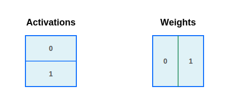

# Collective matrix multiplication（集合矩阵乘法）

Tensor parallelism（TP）和 data parallelism（DP）是最常用的并行化技术，使得不断增大的模型能够部署在多个加速器上。然而，它们的联合使用意味着在程序中，数据有时会以一种无法直接执行操作而需要额外通信的方式进行分片。一个常见的例子是 Transformer 的 MLP 模块开头：输入激活可能在 batch 轴上分片（DP），而权重可能在输出特征维度上分区（TP）。



收缩维度没有被分片，所以看起来可以直接做矩阵乘法，但有一个问题：输出无法在同一个设备轴上同时对两个维度进行分片！

有一种简单的解决方法：我们可以对激活或权重执行 all-gather（这里我们聚焦于激活侧），然后用另一个被分片的操作数执行本地矩阵乘法。这种简单策略是可行的，但有一个缺点：在 all-gather 运行期间，我们无法开始计算矩阵乘法！这意味着硬件利用率不足。

为了实现更好的利用率，我们将展示如何用 Pallas:MGPU kernel 来实现跨设备通信与矩阵乘法的重叠（overlap），在足够大的问题规模上几乎达到最优利用率。我们的实现大量使用了 NVLINK 互联，使得 GPU 之间可以进行高带宽通信而无需经过主机。

这种方法已经能带来可观的性能提升！以 f16 matmul、M=1024、K=4096、N=4096、正态分布数据为例，我们的基准测试表明在单个 H100 上大约需要 43us。下表中，我们对 M 维度进行扩展，使得每个分片的形状为 M=1024。我们可以通过将本地运行时间估计值乘以设备数量、再为每轮通信添加约 6us（内存 fence 相关的同步开销较大）来计算分布式 kernel 的预期执行时间下界。对我们的 kernel 进行基准测试得到以下结果：

| 设备数量 | Kernel 时间 | TC 利用率 | 下界 | TC 利用率 | 参考时间 | TC 利用率 |
|---|---|---|---|---|---|---|
| 2 | 102us | 68% | 92us | 75% | 147us | 47% |
| 4 | 212us | 66% | 190us | 73% | 290us | 48% |
| 8 | 436us | 64% | 386us | 72% | 565us | 49% |

可以看到仍有一些优化空间，但至少与 NCCL all-gather + cuBLAS matmul 的基线实现相比，我们获得了更高的利用率。

## 算法概述：Ring All-Gather

为了计算 `AllGather(A) @ B`，我们在参与的 `D` 个设备上形成一个环（ring）。在每一步中，设备取最后收到的分片（从本地分片开始），然后传递给环中的下一个设备。在发送进行的同时，我们计算最后收到的 `A` 分片与本地 `B` 分片的矩阵乘法。


更正式地说，算法进行 `D` 步。在第 `i` 步（`0 <= i < D`），设备 `d` 从设备 `(d + 1) % D` 接收分片 `A_{(d + i) % D}`（第一步实际上不需要接收），计算 `A_{(d + i) % D} @ B_d`，并将结果写入输出缓冲区的相应切片。与计算并发地，设备 `d` 将分片 `A_{(i + d) % D}` 发送给设备 `(i - 1) % D`，供其在第 `i + 1` 步使用（最后一步不发送）。经过 `D` 步后，设备 `d` 将看到 `A` 的每一个分片，并计算出完整的输出。

## 用于设备间通信的 Pallas 原语

我们使用三个 Pallas 函数进行设备间通信：

- **`plgpu.remote_ref(ref, device_id)`**：此函数接收一个指向 global memory（GMEM）中缓冲区的引用，并返回指向由 `device_id` 指定的**另一个**设备上相同缓冲区的引用。通过 NVLINK 通信时，即使数据位于远程内存中，也可以直接读写此引用。

- **`pl.semaphore_signal(sem, device_id=...)`**：递增目标设备上的 semaphore（信号量）。通常用于指示某个过程完成，例如通知远程设备其等待的数据已发送完毕。

- **`pl.semaphore_wait(sem, value=..., decrement=...)`**：阻塞直到本地 semaphore 达到指定值。如果 `decrement` 为 `True`（默认值），semaphore 的值会减去等待的数量。如果为 `False`，操作更高效，但等待完成后不会修改 semaphore 的值。常用于等待远程设备的信号。

## 使用 Pallas 实现

> **注意**
>
> 这里我们只展示 kernel 的简化版本，以便聚焦于最有趣的细节。完整实现可以在[示例目录](https://github.com/jax-ml/jax/blob/main/jax/experimental/pallas/ops/gpu/collective_matmul_mgpu.py)中找到。

首先，我们关注 kernel 的设置部分。对于计算部分，我们将复用 `hopper_matmul_mgpu` 中已优化的 matmul kernel 实现。由于计算 kernel 使用了 warp-specialization，我们使用 3 个 Pallas 线程。它同时也是 persistent 的，这意味着我们启动的 grid 大小等于 SM 数量（通过 JAX device 的 `.core_count` 查询）。计算 kernel 使用 `pl.run_scoped` 进行 SMEM 分配，因此我们不使用 `scratch_shapes`。

```python
def all_gather_lhs_matmul(
    lhs: jax.Array,
    rhs: jax.Array,
    axis_name,
    *,
    config: hopper_matmul_mgpu.TuningConfig,
    dtype: jnp.dtype = jnp.bfloat16,
) -> jax.Array:
  if (num_devices := jax.device_count()) != jax.process_count():
    raise ValueError("The kernel only supports one device per process")
  if (axis_size := lax.axis_size(axis_name)) != num_devices:
    raise ValueError("The kernel can only work over all devices in a Mesh.")
  ...

  m_shard, k = lhs.shape
  _, n_shard = rhs.shape
  tile_m, tile_n, tile_k = config.tile_m, config.tile_n, config.tile_k
  cta_tile_m = tile_m * (1 + (config.wg_dimension == MatmulDimension.M))
  num_sms = jax.extend.backend.get_default_device().core_count

  def kernel_body(lhs_local_ref, rhs_ref, out_ref, scratch_ref):
    ...

  result, _ = plgpu.kernel(
      kernel_body,
      out_shape=[
          # 输出（M 维度已 gather）
          jax.ShapeDtypeStruct((axis_size * m_shard, n_shard), dtype),
          # 用于 LHS all-gather 的 scratch 缓冲区
          jax.ShapeDtypeStruct((axis_size - 1, m_shard, k), dtype),
      ],
      grid=(num_sms,),
      num_threads=3, # matmul kernel 使用 3 个线程：2 个计算 + 1 个内存
      thread_name="wg",
  )(lhs, rhs)
  return result
```

上面的 kernel 有两个输出。第一个是原语的实际结果，第二个用作 scratch 空间来接收左操作数。注意我们可以将首维缩小到小于 `axis_size - 1`，但那时就需要对发送端设备引入背压（backpressure），这需要额外的昂贵通信。

> **注意**
>
> 你可以在 [TPU 分布式通信指南](../tpu/distributed.html#run-ahead-and-race-conditions)中了解如何处理这种背压。

现在让我们来看 kernel body 的结构：

```python
def all_gather_lhs_matmul(...):
  def kernel_body(lhs_local_ref, rhs_ref, out_ref, scratch_ref, out_smem, received_sem):
    wg_idx = lax.axis_index("wg")
    dev_id = lax.axis_index(axis_name)
    # 本设备发送给 dev_id - 1，形成环
    send_dev_id = lax.rem(dev_id + axis_size - 1, axis_size)
    send_scratch_ref = plgpu.remote_ref(scratch_ref, send_dev_id)

    def device_step(lhs_source_ref, device_offset):
      # 不变量：lhs_source_ref 包含 A_{(dev_id + device_offset) % D}
      # 并且已经准备好用于计算。

      ...

    # 剥离第一步以直接从 lhs_local_ref 读取数据。
    device_step(lhs_local_ref, 0)
    @pl.loop(1, num_devices)
    def _device_loop(device_offset):
      device_step(scratch_ref.at[device_offset - 1], device_offset)
```

我们通过查询 `lax.axis_index(axis_name)` 来确定自身在环中的位置，并计算下一个设备的索引（即我们要发送数据的目标设备 `send_dev_id`）。然后，我们循环调用 `device_body`，次数等于设备数量。我们将第一步剥离出来，因为仅在该步中以本地引用作为发送源（之后的发送来自 scratch 缓冲区中之前收到的数据）。

现在我们可以研究主循环了：

```python
def all_gather_lhs_matmul(...):
  ...

  def kernel_body(lhs_local_ref, rhs_ref, out_ref, scratch_ref, out_smem, received_sem):
    ...

    def device_step(lhs_source_ref, device_offset):
      # 我们正在计算输出的第 (dev_id + device_offset) % D 个块。
      out_device_idx = lax.rem(device_offset + dev_id, axis_size)
      out_device_m_slice = pl.ds(out_device_idx * m_shard, m_shard)

      # 在第 `device_offset` 步，我们将 A_{(dev_id + device_offset) % D}
      # 发送给环中的下一个设备，放入 scratch 槽 `device_offset`。
      # 在最后一步我们不发送，因为那会将数据送回原始来源。
      next_scratch_slot = device_offset
      is_send_wg = wg_idx == 0 # 每个 CTA 只有一个 warpgroup 发送
      has_send_space = next_scratch_slot < axis_size - 1
      should_send = is_send_wg & has_send_space

      # 此函数将由 hopper_matmul_mgpu.kernel 在其 pipeline 体内调用。
      # 我们用它来利用计算 kernel 需要将左操作数取入 SMEM 的事实，
      # 指示 TMA 引擎异步地将本地数据流式传输到下一个设备。
      def send_lhs(m_idx, n_idx, k_idx, a_smem, b_smem, send_ref, should_send):
        del b_smem  # 未使用
        # 我们仅在 n_idx == 0 时发送，以避免在重新访问
        # 左操作数时多次发送相同的数据。
        @pl.when(should_send & jnp.bool(n_idx == 0))
        def _():
          k_slice = pl.ds(k_idx * tile_k, tile_k)
          m_slice = pl.ds(m_idx * cta_tile_m, cta_tile_m)
          plgpu.copy_smem_to_gmem(a_smem, send_ref.at[m_slice, k_slice])
          # 等待之前的拷贝完成。我们在 matmul kernel 的 pipeline 中
          # 传入 delay_release=1 以确保至少在下一步完成前不会覆盖输入，
          # 但不会等待更长时间。
          plgpu.wait_smem_to_gmem(1, wait_read_only=True)

      hopper_matmul_mgpu.kernel(
          lhs_source_ref,  # 本步的 LHS 分片
          rhs_ref,  # RHS 分片始终相同
          out_ref.at[out_device_m_slice],  # 要更新的输出切片
          out_smem,
          config=config,
          pipeline_callback=functools.partial(
              send_lhs,
              send_ref=send_scratch_ref.at[next_scratch_slot],
              should_send=should_send,
          ),
          delay_release=1,
      )

      # 等待下一个 scratch 数据到达，用于下一步的计算。
      # 每个设备在完成发送后会向其邻居发送信号。
      @pl.when(should_send)
      def _signal():
        # 确保远程拷贝已完成，然后发送信号。
        plgpu.wait_smem_to_gmem(0, wait_read_only=False)
        pl.semaphore_signal(received_sem, device_id=send_dev_id)
      @pl.when(has_send_space)
      def _wait():
        # 这里我们等待环中前一个设备发来的数据。
        # 每一步中，我们期望从每个 SM 收到一个信号。
        # 我们使用 decrement=False 使此操作稍快一些，但这也意味着
        # 我们需要将期望的信号数量按到目前为止的步数进行缩放
        #（因为值只会增加）。
        pl.semaphore_wait(received_sem, value=(device_offset + 1) * num_sms, decrement=False)

    ...
```

以下事情依次发生：

1. 我们首先计算在本次循环步骤中要计算的输出切片。

2. 然后，我们调用优化过的 matmul kernel，但注入了一个 `pipeline_callback`。我们利用计算 kernel 需要将左操作数取入 SMEM 的事实，指示 TMA 引擎异步地将本地数据流式传输到环中的下一个设备。流量由硬件通过 NVLINK 透明路由。值得注意的是，我们仅从一个计算线程发出发送操作，且仅在首次访问左操作数时发送（它可能被多次重新加载以计算多个输出 tile）。

3. 最后，发送线程确保发送已完成，并向接收设备的 `received_sem` 发送信号以表明这一点。之后，所有线程等待确认下一步循环所需的数据已全部到达（在最后一步跳过等待）。

## 将 kernel 与 JAX 集成

要调用该 kernel，你需要用 `jax.shard_map` 包装它：

```python
m_shard, n_shard, k = 1024, 1024, 1024
dtype = jnp.float16
mesh = jax.make_mesh((jax.device_count(),), ("x",),
                     axis_types=(jax.sharding.AxisType.Explicit,))
with jax.set_mesh(mesh):
  a = jax.random.normal(jax.random.key(1), (m_shard * jax.device_count(), k), dtype)
  b = jax.random.normal(jax.random.key(2), (k, n_shard * jax.device_count()), dtype)
  a = jax.sharding.reshard(a, P("x", None))
  b = jax.sharding.reshard(b, P(None, "x"))

  # 8xH100 的示例配置。你可能需要根据具体 shape 重新调优。
  config = hopper_matmul_mgpu.TuningConfig(
      tile_m=128, tile_n=128, tile_k=64, max_concurrent_steps=4,
      grid_minor_dim=MatmulDimension.N, grid_tile_width=8,
      wg_dimension=MatmulDimension.N,
  )

  kernel = jax.jit(
      jax.shard_map(
          functools.partial(all_gather_lhs_matmul, axis_name="x", config=config),
          out_specs=P(None, "x"),
          check_vma=False,
      )
  )
  c = kernel(a, b)
```
