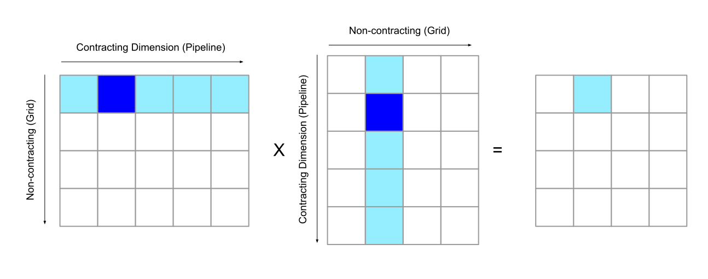
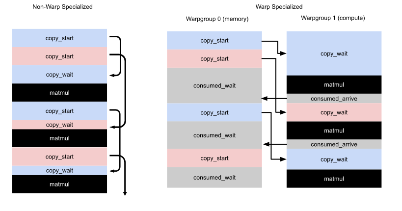
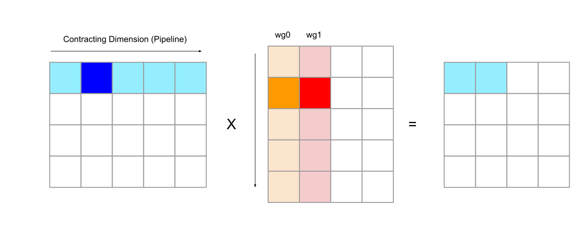

# Mosaic GPU 流水线

本指南介绍如何使用 Pallas 的 Mosaic GPU 后端进行软件流水线（software pipelining）。

有关 Pallas 中流水线 API 的总体概述，建议用户先阅读 [Software Pipelining](../pipelining.html#pallas-software-pipelining)。Pallas 中的流水线是显式编程的。对于熟悉 Triton 的用户来说，这是编程模型上的一个重大差异，因为在 Triton 中，流水线是由编译器自动完成的优化。

```python
import jax
from jax import lax
from jax import numpy as jnp
from jax.experimental.pallas import mosaic_gpu as plgpu
from jax.experimental import pallas as pl
import numpy as np
```

## 使用 Mosaic GPU 进行流水线

推荐的 Mosaic GPU 流水线方式是使用 `plgpu.emit_pipeline` 函数对顺序循环进行流水线化（并使用 `plgpu.kernel` 在 CUDA grid 上并行划分问题）。`emit_pipeline` 的 API 与 `pl.pallas_call` 类似，但额外暴露了一些 GPU 特有的选项。

- `body` 和 `grid` 的语义与 `pl.pallas_call` 类似。`grid` 表示 `body` 函数要运行多少次调用。与 CUDA grid 不同，pipeline grid 保证按顺序执行。

- `in_specs` 和 `out_specs` 的工作方式也与 `pl.pallas_call` 类似，但它们还接受 `plgpu.BlockSpec` 实例，可用于指定 GPU 特有的变换（transform），例如 swizzling。有关可用变换的更多详情，请参阅 [memory reference transforms](https://docs.jax.dev/en/latest/pallas/gpu/reference.html#memory-reference-transforms)。

- `max_concurrent_steps` 控制最大并发内存传输数。使用更多并发步骤会消耗更多 SMEM 来存放临时 buffer，但可以提高内存子系统的利用率。我们建议对此参数进行 autotune。较低的值（如 2）有时可以实现更高的 occupancy（因为 SMEM 使用量更低），从而提高 ALU 密集型 kernel 的吞吐量，但由于依赖硬件调度会引入更多噪声。较大的值（4 到 6 之间）对于无法利用额外 occupancy 的 kernel 效果最佳。

- `delay_release` 允许用户指定在 buffer 被流水线重用之前额外等待的迭代次数。例如，在迭代 0 复制到 SMEM 的 buffer，如果 `delay_release=1` 且 `max_concurrent_steps=2`，则不会在迭代 3 之前被重用，而标准的 double-buffered 策略则会在迭代 2 重用。如果你没有对 pipeline operand 上的 `plgpu.wgmma` 操作执行 await，则 `delay_release=1` 是必需的，否则流水线会在 WGMMA 仍在读取 buffer 时开始覆写它们。这对于某些优化（例如允许多个异步 matmul 同时在飞，以保持 TensorCore pipeline 满载）很有用，但使用此策略时需要小心，因为**省略此参数会导致静默的数据竞争**，并且由于重叠的内存传输更少，会降低 `emit_pipeline` 的效率。

### 使用 `pl.pallas_call` 的兼容性 API

作为 `emit_pipeline` 的替代方案，并保持与 Pallas TPU 的兼容性，Mosaic GPU 也实现了现有的 `pl.pallas_call` API。默认情况下，Mosaic GPU 上的 `pl.pallas_call` 会在 CUDA grid 上并行划分你的 kernel。你可以通过传入 `plgpu.CompilerParams` 对象作为 `compiler_params` 参数来启用流水线，该对象指定了以下与流水线相关的选项：

- `dimension_semantics`：一个 `Literal['parallel', 'sequential']` 的元组，为每个 grid 维度指定迭代语义。`parallel` 会将对应维度分配到 CUDA grid 上，`sequential` 维度则会按顺序进行流水线化。**注意：如果没有维度被标记为 `sequential`，则不会发生流水线化！**

- `max_concurrent_steps`：与 `plgpu.emit_pipeline` 中的选项相同。

- `delay_release`：与 `plgpu.emit_pipeline` 中的选项相同。

流水线允许你在 grid 的顺序迭代之间重用 scratch buffer（例如用于实现 reduction）。此外，使用 Mosaic GPU 后端时，`pallas_call` 支持使用 `plgpu.BlockSpec` 对象替代 `pl.BlockSpec` 对象，以便指定 GPU 特有的内存变换。

我们建议用户使用 `plgpu.kernel` 而非 `pl.pallas_call`，因为 `plgpu.kernel` 支持更多功能（例如指定 warpgroup 数量和 warp specialization）。

## GPU 内存空间

Ref 主要存在于两个内存空间之一，可以通过 `BlockSpec` 的 `memory_space` 参数显式指定，例如 `BlockSpec(memory_space=plgpu.GPUMemorySpace.GMEM)`。

- `plgpu.GPUMemorySpace.SMEM` 在共享内存（Shared Memory, SMEM）中分配 Ref。SMEM Ref 可以通过数组索引语法解引用，将值存入寄存器进行计算，例如 `x = y_ref[...]`。使用 `emit_pipeline` 时，Ref 使用此内存空间。

- `plgpu.GPUMemorySpace.GMEM` 在全局内存（Global Memory, GMEM/HBM）中分配 Ref。在 GMEM 中分配的 Ref 不会被流水线化，其值不能通过数组索引操作直接访问。相反，GMEM 必须通过 SMEM 访问，使用 `plgpu.copy_gmem_to_smem` 进行读取，使用 `plgpu.copy_smem_to_gmem` 进行写入，或通过 `plgpu.emit_pipeline` 流水线化到 SMEM。

`emit_pipeline` 的主要用途是将 TensorCore 计算与 GMEM 和 SMEM 之间的数据传输重叠，因为 GMEM/SMEM 之间的异步拷贝具有很长的延迟，但所有 TensorCore 计算都必须在寄存器（或矩阵乘法情况下的 SMEM Ref）上操作。

## 示例：Hopper GPU 上的矩阵乘法 Kernel

让我们从一个专为 Hopper GPU 设计的矩阵乘法示例开始。此 kernel 使用 Hopper 特有的 `wgmma`（warpgroup matrix multiply accumulate）指令。`wgmma` 由单个 Mosaic GPU 线程发出，并在 TensorCore 上异步运行。

我们的示例 kernel 实现了两个形状为 `[M, K] @ [K, N] = [M, N]` 的矩阵的分块矩阵乘法，其中每个输出块在 CUDA grid 上并行计算。此 grid 作为外层 `plgpu.kernel` 的 `grid` 参数指定，并在矩阵乘法的非缩约维度 M、N 上进行并行化。



在一个程序实例内，我们使用 `plgpu.emit_pipeline` 运行一个顺序流水线，在矩阵乘法的缩约维度 K 上进行 reduction。在流水线的每次迭代中，我们从每个输入矩阵加载一个 tile，将它们相乘，然后将结果存入一个累加器 Ref（`plgpu.ACC`）。`plgpu.ACC` 是一种特殊的 Ref，存在于寄存器中，保存 WGMMA 的中间结果。一旦我们在整个缩约维度上完成累加，就将结果写入输出 Ref。

为了执行实际的矩阵乘法，我们使用累加器、LHS 和 RHS Ref 作为参数调用 `plgpu.wgmma`，将参数推入 TensorCore pipeline。所有 WGMMA 操作按顺序执行，因此可以将其视为向队列中推送操作。由于 `wgmma` 是异步指令，`plgpu.wgmma_wait(N)` 用于等待直到不超过 N 个 `wgmma` 操作在飞。在这个特定实现中，我们等待 1 个在飞的 WGMMA，这意味着当前迭代排队的 WGMMA 将在下一次迭代中被等待。

- `wgmma` 要求其参数采用特定格式，定义在 [CUDA 文档](https://docs.nvidia.com/cuda/parallel-thread-execution/#register-fragments-and-shared-memory-matrix-layouts)中。这些格式通过输入 BlockSpec 上的 `TilingTransform` 和 `SwizzleTransform` 变换实现。注意，未来 Mosaic GPU 将自动推断变换，届时无需手动指定。完整的使用细节请参阅 [wgmma reference](https://docs.jax.dev/en/latest/pallas/gpu/reference.html#hopper-wgmma)。

- 我们将 `delay_release` 参数与 `plgpu.wgmma_wait(1)` 结合使用，始终允许一个 `WGMMA` 操作保持在飞状态，以确保良好的 TensorCore 利用率。如果没有这样做，我们将在 kernel 的每次迭代中刷新 TensorCore pipeline。

```python
def matmul(a, b, tile_m=128, tile_n=128, swizzle=128):
  dtype = jnp.float16
  swizzle_elems = swizzle // jnp.dtype(dtype).itemsize
  tile_k = swizzle_elems
  grid_m = m // tile_m
  grid_k = k // tile_k
  grid_n = n // tile_n
  assert tile_m % swizzle_elems == 0

  # 注意：未来 Mosaic GPU 将自动推断变换。
  transforms = (
    plgpu.TilingTransform((8, swizzle_elems)),
    plgpu.SwizzleTransform(swizzle),
  )

  def kernel(a_gmem, b_gmem, o_gmem, o_smem, acc):
    def pipeline_step(_, a_smem, b_smem):
      plgpu.wgmma(acc, a_smem, b_smem)
      plgpu.wgmma_wait(1)

    # pl.program_id 获取 grid 中的索引。
    pid_m = pl.program_id(0)
    pid_n = pl.program_id(1)

    pipeline = plgpu.emit_pipeline(
        pipeline_step,
        in_specs=[
            plgpu.BlockSpec(
                (tile_m, tile_k), lambda k: (pid_m, k), transforms=transforms
            ),
            plgpu.BlockSpec(
                (tile_k, tile_n), lambda k: (k, pid_n), transforms=transforms
            ),
        ],
        grid=(grid_k,),
        max_concurrent_steps=2,
        delay_release=1,
    )

    pipeline(a_gmem, b_gmem)
    # 将 WGMMA 累加器存入 SMEM，然后写入 GMEM。
    o_smem[...] = acc[...].astype(dtype)
    plgpu.commit_smem()
    m_slice = pl.ds(pid_m * tile_m, tile_m)
    n_slice = pl.ds(pid_n * tile_n, tile_n)
    plgpu.copy_smem_to_gmem(o_smem, o_gmem.at[m_slice, n_slice])
    plgpu.wait_smem_to_gmem(0)

  return plgpu.kernel(
      kernel,
      out_shape=jax.ShapeDtypeStruct((m, n), jnp.float16),
      scratch_shapes=dict(
          o_smem=plgpu.SMEM((tile_m, tile_n), jnp.float16),
          acc=plgpu.ACC((tile_m, tile_n), jnp.float32)
      ),
      # grid 指定 CUDA grid。
      # kernel 的实例将在此 grid 上并行执行。
      grid=(grid_m, grid_n),
      grid_names=("m", "n"),
  )(a, b)

m = 132 * 128
n = 4 * 128
k = 10 * 64
key1, key2 = jax.random.split(jax.random.key(42), 2)
a = jax.random.uniform(key1, shape=(m, k), dtype=jnp.float16)
b = jax.random.uniform(key2, shape=(k, n), dtype=jnp.float16)

result = matmul(a, b)

np.testing.assert_allclose(result, a @ b)
```

## Warp Specialization

Warp specialization 是一种将每个 warp/warpgroup 编程为执行单一任务的技术，以便给 GPU 硬件在运行时灵活调度的空间。回顾一下，GPU 中的每个 streaming multiprocessor (SM) 都包含 warp scheduler，可以在 warp 之间切换执行，因此例如当一个 warp 处于 stall 状态时，可以开始执行另一个 warp。在实践中，这比编写单一指令流（由编译器静态调度操作并尝试最优重叠）可能有更好的性能。

特别是，我们关注 Hopper+ GPU 上的 warpgroup specialization，其中让一个单独的 warpgroup 发出 TMA（GMEM/SMEM 拷贝），而其他 warpgroup 执行算术运算是很有用的，因为索引计算和发出 TMA 可能占用大量时间，并可能导致 TensorCore 空闲。下图左侧展示了标准的非特化 kernel，其中 TMA（异步拷贝）和矩阵乘法从单一指令流发出；右侧展示了 warp-specialized 版本，其中通信和算术运算由不同的 warpgroup 处理。使用 *consumed barrier* 在特化的 warpgroup 之间进行同步，向内存 warpgroup 发信号何时可以安全地开始下一次 TMA。



可以通过使用 `plgpu.emit_pipeline_warp_specialized` helper 在 Pallas 中启用 warp specialization。这个 pipeline helper 处理内存线程中的所有逻辑，用户只需指定计算线程中完成的工作。它与标准 `emit_pipeline` 共享类似的 API，目前支持以下参数：

```python
plgpu.emit_pipeline_warp_specialized(
  body: Callable,
  *
  grid: tuple[int, ...],
  in_specs: Sequence[pallas_core.BlockSpec] = (),
  out_specs: Sequence[pallas_core.BlockSpec] = (),
  max_concurrent_steps: int,
  compute_context: Callable
  num_compute_wgs: int,
  memory_registers: int
  wg_axis: str,
  memory_thread_idx: int | None = None,
)
```

以下是此 pipeline emitter 特有的几个参数：

- `num_compute_wgs` 指定使用多少个计算线程/warpgroup。pipeline emitter 始终使用单个内存线程，因此在 `plgpu.kernel` 中应指定 `num_threads=num_compute_wgs+1`。

- `memory_registers` 控制分配给内存线程的寄存器数量。剩余的寄存器在计算线程之间均匀分配。默认值为 40，应根据是否遇到寄存器溢出（register spill）进行上下调整。

- `wg_axis` 线程/warpgroup 轴的名称（由 `plgpu.kernel` 的 `thread_name` 参数指定）。

- `memory_thread_idx` 指定将哪个 Pallas 线程指定为内存线程。默认为最后一个线程。

- `compute_context` 允许你指定仅在计算线程中运行的 pipeline prologue/epilogue。该函数允许你定义通过 pipeline 传递的 loop carry 的初始化和消费。所有计算线程特有的数组都应在此处实例化，以避免内存线程在寄存器中 materialize 它们 -- 否则可能因寄存器溢出导致性能下降。

warp specialized pipeline 的 body 由所有计算线程并行运行，SMEM 在计算线程之间共享，因为它们在同一个 CUDA block 内调度。可以在 kernel 内部使用 `lax.axis_index` 获取 Pallas 线程索引，以便在计算线程之间分配工作。

## 示例：使用 Warp Specialization 的矩阵乘法

以下示例扩展了之前的矩阵乘法示例，使用 warp specialization。此 kernel 使用 2 个计算线程，它们操作 RHS 矩阵的不同列但共享相同的 LHS。因此，pipeline 的每次调用计算输出矩阵中 2 个相邻的块。



我们使用 `compute_context` 模式来初始化 WGMMA 累加器，并将最终的累加器从寄存器复制到 SMEM。这里，compute context 定义在 `compute_thread` 函数中。至关重要的是，累加器必须在 `compute_thread` 函数内部创建，以避免在内存线程中分配它导致浪费寄存器。为了执行 WGMMA，我们将 `wgmma` 指令封装在 `pl.run_state` 中，以创建一个初始化为 carry 值的累加器 ref。

我们使用 GPU 特有的 `plgpu.kernel` 入口点来调用 kernel，而非 `pl.pallas_call`。`plgpu.kernel` 允许我们通过 `num_threads` 参数指定每个 CUDA block 启动的线程数，并允许我们指定一个 `thread_name` 用于在 kernel 内部查询 Pallas 线程索引。

```python
def matmul_warp_specialized(a, b, tile_m=128, tile_n=128, swizzle=128,
                            compute_wgs=2):
  dtype = jnp.float16
  elems_128b = swizzle // jnp.dtype(dtype).itemsize
  tile_k = elems_128b
  grid_m = m // tile_m
  grid_k = k // tile_k
  grid_n = n // tile_n
  assert tile_m % elems_128b == 0

  transforms = (
          plgpu.TilingTransform((8, elems_128b)),
          plgpu.SwizzleTransform(128),
      )

  def kernel(a_gmem, b_gmem, o_gmem, o_smem):
    wg_idx = lax.axis_index("wg")
    wg_slice = pl.ds(wg_idx * tile_n, tile_n)
    # pl.program_id 获取 pallas_call grid 中的索引。
    pid_m = pl.program_id(0)
    pid_n = pl.program_id(1)

    def compute_thread(pipeline):
      acc = plgpu.layout_cast(
          jnp.full((tile_m, tile_n), 0, dtype=jnp.float32), plgpu.Layout.WGMMA,
      )
      # yield 标记流水线循环将被插入的位置。
      # 其参数是初始的 carry 值，其结果是循环完成后的 carry 值。
      final_acc = pipeline(acc)
      o_smem[:, wg_slice] = final_acc[...].astype(dtype)

    def kernel_body(_, a_smem, b_smem, carry):
      acc = carry
      b_smem_wg = b_smem.at[:, wg_slice]
      def do_wgmma(acc_ref):
        plgpu.wgmma(acc_ref, a_smem, b_smem_wg)
      acc = pl.run_state(do_wgmma)(
                          plgpu.ACC.init(acc))
      return acc

    pipeline = plgpu.emit_pipeline_warp_specialized(
        kernel_body,
        in_specs=[
            plgpu.BlockSpec(
              (tile_m, tile_k), lambda k: (pid_m, k), transforms=transforms
            ),
            plgpu.BlockSpec(
              (tile_k, tile_n * 2), lambda k: (k, pid_n),transforms=transforms
            ),
        ],
        grid=(grid_k,),
        compute_context=compute_thread,
        max_concurrent_steps=2,
        num_compute_wgs=compute_wgs,
        memory_registers=40,
        memory_thread_idx=2,
        wg_axis="wg",
    )
    # 调用 pipeline
    pipeline(a_gmem, b_gmem)
    # 将输出从 SMEM 复制到 GMEM。
    plgpu.commit_smem()
    m_slice = pl.ds(pid_m * tile_m, tile_m)
    n_slice = pl.ds(pid_n * tile_n * 2, tile_n * 2)
    plgpu.copy_smem_to_gmem(o_smem, o_gmem.at[m_slice, n_slice])
    plgpu.wait_smem_to_gmem(0)

  return plgpu.kernel(
      kernel,
      out_shape=jax.ShapeDtypeStruct((m, n), jnp.float16),
      scratch_shapes=dict(
          o_smem=plgpu.SMEM((tile_m, tile_n * 2), jnp.float16)
      ),
      grid=(grid_m, grid_n // 2),
      grid_names=("m", "n"),
      num_threads=3,  # 2 个计算线程，1 个内存线程。
      thread_name="wg"
  )(a, b)

m = 132 * 128
n = 4 * 128
k = 10 * 64
key1, key2 = jax.random.split(jax.random.key(42), 2)
a = jax.random.uniform(key1, shape=(m, k), dtype=jnp.float16)
b = jax.random.uniform(key2, shape=(k, n), dtype=jnp.float16)

result = matmul_warp_specialized(a, b)

np.testing.assert_allclose(result, a @ b)
```
