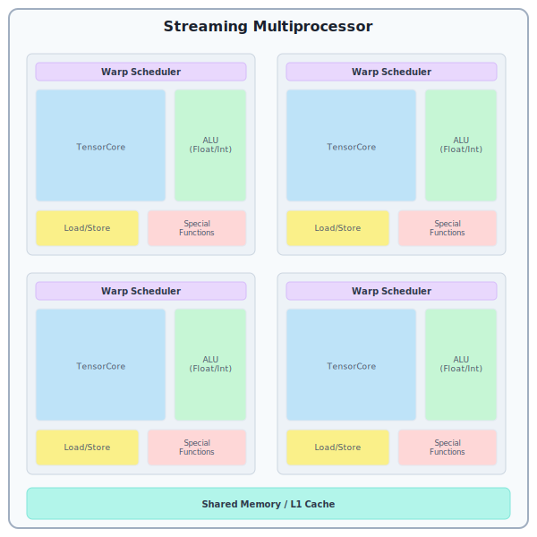
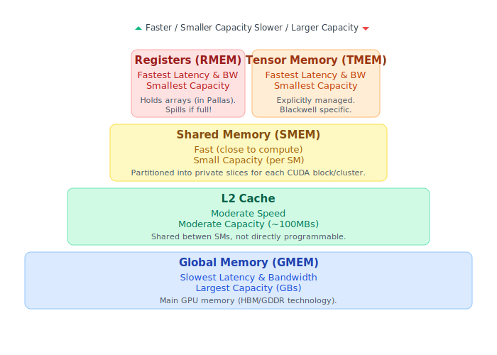
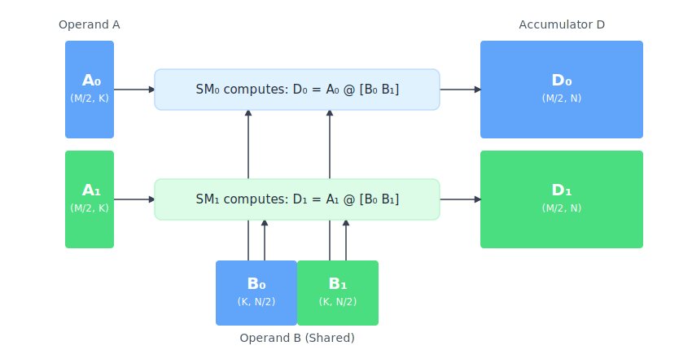

# 使用 Pallas 编写 Mosaic GPU kernel

本页是 Pallas:MGPU 后端最重要功能的参考文档。这不是教程，因此我们并不期望每个人都从头读到尾。不过，浏览一遍还是值得的，这样你可以熟悉在其他教程中出现的一些模式。

在以下示例中，我们假设已导入以下内容：

```python
import jax.experimental.pallas as pl
import jax.experimental.pallas.mosaic_gpu as plgpu
```

## 什么是 GPU？

从技术上讲，NVIDIA GPU 架构如下：GPU 被划分为多个 _streaming multiprocessors_（SM）。在 CUDA 编程模型中，每个 _CUDA thread block_（或 CTA）被调度到恰好一个 SM 上，但多个 block 可以同时被调度到同一个 SM 上。

每个 SM 包含一块称为 _shared memory_（SMEM）的快速内存和 4 个子分区，每个子分区包含一个 _warp scheduler_ 和计算单元（ALU、TensorCore 等）。这也反映在 CUDA 程序中：每个 _warp_（block 中连续的 32 个 CUDA 线程组成的组）以轮询方式分配到这些子分区之一。与 block 类似，每个 warp 被分配到恰好一个子分区（它不会迁移），但多个 warp 可以被分配到同一个 SM 子分区。在每个时钟周期，每个子分区的 warp scheduler 会尝试选择其驻留 warp 之一来执行下一条指令。



更进一步，近期的 CUDA 版本还引入了 _warpgroup_ 的概念，即 4 个连续的 warp。了解硬件结构后，我们可以理解这一概念的由来：4 个连续的 warp 占据 SM 的 4 个象限，使我们能够发射利用整个 SM 的指令。

> **Note**
>
> GPU 可以从许多不同角度来看待，这里我们希望专注于一个稍微简化的、以 TensorCore 为中心的模型。这应该能帮助你应对编写涉及 TensorCore 的 kernel 的复杂性，但请记住，真实情况更加复杂。

对我们而言，TensorCore 操作已经变得如此之大，以至于继续遵循 CUDA 模型已不太合理。因此，对我们来说，GPU 是一组单线程核心（SM），一个 Pallas:MGPU 线程对应一个 CUDA warpgroup。在这个模型中，你在 kernel 中执行的每个操作都占据整个 CUDA warpgroup，其组成 warp 始终以锁步方式运行（除了来自硬件调度的抖动），并且永远不会在控制流中走不同的路径（`core_map` 是一个小例外，我们稍后讨论）。这里一个值得注意的补充是，我们仍然允许你在同一个 SM 上共同调度多个这样的 Pallas 级线程，以便它们可以通过 shared memory 进行协作和通信（我们通过将它们放在同一个 CUDA block 中来实现这一点）。

> **Note**
>
> 从现在起，每当我们说"线程"时，我们指的是 Pallas 线程，而不是 CUDA thread/lane。

> **Note**
>
> 这与 [Triton](https://triton-lang.org/) 推广的编程模型非常相似，但正如你将看到的，存在一些差异。Mosaic GPU 往往更底层，这通常意味着你需要付出更多工作，但也让你拥有更多控制权。我们认为两种方法各有优势，鼓励你选择最适合需求的后端！Pallas 支持并将继续支持 Triton 作为替代 GPU 后端。

### 顺序执行与使用多个硬件单元

与更复杂的 CPU 架构不同，GPU 仅支持顺序执行。然而，这并不意味着在任何给定时刻只有一条指令在运行！每个 SM 象限有多个独立的功能单元：TensorCore、算术逻辑单元（ALU）、Load/Store（LSU）、特殊功能单元（SFU）。如果第一条指令针对某个单元，后面紧跟另一条指令（且不使用第一条指令的结果），那么 warp scheduler 可以在第一条指令完成之前发射第二条指令。这通常被称为指令级并行（ILP），是现代 TensorCore kernel 中的常见主题：TensorCore 操作非常大，需要很多周期才能完成，不尝试同时使用其他单元是一种浪费。

为了进一步扩展这一点，我们可以通过允许多个 Pallas 线程并发运行来利用这种硬件单元级并行。如果其中一个线程主要占用 ALU，而另一个线程主要发射 TensorCore 相关指令，我们可以利用 warp scheduler 内置的高效上下文切换来保持两个单元都处于忙碌状态。这是 [FlashAttention 3](https://arxiv.org/abs/2407.08608) 或 [CUTLASS ping-pong matmul kernel](https://pytorch.org/blog/cutlass-ping-pong-gemm-kernel/) 等算法背后的核心思想之一。

有关 warp 调度和指令发射工作方式的更多信息，我们推荐阅读 [Analyzing Modern NVIDIA GPU cores](https://arxiv.org/abs/2503.20481)。

### Memory spaces

GPU 具有几种不同的 memory space，可以按容量从大到小（以及总带宽和单次访问延迟从慢到快）完全排序。



最大的 memory space 是 `plgpu.GMEM`，即 _global memory_。在近期的数据中心级 GPU 中，这个 memory space 通常以数十甚至数百 GB 来衡量，但它也是最慢的。

下一个 memory space 用于 L2 cache，在某种意义上也是全局的，因为它被整个 GPU 共享，但它的使用只能通过 cache hint 间接影响。因此，无法手动将值放置在那里，所以这个 memory space 没有在 Pallas:MGPU 中暴露。虽然只有约 100MB 大小，但这块内存的带宽远高于 GMEM，因此在编写高性能 kernel 时仍然建议利用它。

接下来是 _shared memory_，即 `plgpu.SMEM`。这块内存直接位于每个 SM 内部，因此是分区的。除非使用 block cluster（参见下面的 cluster 部分），每个 block 只允许访问自己的 SMEM 分配。

最后，最底层的 memory space 是 _register memory_。Pallas kernel 中的每个值（即 JAX 数组）都位于此。如果编译器用完了寄存器来存储这些数组，它会插入 _spill_，即周期性地将值存储到内存并重新加载。这些 spill 通常会引入其他显著的性能下降，因此我们建议避免它们。关于 spill 的警告信息可以在 kernel 编译期间的 `ptxas` 消息中清楚地看到。要使其可见，请在环境中设置 `MOSAIC_GPU_DUMP_PTXAS=1`。

Blackwell GPU 世代有一个额外的 memory space，称为 _tensor memory_ 或 `plgpu.TMEM`。TMEM 与 register memory 非常相似，只是它由你显式分配和管理。它用于存储 MMA accumulator、operand metadata（用于稀疏性或缩放），以及可选的左侧 MMA 操作数。有关 TMEM 的更多信息，请参阅 Blackwell MMA 部分。

#### 在特定 memory space 中请求/分配内存

Kernel 输入或输出默认放置在 SMEM 中。如果你想以 GMEM reference 的方式访问它们，请在 `BlockSpec` 中添加 `memory_space=plgpu.GMEM`。如果你希望 kernel 以 GMEM 中的完整输入或输出数组被调用，只需指定 `BlockSpec(memory_space=plgpu.GMEM)` 即可。

`SMEM` 和 `TMEM` 可以在 `pl.pallas_call` 的 `scratch_shapes` 参数中显式分配，或使用 `pl.run_scoped`。要分配一个 reference，只需以所需的 shape 和 dtype 调用 memory space 对象。例如：`plgpu.SMEM((128, 128), jnp.float16)` 将在 shared memory 中分配一个 128x128 的 float16 元素数组。

#### 利用 L2 cache

虽然 L2 cache 无法手动管理，但与 global memory 相比其明显更高的带宽使其值得考虑。利用它最简单的方法是重新排列并行 grid 维度，使在相近时间段内被调度的调用也访问相同的输入数据。

虽然 CUDA 编程模型不保证 block 分配到 SM 的顺序，但在近几代中，启发式策略似乎只是以 column-major 顺序遍历 `(x, y, z)` CUDA grid（即 `x` 是变化最快的维度，`z` 是最慢的）。类似地，Pallas:MGPU 不保证用户指定的 grid 如何映射到 CUDA grid（Pallas 支持任意秩的 grid，不仅限于 3D）。然而，你可以假设迭代将以 _row-major_ 顺序进行。即，如果 grid 的维度为 `(a, b)`，那么 `b` 将是变化最快的维度，`a` 是较慢的维度。

举一个实际的例子，考虑一个普通的矩阵乘法 kernel。通常使用两个并行 grid 维度 `(m, n)`，对应两个非收缩维度的分块。如果我们使用这个简单方案，在 Pallas:MGPU 中所有 id 为 `(0, ...)` 的程序将在任何 id 为 `(1, ...)` 的 block 之前被调度。而 `m=0` 的程序集合需要读取所有的 `B` 操作数！如果 `n` 或 `k` 维度非常大，`(1, ...)` 程序从 `(0, ...)` 程序的访问中获得 cache 命中是不可能的。为简单起见，假设我们同时只能运行 16 个 block，我们会看到第一个调度波次的这种访问模式：

（此处原文为 SVG 交互图：展示不使用 grid tiling 时前 16 个 block 的访问模式）

然而，如果我们简单地将 grid 重新排列为 `(m // mt, n, mt)`（然后在 kernel 中将 `pl.program_id(0)` 替换为 `pl.program_id(0) * mt + pl.program_id(2)`），很容易看出沿两个维度的一带程序将被并发调度（而不是调度单行）。这极大地增加了加载相似数据切片的并发程序数量，通常显著提高 L2 利用率，从而提高 kernel 的整体性能（如果它是 memory bound 的）。继续我们使用 16 个 block 和 `mt=4` 的例子，我们得到以下访问模式：

（此处原文为 SVG 交互图：展示使用 grid tiling 时前 16 个 block 的访问模式）

注意，尽管活跃 block 的数量没有变化，但它们访问的数据总量减少了一半！我们现在获得 L2 命中的机会大大增加。

## Array layout 与 memory reference transform

在 Pallas 中，你使用的数据结构（数组和 reference）具有 **logical shape**（例如，128x128 矩阵）。这个 logical shape 必须映射到 **physical representation**（数据在 GPU 内存中的实际表示方式）。具体的映射取决于数据所在位置：

1. **Array Layout：** 数组存储在 register memory 中，我们将这种映射称为 _layout_。Layout 定义了数组元素如何分布在构成 Pallas 线程的 CUDA lane 可用的寄存器上。

2. **Memory Reference Transform：** 对于指向 `SMEM` 的可变 reference，这种映射称为 _transform_。Transform 描述了逻辑数据结构如何在该内存块中排列。

这些概念对性能至关重要，尤其是在与 TensorCore 等专用硬件单元交互或优化内存访问模式时。

> **Note**
>
> 我们正在开发一种模式，将完全自动处理 layout 和 transform 的分配（尽管提供 hint 和更多控制的方式）。下面列出的 API 可能会继续运行，但将变为可选的。

### Memory reference transform

Transform 在 memory reference 首次分配时应用。在这些 reference 上操作的 Pallas 原语会自动考虑其关联的 transform。

```python
def body(..., scratch_ref):
    # 异步拷贝会重新格式化 GMEM 数据以匹配 SMEM transform
    plgpu.copy_gmem_to_smem(..., scratch_ref, barrier)
    plgpu.barrier_wait(barrier)
    plgpu.wgmma(..., scratch_ref)  # wgmma 仅接受正确 transform 的 ref
    ...
```

有两种分配 reference 的方式，每种都有选择所需 transform 的方法：

**1. 使用 `plgpu.BlockSpec`**

```python
transforms = (plgpu.TileTransform((8, 64)), plgpu.SwizzleTransform(128))
f = pl.pallas_call(
    in_specs=plgpu.BlockSpec(in_block_shape, in_index_map, transforms=transforms),
    out_specs=plgpu.BlockSpec(out_block_shape, out_index_map, transforms=transforms),
    ...
)
```

注意，与 `plgpu.BlockSpec` 不同，`pl.BlockSpec` _不_ 允许指定 transform。

**2. 在分配的 `SMEM` 上指定 `transforms` 参数**

```python
transforms = (plgpu.TileTransform((8, 64)), plgpu.SwizzleTransform(128))
f = pl.pallas_call(
    scratch_shapes=plgpu.SMEM((128, 128), jnp.float16, transforms=transforms),
    ...
)
```

可用的 transform 包括：

- `plgpu.TileTransform(tile_shape)`，将数据组织为连续的、不重叠的 `tile_shape` 形状的 tile。一个 tile 的数据始终完全线性化（row-major），然后才开始下一个 tile（tile 也按 row-major 顺序遍历）。例如，对 `(128, 128)` reference 应用 `TileTransform((8, 64))` 意味着对应 logical slice `[0:8, 0:64]` 的数据将首先存储（row-major），然后是 `[0:8, 64:128]`、`[8:16, 0:64]`、`[8:16, 64:128]`，依此类推。另一种理解方式是取输入数组 `x` 并以 row-major 顺序遍历 `x.reshape(128 // 8, 128 // 64, 8, 64).transpose(0, 2, 1, 3)`。

- `plgpu.SwizzleTransform(swizzle_in_bytes)`，按照 [PTX 文档](https://docs.nvidia.com/cuda/parallel-thread-execution/#tensor-swizzling-modes) 和 [CUDA 文档](https://docs.nvidia.com/cuda/cuda-c-programming-guide/#the-swizzle-modes) 中描述的方式变换数据。Swizzling 很有用，因为它允许在 register 和 shared memory 之间以 MMA 相关 layout 传输数据而不会产生 bank conflict。swizzling 后内存的确切细节 _并不那么重要_，因为所有原语都会自动考虑它。注意 swizzle 量以字节为单位指定（仅支持 128、64、32 和 16），通常伴随着 `TileTransform`（其 shape 使用元素数！）。

- `plgpu.TransposeTransform(permutation)`，在数组线性化之前对其维度进行置换。这主要的用途是让你在 GMEM-SMEM 拷贝期间改变 layout（但请注意，硬件不支持更改最内层/最后一个维度）。

> **Note**
>
> 当执行 GMEM-SMEM 或 SMEM-GMEM 拷贝且 SMEM reference 上应用了 `plgpu.TileTransform` 时，GMEM reference 的偏移量必须与 tile 大小对齐。否则，传输可能会产生错误结果。

### Array layout

目前我们定义了一些有用的 layout：

- `plgpu.Layout.WGMMA`，这是 Hopper 代 TensorCore 期望 MMA accumulator 或 16-bit 输入操作数在寄存器中的 layout。调用 `plgpu.Layout.WGMMA.reduce(axes)` 会给出适合沿指定轴归约的值的 layout，例如 `reduce(1)` 用于行结果，`reduce(0)` 用于列结果。重新广播归约维度是免费的，产生的值具有 `WGMMA` layout。

- `plgpu.Layout.WG_STRIDED`，值在构成 Pallas 线程的 128 个 CUDA lane 之间平均分配。连续元素（向量化后）以轮询方式分配给各 lane。当不需要与 TensorCore 交互时，简单且高效。

- `plgpu.Layout.WG_SPLAT`，表示值是常量。每个 CUDA lane 将持有一个包含该值的寄存器。通常你不需要与这个 layout 交互，因为它在创建常量值时隐式使用，并且始终可以隐式转换为其他 layout。

目前，在默认操作模式下，array layout 传播仅在正向方向进行，对于协调 layout 冲突的隐式支持很少：只有 splat layout 可以隐式转换为任何其他 layout。如果你例如尝试将两个具有不同 layout 的数组相加，lowering 会报错并失败。在 layout 之间转换的工具非常有限，我们通常建议将值存储到 SMEM 然后以目标 layout 读回。

## MMA (TensorCore)

在本节中，我们重点介绍 Pallas:MGPU kernel 如何利用 TensorCore 单元。TensorCore 的编程接口在不同的 NVIDIA GPU 世代之间变化显著，这就是为什么 Pallas:MGPU 中的最底层接口也有所不同。

每个 MMA 操作关联三个操作数：

- accumulator `D`，shape 为 `(M, N)`
- 左输入 `A`，shape 为 `(M, K)`
- 右输入 `B`，shape 为 `(K, N)`。所有操作数必须具有相同的元素类型。

每次使用 MMA 涉及以下步骤：

1. 为 accumulator 分配空间（MMA 隐式执行 `D += A @ B`）
2. 准备 `A` 和 `B` 操作数
3. 发射操作
4. 等待操作完成
5. 读出结果

步骤 2-4 通常在收缩维度（`K`）的循环中执行。

### `A` 和 `B` 操作数的 memory space

`A` 和 `B` 操作数通常最好通过 SMEM 传入，可以方便地使用 `plgpu.copy_gmem_to_smem` 加载。为使这些操作数与 MMA 操作兼容，需要在分配时指定适当的 tiling 和 swizzling transform。对于所有当前支持的世代，TensorCore 要求数据以 row-major 的 2D tile 排列，shape 为 `(8, swizzle_elems)`，其中 `swizzle_elems` 由 swizzle 除以元素类型的字节宽度得出。当前支持的 swizzle 为：128、64 和 32。较大的 swizzle 更可取，因为它们能提高 GMEM 到 SMEM 拷贝的性能。

```python
def mma_transforms(shape_dtype: jax.ShapeDtypeStruct):
    assert len(shape_dtype.shape) == 2
    if shape_dtype.shape[0] % 8:
        raise ValueError("Number of rows must be divisible by 8")
    for swizzle_bytes in (128, 64, 32):
        swizzle_elems = swizzle_bytes // shape_dtype.dtype.itemsize
        if shape_dtype.shape[-1] % swizzle_elems == 0:
            return (plgpu.TilingTransform((8, swizzle_elems)),
                    plgpu.SwizzleTransform(swizzle_bytes))
    raise ValueError("Failed to find transforms for the specified window type")
```

如果操作数需要变换，`A` 操作数可以通过不同的 memory space 传入（取决于架构，见下文）。`B` 操作数 _必须_ 位于 SMEM 中。

### 转置操作数

在 16-bit 操作数上执行 MMA 时，TensorCore 可以自动转置输入数据。例如，`A` reference 允许为 shape `(K, M)`，但在传入 mma 函数之前必须转置。例如：

```python
assert acc_ref.shape == (M, N) and a_ref.shape == (K, M) and b_ref.shape == (K, N)
a_ref_t = plgpu.transpose_ref(a_ref, (1, 0))
assert a_ref_t.shape == (M, K)  # plgpu.wgmma 期望的 shape
plgpu.wgmma(acc, a_ref_t, b_ref)
```

在这种情况下，`B` reference 也允许类似的操作。

### Hopper (`wgmma`)

在本节中，我们介绍使用 Hopper 代 TensorCore 的基础知识，在 PTX 中以 [`wgmma.mma_async` 指令](https://docs.nvidia.com/cuda/parallel-thread-execution/#asynchronous-warpgroup-level-matrix-instructions-wgmma-mma) 暴露。

#### 分配 accumulator

在 Hopper 硬件架构中，accumulator 分配在寄存器中，但在 Pallas 中它被建模为可变 reference，因为每个 MMA 操作都在原地累加。有两种方式分配 accumulator。

要创建零初始化的 accumulator，可以使用 `pl.run_scoped` 配合 `plgpu.ACC((m, n), dtype)` 类型。

```python
def compute(acc_ref):
    ...
    return acc_ref[...]
output = pl.run_scoped(compute, plgpu.ACC((m, n), jnp.float32))
```

对 accumulator reference 解引用（如 `compute` 函数末尾所示）将隐式等待所有未完成的 WGMMA 操作。

如果你想用现有数组初始化它，可以使用 `pl.run_state` 配合 `plgpu.ACC.init(init_array)`：

```python
def compute(acc_ref):
    ...
    return  # pl.run_state 仅返回 accumulator 的最终值
output = pl.run_state(compute)(plgpu.ACC.init(init_array))
```

如果 `pl.run_state` 有 accumulator 操作数，它会在返回最终值之前隐式等待所有未完成的 WGMMA 操作。

#### 准备 `A` 和 `B` 操作数

如上所述，我们建议通过 shared memory 传入 `A` 和 `B`。在这种情况下，必须指定正确的 tiling 和 swizzling transform。

`plgpu.wgmma` 还允许通过寄存器传入 `A`（即不是 SMEM reference 而是普通的 JAX 数组）。然而，这种模式有许多显著的缺点，并且很难确保足够的同步来使其安全。

TODO: 解释在何种条件下这样做是可以接受的。

#### 发射操作

支持的 MMA shape 要求如下：

- `M` 能被 64 整除
- `N` 能被 8 整除且不大于 256
- `K` 是 `swizzle` 除以操作数元素类型字节宽度的倍数

当前支持的数据类型为：`jnp.float32`、`jnp.bfloat16` 和 `jnp.float16`。accumulator `D` 必须是 `jnp.float32`，但 `jnp.float16` 输入的情况例外，此时允许它也是 `jnp.float16`。

#### 等待操作完成

每次 `plgpu.wgmma` 调用都会隐式与所有之前的 `plgpu.wgmma` 调用同步，这样一旦控制从它返回，我们保证除了最后发射的 WGMMA 之外没有其他 WGMMA 仍在运行。因此，之前发射的 WGMMA 指令读取的任何 SMEM 区域都可以被重用。这对于 WGMMA 与异步内存拷贝的流水线化尤为重要：

```python
buffers = 3  # 实际中你可能需要更多
assert a_smem.shape == (buffers, m, k)
assert b_smem.shape == (buffers, k, n)
assert acc_ref.shape == (m, n)

def fetch_a_b(ki, slot):
    a_slice = ...  # 替换为正确的 M/K 切片
    b_slice = ...  # 替换为正确的 K/N 切片
    plgpu.copy_gmem_to_smem(a_gmem.at[a_slice], a_smem.at[slot], a_loaded.at[slot])
    plgpu.copy_gmem_to_smem(b_gmem.at[b_slice], b_smem.at[slot], b_loaded.at[slot])

def loop_body(i, _):
    slot = jax.lax.rem(i, buffers)
    plgpu.barrier_wait(a_loaded.at[slot])
    plgpu.barrier_wait(b_loaded.at[slot])
    plgpu.wgmma(acc_ref, a_smem.at[slot], b_smem.at[slot])
    # 我们知道只有最后发射的 WGMMA 在运行，所以可以向另一个 buffer 发射异步加载
    load_i = i + buffers - 1
    load_slot = jax.lax.rem(load_i, buffers)
    @pl.when(jnp.logical_and(load_i >= buffers, load_i < num_steps))
    def _do_fetch():
        fetch_a_b(load_i, slot)
for slot in range(buffers):
    fetch_a_b(slot, slot)
jax.lax.fori_loop(0, num_steps, loop_body, None)
```

### Blackwell (`tcgen05`)

Blackwell 世代对 TensorCore 子单元进行了重大重新设计。它现在更加独立于常规 warp scheduler，不再使用或支持使用寄存器作为操作数。取而代之的是引入了一种新的 memory space，称为 _tensor memory_（TMEM）。此外，成对 SM 的 TensorCore 现在可以汇集资源来计算跨两个 SM 的更大 MMA 操作。我们称之为"collective MMA 操作"。

#### 分配 accumulator / 使用 TMEM

TMEM reference 可以像所有其他 reference 一样分配——使用 [`pl.run_scoped`](../../_autosummary/jax.experimental.pallas.run_scoped.html#jax.experimental.pallas.run_scoped)：

```python
@functools.partial(pl.run_scoped, tmem_ref=plgpu.TMEM((128, 128), jnp.float32))
def barrier_scope(tmem_ref):
    ...
```

并非所有 shape 都可以在 TMEM 中分配。目前仅支持 2D reference，且行数（第一维的大小）必须为 128 或 64。

此外，如果数据类型的 bitwidth 小于 32-bit，需要声明分配是否应该是 packed 的（例如将两个 16-bit 元素放入 TMEM 中的一个 32-bit cell）还是非 packed 的（每个元素填充到 32-bit）。MMA accumulator（fp32 或 fp16）从不 pack，但如果左操作数通过 TMEM 传入，则必须始终 pack：

```python
@functools.partial(pl.run_scoped,
                   acc_ref=plgpu.TMEM((128, 128), jnp.float16, packed=False),
                   lhs_ref=plgpu.TMEM((128, 128), jnp.float16, packed=True))
def barrier_scope(acc_ref, lhs_ref):
    plgpu.tcgen05_mma(acc_ref, lhs_ref, rhs_smem_ref, ...)
    ...
```

TMEM 另一个有趣的复杂性是其上的所有操作都是异步的。因此，不允许使用通常用于 SMEM 的 Python 下标语法进行读写。

##### Load

Load 可以使用 [`plgpu.async_load_tmem`](../../_autosummary/jax.experimental.pallas.mosaic_gpu.async_load_tmem.html#jax.experimental.pallas.mosaic_gpu.async_load_tmem) 执行，使用 [`plgpu.wait_load_tmem`](../../_autosummary/jax.experimental.pallas.mosaic_gpu.wait_load_tmem.html#jax.experimental.pallas.mosaic_gpu.wait_load_tmem) 等待：

```python
smem_ref[...] = plgpu.async_load_tmem(tmem_ref)
plgpu.commit_smem()
plgpu.copy_smem_to_gmem(smem_ref, gmem_ref)
plgpu.wait_smem_to_gmem(0)
plgpu.wait_load_tmem()  # 等待读取完全完成，然后再次覆写 tmem_ref。
```

Load 的语义相当令人困惑，从 load 返回的数组可以安全使用而无需额外同步。然而，如果被读取的 TMEM 区域再次被覆写（例如通过 store 或 MMA 操作），发射 load 的线程必须首先调用 `plgpu.wait_load_tmem()` 以确保程序保持无竞争。

> **Note**
>
> 理解这种看似违反因果关系的行为（数据在 TMEM 完全读取之前就到达寄存器）的一种方式是，将其视为 PTX 编译器中一个限制和一个便利特性交互的结果。我们不确定这是否属实，但至少说得通。
>
> 便利特性是编译器可以可靠地跟踪由 TMEM load 产生的寄存器的使用，并会插入确保数据在使用前从 TMEM 到达所需的最少延迟。读操作被展开为许多指令，这意味着不必在开始消费第一个 load 填充的寄存器之前等待所有指令完成。这就是为什么我们不需要保护结果的使用。
>
> 限制是编译器无法可靠地对 TMEM load 和 store 执行别名分析，因此任何未被显式 wait 分隔的 load 和 store 被认为可以安全地并发执行。替代方案会不必要地降低真正无关的 load 和 store 的性能。这就是为什么我们需要在重用 TMEM 之前显式等待。

##### Store

相反，store 使用 [`plgpu.async_store_tmem`](../../_autosummary/jax.experimental.pallas.mosaic_gpu.async_store_tmem.html#jax.experimental.pallas.mosaic_gpu.async_store_tmem) 执行，使用 [`plgpu.commit_tmem`](../../_autosummary/jax.experimental.pallas.mosaic_gpu.commit_tmem.html#jax.experimental.pallas.mosaic_gpu.commit_tmem) 等待：

```python
plgpu.async_store_tmem(tmem_ref, smem_ref[...])
plgpu.commit_tmem()
smem_ref2[...] = plgpu.async_load_tmem(tmem_ref)  # 现在可以安全地从 tmem_ref 读取
```

#### 准备 `A` 和 `B` 操作数

我们建议通过 shared memory 传入 `A` 和 `B`。在这种情况下，必须指定正确的 tiling 和 swizzling transform。`A` 操作数也可以作为 TMEM reference 传入，但必须是 packed 的。

#### 发射操作

支持的 **non-collective** MMA shape 要求如下：

- `M` 为 64 或 128
- `N` 能被 8 整除且不大于 512
- `K` 是 `8 * swizzle` 除以元素类型 bitwidth 的倍数

支持的 **collective** MMA shape 要求如下：

- `M` 为 128 或 256（每个 block 为其一半）
- `N` 能被 8 整除且不大于 256（每个 block 中不大于 128）
- `K` 是 `8 * swizzle` 除以元素类型 bitwidth 的倍数

当前支持的浮点数据类型为：`jnp.bfloat16`、`jnp.float16`、`jnp.float8_e5m2`、`jnp.float8_e4m3fn`。accumulator 可以是 `jnp.float32` 或 `jnp.float16`，但 `jnp.bfloat16` 的情况例外，此时必须为 `jnp.float32`。

当前唯一支持的整数数据类型是 `jnp.int8`，配合 `jnp.int32` accumulator。

> **Note**
>
> 根据我们的基准测试，以下是一些性能经验法则：
>
> - Non-collective MMA 应始终使用 M=128 且 N >= 128。
>   - M=64 会导致显著的性能下降。
>   - N=64 会导致明显的性能下降，但不如 M=64 那么严重。
> - Collective MMA 始终合理快速，但不比 non-collective MMA 更快。
>   - Collective MMA 的最大好处不是更高的 TensorCore 吞吐量，而是能够在 SM 之间共享数据，从而提高 kernel 的算术强度。
> - Swizzle 和转置似乎不会显著影响性能。

#### 等待操作完成

等待 [`plgpu.tcgen05_mma`](../../_autosummary/jax.experimental.pallas.mosaic_gpu.tcgen05_mma.html#jax.experimental.pallas.mosaic_gpu.tcgen05_mma) 调用的结果需要使用 `Barrier`。我们建议阅读 `Barrier` 的参考文档，尤其是其 Blackwell 相关子节以获取更多信息。

如果 barrier 直接传入 [`plgpu.tcgen05_mma`](../../_autosummary/jax.experimental.pallas.mosaic_gpu.tcgen05_mma.html#jax.experimental.pallas.mosaic_gpu.tcgen05_mma)，在该 barrier 上完成 wait 将表示最终 accumulator 已写入 TMEM。例如：

```python
@functools.partial(pl.run_scoped, barrier_ref=plgpu.Barrier(orders_tensor_core=True))
def barrier_scope(barrier_ref):
    plgpu.tcgen05_mma(acc_tmem, lhs_ref, rhs_ref, barrier_ref, accumulate=False)
    plgpu.barrier_wait(barrier_ref)
    # 现在可以读取结果了。
    result = plgpu.async_load_tmem(acc_tmem)
    ...
```

如果没有向 [`plgpu.tcgen05_mma`](../../_autosummary/jax.experimental.pallas.mosaic_gpu.tcgen05_mma.html#jax.experimental.pallas.mosaic_gpu.tcgen05_mma) 提供 barrier，其完成将仅在调用 `plgpu.tcgen05_commit` 后被跟踪：

```python
@functools.partial(pl.run_scoped, barrier_ref=plgpu.Barrier(orders_tensor_core=True))
def barrier_scope(barrier_ref):
    plgpu.tcgen05_mma(acc_tmem, lhs_ref, rhs_ref, accumulate=False)
    plgpu.tcgen05_mma(acc_tmem, lhs_ref2, rhs_ref2)
    plgpu.tcgen05_commit(barrier_ref)
    plgpu.barrier_wait(barrier_ref)
    # 现在可以读取结果了。两个 MMA 都已完成。
    result = plgpu.async_load_tmem(acc_tmem)
    ...
```

#### Collective MMA

Blackwell 世代获得了一种执行 MMA 操作的新方式，cluster 中 2 个 SM 的 TensorCore 协作执行单个 MMA 操作。每个 SM 的 `B` 操作数与另一个共享。`D` 和 `A` 操作数是每个 SM 本地的，不共享。



这意味着要执行 shape 为 M、N 和 K 的 collective MMA，两个 Pallas 线程中每个的操作数大小应为：`A` 为 `(M // 2, K)`，`B` 为 `(K, N // 2)`，`D`（accumulator）为 `(M // 2, N)`。将两个 accumulator 上下堆叠将恢复执行 MxNxK 矩阵乘法的结果。

为了更容易加载 `B` 操作数，[`plgpu.copy_gmem_to_smem`](../../_autosummary/jax.experimental.pallas.mosaic_gpu.copy_gmem_to_smem.html#jax.experimental.pallas.mosaic_gpu.copy_gmem_to_smem) 可以与 `collective_axes` 和 `leader_tracked=plgpu.CopyPartition.PARTITIONED(axis)` 一起使用，以指示沿 collective 轴的两个 Pallas 线程应加载相同的切片，但每个只获得一半。与仅使用 `collective_axes` 的拷贝不同，它不使用 TMA multicast（因为每个线程加载不同的数据切片），但可以稍微简化索引逻辑。

```python
plgpu.copy_gmem_to_smem(
    b_gmem,  # [K, N]
    b_smem,  # [K, N // 2]
    b_tma_barrier,
    collective_axes="x",
    leader_tracked=plgpu.CopyPartition.PARTITIONED(1),
)
```

## 使用 `core_map`

`pl.pallas_call` 适用于单个 Pallas 线程可以对整个 CUDA block 执行全部计算的 kernel。`pl.core_map` 函数放宽了这一限制，允许在单个 block 内使用多个线程（例如用于 warp specialization）或跨 block cluster 中的多个 block（例如利用 multicast TMA）。

### 用 `pl.core_map` 或 `plgpu.kernel` 替代 `pl.pallas_call`

让我们从一个简单的 Pallas kernel 开始，它对数组进行加一操作：

```python
@functools.partial(
    pl.pallas_call,
    grid=(2,),
    in_specs=[pl.BlockSpec(block_shape=(128,), index_map=lambda i: (i,))],
    out_specs=pl.BlockSpec(block_shape=(128,), index_map=lambda i: (i,)),
    out_shape=jax.ShapeDtypeStruct((256,), jnp.float32),  # 总输出 shape
)
def run_kernel(x_ref, y_ref):
    # x_ref 和 y_ref 在 SMEM 中！
    y_ref[...] = x_ref[...] + 1

x = jnp.arange(256, dtype=jnp.float32)
y = run_kernel(x)
np.testing.assert_array_equal(y, x + 1)
```

我们可以使用 `pl.core_map` 编写类似的 kernel。一个重要的区别是，与 `pl.pallas_call` 不同，GMEM<->SMEM 拷贝不会被自动插入。如果你需要它们，可以自己插入或使用 [`plgpu.emit_pipeline`](../../_autosummary/jax.experimental.pallas.mosaic_gpu.emit_pipeline.html#jax.experimental.pallas.mosaic_gpu.emit_pipeline) 辅助函数。我们建议查阅 [software pipelining 指南](pipelining.html)。

```python
@pl.run_state
def run_kernel(refs):
    x_ref, y_ref = refs
    # 这里我们还没有进入 kernel！pl.run_state 只是将 JAX
    # 不可变数组变为可变的 GMEM（不是 SMEM！）reference。

    # 定义 mesh：在名为 "x" 的 1 个轴上有 2 个 CUDA block
    mesh = plgpu.Mesh(grid=(2,), grid_names=("x",))

    @pl.core_map(mesh)  # core_map 执行 body
    def kernel_body():
        # 一旦进入 pl.core_map 作用域，我们就在 kernel body 中了。
        block_slice = pl.ds(jax.lax.axis_index("x") * 128, 128)
        y_ref[block_slice] = x_ref[block_slice] + 1

x = jnp.arange(256, dtype=jnp.float32)
y_init = jnp.zeros_like(x)
_, y = run_kernel((x, y_init))
np.testing.assert_array_equal(y, x + 1)
```

虽然 `pl.core_map` 是一个强大的 API，但它也相当底层，几乎总是在 `pl.run_state`（将 JAX 数组转为 ref）或 `pl.run_scoped`（分配 scratch ref）之下使用。因此，我们还提供了一个便捷 API `plgpu.kernel`：

```python
@functools.partial(
    plgpu.kernel,
    out_shape=jax.ShapeDtypeStruct((256,), jnp.float32),
    grid=(2,),
    grid_names=("x",),
)
def run_kernel(x_ref, y_ref):
    # x_ref 和 y_ref 在 GMEM 中！
    block_slice = pl.ds(jax.lax.axis_index("x") * 128, 128)
    y_ref[block_slice] = x_ref[block_slice] + 1

x = jnp.arange(256, dtype=jnp.float32)
y = run_kernel(x)  # 不需要像 pl.core_map 那样预分配输出。
np.testing.assert_array_equal(y, x + 1)
```

> **Note**
>
> 与 `pl.core_map` 一起使用的 `plgpu.Mesh` 定义了 _单个 GPU 内_ 的计算拓扑，指定工作如何分布在 CUDA block（`grid`）、block 内的 Pallas 线程（`num_threads`）以及可能的 CUDA block cluster（`cluster`）上。这类似于 `jax.sharding.Mesh` 在 JAX 中定义跨 _多个设备_ 的分布式计算拓扑的方式。两者都涉及跨定义拓扑执行的 SPMD 程序。此外，你可以在 Pallas 线程和 cluster 上运行"集合通信"（例如使用 `plgpu.ClusterBarrier` 或 collective async copy），类似于 JAX 集合通信（`psum`、`all_gather` 等）在 JAX `Mesh` 中跨设备操作的方式。两者也使用命名轴，`jax.lax.axis_index(axis_name)` 可用于获取线程或 block 的坐标。

### 在每个 CUDA block 中使用多个 Pallas 线程

下面是一个示例，展示单个 block 中的两个 Pallas 线程通过 barrier 同步并通过 SMEM 交换数据。

```python
x = jnp.arange(128, dtype=jnp.float32)

@functools.partial(
    plgpu.kernel,
    out_shape=x,
    scratch_shapes=dict(
        smem_ref=plgpu.SMEM(x.shape, x.dtype),
        barrier_ref=plgpu.Barrier(),
    ),
    num_threads=2,
    thread_name="pallas_thread",
)
def run_kernel(x_ref, y_ref, smem_ref, barrier_ref):
    thread_id = jax.lax.axis_index("pallas_thread")

    @pl.when(thread_id == 0)
    def producer_thread():
        smem_ref[...] = x_ref[...] + 1
        plgpu.barrier_arrive(barrier_ref)  # 通知 consumer 线程

    @pl.when(thread_id == 1)
    def consumer_thread():
        plgpu.barrier_wait(barrier_ref)  # 等待 producer 线程
        out_ref[...] = smem_ref[...] + 1

y = run_kernel(x)  # 不再需要预分配输入。
np.testing.assert_array_equal(y, x + 2)
```

虽然这个示例很简单，但你可以在同步部分找到更复杂的示例。

多线程在高性能 kernel 中经常使用，例如最新的 flash attention 变体或 ping-pong 矩阵乘法。在这两种场景中，程序中有 2 个计算线程，它们交替使用 SM 的 ALU 和 TensorCore，以确保没有执行冲突。

另一种常见技术是分配一个 Pallas 线程，专门用于为其他线程消费的数据调度异步拷贝。虽然从头实现这个方案可能很复杂，但我们提供了一个方便的辅助 API：`plgpu.emit_pipeline_warp_specialized`。

### 使用 CUDA block cluster

下面的 kernel 启动一个包含 2 个 CUDA block 的 cluster，并使用 TMA multicast 功能将 GMEM 集体拷贝到两个 block 的 SMEM 中。参与集体拷贝的所有 block 必须调度完全相同的拷贝，程序才有效。

```python
@functools.partial(
    plgpu.kernel,
    out_shape=jax.ShapeDtypeStruct((2, 128), jnp.float32),
    scratch_shapes=dict(
        smem_ref=plgpu.SMEM((128,), jnp.float32),
        barrier_ref=plgpu.Barrier(),
    ),
    cluster=(2,),
    cluster_names=("cluster",),
)
def run_kernel(x_ref, y_ref, smem_ref, barrier_ref):
    # 指定 collective_axes 将自动启用 TMA multicast。
    plgpu.copy_gmem_to_smem(x_ref, smem_ref, barrier_ref, collective_axes="cluster")
    plgpu.barrier_wait(barrier_ref)
    plgpu.copy_smem_to_gmem(smem_ref, o_ref.at[jax.lax.axis_index("cluster")])
    plgpu.wait_smem_to_gmem(0)

x = jnp.arange(128, dtype=jnp.float32)
y = run_kernel(x)
# 每个 block 获得相同的数据并写出。
np.testing.assert_array_equal(y, jnp.stack([x, x], axis=0))
```

### `pl.run_scoped` 中的 collective 分配

当 `pl.core_map` 使用多个 Pallas 线程（即 `plgpu.Mesh` 中 `num_threads > 1`）时，通过 `pl.run_scoped` 进行的分配（SMEM 或 Barrier）必须由 _所有线程集体执行_。这通过在 `run_scoped` 中指定 `collective_axis` 参数来指示，它有两个效果：

1. 它承诺所有线程将调用相同的分配，且
2. 所有线程将接收完全相同的分配。

如果未指定 collective_axes 或不包含 Pallas 线程轴，每个线程将获得自己的 scratch 变量私有副本。这通常是不期望的，目前也不支持。

### 使用 `pl.get_global` 的全局（grid 范围）分配

有时，以允许所有并行程序实例共享的方式分配 semaphore 是有用的。例如，当并行实例数量足够少以至于 kernel 是 persistent 的时候。这种分配可以通过 `pl.get_global` 实现：

```python
def body(out_ref):
    sem_ref = pl.get_global(plgpu.SemaphoreType.REGULAR)
    block_id = lax.axis_index("x")
    @pl.when(block_id == 0)
    def _():
        pl.semaphore_signal(sem_ref)  # Block 0 发信号
    @pl.when(block_id == 1)
    def _():
        pl.semaphore_wait(sem_ref)  # Block 1 等待
        out_ref[...] = jnp.ones_like(out_ref)

out_shape = jax.ShapeDtypeStruct((128,), jnp.float32)
plgpu.kernel(body, out_shape=out_shape, grid=(2,), grid_names=("x",))()
```

## 同步结构与原语

在本节中，我们介绍用于线程间同步以及一些异步操作的最重要函数和数据结构。

### `commit_smem`

对 reference 的常规读/写保证产生与顺序程序顺序一致的值。例如，在以下程序中，保证 `value` 等于 `value2`。

```python
ref[...] = value
value2 = ref[...]
```

然而，这种保证不延伸到异步原语，如异步拷贝或 MMA 操作。要使 SMEM 写入对这些原语可见，你需要使用 `plgpu.commit_smem()` 函数显式同步。

例如：

```python
smem_ref[...] = value
plgpu.commit_smem()
plgpu.copy_smem_to_gmem(smem_ref, ...)
```

或：

```python
smem_ref[...] = value
plgpu.commit_smem()
plgpu.wgmma(smem_ref, ...)
```

这种显式同步在反方向也是必需的，例如：

```python
v = plgpu.load(smem_ref, ())
plgpu.commit_smem()
plgpu.copy_gmem_to_smem(..., smem_ref, ...)
```

不调用此函数很可能导致微妙的数据竞争，因为那些异步硬件单元会从 SMEM 中读取过时的数据。不幸的是，这个函数开销相对较大，这就是为什么我们依赖你（用户）在最少的必要位置插入它。

### `Barrier`

这本质上是 PTX `mbarrier` 类型数组的轻量封装，作为 reference 传入。所有涉及 barrier 的函数都期望只获得一个 barrier 参数，所以如果 reference 包含多个，你必须使用 `barriers.at[index]` 显式提取其中一个。`Barrier` 始终分配在 SMEM 中，因此开销相对较低。每个 barrier 可以配置为在固定数量的"arrival"后完成（默认为 1）。

要阻塞线程直到 barrier 完成，使用以下函数：

```python
plgpu.barrier_wait(barrier)
```

> **Warning**
>
> 确保同步方案使得不可能在两次 barrier 完成之间没有 `plgpu.barrier_wait` 调用是至关重要的。例如，如果你使用 `Barrier` 来同步两个 producer/consumer 线程，你需要双向进行 barrier 同步以引入"背压"，阻止一个线程在另一个线程有机会等待之前 arrive 两次。不满足这一点会损坏数据结构，可能导致意外故障（包括 CUDA 运行时错误）。参见下面的双线程有效程序示例。

> **Warning**
>
> 另一个关键限制是，在 barrier 的生命周期内，barrier 完成次数必须等于 barrier 等待次数。不允许在 barrier 有未等待的完成时结束 scoped 分配。否则，当编译器重用它时，这种状态可能导致下游问题。

> **Warning**
>
> 最后，确保每个曾经在 `Barrier` 上等待的线程都参与其所有 `wait` 操作是至关重要的。不允许例如从一个线程等待 barrier 的每隔一次完成，而从另一个线程等待所有其他完成。这样做会导致死锁。总结：当一个 `Barrier` 在某个线程中用于等待时，它必须观察该 barrier 的每一次完成（通过等待它）。

注意 `Barrier` 可以从任何来源接收 arrival，没有限制。

有三种操作可以完成一个 barrier：

#### 异步 GMEM 到 SMEM 拷贝

当 TMA 引擎正在执行异步 GMEM 到 SMEM 拷贝时，它会向传给 `plgpu.copy_gmem_to_smem` 的 barrier 发送进度更新。拷贝完成后，barrier 也会完成一次 arrival。

#### 显式 arrival（跨线程同步）

任何线程都可以使用以下函数在 barrier 上显式 arrive：

```python
plgpu.barrier_arrive(barrier)
```

这在同步处于 producer/consumer 角色的两个线程时特别有用。在这种情况下，我们建议分配两个 `Barrier` 数组，大小等于用于在两个线程之间传递数据的"队列"的大小。例如，假设一个线程持续将数组的 tile 写入 SMEM，而另一个线程读取它们。我们对 SMEM 区域进行三重缓冲以允许两个线程之间有更多异步性：

```python
tid = jax.lax.axis_index("thread")
assert queue.shape == (buffering, *item_shape)
assert produced.shape == consumed.shape == (buffering,)

def thread0_body(i, _):
    slot = jax.lax.rem(i, buffering)
    @pl.when(i >= buffering)
    def _await_consumed():
        plgpu.barrier_wait(consumed.at[slot])  # 在覆写之前等待值被消费
    # 方式 1：计算下一个值
    queue[slot] = produce()
    plgpu.barrier_arrive(produced.at[slot])  # 发信号表示值已准备好
    # 方式 2：通过 async_copy 产生值
    # plgpu.copy_gmem_to_smem(..., queue.at[slot], barrier=produced.at[slot])
pl.when(tid == 0)(lambda: jax.lax.fori_loop(0, steps, thread0_body, None))

def thread1_body(i, _):
    slot = jax.lax.rem(i, buffering)
    plgpu.barrier_wait(produced.at[slot])  # 等待值准备好
    consume(queue[slot])  # 加载并计算
    plgpu.barrier_arrive(consumed.at[slot])  # 发信号表示值已消费
pl.when(tid == 1)(lambda: jax.lax.fori_loop(0, steps, thread1_body, None))
```

#### 等待 `tcgen05` TensorCore 指令

在开始之前，一个重要的警告：

> **Warning**
>
> 在 Blackwell 世代 GPU 上，`Barrier` 操作默认对 TensorCore 操作具有宽松语义。这意味着默认情况下，任何 TensorCore 相关操作（包括 TMEM 操作）都可以被编译器移动到 _barrier signal 之后_。类似地，任何 TensorCore 相关操作都可以被移动到 _barrier wait 之前_。
>
> 如果你打算使用 `Barrier` 来向其他线程表示 TensorCore 操作已完成，请使用 `orders_tensor_core=True` 分配 barrier。这个参数会插入必要的指令以防止上述有问题的重排序。

与较旧的 GPU 不同，观察 Blackwell 世代 TensorCore 指令完成的唯一方式是向 [`plgpu.tcgen05_mma`](../../_autosummary/jax.experimental.pallas.mosaic_gpu.tcgen05_mma.html#jax.experimental.pallas.mosaic_gpu.tcgen05_mma) 函数传入 `Barrier` reference。MMA 完成后，TensorCore 将在 barrier 上 arrive。

注意，这种 `Barrier` 的用法要求它们使用 `orders_tensor_core=True` 创建，因为它们用于与 TensorCore 操作同步。

```python
@functools.partial(pl.run_scoped, barrier_ref=plgpu.Barrier(orders_tensor_core=True))
def barrier_scope(barrier_ref):
    plgpu.tcgen05_mma(acc_tmem, lhs_ref, rhs_ref, barrier_ref, accumulate=False)
    plgpu.barrier_wait(barrier_ref)
    # 现在可以读取结果了
    result = plgpu.async_load_tmem(acc_tmem)
    ...
```

### `ClusterBarrier`

`ClusterBarrier` 与 `Barrier` 非常相似，只是用于跨 block cluster 同步，而不是单个 block 内的线程。当 cluster 中的 block 协作使用共享资源时，这始终是必要的。下面我们概述一些需要 `ClusterBarrier` 以确保正确性的常见情况。

#### 为 collective 异步拷贝重用 SMEM

在以下示例中，`ClusterBarrier` 确保两个 block 都使用完 `x_smem` 后才覆写它。没有 barrier 的话，其中一个 block 可能会提前运行，在另一个 block 还在读取 `x_smem` 时就通过进入 collective 拷贝开始覆写它。

```python
def collective_smem_reuse(x_gmem, x_gmem2, y_gmem, x_smem, local_barrier, cluster_barrier):
    plgpu.copy_gmem_to_smem(x_gmem, x_smem, local_barrier, collective_axes="cluster")
    plgpu.barrier_wait(local_barrier)  # 本地 wait 完成后 x_smem 可以使用
    y_gmem[0] = x_smem[...]
    plgpu.barrier_arrive(cluster_barrier)
    plgpu.barrier_wait(cluster_barrier)  # cluster barrier 完成后才能重用 x_smem
    plgpu.copy_gmem_to_smem(x_gmem2, x_smem, local_barrier, collective_axes="cluster")
    plgpu.barrier_wait(local_barrier)  # 本地 wait 完成后 x_smem 可以使用
    y_gmem[1] = x_smem[...]
```

#### 在 Blackwell 上为 collective MMA 重用 TMEM

此示例与前一个非常相似，只是这次 TMEM 是共享资源。一个 block 为两者发射 collective MMA，但它们都需要在 TMEM 可以被重用于另一个 collective MMA 之前安全地完成读取。

```python
def collective_tmem_reuse(acc_tmem, lhs_ref, rhs_ref, mma_barrier, cluster_barrier):
    leader_block = lax.axis_index("cluster") == 0
    @pl.when(leader_block)
    def _do_mma():
        plgpu.tcgen05_mma(
            acc_tmem, lhs_ref.at[0], rhs_ref.at[0], mma_barrier,
            accumulate=False, collective_axis="x",
        )
    plgpu.barrier_wait(mma_barrier)
    do_something(plgpu.async_load_tmem(acc_tmem))
    plgpu.wait_load_tmem()  # 确保 load 完成。
    plgpu.barrier_arrive(cluster_barrier)
    plgpu.barrier_wait(cluster_barrier)  # cluster barrier 完成后才能重用 acc_tmem
    @pl.when(leader_block)
    def _do_mma():
        plgpu.tcgen05_mma(
            acc_tmem, lhs_ref.at[1], rhs_ref.at[1], mma_barrier,
            accumulate=False, collective_axis="x",
        )
    ...
```

### `Semaphore`

Semaphore 是强大的同步结构，主要用于跨不同 block 同步，可能运行在不同设备上。对于单个 block 内的线程同步，最好使用 `Barrier`，而对于 cluster 同步，最好使用 `ClusterBarrier`。Semaphore 实现为位于 GMEM 中的 32-bit 原子计数器，支持以下操作：

- [`pl.semaphore_signal`](../../_autosummary/jax.experimental.pallas.semaphore_signal.html#jax.experimental.pallas.semaphore_signal)，原子递增 semaphore。线程在 signal 之前执行的任何效果（包括通过 NVLINK 对远程内存的读或写）保证在 signal 在目标设备上可见之前完成。

- [`pl.semaphore_wait`](../../_autosummary/jax.experimental.pallas.semaphore_wait.html#jax.experimental.pallas.semaphore_wait)，阻塞线程直到 semaphore 达到 _至少_ 期望值，此时值被原子递减且线程被唤醒。该函数可以选择以 `decrement=False` 调用，这将在值至少为请求值时唤醒线程，但 semaphore 的值不会递减。非递减版本效率略高。

这里我们展示一个在两个设备之间交换小分片的示例 kernel：

```python
def exchange_shards(x_ref, y_ref, done_sem):
    other_dev_id = 1 - lax.axis_index("x")  # 我们假设两个设备
    neighbor_ref = plgpu.remote_ref(y_ref, other_dev_id)
    neighbor_ref[...] = x_ref[...]  # 这将通过 NVLINK 写入
    pl.semaphore_signal(done_sem, device_id=other_dev_id)  # 发信号表示写入完成
    pl.semaphore_wait(done_sem)  # 等待另一个设备写入我们的内存

mesh = jax.make_mesh((2,), ("x",))
y = jax.jit(
    jax.shard_map(
        lambda x: plgpu.kernel(exchange_shards, out_shape=x,
                               scratch_shapes=[plgpu.Semaphore.REGULAR])(x),
        mesh=mesh, in_specs=P("x"), out_specs=P("x"), check_vma=False,
    )
)(x)
```

## Cluster launch control

[Cluster launch control](https://docs.nvidia.com/cutlass/media/docs/cpp/blackwell_cluster_launch_control.html#blackwell-cluster-launch-control) 是 Blackwell GPU（SM100A+）引入的功能，支持 CUDA grid 的 work stealing 或动态调度。这允许已完成工作的 SM（或 SM cluster）取消原本打算发送给另一个 SM 的 block 的启动并自行执行该工作。最终结果是 SM 之间的负载均衡得到改善，你应该会在 kernel 的尾部看到更好的 GPU 利用率。Mosaic GPU 既暴露了底层的 cluster launch control 命令，也提供了抽象掉大部分实现细节的辅助 API。

### 直接使用 cluster launch control API

Mosaic GPU 直接暴露底层 cluster launch control API 为两个函数：[`plgpu.try_cluster_cancel`](../../_autosummary/jax.experimental.pallas.mosaic_gpu.try_cluster_cancel.html#jax.experimental.pallas.mosaic_gpu.try_cluster_cancel) 和 [`plgpu.query_cluster_cancel`](../../_autosummary/jax.experimental.pallas.mosaic_gpu.query_cluster_cancel.html#jax.experimental.pallas.mosaic_gpu.query_cluster_cancel)。`try_cluster_cancel` 是一个异步操作，将原子地尝试取消一个可用 block 的启动，并将结果放入 Ref。结果 Ref 应该是通过 `plgpu.TryClusterCancelResult()` 分配的 scratch Ref（底层是一个 16 字节的 SMEM Ref）。`query_cluster_cancel` 将读取结果并返回两个值：一个包含请求的 grid 轴索引的元组，以及一个表示取消是否成功的布尔值。如果 `query_cluster_cancel` 不成功，grid 索引的结果是未定义的，不应使用。

与 cluster 一起使用时，同一 cluster 内的所有 block 将从 `query_cluster_cancel` 接收相同的结果。

以下示例演示如何在 kernel 中调用这些函数：

```python
@functools.partial(
    plgpu.kernel,
    grid=grid,
    grid_names=grid_names,
    scratch_shapes=dict(
        result_ref=plgpu.TryCancelResultRef(),
        barrier_ref=plgpu.Barrier()
    )
)
def kernel(result_ref, barrier_ref):
    plgpu.try_cluster_cancel(result_ref, barrier_ref)
    # ... 执行工作
    plgpu.barrier_wait(barrier_ref)
    grid_idxs, success = plgpu.query_cluster_cancel(result_ref, grid_names)
```

> **Warning**
>
> 确保 cluster 中所有线程上的正确同步很重要。在大多数取消多个 block 的情况下，你可能需要对 result 和 barrier 进行双缓冲以确保没有竞争条件。因此，我们建议使用 [`plgpu.dynamic_scheduling_loop`](../../_autosummary/jax.experimental.pallas.mosaic_gpu.dynamic_scheduling_loop.html#jax.experimental.pallas.mosaic_gpu.dynamic_scheduling_loop) 辅助函数。

### 使用 `plgpu.dynamic_scheduling_loop` 辅助函数

使用动态工作调度时的一个常见模式是在 kernel body 中持续轮询并执行工作，直到没有更多工作剩余，然后退出 kernel。[`plgpu.dynamic_scheduling_loop`](../../_autosummary/jax.experimental.pallas.mosaic_gpu.dynamic_scheduling_loop.html#jax.experimental.pallas.mosaic_gpu.dynamic_scheduling_loop) 辅助函数正是实现了这个模式。

```python
@plgpu.dynamic_scheduling_loop(
    grid_names=grid_names,
    thread_axis=thread_name  # 如果在 kernel 中使用多个线程则必须指定。
)
def body(loop_info):
    grid_indices = loop_info.index
    # ... 执行工作
```

使用这种模式时，kernel 应以等于要完成的逻辑工作量的 grid 实例化（而不是 persistent kernel 中 grid 设置为核心数）。运行此循环的每个核心将持续查询下一个可用的工作 block，当整个 grid 都已被调度时循环将终止。body 函数的签名与 [`plgpu.nd_loop`](../../_autosummary/jax.experimental.pallas.mosaic_gpu.nd_loop.html#jax.experimental.pallas.mosaic_gpu.nd_loop)（用于普通 persistent kernel）中使用的相同，接收一个包含迭代信息的 `loop_info` dataclass，并可选地支持 carry 值。

## 异步拷贝

现代 GPU 可以在 GMEM 和 SMEM 之间直接异步拷贝数据，无需涉及寄存器。从 Hopper 世代开始，拷贝甚至可以卸载到称为 Tensor Memory Accelerator（TMA）的特殊硬件单元，这就是 Mosaic 用来实现它们的方式。

### GMEM 到 SMEM 拷贝

要调度异步 GMEM 到 SMEM 拷贝，使用 [`plgpu.copy_gmem_to_smem`](../../_autosummary/jax.experimental.pallas.mosaic_gpu.copy_gmem_to_smem.html#jax.experimental.pallas.mosaic_gpu.copy_gmem_to_smem)。该函数接收三个操作数：source ref、destination ref 和 `Barrier`。拷贝完成后，将在 barrier 上观察到一次 arrival，就好像后台线程调用了 `plgpu.barrier_arrive(barrier)`：

```python
def body(in_gmem_ref, out_gmem_ref, smem_ref, barrier):
    plgpu.copy_gmem_to_smem(in_gmem_ref, smem_ref, barrier)
    plgpu.barrier_wait(barrier)
    ...

plgpu.kernel(
    body,
    out_shape=...,
    scratch_shapes=[plgpu.SMEM(x.shape, x.dtype), plgpu.Barrier()],
)
```

单个 barrier 可用于同步多个拷贝，但必须使用更高的 `arrival_count` 分配：

```python
def body(in_gmem_ref, in_gmem_ref2, out_gmem_ref, smem_ref, smem_ref2, barrier):
    plgpu.copy_gmem_to_smem(in_gmem_ref, smem_ref, barrier)
    plgpu.copy_gmem_to_smem(in_gmem_ref2, smem_ref2, barrier)
    plgpu.barrier_wait(barrier)  # 等待两个拷贝
    ...

plgpu.kernel(
    body,
    out_shape=...,
    # Barrier 分配了 2 次 arrival。
    scratch_shapes=[plgpu.SMEM(x.shape, x.dtype), plgpu.Barrier(num_arrivals=2)],
)
```

#### Collective 拷贝

使用 block cluster 时，异步传输具有 _multicast_ 选项，意味着 cluster 中的多个 block 可以集体加载相同的输入。在某种意义上，这可以被视为所有参与 block 的保证 L2 命中，因为它允许更好地共享有限的 HBM 带宽。

> **Warning**
>
> 使用 collective 拷贝时，沿指定 cluster 轴的所有 block 必须发射相同的 collective 拷贝，程序才有效。不允许仅从一个 block 发射而从其他 block 不发射，这将导致未定义行为（很可能是死锁）。

> **Warning**
>
> 使用 collective 拷贝时，你需要格外小心 SMEM buffer 的重用。cluster 中不同的 block 可能在不同时间点完成使用，但第一个发射下一次 collective 拷贝的 block 可能会覆写其他 block 仍在使用的数据。参见 `ClusterBarrier` 部分的示例了解如何确保安全。

```python
def body(in_gmem_ref, in_gmem_ref2, out_gmem_ref, smem_ref, smem_ref2, barrier):
    block_id = lax.axis_index("cluster")
    # cluster 中的两个 block 将相同数据加载到 smem_ref 中，因此我们可以
    # 在这里使用 collective 拷贝。
    plgpu.copy_gmem_to_smem(in_gmem_ref, smem_ref, barrier, collective_axes="cluster")
    # cluster 中的每个 block 加载 in_gmem_ref2 的不同切片，因此
    # 不允许使用 collective 拷贝。
    plgpu.copy_gmem_to_smem(in_gmem_ref2.at[block_id], smem_ref2, barrier)
    plgpu.barrier_wait(barrier)  # 等待两个拷贝
    ...

plgpu.kernel(
    body,
    out_shape=...,
    # Barrier 分配了 2 次 arrival。
    scratch_shapes=[plgpu.SMEM(x.shape, x.dtype), plgpu.Barrier(num_arrivals=2)],
)
```

#### Leader-tracked collective 拷贝（仅 Blackwell）

在 Blackwell 世代，涉及两个 block 的 cluster 的 collective 拷贝支持 `leader_tracked` 参数。指定后，只有第一个 block（"leader"）中的 barrier 会在拷贝完成时接收 arrival。第二个 block 中的 barrier 参数被忽略，第二个 block 不能使用它来等待传输完成。

可以说这是一个有些令人意外的功能，但在 Blackwell 上的 collective MMA 上下文中是有意义的。在那里，每个 block 负责将操作数加载到 SMEM 中，但只有第一个 block 等待传输完成并发射 MMA 指令。第二个 block 通常等待 MMA 完成来表示传输已完成，SMEM 数据已被读出，暗示它可以安全地覆写。

有两种 `leader_tracked` 模式：

##### `CopyPartition.PARTITIONED(axis)`

当 `leader_tracked=plgpu.CopyPartition.PARTITIONED(axis)` 时，GMEM reference 预期沿指定维度是目标 SMEM reference 的两倍大小。第一个 block 中的目标将被覆写为 GMEM ref 的前半部分，而第二个 block 将接收后半部分。

这本身等同于对不同输入切片执行两个 non-collective 拷贝，但关键区别在于上述的 barrier 跟踪行为。

```python
plgpu.copy_gmem_to_smem(
    b_gmem,  # [K, N]
    b_smem,  # [K, N // 2]
    b_tma_barrier,
    collective_axes="x",
    leader_tracked=plgpu.CopyPartition.PARTITIONED(1),
)
```

##### `CopyPartition.REPLICATED`

当 `leader_tracked=plgpu.CopyPartition.REPLICATED` 时，两个 block 加载相同的数据（就像常规 collective 拷贝一样），但 barrier 跟踪仍然仅限 leader。这对于需要在两个 block 中复制的 collective MMA 的 scale 操作数特别有用。

```python
plgpu.copy_gmem_to_smem(
    x_gmem,  # [K, N]
    x_smem,  # [K, N]
    tma_barrier,
    collective_axes="x",
    leader_tracked=plgpu.CopyPartition.REPLICATED,
)
```

### SMEM 到 GMEM 拷贝

要调度异步 SMEM 到 GMEM 拷贝，使用 [`plgpu.copy_smem_to_gmem`](../../_autosummary/jax.experimental.pallas.mosaic_gpu.copy_smem_to_gmem.html#jax.experimental.pallas.mosaic_gpu.copy_smem_to_gmem)。与另一方向不同，这个原语只接收 source 和 destination reference。要等待拷贝完成，使用 [`plgpu.wait_smem_to_gmem`](../../_autosummary/jax.experimental.pallas.mosaic_gpu.wait_smem_to_gmem.html#jax.experimental.pallas.mosaic_gpu.wait_smem_to_gmem)。

SMEM 到 GMEM 拷贝的同步方案有点出乎意料，因为它们不能以任意顺序等待。`plgpu.wait_smem_to_gmem` 接收一个参数，表示你 **不想等待** 的最近拷贝数量，或等价地，你仍然想允许运行的异步 SMEM 到 GMEM 拷贝数量：

```python
def copy_out(x_smem, y_smem, x_gmem, y_gmem):
    plgpu.copy_smem_to_gmem(x_smem, x_gmem)
    plgpu.copy_smem_to_gmem(y_smem, y_gmem)
    plgpu.wait_smem_to_gmem(1, wait_read_only=True)
    # 此时我们知道 x_smem 的数据已被读取，但还不知道
    # x_gmem 是否包含更新的数据。
    plgpu.wait_smem_to_gmem(1)
    # 此时我们知道 x_smem -> x_gmem 拷贝已完成，但对
    # y_smem -> y_gmem 拷贝一无所知。
    plgpu.wait_smem_to_gmem(0)
    # 此时我们知道两个拷贝都已完成。
```

注意 SMEM 到 GMEM 拷贝只能在发射它的同一线程中等待。如果没有拷贝被发射或所有拷贝都已完成，`wait_smem_to_gmem` 会立即返回。

#### 仅等待 SMEM 读取

另一种选择是你可以等待拷贝提交到 GMEM。你可以选择等待拷贝完全写入 GMEM（以对后续读取可见的方式），或者你可以通过在 wait 函数中指定 `wait_read_only` 来仅等待数据从 SMEM 被读取。如果你暂时不打算回读发送到 GMEM 的数据，这允许更快地重用 SMEM buffer。

#### 分组多个拷贝

当 `copy_smem_to_gmem` 接收 `commit_group=False` 作为参数时，在显式调用 `plgpu.commit_group` 或发射另一个不带该参数的 `copy_smem_to_gmem` 之前，它不能被等待。自上次 commit 以来的所有 SMEM 到 GMEM 拷贝被分组为单个可等待单元：

```python
def copy_out(x_smem, y_smem, x_gmem, y_gmem):
    plgpu.copy_smem_to_gmem(x_smem, x_gmem, commit_group=False)
    plgpu.copy_smem_to_gmem(y_smem, y_gmem)  # 隐式 commit 两个拷贝
    plgpu.wait_smem_to_gmem(1)
    # 此时我们只知道除上面两个之外没有其他 SMEM 到 GMEM 拷贝处于活跃状态。
    plgpu.wait_smem_to_gmem(0)
    # 只有现在我们才知道上面两个拷贝都已完成。
```

### 异步 gather

在 Blackwell GPU 上，TMA 引擎有一个附加模式，允许在 2D 矩阵上沿第一维高效实现 gather。使用此模式实际上非常简单。1D 索引数组应加载为 `plgpu.Layout.TMA_GATHER_INDICES` layout，source GMEM reference 必须使用 `.at` 操作符用该数组进行索引：

```python
@functools.partial(
    self.pallas_call,
    out_shape=jax.ShapeDtypeStruct(out_shape, dtype),
    out_specs=plgpu.BlockSpec(memory_space=plgpu.SMEM, transforms=transforms),
    in_specs=(
        pl.BlockSpec(memory_space=plgpu.GMEM),
        pl.BlockSpec(memory_space=plgpu.SMEM),
    ),
    scratch_shapes=[plgpu.Barrier()],
)
def kernel(x_ref_gmem, idx_ref, o_ref, barrier_ref):
    idxs = plgpu.load(idx_ref, (), layout=plgpu.Layout.TMA_GATHER_INDICES)
    plgpu.copy_gmem_to_smem(x_ref_gmem.at[idxs], o_ref, barrier_ref)
    plgpu.barrier_wait(barrier_ref)
```

`plgpu.copy_gmem_to_smem` 会自动识别 reference 已被数组切片，并使用 gather TMA 指令来实现拷贝。

### NVLINK 传输

两个方向的异步拷贝都支持从 `plgpu.peer_ref` 返回的 GMEM reference，这使得可以异步执行 NVLINK 传输。

```python
def exchange_shards(x_ref, y_ref, smem_ref, local_barrier, done_sem):
    plgpu.copy_gmem_to_smem(x_ref, smem_ref, local_barrier)  # 本地拷贝
    plgpu.barrier_wait(local_barrier)
    other_dev_id = 1 - lax.axis_index("x")  # 我们假设两个设备
    neighbor_ref = plgpu.remote_ref(y_ref, other_dev_id)
    plgpu.copy_smem_to_gmem(smem_ref, neighbor_ref)
    plgpu.wait_smem_to_gmem(0)  # 等待异步写入完成
    pl.semaphore_signal(done_sem, device_id=other_dev_id)  # 发信号表示写入完成
    pl.semaphore_wait(done_sem)  # 等待另一个设备写入我们的内存

mesh = jax.make_mesh((2,), ("x",))
y = jax.jit(
    jax.shard_map(
        lambda x: plgpu.kernel(
            exchange_shards,
            out_shape=x,
            scratch_shapes=[x, plgpu.Barrier(), plgpu.Semaphore.REGULAR]
        )(x),
        mesh=mesh, in_specs=P("x"), out_specs=P("x"), check_vma=False,
    )
)(x)
```

## Inline Mosaic GPU

TODO

## 编译器参数

TODO

## 调试

Mosaic GPU 暴露了一些环境变量来诊断生成的底层代码问题：

- `MOSAIC_GPU_DUMP_PTXAS` 设置后允许将 `ptxas` 的编译日志转储到标准输出；
- `MOSAIC_GPU_DUMP_PTX` 设置后允许将编译期间生成的 PTX 代码转储到标准输出；
- `MOSAIC_GPU_DUMP_MLIR_PASSES` 设置后允许将编译流水线中每个 MLIR pass 之后的 IR 转储到标准输出；
- `MOSAIC_GPU_DUMP_SASS` 设置后允许将编译结束时产生的 SASS 代码转储到标准输出；
- `MOSAIC_GPU_DUMP_SASS_CTRL` 设置后允许按照 [NervanaSystems/maxas](https://github.com/NervanaSystems/maxas) 的方式转储 SASS control code 到标准输出；
- `MOSAIC_GPU_DUMP_TO` 允许指定一个目录路径（必须已存在），上述所有内容将作为文件转储到该目录。
- `MOSAIC_GPU_LLVM_DEBUG_ONLY` 允许指定逗号分隔的 [LLVM debug type](https://llvm.org/docs/ProgrammersManual.html#fine-grained-debug-info-with-debug-type-and-the-debug-only-option) 列表，以产生相关的 LLVM 调试日志。此环境变量仅在 debug build 中可用（即没有 `NDEBUG` 的 build）。
- `MOSAIC_GPU_DUMP_LLVM` 设置后允许转储 LLVM IR。它等价于设置 `MOSAIC_GPU_LLVM_DEBUG_ONLY=serialize-to-llvm`，两个环境变量可以组合使用。与 `MOSAIC_GPU_LLVM_DEBUG_ONLY` 一样，此环境变量仅在 debug build 中可用。

## 从 PyTorch 调用 kernel

[`plgpu.as_torch_kernel`](../../_autosummary/jax.experimental.pallas.mosaic_gpu.as_torch_kernel.html#jax.experimental.pallas.mosaic_gpu.as_torch_kernel) 装饰器将 Pallas:MGPU kernel 包装为允许使用 PyTorch tensor 调用的形式。它接受 CUDA tensor 作为输入，并在同一设备上返回新分配的 CUDA tensor。

示例：

```python
import functools
import jax
import jax.numpy as jnp
import torch

@functools.partial(
    pl.pallas_call, out_shape=jax.ShapeDtypeStruct([128], jnp.int32)
)
def add_kernel(x_ref, y_ref, o_ref):
    o_ref[...] = x_ref[...] + y_ref[...]

x = torch.arange(128, dtype=torch.int32, device="cuda")
y = x * x
out = plgpu.as_torch_kernel(add_kernel)(x, y)
```

`plgpu.as_torch_kernel` 仅支持包含单个 kernel 调用的函数（例如通过 `pl.pallas_call` 或 `plgpu.kernel`），不支持调用其他 JAX 操作，例如来自 [`jax.numpy`](../../jax.numpy.html#module-jax.numpy) 的操作。
