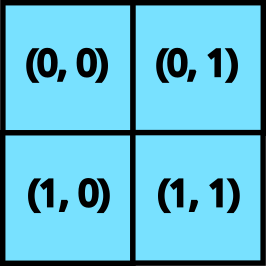
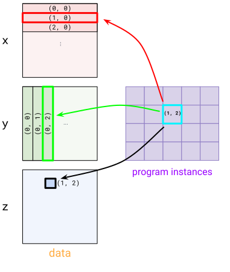

# Pallas 快速入门

## 目录

- [Pallas 中的 Hello World](#pallas-中的-hello-world)
- [Pallas 编程模型](#pallas-编程模型)
  - [Grid 示例](#grid-示例)
  - [Grid 语义](#grid-语义)
  - [BlockSpec 示例](#blockspec-示例)

---

Pallas 是 JAX 的一个扩展，能够为 GPU 和 TPU 编写自定义内核。Pallas 允许你使用相同的 JAX 函数和 API，但在 _更低_ 的抽象层级上操作。

具体来说，Pallas 要求用户考虑内存访问以及如何将计算划分到硬件加速器的多个计算单元上。在 GPU 上，Pallas 下降到 Mosaic GPU；在 TPU 上，Pallas 下降到 Mosaic。

让我们深入一些示例。

> **注意**：Pallas 仍然是一个实验性 API，你可能会因为变更而受到影响！

> **注意**：使用 Mosaic GPU 后端时，仅支持 Hopper 及更新的 GPU。

> **注意**：GPU 上还存在一个 Triton 后端，但它仅以尽力而为的方式维护，不推荐使用。Triton 后端支持 Ampere 及以上的 GPU。

## Pallas 中的 Hello World

```python
from functools import partial

import jax
from jax.experimental import pallas as pl
import jax.numpy as jnp
import numpy as np
```

我们将首先在 Pallas 中编写 "hello world"——一个将两个向量相加的内核。

```python
def add_vectors_kernel(x_ref, y_ref, o_ref):
  x, y = x_ref[...], y_ref[...]
  o_ref[...] = x + y
```

**`Ref` 类型**

让我们来剖析一下这个函数。与你可能编写过的大多数 JAX 函数不同，它不接受 `jax.Array` 作为输入，也不返回任何值。相反，它接受 _`Ref`_ 对象作为输入，这些对象代表内存中的可变缓冲区。注意我们也没有任何输出，但我们被给了一个 `o_ref`，它对应于期望的输出。

**从 `Ref` 读取**

在函数体中，我们首先从 `x_ref` 和 `y_ref` 中读取，通过 `[...]` 表示（省略号意味着我们正在读取整个 `Ref`；另外我们也可以使用 `x_ref[:]`）。以这种方式从 `Ref` 读取会返回一个 `jax.Array`。

**向 `Ref` 写入**

然后我们将 `x + y` 写入 `o_ref`。变异在 JAX 中历来不被支持——`jax.Array` 是不可变的！`Ref` 是新的（实验性）类型，允许在某些情况下进行变异。我们可以将写入 `Ref` 解释为修改其底层缓冲区。

**使用 `.at` 对 `Ref` 进行索引和切片**

除了通过引用访问整个底层缓冲区外，还可以使用 `.at` 属性仅访问一个切片。使用 `x_ref.at[slice]` 不会立即读取或写入数据；它创建一个指向原始缓冲区切片的新 `Ref` 对象。例如 `ref.at[0:128]` 创建前 128 个元素的视图；`ref.at[::2]` 创建一个步长视图。

一旦你有了一个表示切片的新 `Ref`，你可以用通常的语法读取或写入它。这是一个简单的示例：

```python
def add_sliced_kernel(x_ref, y_ref, o_ref):
  small_mid = x_ref.shape[0] // 2

  x_left = x_ref.at[:small_mid]
  x_right = x_ref.at[small_mid:]
  y_left = y_ref.at[:small_mid]
  y_right = y_ref.at[small_mid:]

  # 输出形状为 (4*small_mid)。
  large_mid = 2*small_mid
  o_ref.at[:large_mid][:small_mid] = x_left[...] + y_left[...]
  o_ref.at[:large_mid][small_mid:] = x_left[...] + y_right[...]
  o_ref.at[large_mid:][:small_mid] = x_right[...] + y_left[...]
  o_ref.at[large_mid:][small_mid:] = x_right[...] + y_right[...]
```

注意使用 `x_ref.at[slice][...]` 等同于 `x_ref[slice]`。`.at` 在你想组合多个切片（例如 `x_ref.at[block_slice][thread_slice]`）或者需要将切片传递给接受 `Ref` 的子内核函数时很有用。

所以我们写了一个我们称之为"内核"的东西，我们将其定义为在加速器上作为原子执行单元运行的程序，不与主机有任何交互。我们如何从 JAX 计算中调用它？我们使用 `pallas_call` 高阶函数。

```python
@jax.jit
def add_vectors(x: jax.Array, y: jax.Array) -> jax.Array:
  return pl.pallas_call(
      add_vectors_kernel,
      out_shape=jax.ShapeDtypeStruct(x.shape, x.dtype)
  )(x, y)
add_vectors(jnp.arange(8), jnp.arange(8))
```

```
Array([ 0,  2,  4,  6,  8, 10, 12, 14], dtype=int32)
```

`pallas_call` 将 Pallas 内核函数提升为一个可以作为更大 JAX 程序一部分调用的操作。但是，为此它需要一些额外的细节。这里我们指定了 `out_shape`，一个具有 `.shape` 和 `.dtype`（或其列表）的对象。`out_shape` 决定了我们的 `add_vector_kernel` 中 `o_ref` 的形状/数据类型。

`pallas_call` 返回一个接受并返回 `jax.Array` 的函数。

**这里到底发生了什么？**

到目前为止，我们已经描述了如何思考 Pallas 内核，但我们实际上完成的是我们正在编写一个非常接近计算单元执行的函数，因为值被加载到内存层次结构的最内层（最快的）部分。

在 GPU 上，`x_ref` 对应于高带宽内存（HBM）中的值，当我们执行 `x_ref[...]` 时，我们正在将值从 HBM 复制到静态 RAM（SRAM）中（一般来说这是一个代价高昂的操作！）。然后我们使用 GPU 向量计算执行加法，然后将 SRAM 中的结果值复制回 HBM。

在 TPU 上，我们做的事情略有不同。在内核执行之前，我们将值从 HBM 取到 SRAM。因此 `x_ref` 对应于 SRAM 中的值，当我们执行 `x_ref[...]` 时，我们正在将值从 SRAM 复制到寄存器中。然后我们使用 TPU 向量计算执行加法，然后将结果值复制回 SRAM。内核执行完成后，SRAM 值被复制回 HBM。

我们正在编写针对特定后端的 Pallas 指南。敬请期待！

## Pallas 编程模型

在我们的 "hello world" 示例中，我们编写了一个非常简单的内核。它利用了我们的 8 大小的数组可以轻松放入硬件加速器 SRAM 中的事实。在大多数现实世界的应用中，情况不会如此！

编写 Pallas 内核的一部分工作是思考如何获取驻留在高带宽内存（HBM，也称为 DRAM）中的大数组，并表达对这些数组中能放入 SRAM 的"块"进行操作的计算。

### Grid 示例

要自动"切分"输入和输出，你需要向 `pallas_call` 提供 `grid` 和 `BlockSpec`。

`grid` 是一个整数元组（例如 `()`、`(2, 3, 4)` 或 `(8,)`），指定一个迭代空间。例如，grid `(4, 5)` 将有 20 个元素：`(0, 0), (0, 1), ..., (0, 4), (1, 0), ..., (3, 4)`。我们为每个元素运行一次内核函数，这是一种单程序多数据（SPMD）编程风格。



一个 2D grid

当我们向 `pallas_call` 提供 `grid` 时，内核被执行 `prod(grid)` 次。每次调用被称为一个"程序"。要访问内核当前正在执行的是哪个程序（即 grid 的哪个元素），我们使用 `program_id(axis=...)`。例如，对于调用 `(1, 2)`，`program_id(axis=0)` 返回 `1`，`program_id(axis=1)` 返回 `2`。

这是一个使用 `grid` 和 `program_id` 的示例内核。

```python
def iota_kernel(o_ref):
  i = pl.program_id(0)
  o_ref[i] = i
```

我们现在使用带有额外 `grid` 参数的 `pallas_call` 来执行它。在 GPU 上，我们可以直接这样调用内核：

```python
# GPU 版本
def iota(size: int):
  return pl.pallas_call(iota_kernel,
                        out_shape=jax.ShapeDtypeStruct((size,), jnp.int32),
                        grid=(size,))()
iota(8)
```

```
Array([0, 1, 2, 3, 4, 5, 6, 7], dtype=int32)
```

TPU 区分向量和标量内存空间，在这种情况下，输出必须放置在标量内存（`MemorySpace.SMEM`）中，因为 `i` 是一个标量。更多详情请阅读 [TPU 及其内存空间](pallas_tpu_pipelining_cn.md#tpu-及其内存空间)。要在 TPU 上调用上述内核，运行：

```python
# TPU 版本
from jax.experimental.pallas import tpu as pltpu

def iota(size: int):
  return pl.pallas_call(iota_kernel,
                        out_specs=pl.BlockSpec(memory_space=pltpu.SMEM),
                        out_shape=jax.ShapeDtypeStruct((size,), jnp.int32),
                        grid=(size,))()
iota(8)
```

### Grid 语义

在 GPU 上，每个程序在独立的线程上并行执行。因此，我们需要考虑对 HBM 写入的竞争条件。一个合理的方法是编写内核，使不同程序写入 HBM 中的不相交位置，以避免这些并行写入。另一方面，并行化计算是我们能够快速执行矩阵乘法等操作的方式。

相比之下，TPU 的运行方式类似于非常宽的 SIMD 机器。某些 TPU 型号包含多个核心，但在许多情况下，TPU 可以被视为单线程处理器。TPU 上的 grid 可以指定为并行和顺序维度的组合，其中顺序维度保证串行运行。

你可以在 [grid，又称循环中的内核](pallas_grid_blockspec_cn.md#grid又称循环中的内核) 和 [值得注意的属性和限制](pallas_tpu_details_cn.md#值得注意的属性和限制) 中阅读更多详情。

### BlockSpec 示例

有了 `grid` 和 `program_id` 的概念，Pallas 提供了一个抽象，处理许多内核中常见的索引模式。为了建立直觉，让我们尝试实现一个矩阵乘法。

在 Pallas 中实现矩阵乘法的一个简单策略是递归实现。我们知道底层硬件支持小型矩阵乘法（使用 GPU 和 TPU 张量核心），所以我们只需用较小的矩阵乘法来表达大的矩阵乘法。

假设我们有输入矩阵 $X$ 和 $Y$，正在计算 $Z = XY$。我们首先将 $X$ 和 $Y$ 表示为分块矩阵。$X$ 将有"行"块，$Y$ 将有"列"块。

$$
X = \begin{bmatrix} X_0 \\ X_1 \end{bmatrix}
$$

$$
Y = \begin{bmatrix} Y_0 & Y_1 \end{bmatrix}
$$

$$
Z = \begin{bmatrix} X_0 \\ X_1 \end{bmatrix} \begin{bmatrix} Y_0 & Y_1 \end{bmatrix} = \begin{bmatrix} X_0 Y_0 & X_0 Y_1 \\ X_1 Y_0 & X_1 Y_1 \end{bmatrix}
$$

我们的策略是，因为 $Z$ 也是一个分块矩阵，我们可以将 Pallas 内核中的每个程序分配给一个输出块。计算每个输出块对应于在 $X$ 的一个"行"块和 $Y$ 的一个"列"块之间进行较小的矩阵乘法。

为了表达这个模式，我们使用 `BlockSpec`。`BlockSpec` 为每个输入和输出指定块形状，以及一个"索引映射"函数，将一组程序索引映射到块索引。



`BlockSpec` 的可视化

作为一个具体的例子，假设我们想将两个 `(1024, 1024)` 矩阵 `x` 和 `y` 相乘得到 `z`，并希望将计算并行化为 4 路。我们将 `z` 分成 4 个 `(512, 512)` 块，每个块通过 `(512, 1024) x (1024, 512)` 矩阵乘法计算。为了表达这一点，我们首先使用 `(2, 2)` grid（每个程序一个块）。

对于 `x`，我们使用 `BlockSpec((512, 1024), lambda i, j: (i, 0))`——这将 `x` 切分成"行"块。要理解这一点，看看程序实例 `(1, 0)` 和 `(1, 1)` 如何都选择 `x` 中的 `(1, 0)` 块。对于 `y`，我们使用转置版本 `BlockSpec((1024, 512), lambda i, j: (0, j))`。最后，对于 `z`，我们使用 `BlockSpec((512, 512), lambda i, j: (i, j))`。

这些 `BlockSpec` 通过 `in_specs` 和 `out_specs` 传递给 `pallas_call`。

有关 `BlockSpec` 的更多详情，请参见 [BlockSpec，又称如何切分输入](pallas_grid_blockspec_cn.md#blockspec又称如何切分输入)。

在底层，`pallas_call` 会自动将你的输入和输出切分成每个块的 `Ref`，然后传递给内核。

```python
def matmul_kernel(x_ref, y_ref, z_ref):
  z_ref[...] = x_ref[...] @ y_ref[...]

def matmul(x: jax.Array, y: jax.Array):
  return pl.pallas_call(
    matmul_kernel,
    out_shape=jax.ShapeDtypeStruct((x.shape[0], y.shape[1]), x.dtype),
    grid=(2, 2),
    in_specs=[
        pl.BlockSpec((x.shape[0] // 2, x.shape[1]), lambda i, j: (i, 0)),
        pl.BlockSpec((y.shape[0], y.shape[1] // 2), lambda i, j: (0, j))
    ],
    out_specs=pl.BlockSpec(
        (x.shape[0] // 2, y.shape[1] // 2), lambda i, j: (i, j),
    )
  )(x, y)
k1, k2 = jax.random.split(jax.random.key(0))
x = jax.random.normal(k1, (1024, 1024))
y = jax.random.normal(k2, (1024, 1024))
z = matmul(x, y)
np.testing.assert_allclose(z, x @ y)
```

注意这是一个非常朴素的矩阵乘法实现，但可以将其视为各种优化的起点。让我们为矩阵乘法添加一个额外功能：融合激活。这实际上非常简单！只需将一个高阶激活函数传入内核。

```python
def matmul_kernel(x_ref, y_ref, z_ref, *, activation):
  z_ref[...] = activation(x_ref[...] @ y_ref[...])

def matmul(x: jax.Array, y: jax.Array, *, activation):
  return pl.pallas_call(
    partial(matmul_kernel, activation=activation),
    out_shape=jax.ShapeDtypeStruct((x.shape[0], y.shape[1]), x.dtype),
    grid=(2, 2),
    in_specs=[
        pl.BlockSpec((x.shape[0] // 2, x.shape[1]), lambda i, j: (i, 0)),
        pl.BlockSpec((y.shape[0], y.shape[1] // 2), lambda i, j: (0, j))
    ],
    out_specs=pl.BlockSpec(
        (x.shape[0] // 2, y.shape[1] // 2), lambda i, j: (i, j)
    ),
  )(x, y)
k1, k2 = jax.random.split(jax.random.key(0))
x = jax.random.normal(k1, (1024, 1024))
y = jax.random.normal(k2, (1024, 1024))
z = matmul(x, y, activation=jax.nn.relu)
np.testing.assert_allclose(z, jax.nn.relu(x @ y))
```

最后，让我们强调 Pallas 的一个很酷的特性：它可以与 `jax.vmap` 组合！要将这个矩阵乘法变成批量版本，我们只需要 `vmap` 它。

```python
k1, k2 = jax.random.split(jax.random.key(0))
x = jax.random.normal(k1, (4, 1024, 1024))
y = jax.random.normal(k2, (4, 1024, 1024))
z = jax.vmap(partial(matmul, activation=jax.nn.relu))(x, y)
np.testing.assert_allclose(z, jax.nn.relu(jax.vmap(jnp.matmul)(x, y)))
```
