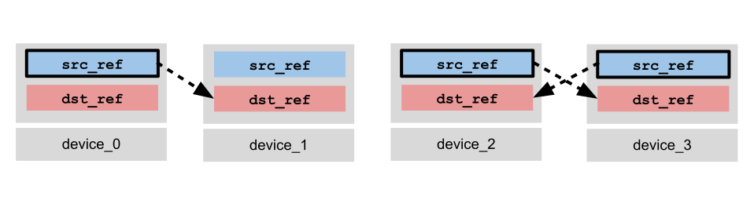
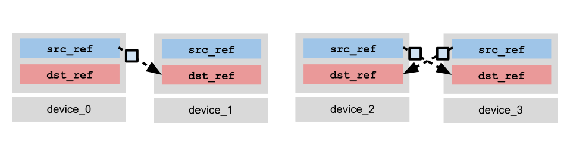
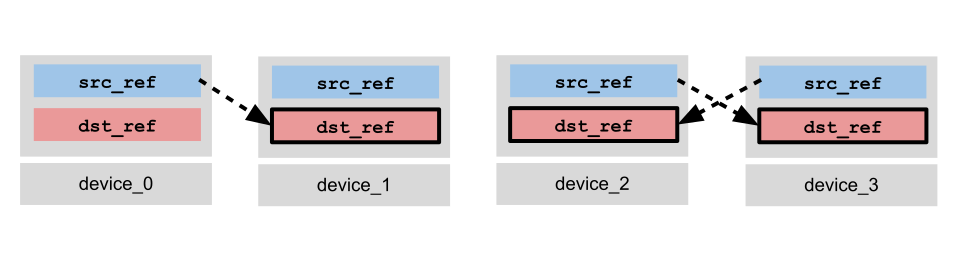
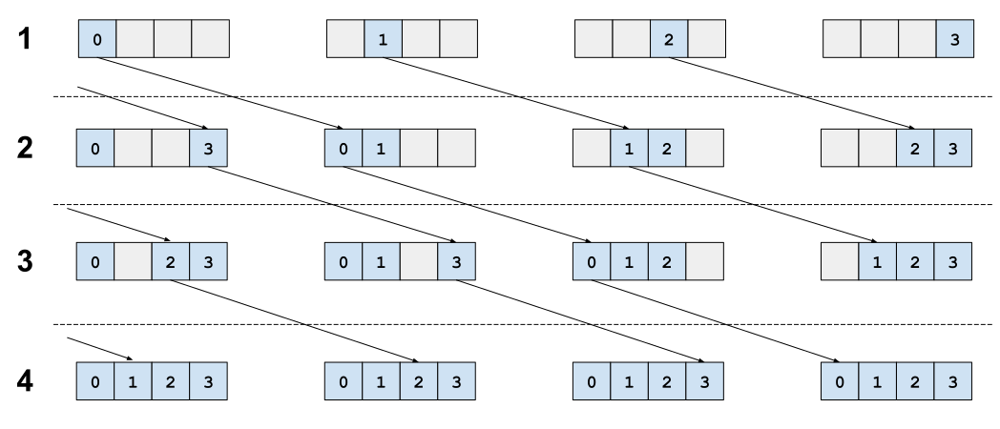
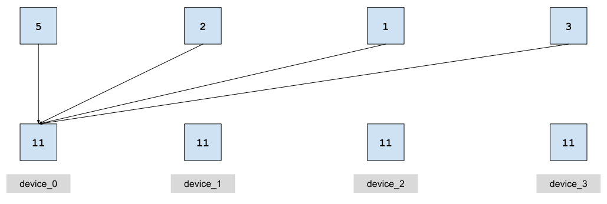
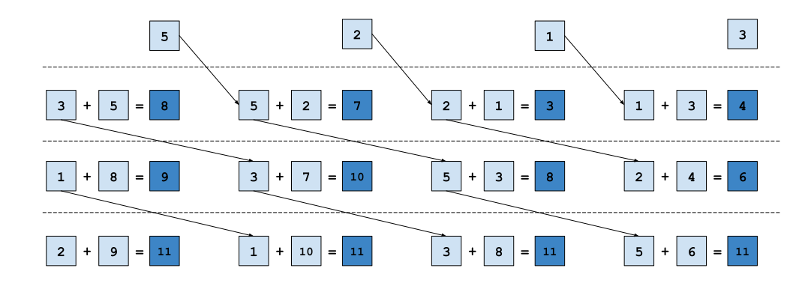
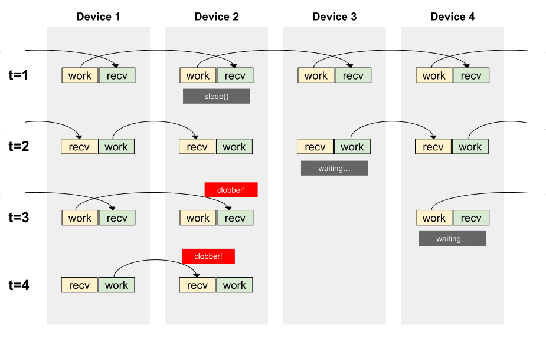
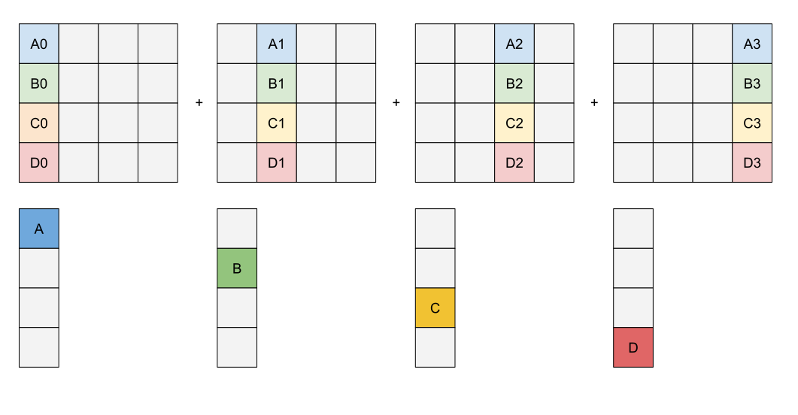
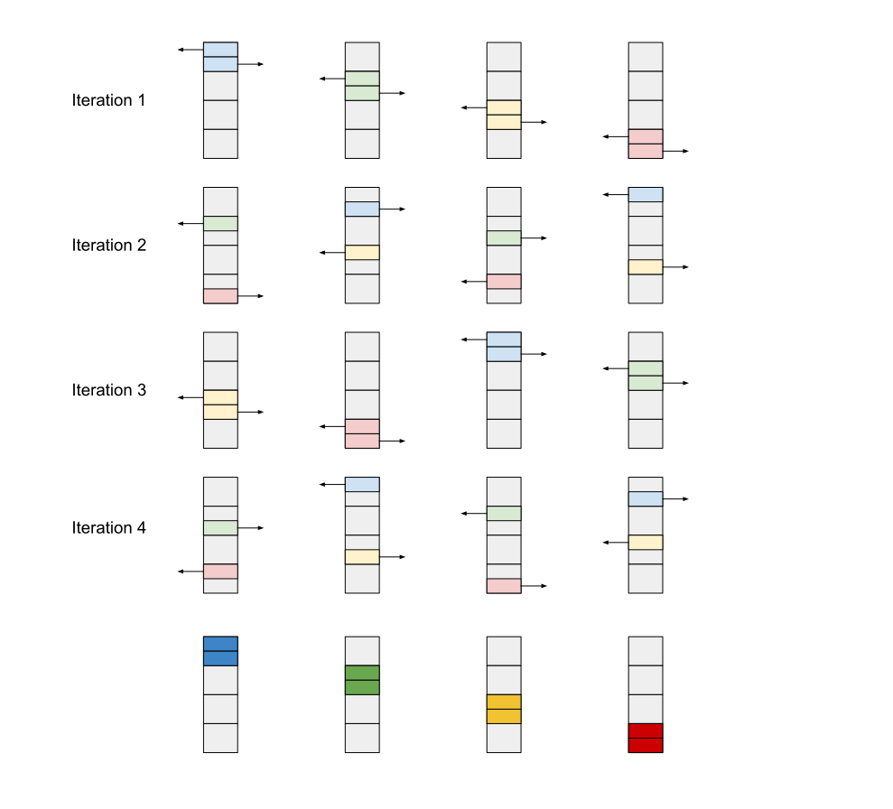

# TPU 上的 Pallas 分布式计算

## 目录

- [TPU 拓扑结构](#tpu-拓扑结构)
- [远程直接内存访问 (RDMA) 模型](#远程直接内存访问-rdma-模型)
  - [异步远程复制操作](#异步远程复制操作)
  - [DMA 信号量](#dma-信号量)
  - [路由](#路由)
  - [故障模式](#故障模式)
  - [示例：右移排列 (`lax.ppermute`)](#示例右移排列-laxppermute)
  - [示例：All-gather (`lax.all_gather`)](#示例all-gather-laxall_gather)
    - [环形通信模式](#环形通信模式)
- [高级技术](#高级技术)
  - [同步：Regular 和 Barrier 信号量](#同步regular-和-barrier-信号量)
    - [Regular 信号量](#regular-信号量)
    - [Barrier 信号量](#barrier-信号量)
  - [双缓冲](#双缓冲)
  - [示例：All-Reduce Sum (`lax.psum`)](#示例all-reduce-sum-laxpsum)
    - [完整实现](#完整实现)
  - [超前执行与竞争条件](#超前执行与竞争条件)
  - [双向通信](#双向通信)
  - [示例：双向 Reduce-Scatter (`lax.psum_scatter`)](#示例双向-reduce-scatter-laxpsum_scatter)
  - [嵌套远程与本地 DMA 流水线](#嵌套远程与本地-dma-流水线)
  - [示例：使用大 HBM 块的 Reduce-Scatter](#示例使用大-hbm-块的-reduce-scatter)
- [总结说明](#总结说明)
  - [Megacore](#megacore)
  - [与 XLA 的交互](#与-xla-的交互)
  - [后续步骤](#后续步骤)

---

在本教程中，我们将介绍在 TPU 上使用 Pallas 进行分布式计算的基础知识。我们将学习 TPU 拓扑结构、使用远程 DMA 原语进行通信，以及如何通过 `jax.shard_map` 从 JAX 调用分布式 kernel。我们还将介绍一些更高级的 kernel 编写技术，例如双缓冲、双向带宽优化和嵌套流水线。作为教学示例，我们将学习如何实现 JAX 中的各种集合通信原语，如 `lax.ppermute`、`lax.all_gather`、`lax.psum` 和 `lax.psum_scatter`。

推荐预先阅读：

  * [TPU 上的 Pallas 流水线](pallas_tpu_pipelining_cn.md)

  * [使用 `jax.shard_map` 进行集合通信](../../notebooks/shard_map.html#shard-map-collectives-tutorial)

```python
import functools
import jax
from jax import lax
from jax import numpy as jnp
from jax.experimental import pallas as pl
from jax.experimental.pallas import tpu as pltpu

P = jax.sharding.PartitionSpec

num_devices = jax.local_device_count()
assert num_devices > 1, "Please run this notebook with more than one device."
assert "TPU" in jax.devices()[0].device_kind, "Please run this notebook with TPU devices."
print(f"Running with {num_devices} {jax.devices()[0].device_kind} devices.")
```

```
Running with 4 TPU v4 devices.
```

## TPU 拓扑结构

TPU 通常以 Pod 的形式部署，多个设备通过高带宽芯片间互连 (ICI) 连接，Pod 内的通信速度远快于典型的网络连接。例如，[TPU v5p](https://cloud.google.com/tpu/docs/v5p) 的规格表显示每个芯片的 ICI 带宽为 4.8Tb/s（作为参考，TPU v5p 的_本地_ HBM 带宽为 21Tb/s）。ICI 使我们能够实现快速、高性能的分布式 kernel，这些 kernel 需要 Pod 内的高带宽通信，并使用数据中心网络来并行化带宽需求较低的操作，例如在 batch 维度上的数据并行。

TPU Pod 通常以 ND 环面（torus）拓扑排列。下图给出了几种不同大小配置的示例。


将其展平为图形后，环面可以如下可视化。每条边（橙色或黑色）是两个设备之间的双向连接。你通常会听到关于设备拓扑中"环"的讨论——环面的一个关键特性是，当沿 Pod 的某个轴取一个切片时，例如节点 `[(0,1), (1, 1), (2, 1), (3, 1)]` 或 `[(0, 1), (1, 1)]`，我们会得到一个设备环。这是一个我们可以用来简化 Pod 内通信模式的特性。


## 远程直接内存访问 (RDMA) 模型

TPU 通过一种被称为远程直接内存访问 (RDMA) 的"推送专用"模型进行通信。TPU 可以发出复制指令，将数据从本地缓冲区推送到同一 Pod 内任何其他设备上的缓冲区，该指令相对于主程序线程异步执行。但是，TPU 只能读取本地存储的数据。这与更传统的多核编程不同，在传统模型中可以对共享内存进行读取和写入。

### 异步远程复制操作

`pltpu.make_async_remote_copy` 函数用于创建一个远程 DMA 描述符对象，它同时参数化了"发送"操作和"接收"操作。以下是其签名：

```python
 def make_async_remote_copy(
     src_ref: Ref,
     dst_ref: Ref,
     send_sem: Ref[SemaphoreType],
     recv_sem: Ref[SemaphoreType],
     device_id: int | tuple[int, ...],
     device_id_type: DeviceIdType
 ) -> AsyncCopyDescriptor:
```

  * `src_ref` 是本地 `Ref`（在任意内存空间中），包含你希望发送到另一个设备上 `dst_ref` 的数据。

  * `dst_ref` 是远程 `Ref`（在任意内存空间中），数据将被复制到目标设备上的该位置。

  * `send_sem` 是一个 DMA 信号量，用于阻塞直到所有数据已从 `src_ref` 发送完毕。

  * `recv_sem` 是一个 DMA 信号量，用于阻塞直到预期字节数已到达 `dst_ref`。DMA 的发送方会写入接收方的 `recv_sem`。

  * `device_id` 是要发送到的目标设备的设备 ID。

  * `device_id_type` 指定 `device_id` 的格式，可以是 LOGICAL 格式（整数设备 ID）或 MESH 格式（逻辑设备 mesh 的 ND 元组索引）。默认模式为 MESH。

`make_async_remote_copy` 返回一个描述符对象，你可以使用 `.start()` 方法启动 DMA，使用 `.wait_send()` 在 `send_sem` 上阻塞，使用 `.wait_recv()` 在 `recv_sem` 上阻塞（或使用 `.wait()` 同时等待两者）。如果一个设备只需要发送数据，只调用 `.start()` 和 `.wait_send()` 即可；同样，如果一个设备只接收数据，只调用 `.wait_recv()` 即可。如果使用 SPMD 模式且所有设备都执行 DMA，每个设备通常会同时调用 `.start()` 和 `.wait()`。

```python
dma_descriptor = make_async_remote_copy(src_ref, dst_ref, send_sem, recv_sem, device_id)
dma_descriptor.start() # 启动 DMA（非阻塞）。
# ... 执行其他工作
dma_descriptor.wait_send() # 阻塞直到所有数据已发送。
dma_descriptor.wait_recv() # 阻塞直到所有数据已接收。
```

举个例子，让我们可视化一个涉及 4 个设备（编号 0、1、2、3）的 DMA。我们考虑一种方案：设备 0 复制到设备 1，设备 2 和 3 互相复制。在实践中，我们可以通过使用 `@pl.when` 根据设备 ID 进行分支来创建这种非对称通信模式。

(1) 每个设备创建 DMA 描述符。设备 0、2 和 3 调用 `.start()` 从 `src_ref` 启动 DMA。设备 1 跳过 `.start()` 且不执行任何操作，例如通过使用 `pl.when`。



(2) 由于 `.start()` 是非阻塞的，每个设备可以在 DMA 传输过程中自由进行其他计算。设备 0、2 和 3 调用 `.wait_send()` 等待 `send_sem`，该操作会阻塞直到所有数据发送完毕。



(3) 最后，设备 1、2 和 3 将调用 `.wait_recv()` 等待 `recv_sem`，直到所有数据到达 `dst_ref`。



上述通信模式可以编写如下：

```python
def example_kernel(input_ref, output_ref, send_sem, recv_sem):
    device_id = lax.axis_index('x')
    copy_0_to_1 = pltpu.make_async_remote_copy(
        src_ref=input_ref,
        dst_ref=output_ref,
        send_sem=send_sem,
        recv_sem=recv_sem,
        device_id=1,
    )
    copy_2_to_3 = pltpu.make_async_remote_copy(
        src_ref=input_ref,
        dst_ref=output_ref,
        send_sem=send_sem,
        recv_sem=recv_sem,
        device_id=3,
    )
    copy_3_to_2 = pltpu.make_async_remote_copy(
        src_ref=input_ref,
        dst_ref=output_ref,
        send_sem=send_sem,
        recv_sem=recv_sem,
        device_id=2,
    )
    @pl.when(device_id == 0)
    def _():
      copy_0_to_1.start()
      copy_0_to_1.wait_send()
    @pl.when(device_id == 1)
    def _():
      copy_0_to_1.wait_recv()
    @pl.when(device_id == 2)
    def _():
      copy_2_to_3.start()
      copy_2_to_3.wait_send()
      copy_3_to_2.wait_recv()
    @pl.when(device_id == 3)
    def _():
      copy_3_to_2.start()
      copy_3_to_2.wait_send()
      copy_2_to_3.wait_recv()
```

### DMA 信号量

`send_sem` 和 `recv_sem` 是一种特殊类型的信号量实例，专门用于 DMA。在向 `pallas_call` 指定输入规格时，必须使用 `tpu.SemaphoreType.DMA` 类型来分配它们。

在内部，DMA 信号量可以被视为整数值的进度追踪器。在 DMA 启动时，本地设备将开始异步递增 `send_sem` 的值和接收方的 `recv_sem` 的值。等待信号量将阻塞直到信号量的值达到发送/接收的总字节数；当达到该值时，等待中的线程被释放，信号量的值将减少相同的量。这意味着所有数据已发送（对于 `send_sem`）或所有数据已接收（对于 `recv_sem`）。信号量的值可以通过 `pl.semaphore_read` 读取，但请注意底层值的语义可能在不同硬件代际之间发生变化（例如，该值可能并不完全代表已发送的字节数，尽管在推理信号量行为时这是一个有用的心智模型）。

### 路由

发送方可以向同一 Pod 内的任何接收方发送数据，即使它们之间没有直接连接（TPU v5e 是例外，设备只能路由到距自身 2 的幂次偏移的设备）。TPU 有内部路由机制，可以沿到达目的地的路径将数据传递给下一个设备。但是，不建议以这种方式通信，因为作为 kernel 编写者你无法控制网络争用。本教程中涵盖的示例通过仅向相邻设备传输数据来最小化低效通信。

### 故障模式

如果不正确使用远程 DMA，你可能会遇到几种难以调试的故障模式。有缺陷的 DMA 使用的一般症状包括崩溃、挂起或静默数据损坏：

  * 如果信号量在程序退出时具有无效的非零值，Pallas 将崩溃并退出程序。

  * 如果等待信号量但接收的字节数不足（即没有发送方，或发送的数据小于接收设备上 `dst_ref` 的大小），程序可能会无限挂起，等待永远不会发送的字节。在这种情况下，需要重启程序。

  * 如果遇到竞争条件，两个同时写入或同时读写可能导致静默数据损坏。

一些常见原因包括：

  * 如果设备调用 `.wait_recv()` 但没有其他设备向其发送数据，kernel 可能会挂起。

  * 如果设备收到的字节数超过预期接收量，也可能因非零信号量状态而崩溃。如果收到的字节数不足，则可能无限挂起。

  * 如果 DMA 已启动但信号量未被等待，程序可能因非零信号量状态而崩溃。

  * 如果两个设备复制到同一目标，可能会因竞争条件而遇到不确定性结果，或因非零信号量状态而崩溃。

### 示例：右移排列 (`lax.ppermute`)

让我们看一个非常基础的示例。我们将实现一个执行右移排列的 kernel，其中每个设备将其数据切片发送给右邻居。

假设我们有一个包含 512 个元素的数组，将其分片为大小为 128 的切片分布在 4 个设备上。每个设备将其切片传递给下一个设备，输出将包含相同的数据，但切片旋转了 1 位。这与 `lax.ppermute` 操作相同，其中排列设置为 `(n, (n+1) % 4)`。

为了以分布式模式调用 kernel，我们将 `pallas_call` 包装在 `shard_map` 变换中。从那里开始，我们可以像编写普通单设备 Pallas kernel 一样编写 kernel，只是现在我们可以访问远程 DMA 指令。JAX 集合通信原语（如 `lax.axis_index`）可用于获取 `device_id`，该 ID 可用于通过引用传递给 `shard_map` 的相同命名轴名称来计算要复制到的目标设备。

```python
partition = P(None, 'x')
mesh = jax.make_mesh((num_devices,), ('x',))
sharding = jax.sharding.NamedSharding(mesh, partition)

# 创建一个将最后一个维度跨所有设备分片的输入数组。
input_arr = jax.random.uniform(jax.random.key(0), (8, 128 * num_devices))
input_arr = jax.device_put(input_arr, sharding)


def right_permute_kernel(input_ref, output_ref, send_sem, recv_sem):
  my_id = lax.axis_index('x')
  right_neighbor = lax.rem(my_id + 1, num_devices)
  remote_copy_op = pltpu.make_async_remote_copy(
      src_ref=input_ref,
      dst_ref=output_ref,
      send_sem=send_sem,
      recv_sem=recv_sem,
      device_id=(right_neighbor,),
      device_id_type=pl.DeviceIdType.MESH,
  )
  remote_copy_op.start()
  remote_copy_op.wait()


out_shape = jax.ShapeDtypeStruct((8, 128), jnp.float32)
grid_spec = pltpu.PrefetchScalarGridSpec(
    num_scalar_prefetch=0,
    # MemorySpace.ANY 通常会将 tensor 放置在 HBM 中。
    in_specs=[
        pl.BlockSpec(memory_space=pl.ANY),
    ],
    out_specs=pl.BlockSpec(memory_space=pl.ANY),
    scratch_shapes=(
        # 我们在 scratch 内存中分配 DMA 信号量。
        [pltpu.SemaphoreType.DMA] * 2
    ),
)
right_permute = pl.pallas_call(
    right_permute_kernel,
    out_shape=out_shape,
    grid_spec=grid_spec,
)
# 将 kernel 包装在 shard_map 中来调用。
pallas_result = jax.jit(
    jax.shard_map(
        right_permute,
        mesh=mesh,
        in_specs=partition,
        out_specs=partition,
        check_vma=False,
    )
)(input_arr)

# 将 Pallas 结果与 XLA shard_map 结果进行比较。
perm = tuple((src, (src + 1) % num_devices) for src in range(num_devices))

xla_result = jax.jit(
    jax.shard_map(
        lambda x: lax.ppermute(x, 'x', perm),
        mesh=mesh, in_specs=partition, out_specs=partition)
)(input_arr)

print('Input = ', input_arr[0, ::128])
print('Pallas Result = ', pallas_result[0, ::128])
print('lax.ppermute Result = ', xla_result[0, ::128])
print(
    'Difference |Pallas - lax.ppermute| = ',
    jnp.mean(jnp.abs(pallas_result - xla_result)),
)
```

```
Input =  [0.9858954  0.11763906 0.9955574  0.775211  ]
Pallas Result =  [0.775211   0.9858954  0.11763906 0.9955574 ]
lax.ppermute Result =  [0.775211   0.9858954  0.11763906 0.9955574 ]
Difference |Pallas - lax.ppermute| =  0.0
```

### 示例：All-gather (`lax.all_gather`)

在下一个示例中，我们将实现 all-gather 集合通信操作，JAX 中对应的操作为 `lax.all_gather`。与上面的右移排列示例只涉及一对源和目标邻居不同，all-gather 操作需要所有设备之间的通信，因此我们必须考虑数据如何在它们之间路由。具体实现方式由设备拓扑决定，这里我们假设为环形拓扑。

#### 环形通信模式

我们将基于环形拓扑编写 kernel。环形拓扑天然适合 TPU，因为沿环面的任何维度切片都会产生一个环。在编写集合通信操作时，我们通常只需要一次考虑环面的一维切片，因为环面的不同维度被保留用于不同类型的并行（例如数据并行 vs. 模型并行）。

我们将使用的策略是编写一个循环 kernel，其中每次迭代时设备从左邻居接收一个分片数组的切片，并将之前接收的切片复制给右邻居。经过 `num_devices` 次迭代后，每个设备的本地 HBM 中将拥有完整数组的副本。



我们可以复用 Pallas 的 `grid` 参数来实现循环。我们不再像之前的教程中那样迭代数组的 tile，而是将 grid 设置为 `(num_devices,)` 以表示我们要循环遍历设备数量，并在 Pallas kernel 内部使用 `pl.program_id` 获取循环迭代次数。以下代码片段演示了如何实现：

```python
partition = P('x', None)
mesh = jax.make_mesh((num_devices,), ('x',))
sharding = jax.sharding.NamedSharding(mesh, partition)

# 创建一个将第一个维度跨所有设备分片的输入数组。
input_arr = jax.random.uniform(jax.random.key(0), (8 * num_devices, 128))
input_arr = jax.device_put(input_arr, sharding)


def all_gather_kernel(input_ref,
                      output_ref,
                      local_copy_sem,
                      send_sem,
                      recv_sems):
  outer_step = pl.program_id(0)
  my_id = lax.axis_index('x')
  right_neighbor = lax.rem(my_id + 1, num_devices)
  copy_slot = my_id - outer_step
  copy_slot = lax.rem(copy_slot + num_devices, num_devices)

  @pl.when(outer_step == 0)
  def _():
    local_copy_op = pltpu.make_async_copy(
      src_ref=input_ref,
      dst_ref=output_ref.at[my_id],
      sem=local_copy_sem,
    )
    local_copy_op.start()
    local_copy_op.wait()

  # 复制到右邻居。
  # 注意，我们也会从左邻居接收数据，
  # 但位于 `copy_slot-1` 而不是 `copy_slot`！这利用了
  # 远程 DMA 的索引不需要在源和目标之间对称的特性。
  remote_copy_op = pltpu.make_async_remote_copy(
      src_ref=output_ref.at[copy_slot],
      dst_ref=output_ref.at[copy_slot],
      send_sem=send_sem,
      recv_sem=recv_sems.at[outer_step],
      device_id=(right_neighbor,),
      device_id_type=pl.DeviceIdType.MESH,
  )
  remote_copy_op.start()
  remote_copy_op.wait()

out_shape = jax.ShapeDtypeStruct((num_devices, 8, 128), jnp.float32)
grid_spec = pltpu.PrefetchScalarGridSpec(
            num_scalar_prefetch=0,
            in_specs=[
                # MemorySpace.ANY 通常会将 tensor 放置在 HBM 中。
                pl.BlockSpec(memory_space=pl.ANY),
            ],
            out_specs=pl.BlockSpec(memory_space=pl.ANY),
            scratch_shapes=(
              # DMA 信号量在 scratch 内存中分配。
              # 我们分配一个信号量用于本地 HBM-VMEM 复制，
              # 一个用于远程发送信号量。
              [pltpu.SemaphoreType.DMA] * 2
              # 我们另外为每个设备分配一个接收信号量。
              # 这是为了避免多个 DMA 同时在传输中的情况，
              # 因为我们不希望在多个 DMA 之间共享接收信号量。
              + [pltpu.SemaphoreType.DMA((num_devices-1,))]

            ),
            grid=(num_devices-1,)
        )

all_gather = pl.pallas_call(
      all_gather_kernel,
      out_shape=out_shape,
      grid_spec=grid_spec,
  )

# 将 kernel 包装在 shard_map 中来调用。
pallas_result = jax.jit(
      jax.shard_map(
          all_gather,
          mesh=mesh,
          in_specs=partition,
          out_specs=partition,
          check_vma=False
      )
)(input_arr)

# 将 Pallas 结果与 XLA shard_map 结果进行比较。
xla_result = jax.jit(
    jax.shard_map(
        lambda x: lax.all_gather(x, 'x'),
        mesh=mesh, in_specs=partition, out_specs=partition
    )
)(input_arr)

print('Input: ', input_arr.shape, input_arr[::8, 0])
print('Pallas Result: ', pallas_result.shape, pallas_result[:, 0, 0])
print('lax.all_gather Result: ', xla_result.shape, xla_result[:, 0, 0])
print('Difference |Pallas - lax.all_gather| = ',
      jnp.mean(jnp.abs(pallas_result - xla_result)))
```

```
Input:  (32, 128) [0.9858954  0.54248166 0.9547038  0.954962  ]
Pallas Result:  (16, 8, 128) [0.9858954  0.54248166 0.9547038  0.954962   0.9858954  0.54248166
 0.9547038  0.954962   0.9858954  0.54248166 0.9547038  0.954962
 0.9858954  0.54248166 0.9547038  0.954962  ]
lax.all_gather Result:  (16, 8, 128) [0.9858954  0.54248166 0.9547038  0.954962   0.9858954  0.54248166
 0.9547038  0.954962   0.9858954  0.54248166 0.9547038  0.954962
 0.9858954  0.54248166 0.9547038  0.954962  ]
Difference |Pallas - lax.all_gather| =  0.0
```

这里值得一提的一个细节是使用了多个接收信号量。因为我们只在接收设备上阻塞，发送方仍然可能在接收方处理完第一个 DMA 之前发送了多个 DMA（参见下一节和 reduce-sum 示例，其中更详细地讨论了竞争条件）。在这种情况下，我们可能遇到同一个信号量同时用于多个 DMA 的情况。为了避免这种情况，我们分配 `num_devices-1` 个信号量，以消除重用的风险。虽然在这样一个小 kernel 中这种竞争条件不太可能发生，但在更大的 kernel 中，设备更有可能失去同步并可能导致静默故障。

## 高级技术

现在我们已经了解了如何使用远程 DMA 操作编写几个基本 kernel，接下来我们将介绍更高级的同步技术和编写高效 kernel 的方法。

### 同步：Regular 和 Barrier 信号量

我们在基础教程中实现的示例不需要特殊的同步处理，因为所有必要的通信都写入不相交的缓冲区。但是，其他操作可能需要更复杂的通信模式，需要额外的同步原语来避免竞争条件。Pallas 提供了两种额外的原语来帮助解决这个问题：regular 信号量和 barrier 信号量。

#### Regular 信号量

Regular 信号量是用于跨多个设备同步的标准工具。信号量本质上是计数器——它们可以被任何设备递增，之后设备可以阻塞直到信号量的值达到特定值（然后递减该值）。

可以在 regular 信号量上使用的三个主要操作是 signal、wait 和 read：

```python
def semaphore_signal(
    sem: Ref[SemaphoreType],
    inc: int,
    device_id: int | tuple[int, ...],
    device_id_type: DeviceIdType
) -> None:
  ... # 将目标设备 `device_id` 上的信号量 `sem` 递增 `inc`。

def semaphore_wait(
    semaphore: Ref[SemaphoreType],
    value: int,
) -> None:
  ... # 阻塞直到本地分配的 `sem` 副本达到 `value`，然后递减 `value` 并继续。

def semaphore_read(
    sem: Ref[SemaphoreType],
) -> jax.Array:
  ...  # 以 `int32[]` 的形式返回 `sem` 的当前值。
```

要使用 regular 信号量，可以像分配 DMA 信号量一样分配它们，但需要指定 `pltpu.SemaphoreType.REGULAR` 而不是 `pltpu.SemaphoreType.DMA`。

信号量在 Pallas 程序结束时必须为零才能成功完成。有两种错误情况可能发生：

  * 如果信号量被过度 signal，程序将以非零 (>0) 信号量结束。在这种情况下，程序将在完成时崩溃。这对调试很有用，因为非零信号量通常意味着程序中存在某个 bug。

  * 如果信号量被过度 wait，程序将在阻塞的 `semaphore_wait` 调用上挂起，等待信号量被递增。在这种情况下，需要重启设备或程序。

#### Barrier 信号量

Barrier 信号量是全局分配的信号量，用于在整个程序中同步设备，确保所有设备都已进入 Pallas kernel。

如果 Pallas kernel 在更大的 XLA 程序上下文中执行，我们需要确保所有通信的设备都已进入 kernel。然而，DMA 和 regular 信号量都是本地作用域的——它们只被已进入 kernel 的其他设备理解。Barrier 信号量作为全局可理解的信号量，无论设备当前在 XLA 程序的哪个位置执行，都可以用于同步。

默认情况下，如果你不指定 barrier 信号量，Pallas 会在程序开头自动插入一个。但是，编写自己的 barrier 信号量可能更高效。Barrier 信号量与 regular 信号量类似，它们是计数器，可以通过 `semaphore_signal` 递增，通过 `semaphore_wait` 递减。它们通过在 kernel 内调用 `get_barrier_semaphore()` 创建。通常，我们在 kernel 开头使用一次 barrier 来与所有通信的设备同步。

```python
from jax.experimental.pallas import tpu as pltpu

def example_kernel(...):
  # 在 kernel 开头使用 barrier 信号量。
  # is_start_of_kernel = ...
  # right_neighbor = ...
  # ...
  @pl.when(is_start_of_kernel)
  def _():
    barrier_sem = pltpu.get_barrier_semaphore()
    # 递增右邻居的信号量。
    pl.semaphore_signal(
          barrier_sem,
          device_id=right_neighbor,
          device_id_type=pl.DeviceIdType.LOGICAL,
    )
    # 等待左邻居递增了你的信号量
    pl.semaphore_wait(barrier_sem, 1)
  # ...
```

使用 barrier 信号量时，必须将 `collective_id` 编译器参数传递给 `pallas_call`，以指定使用哪个 barrier 信号量。TPU 只有少量固定数量的 barrier 信号量可用（通常在 20-30 个左右），因此应谨慎使用。为确保正确性，只有共享相同通信模式的 kernel 才应使用相同的 `collective_id`。例如，如果两个 kernel 只与同一 mesh 轴上的邻居同步，它们可以共享相同的 `collective_id`。但是，如果两个 kernel 沿不同轴同步，它们必须有不同的 `collective_id`。否则可能导致难以调试的竞争条件。

```python
kernel = pl.pallas_call(
      example_kernel,
      ...,
      compiler_params=pltpu.CompilerParams(collective_id=0),
)
```

### 双缓冲

为了避免从一个正在被另一个设备写入的本地 `Ref` 中读取而产生竞争条件，一种有用的技术是"双缓冲"策略，即为每个目标值分配两个 `Ref`。在每次迭代中，一个 `Ref` 将被指定为"工作"槽，另一个将被指定为"接收"槽。设备可以自由使用工作槽进行计算，但只会将数据复制到邻居的接收槽。工作槽和接收槽每次迭代交替，这样一旦复制完成，旧的接收槽就变成新的工作槽，反之亦然。正确使用这种方案，数据永远不会从同一个缓冲区同时被读取和写入。

以下代码骨架演示了双缓冲的使用方式。我们在变量 `iteration` 中维护一个运行中的迭代计数器，`working_slot` 和 `receiving_slot` 每次迭代在 0 和 1 之间交替。`dst_ref` 被分配为双缓冲区，大小为 `[2, ...]`。在每次迭代中，我们使用 `dst_ref.at[working_slot, ...]` 从工作槽读取值并用于计算。同时，我们复制到邻居的 `dst_ref.at[receiving_slot]` 以避免覆盖其 `working_slot` 的值。通过以这种方式构造通信，可以将远程 DMA 的通信延迟与本地计算重叠，同时最小化竞争条件的风险。

```python
def kernel(...):
  # ...
  iteration = pl.program_id(0)
  working_slot = lax.rem(iteration, 2)
  receiving_slot = 1 - working_slot
  # ...

  local_copy_op = pltpu.make_async_copy(
    src_ref=dst_ref.at[working_slot, ...],
    dst_ref=local_scratch_ref,
    sem=local_copy_sem,
  )
  local_copy_op.start()
  remote_copy_op = pltpu.make_async_remote_copy(
    src_ref=src_ref,
    dst_ref=dst_ref.at[receiving_slot, ...],
    send_sem=send_sem,
    recv_sem=recv_sem,
    device_id=target_device,
    device_id_type=pl.DeviceIdType.MESH,
  )
  remote_copy_op.start()

  local_copy_op.wait()
  # ... 在等待 async_copy_op 完成时处理 local_scratch 上的工作。
  remote_copy_op.wait()

```

在同步方面，双缓冲构造在所有设备执行同一次迭代时有效。如果发送方设法比接收方领先一次迭代，它的 `working_slot` 和 `receiving_slot` 索引将与接收方相反，这意味着它可能在接收方读取 `working_slot` 的同时向其中写入。为了避免这种情况，可能需要使用信号量来同步发送方和接收方，或添加额外的缓冲槽（"三缓冲"、"四缓冲"或 N 缓冲），以允许更多的超前执行，但代价是更多的内存。在我们之前的 `all_gather` 示例中，请注意 kernel 包含了一个具有 N 个槽的接收缓冲区，这完全避免了竞争条件。在下一个 kernel 中，我们将通过一个使用双缓冲加显式同步的示例来说明。

### 示例：All-Reduce Sum (`lax.psum`)

现在我们将使用双缓冲和信号量同步来实现一个 all-reduce sum kernel。对于熟悉 JAX 中集合通信操作的读者，等效操作是 `lax.psum`。All-reduce 是一种标准的集合通信操作，其目标是沿数组的某个轴进行规约，但数组分片在多个设备上。



在上面的例子中，数组 [5, 2, 1, 3] 分片在 4 个设备上。All-reduce sum 操作会对所有值求和并在每个设备上复制结果，得到分布在所有 4 个设备上的结果 [11, 11, 11, 11]。

朴素的 all-reduce 实现是将所有需要的值收集到每个设备上，然后进行规约。但是，我们可以通过将通信与计算交织来提高此实现的性能。交织的单方向 all-reduce 可以如下可视化。在每次迭代中，我们从左邻居接收一个输入值，同时将输入传递给下一个邻居，并将其与本地累加器相加。经过 N-1 次迭代后，每个设备的内存中将拥有完整求和的副本。



#### 完整实现

以下 kernel 演示了如何将这些原理组合成一个功能完整的 kernel。

序言（在 `outer_step==0` 时执行）首先与两个邻居发起 barrier，以确保它们也已进入 kernel。它还处理所有 `Ref` 的初始化，以及第一次向右邻居的"工作"槽进行远程复制。

主体部分假设一个值已经被复制到我们的本地工作槽中，无论是来自前一次迭代还是序言。一个复杂因素是我们的目标缓冲区位于 HBM 中，但我们需要先将值加载到 VMEM 才能执行算术运算。因此，我们同时将工作槽的值复制到 VMEM（`receive_scratch`）并将该值传递给右邻居的接收槽。一旦值被复制到 VMEM 中，我们就可以将其累加到结果中（包含在 `o_ref` 中）。

如果一个设备比其右邻居领先一个循环，可能会出现微妙的竞争条件。在这种情况下，它可能在接收方读取 `working_slot` 的同时向其中写入。为了避免这种情况，每个设备在复制到右邻居的 `dst_ref` 之前，将在 `REGULAR` 信号量上阻塞，直到接收方发出信号表示它已完成从 `working_slot` 的读取。对于这样一个小 kernel，这种竞争条件很少被触发，但如果使用 `pl.delay` 指令人为挂起一个设备，则可以显式触发它。

请注意，这不是一个最优或完全通用的 kernel，因为块大小必须完全放入 VMEM 中，而且我们可以更好地交织通信和累加。我们将在后面的章节中讨论这些优化。

```python
partition = P(None, 'x')
mesh = jax.make_mesh((num_devices,), ('x',))
sharding = jax.sharding.NamedSharding(mesh, partition)

input_arr = jax.random.uniform(jax.random.key(0), shape=(8, 128 * num_devices))
input_arr = jax.device_put(input_arr, sharding)


def local_barrier(left_neighbor, right_neighbor, double_barrier=True):
  """在全局 barrier 信号量上与邻居执行 barrier。

  可选执行第二次 barrier，以防止在跨 kernel 调用重用相同
  collective_id 时可能出现的竞争条件。
  """
  barrier_sem = pltpu.get_barrier_semaphore()
  for neighbor in [left_neighbor, right_neighbor]:
    pl.semaphore_signal(
      barrier_sem,
      inc=1,
      device_id=(neighbor,),
      device_id_type=pl.DeviceIdType.MESH,
    )
  pl.semaphore_wait(barrier_sem, 2)
  if double_barrier:
    # 双 barrier 防止一种竞争条件：一个邻居可能在后续调用中
    # 重新进入 kernel 并第二次递增 barrier 信号量。这会解除
    # 当前设备的阻塞，即使另一个邻居还没有准备好。
    # 为了实现双 barrier，我们使用 run_scoped 栈分配第二个
    # REGULAR 信号量。
    @functools.partial(pl.run_scoped,
                       second_barrier=pltpu.SemaphoreType.REGULAR)
    def _(second_barrier):
      for neighbor in [left_neighbor, right_neighbor]:
        pl.semaphore_signal(
          second_barrier,
          inc=1,
          device_id=(neighbor,),
          device_id_type=pl.DeviceIdType.MESH,
        )
      pl.semaphore_wait(second_barrier, 2)


def all_reduce_kernel(
    x_ref,
    o_ref,
    hbm_scratch,
    copy_sem,
    remote_recv_sem,
    remote_send_sem,
    capacity_sem,
    receive_scratch,
):
  outer_step = pl.program_id(0)
  working_slot = lax.rem(outer_step, 2)
  receiving_slot = 1 - working_slot

  my_id = lax.axis_index('x')
  right_neighbor = lax.rem(my_id + 1, num_devices)
  left_neighbor = lax.rem(my_id - 1 + num_devices, num_devices)

  @pl.when(outer_step == 0)
  def _():
    # 在开始时与两个邻居执行 barrier，因为我们将与两者通信。
    local_barrier(left_neighbor, right_neighbor)

    # 初始化 o_ref、acc_scratch 和 hbm_scratch。
    o_ref[...] = jnp.zeros_like(o_ref)
    receive_scratch[...] = jnp.zeros_like(receive_scratch)
    initial_copy = pltpu.make_async_remote_copy(
        src_ref=x_ref,
        dst_ref=hbm_scratch.at[working_slot],
        send_sem=remote_send_sem,
        recv_sem=remote_recv_sem,
        device_id=(right_neighbor,),
        device_id_type=pl.DeviceIdType.MESH,
    )
    initial_copy.start()
    initial_copy.wait()

  # 向左邻居发出信号，表示我们已准备好接收。
  # 没有这个信号，左邻居可能领先 >=1 次迭代，
  # 这意味着它可能写入我们的工作槽。
  pl.semaphore_signal(
      capacity_sem,
      inc=1,
      device_id=(left_neighbor,),
      device_id_type=pl.DeviceIdType.MESH,
  )

  # 将左邻居发送给我们的部分结果复制到 VMEM 中进行计算。
  local_copy = pltpu.make_async_copy(
      src_ref=hbm_scratch.at[working_slot],
      dst_ref=receive_scratch,
      sem=copy_sem,
  )
  local_copy.start()

  # 阻塞直到右邻居准备好接收。
  pl.semaphore_wait(capacity_sem, 1)
  # 将值传递给右邻居。
  remote_copy = pltpu.make_async_remote_copy(
      src_ref=hbm_scratch.at[working_slot],
      dst_ref=hbm_scratch.at[receiving_slot],
      send_sem=remote_send_sem,
      recv_sem=remote_recv_sem,
      device_id=(right_neighbor,),
      device_id_type=pl.DeviceIdType.MESH,
  )
  remote_copy.start()
  # 在 remote_copy 执行期间完成本地复制并进行累加。
  local_copy.wait()
  o_ref[...] += receive_scratch[...]
  # 阻塞直到远程复制完成。
  remote_copy.wait()


out_shape = (
    jax.ShapeDtypeStruct((8, 128), jnp.float32),
    # 我们将双缓冲区作为 Pallas 输出分配，
    # 使其驻留在 HBM 中。
    jax.ShapeDtypeStruct((2, 8, 128), jnp.float32),  # hbm_scratch
)

grid_spec = pltpu.PrefetchScalarGridSpec(
    num_scalar_prefetch=0,
    in_specs=[
        # 输入位于 VMEM 中
        pl.BlockSpec(memory_space=pltpu.VMEM),
    ],
    out_specs=[
        # 输出位于 VMEM 中
        pl.BlockSpec(memory_space=pltpu.VMEM),
        # 双缓冲区位于 HBM 中
        pl.BlockSpec(memory_space=pl.ANY),
    ],
    grid=(num_devices,),
    scratch_shapes=(
        [pltpu.SemaphoreType.DMA] * 3
        + [pltpu.SemaphoreType.REGULAR]  # capacity_sem
        + [pltpu.VMEM((8, 128), jnp.float32)]  # receive_scratch
    ),
)

kernel = pl.pallas_call(
    all_reduce_kernel,
    out_shape=out_shape,
    grid_spec=grid_spec,
    compiler_params=pltpu.CompilerParams(collective_id=0),
)

pallas_result = jax.jit(
    jax.shard_map(
        kernel,
        mesh=mesh,
        in_specs=partition,
        out_specs=partition,
        check_vma=False,
    )
)(input_arr)
pallas_result = jax.block_until_ready(pallas_result)[0]


def lax_sum(x):
  return lax.psum(x, 'x')


xla_result = jax.jit(
    jax.shard_map(
        lax_sum, mesh=mesh, in_specs=P(None, 'x'), out_specs=P(None, 'x')
    )
)(input_arr)

print('Input = ', input_arr[0, ::128])
print('Pallas result = ', pallas_result[0, ::128])
print('lax.psum result = ', xla_result[0, ::128])
difference = jnp.mean(jnp.abs(pallas_result - xla_result))
print('Difference |Pallas - lax.psum| = ', difference)
```

```
Input =  [0.9858954  0.11763906 0.9955574  0.775211  ]
Pallas result =  [2.8743029 2.8743029 2.8743029 2.8743029]
lax.psum result =  [2.8743029 2.8743029 2.8743029 2.8743029]
Difference |Pallas - lax.psum| =  1.0535587e-08
```

### 超前执行与竞争条件

作为一般经验法则，为了最大化性能，我们希望允许设备在不影响程序正确性的前提下尽可能地超前于其他设备而无需同步。虽然我们可以在每次迭代开始时在所有设备之间强制执行 barrier，但这会将程序性能瓶颈化为每次循环中最慢设备的速度。通过放松同步并允许适度的超前执行，我们可以更好地适应迭代和设备之间的延迟差异，因为在某次迭代中较慢的设备可以在下次迭代中赶上。

在我们之前编写的 all-reduce kernel 中，我们允许设备超前执行，但与其邻居相比不超过一次迭代（但是，非相邻设备可能相差超过 1 次迭代）。要理解为什么信号量同步是必要的，考虑这样的情况：一个设备（比如设备 2）挂起并落后于其他设备。RDMA 没有"握手"机制——只有接收方在等待数据到达时被阻塞。因此，每个设备可以最多领先一次迭代，之后才会被阻塞等待下一个 RDMA 到达。如果我们有 N 个设备，这意味着最后一个设备可以比第一个设备领先多达 N 次迭代。



如果不在反方向添加同步（强制发送方阻塞），设备 1 可能比设备 2 领先多达 `N` 次迭代（`N = num_devices`），发送多次写入并在过程中覆盖值。为了解决这个问题，在我们之前编写的 `all_reduce` kernel 中，我们实现了一种"握手"协议，其中接收方向发送方发回信号表示它已准备好接收，只有在那之后发送方才开始发起下一个 RDMA。

### 双向通信

在之前的 kernel 中，我们沿环形从左到右单向通信。然而，由于 ICI 连接是双向的，不在相反方向（从右到左）发送值实际上浪费了总带宽的一半。在下一个 kernel 中，我们将演示一个双向通信的示例，以最大化 ICI 带宽。

### 示例：双向 Reduce-Scatter (`lax.psum_scatter`)

Reduce-scatter 操作是 all-reduce 后接 scatter 的组合。或者换个角度，all-reduce 是 reduce-scatter 后接 all-gather 的组合。

以下图形描述了此操作的语义。我们假设每个设备开始时拥有一组部分和（用字母+数字表示，如 `A0`）。目标是沿一个轴（数字）进行规约，同时沿另一个轴（字母）进行分片。



为了实现双向通信策略，我们将每个输入块切成两半，并为每一半指定一个方向。每个块的上半部分将从右到左传递，下半部分将从左到右传递。与我们之前 all-reduce 和 all-gather kernel 的通信模式的第二个不同之处是，我们还将传递累加器或部分和，并保持输入在每个设备上本地不动。这与之前传递输入但保持累加器在设备本地的示例形成对比。传递累加器对这个问题来说更自然，因为与 all-reduce 不同，输入中的大部分数据不是最终将存储在设备上的输出的一部分（例如，上图中的 `B0`、`C0` 和 `D0` 最终不会存储在持有 `A` 的设备上）。

以下图示说明了这种通信模式，其中彩色方框代表累加器（不是输入！）。最初，累加器只是输入中包含的值。在算法的每次迭代中，我们将从两个方向的邻居接收部分和。然后我们计算输入的正确切片并累加到部分缓冲区中，再将新的部分和传递给下一个邻居。经过 N 次迭代后，累加器将已经经过每个设备，这意味着最终它将持有完整的和。



在 kernel 构造方面，我们在 Pallas grid 中引入了一个额外的 `phase` 维度，表示当前正在计算哪个累加器（左或右）。我们令 `phase=0` 表示向左移动的累加器，`phase=1` 表示向右移动的累加器。然后我们将两个 phase 流水线化，这样在计算一个 phase 的结果时，我们同时在相反方向传输之前计算的值，为下一个 phase 做准备。例如，当我们处于 `phase=0`（左）时，我们首先启动一个 DMA 将上一次迭代计算的结果传输到右邻居（右 DMA）。然后，我们累加到左缓冲区并将结果保存到 HBM。我们然后等待右 DMA 完成，以便为 `phase=1`（右）做好准备。

```python
partition = P(None, 'x')
mesh = jax.make_mesh((num_devices,), ('x',))
sharding = jax.sharding.NamedSharding(mesh, partition)

# 我们需要 (16, 128) 的块大小，以确保半切片至少为
# (8, 128) 大小，这是一个 VREG 的大小。这使编译器更容易进行 tiling。
block_size = (16, 128)
input_arr = jax.random.uniform(
    jax.random.key(0),
    shape=(block_size[0] * num_devices, block_size[1] * num_devices),
)
input_arr = jax.device_put(input_arr, sharding)

LEFT = 0
RIGHT = 1


def mod(x, n):
  return lax.rem(x + n, n)


def signal(left_or_right, semaphore):
  my_id = lax.axis_index('x')
  if left_or_right == LEFT:
    neighbor = mod(my_id - 1, num_devices)
  else:
    neighbor = mod(my_id + 1, num_devices)
  pl.semaphore_signal(
      semaphore,
      inc=1,
      device_id=(neighbor,),
      device_id_type=pl.DeviceIdType.MESH,
  )


def reduce_scatter_kernel(
    x_ref,
    o_ref,
    hbm_scratch,
    local_copy_sem,
    left_recv_sem,
    left_send_sem,
    right_recv_sem,
    right_send_sem,
    left_capacity_sem,
    right_capacity_sem,
    accum_scratch,
):
  outer_step = pl.program_id(0)
  phase = pl.program_id(1)
  is_start = jnp.logical_and(outer_step == 0, phase == 0)
  last_iteration = outer_step == pl.num_programs(0) - 1

  working_slot = lax.rem(outer_step, 2)
  receiving_slot = 1 - working_slot
  my_id = lax.axis_index('x')
  right_neighbor = mod(my_id + 1, num_devices)
  left_neighbor = mod(my_id - 1, num_devices)

  left_copy_device = mod(my_id + outer_step + 1, num_devices)
  right_copy_device = mod(my_id - outer_step - 1, num_devices)
  # 可以使用 pl.ds(start, size) 指定切片
  left_copy_slice = pl.ds(0, block_size[0] // 2)
  right_copy_slice = pl.ds(block_size[0] // 2, block_size[0] // 2)
  current_phase_slice = pl.ds(phase * (block_size[0] // 2), block_size[0] // 2)

  initial_left_copy = pltpu.make_async_remote_copy(
      src_ref=x_ref.at[my_id, left_copy_slice],
      dst_ref=hbm_scratch.at[working_slot, left_copy_slice],
      send_sem=left_send_sem,
      recv_sem=left_recv_sem,
      device_id=(left_neighbor,),
      device_id_type=pl.DeviceIdType.MESH,
  )

  initial_right_copy = pltpu.make_async_remote_copy(
      src_ref=x_ref.at[my_id, right_copy_slice],
      dst_ref=hbm_scratch.at[working_slot, right_copy_slice],
      send_sem=right_send_sem,
      recv_sem=right_recv_sem,
      device_id=(right_neighbor,),
      device_id_type=pl.DeviceIdType.MESH,
  )

  left_copy = pltpu.make_async_remote_copy(
      src_ref=hbm_scratch.at[working_slot, left_copy_slice],
      dst_ref=hbm_scratch.at[receiving_slot, left_copy_slice],
      send_sem=left_send_sem,
      recv_sem=left_recv_sem,
      device_id=(left_neighbor,),
      device_id_type=pl.DeviceIdType.MESH,
  )
  right_copy = pltpu.make_async_remote_copy(
      # 注意：右复制的槽位是反转的，因为我们是复制到
      # 下一次 outer_step 迭代。
      src_ref=hbm_scratch.at[receiving_slot, right_copy_slice],
      dst_ref=hbm_scratch.at[working_slot, right_copy_slice],
      send_sem=right_send_sem,
      recv_sem=right_recv_sem,
      device_id=(right_neighbor,),
      device_id_type=pl.DeviceIdType.MESH,
  )

  # --- 序言 ---
  @pl.when(is_start)
  def _():
    # 在开始时与两个邻居执行 barrier，因为我们将与两者通信。
    local_barrier(left_neighbor, right_neighbor)

    # 使用初始复制初始化 o_ref、acc_scratch 和 hbm_scratch。
    o_ref[...] = jnp.zeros_like(o_ref[...])
    accum_scratch[...] = jnp.zeros_like(accum_scratch[...])

    initial_left_copy.start()
    initial_left_copy.wait()
    initial_right_copy.start()

    # 我们告诉左邻居它可以向右发送。
    # （对右邻居也是类似的反向操作）
    signal(LEFT, right_capacity_sem)
    signal(RIGHT, left_capacity_sem)

  # --- 主体 ---
  # 在 kernel 主体的开头，我们启动一个 DMA，将上一个 phase
  # 的计算结果复制到邻居。这允许我们将发送上一个 phase 的
  # 通信与当前 phase 的计算重叠。
  @pl.when(~is_start)
  def _():
    @pl.when(phase == LEFT)
    def _():
      # 我们在这里阻塞，直到右邻居告诉我们可以向右发送。
      pl.semaphore_wait(right_capacity_sem, 1)
      right_copy.start()

    @pl.when(phase == RIGHT)
    def _():
      # 我们在这里阻塞，直到左邻居告诉我们可以向左发送。
      pl.semaphore_wait(left_capacity_sem, 1)
      left_copy.start()

  local_copy = pltpu.make_async_copy(
      src_ref=hbm_scratch.at[working_slot, current_phase_slice],
      dst_ref=accum_scratch,
      sem=local_copy_sem,
  )
  local_copy.start()
  local_copy.wait()

  @pl.when(~last_iteration)
  def _():
    @pl.when(phase == LEFT)
    def _():
      accum_scratch[...] += x_ref[left_copy_device, left_copy_slice]

    @pl.when(phase == RIGHT)
    def _():
      accum_scratch[...] += x_ref[right_copy_device, right_copy_slice]

  local_copy = pltpu.make_async_copy(
      src_ref=accum_scratch,
      dst_ref=hbm_scratch.at[working_slot, current_phase_slice],
      sem=local_copy_sem,
  )
  local_copy.start()
  local_copy.wait()

  @pl.when(is_start)
  def _():
    initial_right_copy.wait()

  # 在 kernel 主体的末尾，我们等待上一个 phase 的 DMA
  # 完成，以确保结果为下一个 phase 准备就绪。
  @pl.when(~is_start)
  def _():
    @pl.when(phase == LEFT)
    def _():
      right_copy.wait()
      signal(LEFT, right_capacity_sem)

    @pl.when(phase == RIGHT)
    def _():
      left_copy.wait()
      signal(RIGHT, left_capacity_sem)

  # --- 收尾 ---
  # 在最后一次迭代时存储结果。
  @pl.when(last_iteration)
  def _():
    # 清理信号量，使其以 0 值退出。
    @pl.when(phase == LEFT)
    def _():
      o_ref[left_copy_slice, ...] = accum_scratch[...]
      pl.semaphore_wait(right_capacity_sem, 1)

    @pl.when(phase == RIGHT)
    def _():
      o_ref[right_copy_slice, ...] = accum_scratch[...]
      pl.semaphore_wait(left_capacity_sem, 1)


out_shape = (
    jax.ShapeDtypeStruct((block_size[0], block_size[1]), jnp.float32),  # output
    # Shape: [working/recv, block[0], block[1]]
    jax.ShapeDtypeStruct(
        (2, block_size[0], block_size[1]), jnp.float32
    ),  # hbm_scratch
)

grid_spec = pltpu.PrefetchScalarGridSpec(
    num_scalar_prefetch=0,
    in_specs=[
        pl.BlockSpec(memory_space=pltpu.VMEM),
    ],
    out_specs=[
        pl.BlockSpec(memory_space=pltpu.VMEM),
        pl.BlockSpec(memory_space=pl.ANY),
    ],
    grid=(num_devices, 2),
    scratch_shapes=(
        [pltpu.SemaphoreType.DMA] * 5
        + [pltpu.SemaphoreType.REGULAR] * 2  # 容量信号量
        + [
            pltpu.VMEM((block_size[0] // 2, block_size[1]), jnp.float32)
        ]  # accum_scratch
    ),
)


def pallas_reduce_scatter(input_arr):
  input_arr = input_arr.reshape(num_devices, block_size[0], block_size[1])
  return pl.pallas_call(
      reduce_scatter_kernel,
      out_shape=out_shape,
      grid_spec=grid_spec,
      compiler_params=pltpu.CompilerParams(collective_id=0),
  )(input_arr)[0]


pallas_result = jax.jit(
    jax.shard_map(
        pallas_reduce_scatter,
        mesh=mesh,
        in_specs=P(None, 'x'),
        out_specs=P('x', None),
        check_vma=False,
    )
)(input_arr)

pallas_result = jax.block_until_ready(pallas_result)
```

```python
# 将结果与 XLA 进行比较。
def lax_reduce_sum_scatter(x):
  x = x.reshape(num_devices, block_size[0], block_size[1])
  return lax.psum_scatter(x, 'x')


xla_result = jax.jit(
    jax.shard_map(
        lax_reduce_sum_scatter,
        mesh=mesh,
        in_specs=P(None, 'x'),
        out_specs=P('x', None),
    )
)(input_arr)

print('Input:', input_arr.shape, input_arr[::4, 0])
print('Pallas Result:', pallas_result.shape, pallas_result[::4, 0])
print('lax.psum_scatter Result:', xla_result.shape, xla_result[::4, 0])
print(
    'Difference |Pallas - lax.psum_scatter|:',
    jnp.max(jnp.abs(pallas_result - xla_result)),
)
```

```
Input: (64, 512) [0.78051674 0.3524047  0.59993696 0.9714314  0.24692321 0.01347649
 0.01857424 0.24841607 0.86097646 0.8261659  0.9753758  0.6902338
 0.4431417  0.963323   0.3158517  0.535548  ]
Pallas Result: (64, 128) [1.3593563 1.6274805 1.0979297 3.082869  1.4194957 1.4163033 1.2401303
 1.1892898 2.6545286 2.221559  2.7995253 2.08431   2.2509837 3.0726733
 2.4662397 1.9542246]
lax.psum_scatter Result: (64, 128) [1.3593563 1.6274805 1.0979297 3.082869  1.4194957 1.4163033 1.2401303
 1.1892898 2.6545286 2.221559  2.7995253 2.08431   2.2509837 3.0726733
 2.4662397 1.9542246]
Difference |Pallas - lax.psum_scatter|: 2.3841858e-07
```

### 嵌套远程与本地 DMA 流水线

我们之前编写的 all-reduce 和 reduce-scatter kernel 的一个限制是，通过远程 DMA 复制的块必须足够小，能放入我们用于累加的工作 VMEM 中。对于某些 kernel，使用更大的块大小可能有助于更好地利用 TPU。例如，矩阵乘法需要 $O(N^3)$ 次计算操作，但只需要 $O(N^2)$ 次内存传输。因此，我们希望设备间传输的每个工作块足够大，使得操作变为计算受限，并且我们可以使用流水线来隐藏通信成本。作为参考，TPU 的 VMEM（v4/v5 代）通常在 10-100MB 量级，而 HBM 则在 10-100GB 范围内。

为了解决这个问题，我们需要能够编写一个"内部 kernel"来处理"外部 kernel"内部的本地 HBM-VMEM 流水线，而外部 kernel 处理设备间更大的 HBM-HBM 传输的流水线。Pallas 提供了一个使用 `emit_pipeline` 函数构建嵌套流水线的 API。有关 `emit_pipeline` 的概述，请参阅 [TPU 流水线](pallas_tpu_pipelining_cn.md) 指南。由于我们的外部 kernel 只涉及远程 HBM-HBM 传输，我们没有使用 `pallas_call` 为 HBM-VMEM 传输提供的内置流水线。以下代码骨架展示了使用此模式的典型程序结构：

```python
def outer_kernel(...):
  # ... 流水线化远程 HBM-HBM 传输的工作（外部 kernel）

  def inner_kernel(...):
    # ... 执行工作（内部 kernel）
  pltpu.emit_pipeline(
              inner_kernel,
              grid=inner_grid,
              in_specs=...,
              out_specs=...,
  )(inner_kernel_args)
  # ... 更多工作（外部 kernel）

pl.pallas_call(
  outer_kernel,
  grid=outer_grid,
  in_specs=...
  out_specs=...
  scratch=inner_kernel_allocs
)
```

### 示例：使用大 HBM 块的 Reduce-Scatter

在下一个示例中，我们将修改之前的 reduce-scatter 示例以使用嵌套内部流水线。请注意，`reduce_scatter` 的通信和计算成本都与输入大小线性增长，因此我们不一定期望在更大的块大小下操作变为计算受限。此示例纯粹是为了演示如何使用流水线发射器。

我们将增加外部 kernel 的块大小，使其不适合放在 VMEM 中，并将所有输入和输出分配在 HBM 中（`memory_space=MemorySpace.ANY`）。与之前 kernel 的唯一主要变化是执行累加的 kernel 主体部分。我们不再手动从 HBM 复制到 VMEM、累加然后复制回 HBM，而是使用 `emit_pipeline` 来处理内存传输。累加在一个更小的、适合 VMEM 的块大小的内部 kernel 中完成。

在之前的 kernel 中，我们用以下 kernel 主体将数据从 HBM 复制到 VMEM 累加器，递增，然后将结果复制回 HBM：

```python
local_copy = pltpu.make_async_copy(
    src_ref=hbm_scratch.at[working_slot, current_phase_slice],
    dst_ref=accum_scratch,
    sem=local_copy_sem,
)
local_copy.start()
local_copy.wait()
@pl.when(~last_iteration)
def _():
  @pl.when(phase == LEFT)
  def _():
    accum_scratch[...] += x_ref[left_copy_device, left_copy_slice]
  @pl.when(phase == RIGHT)
  def _():
    accum_scratch[...] += x_ref[right_copy_device, right_copy_slice]
local_copy = pltpu.make_async_copy(
    src_ref=accum_scratch,
    dst_ref=hbm_scratch.at[working_slot, current_phase_slice],
    sem=local_copy_sem,
)
local_copy.start()
local_copy.wait()
```

我们的新 kernel 用以下 `emit_pipeline` 调用替换它：

```python
def inner_kernel(input_ref, accum_ref):
  @pl.when(pl.program_id(1) == 0)
  def _():
    accum_ref[...] = jnp.zeros_like(accum_ref)
  accum_ref[...] += input_ref[...]
accum_pipeline = pltpu.emit_pipeline(inner_kernel,
                                     in_specs=[inner_block_spec],
                                     out_specs=inner_block_spec,
                                     grid=inner_grid)
@pl.when(~last_iteration)
def _():
  @pl.when(phase == LEFT)
  def _():
    accum_pipeline(x_ref.at[left_copy_device, left_copy_slice],
                   hbm_scratch.at[working_slot, left_copy_slice],
    )
  @pl.when(phase == RIGHT)
  def _():
    accum_pipeline(x_ref.at[right_copy_device, right_copy_slice],
                   hbm_scratch.at[working_slot, right_copy_slice],
    )
```

完整 kernel 如下：

```python
partition = P(None, 'x')
mesh = jax.make_mesh((num_devices,), ('x',))
sharding = jax.sharding.NamedSharding(mesh, partition)

# 我们选择一个不适合放在 VMEM 中的大外部 kernel 块大小。
# 出于教学目的我们使用 (4096, 4096)，但原则上这可以大得多。
outer_block_size = (4096, 4096)
# 我们为内部 kernel 选择一个较小的 VMEM 块大小。
inner_block_size = (128, 128)
input_arr = jax.random.uniform(
    jax.random.key(0),
    shape=(
        outer_block_size[0] * num_devices,
        outer_block_size[1] * num_devices,
    ),
)
input_arr = jax.device_put(input_arr, sharding)


inner_grid = (
    outer_block_size[0] // inner_block_size[0] // 2,
    outer_block_size[1] // inner_block_size[1],
)
inner_block_spec = pl.BlockSpec(
    index_map=lambda i, j: (i, j),
    block_shape=inner_block_size,
    memory_space=pltpu.TPUMemorySpace.VMEM,
)


def reduce_scatter_kernel(
    x_ref,
    o_ref,
    hbm_scratch,
    left_recv_sem,
    left_send_sem,
    copy_sem,
    right_recv_sem,
    right_send_sem,
    left_capacity_sem,
    right_capacity_sem,
):
  outer_step = pl.program_id(0)
  phase = pl.program_id(1)
  is_start = jnp.logical_and(outer_step == 0, phase == 0)
  last_iteration = outer_step == pl.num_programs(0) - 1

  working_slot = lax.rem(outer_step, 2)
  receiving_slot = 1 - working_slot
  my_id = lax.axis_index('x')
  right_neighbor = mod(my_id + 1, num_devices)
  left_neighbor = mod(my_id - 1, num_devices)

  left_copy_device = mod(my_id + outer_step + 1, num_devices)
  right_copy_device = mod(my_id - outer_step - 1, num_devices)
  left_copy_slice = pl.ds(0, outer_block_size[0] // 2)
  right_copy_slice = pl.ds(outer_block_size[0] // 2, outer_block_size[0] // 2)
  current_phase_slice = pl.ds(
      phase * (outer_block_size[0] // 2), outer_block_size[0] // 2
  )

  initial_left_copy = pltpu.make_async_remote_copy(
      src_ref=x_ref.at[my_id, left_copy_slice],
      dst_ref=hbm_scratch.at[working_slot, left_copy_slice],
      send_sem=left_send_sem,
      recv_sem=left_recv_sem,
      device_id=(left_neighbor,),
      device_id_type=pl.DeviceIdType.MESH,
  )

  initial_right_copy = pltpu.make_async_remote_copy(
      src_ref=x_ref.at[my_id, right_copy_slice],
      dst_ref=hbm_scratch.at[working_slot, right_copy_slice],
      send_sem=right_send_sem,
      recv_sem=right_recv_sem,
      device_id=(right_neighbor,),
      device_id_type=pl.DeviceIdType.MESH,
  )

  left_copy = pltpu.make_async_remote_copy(
      src_ref=hbm_scratch.at[working_slot, left_copy_slice],
      dst_ref=hbm_scratch.at[receiving_slot, left_copy_slice],
      send_sem=left_send_sem,
      recv_sem=left_recv_sem,
      device_id=(left_neighbor,),
      device_id_type=pl.DeviceIdType.MESH,
  )
  right_copy = pltpu.make_async_remote_copy(
      src_ref=hbm_scratch.at[receiving_slot, right_copy_slice],
      dst_ref=hbm_scratch.at[working_slot, right_copy_slice],
      send_sem=right_send_sem,
      recv_sem=right_recv_sem,
      device_id=(right_neighbor,),
      device_id_type=pl.DeviceIdType.MESH,
  )

  # --- 序言 ---
  @pl.when(is_start)
  def _():
    # 在开始时与两个邻居执行 barrier，因为我们将与两者通信。
    local_barrier(left_neighbor, right_neighbor)

    initial_left_copy.start()
    initial_left_copy.wait()
    initial_right_copy.start()

    # 我们告诉左邻居它可以向右发送。
    # （对右邻居也是类似的反向操作）
    signal(LEFT, right_capacity_sem)
    signal(RIGHT, left_capacity_sem)

  @pl.when(~is_start)
  def _():
    @pl.when(phase == LEFT)
    def _():
      # 我们在这里阻塞，直到右邻居告诉我们可以向右发送。
      pl.semaphore_wait(right_capacity_sem, 1)
      right_copy.start()

    @pl.when(phase == RIGHT)
    def _():
      # 我们在这里阻塞，直到左邻居告诉我们可以向左发送。
      pl.semaphore_wait(left_capacity_sem, 1)
      left_copy.start()

  # --- 主体 ---
  def inner_kernel(input_ref, accum_ref):
    @pl.when(pl.program_id(1) == 0)
    def _():
      accum_ref[...] = jnp.zeros_like(accum_ref)
    accum_ref[...] += input_ref[...]

  accum_pipeline = pltpu.emit_pipeline(
      inner_kernel,
      in_specs=[inner_block_spec],
      out_specs=inner_block_spec,
      grid=inner_grid,
  )

  @pl.when(~last_iteration)
  def _():
    @pl.when(phase == LEFT)
    def _():
      accum_pipeline(
          x_ref.at[left_copy_device, left_copy_slice],
          hbm_scratch.at[working_slot, left_copy_slice],
      )

    @pl.when(phase == RIGHT)
    def _():
      accum_pipeline(
          x_ref.at[right_copy_device, right_copy_slice],
          hbm_scratch.at[working_slot, right_copy_slice],
      )

  # --- 收尾 ---
  @pl.when(is_start)
  def _():
    initial_right_copy.wait()

  @pl.when(~is_start)
  def _():
    @pl.when(phase == LEFT)
    def _():
      right_copy.wait()
      signal(LEFT, right_capacity_sem)

    @pl.when(phase == RIGHT)
    def _():
      left_copy.wait()
      signal(RIGHT, left_capacity_sem)

  # 在最后一次迭代时存储结果。
  @pl.when(last_iteration)
  def _():
    output_copy = pltpu.make_async_copy(
        src_ref=hbm_scratch.at[working_slot, current_phase_slice],
        dst_ref=o_ref.at[current_phase_slice],
        sem=copy_sem,
    )
    output_copy.start()
    output_copy.wait()

    # 清理信号量，使其以 0 值退出。
    @pl.when(phase == LEFT)
    def _():
      pl.semaphore_wait(right_capacity_sem, 1)

    @pl.when(phase == RIGHT)
    def _():
      pl.semaphore_wait(left_capacity_sem, 1)


out_shape = (
    jax.ShapeDtypeStruct(
        (outer_block_size[0], outer_block_size[1]), jnp.float32
    ),
    # Shape: [working/recv, block[0], block[1]]
    jax.ShapeDtypeStruct(
        (2, outer_block_size[0], outer_block_size[1]), jnp.float32
    ),  # hbm_scratch
)

grid_spec = pltpu.PrefetchScalarGridSpec(
    num_scalar_prefetch=0,
    in_specs=[
        pl.BlockSpec(memory_space=pl.ANY),
    ],
    out_specs=[
        pl.BlockSpec(memory_space=pl.ANY),
        pl.BlockSpec(memory_space=pl.ANY),
    ],
    grid=(num_devices, 2),
    scratch_shapes=(
        [pltpu.SemaphoreType.DMA] * 5
        + [pltpu.SemaphoreType.REGULAR] * 2  # 容量信号量
    ),
)


def pallas_reduce_scatter(input_arr):
  input_arr = input_arr.reshape(
      num_devices, outer_block_size[0], outer_block_size[1]
  )
  return pl.pallas_call(
      reduce_scatter_kernel,
      out_shape=out_shape,
      grid_spec=grid_spec,
      compiler_params=pltpu.CompilerParams(collective_id=0),
  )(input_arr)[0]


pallas_result = jax.jit(
    jax.shard_map(
        pallas_reduce_scatter,
        mesh=mesh,
        in_specs=P(None, 'x'),
        out_specs=P('x', None),
        check_vma=False,
    )
)(input_arr)

pallas_result = jax.block_until_ready(pallas_result)
```

```python
# 现在我们将结果与 XLA 进行比较。
def lax_reduce_sum_scatter(x):
  x = x.reshape(num_devices, outer_block_size[0], outer_block_size[1])
  return lax.psum_scatter(x, 'x')


xla_result = jax.jit(
    jax.shard_map(
        lax_reduce_sum_scatter,
        mesh=mesh,
        in_specs=P(None, 'x'),
        out_specs=P('x', None),
    )
)(input_arr)

print('Input:', input_arr.shape, input_arr[::4, 0])
print('Pallas Result:', pallas_result.shape, pallas_result[::4, 0])
print('lax.psum_scatter Result:', xla_result.shape, xla_result[::4, 0])
print(
    'Difference |Pallas - lax.psum_scatter|:',
    jnp.max(jnp.abs(pallas_result - xla_result)),
)
```

```
Input: (16384, 16384) [0.74162567 0.0242182  0.27751946 ... 0.05213022 0.36088037 0.04494429]
Pallas Result: (16384, 4096) [2.0648427 1.674587  1.9148926 ... 1.3371865 1.3296283 1.2887063]
lax.psum_scatter Result: (16384, 4096) [2.0648427 1.674587  1.9148926 ... 1.3371865 1.3296283 1.2887063]
Difference |Pallas - lax.psum_scatter|: 2.3841858e-07
```

## 总结说明

### Megacore

某些 TPU 包含多个核心，采用 [Megacore](pallas_tpu_pipelining_cn.md) 配置。在这种配置下，我们的一般建议是只从单个核心启动 DMA，并且只执行 HBM-HBM 传输。为此，将 grid 的某个轴设置为核心数量（可通过 `jax.devices()[0].num_cores` 获取），并将 dimension_semantics 设置为 `"parallel"`。然后，你可以使用 `core_index = pl.program_id(axis)` 获取该轴上的核心索引，并使用 `@pl.when(core_index==i)` 执行特定核心的代码。

### 与 XLA 的交互

在本教程中，我们介绍了几个复制 JAX 中集合通信操作（如 `lax.all_gather`、`lax.psum` 和 `lax.psum_scatter`）功能的 kernel 示例。需要注意的一个重要警告是，Pallas kernel 对 XLA 编译器来说在一定程度上是不透明的，可能导致它错过一些通常会执行的优化。例如，XLA 可以异步调度集合通信操作以交织通信和计算，而无需编写自定义 kernel。当涉及 Pallas kernel 时，这不能保证会发生，因此重要的是对你的程序进行 profiling 以查看这是否是一个问题。另一个例子是，我们在本教程中用来生成嵌套流水线的 `emit_pipeline` 函数对 XLA 编译器不可见，因此无法与相邻操作进行融合。

### 后续步骤

对读者来说，优秀的后续练习可以包括实现分布式矩阵乘法、实现 `lax.all_to_all`，以及放松同步以允许更多的超前执行。
