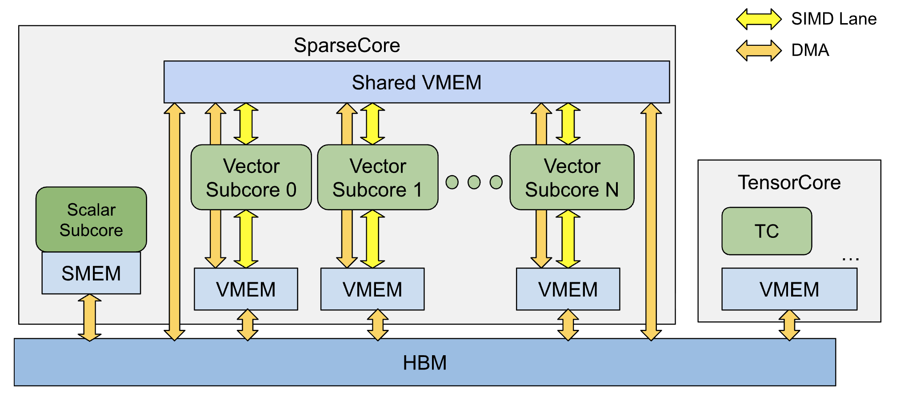

# SparseCore Kernel 编写指南

[SparseCore](https://openxla.org/xla/sparsecore) 专门处理稀疏内存访问和运算，在现代 TPU 的多个版本中都是核心组件。虽然大部分矩阵乘法和计算密集型工作由 TensorCore 完成，但将某些计算卸载到 SparseCore 可以提升整体性能。

本指南将概述 SparseCore 硬件架构，并展示如何编写在 TPU SparseCore 上运行的 Pallas kernel。

```python
from functools import partial
import jax
from jax.experimental import pallas as pl
from jax.experimental.pallas import tpu as pltpu
from jax.experimental.pallas import tpu_sc as plsc
import jax.numpy as jnp
import numpy as np

assert pltpu.get_tpu_info().sparse_core is not None, "No SparseCore found"
```

## 硬件概述

根据版本不同，一个 TPU 芯片可能包含 2 或 4 个 SparseCore。每个 SparseCore 由多个 subcore 组成，每个 subcore 拥有独立的 VMEM 空间。下图展示了 TPU 内部 SparseCore 的结构：



各组件说明：

- **Vector subcore（tiles）**：SparseCore 的向量处理子核心。每个 subcore 有独立的内存，数据流彼此独立。

- **Lanes（SIMD 宽度）**：SC vector subcore 以"单指令多数据"（SIMD）方式对大小为 N 的向量执行计算。一条 lane 中的所有数据在单条指令中同时处理。

- **Scalar subcore**：SparseCore 的标量处理子核心，支持标量运算、动态索引以及发起 DMA 和 stream 操作。

- **Memory spaces**：每个 vector subcore 拥有独立的 VMEM 和 SMEM（图中未标注）空间，此外还可以访问共享的 VMEM 空间。Scalar subcore 有自己的 SMEM。所有这些空间都与 TPU 的 HBM 相连。

  - 在 Pallas 中，VMEM 空间表示为 `pltpu.VMEM` 和 `pltpu.VMEM_SHARED`，SMEM 表示为 `pltpu.SMEM`。

  - 在其他文档中，共享 VMEM 通常称为"SPMEM"，而每个 subcore 的 VMEM 称为"TileSPMEM"或"local SPMEM"。

实际规格因 TPU 版本而异。以下是一些已公开的 TPU 规格：

| 属性 | TPU v4 | TPU v5p | TPU v6e (Trillium) | TPU 7x (Ironwood) |
|---|---|---|---|---|
| SparseCore / 芯片 | 4 | 4 | 2 | 2（4 个物理核心） |
| Vector subcore / SparseCore | 16 | 16 | 16 | 16 |
| SIMD 宽度 | 8 | 8 | 8 (F32) / 16 (BF16) | 16 (F32) / 32 (BF16) |
| HBM 容量 | 32 GiB | 96 GiB | 32 GiB | 192 GB |

也可以使用 `pltpu.get_tpu_info()` 快速获取当前硬件的规格信息。

```python
# 快速查询基本 SC 信息

assert (sc_info := pltpu.get_tpu_info().sparse_core)
print(f"SparseCore info for TPU {pltpu.get_tpu_info().chip_version}:")
print(sc_info)
```

```
SparseCore info for TPU 7x:
SparseCoreInfo(num_cores=2, num_subcores=16, num_lanes=16, dma_granule_size_bytes=64)
```

## 运算与适用场景

一个 SparseCore 包含 16 个较小的处理单元，每个单元有独立的数据流。这使其擅长具有以下特征的工作负载：

- 高度并行且不规则
- 随机数据访问
- 中等到较低的计算量
- 频繁的数据通信

SparseCore 上的一些常用操作包括：

- 小规模向量算术运算
- Gather 和 scatter（索引取值与写入）
- 排序、去重、计数、直方图
- Ragged 操作

## 表达 SparseCore 硬件

与 TensorCore 类似，Pallas 使用 mesh 来表达 SparseCore 中的计算单元。根据要使用的处理单元类型，创建 `ScalarSubcoreMesh` 或 `VectorSubcoreMesh`。

注意 `VectorSubcoreMesh` 有两个维度——`core` 表示不同的 SparseCore，`subcore` 表示每个 SparseCore 上的多个子核心。

这允许你将 TensorCore 的编程模型应用到 SparseCore 上编写集合通信操作。如需了解更多，请参阅 [集合通信指南](https://docs.jax.dev/en/latest/pallas/tpu/distributed.html)。

```python
scalar_mesh = plsc.ScalarSubcoreMesh(
    axis_name="core", num_cores=sc_info.num_cores
)
print(scalar_mesh)

vector_mesh = plsc.VectorSubcoreMesh(
    core_axis_name="core", subcore_axis_name="subcore"
)
print(vector_mesh)
```

```
ScalarSubcoreMesh(axis_name='core', num_cores=2)
VectorSubcoreMesh(core_axis_name='core', subcore_axis_name='subcore', num_cores=2, num_subcores=16)
```

## 基本 SparseCore kernel

以下是一个简单的 scalar subcore kernel，包含 DMA、按核心定制和计算操作。注意 scalar subcore 只能执行标量运算。

```python
@jax.jit
def cumsum(x):
  @pl.kernel(
      out_shape=x,
      mesh=scalar_mesh,
      scratch_shapes=[
          pltpu.SMEM((x.shape[1],), x.dtype),
          pltpu.SemaphoreType.DMA,
      ],
  )
  def kernel(x_ref, o_ref, tmp_ref, sem):
    idx = jax.lax.axis_index('core')
    pltpu.async_copy(x_ref.at[idx], tmp_ref, sem).wait()

    @pl.loop(1, x.shape[1])
    def _(i):
      tmp_ref[i] += tmp_ref[i - 1]

    pltpu.async_copy(tmp_ref, o_ref.at[idx], sem).wait()

  return kernel(x)


x_shape = (sc_info.num_cores, sc_info.num_lanes)
x = jax.random.randint(jax.random.key(0), x_shape, 0, 64, jnp.int32)
np.testing.assert_array_equal(cumsum(x), jnp.cumsum(x, axis=1))
```

## SparseCore kernel 中的流水线

你可以使用 `pltpu.emit_pipeline` 编写流水线化的 SparseCore kernel。`emit_pipeline` 的 `core_axis_name` 和 `dimension_semantics` 参数用于在 SparseCore/subcore 之间划分流水线。

```python
SC_REG_OP_SHAPE = (1, sc_info.num_lanes)
dma_block = (8, 128)


@jax.jit
def sc_add_one(x):
  @pl.kernel(out_shape=x, mesh=vector_mesh, scratch_shapes=[])
  def sc_add_one_kernel(x_hbm_ref, o_hbm_ref):
    in_shape = x_hbm_ref.shape

    def sc_add_one_body(in_vmem, out_vmem):
      @pl.loop(0, in_vmem.shape[0], step=SC_REG_OP_SHAPE[0])
      def _(c0):
        @pl.loop(0, in_vmem.shape[1], step=SC_REG_OP_SHAPE[1])
        def _(c1):
          slc = (pl.ds(c0, SC_REG_OP_SHAPE[0]), pl.ds(c1, SC_REG_OP_SHAPE[1]))
          out_vmem.at[*slc][...] = in_vmem.at[*slc][...] + 1

    pltpu.emit_pipeline(
        sc_add_one_body,
        grid=(in_shape[0] // dma_block[0], in_shape[1] // dma_block[1]),
        in_specs=[
            pl.BlockSpec(block_shape=dma_block, index_map=lambda i, j: (i, j))
        ],
        out_specs=[
            pl.BlockSpec(block_shape=dma_block, index_map=lambda i, j: (i, j))
        ],
        core_axis_name=('core', 'subcore'),
        dimension_semantics=(pltpu.PARALLEL, pltpu.PARALLEL),
    )(x_hbm_ref, o_hbm_ref)

  return sc_add_one_kernel(x)


x = jax.random.randint(jax.random.key(0), (4096, 128), 0, 64, jnp.int32)
y = sc_add_one(x)
np.testing.assert_array_equal(y, x + 1)
```

或者，你也可以使用 `axis_index` 计算核心索引，并用它在各核心之间分配工作（示例见[此处](https://docs.jax.dev/en/latest/pallas/tpu/core_map.html#mapping-over-sparsecores)）。

## 重叠 TensorCore 和 SparseCore

将 TensorCore 和 SparseCore 的 kernel 重叠执行非常简单：只需将它们放在同一个 `jax.jit` 中即可。XLA 编译器会处理它们的调度。

```python
@jax.jit
def tc_add_one(x):
  return x + 1


np.testing.assert_array_equal(tc_add_one(x), jnp.add(x, 1))


@jax.jit
def two_add_ones(x):
  return sc_add_one(x), tc_add_one(x)


jax.tree.map(np.testing.assert_array_equal, two_add_ones(x), (x + 1, x + 1));
```

以下基准测试显示，两者合并执行的总时间小于分别执行之和：

```python
%timeit sc_add_one(x).block_until_ready()
%timeit tc_add_one(x).block_until_ready()

%timeit jax.block_until_ready(two_add_ones(x))
```

```
120 us +- 2.46 us per loop (mean +- std. dev. of 7 runs, 10000 loops each)
113 us +- 5.61 us per loop (mean +- std. dev. of 7 runs, 10000 loops each)
199 us +- 2.24 us per loop (mean +- std. dev. of 7 runs, 10000 loops each)
```

## Gather 和 Scatter

SparseCore 对索引取值和更新有专门的优化操作。给定一个 HBM 中的输入或输出 ref（名为 `data`）和一个 VMEM 中的索引数组（名为 `indices`），它可以快速从 `data[indices]` 读取（"gather"）或向其写入（"scatter"）。

我们可以在 `async_copy` 或 `sync_copy` 中通过用索引 Ref 对 Ref 进行索引来使用这些 gather/scatter 操作。例如，`sync_copy(data_ref.at[indices_ref], target_ref)` 会触发一次 gather。

以下 kernel 通过流水线将索引加载到 vector subcore 的 VMEM 中。在循环体中，使用这些索引执行 gather 操作。

```python
batch_size = 4096
value_dim = 128
gather_window_size = 128
num_steps = 1024
sc_num_cores, sc_num_subcores = sc_info.num_cores, sc_info.num_subcores
num_indices = gather_window_size * sc_num_cores * sc_num_subcores * num_steps
x = jnp.arange(batch_size * value_dim).reshape(batch_size, value_dim)
indices = jax.random.randint(
    jax.random.key(0), (num_indices,), 0, batch_size, jnp.int32
)


@jax.jit
def gather(x, indices):
  indices = indices.reshape((1, num_indices))

  @pl.kernel(
      out_shape=jax.ShapeDtypeStruct((num_indices, value_dim), x.dtype),
      mesh=vector_mesh,
  )
  def kernel(x_hbm, i_hbm, o_hbm):
    def body(i_vmem, o_vmem):
      pltpu.sync_copy(x_hbm.at[i_vmem.at[0]], o_vmem)  # gather 操作

    pltpu.emit_pipeline(
        body,
        grid=(num_indices // gather_window_size,),
        in_specs=[
            pl.BlockSpec((1, gather_window_size), index_map=lambda i: (0, i))
        ],
        out_specs=[
            pl.BlockSpec(
                (gather_window_size, value_dim), index_map=lambda i: (i, 0)
            )
        ],
        core_axis_name='subcore',
        dimension_semantics=(pltpu.PARALLEL,),
    )(i_hbm, o_hbm)

  return kernel(x, indices)


out = gather(x, indices)
np.testing.assert_array_equal(out, jnp.take(x, indices, axis=0))
```

如果你在 kernel 开头做索引取值，可以使用 `plsc.BlockSpec` 的 `indexed_by` 和 `indexed_dim` 参数，在顶层 `pl.pallas_call` 中将另一个输入作为当前输入在指定轴上的索引。

这个调用会将 HBM 到 VMEM 的 DMA 和执行索引查找的 gather 操作并行化，从而形成 4 个流水线阶段：索引拷入、gather、kernel 计算和输出拷出。这允许 gather 操作和后续对 gather 结果的计算重叠执行。

注意 `plsc.BlockSpec` 是实验性 API，可能会有变动。

```python
@jax.jit
def gather_add_one(x, indices):
  @partial(
      pl.pallas_call,
      out_shape=jax.ShapeDtypeStruct((num_indices, value_dim), x.dtype),
      grid=(num_indices // gather_window_size,),
      in_specs=(
          plsc.BlockSpec(
              (gather_window_size, value_dim), indexed_by=1, indexed_dim=0
          ),
          pl.BlockSpec((gather_window_size,), lambda i: i),
      ),
      out_specs=pl.BlockSpec((gather_window_size, value_dim), lambda i: (i, 0)),
      compiler_params=pltpu.CompilerParams(
          kernel_type=pltpu.CoreType.SC_VECTOR_SUBCORE,
          dimension_semantics=(pltpu.PARALLEL,),
      ),
  )
  def kernel(gathered_ref, _, o_ref):
    # gathered_ref 是 x[indices] 的 gather 结果
    @pl.loop(0, gather_window_size)
    def _(c0):
      @pl.loop(0, o_ref.shape[1], step=16)
      def _(c1):
        slc = (pl.ds(c0, 1), pl.ds(c1, 16))
        o_ref.at[*slc][...] = gathered_ref.at[*slc][...] + 1

  return kernel(x, indices)


out = gather_add_one(x, indices)
np.testing.assert_array_equal(out, jnp.take(x, indices, axis=0) + 1)
```

Scatter（索引覆盖写入）是 gather 的逆操作。示例 kernel 如下：

```python
@jax.jit
def scatter(x, indices):
  indices = indices.reshape((1, num_indices))

  @pl.kernel(
      out_shape=jax.ShapeDtypeStruct((batch_size, value_dim), x.dtype),
      mesh=vector_mesh,
      scratch_shapes=[],
  )
  def kernel(x_hbm, i_hbm, o_hbm):
    def body(x_vmem, i_vmem):
      pltpu.sync_copy(x_vmem, o_hbm.at[i_vmem.at[0]])  # scatter 操作

    pltpu.emit_pipeline(
        body,
        grid=(num_indices // gather_window_size,),
        in_specs=[
            pl.BlockSpec(
                (gather_window_size, value_dim), index_map=lambda i: (i, 0)
            ),
            pl.BlockSpec(
                (
                    1,
                    gather_window_size,
                ),
                index_map=lambda i: (0, i),
            ),
        ],
        out_specs=[],
        core_axis_name='subcore',
        dimension_semantics=(pltpu.PARALLEL,),
    )(x_hbm, i_hbm)

  return kernel(x, indices)


gathered = jnp.take(x, indices, axis=0)
out = scatter(gathered, indices)
np.testing.assert_array_equal(out, x)
```

## 与 TensorCore 的基准对比

SparseCore 在 gather 和 scatter 操作上表现尤为出色。我们可以用默认运行在 TensorCore 上的原生 JAX API 实现相同功能，并比较结果。

```python
%timeit jax.block_until_ready(gather(x, indices))

gather_tc = jax.jit(lambda x, i: jnp.take(x, i, axis=0))
gather_tc(x, indices).block_until_ready()

%timeit jax.block_until_ready(gather_tc(x, indices))
```

```
4.05 ms +- 2.02 us per loop (mean +- std. dev. of 7 runs, 100 loops each)
18.1 ms +- 5.24 us per loop (mean +- std. dev. of 7 runs, 100 loops each)
```
