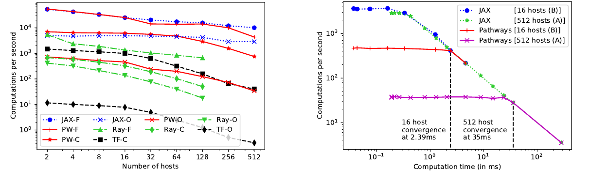
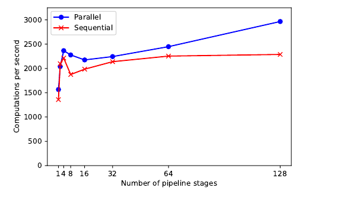
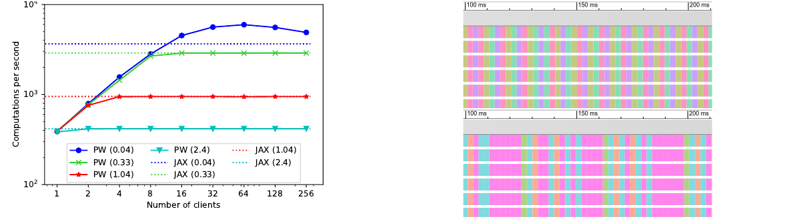
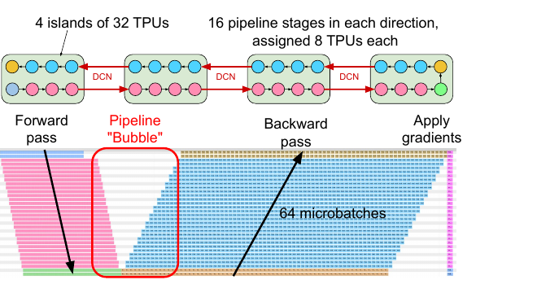
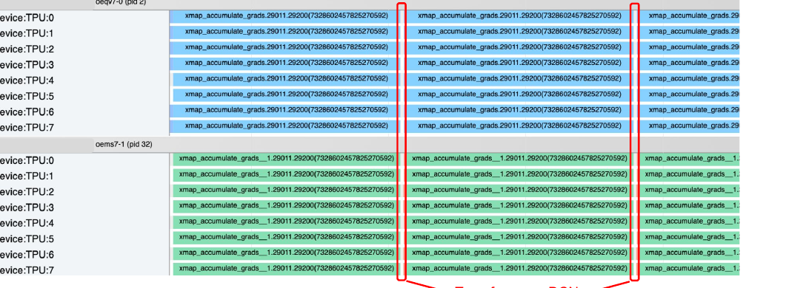

## TL;DR

Pathways 不是一个模型，也不是某一种并行策略，而是 Google 为下一代大规模 AI workload 设计的分布式运行时系统。

它试图把几件事情统一起来：

- 单控制器的全局视野
- 多控制器系统的高性能 dispatch
- SPMD 的高效 collective 执行
- MPMD 的灵活表达能力
- pipeline、MoE、稀疏模型中的复杂依赖
- 跨多个 accelerator island 的资源管理

一句话概括：Pathways 想让复杂、稀疏、异构、多任务的模型，能够像传统 SPMD 模型一样高效运行。

## 1. 背景：Pathways 想解决什么问题

大模型训练和推理不只是模型结构问题，也是运行时系统问题。

当模型从单机扩展到几百、几千个加速器时，系统需要回答几个问题：

- 程序如何被派发到设备上？
- 数据如何在设备之间移动？
- 不同设备是否运行同一段程序？
- 控制逻辑在一个进程里，还是分散在多个 host 上？
- 稀疏模型、流水线并行、多任务共享资源时，谁来统一调度？

Pathways 论文讨论的正是这些问题。Google 2021 年的 blog 从 AI 架构愿景出发，强调未来系统需要支持多任务、多模态和稀疏激活；2022 年的 MLSys 论文则进一步回答了一个更底层的问题：要让这些 workload 真的高效跑起来，分布式运行时应该长什么样。

## 2. 运行时基础概念

### 2.1 IFRT：分布式数组和异步执行抽象

IFRT 更贴近 JAX 侧看到的分布式执行语义。

它抽象的是“一个分布式程序如何看待设备、数组和异步计算”：

- 一个逻辑数组如何被切分到多个设备上
- 分片数组如何表示
- 数据如何 reshard
- 计算结果什么时候 ready
- 异步执行如何暴露给上层

也就是说，IFRT 关注的是上层分布式数组和执行模型。它让 JAX 这类前端可以用更统一的方式描述 array、sharding、device、executable 和 future，而不用直接面对每个硬件后端的具体运行细节。

在这篇文章里，可以先把 IFRT 看作“分布式数组和异步执行的抽象层”。

### 2.2 PJRT：设备运行时接口和后端实现

PJRT 位于 IFRT 抽象和具体硬件后端之间，可以理解为 OpenXLA 生态里的设备 runtime 接口。

它负责把上层已经表达清楚的计算和数据操作，落到具体设备后端上执行：

- 上层是 JAX/IFRT 这类分布式数组和执行抽象
- 中间是 XLA 编译产物和 PJRT runtime
- 下层是 CPU、GPU、TPU 以及各类 PJRT plugin

PJRT 的目标是让框架不必直接理解每一种硬件的细节。框架通过统一接口调用设备，硬件厂商或后端实现者负责提供对应的 PJRT plugin。

可以粗略理解为：

- IFRT 偏上层分布式数组与执行抽象
- PJRT 偏底层设备 runtime 接口和后端实现

### 2.3 Pathways client：IFRT 的一种实现

有了 IFRT 和 PJRT 之后，就可以更准确地描述 Pathways client 的位置。

Pathways client 可以看作 IFRT 的一种实现。JAX 程序在上层仍然面对 IFRT 所抽象出来的 device、array、sharding、executable 和异步执行语义；但这些操作不再只是落到一个普通 PJRT plugin 上，而是被转交给 Pathways 的单控制器分布式运行时。

可以粗略画成：

```text
JAX program
  ↓
IFRT API / IFRT abstraction
  ↓
Pathways client
  ↓
Pathways resource manager / workers
  ↓
TPU
```

所以，Pathways client 不应该简单理解为“又一个 PJRT plugin”。它不只是把计算发到某个设备后端，还要把 JAX 侧的分布式数组和异步执行抽象，映射到 Pathways 的资源管理、worker 调度、跨 accelerator island 执行和异步 dataflow 机制上。

这也有助于理解 Pathways 所处的位置：Pathways 不是单纯的编译器，也不是单纯的模型框架，而是连接编译结果、设备、分布式调度和运行时执行的系统层。

## 3. 分布式执行模型

### 3.1 SPMD：所有设备运行同一份程序

SPMD 是 Single Program Multiple Data。

它的基本模式是：所有设备运行同一段程序，但处理不同的数据分片。

典型例子包括：

- 数据并行
- 张量并行
- 大规模 AllReduce
- JAX `pmap` / `pjit` 风格的同构分布式计算

SPMD 的优点是简单、高效，容易和 collective 通信配合。

但它也有局限：当模型出现流水线、稀疏路由、MoE、跨多个设备岛的异构计算时，“所有设备做同一件事”就不再自然。

### 3.2 MPMD：不同设备运行不同程序

MPMD 是 Multiple Program Multiple Data。

它允许不同设备运行不同的子程序。

典型例子包括：

- pipeline parallelism：不同 stage 运行模型不同层
- MoE：不同专家只处理被路由到的 token
- 多任务模型：不同任务调用不同子网络
- 跨多个 accelerator island 的异构执行

MPMD 更灵活，但系统复杂度也更高。

它要求运行时能处理：

- 不同计算之间的依赖
- 跨设备、跨 host 的数据传输
- 非对称的执行时间
- 动态或稀疏的计算路径
- 更复杂的调度和资源管理

Pathways 的重要动机之一，就是让这类非 SPMD 计算更容易表达和高效执行。

### 3.3 Shardy:MPMD：把 MPMD 编译成 SPMD fragments

OpenXLA Shardy 后续的 MPMD RFC 可以看作这条路线在编译器栈里的延续。

它的核心观点是：MPMD 程序可以表示成一组 SPMD computation units，也就是 fragments，再加上这些 fragments 之间的数据传输。每个 fragment 被分配到一个设备 mesh 上，fragment 内部仍然可以使用 Shardy 做 SPMD sharding propagation；fragment 之间则由 MPMD 层负责 mesh assignment、transfer insertion 和 pipeline scheduling。

这和 Pathways 论文里的系统动机是对齐的。Pathways 论文强调未来 workload 需要 MPMD、pipeline、跨 island 执行和异构资源管理；Shardy:MPMD 则进一步把“如何表达和编译 MPMD 程序”做成 MLIR 层的机制。

Shardy:MPMD 的几个关键 pass 包括：

- Mesh assignment：把带 label 的 computation 分配到用户指定的 mesh
- Mesh inference：对未标注的 op 自动补全 mesh assignment，并尽量减少 transfer
- Fragment scheduling：应用用户提供的 pipeline schedule，例如 1F1B 或 Near Zero Bubble
- Fragment merging：把细粒度 fragments 合并成更适合执行的计算单元
- SPMD sharding propagation：在整个 MPMD 程序内继续使用 Shardy 做 SPMD 分片传播
- Export：把结果准备成后端可以继续编译或执行的 IR

从用户视角看，Shardy:MPMD 试图保留 single-device programming semantics：用户在原始程序里给某些部分加上 `named_computation`，再提供 name-to-mesh 的 assignment map，编译器负责把它变成 MPMD fragments 和 transfers。

这也说明 SPMD 和 MPMD 不是互斥关系。更准确的说法是：MPMD 可以由多个 SPMD 子程序组合而成。Pathways 负责运行时调度和跨 mesh 执行，Shardy:MPMD 负责在编译器层把程序切成可调度、可传输、可继续做 SPMD sharding 的 fragments。

## 4. 控制器架构

### 4.1 多控制器：高性能 SPMD 的常见选择

在多控制器系统中，每个 host 上都有一份用户程序或控制进程。

常见系统包括：

- MPI
- PyTorch 分布式训练
- JAX 多 host 运行模式
- 许多传统 TPU/GPU 分布式训练系统

它的优点是 dispatch 延迟低。每个 host 可以直接把计算派发给本地 accelerator。

这对 SPMD 很友好，因为所有 host 基本执行同样的步骤，跨设备通信主要依赖 collective。

但多控制器的问题是：

- 程序员需要显式处理很多跨 host 协调
- 非 SPMD 逻辑表达困难
- 资源通常被一个 job 独占
- 系统很难做统一调度、虚拟化和多任务共享
- pipeline、MoE、稀疏计算会变得复杂

### 4.2 单控制器：表达能力更强，传统实现性能较弱

单控制器系统中，一个 central coordinator 负责构建和调度整个分布式计算图。

典型例子可以参考 TensorFlow v1 的 graph execution 思路。

它的优点是：

- 可以统一看到整个计算图
- 更容易表达复杂依赖
- 更适合集中式资源管理
- 更容易做虚拟化和跨任务调度

但传统单控制器系统也有明显问题：

- 控制器到设备 host 的路径更长
- dispatch 可能经过 datacenter network
- 控制面延迟容易累积
- 对上千个 shard 展开完整图会产生巨大开销
- 如果没有统一 gang scheduling，多个并行计算之间可能难以协调

Pathways 的关键设计目标，就是重新设计单控制器系统，使它既有表达能力，又能接近多控制器系统的性能。

## 5. Pathways 的系统设计

### 5.1 目标：兼顾灵活性和性能

Pathways 论文的核心定位是：一个面向大规模 accelerator 的 orchestration layer。

它想解决的问题可以概括为：

- 支持当前主流 SPMD workload
- 支持未来更复杂的 MPMD workload
- 支持 pipeline、MoE、稀疏计算
- 支持跨多个 TPU pod / accelerator island
- 支持集中式资源管理和虚拟化
- 保持接近现有 state-of-the-art 系统的性能

这也是它和传统 JAX/PyTorch 多控制器模式、TensorFlow v1 单控制器模式的主要区别。

### 5.2 核心设计：异步分布式数据流

Pathways 使用 sharded dataflow graph 表达计算。

图中的节点是 sharded computation，边表示数据依赖。

关键点是：operator 消费和产生 future。

这意味着控制面不必等待真实数据传输和计算完成后才继续推进，而是可以基于 future 提前构建和调度后续计算。

这样可以减少传统单控制器系统中常见的 dispatch latency 累积问题。

### 5.3 Sharded Dataflow：避免把分片图完全展开

在上千个 accelerator 上，一个逻辑张量可能被切成上千个 shard。

如果系统把每个 shard 都显式展开成独立节点和边，图会迅速膨胀。

Pathways 使用 sharded dataflow graph，把一个分片计算作为一等对象表示。

这样可以：

- 降低 graph serialization 开销
- 降低 runtime 调度开销
- 更自然地表达大规模 SPMD 子计算
- 让 SPMD 和 MPMD 组合在同一个图里

### 5.4 Gang Scheduling：让协同计算按一致顺序运行

大规模 accelerator 计算中，很多 kernel 之间需要通信。

如果一组需要通信的计算没有被一致地调度，系统可能出现等待、阻塞，甚至死锁。

Pathways 引入 centralized scheduling 和 gang scheduling，用来保证相关 accelerator computation 被成组调度。

这对 TPU 尤其重要，因为 TPU kernel 通常不可抢占，而且很多通信依赖 collective 或专用互联。

## 6. Pathways in Practice

### 6.1 Pathways 和 JAX 的关系

Pathways 可以作为 JAX backend 使用。

用户可以继续写 JAX 程序，计算片段被编译成 XLA computation，然后交给 Pathways 执行。

Pathways 进一步提供 virtual device set，让用户可以指定一组虚拟设备，并把不同 compiled function 放到不同设备集合上。

这使得 JAX 程序不仅能表达传统 SPMD，也能表达更复杂的 pipeline 或跨多个 accelerator island 的计算。

### 6.2 Shardy:MPMD 和 Pathways 的关系

Pathways 论文提出的是运行时视角：如何用单控制器、异步 dataflow、gang scheduling 和 sharded graph 来运行复杂的 MPMD workload。

Shardy:MPMD RFC 补上的是编译器视角：如何从更自然的用户程序出发，生成一个由 SPMD fragments 和 transfers 组成的 MPMD 程序。

RFC 里提到，Shardy:MPMD 本身不绑定某个运行时；它是在 MLIR 层做 MPMD partitioning，可以 lower 到不同后端。不过当前实验路径是 lower 到 IFRT IR，并由 Pathways 执行。也就是说，二者可以这样理解：

```text
JAX / StableHLO program
  ↓
Shardy:MPMD
  ↓
SPMD fragments + transfers + schedule
  ↓
IFRT IR
  ↓
Pathways client / Pathways runtime
  ↓
TPU islands
```

这条链路把本文前面几个概念串起来了：Shardy:MPMD 负责把 MPMD 表达成编译器可处理的 fragments；IFRT IR 承接运行时无关的分布式执行表示；Pathways client 作为 IFRT 的一种实现，把这些 fragments 和 transfers 交给 Pathways runtime 调度执行。

### 6.3 从 Google Blog 看长期愿景

Google 的 blog 从 AI 架构角度解释 Pathways。

它希望未来 AI 系统具备三个特点：

- 多任务：一个系统处理许多任务，而不是一个模型只做一件事
- 多模态：同时理解文本、图像、语音、视频等输入
- 稀疏激活：不是每次调用整个模型，而是按需激活相关部分

这些目标从模型角度看是 generalist model、多模态模型、MoE 和稀疏计算。

从系统角度看，则需要运行时支持更复杂的 MPMD、动态路由、异构计算和资源共享。

这正是 Pathways 论文要解决的底层问题。

### 6.4 关键实验

论文里的实验主要想证明三件事：

- 单控制器架构不一定意味着低性能
- Pathways 可以高效支持多租户和 gang scheduling
- Pathways 可以把模型扩展到多个 TPU island，而不被 DCN 通信拖垮

第一组实验比较了 Pathways、JAX、TensorFlow 和 Ray 的 dispatch overhead。左图说明 Pathways 在单控制器系统里显著优于 TensorFlow/Ray，并且在 fused/chained workload 上接近多控制器 JAX；右图说明只要单个 computation 足够大，Pathways 的单控制器开销就可以被计算时间掩盖。



图源：Pathways 论文 Figure 5 和 Figure 6。

第二组实验对比了 sequential async dispatch 和 parallel async dispatch。随着 pipeline stage 数量增加，parallel dispatch 可以摊薄 client 和 scheduler 的固定开销，因此吞吐继续上升。



图源：Pathways 论文 Figure 7。

第三组实验验证多租户能力。多个 client 同时提交程序时，Pathways 可以在毫秒级把 gang-scheduled program 交错执行，提高 aggregate throughput，并接近或超过 JAX 的参考吞吐线。



图源：Pathways 论文 Figure 8 和 Figure 9。

第四组实验展示跨 accelerator island 的 pipeline。3B Transformer 被切到 4 个 island，每个 island 32 个 TPU，stage 之间通过 DCN 传输。论文报告这个配置可以达到和单 island 128 core 配置相同的 131.4k tokens/sec。



图源：Pathways 论文 Figure 10。

最后，论文还展示了更大的跨 island 训练 trace。64B Transformer 在两个 island 上做 data parallel，每个 island 512 个 TPU。红框标出 DCN transfer；论文报告这个跨 island 配置可以达到单 island 等效配置约 97.2% 的训练吞吐。



图源：Pathways 论文 Figure 12。

这些实验放在一起，说明 Pathways 的目标不是牺牲性能换表达能力，而是让单控制器系统也具备接近多控制器 SPMD 系统的性能，同时获得更强的 MPMD、pipeline、多租户和跨 island 调度能力。

## 7. 总结：Pathways 的本质

Pathways 的本质不是某个模型，也不是某种并行策略。

它是一个面向未来 ML workload 的分布式运行时系统。

它试图把几件事统一起来：

- 单控制器的全局视野
- 多控制器系统的高性能 dispatch
- SPMD 的高效 collective 执行
- MPMD 的灵活表达能力
- 稀疏模型和 pipeline 的复杂依赖
- 跨多个 accelerator island 的资源管理

如果用一句话总结：

Pathways 是 Google 为下一代大规模 AI workload 设计的异步分布式数据流运行时，它希望让复杂、稀疏、异构、多任务的模型能够像传统 SPMD 模型一样高效运行。

## 参考资料

- [Pathways: Asynchronous Distributed Dataflow for ML](https://arxiv.org/abs/2203.12533)
- [Introducing Pathways: A next-generation AI architecture](https://blog.google/innovation-and-ai/products/introducing-pathways-next-generation-ai-architecture/)
- [PJRT - Uniform Device API](https://openxla.org/xla/pjrt)
- [OpenXLA IFRT Client](https://github.com/openxla/xla/blob/main/xla/python/ifrt/client.h)
- [OpenXLA IFRT Array](https://github.com/openxla/xla/blob/main/xla/python/ifrt/array.h)
- [Shardy MPMD RFC](https://github.com/openxla/shardy/blob/main/rfcs/2025-06-18-mpmd-rfc.md)
